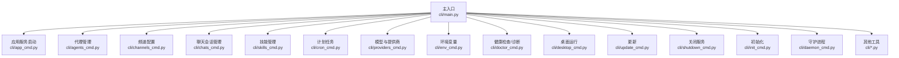
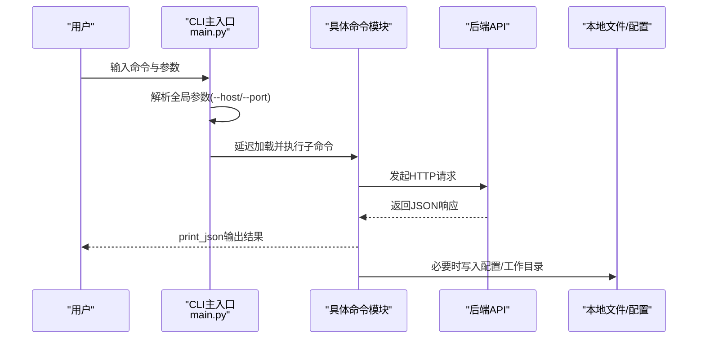
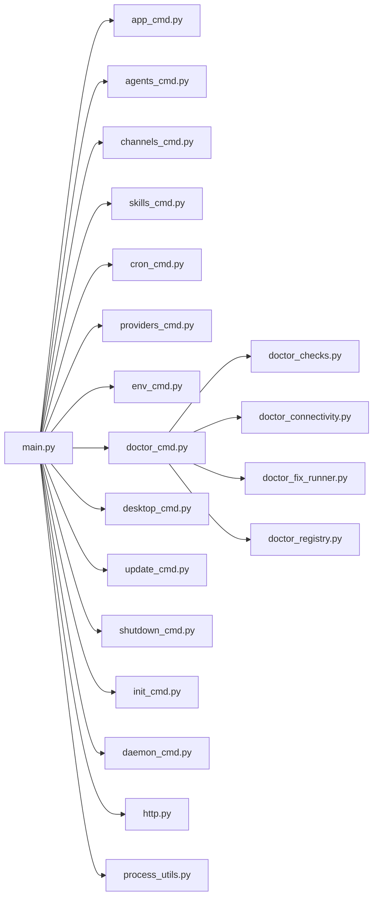

# CLI命令

<cite>
**本文引用的文件**
- [src/qwenpaw/cli/main.py](file://src/qwenpaw/cli/main.py)
- [src/qwenpaw/cli/agents_cmd.py](file://src/qwenpaw/cli/agents_cmd.py)
- [src/qwenpaw/cli/app_cmd.py](file://src/qwenpaw/cli/app_cmd.py)
- [src/qwenpaw/cli/channels_cmd.py](file://src/qwenpaw/cli/channels_cmd.py)
- [src/qwenpaw/cli/chats_cmd.py](file://src/qwenpaw/cli/chats_cmd.py)
- [src/qwenpaw/cli/clean_cmd.py](file://src/qwenpaw/cli/clean_cmd.py)
- [src/qwenpaw/cli/cron_cmd.py](file://src/qwenpaw/cli/cron_cmd.py)
- [src/qwenpaw/cli/daemon_cmd.py](file://src/qwenpaw/cli/daemon_cmd.py)
- [src/qwenpaw/cli/desktop_cmd.py](file://src/qwenpaw/cli/desktop_cmd.py)
- [src/qwenpaw/cli/doctor_cmd.py](file://src/qwenpaw/cli/doctor_cmd.py)
- [src/qwenpaw/cli/env_cmd.py](file://src/qwenpaw/cli/env_cmd.py)
- [src/qwenpaw/cli/init_cmd.py](file://src/qwenpaw/cli/init_cmd.py)
- [src/qwenpaw/cli/mission_cmd.py](file://src/qwenpaw/cli/mission_cmd.py)
- [src/qwenpaw/cli/plugin_commands.py](file://src/qwenpaw/cli/plugin_commands.py)
- [src/qwenpaw/cli/providers_cmd.py](file://src/qwenpaw/cli/providers_cmd.py)
- [src/qwenpaw/cli/shutdown_cmd.py](file://src/qwenpaw/cli/shutdown_cmd.py)
- [src/qwenpaw/cli/skills_cmd.py](file://src/qwenpaw/cli/skills_cmd.py)
- [src/qwenpaw/cli/task_cmd.py](file://src/qwenpaw/cli/task_cmd.py)
- [src/qwenpaw/cli/uninstall_cmd.py](file://src/qwenpaw/cli/uninstall_cmd.py)
- [src/qwenpaw/cli/update_cmd.py](file://src/qwenpaw/cli/update_cmd.py)
- [src/qwenpaw/cli/utils.py](file://src/qwenpaw/cli/utils.py)
- [src/qwenpaw/cli/http.py](file://src/qwenpaw/cli/http.py)
- [src/qwenpaw/cli/process_utils.py](file://src/qwenpaw/cli/process_utils.py)
- [src/qwenpaw/cli/doctor_checks.py](file://src/qwenpaw/cli/doctor_checks.py)
- [src/qwenpaw/cli/doctor_connectivity.py](file://src/qwenpaw/cli/doctor_connectivity.py)
- [src/qwenpaw/cli/doctor_fix_runner.py](file://src/qwenpaw/cli/doctor_fix_runner.py)
- [src/qwenpaw/cli/doctor_registry.py](file://src/qwenpaw/cli/doctor_registry.py)
</cite>

## 目录
1. [简介](#简介)
2. [项目结构](#项目结构)
3. [核心组件](#核心组件)
4. [架构总览](#架构总览)
5. [详细组件分析](#详细组件分析)
6. [依赖分析](#依赖分析)
7. [性能考虑](#性能考虑)
8. [故障排查指南](#故障排查指南)
9. [结论](#结论)
10. [附录](#附录)

## 简介
本文件为 QwenPaw 的命令行工具（CLI）完整使用文档，覆盖所有可用命令的语法、参数、使用示例与注意事项，并提供常见组合用法、批量操作技巧、输出格式、错误信息与调试选项说明。内容同时涵盖代理管理、应用控制、系统维护、故障诊断、代理聊天、频道配置、技能管理、计划任务、桌面运行、更新与关闭服务等主题。

## 项目结构
CLI 命令入口位于主模块，通过 Click 组织子命令；各功能域命令分别在独立文件中实现，如 agents、channels、skills、cron、models、env、doctor、desktop、update、shutdown 等。全局参数（如 --host、--port）在根命令解析后传递给各子命令。

图表来源
- [src/qwenpaw/cli/main.py:95-173](file://src/qwenpaw/cli/main.py#L95-L173)
- [src/qwenpaw/cli/app_cmd.py:15-112](file://src/qwenpaw/cli/app_cmd.py#L15-L112)
- [src/qwenpaw/cli/agents_cmd.py:445-800](file://src/qwenpaw/cli/agents_cmd.py#L445-L800)
- [src/qwenpaw/cli/channels_cmd.py:1-800](file://src/qwenpaw/cli/channels_cmd.py#L1-L800)
- [src/qwenpaw/cli/chats_cmd.py:15-276](file://src/qwenpaw/cli/chats_cmd.py#L15-L276)
- [src/qwenpaw/cli/skills_cmd.py:310-561](file://src/qwenpaw/cli/skills_cmd.py#L310-L561)
- [src/qwenpaw/cli/cron_cmd.py:27-690](file://src/qwenpaw/cli/cron_cmd.py#L27-L690)
- [src/qwenpaw/cli/providers_cmd.py:476-819](file://src/qwenpaw/cli/providers_cmd.py#L476-L819)
- [src/qwenpaw/cli/env_cmd.py:10-99](file://src/qwenpaw/cli/env_cmd.py#L10-L99)
- [src/qwenpaw/cli/doctor_cmd.py:1-800](file://src/qwenpaw/cli/doctor_cmd.py#L1-L800)
- [src/qwenpaw/cli/desktop_cmd.py:131-319](file://src/qwenpaw/cli/desktop_cmd.py#L131-L319)
- [src/qwenpaw/cli/update_cmd.py:631-731](file://src/qwenpaw/cli/update_cmd.py#L631-L731)
- [src/qwenpaw/cli/shutdown_cmd.py:303-386](file://src/qwenpaw/cli/shutdown_cmd.py#L303-L386)
- [src/qwenpaw/cli/init_cmd.py:119-523](file://src/qwenpaw/cli/init_cmd.py#L119-L523)
- [src/qwenpaw/cli/daemon_cmd.py:48-117](file://src/qwenpaw/cli/daemon_cmd.py#L48-L117)

章节来源
- [src/qwenpaw/cli/main.py:95-173](file://src/qwenpaw/cli/main.py#L95-L173)

## 核心组件
- 全局参数与上下文
  - --host：API 主机，默认从上次运行或配置读取，否则默认 127.0.0.1
  - --port：API 端口，默认从上次运行或配置读取，否则默认 8088
  - 子命令通过 ctx.obj 获取 host/port 并用于 resolve_base_url
- 延迟加载组（LazyGroup）
  - 通过 LazyGroup 按需导入子命令模块，减少启动时延
- 输出与网络
  - 统一使用 print_json 输出标准 JSON
  - resolve_base_url 解析优先级：命令行 --base-url > 全局 --host/--port > 默认

章节来源
- [src/qwenpaw/cli/main.py:148-173](file://src/qwenpaw/cli/main.py#L148-L173)
- [src/qwenpaw/cli/http.py](file://src/qwenpaw/cli/http.py)

## 架构总览
CLI 通过 Click 定义命令树，主入口负责解析全局参数并延迟加载子命令；子命令通过 HTTP 客户端调用后端 API，部分命令直接操作本地配置与文件系统。

图表来源
- [src/qwenpaw/cli/main.py:95-173](file://src/qwenpaw/cli/main.py#L95-L173)
- [src/qwenpaw/cli/http.py](file://src/qwenpaw/cli/http.py)

## 详细组件分析

### 应用控制与服务管理
- 启动应用服务
  - 命令：qwenpaw app
  - 参数：
    - --host：绑定主机，默认 127.0.0.1
    - --port：绑定端口，默认 8088
    - --reload：启用自动重载（开发模式）
    - --log-level：日志级别，支持 critical/error/warning/info/debug/trace
    - --hide-access-paths：隐藏访问日志中的路径片段（可重复）
    - --workers：已弃用，始终单进程
  - 行为：持久化最近使用的 host/port；根据 log-level 设置环境变量；按需设置 QWENPAW_RELOAD_MODE；启动 uvicorn
  - 适用场景：启动后端服务，配合浏览器访问控制台或作为 API 服务
  - 注意事项：--workers 已弃用；生产建议固定 host/port 并设置合适日志级别
  - 示例：qwenpaw app --host 0.0.0.0 --port 8088 --log-level info

- 关闭服务
  - 命令：qwenpaw shutdown
  - 参数：
    - --port：目标后端端口，默认来自全局上下文
  - 行为：查找监听指定端口的后端进程及前端开发进程、桌面包装进程，优雅终止并回收进程树
  - 适用场景：强制停止正在运行的 QwenPaw 进程
  - 注意事项：可能影响进行中的请求与后台任务，请谨慎使用
  - 示例：qwenpaw shutdown --port 8088

- 桌面运行
  - 命令：qwenpaw desktop
  - 参数：
    - --host：服务绑定主机
    - --log-level：服务日志级别
  - 行为：自动选择空闲端口启动后端服务，打开原生 WebView 窗口；窗口关闭后清理后端进程
  - 适用场景：独立桌面窗口，避免与已有实例冲突
  - 注意事项：Windows 需要 pywebview 支持；SSL_CERT_FILE 可用于证书路径
  - 示例：qwenpaw desktop --host 127.0.0.1 --log-level info

- 初始化
  - 命令：qwenpaw init
  - 参数：
    - --force：覆盖现有配置与心跳文件
    - --defaults：非交互式默认配置（脚本友好）
    - --accept-security：跳过安全确认（与 --defaults 搭配）
  - 行为：创建默认工作区、迁移旧技能、初始化技能池、配置心跳、可选配置渠道、提供商、技能、环境变量、复制多语言 MD 文件、生成/覆盖 HEARTBEAT.md
  - 适用场景：首次安装或重装后的快速配置
  - 注意事项：默认会询问安全提示；--defaults 将采用默认值并跳过交互
  - 示例：qwenpaw init --defaults --accept-security

章节来源
- [src/qwenpaw/cli/app_cmd.py:15-112](file://src/qwenpaw/cli/app_cmd.py#L15-L112)
- [src/qwenpaw/cli/shutdown_cmd.py:303-386](file://src/qwenpaw/cli/shutdown_cmd.py#L303-L386)
- [src/qwenpaw/cli/desktop_cmd.py:131-319](file://src/qwenpaw/cli/desktop_cmd.py#L131-L319)
- [src/qwenpaw/cli/init_cmd.py:119-523](file://src/qwenpaw/cli/init_cmd.py#L119-L523)

### 代理管理与聊天
- 列表/创建/删除/聊天
  - 命令：qwenpaw agents list|create|delete|chat
  - list：
    - 功能：列出已配置代理（ID、名称、描述、工作区目录）
    - 参数：--base-url（覆盖 API 基础地址）
    - 输出：JSON
  - create：
    - 功能：创建新本地代理（含工作区初始化）
    - 关键参数：--name、--agent-id、--description、--workspace-dir、--language、--template、--skill（可多次）、--provider-id、--model-id
    - 行为：校验唯一性、构建激活模型配置、创建工作区目录、应用模板、保存配置
    - 注意事项：--provider-id 与 --model-id 必须成对出现
    - 示例：qwenpaw agents create --name "Research Bot" --agent-id research_bot --provider-id openai --model-id gpt-4
  - delete：
    - 功能：删除代理并可选删除本地工作区
    - 参数：--remove-workspace、--yes、--base-url
    - 行为：交互确认；可获取并校验工作区路径；删除后返回结果
    - 示例：qwenpaw agents delete research_bot --remove-workspace --yes
  - chat：
    - 功能：与另一个代理通信（支持流式/最终响应、后台任务、任务状态查询）
    - 关键参数：--from-agent/--agent-id、--to-agent、--text、--session-id、--mode（stream/final）、--background、--task-id、--timeout、--json-output、--base-url
    - 行为：校验参数；支持流式增量输出或收集完成后一次性输出；后台任务返回 task_id；可通过 --task-id 查询状态
    - 注意事项：--background 与 --mode stream 互斥；并发复用同一 session_id 可能失败
    - 示例：qwenpaw agents chat --from-agent bot_a --to-agent bot_b --text "你好" --mode final --json-output

- 聊天会话管理
  - 命令：qwenpaw chats list|get|create|update|delete
  - list：过滤 user_id 或 channel
  - get：查看聊天详情（含消息历史）
  - create：从 JSON 文件或内联参数创建
  - update：更新聊天名称
  - delete：删除聊天元数据（不清理会话状态）
  - 示例：qwenpaw chats create --session-id "discord:alice" --user-id alice --name "My Chat"

章节来源
- [src/qwenpaw/cli/agents_cmd.py:445-800](file://src/qwenpaw/cli/agents_cmd.py#L445-L800)
- [src/qwenpaw/cli/chats_cmd.py:15-276](file://src/qwenpaw/cli/chats_cmd.py#L15-L276)

### 频道配置与管理
- 命令：qwenpaw channels list|config|install|uninstall
- list：列出可用频道（内置+插件），敏感字段掩码显示
- config：交互式配置频道（iMessage、Discord、Telegram、钉钉、飞书、微信(iLink)、QQ、Console、Voice/Twilio 等）
- install/uninstall：安装/卸载频道插件模板
- 行为：读取可用频道清单，动态注册配置器；支持自定义频道类的配置器扩展
- 示例：qwenpaw channels config（交互式）

章节来源
- [src/qwenpaw/cli/channels_cmd.py:1-800](file://src/qwenpaw/cli/channels_cmd.py#L1-L800)

### 技能管理
- 命令：qwenpaw skills list|config|info|install|uninstall|test
- list：列出技能及其启用状态
- config：交互式选择启用/禁用技能（可从技能池下载到工作区）
- info：查看工作区技能详情（名称、来源、路径、描述、通道）
- install：从 Hub 导入技能（可直接安装到指定 agent 工作区）
- uninstall：从工作区或技能池卸载技能
- test：验证技能（检查 SKILL.md、扫描安全）
- 示例：qwenpaw skills install https://example.com/bundle --agent-id default --enable

章节来源
- [src/qwenpaw/cli/skills_cmd.py:310-561](file://src/qwenpaw/cli/skills_cmd.py#L310-L561)

### 计划任务（Cron）
- 命令：qwenpaw cron list|get|state|create|delete|pause|resume|run
- create：支持从 JSON 文件或内联参数创建；支持一次性与周期性调度；可配置重复策略（until/count）
- state：查看任务运行状态（队列、运行中、待定、提交中等）
- pause/resume：暂停/恢复任务
- run：立即触发一次运行
- 示例：qwenpaw cron create --type text --name "Daily Report" --schedule-type cron --cron "0 9 * * *" --channel console --target-user alice --target-session s1 --text "Good morning"

章节来源
- [src/qwenpaw/cli/cron_cmd.py:27-690](file://src/qwenpaw/cli/cron_cmd.py#L27-L690)

### 模型与提供商
- 命令：qwenpaw models list|config|config-key|set-llm|add-provider|remove-provider|add-model|remove-model|download|local
- list：展示所有提供商、模型与当前激活槽位
- config：交互式配置提供商（API Key、Base URL、添加模型、激活 LLM）
- config-key：仅配置 API Key
- set-llm：交互式设置当前激活模型
- add/remove-provider：增删自定义提供商
- add/remove-model：增删用户模型（除 Ollama 外）
- download：下载本地模型仓库（支持 HuggingFace/ModelScope）
- local：列出已下载本地模型
- 示例：qwenpaw models download TheBloke/Mistral-7B-Instruct-v0.2-GGUF --source huggingface

章节来源
- [src/qwenpaw/cli/providers_cmd.py:476-819](file://src/qwenpaw/cli/providers_cmd.py#L476-L819)

### 环境变量管理
- 命令：qwenpaw env list|set|delete
- list：列出所有环境变量
- set：设置 KEY VALUE
- delete：删除环境变量
- 示例：qwenpaw env set OPENAI_API_KEY sk-...

章节来源
- [src/qwenpaw/cli/env_cmd.py:10-99](file://src/qwenpaw/cli/env_cmd.py#L10-L99)

### 系统维护与清理
- 清理命令：qwenpaw clean
  - 功能：清理相关缓存/临时文件（具体行为由实现定义）
  - 适用场景：磁盘空间不足或需要清理无用文件时
  - 注意事项：谨慎使用，建议先备份重要数据
  - 示例：qwenpaw clean

- 卸载命令：qwenpaw uninstall
  - 功能：卸载/移除相关组件或配置
  - 适用场景：完全移除 QwenPaw 或特定组件
  - 注意事项：可能涉及数据删除，请确认后再执行
  - 示例：qwenpaw uninstall

- 任务管理：qwenpaw task
  - 功能：任务相关操作（如查询、取消、重试等）
  - 适用场景：批量或异步任务处理
  - 示例：qwenpaw task list

章节来源
- [src/qwenpaw/cli/clean_cmd.py](file://src/qwenpaw/cli/clean_cmd.py)
- [src/qwenpaw/cli/uninstall_cmd.py](file://src/qwenpaw/cli/uninstall_cmd.py)
- [src/qwenpaw/cli/task_cmd.py](file://src/qwenpaw/cli/task_cmd.py)

### 诊断与健康检查
- 命令：qwenpaw doctor
  - 行为：只读检查（配置、代理工作区、通道、MCP、技能布局、浏览器自动化、安全基线、内存嵌入、工作区整洁度、计划任务文件、工作目录可写、控制台静态文件、Web 认证、提供商概览、活动 LLM 连通性等）
  - --deep：深度检查（通道连通性等）
  - doctor fix：保守修复（带备份），支持 dry-run 与 --only 指定修复项
  - 示例：qwenpaw doctor --deep

- 诊断扩展：通过注册点扩展 doctor 检查项
  - 示例：qwenpaw doctor fix --dry-run --only ensure-working-dir,ensure-workspace-dirs

章节来源
- [src/qwenpaw/cli/doctor_cmd.py:1-800](file://src/qwenpaw/cli/doctor_cmd.py#L1-L800)
- [src/qwenpaw/cli/doctor_checks.py](file://src/qwenpaw/cli/doctor_checks.py)
- [src/qwenpaw/cli/doctor_connectivity.py](file://src/qwenpaw/cli/doctor_connectivity.py)
- [src/qwenpaw/cli/doctor_fix_runner.py](file://src/qwenpaw/cli/doctor_fix_runner.py)
- [src/qwenpaw/cli/doctor_registry.py](file://src/qwenpaw/cli/doctor_registry.py)

### 插件与工具
- 插件命令：qwenpaw plugin ...
  - 功能：插件相关操作（安装、卸载、启用、禁用等）
  - 适用场景：扩展功能或集成第三方能力
  - 示例：qwenpaw plugin install ...

- 任务与使命：qwenpaw task|mission
  - 功能：任务队列与使命执行相关命令
  - 适用场景：批量化与编排任务
  - 示例：qwenpaw task list

章节来源
- [src/qwenpaw/cli/plugin_commands.py](file://src/qwenpaw/cli/plugin_commands.py)
- [src/qwenpaw/cli/mission_cmd.py](file://src/qwenpaw/cli/mission_cmd.py)

### 更新与版本
- 命令：qwenpaw update
  - 行为：检测当前环境与安装来源；拉取最新版本；必要时探测并强制关闭运行中的服务；以子进程方式执行升级；支持前台/后台模式
  - 参数：--yes（跳过确认）
  - 注意事项：若检测到运行中的服务，会提示强制关闭；Windows 下更新会在当前终端退出后继续
  - 示例：qwenpaw update --yes

章节来源
- [src/qwenpaw/cli/update_cmd.py:631-731](file://src/qwenpaw/cli/update_cmd.py#L631-L731)

### 守护进程与日志
- 命令：qwenpaw daemon status|restart|reload-config|version|logs
  - status：显示守护进程配置、工作目录、内存管理器等
  - restart：打印重启说明（CLI 不直接重启进程）
  - reload-config：重新读取配置
  - version：显示版本与路径
  - logs：查看最后 N 行日志（默认 100，上限 2000）
  - 示例：qwenpaw daemon logs -n 200

章节来源
- [src/qwenpaw/cli/daemon_cmd.py:48-117](file://src/qwenpaw/cli/daemon_cmd.py#L48-L117)

## 依赖分析
- 组件耦合
  - main.py 通过 LazyGroup 与各子命令解耦，仅在调用时导入
  - 子命令普遍依赖 http.py 的客户端与 URL 解析工具
  - 诊断命令依赖 doctor_* 模块进行检查与修复
- 外部依赖
  - uvicorn（应用服务）
  - httpx（HTTP 客户端）
  - packaging（版本比较）
  - click（命令行框架）
  - pywebview（桌面运行）
- 循环依赖
  - 未发现明显循环导入；各子命令模块相对独立

图表来源
- [src/qwenpaw/cli/main.py:95-173](file://src/qwenpaw/cli/main.py#L95-L173)
- [src/qwenpaw/cli/http.py](file://src/qwenpaw/cli/http.py)
- [src/qwenpaw/cli/process_utils.py](file://src/qwenpaw/cli/process_utils.py)
- [src/qwenpaw/cli/doctor_cmd.py:1-800](file://src/qwenpaw/cli/doctor_cmd.py#L1-L800)

章节来源
- [src/qwenpaw/cli/main.py:95-173](file://src/qwenpaw/cli/main.py#L95-L173)

## 性能考虑
- 启动性能
  - 使用 LazyGroup 延迟加载子命令，降低冷启动时间
- I/O 与网络
  - 流式聊天（--mode stream）适合长文本生成，但会增加网络与终端输出开销
  - 后台任务（--background）适合长时间任务，避免阻塞 CLI
- 日志级别
  - 生产环境建议 info 或 warning，避免 debug/trace 的高开销
- 本地模型下载
  - 大模型下载耗时较长，建议在稳定网络下执行；可结合 --source 指定镜像源

## 故障排查指南
- 常见错误与提示
  - 404：资源不存在（如聊天、任务、代理）
  - 参数校验失败：缺少必需参数（如 --text、--session-id、--task-id 与 --background 的搭配）
  - 权限问题：工作目录不可写、代理工作区不在 WORKING_DIR 内
  - 代理配置错误：代理 ID 已存在、工作区路径非法
- 调试选项
  - --log-level debug/trace 提升日志详细度
  - doctor --deep 深度检查通道连通性与安全基线
  - doctor fix --dry-run 预览修复计划
- 进程与端口
  - 使用 qwenpaw shutdown 强制停止占用端口的进程
  - desktop 命令会自动选择空闲端口并清理后端进程
- 版本与更新
  - 使用 qwenpaw update 检测并升级；若检测到运行中的服务，按提示执行 shutdown

章节来源
- [src/qwenpaw/cli/agents_cmd.py:140-290](file://src/qwenpaw/cli/agents_cmd.py#L140-L290)
- [src/qwenpaw/cli/doctor_cmd.py:377-800](file://src/qwenpaw/cli/doctor_cmd.py#L377-L800)
- [src/qwenpaw/cli/shutdown_cmd.py:303-386](file://src/qwenpaw/cli/shutdown_cmd.py#L303-L386)
- [src/qwenpaw/cli/update_cmd.py:631-731](file://src/qwenpaw/cli/update_cmd.py#L631-L731)

## 结论
QwenPaw CLI 提供了从应用启动、代理管理、频道配置、技能与计划任务、诊断与维护到桌面运行与更新的完整命令集。通过合理的参数组合与批量操作技巧，可高效完成日常运维与开发任务。建议在生产环境中谨慎使用强制关闭与卸载命令，并定期使用 doctor 与 update 保持系统健康与最新。

## 附录

### 常用命令组合与批量操作技巧
- 批量技能管理
  - qwenpaw skills list 查看技能状态
  - qwenpaw skills config 交互式批量启用/禁用
  - qwenpaw skills install ... --agent-id default 批量导入技能到默认工作区
- 批量代理操作
  - qwenpaw agents list 查看代理
  - qwenpaw agents delete <id> --remove-workspace --yes 批量删除代理与工作区
- 批量计划任务
  - qwenpaw cron create ... --schedule-type cron --cron "0 9 * * *" 创建每日任务
  - qwenpaw cron pause/resume 控制任务开关
- 诊断与修复
  - qwenpaw doctor 预览健康状况
  - qwenpaw doctor fix --only ensure-working-dir,ensure-workspace-dirs 预览并应用修复

### 输出格式与错误信息
- 统一输出为 JSON，便于机器解析与管道处理
- 错误信息通过 click.echo(err=True) 输出到标准错误，包含明确的错误原因与修复建议

### 自动补全与配置文件管理
- 自动补全
  - Click 支持 Bash/Zsh/Fish 等 Shell 的自动补全；请参考 Click 文档生成对应补全脚本
- 配置文件
  - config.json：核心配置（工作目录、心跳、代理、技能、提供商、通道等）
  - HEARTBEAT.md：心跳检查清单
  - 环境变量：通过 qwenpaw env 管理
- 环境变量设置
  - LOG_LEVEL_ENV：日志级别
  - SSL_CERT_FILE：HTTPS 证书路径（桌面运行时）
  - QWENPAW_RELOAD_MODE：开发模式下的重载标志

章节来源
- [src/qwenpaw/cli/env_cmd.py:10-99](file://src/qwenpaw/cli/env_cmd.py#L10-L99)
- [src/qwenpaw/cli/init_cmd.py:119-523](file://src/qwenpaw/cli/init_cmd.py#L119-L523)
- [src/qwenpaw/cli/desktop_cmd.py:131-319](file://src/qwenpaw/cli/desktop_cmd.py#L131-L319)