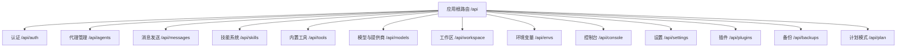
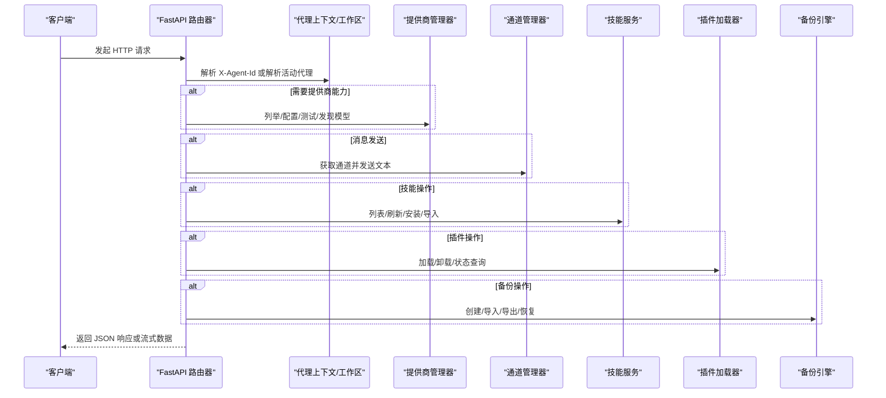
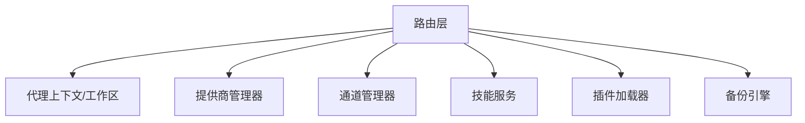

# RESTful API

<cite>
**本文引用的文件**
- [src/qwenpaw/app/routers/__init__.py](file://src/qwenpaw/app/routers/__init__.py)
- [src/qwenpaw/app/routers/auth.py](file://src/qwenpaw/app/routers/auth.py)
- [src/qwenpaw/app/routers/agents.py](file://src/qwenpaw/app/routers/agents.py)
- [src/qwenpaw/app/routers/messages.py](file://src/qwenpaw/app/routers/messages.py)
- [src/qwenpaw/app/routers/skills.py](file://src/qwenpaw/app/routers/skills.py)
- [src/qwenpaw/app/routers/tools.py](file://src/qwenpaw/app/routers/tools.py)
- [src/qwenpaw/app/routers/providers.py](file://src/qwenpaw/app/routers/providers.py)
- [src/qwenpaw/app/routers/workspace.py](file://src/qwenpaw/app/routers/workspace.py)
- [src/qwenpaw/app/routers/envs.py](file://src/qwenpaw/app/routers/envs.py)
- [src/qwenpaw/app/routers/console.py](file://src/qwenpaw/app/routers/console.py)
- [src/qwenpaw/app/routers/settings.py](file://src/qwenpaw/app/routers/settings.py)
- [src/qwenpaw/app/routers/plugins.py](file://src/qwenpaw/app/routers/plugins.py)
- [src/qwenpaw/app/routers/backup.py](file://src/qwenpaw/app/routers/backup.py)
- [src/qwenpaw/app/routers/plan.py](file://src/qwenpaw/app/routers/plan.py)
</cite>

## 目录
1. [简介](#简介)
2. [项目结构](#项目结构)
3. [核心组件](#核心组件)
4. [架构总览](#架构总览)
5. [详细组件分析](#详细组件分析)
6. [依赖分析](#依赖分析)
7. [性能考虑](#性能考虑)
8. [故障排查指南](#故障排查指南)
9. [结论](#结论)
10. [附录](#附录)

## 简介
本文件为 QwenPaw 的 RESTful API 接口文档，覆盖认证与授权、代理管理、消息通道、技能系统、工具管理、模型与提供商、工作区与文件、环境变量、控制台聊天与推送、设置、插件、备份与恢复、计划模式等模块的全部 HTTP 端点。文档提供每个接口的请求方法、URL 路径、请求参数、响应格式、状态码、用途说明、错误处理策略，并给出常见使用场景与调试建议。

## 项目结构
后端基于 FastAPI 构建，统一挂载在根路由 /api 下，按功能域拆分多个子路由（如 /api/auth、/api/agents、/api/messages 等）。主路由器负责聚合各子路由，形成完整的 API 命名空间。

图表来源
- [src/qwenpaw/app/routers/__init__.py](file://src/qwenpaw/app/routers/__init__.py)

章节来源
- [src/qwenpaw/app/routers/__init__.py](file://src/qwenpaw/app/routers/__init__.py)

## 核心组件
- 认证与授权：支持登录、注册、令牌校验、更新资料、撤销令牌与全部令牌。
- 代理管理：创建、查询、更新、删除、启用/禁用代理，维护代理顺序。
- 消息通道：通过指定渠道向用户发送文本消息。
- 技能系统：列出/刷新工作区与技能池、从 Hub 安装、搜索、导入任务状态查询。
- 工具管理：查看/切换/异步执行、读取/更新工具配置。
- 模型与提供商：列出/配置提供商、测试连接、发现模型、增删模型、配置模型参数、设置/获取当前生效模型。
- 工作区：列出/读写工作区与内存目录下的 Markdown 文件；语言与音频转录配置；打包/上传工作区；运行配置与系统提示文件管理。
- 环境变量：批量保存、删除单个环境变量。
- 控制台：SSE 流式聊天、停止会话、上传媒体、拉取推送消息与审批、收件箱事件列表与标记已读、删除事件与关联追踪。
- 设置：UI 语言设置。
- 插件：列出加载的插件、从路径/URL/上传安装、卸载、查询状态。
- 备份：创建备份（SSE 进度流）、列出、删除、导入（含冲突处理）、导出、恢复。
- 计划模式：读取当前计划、启用/禁用计划配置、SSE 实时订阅。

章节来源
- [src/qwenpaw/app/routers/auth.py](file://src/qwenpaw/app/routers/auth.py)
- [src/qwenpaw/app/routers/agents.py](file://src/qwenpaw/app/routers/agents.py)
- [src/qwenpaw/app/routers/messages.py](file://src/qwenpaw/app/routers/messages.py)
- [src/qwenpaw/app/routers/skills.py](file://src/qwenpaw/app/routers/skills.py)
- [src/qwenpaw/app/routers/tools.py](file://src/qwenpaw/app/routers/tools.py)
- [src/qwenpaw/app/routers/providers.py](file://src/qwenpaw/app/routers/providers.py)
- [src/qwenpaw/app/routers/workspace.py](file://src/qwenpaw/app/routers/workspace.py)
- [src/qwenpaw/app/routers/envs.py](file://src/qwenpaw/app/routers/envs.py)
- [src/qwenpaw/app/routers/console.py](file://src/qwenpaw/app/routers/console.py)
- [src/qwenpaw/app/routers/settings.py](file://src/qwenpaw/app/routers/settings.py)
- [src/qwenpaw/app/routers/plugins.py](file://src/qwenpaw/app/routers/plugins.py)
- [src/qwenpaw/app/routers/backup.py](file://src/qwenpaw/app/routers/backup.py)
- [src/qwenpaw/app/routers/plan.py](file://src/qwenpaw/app/routers/plan.py)

## 架构总览
下图展示 API 调用链路与关键对象交互：

图表来源
- [src/qwenpaw/app/routers/messages.py](file://src/qwenpaw/app/routers/messages.py)
- [src/qwenpaw/app/routers/providers.py](file://src/qwenpaw/app/routers/providers.py)
- [src/qwenpaw/app/routers/skills.py](file://src/qwenpaw/app/routers/skills.py)
- [src/qwenpaw/app/routers/plugins.py](file://src/qwenpaw/app/routers/plugins.py)
- [src/qwenpaw/app/routers/backup.py](file://src/qwenpaw/app/routers/backup.py)

## 详细组件分析

### 认证与授权
- 登录
  - 方法与路径：POST /api/auth/login
  - 请求体字段：username、password、expires_in（可选）
  - 成功响应：token、username
  - 错误：401 无效凭证；403 当未启用认证时
- 注册
  - 方法与路径：POST /api/auth/register
  - 请求体字段：username、password、expires_in（可选）
  - 成功响应：token、username
  - 错误：403 未启用；403 已有用户；400 参数为空；409 注册失败
- 状态查询
  - 方法与路径：GET /api/auth/status
  - 响应：enabled、has_users
- 令牌校验
  - 方法与路径：GET /api/auth/verify
  - 请求头：Authorization: Bearer <token>
  - 成功响应：valid、username
  - 错误：401 缺少/无效/过期
- 更新资料
  - 方法与路径：POST /api/auth/update-profile
  - 请求头：Authorization: Bearer <token>
  - 请求体字段：current_password、new_username、new_password、expires_in（可选）
  - 成功响应：token、username
  - 错误：403 未启用/无用户；400 无更新项/用户名/密码为空；401 密码错误
- 撤销单个令牌
  - 方法与路径：POST /api/auth/revoke-token
  - 请求头：Authorization: Bearer <token>
  - 请求体字段：token（可选，默认撤销当前令牌）
  - 成功响应：message、revoked、revoked_current_token
  - 错误：403 未启用；401 未认证；500 撤销失败
- 撤销全部令牌
  - 方法与路径：POST /api/auth/revoke-all-tokens
  - 请求头：Authorization: Bearer <token>
  - 成功响应：message、revoked
  - 错误：403 未启用；401 未认证；500 撤销失败

章节来源
- [src/qwenpaw/app/routers/auth.py](file://src/qwenpaw/app/routers/auth.py)

### 代理管理
- 列表代理
  - 方法与路径：GET /api/agents
  - 响应：agents[]（id、name、description、workspace_dir、enabled、active_model）
- 保存代理顺序
  - 方法与路径：PUT /api/agents/order
  - 请求体：agent_ids[]
  - 成功响应：success、agent_ids
- 查询单个代理
  - 方法与路径：GET /api/agents/{agentId}
  - 成功响应：AgentProfileConfig
  - 错误：404 未找到
- 创建代理
  - 方法与路径：POST /api/agents
  - 请求体：id（可选）、name、description（可选）、workspace_dir（可选）、language（可选）、skill_names（可选）、active_model（可选）
  - 成功响应：AgentProfileRef（id、workspace_dir、enabled）
  - 错误：500 生成唯一ID失败
- 更新代理
  - 方法与路径：PUT /api/agents/{agentId}
  - 请求体：AgentProfileConfig（部分字段可选）
  - 成功响应：AgentProfileConfig
  - 错误：404 未找到
- 删除代理
  - 方法与路径：DELETE /api/agents/{agentId}
  - 成功响应：success、agent_id
  - 错误：404 未找到；400 不可删除默认代理
- 启用/禁用代理
  - 方法与路径：PATCH /api/agents/{agentId}/toggle
  - 请求体：enabled（布尔）
  - 成功响应：success、agent_id、enabled
  - 错误：404 未找到；400 不可禁用默认代理

章节来源
- [src/qwenpaw/app/routers/agents.py](file://src/qwenpaw/app/routers/agents.py)

### 消息发送
- 发送文本消息
  - 方法与路径：POST /api/messages/send
  - 请求头：X-Agent-Id（可选，默认 default）
  - 请求体：channel、target_user、target_session、text
  - 成功响应：success、message
  - 错误：404 代理不存在；500 通道未初始化；404 通道不存在；500 发送失败

章节来源
- [src/qwenpaw/app/routers/messages.py](file://src/qwenpaw/app/routers/messages.py)

### 技能系统
- 列出工作区技能
  - 方法与路径：GET /api/skills
  - 成功响应：SkillSpec[]（包含 enabled、channels、tags、config、last_updated）
- 强制刷新工作区技能清单
  - 方法与路径：POST /api/skills/refresh
  - 成功响应：SkillSpec[]
- 搜索 Hub 技能
  - 方法与路径：GET /api/skills/hub/search?q=&limit=
  - 成功响应：HubSkillSpec[]
- 列出工作区技能来源
  - 方法与路径：GET /api/skills/workspaces
  - 成功响应：WorkspaceSkillSummary[]
- 从 Hub 开始安装
  - 方法与路径：POST /api/skills/hub/install/start
  - 请求体：bundle_url、version（可选）、enable（可选）
  - 成功响应：HubInstallTask（包含 task_id、status 等）
- 查询安装任务状态
  - 方法与路径：GET /api/skills/hub/install/status/{task_id}
  - 成功响应：HubInstallTask
  - 错误：404 任务不存在
- 取消安装任务
  - 方法与路径：POST /api/skills/hub/install/cancel/{task_id}
  - 成功响应：{task_id, status}
- 列出技能池
  - 方法与路径：GET /api/skills/pool
  - 成功响应：PoolSkillSpec[]
- 强制刷新技能池
  - 方法与路径：POST /api/skills/pool/refresh
  - 成功响应：PoolSkillSpec[]
- 技能池内置源信息
  - 方法与路径：GET /api/skills/pool/builtin-sources
  - 成功响应：BuiltinImportSpec[]
- 技能池更新通知
  - 方法与路径：GET /api/skills/pool/builtin-notice
  - 成功响应：BuiltinUpdateNotice
- 创建自定义技能
  - 方法与路径：POST /api/skills
  - 请求体：name、content、references（可选）、scripts（可选）、config（可选）、enable（可选）
  - 成功响应：{created, name}
  - 错误：409 冲突（返回建议名称）
- 上传 ZIP 并创建技能
  - 方法与路径：POST /api/skills/upload
  - 请求体：file（zip）、enable（可选）
  - 成功响应：{created, name}
  - 错误：422 安全扫描失败（返回扫描详情）

章节来源
- [src/qwenpaw/app/routers/skills.py](file://src/qwenpaw/app/routers/skills.py)

### 内置工具
- 列出工具
  - 方法与路径：GET /api/tools
  - 成功响应：ToolInfo[]（name、enabled、description、async_execution、icon、requires_config、config_fields、config_values）
- 切换工具启用状态
  - 方法与路径：PATCH /api/tools/{tool_name}/toggle
  - 成功响应：ToolInfo
  - 错误：404 未找到
- 更新工具异步执行
  - 方法与路径：PATCH /api/tools/{tool_name}/async-execution
  - 请求体：async_execution（布尔）
  - 成功响应：ToolInfo
  - 错误：404 未找到
- 读取工具配置（掩码敏感字段）
  - 方法与路径：GET /api/tools/{tool_name}/config
  - 成功响应：config（密码字段掩码）
- 更新工具配置
  - 方法与路径：POST /api/tools/{tool_name}/config
  - 请求体：config（支持将密码字段设为 "***" 以保留原值）
  - 成功响应：{status, message}
  - 错误：500 更新失败

章节来源
- [src/qwenpaw/app/routers/tools.py](file://src/qwenpaw/app/routers/tools.py)

### 模型与提供商
- 列出提供商
  - 方法与路径：GET /api/models
  - 成功响应：ProviderInfo[]
- 配置提供商
  - 方法与路径：PUT /api/models/{provider_id}/config
  - 请求体：api_key（可选）、base_url（可选）、chat_model（可选）、generate_kwargs（可选）
  - 成功响应：ProviderInfo
  - 错误：404 未找到
- 创建自定义提供商
  - 方法与路径：POST /api/models/custom-providers
  - 请求体：id、name、default_base_url、api_key_prefix、chat_model、models[]
  - 成功响应：ProviderInfo
  - 错误：400 参数错误
- 测试提供商连接
  - 方法与路径：POST /api/models/{provider_id}/test
  - 请求体：api_key（可选）、base_url（可选）、chat_model（可选）
  - 成功响应：{success, message}
- 发现提供商可用模型
  - 方法与路径：POST /api/models/{provider_id}/discover
  - 请求体：api_key（可选）、base_url（可选）、chat_model（可选），save（可选）
  - 成功响应：{success, models[], added_count}
- 测试特定模型
  - 方法与路径：POST /api/models/{provider_id}/models/test
  - 请求体：model_id
  - 成功响应：{success, message}
- 删除自定义提供商
  - 方法与路径：DELETE /api/models/custom-providers/{provider_id}
  - 成功响应：ProviderInfo[]
  - 错误：400 未找到
- 添加模型到提供商
  - 方法与路径：POST /api/models/{provider_id}/models
  - 请求体：id、name、is_free、supports_multimodal、supports_image、supports_video、probe_source
  - 成功响应：ProviderInfo
  - 错误：404 未找到
- 探测多模态能力
  - 方法与路径：POST /api/models/{provider_id}/models/{model_id:path}/probe-multimodal
  - 成功响应：{supports_image, supports_video, supports_multimodal, image_message, video_message}
  - 错误：404 未找到
- 从提供商移除模型
  - 方法与路径：DELETE /api/models/{provider_id}/models/{model_id:path}
  - 成功响应：ProviderInfo
  - 错误：400 未找到
- 配置模型生成参数
  - 方法与路径：PUT /api/models/{provider_id}/models/{model_id:path}/config
  - 请求体：generate_kwargs
  - 成功响应：ProviderInfo
  - 错误：404 未找到
- 获取当前生效模型（支持作用域）
  - 方法与路径：GET /api/models/active?scope={effective|global|agent}&agent_id={...}
  - 成功响应：{active_llm}
  - 错误：400 缺少 agent_id；500 读取失败
- 设置当前生效模型
  - 方法与路径：PUT /api/models/active
  - 请求体：provider_id、model、scope（global|agent）、agent_id（当 scope=agent 时必填）
  - 成功响应：{active_llm}
  - 错误：404 未找到；400 参数错误；500 保存失败
- OpenRouter 提供商系列
  - 方法与路径：GET /api/models/openrouter/series
  - 成功响应：{series[]}
  - 错误：404/400
- OpenRouter 扩展发现
  - 方法与路径：POST /api/models/openrouter/discover-extended
  - 请求体：api_key/base_url/chat_model（可选）
  - 成功响应：{success, models[], providers[], total_count}

章节来源
- [src/qwenpaw/app/routers/providers.py](file://src/qwenpaw/app/routers/providers.py)

### 工作区与文件
- 列出工作区 Markdown 文件
  - 方法与路径：GET /api/workspace/files
  - 成功响应：MdFileInfo[]（filename、path、size、created_time、modified_time）
- 读取工作区 Markdown 文件
  - 方法与路径：GET /api/workspace/files/{md_name}
  - 成功响应：MdFileContent（content）
  - 错误：404 未找到；500 其他错误
- 写入工作区 Markdown 文件
  - 方法与路径：PUT /api/workspace/files/{md_name}
  - 请求体：MdFileContent（content）
  - 成功响应：{written}
- 列出记忆 Markdown 文件
  - 方法与路径：GET /api/workspace/memory
- 读取记忆 Markdown 文件
  - 方法与路径：GET /api/workspace/memory/{md_name}
- 写入记忆 Markdown 文件
  - 方法与路径：PUT /api/workspace/memory/{md_name}
- 获取/更新代理语言
  - 方法与路径：GET /api/workspace/language
  - PUT /api/workspace/language
  - 请求体：{"language": "..."}
  - 成功响应：{language, copied_files[], agent_id}
  - 错误：400 无效语言
- 获取/更新音频模式
  - 方法与路径：GET /api/workspace/audio-mode
  - PUT /api/workspace/audio-mode
  - 请求体：{"audio_mode": "auto|native"}
  - 成功响应：{audio_mode}
  - 错误：400 无效模式
- 获取/更新转录提供商类型
  - 方法与路径：GET /api/workspace/transcription-provider-type
  - PUT /api/workspace/transcription-provider-type
  - 请求体：{"transcription_provider_type": "disabled|whisper_api|local_whisper"}
  - 成功响应：{transcription_provider_type}
  - 错误：400 无效类型
- 本地 Whisper 可用性检查
  - 方法与路径：GET /api/workspace/local-whisper-status
  - 成功响应：{ffmpeg_available, whisper_available}
- 列出/设置转录提供商
  - 方法与路径：GET /api/workspace/transcription-providers
  - PUT /api/workspace/transcription-provider
  - 请求体：{"provider_id": "..."}
  - 成功响应：{provider_id}
- 语音转文字
  - 方法与路径：POST /api/workspace/transcribe
  - 请求体：file（音频）
  - 成功响应：{text}
  - 错误：400 未启用/类型不支持/过大；500 失败
- 获取/更新运行配置
  - 方法与路径：GET /api/workspace/running-config
  - PUT /api/workspace/running-config
  - 请求体：AgentsRunningConfig
  - 成功响应：AgentsRunningConfig
- 获取/更新系统提示文件
  - 方法与路径：GET /api/workspace/system-prompt-files
  - PUT /api/workspace/system-prompt-files
  - 请求体：["file1.md","file2.md"]
  - 成功响应：["file1.md","file2.md"]
- 下载工作区压缩包
  - 方法与路径：GET /api/workspace/download
  - 成功响应：application/zip（流式）
  - 错误：404 不存在
- 上传并合并工作区
  - 方法与路径：POST /api/workspace/upload
  - 请求体：file（zip）
  - 成功响应：{success}
  - 错误：400 非法 zip/路径穿越；500 其他异常

章节来源
- [src/qwenpaw/app/routers/workspace.py](file://src/qwenpaw/app/routers/workspace.py)

### 环境变量
- 列出环境变量
  - 方法与路径：GET /api/envs
  - 成功响应：EnvVar[]（key、value）
- 批量保存
  - 方法与路径：PUT /api/envs
  - 请求体：{"KEY": "value", ...}
  - 成功响应：EnvVar[]
  - 错误：400 key 为空
- 删除单个
  - 方法与路径：DELETE /api/envs/{key}
  - 成功响应：EnvVar[]
  - 错误：404 未找到

章节来源
- [src/qwenpaw/app/routers/envs.py](file://src/qwenpaw/app/routers/envs.py)

### 控制台与推送
- 流式聊天（SSE）
  - 方法与路径：POST /api/console/chat
  - 请求体：AgentRequest 或字典（支持 reconnect=true 重连）
  - 成功响应：text/event-stream
  - 错误：503 通道不可用；400 参数错误
- 停止会话
  - 方法与路径：POST /api/console/chat/stop
  - 查询参数：chat_id
  - 成功响应：{stopped}
- 上传媒体
  - 方法与路径：POST /api/console/upload
  - 请求体：file（媒体）
  - 成功响应：{url, file_name, size}
  - 错误：503 通道不可用；400 超大/超限
- 拉取推送消息与审批
  - 方法与路径：GET /api/console/push-messages
  - 查询参数：session_id（可选）
  - 成功响应：{messages, pending_approvals[]}
- 收件箱事件
  - 方法与路径：GET /api/console/inbox/events
  - 查询参数：limit、offset、source_type、status、agent_id、unread_only
  - 成功响应：{events[]}
- 标记收件箱已读
  - 方法与路径：POST /api/console/inbox/read
  - 请求体：{event_ids[]|all}
  - 成功响应：{updated}
- 删除收件箱事件
  - 方法与路径：DELETE /api/console/inbox/events/{event_id}
  - 成功响应：{deleted, trace_deleted, run_id}
- 查看收件箱追踪
  - 方法与路径：GET /api/console/inbox/traces/{run_id}
  - 成功响应：trace
  - 错误：404 未找到

章节来源
- [src/qwenpaw/app/routers/console.py](file://src/qwenpaw/app/routers/console.py)

### 设置
- 获取/更新 UI 语言
  - 方法与路径：GET /api/settings/language
  - PUT /api/settings/language
  - 请求体：{"language": "en|zh|ja|ru|pt-BR|id"}
  - 成功响应：{"language": "..."}
  - 错误：400 无效语言

章节来源
- [src/qwenpaw/app/routers/settings.py](file://src/qwenpaw/app/routers/settings.py)

### 插件
- 列出插件
  - 方法与路径：GET /api/plugins
  - 成功响应：插件元数据数组（id、name、version、description、author、enabled、loaded、plugin_type、frontend_entry）
- 从路径/URL 安装
  - 方法与路径：POST /api/plugins/install
  - 请求体：{source, force（可选）}
  - 成功响应：插件元数据 + message
  - 错误：503 插件加载器未就绪；409 冲突；400 路径不存在；500 安装失败
- 上传 ZIP 安装
  - 方法与路径：POST /api/plugins/upload
  - 请求体：file（.zip）、force（可选）
  - 成功响应：插件元数据 + message
  - 错误：503/400/409/500
- 卸载插件
  - 方法与路径：DELETE /api/plugins/{plugin_id}
  - 成功响应：{id, message}
  - 错误：503/404/500
- 查询插件状态
  - 方法与路径：GET /api/plugins/{plugin_id}/status
  - 成功响应：{id, loaded, enabled, version}

章节来源
- [src/qwenpaw/app/routers/plugins.py](file://src/qwenpaw/app/routers/plugins.py)

### 备份与恢复
- 创建备份（SSE 进度）
  - 方法与路径：POST /api/backups/stream
  - 请求体：CreateBackupRequest
  - 成功响应：text/event-stream（事件类型见实现）
- 列出备份
  - 方法与路径：GET /api/backups
  - 成功响应：BackupMeta[]
- 删除备份
  - 方法与路径：POST /api/backups/delete
  - 请求体：DeleteBackupsRequest
  - 成功响应：DeleteBackupsResponse
- 导入备份（含冲突处理）
  - 方法与路径：POST /api/backups/import
  - 请求体：file（zip）或 pending_token（字符串）
  - 成功响应：BackupMeta
  - 冲突响应：409（返回 existing 与 pending_token）
  - 错误：400/500
- 查看备份详情
  - 方法与路径：GET /api/backups/{backup_id}
  - 成功响应：BackupDetail
  - 错误：404
- 恢复备份
  - 方法与路径：POST /api/backups/{backup_id}/restore
  - 请求体：RestoreBackupRequest
  - 成功响应：{ok}
  - 错误：404/500
- 导出备份
  - 方法与路径：GET /api/backups/{backup_id}/export
  - 成功响应：application/zip（文件下载）

章节来源
- [src/qwenpaw/app/routers/backup.py](file://src/qwenpaw/app/routers/backup.py)

### 计划模式
- 获取当前计划
  - 方法与路径：GET /api/plan/current
  - 查询参数：session_id（可选）
  - 成功响应：PlanStateResponse 或 null
- 获取/更新计划配置
  - 方法与路径：GET /api/plan/config
  - PUT /api/plan/config
  - 请求体：PlanConfigResponse（enabled）
  - 成功响应：PlanConfigResponse
- 计划实时流
  - 方法与路径：GET /api/plan/stream
  - 成功响应：text/event-stream（心跳与计划更新）

章节来源
- [src/qwenpaw/app/routers/plan.py](file://src/qwenpaw/app/routers/plan.py)

## 依赖分析
- 组件耦合
  - 路由器通过依赖注入获取 ProviderManager、Agent 上下文、通道管理器等，降低直接耦合。
  - 多数接口通过工作区/代理上下文解析当前活动代理，避免硬编码代理ID。
- 外部集成
  - 技能系统与 Hub 集成，支持安全扫描与冲突处理。
  - 插件系统动态注册提供商与控制命令，影响全局工具集。
  - 备份系统与文件系统交互，注意路径安全与并发清理。
- 循环依赖
  - 路由器之间通过共享的 app.state 对象访问服务，避免直接 import 导致循环。

图表来源
- [src/qwenpaw/app/routers/providers.py](file://src/qwenpaw/app/routers/providers.py)
- [src/qwenpaw/app/routers/skills.py](file://src/qwenpaw/app/routers/skills.py)
- [src/qwenpaw/app/routers/plugins.py](file://src/qwenpaw/app/routers/plugins.py)
- [src/qwenpaw/app/routers/backup.py](file://src/qwenpaw/app/routers/backup.py)

## 性能考虑
- SSE 流式响应
  - 控制台聊天与计划流均采用 SSE，需确保反向代理（如 Nginx）禁用缓冲，保持实时性。
- 异步与后台任务
  - 技能安装、插件加载、备份创建等耗时操作采用异步队列或后台任务，避免阻塞请求线程。
- 文件操作
  - 工作区打包/解压、媒体上传等 IO 密集操作使用线程池或异步 I/O，防止阻塞事件循环。
- 缓存与预热
  - 技能池/工作区清单支持强制刷新，避免陈旧缓存导致的用户体验问题。

## 故障排查指南
- 认证相关
  - 401 未认证/令牌无效：确认 Authorization 头与令牌有效期；使用 /api/auth/verify 校验。
  - 403 未启用/已有用户：检查环境变量与注册状态。
- 代理与工作区
  - 404 代理不存在：确认 agentId 是否正确；检查 /api/agents 列表。
  - 路径穿越与非法 zip：上传工作区时确保 zip 结构合法，避免包含上层目录引用。
- 技能与插件
  - 422 安全扫描失败：根据返回的扫描详情修复技能代码；必要时回滚。
  - 插件安装冲突：使用 force 参数或卸载后再安装。
- 备份
  - 409 冲突：根据 pending_token 重新提交覆盖导入。
- 日志与诊断
  - 使用 /api/console/debug/backend-logs 获取后端日志尾部内容辅助定位问题。

章节来源
- [src/qwenpaw/app/routers/auth.py](file://src/qwenpaw/app/routers/auth.py)
- [src/qwenpaw/app/routers/workspace.py](file://src/qwenpaw/app/routers/workspace.py)
- [src/qwenpaw/app/routers/skills.py](file://src/qwenpaw/app/routers/skills.py)
- [src/qwenpaw/app/routers/plugins.py](file://src/qwenpaw/app/routers/plugins.py)
- [src/qwenpaw/app/routers/backup.py](file://src/qwenpaw/app/routers/backup.py)
- [src/qwenpaw/app/routers/console.py](file://src/qwenpaw/app/routers/console.py)

## 结论
本文档系统梳理了 QwenPaw 的 RESTful API，覆盖认证、代理、消息、技能、工具、模型提供商、工作区、环境变量、控制台、设置、插件、备份与计划等模块。建议在生产环境中：
- 明确鉴权与权限边界，合理使用 Bearer 令牌；
- 对上传/下载与文件操作进行大小与类型校验；
- 使用 SSE 时确保反向代理配置正确；
- 对高风险操作（撤销令牌、卸载插件、恢复备份）提供二次确认与审计日志。

## 附录
- 版本管理
  - API 未显式声明版本号，建议在客户端通过语义化版本与兼容性策略管理升级。
- 调试与监控
  - 使用 /api/console/debug/backend-logs 获取后端日志；结合 SSE 事件流观察实时状态变更。
- 常见使用场景
  - 通过 /api/auth/login 获取令牌后，在后续请求中携带 Authorization: Bearer <token>。
  - 使用 /api/agents 创建新代理并初始化工作区，随后通过 /api/skills 安装所需技能。
  - 通过 /api/console/chat 发起流式对话，使用 /api/console/chat/stop 停止会话。
  - 使用 /api/backups/stream 创建备份，或通过 /api/backups/import 导入备份。