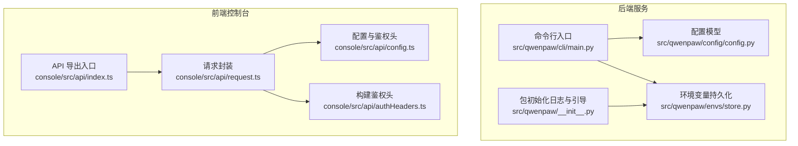
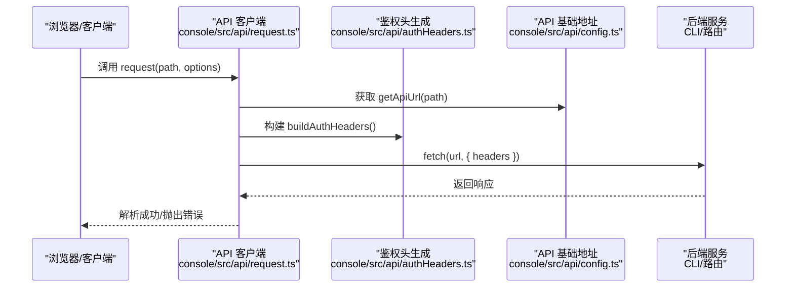
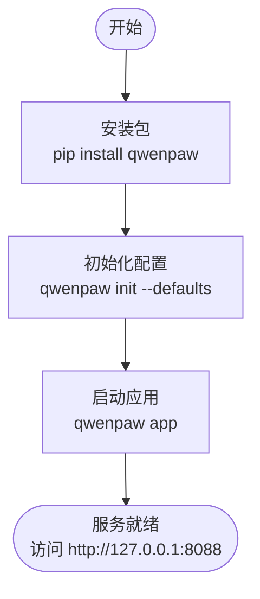
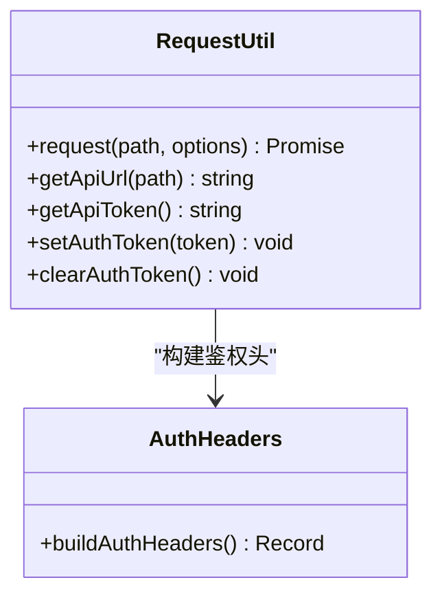
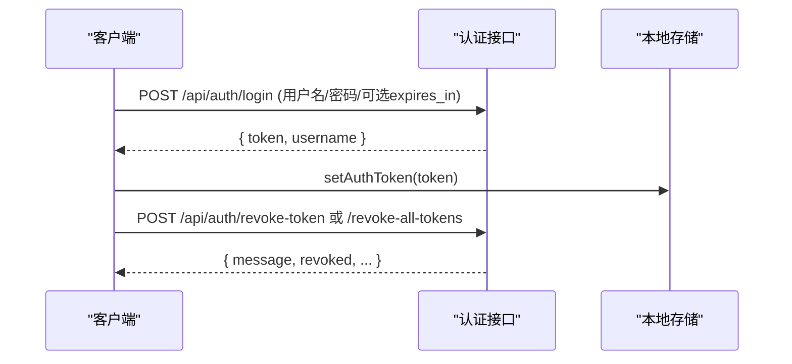
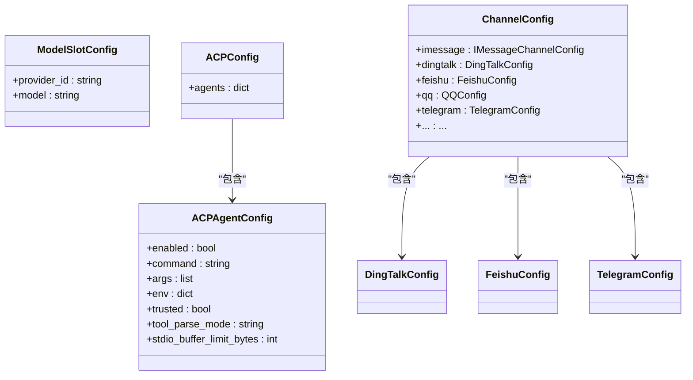
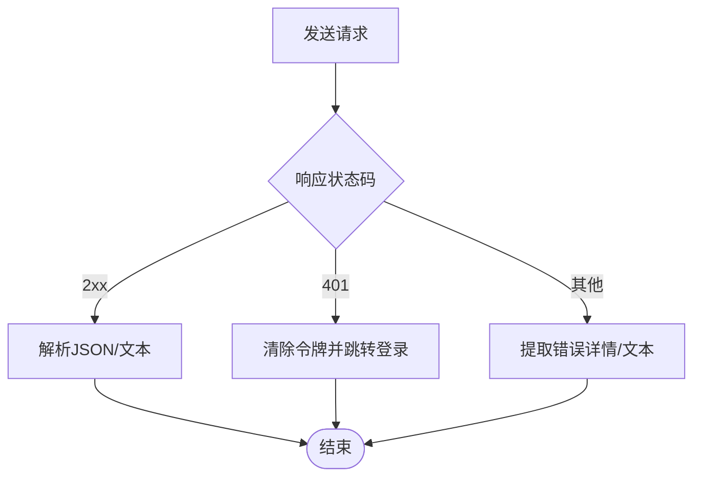
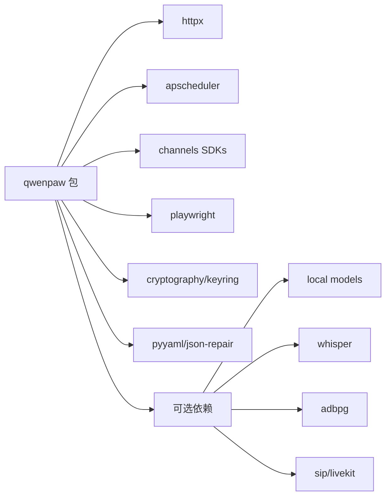

# SDK集成

<cite>
**本文引用的文件**
- [README.md](file://README.md)
- [pyproject.toml](file://pyproject.toml)
- [setup.py](file://setup.py)
- [src/qwenpaw/__init__.py](file://src/qwenpaw/__init__.py)
- [src/qwenpaw/cli/main.py](file://src/qwenpaw/cli/main.py)
- [src/qwenpaw/config/config.py](file://src/qwenpaw/config/config.py)
- [src/qwenpaw/envs/store.py](file://src/qwenpaw/envs/store.py)
- [console/src/api/index.ts](file://console/src/api/index.ts)
- [console/src/api/request.ts](file://console/src/api/request.ts)
- [console/src/api/config.ts](file://console/src/api/config.ts)
- [console/src/api/authHeaders.ts](file://console/src/api/authHeaders.ts)
- [website/public/docs/api-tutorial.en.md](file://website/public/docs/api-tutorial.en.md)
- [website/public/docs/api-tutorial.zh.md](file://website/public/docs/api-tutorial.zh.md)
</cite>

## 目录
1. [简介](#简介)
2. [项目结构](#项目结构)
3. [核心组件](#核心组件)
4. [架构总览](#架构总览)
5. [详细组件分析](#详细组件分析)
6. [依赖关系分析](#依赖关系分析)
7. [性能考虑](#性能考虑)
8. [故障排查指南](#故障排查指南)
9. [结论](#结论)
10. [附录](#附录)

## 简介
本文件面向希望在多端（前端Web、移动端、服务器端）集成 QwenPaw 的开发者，提供从安装配置、初始化、认证与连接管理、API 客户端使用，到数据模型与类型声明、错误处理与重试机制、超时配置、以及性能优化与常见问题的完整开发文档。文档同时覆盖 Python、JavaScript/TypeScript 等主流语言的集成要点，并给出端到端的集成示例路径与最佳实践。

## 项目结构
QwenPaw 采用“后端服务 + 前端控制台”的双层架构：
- 后端服务：提供统一 API、通道适配、代理与工具执行、内存与计划等能力，以 Python 实现并通过 CLI 启动。
- 前端控制台：基于 React/Vite 构建，提供 Web UI 与 API 客户端封装，便于在浏览器或桌面应用中进行集成。

**图表来源**
- [src/qwenpaw/cli/main.py:157-173](file://src/qwenpaw/cli/main.py#L157-L173)
- [src/qwenpaw/config/config.py:1-120](file://src/qwenpaw/config/config.py#L1-L120)
- [src/qwenpaw/envs/store.py:242-270](file://src/qwenpaw/envs/store.py#L242-L270)
- [src/qwenpaw/__init__.py:1-33](file://src/qwenpaw/__init__.py#L1-L33)
- [console/src/api/index.ts:1-100](file://console/src/api/index.ts#L1-L100)
- [console/src/api/request.ts:1-105](file://console/src/api/request.ts#L1-L105)
- [console/src/api/config.ts:1-42](file://console/src/api/config.ts#L1-L42)
- [console/src/api/authHeaders.ts:1-26](file://console/src/api/authHeaders.ts#L1-L26)

**章节来源**
- [README.md:118-130](file://README.md#L118-L130)
- [src/qwenpaw/cli/main.py:157-173](file://src/qwenpaw/cli/main.py#L157-L173)
- [console/src/api/index.ts:1-100](file://console/src/api/index.ts#L1-L100)

## 核心组件
- 包初始化与日志：负责在导入阶段加载环境变量、设置日志级别，确保后续模块读取到正确的运行时上下文。
- CLI 入口：提供延迟加载子命令、解析主机与端口、输出启动耗时等能力。
- 配置模型：集中定义模型槽位、通道配置、心跳、记忆与上下文压缩、工具结果修剪等数据结构。
- 环境变量持久化：提供 envs.json 的读写与加密存储，支持进程内注入与安全权限控制。
- 前端 API 客户端：封装请求、鉴权头、错误解析与登录态处理，统一暴露各模块 API。

**章节来源**
- [src/qwenpaw/__init__.py:1-33](file://src/qwenpaw/__init__.py#L1-L33)
- [src/qwenpaw/cli/main.py:58-93](file://src/qwenpaw/cli/main.py#L58-L93)
- [src/qwenpaw/config/config.py:42-120](file://src/qwenpaw/config/config.py#L42-L120)
- [src/qwenpaw/envs/store.py:142-270](file://src/qwenpaw/envs/store.py#L142-L270)
- [console/src/api/request.ts:1-105](file://console/src/api/request.ts#L1-L105)
- [console/src/api/config.ts:1-42](file://console/src/api/config.ts#L1-L42)
- [console/src/api/authHeaders.ts:1-26](file://console/src/api/authHeaders.ts#L1-L26)
- [console/src/api/index.ts:1-100](file://console/src/api/index.ts#L1-L100)

## 架构总览
下图展示从浏览器发起 API 请求到后端处理的关键路径，以及认证与代理头的生成流程。

**图表来源**
- [console/src/api/request.ts:60-104](file://console/src/api/request.ts#L60-L104)
- [console/src/api/authHeaders.ts:1-26](file://console/src/api/authHeaders.ts#L1-L26)
- [console/src/api/config.ts:11-27](file://console/src/api/config.ts#L11-L27)

## 详细组件分析

### Python SDK 安装与初始化
- 安装：通过 pip 安装发布包，或从源码安装并构建前端产物。
- 初始化：执行初始化命令后，启动应用；CLI 支持延迟加载子命令，提升启动性能。
- 日志与引导：包初始化阶段设置日志级别，若环境变量加载失败会记录警告。

**图表来源**
- [README.md:120-128](file://README.md#L120-L128)
- [src/qwenpaw/cli/main.py:157-173](file://src/qwenpaw/cli/main.py#L157-L173)
- [src/qwenpaw/__init__.py:22-32](file://src/qwenpaw/__init__.py#L22-L32)

**章节来源**
- [README.md:118-130](file://README.md#L118-L130)
- [src/qwenpaw/cli/main.py:58-93](file://src/qwenpaw/cli/main.py#L58-L93)
- [src/qwenpaw/__init__.py:1-33](file://src/qwenpaw/__init__.py#L1-L33)

### 前端 API 客户端与认证
- 请求封装：统一处理 URL 组装、Content-Type 默认值、鉴权头注入、非 2xx 错误解析与 401 登录跳转。
- 鉴权头：优先从本地存储读取令牌，其次使用构建期常量；自动附加 X-Agent-Id。
- 基础地址：支持通过 Vite 环境变量覆盖基础地址，默认拼接 /api 前缀。

**图表来源**
- [console/src/api/request.ts:60-104](file://console/src/api/request.ts#L60-L104)
- [console/src/api/config.ts:11-41](file://console/src/api/config.ts#L11-L41)
- [console/src/api/authHeaders.ts:1-26](file://console/src/api/authHeaders.ts#L1-L26)

**章节来源**
- [console/src/api/request.ts:1-105](file://console/src/api/request.ts#L1-L105)
- [console/src/api/config.ts:1-42](file://console/src/api/config.ts#L1-L42)
- [console/src/api/authHeaders.ts:1-26](file://console/src/api/authHeaders.ts#L1-L26)

### 认证与令牌管理
- 登录与令牌：通过认证接口获取令牌，支持自定义过期时间；默认 7 天，最大 100 年。
- 使用令牌：在请求头中添加 Bearer 令牌；本地回环地址可绕过认证。
- 令牌撤销：支持单个或全部撤销，用于登出或安全事件处置。

**图表来源**
- [website/public/docs/api-tutorial.en.md:696-822](file://website/public/docs/api-tutorial.en.md#L696-L822)
- [website/public/docs/api-tutorial.zh.md:709-769](file://website/public/docs/api-tutorial.zh.md#L709-L769)
- [console/src/api/config.ts:23-41](file://console/src/api/config.ts#L23-L41)

**章节来源**
- [website/public/docs/api-tutorial.en.md:696-822](file://website/public/docs/api-tutorial.en.md#L696-L822)
- [website/public/docs/api-tutorial.zh.md:709-769](file://website/public/docs/api-tutorial.zh.md#L709-L769)
- [console/src/api/config.ts:1-42](file://console/src/api/config.ts#L1-L42)

### 数据模型与类型声明
- 配置模型：包含模型槽位、ACP 配置、通道配置（如钉钉、飞书、微信、Telegram 等）、心跳、记忆与上下文压缩、工具结果修剪等。
- 类型约束：使用 Pydantic 模型与字段校验，确保配置合法与默认值完备。
- 扩展性：通道配置允许额外键，便于插件扩展。

**图表来源**
- [src/qwenpaw/config/config.py:42-120](file://src/qwenpaw/config/config.py#L42-L120)
- [src/qwenpaw/config/config.py:431-470](file://src/qwenpaw/config/config.py#L431-L470)

**章节来源**
- [src/qwenpaw/config/config.py:42-120](file://src/qwenpaw/config/config.py#L42-L120)
- [src/qwenpaw/config/config.py:431-470](file://src/qwenpaw/config/config.py#L431-L470)

### 连接管理与代理
- 环境变量持久化：envs.json 存储敏感信息并加密，支持迁移与进程内注入，避免明文泄露。
- 代理与网络：通过环境变量与配置项支持 HTTP/HTTPS 代理、SOCKS 代理等网络参数（详见依赖清单）。

**章节来源**
- [src/qwenpaw/envs/store.py:142-270](file://src/qwenpaw/envs/store.py#L142-L270)
- [pyproject.toml:7-49](file://pyproject.toml#L7-L49)

### 错误处理、重试与超时
- 前端错误处理：非 2xx 响应统一解析错误消息，401 自动清除令牌并跳转登录。
- 后端重试与限流：配置中包含最大重试次数、并发限制、速率限制与抖动等参数，便于在高并发场景下稳定调用上游模型服务。
- 超时配置：通道与服务层提供超时参数，结合前端轮询策略实现可靠交互。

**图表来源**
- [console/src/api/request.ts:73-92](file://console/src/api/request.ts#L73-L92)

**章节来源**
- [console/src/api/request.ts:1-105](file://console/src/api/request.ts#L1-L105)
- [src/qwenpaw/config/config.py:21-34](file://src/qwenpaw/config/config.py#L21-L34)

### 集成示例与最佳实践

- Python 客户端
  - 安装与启动：参考快速开始命令，初始化后启动应用。
  - 配置模型：通过配置模型定义模型槽位、通道与记忆策略，确保一致性与可维护性。
  - 环境变量：使用环境变量持久化模块保存敏感信息，避免硬编码。

- JavaScript/TypeScript 客户端
  - API 客户端：使用统一导出的 api 对象与 request 封装，自动注入鉴权头与基础地址。
  - 认证流程：登录后保存令牌，后续请求自动携带 Bearer 令牌；必要时手动清理令牌。
  - 代理与跨域：通过 Vite 环境变量配置 API 基础地址，满足开发与生产部署需求。

- 移动端与桌面端
  - 基于 Web 技术栈：可直接复用前端 API 客户端逻辑，结合 WebView 或 Electron。
  - 本地部署：桌面应用与容器部署均支持，注意端口映射与代理配置。

- 服务器端集成
  - 通过 CLI 启动后端服务，前端通过 /api 前缀访问；或在自有网关后方部署。
  - 使用环境变量持久化模块管理密钥与敏感配置，确保安全与可移植性。

**章节来源**
- [README.md:118-130](file://README.md#L118-L130)
- [console/src/api/index.ts:1-100](file://console/src/api/index.ts#L1-L100)
- [console/src/api/request.ts:1-105](file://console/src/api/request.ts#L1-L105)
- [console/src/api/config.ts:1-42](file://console/src/api/config.ts#L1-L42)
- [src/qwenpaw/envs/store.py:198-240](file://src/qwenpaw/envs/store.py#L198-L240)

## 依赖关系分析
- 包依赖：核心依赖包括 HTTP 客户端、调度器、渠道 SDK、语音与多媒体、加密与密钥存储等。
- 可选依赖：本地模型、Whisper、ADBPG、SIP 等按需启用。
- 构建与打包：使用 setuptools 动态版本与包数据，前端静态资源随包分发。

**图表来源**
- [pyproject.toml:7-49](file://pyproject.toml#L7-L49)
- [pyproject.toml:84-114](file://pyproject.toml#L84-L114)
- [pyproject.toml:58-69](file://pyproject.toml#L58-L69)

**章节来源**
- [pyproject.toml:1-152](file://pyproject.toml#L1-L152)
- [setup.py:1-5](file://setup.py#L1-L5)

## 性能考虑
- 启动性能：CLI 使用延迟加载子命令，减少冷启动时间。
- 日志与引导：包初始化阶段仅做必要工作，避免阻塞主线程。
- 记忆与上下文：合理配置上下文压缩与工具结果修剪，降低 Token 消耗与计算开销。
- 并发与限流：根据上游服务能力调整并发数与重试策略，避免触发限流。

[本节为通用指导，无需特定文件引用]

## 故障排查指南
- 401 未认证：检查令牌是否正确保存与注入，确认本地回环地址是否被识别为免认证。
- 端口占用：默认端口为 8088，可通过 CLI 参数或上一次运行记录覆盖。
- 代理与网络：若使用代理，请在环境变量中配置，或在相关通道配置中设置代理参数。
- 配置不生效：确认配置模型字段校验与默认值，必要时查看迁移逻辑对旧配置的兼容处理。

**章节来源**
- [console/src/api/request.ts:73-92](file://console/src/api/request.ts#L73-L92)
- [src/qwenpaw/cli/main.py:157-173](file://src/qwenpaw/cli/main.py#L157-L173)
- [src/qwenpaw/config/config.py:453-469](file://src/qwenpaw/config/config.py#L453-L469)

## 结论
QwenPaw 提供了从 Python 后端到前端 API 客户端的完整集成方案。通过清晰的配置模型、安全的环境变量持久化、完善的认证与错误处理机制，开发者可在多端快速落地集成。建议在生产环境中结合代理、限流与超时策略，持续监控日志与性能指标，确保系统稳定与安全。

[本节为总结，无需特定文件引用]

## 附录

### A. 安装与初始化步骤
- 使用 pip 安装并初始化，随后启动应用。
- 如需从源码安装，先构建前端，再安装 Python 包。

**章节来源**
- [README.md:118-130](file://README.md#L118-L130)
- [README.md:444-465](file://README.md#L444-L465)

### B. 关键配置项速查
- 模型槽位与活跃模型：用于路由与选择具体模型。
- 通道配置：包含各平台的鉴权参数、媒体目录、策略开关等。
- 心跳与计划：定时任务与摘要推送。
- 记忆与上下文：压缩阈值、保留比例、修剪策略等。

**章节来源**
- [src/qwenpaw/config/config.py:42-120](file://src/qwenpaw/config/config.py#L42-L120)
- [src/qwenpaw/config/config.py:431-470](file://src/qwenpaw/config/config.py#L431-L470)
- [src/qwenpaw/config/config.py:483-495](file://src/qwenpaw/config/config.py#L483-L495)

### C. 前端 API 客户端使用要点
- 统一通过 api 对象访问各模块接口。
- 在请求前确保已登录并保存令牌。
- 非 2xx 响应统一由 request 封装处理，401 自动跳转登录。

**章节来源**
- [console/src/api/index.ts:1-100](file://console/src/api/index.ts#L1-L100)
- [console/src/api/request.ts:1-105](file://console/src/api/request.ts#L1-L105)