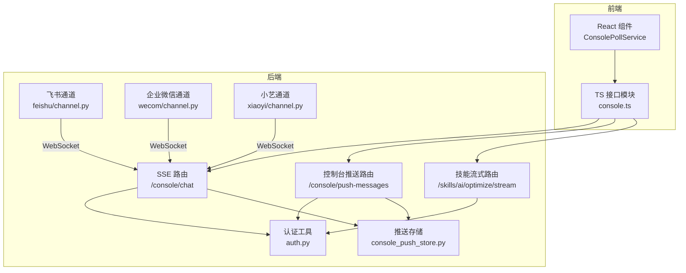
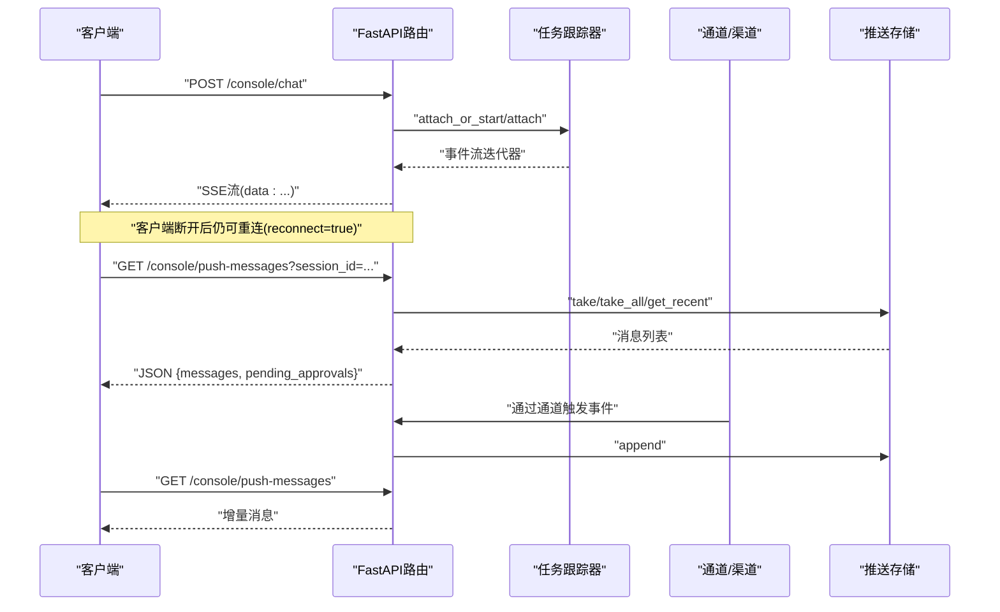
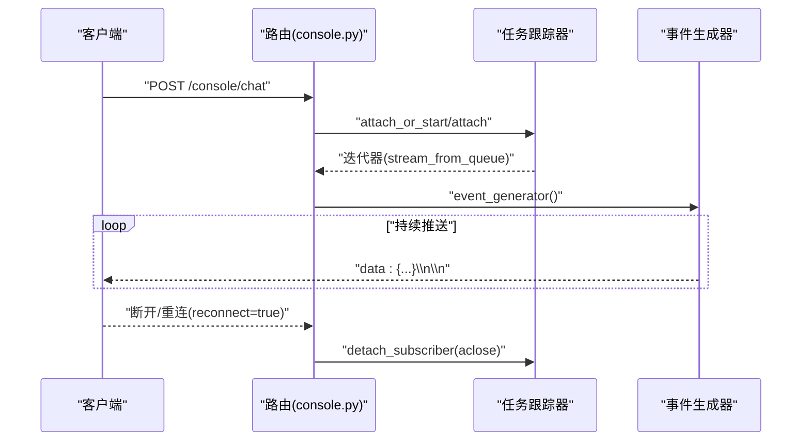
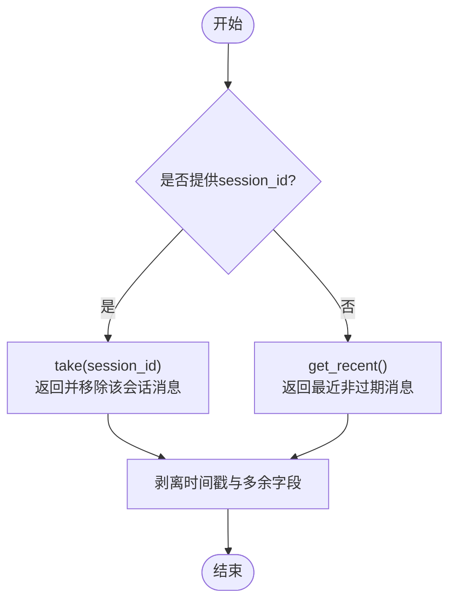
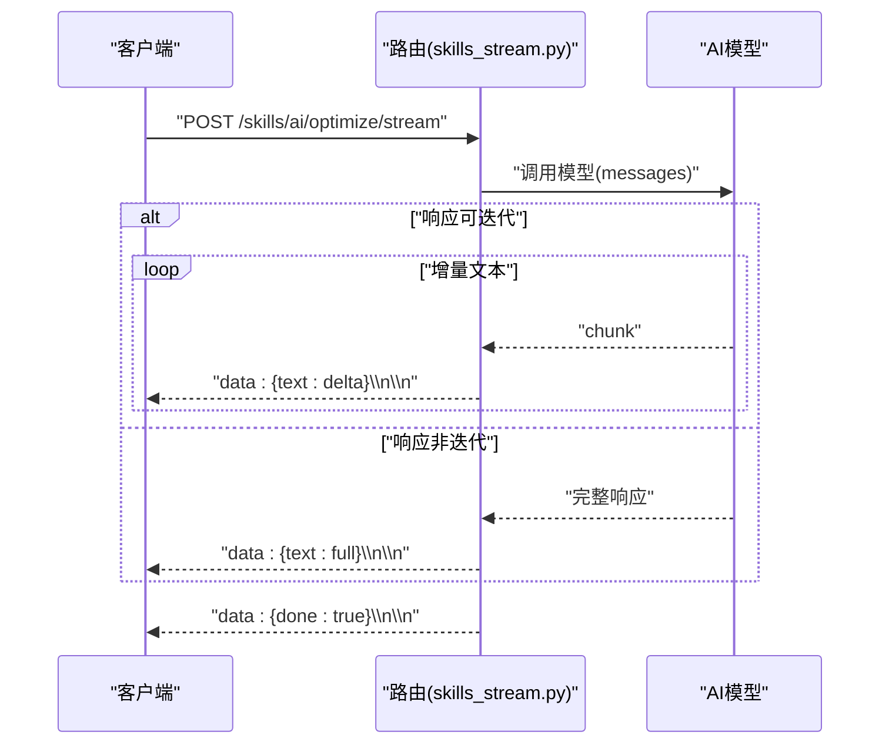
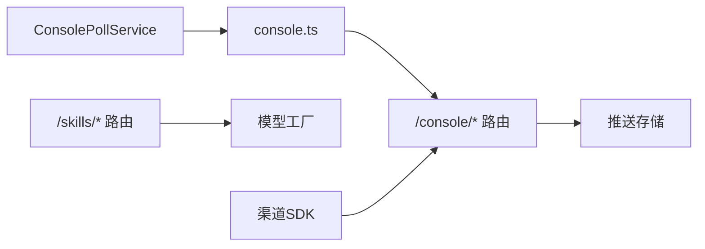

# WebSocket接口

<cite>
**本文档引用的文件**
- [src/qwenpaw/app/routers/console.py](file://src/qwenpaw/app/routers/console.py)
- [src/qwenpaw/app/routers/skills_stream.py](file://src/qwenpaw/app/routers/skills_stream.py)
- [src/qwenpaw/app/console_push_store.py](file://src/qwenpaw/app/console_push_store.py)
- [src/qwenpaw/app/auth.py](file://src/qwenpaw/app/auth.py)
- [src/qwenpaw/app/channels/feishu/channel.py](file://src/qwenpaw/app/channels/feishu/channel.py)
- [src/qwenpaw/app/channels/wecom/channel.py](file://src/qwenpaw/app/channels/wecom/channel.py)
- [src/qwenpaw/app/channels/xiaoyi/channel.py](file://src/qwenpaw/app/channels/xiaoyi/channel.py)
- [src/qwenpaw/console/src/api/modules/console.ts](file://src/qwenpaw/console/src/api/modules/console.ts)
- [src/qwenpaw/console/src/components/ConsolePollService/index.tsx](file://src/qwenpaw/console/src/components/ConsolePollService/index.tsx)
- [website/public/docs/security.en.md](file://website/public/docs/security.en.md)
- [website/public/docs/api-tutorial.zh.md](file://website/public/docs/api-tutorial.zh.md)
</cite>

## 目录
1. [简介](#简介)
2. [项目结构](#项目结构)
3. [核心组件](#核心组件)
4. [架构总览](#架构总览)
5. [详细组件分析](#详细组件分析)
6. [依赖关系分析](#依赖关系分析)
7. [性能考虑](#性能考虑)
8. [故障排除指南](#故障排除指南)
9. [结论](#结论)
10. [附录](#附录)

## 简介
本文件面向QwenPaw的WebSocket接口与实时推送能力，系统性梳理了以下方面：
- WebSocket连接建立流程、认证方式与参数传递
- 实时消息传输的数据格式、消息类型与事件处理机制
- 流式响应的实现方式、数据分片与重组过程
- 客户端连接示例、消息发送接收的代码路径与错误处理策略
- 连接状态管理、重连机制与心跳检测的实现细节
- 实时聊天、技能执行状态更新、控制台推送等场景下的使用模式

说明：QwenPaw后端以FastAPI提供SSE（Server-Sent Events）与HTTP API为主；部分渠道（如飞书）采用第三方SDK的WebSocket长连接进行消息收发。本文将分别阐述SSE与WebSocket两种实时通信方式。

## 项目结构
围绕WebSocket与实时推送的关键目录与文件：
- 后端路由层：提供SSE流式接口与控制台推送接口
- 渠道层：封装不同IM平台的WebSocket收发逻辑
- 前端：通过轮询或SSE消费后端推送
- 认证：统一的令牌提取与白名单策略



图表来源
- [src/qwenpaw/app/routers/console.py:135-224](file://src/qwenpaw/app/routers/console.py#L135-L224)
- [src/qwenpaw/app/routers/skills_stream.py:170-248](file://src/qwenpaw/app/routers/skills_stream.py#L170-L248)
- [src/qwenpaw/app/console_push_store.py:1-97](file://src/qwenpaw/app/console_push_store.py#L1-L97)
- [src/qwenpaw/app/auth.py:629-641](file://src/qwenpaw/app/auth.py#L629-L641)
- [src/qwenpaw/app/channels/feishu/channel.py:2023-2200](file://src/qwenpaw/app/channels/feishu/channel.py#L2023-L2200)
- [src/qwenpaw/app/channels/wecom/channel.py:801-1096](file://src/qwenpaw/app/channels/wecom/channel.py#L801-L1096)
- [src/qwenpaw/app/channels/xiaoyi/channel.py:767-810](file://src/qwenpaw/app/channels/xiaoyi/channel.py#L767-L810)

章节来源
- [src/qwenpaw/app/routers/console.py:1-459](file://src/qwenpaw/app/routers/console.py#L1-L459)
- [src/qwenpaw/app/routers/skills_stream.py:1-249](file://src/qwenpaw/app/routers/skills_stream.py#L1-L249)
- [src/qwenpaw/app/console_push_store.py:1-97](file://src/qwenpaw/app/console_push_store.py#L1-L97)
- [src/qwenpaw/app/auth.py:620-641](file://src/qwenpaw/app/auth.py#L620-L641)
- [src/qwenpaw/app/channels/feishu/channel.py:2023-2200](file://src/qwenpaw/app/channels/feishu/channel.py#L2023-L2200)
- [src/qwenpaw/app/channels/wecom/channel.py:801-1096](file://src/qwenpaw/app/channels/wecom/channel.py#L801-L1096)
- [src/qwenpaw/app/channels/xiaoyi/channel.py:767-810](file://src/qwenpaw/app/channels/xiaoyi/channel.py#L767-L810)

## 核心组件
- SSE聊天流（/console/chat）
  - 通过任务跟踪器维护会话队列，支持断开重连与后台继续运行
  - 事件格式为SSE文本行，包含对象类型、状态与序列化负载
- 控制台推送（/console/push-messages）
  - 内存队列存储最近消息，按会话拉取并去重
  - 前端轮询消费，支持全局与会话级消息
- 技能流式优化（/skills/ai/optimize/stream）
  - 对技能内容进行流式优化，增量返回文本片段
- 渠道WebSocket（飞书/企业微信/小艺）
  - 使用第三方SDK建立长连接，实现消息接收与ACK等待
  - 心跳监控与指数退避重连
- 认证与授权
  - 支持Authorization头或查询参数中的Bearer令牌
  - 仅对/api/路径进行保护，允许局域网直连豁免

章节来源
- [src/qwenpaw/app/routers/console.py:135-224](file://src/qwenpaw/app/routers/console.py#L135-L224)
- [src/qwenpaw/app/routers/skills_stream.py:170-248](file://src/qwenpaw/app/routers/skills_stream.py#L170-L248)
- [src/qwenpaw/app/console_push_store.py:22-96](file://src/qwenpaw/app/console_push_store.py#L22-L96)
- [src/qwenpaw/app/auth.py:629-641](file://src/qwenpaw/app/auth.py#L629-L641)

## 架构总览
下图展示从客户端到后端的典型交互路径，涵盖SSE与WebSocket两种模式：



图表来源
- [src/qwenpaw/app/routers/console.py:142-224](file://src/qwenpaw/app/routers/console.py#L142-L224)
- [src/qwenpaw/app/console_push_store.py:22-96](file://src/qwenpaw/app/console_push_store.py#L22-L96)

## 详细组件分析

### SSE聊天流（/console/chat）
- 连接建立
  - 客户端向POST /console/chat发起请求，后端解析会话与载荷
  - 通过任务跟踪器attach_or_start启动或附加到现有会话
- 断开与重连
  - 支持reconnect=true参数实现断线重连
  - 断开时通过迭代器清理，确保资源释放
- 事件格式
  - 逐条SSE事件，包含对象类型、状态与序列化负载
  - 错误时返回包含error键的事件
- 数据分片与重组
  - 事件按顺序到达，前端按行解析，无需额外重组
- 错误处理
  - 异常捕获并返回错误事件，最终清理订阅



图表来源
- [src/qwenpaw/app/routers/console.py:142-224](file://src/qwenpaw/app/routers/console.py#L142-L224)

章节来源
- [src/qwenpaw/app/routers/console.py:135-224](file://src/qwenpaw/app/routers/console.py#L135-L224)

### 控制台推送（/console/push-messages）
- 存储模型
  - 内存列表，带时间戳与会话ID，支持上限与过期剔除
  - 提供append、take、take_all、get_recent等操作
- 消费模式
  - 前端轮询（ConsolePollService）或SSE（若扩展）
  - 支持按会话拉取消费与全局最近消息
- 事件类型
  - 推送消息（PushMessage{id,text,sticky}）
  - 待审批项（PendingApproval）



图表来源
- [src/qwenpaw/app/console_push_store.py:41-96](file://src/qwenpaw/app/console_push_store.py#L41-L96)

章节来源
- [src/qwenpaw/app/console_push_store.py:1-97](file://src/qwenpaw/app/console_push_store.py#L1-L97)
- [src/qwenpaw/console/src/components/ConsolePollService/index.tsx:34-77](file://src/qwenpaw/console/src/components/ConsolePollService/index.tsx#L34-L77)

### 技能流式优化（/skills/ai/optimize/stream）
- 流式实现
  - 对模型响应进行异步迭代，提取文本增量
  - 逐段返回data: {"text": "..."}，最后返回done标志
- 错误处理
  - 模型不可用或异常时返回错误事件



图表来源
- [src/qwenpaw/app/routers/skills_stream.py:170-248](file://src/qwenpaw/app/routers/skills_stream.py#L170-L248)

章节来源
- [src/qwenpaw/app/routers/skills_stream.py:1-249](file://src/qwenpaw/app/routers/skills_stream.py#L1-L249)

### 渠道WebSocket（飞书/企业微信/小艺）
- 连接建立
  - 使用第三方SDK创建WebSocket客户端，注册事件处理器
  - 在独立事件循环中运行，支持心跳与健康检查
- 认证与握手
  - 通过查询参数传递token（仅限升级请求）
  - 令牌提取逻辑支持Authorization头与查询参数
- 心跳与健康检查
  - SDK内置ping_loop与监控循环，超时或连接丢失触发重连
  - 指数退避重连策略，避免频繁重建
- 发送与ACK
  - 发送命令帧并等待ACK，使用Future回调处理响应
  - 支持基于帧的回复流（reply_stream）实现增量推送

```mermaid
sequenceDiagram
participant SDK as "lark_oapi/ws"
participant Loop as "WS事件循环"
participant Mon as "健康监控"
participant App as "应用逻辑"
SDK->>Loop : "_connect()"
Loop->>Mon : "启动ping_loop与监控"
Mon->>Loop : "超时/断开 -> 停止循环"
Loop->>SDK : "_disconnect()"
Loop->>Loop : "指数退避重连"
App->>SDK : "send(cmd, headers, body)"
SDK-->>App : "ack(Future)"
```

图表来源
- [src/qwenpaw/app/channels/feishu/channel.py:2023-2200](file://src/qwenpaw/app/channels/feishu/channel.py#L2023-L2200)
- [src/qwenpaw/app/channels/wecom/channel.py:801-1096](file://src/qwenpaw/app/channels/wecom/channel.py#L801-L1096)
- [src/qwenpaw/app/channels/xiaoyi/channel.py:767-810](file://src/qwenpaw/app/channels/xiaoyi/channel.py#L767-L810)

章节来源
- [src/qwenpaw/app/channels/feishu/channel.py:2023-2200](file://src/qwenpaw/app/channels/feishu/channel.py#L2023-L2200)
- [src/qwenpaw/app/channels/wecom/channel.py:801-1096](file://src/qwenpaw/app/channels/wecom/channel.py#L801-L1096)
- [src/qwenpaw/app/channels/xiaoyi/channel.py:767-810](file://src/qwenpaw/app/channels/xiaoyi/channel.py#L767-L810)
- [src/qwenpaw/app/auth.py:629-641](file://src/qwenpaw/app/auth.py#L629-L641)

### 认证与授权
- 令牌提取
  - Authorization头（Bearer）优先
  - WebSocket升级请求中支持查询参数token
- 路由保护
  - 仅对/api/路径进行保护
  - 局域网地址（127.0.0.1/::1）可豁免
- 安全细节
  - 文档明确WebSocket认证仅限升级请求，令牌通过查询参数传递

章节来源
- [src/qwenpaw/app/auth.py:629-641](file://src/qwenpaw/app/auth.py#L629-L641)
- [website/public/docs/security.en.md:803-817](file://website/public/docs/security.en.md#L803-L817)

## 依赖关系分析
- 路由依赖
  - /console/chat依赖任务跟踪器与通道流
  - /console/push-messages依赖内存存储
  - /skills/ai/optimize/stream依赖模型工厂
- 渠道依赖
  - 飞书/企业微信/小艺依赖第三方SDK与独立事件循环
- 前端依赖
  - ConsolePollService轮询控制台推送接口
  - console.ts定义推送消息与待审批项的数据结构



图表来源
- [src/qwenpaw/console/src/api/modules/console.ts:51-98](file://src/qwenpaw/console/src/api/modules/console.ts#L51-L98)
- [src/qwenpaw/console/src/components/ConsolePollService/index.tsx:34-77](file://src/qwenpaw/console/src/components/ConsolePollService/index.tsx#L34-L77)
- [src/qwenpaw/app/routers/console.py:135-224](file://src/qwenpaw/app/routers/console.py#L135-L224)
- [src/qwenpaw/app/routers/skills_stream.py:170-248](file://src/qwenpaw/app/routers/skills_stream.py#L170-L248)

章节来源
- [src/qwenpaw/console/src/api/modules/console.ts:1-99](file://src/qwenpaw/console/src/api/modules/console.ts#L1-L99)
- [src/qwenpaw/console/src/components/ConsolePollService/index.tsx:1-147](file://src/qwenpaw/console/src/components/ConsolePollService/index.tsx#L1-L147)
- [src/qwenpaw/app/routers/console.py:1-459](file://src/qwenpaw/app/routers/console.py#L1-L459)
- [src/qwenpaw/app/routers/skills_stream.py:1-249](file://src/qwenpaw/app/routers/skills_stream.py#L1-L249)

## 性能考虑
- SSE流式推送
  - 无额外压缩，适合低延迟文本增量
  - 建议客户端侧批量渲染与节流
- 推送存储
  - 内存队列上限与过期剔除，避免长期占用
  - 按会话消费后移除，降低重复推送
- WebSocket
  - SDK内置心跳与健康监控，减少无效连接
  - 指数退避重连，降低风暴效应

[本节为通用指导，不涉及具体文件分析]

## 故障排除指南
- SSE连接问题
  - 检查任务跟踪器订阅状态与异常日志
  - 确认客户端断开后正确aclose，避免悬挂
- 推送消息缺失
  - 确认session_id匹配与消息未过期
  - 查看内存队列上限与剔除策略
- WebSocket断连
  - 检查SDK事件循环状态与健康监控日志
  - 确认令牌传递与升级请求头
- 认证失败
  - 确认Authorization头或查询参数token格式
  - 核对局域网豁免配置

章节来源
- [src/qwenpaw/app/routers/console.py:203-224](file://src/qwenpaw/app/routers/console.py#L203-L224)
- [src/qwenpaw/app/console_push_store.py:78-96](file://src/qwenpaw/app/console_push_store.py#L78-L96)
- [src/qwenpaw/app/channels/feishu/channel.py:2077-2121](file://src/qwenpaw/app/channels/feishu/channel.py#L2077-L2121)
- [src/qwenpaw/app/auth.py:629-641](file://src/qwenpaw/app/auth.py#L629-L641)

## 结论
QwenPaw通过SSE与WebSocket双通道实现了灵活的实时通信：
- SSE适用于聊天与技能优化等文本流式场景
- WebSocket适用于需要长连接与高可靠性的IM渠道
- 认证与授权策略覆盖HTTP与WebSocket升级场景
- 推送存储与前端轮询保障了控制台消息的及时可见性

[本节为总结性内容，不涉及具体文件分析]

## 附录

### 客户端连接示例与消息格式
- SSE聊天流
  - 路径：/console/chat
  - 事件：逐行SSE，包含对象类型、状态与序列化负载
  - 重连：reconnect=true参数
- 控制台推送
  - 路径：/console/push-messages
  - 返回：{messages: PushMessage[], pending_approvals: PendingApproval[]}
  - 前端轮询：ConsolePollService
- 技能流式优化
  - 路径：/skills/ai/optimize/stream
  - 返回：增量text与done标志

章节来源
- [src/qwenpaw/app/routers/console.py:135-224](file://src/qwenpaw/app/routers/console.py#L135-L224)
- [src/qwenpaw/console/src/api/modules/console.ts:51-98](file://src/qwenpaw/console/src/api/modules/console.ts#L51-L98)
- [src/qwenpaw/console/src/components/ConsolePollService/index.tsx:34-77](file://src/qwenpaw/console/src/components/ConsolePollService/index.tsx#L34-L77)
- [src/qwenpaw/app/routers/skills_stream.py:170-248](file://src/qwenpaw/app/routers/skills_stream.py#L170-L248)

### 连接参数与认证
- 认证方式
  - Authorization: Bearer <token>
  - WebSocket升级请求：查询参数token
- 路由保护
  - 仅/api/路径受保护
  - 局域网地址可豁免

章节来源
- [src/qwenpaw/app/auth.py:629-641](file://src/qwenpaw/app/auth.py#L629-L641)
- [website/public/docs/security.en.md:803-817](file://website/public/docs/security.en.md#L803-L817)

### 实时聊天、技能执行状态更新、控制台推送使用模式
- 实时聊天
  - 客户端订阅SSE，断开后可重连
  - 服务端后台继续运行，支持停止API
- 技能执行状态更新
  - 可扩展为SSE事件推送（当前为技能优化流）
- 控制台推送
  - 后端append消息，前端轮询take/get_recent消费

章节来源
- [src/qwenpaw/app/routers/console.py:135-273](file://src/qwenpaw/app/routers/console.py#L135-L273)
- [src/qwenpaw/app/console_push_store.py:22-96](file://src/qwenpaw/app/console_push_store.py#L22-L96)