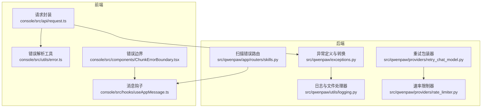
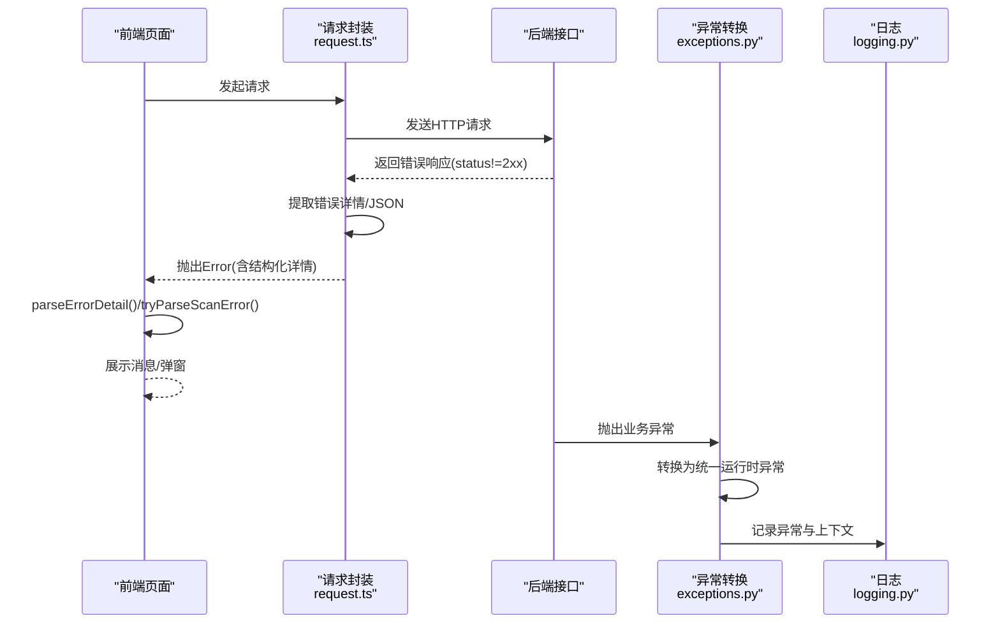
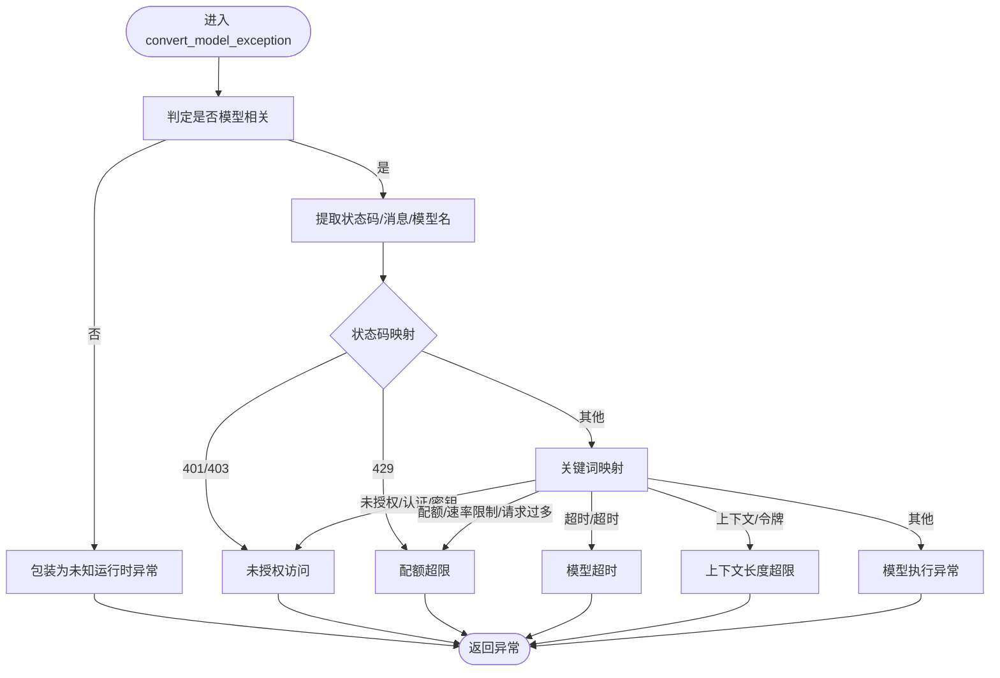
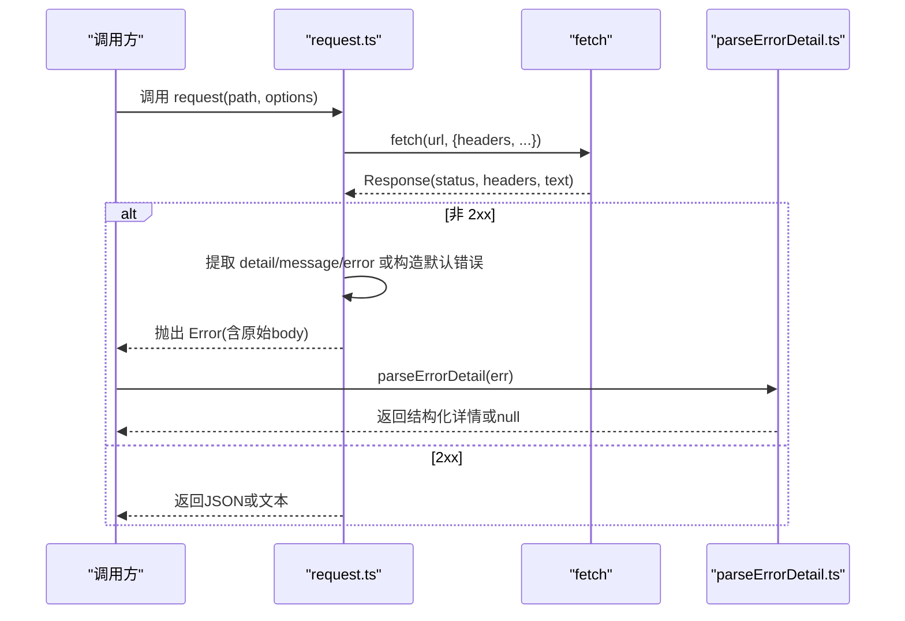
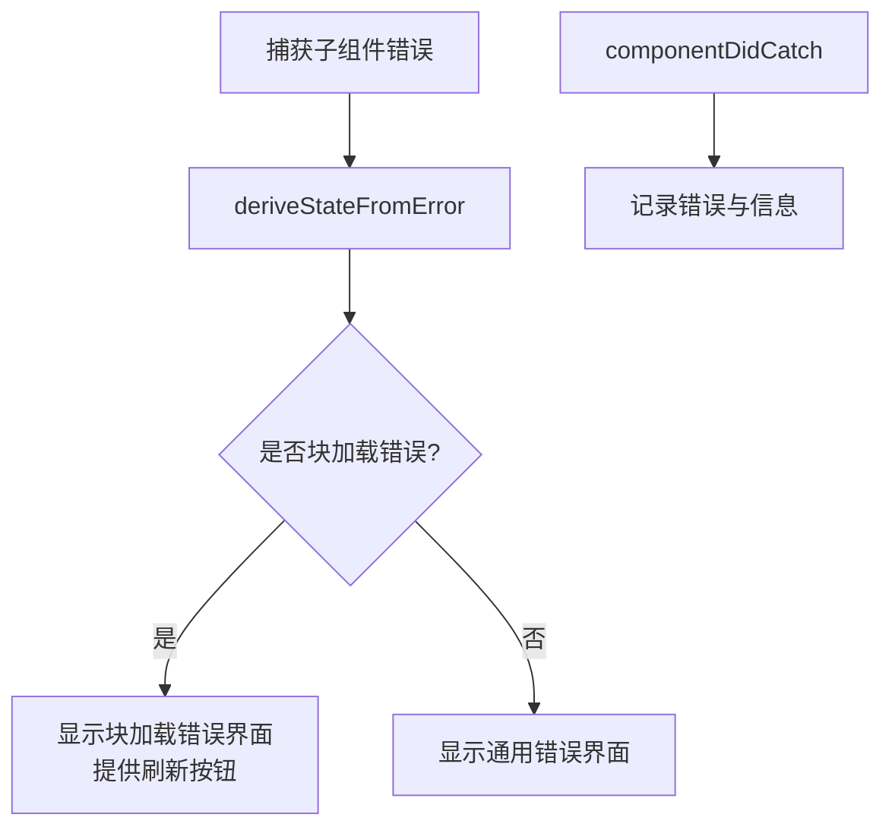
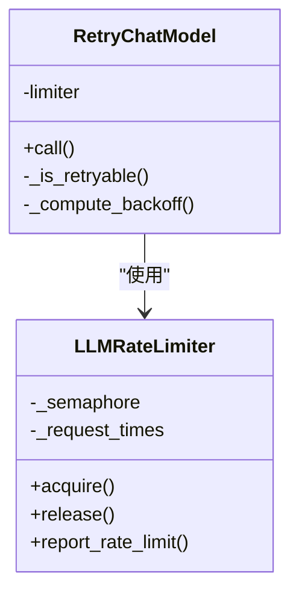
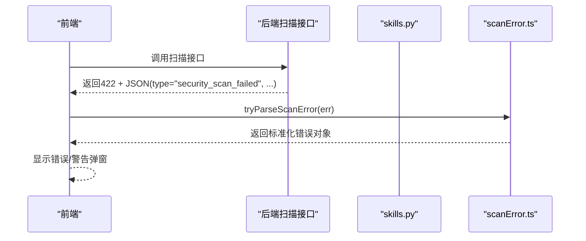
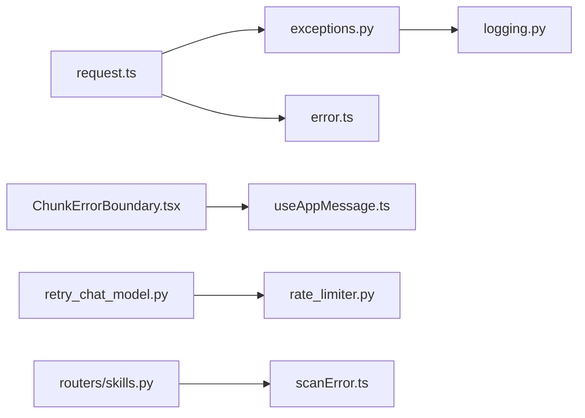

# 错误处理

<cite>
**本文引用的文件**
- [src/qwenpaw/exceptions.py](file://src/qwenpaw/exceptions.py)
- [console/src/api/request.ts](file://console/src/api/request.ts)
- [console/src/utils/error.ts](file://console/src/utils/error.ts)
- [console/src/components/ChunkErrorBoundary.tsx](file://console/src/components/ChunkErrorBoundary.tsx)
- [src/qwenpaw/utils/logging.py](file://src/qwenpaw/utils/logging.py)
- [src/qwenpaw/providers/retry_chat_model.py](file://src/qwenpaw/providers/retry_chat_model.py)
- [src/qwenpaw/providers/rate_limiter.py](file://src/qwenpaw/providers/rate_limiter.py)
- [src/qwenpaw/app/channels/telegram/channel.py](file://src/qwenpaw/app/channels/telegram/channel.py)
- [console/src/pages/Settings/Models/components/modals/testConnectionMessage.ts](file://console/src/pages/Settings/Models/components/modals/testConnectionMessage.ts)
- [console/src/utils/scanError.ts](file://console/src/utils/scanError.ts)
- [src/qwenpaw/app/routers/skills.py](file://src/qwenpaw/app/routers/skills.py)
- [src/qwenpaw/utils/telemetry.py](file://src/qwenpaw/utils/telemetry.py)
- [console/src/hooks/useAppMessage.ts](file://console/src/hooks/useAppMessage.ts)
</cite>

## 目录
1. [简介](#简介)
2. [项目结构](#项目结构)
3. [核心组件](#核心组件)
4. [架构总览](#架构总览)
5. [详细组件分析](#详细组件分析)
6. [依赖分析](#依赖分析)
7. [性能考量](#性能考量)
8. [故障排查指南](#故障排查指南)
9. [结论](#结论)
10. [附录](#附录)

## 简介
本文件系统性梳理 QwenPaw 的错误处理机制，覆盖后端异常模型、前端请求与渲染错误处理、日志与遥测、重试与限流、以及安全扫描错误的呈现与处置。文档旨在帮助开发者与运维人员快速定位问题、制定重试与降级策略，并建立完善的监控与告警体系。

## 项目结构
围绕错误处理的关键位置如下：
- 后端异常与转换：Python 异常定义与 LLM API 异常转换器
- 前端请求与错误解析：统一请求封装、错误消息提取与结构化解析
- 前端错误边界与用户提示：动态模块加载错误边界、Ant Design 消息钩子
- 日志与文件落盘：彩色控制台输出、安全轮转文件处理器
- 重试与限流：通用 LLM 重试包装器与全局速率限制器
- 频道连接重连：以 Telegram 为例的指数退避重连策略
- 安全扫描错误：后端扫描失败响应规范化、前端弹窗展示
- 测试连接消息：模型连接测试结果本地化与细节提取

图表来源
- [console/src/api/request.ts:60-104](file://console/src/api/request.ts#L60-L104)
- [console/src/utils/error.ts:1-24](file://console/src/utils/error.ts#L1-L24)
- [console/src/components/ChunkErrorBoundary.tsx:41-84](file://console/src/components/ChunkErrorBoundary.tsx#L41-L84)
- [src/qwenpaw/exceptions.py:165-253](file://src/qwenpaw/exceptions.py#L165-L253)
- [src/qwenpaw/utils/logging.py:154-225](file://src/qwenpaw/utils/logging.py#L154-L225)
- [src/qwenpaw/providers/retry_chat_model.py:270-447](file://src/qwenpaw/providers/retry_chat_model.py#L270-L447)
- [src/qwenpaw/providers/rate_limiter.py:43-71](file://src/qwenpaw/providers/rate_limiter.py#L43-L71)
- [src/qwenpaw/app/routers/skills.py:75-115](file://src/qwenpaw/app/routers/skills.py#L75-L115)

章节来源
- [console/src/api/request.ts:60-104](file://console/src/api/request.ts#L60-L104)
- [src/qwenpaw/exceptions.py:165-253](file://src/qwenpaw/exceptions.py#L165-L253)
- [src/qwenpaw/utils/logging.py:154-225](file://src/qwenpaw/utils/logging.py#L154-L225)
- [src/qwenpaw/providers/retry_chat_model.py:270-447](file://src/qwenpaw/providers/retry_chat_model.py#L270-L447)
- [src/qwenpaw/providers/rate_limiter.py:43-71](file://src/qwenpaw/providers/rate_limiter.py#L43-L71)
- [src/qwenpaw/app/routers/skills.py:75-115](file://src/qwenpaw/app/routers/skills.py#L75-L115)

## 核心组件
- 后端异常与转换
  - 自定义业务异常类（提供者错误、模型格式化错误、系统命令异常、频道通信错误、代理状态错误、技能管理错误）
  - LLM API 异常转换器：根据状态码与关键词将第三方异常映射为统一运行时异常
- 前端请求与错误解析
  - 统一请求封装：自动注入鉴权头、处理非 2xx 响应、提取结构化错误详情
  - 错误详情解析：支持“ - ”分隔的结构化 JSON 提取与纯 JSON 解析
- 前端错误边界与提示
  - 动态模块加载错误边界：区分“块加载失败”与“渲染错误”，引导刷新
  - Ant Design 消息钩子：确保消息组件在主题与命名空间下正确工作
- 日志与文件处理器
  - 控制台彩色输出、路径相对化、异常栈与堆栈信息拼接
  - 安全轮转文件处理器：跨平台容忍文件锁导致的轮转失败
- 重试与限流
  - 透明重试包装器：对瞬时错误进行指数退避重试，支持流式中断重试
  - 全局速率限制器：并发与 QPM 限制、共享暂停、抖动与统计
- 频道连接重连
  - Telegram 轮询重连：冲突与网络错误分别计数，指数退避上限控制
- 安全扫描错误
  - 后端：扫描失败返回标准化 JSON 结构
  - 前端：解析并弹窗展示扫描发现，支持警告模式提示
- 测试连接消息
  - 连接测试结果本地化与细节提取，避免泛化失败消息

章节来源
- [src/qwenpaw/exceptions.py:21-101](file://src/qwenpaw/exceptions.py#L21-L101)
- [src/qwenpaw/exceptions.py:165-253](file://src/qwenpaw/exceptions.py#L165-L253)
- [console/src/api/request.ts:60-104](file://console/src/api/request.ts#L60-L104)
- [console/src/utils/error.ts:1-24](file://console/src/utils/error.ts#L1-L24)
- [console/src/components/ChunkErrorBoundary.tsx:41-84](file://console/src/components/ChunkErrorBoundary.tsx#L41-L84)
- [console/src/hooks/useAppMessage.ts:12-15](file://console/src/hooks/useAppMessage.ts#L12-L15)
- [src/qwenpaw/utils/logging.py:55-225](file://src/qwenpaw/utils/logging.py#L55-L225)
- [src/qwenpaw/providers/retry_chat_model.py:270-447](file://src/qwenpaw/providers/retry_chat_model.py#L270-L447)
- [src/qwenpaw/providers/rate_limiter.py:43-71](file://src/qwenpaw/providers/rate_limiter.py#L43-L71)
- [src/qwenpaw/app/channels/telegram/channel.py:505-530](file://src/qwenpaw/app/channels/telegram/channel.py#L505-L530)
- [console/src/utils/scanError.ts:11-172](file://console/src/utils/scanError.ts#L11-L172)
- [src/qwenpaw/app/routers/skills.py:75-115](file://src/qwenpaw/app/routers/skills.py#L75-L115)
- [console/src/pages/Settings/Models/components/modals/testConnectionMessage.ts:22-52](file://console/src/pages/Settings/Models/components/modals/testConnectionMessage.ts#L22-L52)

## 架构总览
以下序列图展示从前端到后端的典型错误传播与处理流程，包括请求封装、错误解析、异常转换与统一响应。

图表来源
- [console/src/api/request.ts:60-104](file://console/src/api/request.ts#L60-L104)
- [src/qwenpaw/exceptions.py:165-253](file://src/qwenpaw/exceptions.py#L165-L253)
- [src/qwenpaw/utils/logging.py:154-225](file://src/qwenpaw/utils/logging.py#L154-L225)
- [console/src/utils/error.ts:1-24](file://console/src/utils/error.ts#L1-L24)
- [console/src/utils/scanError.ts:11-27](file://console/src/utils/scanError.ts#L11-L27)

## 详细组件分析

### 后端异常与转换
- 业务异常类
  - ProviderError：模型提供方错误
  - ModelFormatterError：消息格式化错误
  - SystemCommandException：系统命令执行错误
  - ChannelError：频道通信错误（携带频道名）
  - AgentStateError：会话/状态错误（携带 session_id）
  - SkillsError：技能管理错误
- LLM API 异常转换
  - 判定是否模型相关（类型名、状态码、关键词）
  - 状态码优先映射：401/403 → 未授权访问；429 → 配额超限
  - 关键词映射：未授权/认证/密钥无效 → 未授权访问；配额/速率限制/请求过多 → 配额超限；超时/超时 → 超时异常；上下文窗口/令牌过多 → 上下文长度超限
  - 默认兜底：模型执行异常
  - 保留原始异常类型与消息，便于追踪

图表来源
- [src/qwenpaw/exceptions.py:107-163](file://src/qwenpaw/exceptions.py#L107-L163)
- [src/qwenpaw/exceptions.py:165-253](file://src/qwenpaw/exceptions.py#L165-L253)

章节来源
- [src/qwenpaw/exceptions.py:21-101](file://src/qwenpaw/exceptions.py#L21-L101)
- [src/qwenpaw/exceptions.py:107-163](file://src/qwenpaw/exceptions.py#L107-L163)
- [src/qwenpaw/exceptions.py:165-253](file://src/qwenpaw/exceptions.py#L165-L253)

### 前端请求与错误解析
- 请求封装
  - 自动注入鉴权头，按方法设置 Content-Type
  - 非 2xx 响应：提取 JSON 中的 detail/message/error 字段作为错误消息；若为 401，清除令牌并跳转登录
  - 将原始响应体附加到错误消息中，便于后续解析结构化详情
- 错误详情解析
  - 支持“ - ”分隔的结构化 JSON 提取
  - 回退尝试整段消息的 JSON 解析
- 测试连接消息
  - 规范化失败消息前缀与通用失败短语，提取具体细节用于本地化展示

图表来源
- [console/src/api/request.ts:60-104](file://console/src/api/request.ts#L60-L104)
- [console/src/utils/error.ts:1-24](file://console/src/utils/error.ts#L1-L24)
- [console/src/pages/Settings/Models/components/modals/testConnectionMessage.ts:22-52](file://console/src/pages/Settings/Models/components/modals/testConnectionMessage.ts#L22-L52)

章节来源
- [console/src/api/request.ts:60-104](file://console/src/api/request.ts#L60-L104)
- [console/src/utils/error.ts:1-24](file://console/src/utils/error.ts#L1-L24)
- [console/src/pages/Settings/Models/components/modals/testConnectionMessage.ts:22-52](file://console/src/pages/Settings/Models/components/modals/testConnectionMessage.ts#L22-L52)

### 前端错误边界与提示
- 动态模块加载错误边界
  - 通过错误消息关键字与名称判断是否为块加载错误
  - 区分块加载错误与渲染错误，前者提供刷新入口，后者保持通用回退
- 消息钩子
  - 使用 Ant Design 的 App.useApp 获取 message/modal/notification 实例，确保与全局配置一致

图表来源
- [console/src/components/ChunkErrorBoundary.tsx:41-84](file://console/src/components/ChunkErrorBoundary.tsx#L41-L84)
- [console/src/hooks/useAppMessage.ts:12-15](file://console/src/hooks/useAppMessage.ts#L12-L15)

章节来源
- [console/src/components/ChunkErrorBoundary.tsx:41-84](file://console/src/components/ChunkErrorBoundary.tsx#L41-L84)
- [console/src/hooks/useAppMessage.ts:12-15](file://console/src/hooks/useAppMessage.ts#L12-L15)

### 日志与文件处理器
- 彩色控制台输出：按级别着色，路径相对化，时间戳与行号前缀
- 文件处理器：安全轮转（跨平台容忍文件锁），最大 5MiB，保留 3 份备份
- 过滤器：可抑制特定路径的访问日志噪声

章节来源
- [src/qwenpaw/utils/logging.py:55-225](file://src/qwenpaw/utils/logging.py#L55-L225)

### 重试与限流
- 重试包装器
  - 识别可重试异常（OpenAI/Anthropic/HTTPX 常见瞬时错误、特定状态码）
  - 指数退避，上限与抖动，流式中断即整次重试
  - 429 时上报速率限制并协调全局暂停
- 速率限制器
  - 并发信号量、QPM 滑动窗口、默认暂停与抖动
  - 统计指标：获取次数、暂停次数、QPM 等待、被限流次数

图表来源
- [src/qwenpaw/providers/retry_chat_model.py:270-447](file://src/qwenpaw/providers/retry_chat_model.py#L270-L447)
- [src/qwenpaw/providers/rate_limiter.py:43-71](file://src/qwenpaw/providers/rate_limiter.py#L43-L71)

章节来源
- [src/qwenpaw/providers/retry_chat_model.py:141-156](file://src/qwenpaw/providers/retry_chat_model.py#L141-L156)
- [src/qwenpaw/providers/retry_chat_model.py:262-268](file://src/qwenpaw/providers/retry_chat_model.py#L262-L268)
- [src/qwenpaw/providers/retry_chat_model.py:421-447](file://src/qwenpaw/providers/retry_chat_model.py#L421-L447)
- [src/qwenpaw/providers/rate_limiter.py:43-71](file://src/qwenpaw/providers/rate_limiter.py#L43-L71)

### 频道连接重连（以 Telegram 为例）
- 冲突与网络错误分别计数，采用不同重连策略
- 网络错误：指数退避，上限保护
- 成功重连后重置计数器

章节来源
- [src/qwenpaw/app/channels/telegram/channel.py:505-530](file://src/qwenpaw/app/channels/telegram/channel.py#L505-L530)

### 安全扫描错误
- 后端：扫描失败返回标准化 JSON，包含类型、技能名、最高严重度与发现列表
- 前端：解析错误消息中的 JSON，展示错误弹窗；支持警告模式的后续提醒

图表来源
- [src/qwenpaw/app/routers/skills.py:75-115](file://src/qwenpaw/app/routers/skills.py#L75-L115)
- [console/src/utils/scanError.ts:11-27](file://console/src/utils/scanError.ts#L11-L27)
- [console/src/utils/scanError.ts:87-172](file://console/src/utils/scanError.ts#L87-L172)

章节来源
- [src/qwenpaw/app/routers/skills.py:75-115](file://src/qwenpaw/app/routers/skills.py#L75-L115)
- [console/src/utils/scanError.ts:11-172](file://console/src/utils/scanError.ts#L11-L172)

## 依赖分析
- 前端请求封装依赖后端异常转换后的统一异常类型，确保错误消息稳定且可解析
- 前端错误边界与消息钩子解耦于具体错误类型，提升可维护性
- 日志模块仅面向应用内部，避免污染第三方库输出
- 重试与限流模块相互协作，形成统一的 LLM 调用韧性层

图表来源
- [console/src/api/request.ts:60-104](file://console/src/api/request.ts#L60-L104)
- [src/qwenpaw/exceptions.py:165-253](file://src/qwenpaw/exceptions.py#L165-L253)
- [console/src/utils/error.ts:1-24](file://console/src/utils/error.ts#L1-L24)
- [console/src/components/ChunkErrorBoundary.tsx:41-84](file://console/src/components/ChunkErrorBoundary.tsx#L41-L84)
- [console/src/hooks/useAppMessage.ts:12-15](file://console/src/hooks/useAppMessage.ts#L12-L15)
- [src/qwenpaw/utils/logging.py:154-225](file://src/qwenpaw/utils/logging.py#L154-L225)
- [src/qwenpaw/providers/retry_chat_model.py:270-447](file://src/qwenpaw/providers/retry_chat_model.py#L270-L447)
- [src/qwenpaw/providers/rate_limiter.py:43-71](file://src/qwenpaw/providers/rate_limiter.py#L43-L71)
- [src/qwenpaw/app/routers/skills.py:75-115](file://src/qwenpaw/app/routers/skills.py#L75-L115)
- [console/src/utils/scanError.ts:11-172](file://console/src/utils/scanError.ts#L11-L172)

## 性能考量
- 重试策略
  - 指数退避与抖动降低雪崩风险；流式中断整次重试避免部分消费导致的数据不一致
  - 429 时的全局暂停与 QPM 窗口控制，减少对上游的压力
- 日志轮转
  - 安全轮转处理器在文件锁定时自动恢复，避免因轮转失败导致的日志丢失
- 前端错误边界
  - 仅对块加载错误进行针对性处理，其余错误保持应用可用性

[本节为通用指导，无需列出章节来源]

## 故障排查指南
- 网络错误
  - 检查请求封装中的错误消息提取逻辑，确认是否包含结构化详情
  - 若为 401，确认鉴权头是否正确注入与令牌是否过期
- 认证失败
  - 后端异常转换器将 401/403 映射为未授权访问；前端收到 401 会清除令牌并跳转登录
- 权限不足
  - 403 映射为未授权访问；检查服务端权限策略与角色配置
- 资源不存在
  - 404 不在转换器映射范围内，保持原样；前端应根据业务语义进行友好提示
- 速率限制/配额超限
  - 429 映射为配额超限；结合速率限制器统计与重试包装器日志定位瓶颈
- 上下文长度超限
  - 消息过长或历史过深导致；建议压缩上下文或调整模型参数
- 超时
  - 识别超时异常并考虑增加重试次数或延长超时阈值
- 安全扫描失败
  - 后端返回标准化 JSON；前端解析并展示详细发现列表
- 动态模块加载失败
  - 错误边界检测块加载错误并提示刷新；清理浏览器缓存或等待部署完成

章节来源
- [console/src/api/request.ts:74-91](file://console/src/api/request.ts#L74-L91)
- [src/qwenpaw/exceptions.py:202-206](file://src/qwenpaw/exceptions.py#L202-L206)
- [src/qwenpaw/exceptions.py:219-229](file://src/qwenpaw/exceptions.py#L219-L229)
- [src/qwenpaw/exceptions.py:239-239](file://src/qwenpaw/exceptions.py#L239-L239)
- [src/qwenpaw/exceptions.py:249-250](file://src/qwenpaw/exceptions.py#L249-L250)
- [console/src/utils/scanError.ts:11-27](file://console/src/utils/scanError.ts#L11-L27)
- [console/src/components/ChunkErrorBoundary.tsx:18-28](file://console/src/components/ChunkErrorBoundary.tsx#L18-L28)

## 结论
QwenPaw 在前后端建立了统一的错误模型与处理链路：后端通过异常转换器将异构错误归一化，前端通过请求封装与错误解析工具稳定地提取结构化信息，配合错误边界与消息钩子提升用户体验。同时，重试与限流、日志与文件处理器、安全扫描错误展示与测试连接消息，共同构成了完整的可观测性与韧性体系。

[本节为总结性内容，无需列出章节来源]

## 附录

### 错误码与含义对照（基于转换器映射）
- 401/403：未授权访问（UnauthorizedModelAccessException）
- 429：配额超限（ModelQuotaExceededException）
- 超时相关关键词：模型超时（ModelTimeoutException）
- 上下文/令牌相关关键词：上下文长度超限（ModelContextLengthExceededException）
- 其他模型相关错误：模型执行异常（ModelExecutionException）

章节来源
- [src/qwenpaw/exceptions.py:202-206](file://src/qwenpaw/exceptions.py#L202-L206)
- [src/qwenpaw/exceptions.py:219-229](file://src/qwenpaw/exceptions.py#L219-L229)
- [src/qwenpaw/exceptions.py:239-239](file://src/qwenpaw/exceptions.py#L239-L239)
- [src/qwenpaw/exceptions.py:249-250](file://src/qwenpaw/exceptions.py#L249-L250)
- [src/qwenpaw/exceptions.py:253](file://src/qwenpaw/exceptions.py#L253)

### 客户端错误处理最佳实践
- 统一请求封装：集中处理鉴权、内容类型、错误提取与默认提示
- 结构化错误解析：优先从 JSON 中提取 detail/message/error，其次回退到默认错误
- 用户提示：使用消息钩子确保样式与主题一致；扫描错误弹窗需限制条目数量
- 错误边界：区分块加载错误与渲染错误，前者提供刷新入口
- 重试策略：对瞬时错误采用指数退避，避免对上游造成压力；429 时遵循 Retry-After 或全局暂停
- 降级方案：当上游不可用时，提供本地缓存数据或简化视图；记录降级原因与影响范围

章节来源
- [console/src/api/request.ts:60-104](file://console/src/api/request.ts#L60-L104)
- [console/src/utils/error.ts:1-24](file://console/src/utils/error.ts#L1-L24)
- [console/src/utils/scanError.ts:29-85](file://console/src/utils/scanError.ts#L29-L85)
- [console/src/components/ChunkErrorBoundary.tsx:41-84](file://console/src/components/ChunkErrorBoundary.tsx#L41-L84)
- [src/qwenpaw/providers/retry_chat_model.py:421-447](file://src/qwenpaw/providers/retry_chat_model.py#L421-L447)

### 错误监控、日志记录与告警配置
- 日志配置
  - 控制台输出：彩色级别、相对路径、时间戳与行号
  - 文件输出：安全轮转（5MiB/3 份），跨平台容忍文件锁
  - 过滤：抑制特定路径的访问日志噪声
- 遥测
  - 系统信息收集（安装方式、版本、架构、GPU 检测）与上传
  - 标记文件记录已收集版本与用户选择退出选项
- 建议
  - 将关键异常（如未授权、配额超限、超时）纳入告警规则
  - 对扫描失败与频道重连失败设置独立告警通道
  - 结合重试与限流统计，观察上游健康度与自身韧性表现

章节来源
- [src/qwenpaw/utils/logging.py:55-225](file://src/qwenpaw/utils/logging.py#L55-L225)
- [src/qwenpaw/utils/telemetry.py:157-304](file://src/qwenpaw/utils/telemetry.py#L157-L304)