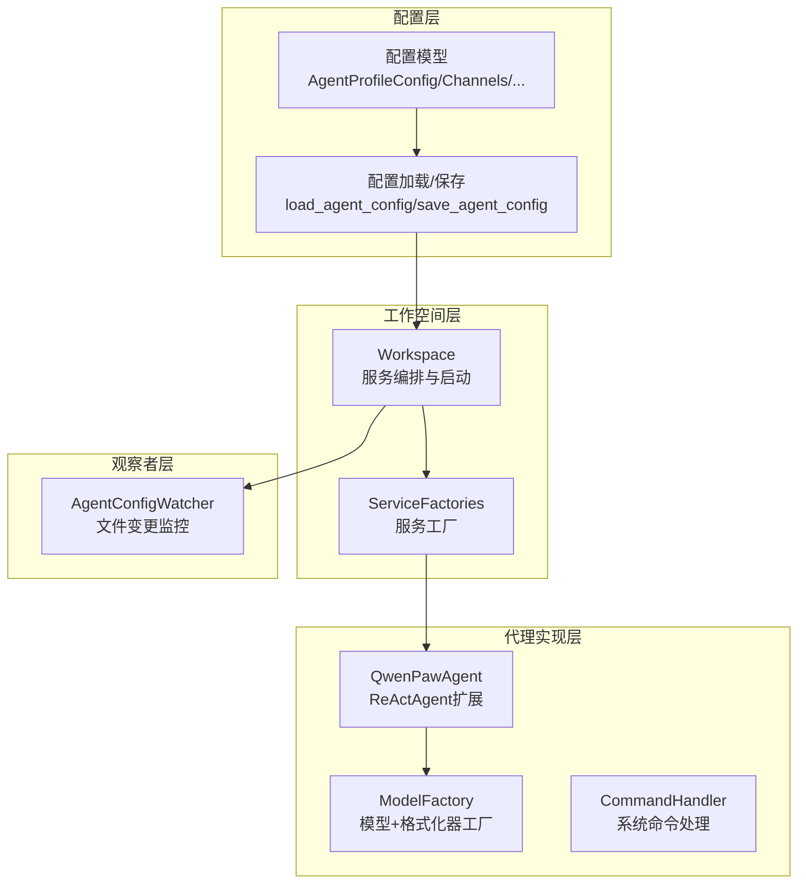
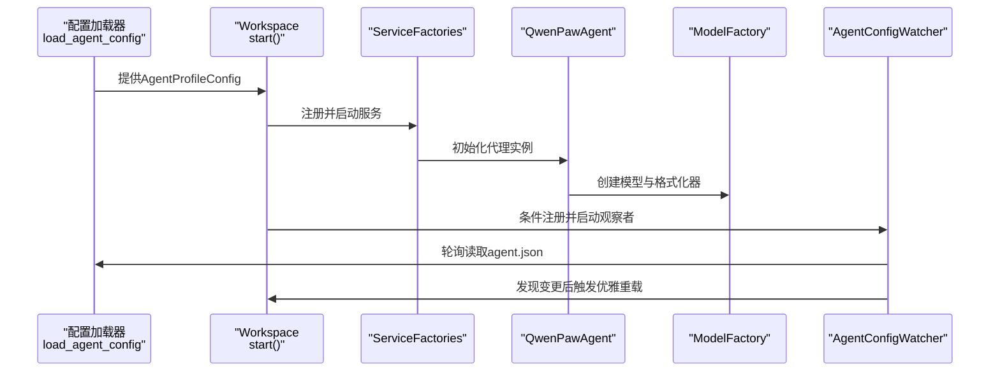
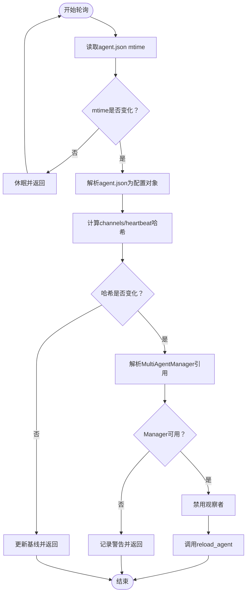
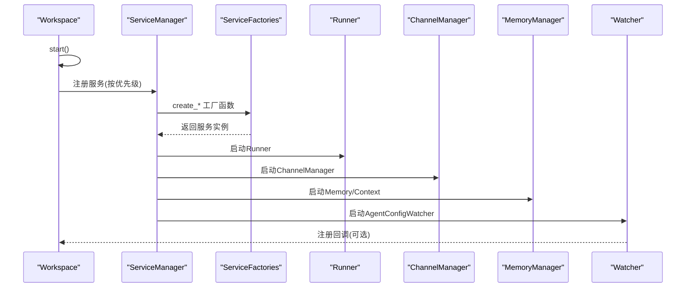
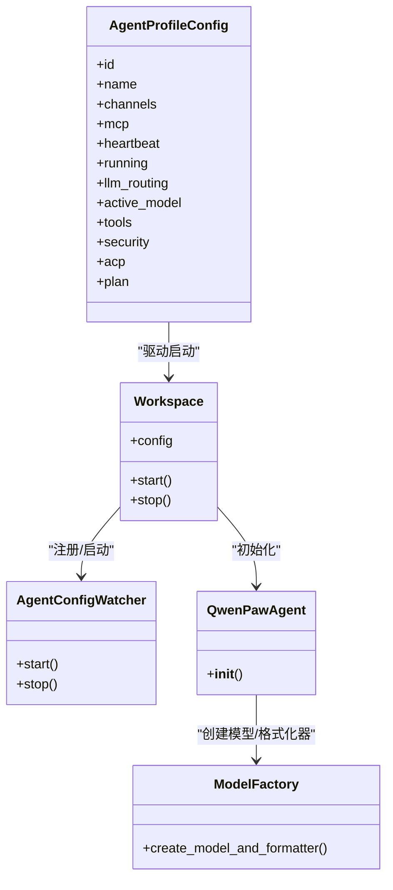

# 代理创建与配置

<cite>
**本文档引用的文件**
- [src/qwenpaw/config/config.py](file://src/qwenpaw/config/config.py)
- [src/qwenpaw/app/workspace/workspace.py](file://src/qwenpaw/app/workspace/workspace.py)
- [src/qwenpaw/app/workspace/service_factories.py](file://src/qwenpaw/app/workspace/service_factories.py)
- [src/qwenpaw/app/agent_config_watcher.py](file://src/qwenpaw/app/agent_config_watcher.py)
- [src/qwenpaw/agents/react_agent.py](file://src/qwenpaw/agents/react_agent.py)
- [src/qwenpaw/agents/model_factory.py](file://src/qwenpaw/agents/model_factory.py)
- [src/qwenpaw/agents/command_handler.py](file://src/qwenpaw/agents/command_handler.py)
</cite>

## 目录
1. [简介](#简介)
2. [项目结构](#项目结构)
3. [核心组件](#核心组件)
4. [架构总览](#架构总览)
5. [详细组件分析](#详细组件分析)
6. [依赖关系分析](#依赖关系分析)
7. [性能考量](#性能考量)
8. [故障排查指南](#故障排查指南)
9. [结论](#结论)
10. [附录](#附录)

## 简介
本文件面向需要在QwenPaw中创建与配置代理（Agent）的开发者与运维人员，系统性阐述代理的创建流程、配置参数、初始化过程与热重载机制。内容覆盖：
- 代理ID生成与校验规则
- 工作空间目录管理与agent.json配置文件结构
- 模型与格式化器工厂、工具与技能集成
- 配置验证、默认值与迁移策略
- 基于文件变更的配置热重载（AgentConfigWatcher）
- 配置变更监听与处理流程

## 项目结构
围绕代理创建与配置的关键模块分布如下：
- 配置层：定义各类配置模型与加载/保存逻辑，负责解析agent.json并提供默认值与校验
- 工作空间层：封装单个代理的完整运行时环境，注册并启动各服务组件
- 观察者层：监控agent.json变更，触发优雅的热重载
- 代理实现层：基于ReActAgent构建，集成工具、技能、内存与上下文管理
- 工厂层：统一创建模型与格式化器，适配多提供商与多模态场景

图表来源
- [src/qwenpaw/config/config.py:1059-1258](file://src/qwenpaw/config/config.py#L1059-L1258)
- [src/qwenpaw/app/workspace/workspace.py:38-118](file://src/qwenpaw/app/workspace/workspace.py#L38-L118)
- [src/qwenpaw/app/workspace/service_factories.py:111-175](file://src/qwenpaw/app/workspace/service_factories.py#L111-L175)
- [src/qwenpaw/app/agent_config_watcher.py:44-219](file://src/qwenpaw/app/agent_config_watcher.py#L44-L219)
- [src/qwenpaw/agents/react_agent.py:80-200](file://src/qwenpaw/agents/react_agent.py#L80-L200)
- [src/qwenpaw/agents/model_factory.py:49-800](file://src/qwenpaw/agents/model_factory.py#L49-L800)
- [src/qwenpaw/agents/command_handler.py:77-200](file://src/qwenpaw/agents/command_handler.py#L77-L200)

章节来源
- [src/qwenpaw/config/config.py:1059-1258](file://src/qwenpaw/config/config.py#L1059-L1258)
- [src/qwenpaw/app/workspace/workspace.py:38-118](file://src/qwenpaw/app/workspace/workspace.py#L38-L118)
- [src/qwenpaw/app/workspace/service_factories.py:111-175](file://src/qwenpaw/app/workspace/service_factories.py#L111-L175)
- [src/qwenpaw/app/agent_config_watcher.py:44-219](file://src/qwenpaw/app/agent_config_watcher.py#L44-L219)
- [src/qwenpaw/agents/react_agent.py:80-200](file://src/qwenpaw/agents/react_agent.py#L80-L200)
- [src/qwenpaw/agents/model_factory.py:49-800](file://src/qwenpaw/agents/model_factory.py#L49-L800)
- [src/qwenpaw/agents/command_handler.py:77-200](file://src/qwenpaw/agents/command_handler.py#L77-L200)

## 核心组件
- 代理配置模型（AgentProfileConfig）：描述单个代理的全部可配置项，包括运行时行为、渠道、MCP、心跳、工具、安全策略、计划模式等
- 工作空间（Workspace）：封装代理的完整运行时，负责服务注册、启动与停止，支持可复用组件的热重载
- 代理配置观察者（AgentConfigWatcher）：轮询agent.json，检测channels与heartbeat字段哈希变化，触发优雅重载
- 代理实现（QwenPawAgent）：基于ReActAgent，集成内置工具、动态技能、内存与上下文管理
- 模型工厂（ModelFactory）：按配置创建模型与格式化器，处理多模态媒体块与不同提供商的格式差异
- 命令处理器（CommandHandler）：处理系统命令（如/compact、/new等），并可热加载代理配置

章节来源
- [src/qwenpaw/config/config.py:1059-1258](file://src/qwenpaw/config/config.py#L1059-L1258)
- [src/qwenpaw/app/workspace/workspace.py:38-118](file://src/qwenpaw/app/workspace/workspace.py#L38-L118)
- [src/qwenpaw/app/agent_config_watcher.py:44-219](file://src/qwenpaw/app/agent_config_watcher.py#L44-L219)
- [src/qwenpaw/agents/react_agent.py:80-200](file://src/qwenpaw/agents/react_agent.py#L80-L200)
- [src/qwenpaw/agents/model_factory.py:49-800](file://src/qwenpaw/agents/model_factory.py#L49-L800)
- [src/qwenpaw/agents/command_handler.py:77-200](file://src/qwenpaw/agents/command_handler.py#L77-L200)

## 架构总览
下图展示了从配置加载到代理实例化的端到端流程，以及配置热重载的触发路径。

图表来源
- [src/qwenpaw/config/config.py:1835-1944](file://src/qwenpaw/config/config.py#L1835-L1944)
- [src/qwenpaw/app/workspace/workspace.py:351-392](file://src/qwenpaw/app/workspace/workspace.py#L351-L392)
- [src/qwenpaw/app/workspace/service_factories.py:111-175](file://src/qwenpaw/app/workspace/service_factories.py#L111-L175)
- [src/qwenpaw/agents/react_agent.py:100-184](file://src/qwenpaw/agents/react_agent.py#L100-L184)
- [src/qwenpaw/agents/model_factory.py:49-800](file://src/qwenpaw/agents/model_factory.py#L49-L800)
- [src/qwenpaw/app/agent_config_watcher.py:78-219](file://src/qwenpaw/app/agent_config_watcher.py#L78-L219)

## 详细组件分析

### 代理ID生成与校验
- 生成规则：使用短UUID生成6字符ID，适合快速创建与展示
- 校验规则：长度2-64；仅允许字母、数字、连字符与下划线；不可以“-”或“_”开头或结尾；不可与保留ID冲突；需全局唯一
- 使用场景：CLI创建代理、控制台初始化、多代理管理

章节来源
- [src/qwenpaw/config/config.py:129-189](file://src/qwenpaw/config/config.py#L129-L189)

### 工作空间目录管理与agent.json结构
- 工作空间：每个代理拥有独立的工作空间目录，用于持久化聊天记录、作业、记忆索引、工具结果缓存等
- agent.json：存储AgentProfileConfig的完整副本，包含channels、mcp、heartbeat、running、llm_routing、active_model、tools、security、acp、plan等字段
- 加载策略：基于文件mtime缓存，避免频繁磁盘读取；首次缺失时生成回退配置并写入磁盘
- 迁移策略：对历史键（如channels.weixin）进行一次性迁移并重写磁盘文件

章节来源
- [src/qwenpaw/app/workspace/workspace.py:51-76](file://src/qwenpaw/app/workspace/workspace.py#L51-L76)
- [src/qwenpaw/config/config.py:1059-1141](file://src/qwenpaw/config/config.py#L1059-L1141)
- [src/qwenpaw/config/config.py:1835-1944](file://src/qwenpaw/config/config.py#L1835-L1944)

### 配置参数与默认值
- 运行时配置（AgentsRunningConfig）：最大迭代次数、自动继续策略、LLM重试与限流、并发限制、Shell命令超时与执行器、上下文与记忆后端选择、自动标题生成等
- LLM路由配置（AgentsLLMRoutingConfig）：本地优先/云端优先模式开关
- 记忆与上下文配置：轻量上下文与工具结果修剪、ADBPG/ReMeLight记忆后端参数
- 安全与工具：工具执行审批级别、工具白名单/黑名单、工具结果缓存与保留天数
- ACP配置：多语言/多提供商的外部代理集成

章节来源
- [src/qwenpaw/config/config.py:817-1016](file://src/qwenpaw/config/config.py#L817-L1016)
- [src/qwenpaw/config/config.py:1006-1058](file://src/qwenpaw/config/config.py#L1006-L1058)
- [src/qwenpaw/config/config.py:566-756](file://src/qwenpaw/config/config.py#L566-L756)
- [src/qwenpaw/config/config.py:758-847](file://src/qwenpaw/config/config.py#L758-L847)
- [src/qwenpaw/config/config.py:104-118](file://src/qwenpaw/config/config.py#L104-L118)

### 配置验证机制
- Pydantic模型校验：字段类型、范围约束、别名映射、模型级校验（如LLM退避参数的大小关系）
- 运行时迁移：对历史键进行一次性迁移与重写，保证后续加载稳定
- 错误处理：找不到代理ID、磁盘访问异常时回退至默认配置并写入缓存

章节来源
- [src/qwenpaw/config/config.py:938-949](file://src/qwenpaw/config/config.py#L938-L949)
- [src/qwenpaw/config/config.py:1893-1924](file://src/qwenpaw/config/config.py#L1893-L1924)
- [src/qwenpaw/config/config.py:1858-1862](file://src/qwenpaw/config/config.py#L1858-L1862)

### 默认值处理与回退策略
- 首次加载缺失agent.json：根据根配置生成回退AgentProfileConfig并保存
- 缓存失效：保存后立即清理内存缓存，确保下次读取生效
- 兼容性：对历史字段（如channels.weixin）进行标准化迁移

章节来源
- [src/qwenpaw/config/config.py:1868-1872](file://src/qwenpaw/config/config.py#L1868-L1872)
- [src/qwenpaw/config/config.py:1987-1991](file://src/qwenpaw/config/config.py#L1987-L1991)
- [src/qwenpaw/config/config.py:1893-1924](file://src/qwenpaw/config/config.py#L1893-L1924)

### 配置热重载功能
- 观察者职责：轮询agent.json，计算channels与heartbeat字段哈希，仅在有意义变更时触发重载
- 触发条件：channels或heartbeat哈希变化；忽略运行时重写（如last_dispatch）
- 优雅重载：通过MultiAgentManager的reload_agent实现原子切换，等待在途任务完成
- 生命周期：支持start/stop，内部禁用防止重复触发

图表来源
- [src/qwenpaw/app/agent_config_watcher.py:142-219](file://src/qwenpaw/app/agent_config_watcher.py#L142-L219)

章节来源
- [src/qwenpaw/app/agent_config_watcher.py:44-219](file://src/qwenpaw/app/agent_config_watcher.py#L44-L219)

### 代理初始化流程
- Workspace启动：加载AgentProfileConfig，执行历史数据迁移，按优先级注册并启动服务（Runner、Memory/Context、MCP、Chat、Channel、Cron、ConfigWatcher等）
- 服务工厂：根据配置创建ChannelManager、ChatManager、MCP客户端等，并注入到Runner
- 代理实例：QwenPawAgent接收AgentProfileConfig，构建系统提示，创建模型与格式化器，注册工具与技能，注入内存与上下文管理器

图表来源
- [src/qwenpaw/app/workspace/workspace.py:137-317](file://src/qwenpaw/app/workspace/workspace.py#L137-L317)
- [src/qwenpaw/app/workspace/service_factories.py:111-175](file://src/qwenpaw/app/workspace/service_factories.py#L111-L175)

章节来源
- [src/qwenpaw/app/workspace/workspace.py:351-392](file://src/qwenpaw/app/workspace/workspace.py#L351-L392)
- [src/qwenpaw/app/workspace/service_factories.py:111-175](file://src/qwenpaw/app/workspace/service_factories.py#L111-L175)

### 模型与格式化器工厂
- 统一入口：create_model_and_formatter按agent_id创建模型与格式化器
- 多提供商适配：OpenAI、Anthropic、Gemini等格式化器映射
- 多模态支持：图片/视频/音频块规范化、媒体类型修复、占位符替换与恢复
- 工具结果增强：对tool_result中的文件/媒体块进行兼容处理，避免API不支持

章节来源
- [src/qwenpaw/agents/model_factory.py:49-800](file://src/qwenpaw/agents/model_factory.py#L49-L800)

### 工具与技能配置
- 内置工具：文件操作、Shell执行、浏览器控制、截图、时间查询、令牌用量统计等
- 技能系统：动态加载工作空间内的技能，支持环境变量覆盖与工作空间目录解析
- 工具守护：通过ToolGuardMixin拦截高风险工具调用，结合审批级别策略

章节来源
- [src/qwenpaw/agents/react_agent.py:40-61](file://src/qwenpaw/agents/react_agent.py#L40-L61)
- [src/qwenpaw/agents/react_agent.py:146-200](file://src/qwenpaw/agents/react_agent.py#L146-L200)

### 系统命令与配置热加载
- 命令处理：支持/compact、/new、/clear、/history、/plan等系统命令
- 热加载：CommandHandler在处理命令时可热加载AgentProfileConfig，确保配置变更即时生效

章节来源
- [src/qwenpaw/agents/command_handler.py:77-200](file://src/qwenpaw/agents/command_handler.py#L77-L200)

## 依赖关系分析
- 配置到运行时：AgentProfileConfig驱动Workspace启动与服务装配
- 观察者到管理：AgentConfigWatcher依赖MultiAgentManager进行热重载
- 代理到工厂：QwenPawAgent依赖ModelFactory创建模型与格式化器
- 工厂到提供商：ModelFactory根据配置选择具体提供商与格式化器

图表来源
- [src/qwenpaw/config/config.py:1059-1141](file://src/qwenpaw/config/config.py#L1059-L1141)
- [src/qwenpaw/app/workspace/workspace.py:351-392](file://src/qwenpaw/app/workspace/workspace.py#L351-L392)
- [src/qwenpaw/app/agent_config_watcher.py:78-106](file://src/qwenpaw/app/agent_config_watcher.py#L78-L106)
- [src/qwenpaw/agents/react_agent.py:100-184](file://src/qwenpaw/agents/react_agent.py#L100-L184)
- [src/qwenpaw/agents/model_factory.py:49-800](file://src/qwenpaw/agents/model_factory.py#L49-L800)

章节来源
- [src/qwenpaw/config/config.py:1059-1141](file://src/qwenpaw/config/config.py#L1059-L1141)
- [src/qwenpaw/app/workspace/workspace.py:351-392](file://src/qwenpaw/app/workspace/workspace.py#L351-L392)
- [src/qwenpaw/app/agent_config_watcher.py:78-106](file://src/qwenpaw/app/agent_config_watcher.py#L78-L106)
- [src/qwenpaw/agents/react_agent.py:100-184](file://src/qwenpaw/agents/react_agent.py#L100-L184)
- [src/qwenpaw/agents/model_factory.py:49-800](file://src/qwenpaw/agents/model_factory.py#L49-L800)

## 性能考量
- 配置缓存：基于mtime的内存缓存减少磁盘I/O
- 服务并发：部分服务并发初始化，缩短启动时间
- 限流与重试：LLM请求的并发限制、QPM窗口、指数退避与抖动，降低429与超时风险
- 记忆与上下文压缩：工具结果修剪与上下文压缩阈值，控制token占用
- 多模态优化：媒体块规范化与占位符替换，避免重复编码大文件

## 故障排查指南
- 代理ID无效：检查长度、字符集、是否保留或重复
- 配置加载失败：确认agent.json存在且可读；查看迁移日志；必要时删除agent.json重建
- 热重载未生效：确认AgentConfigWatcher已启动且channels/heartbeat有实际变更；检查Manager引用
- LLM限流错误：调整并发、QPM与退避参数；检查速率限制策略
- 多模态媒体问题：确认媒体路径存在且格式受支持；检查MIME修正与占位符替换

章节来源
- [src/qwenpaw/config/config.py:150-189](file://src/qwenpaw/config/config.py#L150-L189)
- [src/qwenpaw/config/config.py:1835-1944](file://src/qwenpaw/config/config.py#L1835-L1944)
- [src/qwenpaw/app/agent_config_watcher.py:142-219](file://src/qwenpaw/app/agent_config_watcher.py#L142-L219)
- [src/qwenpaw/agents/model_factory.py:628-701](file://src/qwenpaw/agents/model_factory.py#L628-L701)

## 结论
QwenPaw的代理创建与配置体系以AgentProfileConfig为核心，配合Workspace的服务编排、AgentConfigWatcher的热重载与ModelFactory的多提供商适配，实现了从配置到运行时的完整闭环。通过严格的参数校验、默认值与迁移策略，以及对多模态与工具安全的细致处理，系统在易用性与稳定性之间取得良好平衡。

## 附录

### 代理配置文件结构要点
- 必填字段：id、name
- 可选字段：channels、mcp、heartbeat、running、llm_routing、active_model、tools、security、acp、plan
- 存储位置：工作空间根目录下的agent.json

章节来源
- [src/qwenpaw/config/config.py:1059-1141](file://src/qwenpaw/config/config.py#L1059-L1141)

### 代码示例（路径指引）
- 创建自定义代理配置：参考AgentProfileConfig字段与默认值，结合save_agent_config写入agent.json
  - [保存配置:1946-1991](file://src/qwenpaw/config/config.py#L1946-L1991)
- 设置代理参数（运行时/路由/记忆/上下文）：修改AgentsRunningConfig、AgentsLLMRoutingConfig、记忆与上下文子配置
  - [运行时配置:817-1016](file://src/qwenpaw/config/config.py#L817-L1016)
  - [LLM路由配置:1006-1058](file://src/qwenpaw/config/config.py#L1006-L1058)
  - [记忆与上下文配置:566-847](file://src/qwenpaw/config/config.py#L566-L847)
- 实现配置验证：利用Pydantic校验器与模型级校验（如LLM退避参数）
  - [模型校验:938-949](file://src/qwenpaw/config/config.py#L938-L949)
- 监听与处理配置变更：通过AgentConfigWatcher轮询与哈希比较，触发优雅重载
  - [观察者实现:142-219](file://src/qwenpaw/app/agent_config_watcher.py#L142-L219)