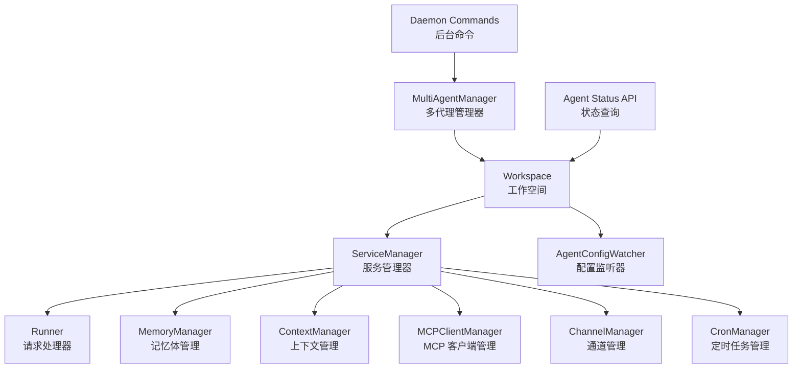
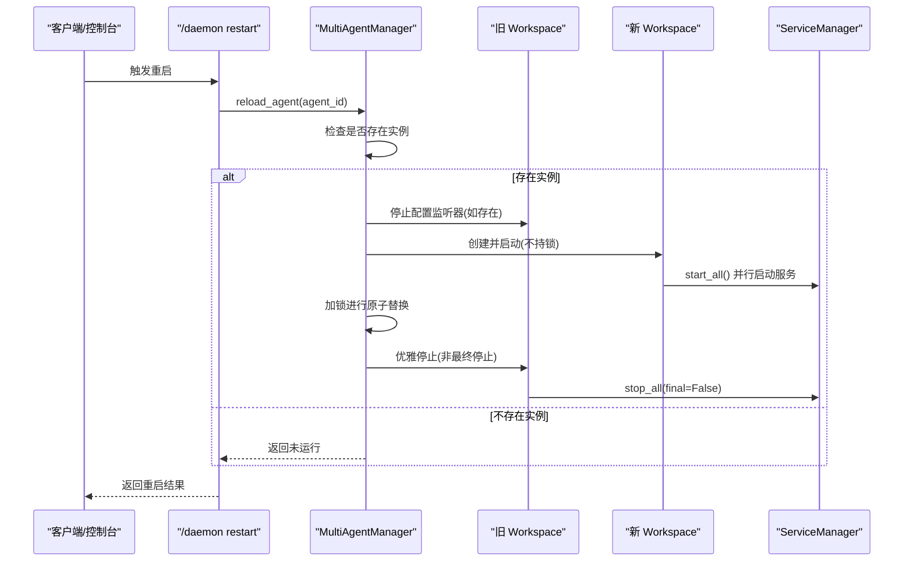
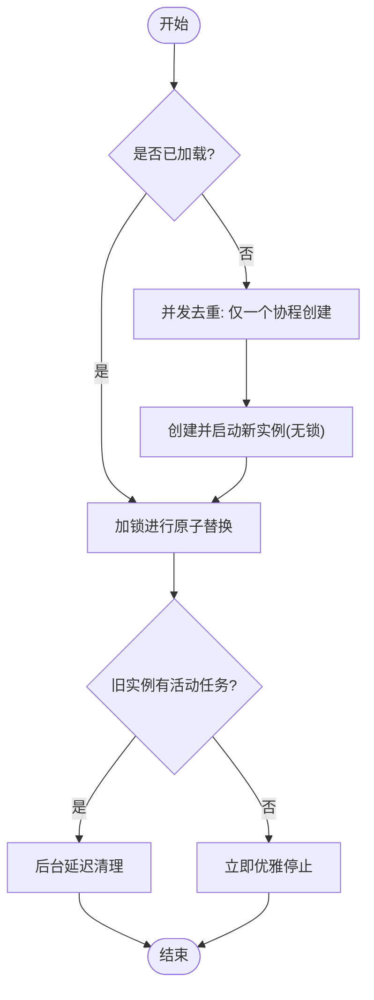
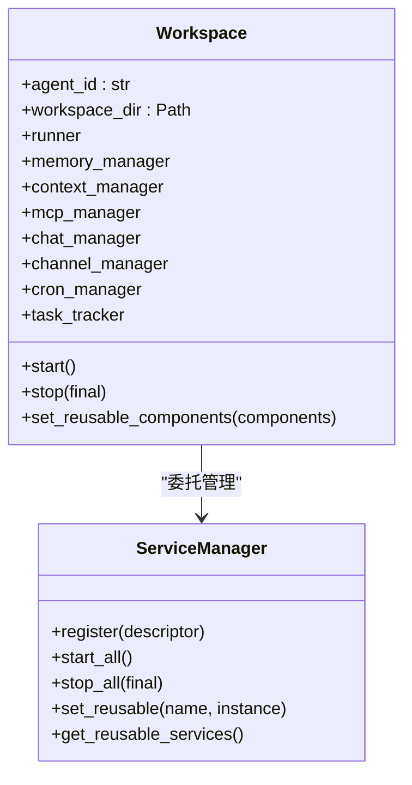
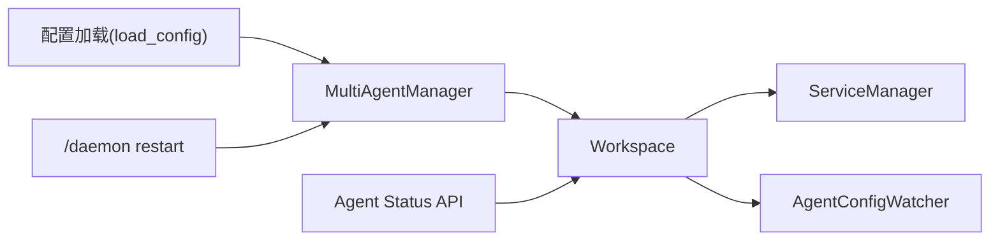

# 代理生命周期管理

<cite>
**本文引用的文件**
- [multi_agent_manager.py](file://src/qwenpaw/app/multi_agent_manager.py)
- [workspace.py](file://src/qwenpaw/app/workspace/workspace.py)
- [service_manager.py](file://src/qwenpaw/app/workspace/service_manager.py)
- [service_factories.py](file://src/qwenpaw/app/workspace/service_factories.py)
- [agent_config_watcher.py](file://src/qwenpaw/app/agent_config_watcher.py)
- [daemon_commands.py](file://src/qwenpaw/app/runner/daemon_commands.py)
- [utils.py](file://src/qwenpaw/app/utils.py)
- [agent_status.py](file://src/qwenpaw/app/routers/agent_status.py)
- [config.py](file://src/qwenpaw/config/config.py)
- [exceptions.py](file://src/qwenpaw/exceptions.py)
</cite>

## 目录
1. [简介](#简介)
2. [项目结构](#项目结构)
3. [核心组件](#核心组件)
4. [架构总览](#架构总览)
5. [详细组件分析](#详细组件分析)
6. [依赖分析](#依赖分析)
7. [性能考虑](#性能考虑)
8. [故障排查指南](#故障排查指南)
9. [结论](#结论)
10. [附录](#附录)

## 简介
本文件系统性阐述 QwenPaw 的“代理生命周期管理”能力，覆盖代理的启动、运行、停止与重启（含零停机重载）全流程。重点包括：
- 代理状态转换与资源分配/释放机制
- 错误处理与恢复策略
- 零停机重载的实现原理与优雅关闭流程
- 代理与工作空间的生命周期关系
- 多代理并发管理的同步机制
- 典型使用场景下的代码路径参考（以文件路径+行号形式给出）

## 项目结构
围绕代理生命周期管理的关键模块如下：
- 多代理管理器：负责懒加载、并发启动、原子替换式重载、优雅停止与后台清理
- 工作空间：封装单个代理的完整运行时（Runner、ChannelManager、MemoryManager、MCPClientManager、CronManager 等）
- 服务管理器：统一注册、并发/顺序启动、可复用组件传递、优雅停止
- 配置监听器：检测 agent.json 变化并触发重载
- 后台命令：支持 /daemon restart 触发零停机重载
- 状态查询：提供运行时状态与任务统计
- 异常体系：统一模型/通道/技能等异常类型与转换

图表来源
- [multi_agent_manager.py:22-536](file://src/qwenpaw/app/multi_agent_manager.py#L22-L536)
- [workspace.py:38-467](file://src/qwenpaw/app/workspace/workspace.py#L38-L467)
- [service_manager.py:76-453](file://src/qwenpaw/app/workspace/service_manager.py#L76-L453)
- [agent_config_watcher.py:44-219](file://src/qwenpaw/app/agent_config_watcher.py#L44-L219)
- [daemon_commands.py:134-170](file://src/qwenpaw/app/runner/daemon_commands.py#L134-L170)
- [agent_status.py:16-94](file://src/qwenpaw/app/routers/agent_status.py#L16-L94)

章节来源
- [multi_agent_manager.py:22-536](file://src/qwenpaw/app/multi_agent_manager.py#L22-L536)
- [workspace.py:38-467](file://src/qwenpaw/app/workspace/workspace.py#L38-L467)
- [service_manager.py:76-453](file://src/qwenpaw/app/workspace/service_manager.py#L76-L453)

## 核心组件
- MultiAgentManager：集中管理多个 Workspace 实例，提供懒加载、并发启动、原子替换式重载、优雅停止与后台清理；内部使用异步锁保证线程安全，使用事件协调同一 agent 的并发启动去重。
- Workspace：单个代理的工作空间，封装 Runner、ChannelManager、MemoryManager、MCPClientManager、CronManager 等组件，并通过 ServiceManager 统一生命周期管理。
- ServiceManager：声明式注册服务描述符，按优先级并发/顺序启动/停止，支持可复用组件在重载时传递，避免重建昂贵资源。
- AgentConfigWatcher：轮询 agent.json，仅在 channels 或 heartbeat 发生有意义变化时触发重载，确保磁盘编辑也能走原子替换流程。
- Daemon Commands：/daemon restart 命令入口，调用 MultiAgentManager.reload_agent 实现零停机重载。
- Agent Status API：对外暴露代理状态（禁用/空闲/运行）、活动任务数与时间戳，便于运维观测。

章节来源
- [multi_agent_manager.py:22-536](file://src/qwenpaw/app/multi_agent_manager.py#L22-L536)
- [workspace.py:38-467](file://src/qwenpaw/app/workspace/workspace.py#L38-L467)
- [service_manager.py:76-453](file://src/qwenpaw/app/workspace/service_manager.py#L76-L453)
- [agent_config_watcher.py:44-219](file://src/qwenpaw/app/agent_config_watcher.py#L44-L219)
- [daemon_commands.py:134-170](file://src/qwenpaw/app/runner/daemon_commands.py#L134-L170)
- [agent_status.py:16-94](file://src/qwenpaw/app/routers/agent_status.py#L16-L94)

## 架构总览
下图展示从请求到代理实例的全链路交互，以及零停机重载的关键步骤。

图表来源
- [daemon_commands.py:134-170](file://src/qwenpaw/app/runner/daemon_commands.py#L134-L170)
- [multi_agent_manager.py:255-380](file://src/qwenpaw/app/multi_agent_manager.py#L255-L380)
- [workspace.py:438-458](file://src/qwenpaw/app/workspace/workspace.py#L438-L458)
- [service_manager.py:362-453](file://src/qwenpaw/app/workspace/service_manager.py#L362-L453)

## 详细组件分析

### 多代理管理器（MultiAgentManager）
- 懒加载与并发启动：首次访问某 agent_id 时才创建并启动；启动过程中仅短暂持有锁用于字典检查/变更，其余耗时初始化在释放锁后执行，从而实现真正并发启动。
- 原子替换式重载（零停机）：先在无锁状态下创建并启动新实例，再在极短的加锁窗口内完成旧实例替换，最后在无锁状态下优雅停止旧实例；若旧实例仍有活动任务，则安排后台延迟清理。
- 优雅停止：stop_agent 支持直接停止；reload_agent 中的优雅停止会根据是否有活动任务决定立即停止或延后清理。
- 并发去重：同一 agent_id 的并发 get_agent 请求会被协调，首个请求负责实际启动，其他等待其完成。
- 批量启动：start_all_configured_agents 过滤 enabled=true 的代理并并发启动，提升整体启动效率。

图表来源
- [multi_agent_manager.py:42-105](file://src/qwenpaw/app/multi_agent_manager.py#L42-L105)
- [multi_agent_manager.py:255-380](file://src/qwenpaw/app/multi_agent_manager.py#L255-L380)

章节来源
- [multi_agent_manager.py:22-536](file://src/qwenpaw/app/multi_agent_manager.py#L22-L536)

### 工作空间（Workspace）
- 组件注册：通过 _register_services 声明式注册 Runner、MemoryManager、ContextManager、MCPClientManager、ChannelManager、CronManager 等服务，定义启动/停止方法与优先级。
- 可复用组件：set_reusable_components 在 start() 前设置可复用组件（如 MemoryManager、ContextManager、ChatManager），避免重载时重建昂贵资源。
- 启动/停止：start() 负责加载配置、数据迁移与服务启动；stop(final) 支持最终停止（含可复用组件）与非最终停止（仅停止当前实例持有的组件）。
- 任务追踪：task_tracker 提供全局任务状态，供状态 API 查询。

图表来源
- [workspace.py:38-467](file://src/qwenpaw/app/workspace/workspace.py#L38-L467)
- [service_manager.py:76-453](file://src/qwenpaw/app/workspace/service_manager.py#L76-L453)

章节来源
- [workspace.py:38-467](file://src/qwenpaw/app/workspace/workspace.py#L38-L467)
- [service_manager.py:76-453](file://src/qwenpaw/app/workspace/service_manager.py#L76-L453)
- [service_factories.py:18-176](file://src/qwenpaw/app/workspace/service_factories.py#L18-L176)

### 服务管理器（ServiceManager）
- 描述符注册：ServiceDescriptor 定义服务类、初始化参数、后置初始化、启动/停止方法、可复用标记、依赖与优先级、并发初始化开关。
- 启动策略：按优先级分组，同优先级内并发启动；sequential 服务逐个串行启动；跨组之间 yield 以便服务端响应请求。
- 停止策略：逆序优先级停止，可复用组件在非最终停止时跳过，避免重复销毁。
- 可复用组件：支持在重载前收集旧实例可复用组件，在新实例 start() 前注入，减少资源重建成本。

章节来源
- [service_manager.py:32-453](file://src/qwenpaw/app/workspace/service_manager.py#L32-L453)

### 配置监听器（AgentConfigWatcher）
- 轮询 agent.json，计算 channels 与 heartbeat 的哈希值，仅当变化时触发重载。
- 触发重载前会禁用自身，避免轮询与重载之间的竞争条件。
- 通过 Workspace._manager 解耦地触发 MultiAgentManager.reload_agent，确保所有重载路径一致。

章节来源
- [agent_config_watcher.py:44-219](file://src/qwenpaw/app/agent_config_watcher.py#L44-L219)

### 后台命令（/daemon restart）
- 入口：run_daemon_restart(context) 调用 MultiAgentManager.reload_agent，返回用户可读的结果。
- 若未在应用中运行或 agent_id 为空，提示用户通过应用内聊天或进程管理工具执行。

章节来源
- [daemon_commands.py:134-170](file://src/qwenpaw/app/runner/daemon_commands.py#L134-L170)

### 状态查询（Agent Status API）
- 提供禁用/空闲/运行三种状态，以及活动任务数与最近任务起止时间。
- 对于禁用代理直接返回禁用状态；启用代理则通过 task_tracker 获取全局状态。

章节来源
- [agent_status.py:16-94](file://src/qwenpaw/app/routers/agent_status.py#L16-L94)

## 依赖分析
- 多代理管理器依赖配置加载与 Workspace；Workspace 依赖 ServiceManager 与各类运行时组件；AgentConfigWatcher 依赖 Workspace 注入的管理器引用。
- 关键耦合点：
  - MultiAgentManager 与 Workspace：实例映射、原子替换、优雅停止
  - Workspace 与 ServiceManager：组件生命周期与可复用传递
  - AgentConfigWatcher 与 MultiAgentManager：通过 Workspace._manager 解耦触发
  - Daemon Commands 与 MultiAgentManager：统一重载入口

图表来源
- [multi_agent_manager.py:16-17](file://src/qwenpaw/app/multi_agent_manager.py#L16-L17)
- [workspace.py:18-33](file://src/qwenpaw/app/workspace/workspace.py#L18-L33)
- [agent_config_watcher.py:137-141](file://src/qwenpaw/app/agent_config_watcher.py#L137-L141)
- [daemon_commands.py:134-170](file://src/qwenpaw/app/runner/daemon_commands.py#L134-L170)
- [agent_status.py:10-11](file://src/qwenpaw/app/routers/agent_status.py#L10-L11)

章节来源
- [multi_agent_manager.py:16-17](file://src/qwenpaw/app/multi_agent_manager.py#L16-L17)
- [workspace.py:18-33](file://src/qwenpaw/app/workspace/workspace.py#L18-L33)
- [agent_config_watcher.py:137-141](file://src/qwenpaw/app/agent_config_watcher.py#L137-L141)
- [daemon_commands.py:134-170](file://src/qwenpaw/app/runner/daemon_commands.py#L134-L170)
- [agent_status.py:10-11](file://src/qwenpaw/app/routers/agent_status.py#L10-L11)

## 性能考虑
- 并发启动：MultiAgentManager.get_agent 在创建/启动期间释放锁，允许多个代理并行初始化，显著缩短冷启动时间。
- 可复用组件：ServiceManager 支持在重载时传递可复用组件（如 MemoryManager、ContextManager、ChatManager），避免重建昂贵资源。
- 原子替换：reload_agent 的加锁窗口极短，替换后立即释放，降低对其他代理的影响。
- 优雅停止：stop(final=False) 避免在重载场景下重复销毁可复用组件，同时通过后台任务清理残留任务，平衡性能与一致性。

## 故障排查指南
- 启动失败
  - 现象：Workspace.start 抛出异常并回滚已启动组件。
  - 排查要点：查看 start() 中的日志与异常堆栈；确认配置加载成功、数据迁移完成；检查各服务 start 方法是否抛错。
  - 参考路径
    - [workspace.py:351-392](file://src/qwenpaw/app/workspace/workspace.py#L351-L392)
- 重载失败
  - 现象：新实例启动失败或替换后回退。
  - 排查要点：确认新实例创建与启动日志；检查旧实例配置监听器是否被正确停止；验证配置变更是否有效。
  - 参考路径
    - [multi_agent_manager.py:255-380](file://src/qwenpaw/app/multi_agent_manager.py#L255-L380)
- 零停机重载未生效
  - 现象：旧实例仍在处理任务，新实例未接管。
  - 排查要点：确认 AgentConfigWatcher 是否被禁用；检查 Manager._lock 是否被长时间占用；核对替换逻辑是否执行。
  - 参考路径
    - [agent_config_watcher.py:195-219](file://src/qwenpaw/app/agent_config_watcher.py#L195-L219)
    - [multi_agent_manager.py:361-377](file://src/qwenpaw/app/multi_agent_manager.py#L361-L377)
- 优雅停止异常
  - 现象：stop_all 抛出异常但不影响整体流程。
  - 排查要点：查看 stop 方法日志；确认可复用组件在 final=False 场景下被正确跳过。
  - 参考路径
    - [service_manager.py:362-453](file://src/qwenpaw/app/workspace/service_manager.py#L362-L453)
- 异常类型与转换
  - 现象：LLM/通道/技能等异常需要统一转换。
  - 排查要点：使用 convert_model_exception 将底层异常映射为标准 AgentRuntimeErrorException 子类，便于前端与日志统一处理。
  - 参考路径
    - [exceptions.py:165-254](file://src/qwenpaw/exceptions.py#L165-L254)

章节来源
- [workspace.py:351-392](file://src/qwenpaw/app/workspace/workspace.py#L351-L392)
- [multi_agent_manager.py:255-380](file://src/qwenpaw/app/multi_agent_manager.py#L255-L380)
- [agent_config_watcher.py:195-219](file://src/qwenpaw/app/agent_config_watcher.py#L195-L219)
- [service_manager.py:362-453](file://src/qwenpaw/app/workspace/service_manager.py#L362-L453)
- [exceptions.py:165-254](file://src/qwenpaw/exceptions.py#L165-L254)

## 结论
QwenPaw 的代理生命周期管理通过“懒加载 + 并发启动 + 原子替换 + 优雅停止 + 可复用组件传递”的组合拳，实现了高可用、低停机的代理运行时。MultiAgentManager 作为中枢，协调 Workspace 与 ServiceManager，确保在复杂业务场景下仍能保持稳定与高性能。配合 AgentConfigWatcher 与 /daemon restart，运维可在不中断服务的情况下完成配置更新与版本升级。

## 附录

### 代理状态与任务追踪
- 状态字段
  - status：disabled/idle/running
  - running_task_count：活动任务数
  - last_run_at/last_finish_at：最近任务起止时间
- 使用建议
  - 通过 Agent Status API 获取实时状态，结合任务追踪器监控长耗时任务。
- 参考路径
  - [agent_status.py:16-94](file://src/qwenpaw/app/routers/agent_status.py#L16-L94)

### 配置与校验
- 代理 ID 校验规则：长度、字符集、保留词、唯一性。
- 默认 ACP 代理配置：内置 opencode、qwen_code、claude_code、codex 等默认项。
- 参考路径
  - [config.py:120-189](file://src/qwenpaw/config/config.py#L120-L189)
  - [config.py:70-118](file://src/qwenpaw/config/config.py#L70-L118)

### 代码示例路径（以文件路径+行号形式给出）
- 启动代理（懒加载与并发）：[multi_agent_manager.py:42-105](file://src/qwenpaw/app/multi_agent_manager.py#L42-L105)
- 并发批量启动：[multi_agent_manager.py:470-531](file://src/qwenpaw/app/multi_agent_manager.py#L470-L531)
- 原子替换式重载（零停机）：[multi_agent_manager.py:255-380](file://src/qwenpaw/app/multi_agent_manager.py#L255-L380)
- 优雅停止（区分 final 与非 final）：[workspace.py:438-458](file://src/qwenpaw/app/workspace/workspace.py#L438-L458)
- 可复用组件传递：[workspace.py:318-350](file://src/qwenpaw/app/workspace/workspace.py#L318-L350)
- 服务并发/顺序启动策略：[service_manager.py:173-214](file://src/qwenpaw/app/workspace/service_manager.py#L173-L214)
- 配置监听与重载触发：[agent_config_watcher.py:142-219](file://src/qwenpaw/app/agent_config_watcher.py#L142-L219)
- /daemon restart 入口：[daemon_commands.py:134-170](file://src/qwenpaw/app/runner/daemon_commands.py#L134-L170)
- 后台调度重载（批量）：[utils.py:42-58](file://src/qwenpaw/app/utils.py#L42-L58)
- 异常转换（模型相关）：[exceptions.py:165-254](file://src/qwenpaw/exceptions.py#L165-L254)