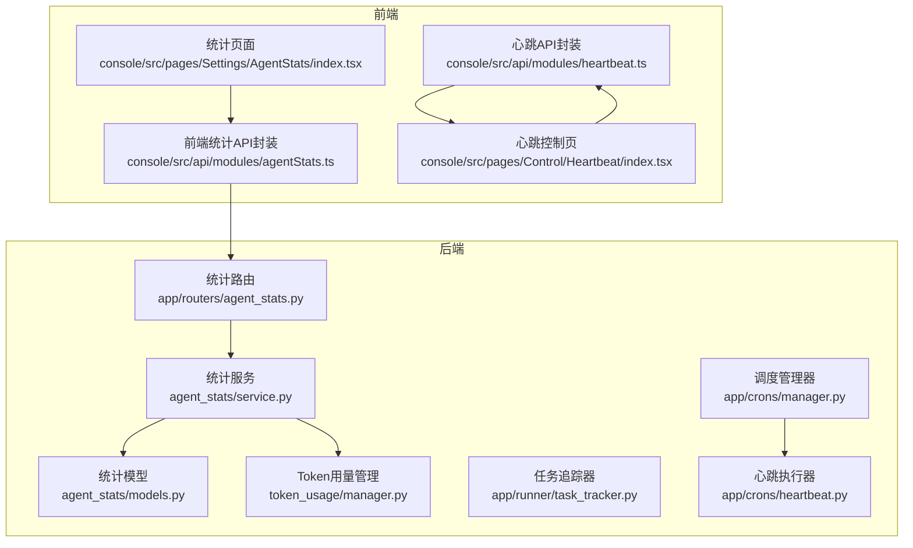
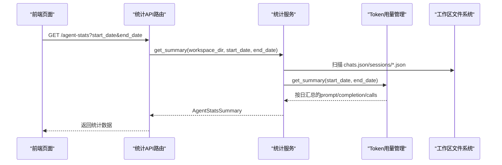
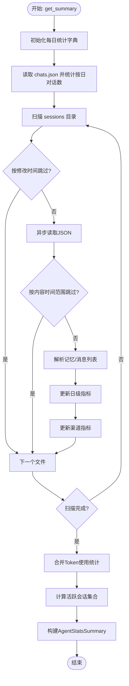
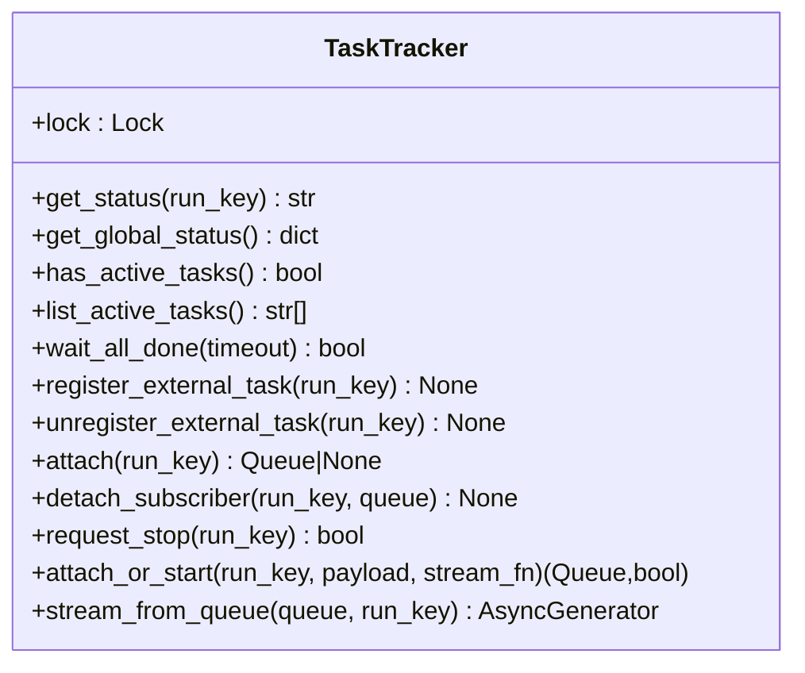
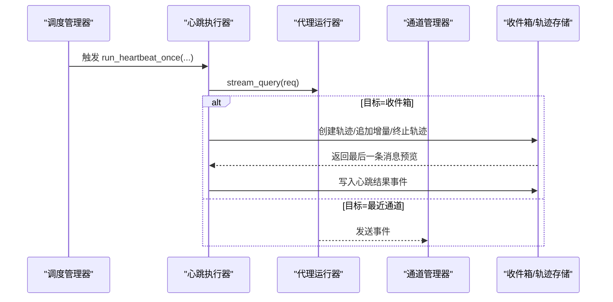
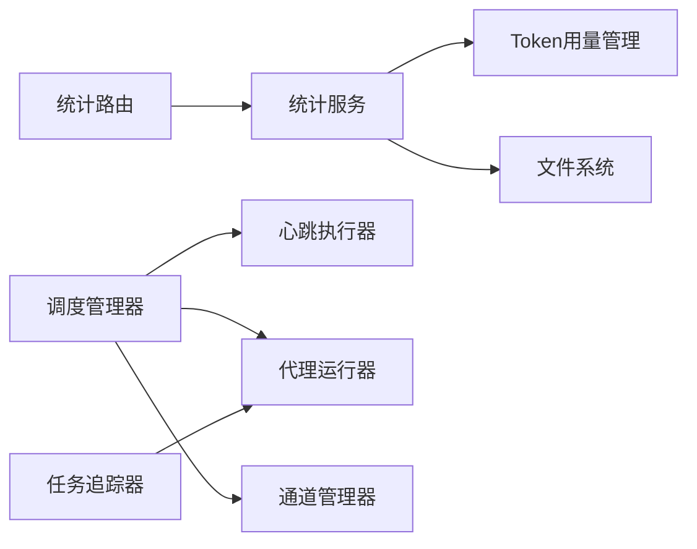

# 代理监控与性能优化

<cite>
**本文引用的文件**
- [agent_stats/models.py](file://src/qwenpaw/agent_stats/models.py)
- [agent_stats/service.py](file://src/qwenpaw/agent_stats/service.py)
- [agent_stats/__init__.py](file://src/qwenpaw/agent_stats/__init__.py)
- [app/routers/agent_stats.py](file://src/qwenpaw/app/routers/agent_stats.py)
- [app/runner/task_tracker.py](file://src/qwenpaw/app/runner/task_tracker.py)
- [app/crons/heartbeat.py](file://src/qwenpaw/app/crons/heartbeat.py)
- [app/crons/manager.py](file://src/qwenpaw/app/crons/manager.py)
- [token_usage/manager.py](file://src/qwenpaw/token_usage/manager.py)
- [utils/telemetry.py](file://src/qwenpaw/utils/telemetry.py)
- [console/src/api/modules/agentStats.ts](file://console/src/api/modules/agentStats.ts)
- [console/src/pages/Settings/AgentStats/index.tsx](file://console/src/pages/Settings/AgentStats/index.tsx)
- [console/src/api/modules/heartbeat.ts](file://console/src/api/modules/heartbeat.ts)
- [console/src/pages/Control/Heartbeat/index.tsx](file://console/src/pages/Control/Heartbeat/index.tsx)
- [scripts/startup_profile/viewer.html](file://scripts/startup_profile/viewer.html)
</cite>

## 目录
1. [简介](#简介)
2. [项目结构](#项目结构)
3. [核心组件](#核心组件)
4. [架构总览](#架构总览)
5. [详细组件分析](#详细组件分析)
6. [依赖分析](#依赖分析)
7. [性能考虑](#性能考虑)
8. [故障排查指南](#故障排查指南)
9. [结论](#结论)
10. [附录](#附录)

## 简介
本技术文档聚焦于 QwenPaw 的“代理监控与性能优化”能力，系统性阐述代理运行状态监控、性能指标采集与优化策略实施。内容覆盖代理任务跟踪、资源使用统计、响应时间监控与错误率分析机制；并提供性能瓶颈识别方法、内存使用优化、并发处理调优与缓存策略建议。文档同时给出可直接定位到源码路径的示例，帮助读者在实际环境中快速落地监控与优化。

## 项目结构
围绕监控与性能优化的关键模块分布如下：
- 后端统计与指标
  - 代理统计模型与服务：agent_stats/models.py、agent_stats/service.py、agent_stats/__init__.py
  - 统计 API 路由：app/routers/agent_stats.py
  - Token 使用管理：token_usage/manager.py
- 运行时任务跟踪
  - 任务追踪器：app/runner/task_tracker.py
- 定时心跳与调度
  - 心跳执行：app/crons/heartbeat.py
  - 调度管理：app/crons/manager.py
- 前端监控与展示
  - 代理统计 API 封装：console/src/api/modules/agentStats.ts
  - 代理统计页面：console/src/pages/Settings/AgentStats/index.tsx
  - 心跳配置 API 封装：console/src/api/modules/heartbeat.ts
  - 心跳控制页面：console/src/pages/Control/Heartbeat/index.tsx
- 启动性能分析
  - 启动性能可视化：scripts/startup_profile/viewer.html

图表来源
- [app/routers/agent_stats.py:16-55](file://src/qwenpaw/app/routers/agent_stats.py#L16-L55)
- [agent_stats/service.py:180-375](file://src/qwenpaw/agent_stats/service.py#L180-L375)
- [agent_stats/models.py:9-43](file://src/qwenpaw/agent_stats/models.py#L9-L43)
- [token_usage/manager.py:61-285](file://src/qwenpaw/token_usage/manager.py#L61-L285)
- [app/runner/task_tracker.py:37-350](file://src/qwenpaw/app/runner/task_tracker.py#L37-L350)
- [app/crons/heartbeat.py:169-379](file://src/qwenpaw/app/crons/heartbeat.py#L169-L379)
- [app/crons/manager.py:42-631](file://src/qwenpaw/app/crons/manager.py#L42-L631)
- [console/src/api/modules/agentStats.ts:1-16](file://console/src/api/modules/agentStats.ts#L1-L16)
- [console/src/pages/Settings/AgentStats/index.tsx:98-141](file://console/src/pages/Settings/AgentStats/index.tsx#L98-L141)
- [console/src/api/modules/heartbeat.ts:1-17](file://console/src/api/modules/heartbeat.ts#L1-L17)
- [console/src/pages/Control/Heartbeat/index.tsx:72-179](file://console/src/pages/Control/Heartbeat/index.tsx#L72-L179)

章节来源
- [app/routers/agent_stats.py:16-55](file://src/qwenpaw/app/routers/agent_stats.py#L16-L55)
- [agent_stats/service.py:180-375](file://src/qwenpaw/agent_stats/service.py#L180-L375)
- [agent_stats/models.py:9-43](file://src/qwenpaw/agent_stats/models.py#L9-L43)
- [token_usage/manager.py:61-285](file://src/qwenpaw/token_usage/manager.py#L61-L285)
- [app/runner/task_tracker.py:37-350](file://src/qwenpaw/app/runner/task_tracker.py#L37-L350)
- [app/crons/heartbeat.py:169-379](file://src/qwenpaw/app/crons/heartbeat.py#L169-L379)
- [app/crons/manager.py:42-631](file://src/qwenpaw/app/crons/manager.py#L42-L631)
- [console/src/api/modules/agentStats.ts:1-16](file://console/src/api/modules/agentStats.ts#L1-L16)
- [console/src/pages/Settings/AgentStats/index.tsx:98-141](file://console/src/pages/Settings/AgentStats/index.tsx#L98-L141)
- [console/src/api/modules/heartbeat.ts:1-17](file://console/src/api/modules/heartbeat.ts#L1-L17)
- [console/src/pages/Control/Heartbeat/index.tsx:72-179](file://console/src/pages/Control/Heartbeat/index.tsx#L72-L179)

## 核心组件
- 代理统计模型与服务
  - 模型定义：按日维度、渠道维度、总计指标（消息数、会话活跃数、Token 使用、LLM 调用次数、工具调用次数）等。
  - 服务实现：扫描工作区聊天与会话数据，聚合统计，并结合 Token 使用管理器汇总 LLM 调用与 Token 消耗。
- 统计 API 路由
  - 提供日期范围查询接口，返回 AgentStatsSummary。
- 任务追踪器
  - 提供任务生命周期管理：注册外部任务、查询全局状态、等待全部完成、请求停止等。
- 心跳与调度
  - 心跳执行：按配置周期读取查询文件，运行代理并可选派发至最近通道或写入收件箱，记录运行结果与异常。
  - 调度管理：基于 APScheduler 的定时任务管理，支持 cron 表达式与间隔触发，自动维护作业状态与历史。
- Token 使用管理
  - 缓冲与合并、异步刷新、按日期/模型/供应商聚合统计，提供摘要与明细查询。
- 前端监控与展示
  - 通过 API 封装与页面组件加载统计与心跳配置，支持日期选择与错误提示。

章节来源
- [agent_stats/models.py:9-43](file://src/qwenpaw/agent_stats/models.py#L9-L43)
- [agent_stats/service.py:180-375](file://src/qwenpaw/agent_stats/service.py#L180-L375)
- [app/routers/agent_stats.py:16-55](file://src/qwenpaw/app/routers/agent_stats.py#L16-L55)
- [app/runner/task_tracker.py:37-350](file://src/qwenpaw/app/runner/task_tracker.py#L37-L350)
- [app/crons/heartbeat.py:169-379](file://src/qwenpaw/app/crons/heartbeat.py#L169-L379)
- [app/crons/manager.py:42-631](file://src/qwenpaw/app/crons/manager.py#L42-L631)
- [token_usage/manager.py:61-285](file://src/qwenpaw/token_usage/manager.py#L61-L285)
- [console/src/api/modules/agentStats.ts:1-16](file://console/src/api/modules/agentStats.ts#L1-L16)
- [console/src/pages/Settings/AgentStats/index.tsx:98-141](file://console/src/pages/Settings/AgentStats/index.tsx#L98-L141)
- [console/src/api/modules/heartbeat.ts:1-17](file://console/src/api/modules/heartbeat.ts#L1-L17)
- [console/src/pages/Control/Heartbeat/index.tsx:72-179](file://console/src/pages/Control/Heartbeat/index.tsx#L72-L179)

## 架构总览
下图展示了从前端到后端统计与调度、再到任务执行与结果落盘的整体流程。

图表来源
- [app/routers/agent_stats.py:30-54](file://src/qwenpaw/app/routers/agent_stats.py#L30-L54)
- [agent_stats/service.py:184-364](file://src/qwenpaw/agent_stats/service.py#L184-L364)
- [token_usage/manager.py:173-235](file://src/qwenpaw/token_usage/manager.py#L173-L235)

章节来源
- [app/routers/agent_stats.py:30-54](file://src/qwenpaw/app/routers/agent_stats.py#L30-L54)
- [agent_stats/service.py:184-364](file://src/qwenpaw/agent_stats/service.py#L184-L364)
- [token_usage/manager.py:173-235](file://src/qwenpaw/token_usage/manager.py#L173-L235)

## 详细组件分析

### 代理统计模型与服务
- 数据模型
  - 渠道统计：按渠道统计会话数、用户/助手消息数与总消息数。
  - 日统计：按日期统计对话数、活跃会话数、用户/助手消息数、总消息数、Token 使用量、LLM 调用次数、工具调用次数。
  - 汇总：总活跃会话数、总消息数、总 Prompt/Completion Token、总 LLM 调用次数、总工具调用次数。
- 统计服务
  - 预计算每日基线字典，确保日期连续性。
  - 并发扫描 sessions 目录，按修改时间与内容时间范围进行跳过判断，减少无效 IO。
  - 异步解析会话文件，统计消息角色与工具调用，更新渠道与日级指标。
  - 合并 Token 使用管理器的按日统计，填充 prompt_tokens、completion_tokens、llm_calls。
  - 生成 AgentStatsSummary 结构化输出。

图表来源
- [agent_stats/service.py:184-364](file://src/qwenpaw/agent_stats/service.py#L184-L364)
- [agent_stats/models.py:9-43](file://src/qwenpaw/agent_stats/models.py#L9-L43)
- [token_usage/manager.py:173-235](file://src/qwenpaw/token_usage/manager.py#L173-L235)

章节来源
- [agent_stats/models.py:9-43](file://src/qwenpaw/agent_stats/models.py#L9-L43)
- [agent_stats/service.py:98-364](file://src/qwenpaw/agent_stats/service.py#L98-L364)
- [token_usage/manager.py:173-235](file://src/qwenpaw/token_usage/manager.py#L173-L235)

### 统计 API 路由
- 接口职责
  - 解析日期参数，默认近 30 天。
  - 获取当前工作空间，调用统计服务获取 AgentStatsSummary。
- 错误处理
  - 参数非法时回退默认值；异常统一记录日志。

章节来源
- [app/routers/agent_stats.py:16-55](file://src/qwenpaw/app/routers/agent_stats.py#L16-L55)

### 前端统计页面与 API 封装
- API 封装
  - 提供 getAgentStats(start_date, end_date) 请求方法。
- 页面逻辑
  - 默认选择近 7 天，支持日期区间变更后重新拉取。
  - 加载失败时弹出错误提示并清空数据。

章节来源
- [console/src/api/modules/agentStats.ts:1-16](file://console/src/api/modules/agentStats.ts#L1-L16)
- [console/src/pages/Settings/AgentStats/index.tsx:98-141](file://console/src/pages/Settings/AgentStats/index.tsx#L98-L141)

### 任务追踪器（运行状态监控）
- 能力概览
  - 注册/注销外部任务，使其被全局状态可见。
  - 查询运行状态、列出活动任务、等待全部完成、请求停止。
  - 内部生产者/消费者模型，支持事件缓冲与断连重放。
- 典型用途
  - 监控长时间运行的流式任务、后台任务队列。
  - 作为代理运行状态的“仪表盘”，辅助诊断阻塞与超时。

图表来源
- [app/runner/task_tracker.py:37-350](file://src/qwenpaw/app/runner/task_tracker.py#L37-L350)

章节来源
- [app/runner/task_tracker.py:37-350](file://src/qwenpaw/app/runner/task_tracker.py#L37-L350)

### 心跳与调度（响应时间与错误率监控）
- 心跳执行
  - 读取工作区中的查询文件，构造单条用户消息请求。
  - 可选目标：主会话、最近一次派发、收件箱（记录轨迹与最终预览）。
  - 超时与异常均记录并上报到收件箱事件。
- 调度管理
  - 支持 cron 表达式与间隔触发，自动维护作业状态与历史。
  - 心跳与“梦幻式”内存优化任务可独立启停与重排。

图表来源
- [app/crons/manager.py:466-497](file://src/qwenpaw/app/crons/manager.py#L466-L497)
- [app/crons/heartbeat.py:169-379](file://src/qwenpaw/app/crons/heartbeat.py#L169-L379)

章节来源
- [app/crons/heartbeat.py:169-379](file://src/qwenpaw/app/crons/heartbeat.py#L169-L379)
- [app/crons/manager.py:466-497](file://src/qwenpaw/app/crons/manager.py#L466-L497)

### Token 使用统计（资源使用与成本控制）
- 功能要点
  - 缓冲区异步刷盘，支持自定义刷新间隔。
  - 按日期/模型/供应商聚合，提供摘要与明细查询。
  - 在统计服务中被合并到每日指标，用于 LLM 调用与 Token 消耗分析。
- 优化建议
  - 调整 flush_interval 以平衡实时性与 IO 压力。
  - 对高频调用场景启用批量记录与合并策略。

章节来源
- [token_usage/manager.py:61-285](file://src/qwenpaw/token_usage/manager.py#L61-L285)
- [agent_stats/service.py:318-329](file://src/qwenpaw/agent_stats/service.py#L318-L329)

### 前端心跳配置与展示
- API 封装
  - 提供获取、更新心跳配置与立即执行心跳的接口。
- 页面逻辑
  - 解析/序列化间隔字符串，支持“仅在活跃时段”配置。
  - 保存成功/失败提示，加载失败兜底。

章节来源
- [console/src/api/modules/heartbeat.ts:1-17](file://console/src/api/modules/heartbeat.ts#L1-L17)
- [console/src/pages/Control/Heartbeat/index.tsx:72-179](file://console/src/pages/Control/Heartbeat/index.tsx#L72-L179)

### 启动性能分析（启动时间组成与函数调用）
- 工具说明
  - 提供启动阶段导入与函数执行的可视化报告，包含“完整启动=导入+初始化”的时间拆解。
- 实践价值
  - 识别启动瓶颈模块与热点函数，指导模块懒加载与依赖优化。

章节来源
- [scripts/startup_profile/viewer.html:807-1026](file://scripts/startup_profile/viewer.html#L807-L1026)
- [scripts/startup_profile/viewer.html:1099-1189](file://scripts/startup_profile/viewer.html#L1099-L1189)

## 依赖分析
- 组件耦合
  - 统计服务依赖工作区文件系统与 Token 使用管理器，耦合度适中，职责清晰。
  - 调度管理器与心跳执行器通过 Runner/Channel 管理器解耦，便于替换与扩展。
  - 任务追踪器采用弱引用与锁保护，避免循环引用与竞态。
- 外部依赖
  - APScheduler 用于定时任务调度。
  - aiofiles/orjson 用于异步文件读取与 JSON 解析。
  - FastAPI 路由提供统计接口。

图表来源
- [app/routers/agent_stats.py:30-54](file://src/qwenpaw/app/routers/agent_stats.py#L30-L54)
- [agent_stats/service.py:184-364](file://src/qwenpaw/agent_stats/service.py#L184-L364)
- [token_usage/manager.py:61-285](file://src/qwenpaw/token_usage/manager.py#L61-L285)
- [app/crons/manager.py:42-631](file://src/qwenpaw/app/crons/manager.py#L42-L631)
- [app/crons/heartbeat.py:169-379](file://src/qwenpaw/app/crons/heartbeat.py#L169-L379)
- [app/runner/task_tracker.py:37-350](file://src/qwenpaw/app/runner/task_tracker.py#L37-L350)

章节来源
- [app/routers/agent_stats.py:30-54](file://src/qwenpaw/app/routers/agent_stats.py#L30-L54)
- [agent_stats/service.py:184-364](file://src/qwenpaw/agent_stats/service.py#L184-L364)
- [token_usage/manager.py:61-285](file://src/qwenpaw/token_usage/manager.py#L61-L285)
- [app/crons/manager.py:42-631](file://src/qwenpaw/app/crons/manager.py#L42-L631)
- [app/crons/heartbeat.py:169-379](file://src/qwenpaw/app/crons/heartbeat.py#L169-L379)
- [app/runner/task_tracker.py:37-350](file://src/qwenpaw/app/runner/task_tracker.py#L37-L350)

## 性能考虑
- 并发与吞吐
  - 统计服务对会话文件扫描使用信号量限制并发文件描述符占用，CPU 核心数倍的并发可提升吞吐但需注意磁盘与内存压力。
  - Token 使用管理器的异步缓冲与合并策略降低频繁 IO。
- I/O 优化
  - 通过修改时间与内容时间范围跳过不必要文件，显著减少无效解析。
  - 使用异步文件读取与 JSON 解析，避免阻塞事件循环。
- 资源与成本
  - 利用 Token 使用统计进行成本归因与预算预警，结合模型/供应商筛选定位高消耗来源。
- 响应时间与错误率
  - 心跳执行设置超时阈值并记录异常，配合收件箱事件实现错误率与延迟可视化。
- 内存优化
  - “梦幻式”内存优化任务（由调度管理器触发）可用于定期清理与压缩上下文，缓解长期运行内存增长。
- 缓存策略
  - 统计结果可按日期范围缓存，前端轮询时利用本地缓存减少重复请求；心跳配置变更后主动失效缓存。

章节来源
- [agent_stats/service.py:257-316](file://src/qwenpaw/agent_stats/service.py#L257-L316)
- [token_usage/manager.py:72-91](file://src/qwenpaw/token_usage/manager.py#L72-L91)
- [app/crons/manager.py:486-497](file://src/qwenpaw/app/crons/manager.py#L486-L497)

## 故障排查指南
- 统计接口返回为空或异常
  - 检查工作区目录是否存在 chats.json 与 sessions 子目录。
  - 确认日期范围是否合理，必要时扩大范围重试。
  - 查看统计服务日志，关注文件读取与 JSON 解析异常。
- 心跳未执行或超时
  - 确认心跳配置已启用且处于活跃时段。
  - 检查查询文件是否存在且非空。
  - 关注心跳回调日志中的超时与异常记录。
- 任务长时间卡住
  - 使用任务追踪器查询活动任务列表与运行状态。
  - 若为外部任务，确认是否正确注册与注销。
- 启动缓慢
  - 使用启动性能分析工具查看导入与函数执行耗时，定位瓶颈模块。

章节来源
- [app/routers/agent_stats.py:30-54](file://src/qwenpaw/app/routers/agent_stats.py#L30-L54)
- [agent_stats/service.py:257-316](file://src/qwenpaw/agent_stats/service.py#L257-L316)
- [app/crons/heartbeat.py:169-379](file://src/qwenpaw/app/crons/heartbeat.py#L169-L379)
- [app/runner/task_tracker.py:86-129](file://src/qwenpaw/app/runner/task_tracker.py#L86-L129)
- [scripts/startup_profile/viewer.html:807-1026](file://scripts/startup_profile/viewer.html#L807-L1026)

## 结论
QwenPaw 的监控与性能优化体系以“统计服务 + Token 管理 + 调度与心跳 + 任务追踪器 + 前端展示”为核心闭环，既满足日常运营的可观测性需求，也为性能优化提供了明确抓手。通过并发扫描、异步缓冲、时间范围跳过与内存优化任务等手段，可在保证准确性的同时兼顾效率。建议在生产环境结合缓存与告警策略，持续迭代优化。

## 附录
- 快速上手示例（路径指引）
  - 设置统计日期范围并拉取数据：[console/src/pages/Settings/AgentStats/index.tsx:109-141](file://console/src/pages/Settings/AgentStats/index.tsx#L109-L141)
  - 调用统计 API：[console/src/api/modules/agentStats.ts:10-16](file://console/src/api/modules/agentStats.ts#L10-L16)
  - 获取统计摘要（后端）：[app/routers/agent_stats.py:30-54](file://src/qwenpaw/app/routers/agent_stats.py#L30-L54)
  - 统计服务实现：[agent_stats/service.py:184-364](file://src/qwenpaw/agent_stats/service.py#L184-L364)
  - Token 使用统计：[token_usage/manager.py:173-235](file://src/qwenpaw/token_usage/manager.py#L173-L235)
  - 任务追踪器使用：[app/runner/task_tracker.py:131-187](file://src/qwenpaw/app/runner/task_tracker.py#L131-L187)
  - 心跳配置与执行：[console/src/pages/Control/Heartbeat/index.tsx:107-139](file://console/src/pages/Control/Heartbeat/index.tsx#L107-L139)、[app/crons/heartbeat.py:169-379](file://src/qwenpaw/app/crons/heartbeat.py#L169-L379)
  - 启动性能分析：[scripts/startup_profile/viewer.html:807-1026](file://scripts/startup_profile/viewer.html#L807-L1026)