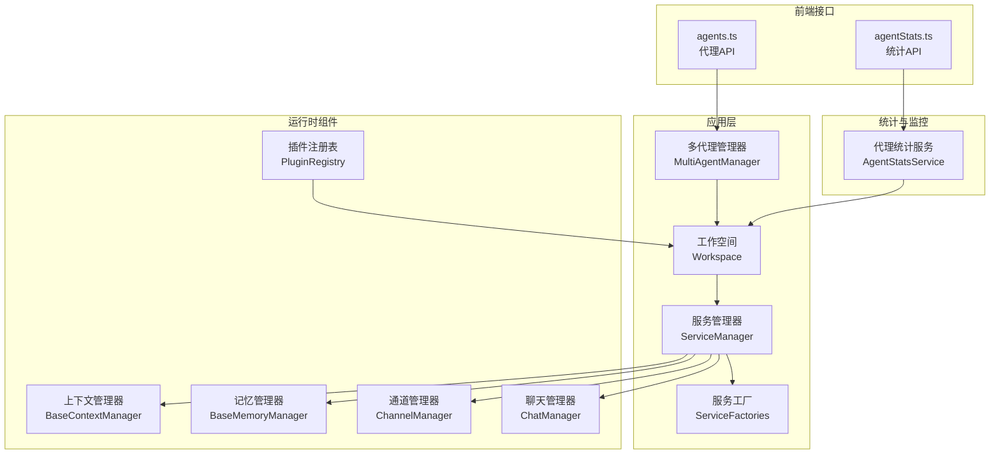
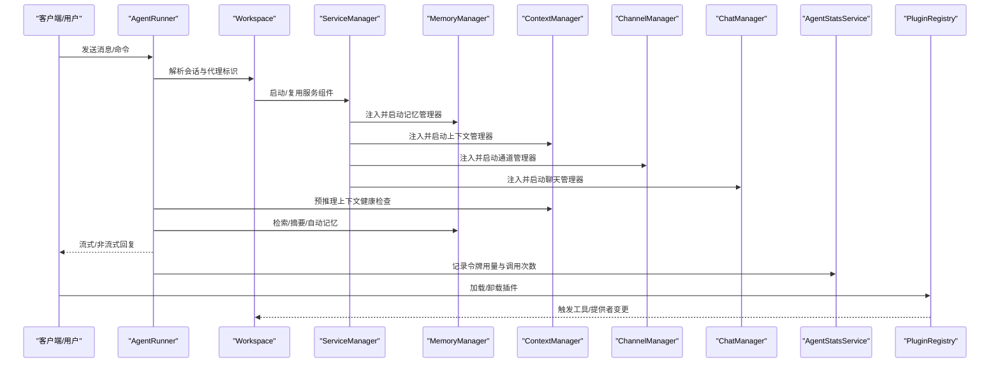
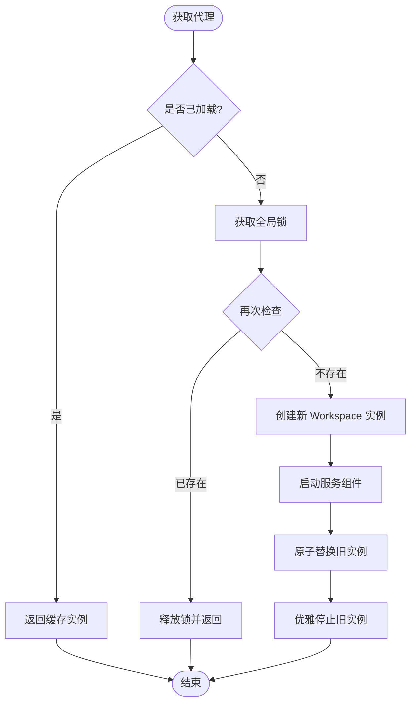
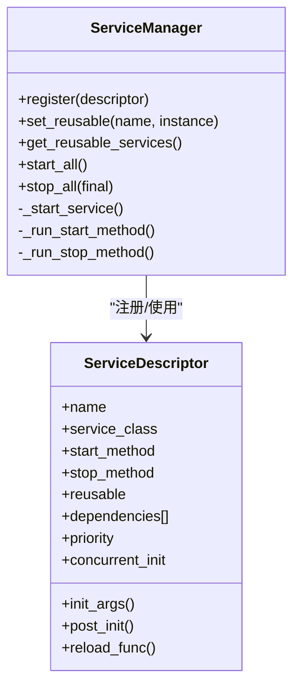
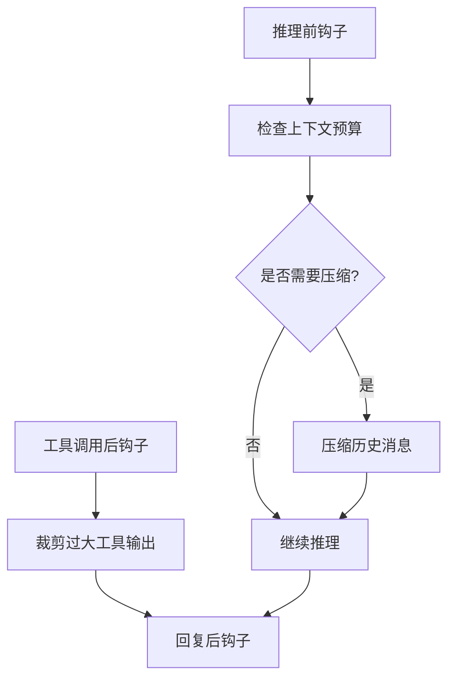
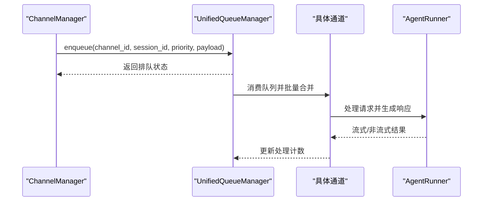
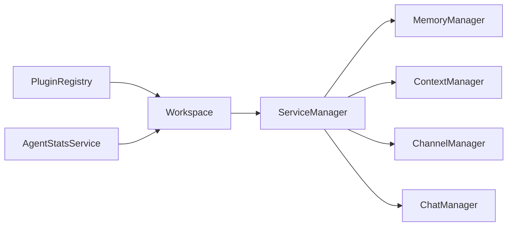

# 代理管理

<cite>
**本文引用的文件**
- [src/qwenpaw/app/workspace/__init__.py](file://src/qwenpaw/app/workspace/__init__.py)
- [src/qwenpaw/app/workspace/workspace.py](file://src/qwenpaw/app/workspace/workspace.py)
- [src/qwenpaw/app/workspace/service_manager.py](file://src/qwenpaw/app/workspace/service_manager.py)
- [src/qwenpaw/app/workspace/service_factories.py](file://src/qwenpaw/app/workspace/service_factories.py)
- [src/qwenpaw/app/multi_agent_manager.py](file://src/qwenpaw/app/multi_agent_manager.py)
- [src/qwenpaw/agents/context/base_context_manager.py](file://src/qwenpaw/agents/context/base_context_manager.py)
- [src/qwenpaw/agents/memory/base_memory_manager.py](file://src/qwenpaw/agents/memory/base_memory_manager.py)
- [src/qwenpaw/agents/skill_system/hub.py](file://src/qwenpaw/agents/skill_system/hub.py)
- [src/qwenpaw/app/channels/manager.py](file://src/qwenpaw/app/channels/manager.py)
- [src/qwenpaw/app/runner/manager.py](file://src/qwenpaw/app/runner/manager.py)
- [src/qwenpaw/agent_stats/service.py](file://src/qwenpaw/agent_stats/service.py)
- [src/qwenpaw/plugins/registry.py](file://src/qwenpaw/plugins/registry.py)
- [src/qwenpaw/app/routers/plugins.py](file://src/qwenpaw/app/routers/plugins.py)
- [src/qwenpaw/app/runner/mission_dispatch.py](file://src/qwenpaw/app/runner/mission_dispatch.py)
- [src/qwenpaw/app/runner/runner.py](file://src/qwenpaw/app/runner/runner.py)
- [console/src/api/modules/agents.ts](file://console/src/api/modules/agents.ts)
- [console/src/api/modules/agentStats.ts](file://console/src/api/modules/agentStats.ts)
- [website/public/docs/multi-agent.en.md](file://website/public/docs/multi-agent.en.md)
</cite>

## 目录
1. [简介](#简介)
2. [项目结构](#项目结构)
3. [核心组件](#核心组件)
4. [架构总览](#架构总览)
5. [详细组件分析](#详细组件分析)
6. [依赖关系分析](#依赖关系分析)
7. [性能考量](#性能考量)
8. [故障排除指南](#故障排除指南)
9. [结论](#结论)
10. [附录](#附录)

## 简介
本技术文档围绕 QwenPaw 的代理管理系统，系统性阐述代理的创建、配置、生命周期管理与多代理协作机制；详解代理配置项、工作空间隔离、内存与上下文管理、任务调度与统计监控，并提供代理与技能系统、通道系统、插件系统的集成方式说明。文档同时给出可操作的实践建议与排障指引，帮助开发者在不深入源码的前提下高效使用与扩展代理能力。

## 项目结构
代理管理相关代码主要分布在以下模块：
- 工作空间与多代理管理：workspace、multi_agent_manager
- 组件生命周期与服务注册：service_manager、service_factories
- 上下文与记忆：context、memory
- 技能系统：skill_system/hub
- 通道系统：channels/manager
- 聊天会话管理：runner/manager
- 统计与监控：agent_stats/service
- 插件系统：plugins/registry、app/routers/plugins
- 控制命令与任务编排：app/runner/mission_dispatch、app/runner/runner
- 前端 API 定义：console/src/api/modules

图示来源
- [src/qwenpaw/app/multi_agent_manager.py:22-380](file://src/qwenpaw/app/multi_agent_manager.py#L22-L380)
- [src/qwenpaw/app/workspace/workspace.py:38-193](file://src/qwenpaw/app/workspace/workspace.py#L38-L193)
- [src/qwenpaw/app/workspace/service_manager.py:76-453](file://src/qwenpaw/app/workspace/service_manager.py#L76-L453)
- [src/qwenpaw/app/workspace/service_factories.py:18-176](file://src/qwenpaw/app/workspace/service_factories.py#L18-L176)
- [src/qwenpaw/agents/context/base_context_manager.py:15-267](file://src/qwenpaw/agents/context/base_context_manager.py#L15-L267)
- [src/qwenpaw/agents/memory/base_memory_manager.py:18-330](file://src/qwenpaw/agents/memory/base_memory_manager.py#L18-L330)
- [src/qwenpaw/app/channels/manager.py:68-800](file://src/qwenpaw/app/channels/manager.py#L68-L800)
- [src/qwenpaw/app/runner/manager.py:17-286](file://src/qwenpaw/app/runner/manager.py#L17-L286)
- [src/qwenpaw/plugins/registry.py:95-598](file://src/qwenpaw/plugins/registry.py#L95-L598)
- [src/qwenpaw/agent_stats/service.py:180-375](file://src/qwenpaw/agent_stats/service.py#L180-L375)
- [console/src/api/modules/agents.ts:10-55](file://console/src/api/modules/agents.ts#L10-L55)
- [console/src/api/modules/agentStats.ts:1-16](file://console/src/api/modules/agentStats.ts#L1-L16)

章节来源
- [src/qwenpaw/app/workspace/__init__.py:1-13](file://src/qwenpaw/app/workspace/__init__.py#L1-L13)
- [src/qwenpaw/app/workspace/workspace.py:38-193](file://src/qwenpaw/app/workspace/workspace.py#L38-L193)
- [src/qwenpaw/app/workspace/service_manager.py:76-453](file://src/qwenpaw/app/workspace/service_manager.py#L76-L453)
- [src/qwenpaw/app/workspace/service_factories.py:18-176](file://src/qwenpaw/app/workspace/service_factories.py#L18-L176)
- [src/qwenpaw/app/multi_agent_manager.py:22-380](file://src/qwenpaw/app/multi_agent_manager.py#L22-L380)
- [src/qwenpaw/agents/context/base_context_manager.py:15-267](file://src/qwenpaw/agents/context/base_context_manager.py#L15-L267)
- [src/qwenpaw/agents/memory/base_memory_manager.py:18-330](file://src/qwenpaw/agents/memory/base_memory_manager.py#L18-L330)
- [src/qwenpaw/app/channels/manager.py:68-800](file://src/qwenpaw/app/channels/manager.py#L68-L800)
- [src/qwenpaw/app/runner/manager.py:17-286](file://src/qwenpaw/app/runner/manager.py#L17-L286)
- [src/qwenpaw/agent_stats/service.py:180-375](file://src/qwenpaw/agent_stats/service.py#L180-L375)
- [src/qwenpaw/plugins/registry.py:95-598](file://src/qwenpaw/plugins/registry.py#L95-L598)
- [src/qwenpaw/app/routers/plugins.py:128-356](file://src/qwenpaw/app/routers/plugins.py#L128-L356)
- [console/src/api/modules/agents.ts:10-55](file://console/src/api/modules/agents.ts#L10-L55)
- [console/src/api/modules/agentStats.ts:1-16](file://console/src/api/modules/agentStats.ts#L1-L16)

## 核心组件
- 多代理管理器（MultiAgentManager）：负责按需懒加载、并发启动、热重载与实例替换，确保不同代理互不影响且可平滑升级。
- 工作空间（Workspace）：单个代理的完整运行时容器，内含 Runner、ChannelManager、MemoryManager、MCP 客户端、Cron 等组件。
- 服务管理器（ServiceManager）：统一注册、并发/顺序初始化、依赖排序、可复用组件迁移与优雅停机。
- 服务工厂（ServiceFactories）：封装各组件的创建与注入逻辑，便于测试与可维护性。
- 上下文管理器（BaseContextManager）：抽象上下文窗口与压缩策略，支持预推理健康检查与后处理裁剪。
- 记忆管理器（BaseMemoryManager）：抽象记忆存储、检索、自动摘要与后台优化任务队列。
- 通道管理器（ChannelManager）：统一消息入队、优先级路由、批量合并与消费者循环，支持动态重启与队列清理。
- 聊天管理器（ChatManager）：会话规范的持久化与并发安全读写。
- 代理统计服务（AgentStatsService）：基于会话与聊天数据聚合统计，支持按日期范围查询。
- 技能系统（SkillSystem.Hub）：技能包的下载、解析、冲突检测与安装流程。
- 插件系统（PluginRegistry/Routers）：插件 HTTP 路由挂载、提供者注册、控制命令与启动/关闭钩子。
- 前端代理 API 与统计 API：提供列表、创建、更新、删除、排序、启用/禁用与统计查询等接口。

章节来源
- [src/qwenpaw/app/multi_agent_manager.py:22-380](file://src/qwenpaw/app/multi_agent_manager.py#L22-L380)
- [src/qwenpaw/app/workspace/workspace.py:38-193](file://src/qwenpaw/app/workspace/workspace.py#L38-L193)
- [src/qwenpaw/app/workspace/service_manager.py:76-453](file://src/qwenpaw/app/workspace/service_manager.py#L76-L453)
- [src/qwenpaw/app/workspace/service_factories.py:18-176](file://src/qwenpaw/app/workspace/service_factories.py#L18-L176)
- [src/qwenpaw/agents/context/base_context_manager.py:15-267](file://src/qwenpaw/agents/context/base_context_manager.py#L15-L267)
- [src/qwenpaw/agents/memory/base_memory_manager.py:18-330](file://src/qwenpaw/agents/memory/base_memory_manager.py#L18-L330)
- [src/qwenpaw/app/channels/manager.py:68-800](file://src/qwenpaw/app/channels/manager.py#L68-L800)
- [src/qwenpaw/app/runner/manager.py:17-286](file://src/qwenpaw/app/runner/manager.py#L17-L286)
- [src/qwenpaw/agent_stats/service.py:180-375](file://src/qwenpaw/agent_stats/service.py#L180-L375)
- [src/qwenpaw/agents/skill_system/hub.py:1-800](file://src/qwenpaw/agents/skill_system/hub.py#L1-L800)
- [src/qwenpaw/plugins/registry.py:95-598](file://src/qwenpaw/plugins/registry.py#L95-L598)
- [src/qwenpaw/app/routers/plugins.py:128-356](file://src/qwenpaw/app/routers/plugins.py#L128-L356)
- [console/src/api/modules/agents.ts:10-55](file://console/src/api/modules/agents.ts#L10-L55)
- [console/src/api/modules/agentStats.ts:1-16](file://console/src/api/modules/agentStats.ts#L1-L16)

## 架构总览
下图展示了代理从“请求进入”到“多代理协作”的端到端流程，以及与通道、记忆、上下文、统计与插件的交互关系。

图示来源
- [src/qwenpaw/app/runner/runner.py:443-468](file://src/qwenpaw/app/runner/runner.py#L443-L468)
- [src/qwenpaw/app/workspace/workspace.py:153-193](file://src/qwenpaw/app/workspace/workspace.py#L153-L193)
- [src/qwenpaw/app/workspace/service_manager.py:173-251](file://src/qwenpaw/app/workspace/service_manager.py#L173-L251)
- [src/qwenpaw/agents/context/base_context_manager.py:86-176](file://src/qwenpaw/agents/context/base_context_manager.py#L86-L176)
- [src/qwenpaw/agents/memory/base_memory_manager.py:42-94](file://src/qwenpaw/agents/memory/base_memory_manager.py#L42-L94)
- [src/qwenpaw/app/channels/manager.py:462-541](file://src/qwenpaw/app/channels/manager.py#L462-L541)
- [src/qwenpaw/app/runner/manager.py:17-286](file://src/qwenpaw/app/runner/manager.py#L17-L286)
- [src/qwenpaw/agent_stats/service.py:180-375](file://src/qwenpaw/agent_stats/service.py#L180-L375)
- [src/qwenpaw/plugins/registry.py:95-598](file://src/qwenpaw/plugins/registry.py#L95-L598)

## 详细组件分析

### 多代理管理与工作空间隔离
- 懒加载与去重：首次访问某 agent_id 时才创建并启动 Workspace，避免冷启动开销；同一时刻对相同 agent_id 的并发请求通过事件协调，仅首个创建实例，其余等待。
- 并行启动：不同 agent 的 Workspace 并发初始化，缩短整体可用时间；内部快速路径不持锁，慢启动部分在锁外执行。
- 热重载：新旧实例原子替换，保留可复用组件（如 MemoryManager），失败时回滚并保证旧实例继续服务。
- 可靠停机：通过 TaskTracker 与延迟停机策略，确保后台任务完成或超时后停止，避免请求中断。

图示来源
- [src/qwenpaw/app/multi_agent_manager.py:42-120](file://src/qwenpaw/app/multi_agent_manager.py#L42-L120)
- [src/qwenpaw/app/multi_agent_manager.py:309-380](file://src/qwenpaw/app/multi_agent_manager.py#L309-L380)

章节来源
- [src/qwenpaw/app/multi_agent_manager.py:22-380](file://src/qwenpaw/app/multi_agent_manager.py#L22-L380)

### 服务管理器与组件生命周期
- 服务描述符（ServiceDescriptor）：声明服务类、构造参数、后置初始化、启动/停止方法、可复用性、依赖与优先级、并发初始化等。
- 启动阶段：按优先级分组，同组内并发启动；顺序服务串行；跨组之间让出事件循环以服务 HTTP 请求。
- 停止阶段：逆序停止，跳过可复用组件（除非最终停机）；异常记录但不阻断整体停机。
- 可复用组件：在热重载时从旧实例迁移至新实例，必要时触发 reload 回调。

图示来源
- [src/qwenpaw/app/workspace/service_manager.py:32-74](file://src/qwenpaw/app/workspace/service_manager.py#L32-L74)
- [src/qwenpaw/app/workspace/service_manager.py:76-453](file://src/qwenpaw/app/workspace/service_manager.py#L76-L453)

章节来源
- [src/qwenpaw/app/workspace/service_manager.py:76-453](file://src/qwenpaw/app/workspace/service_manager.py#L76-L453)
- [src/qwenpaw/app/workspace/service_factories.py:18-176](file://src/qwenpaw/app/workspace/service_factories.py#L18-L176)

### 上下文与记忆管理
- 上下文管理器：在推理前进行健康检查与压缩，在工具调用后裁剪结果，提供统一的上下文压缩接口。
- 记忆管理器：支持检索、摘要、自动记忆抽取与后台优化任务队列；提供并发安全的状态与任务跟踪。

图示来源
- [src/qwenpaw/agents/context/base_context_manager.py:86-176](file://src/qwenpaw/agents/context/base_context_manager.py#L86-L176)
- [src/qwenpaw/agents/memory/base_memory_manager.py:182-284](file://src/qwenpaw/agents/memory/base_memory_manager.py#L182-L284)

章节来源
- [src/qwenpaw/agents/context/base_context_manager.py:15-267](file://src/qwenpaw/agents/context/base_context_manager.py#L15-L267)
- [src/qwenpaw/agents/memory/base_memory_manager.py:18-330](file://src/qwenpaw/agents/memory/base_memory_manager.py#L18-L330)

### 通道系统与消息编排
- 统一队列管理：按会话与优先级路由消息，支持批量合并与超时保护；消费者循环自动拉取并处理。
- 动态重启：按通道名替换实例，保留工作空间注入；支持健康检查与队列清理。
- 事件发送：统一封装事件与文本消息发送，自动注入会话与用户标识。

图示来源
- [src/qwenpaw/app/channels/manager.py:258-541](file://src/qwenpaw/app/channels/manager.py#L258-L541)

章节来源
- [src/qwenpaw/app/channels/manager.py:68-800](file://src/qwenpaw/app/channels/manager.py#L68-L800)

### 聊天会话与任务追踪
- ChatManager：提供并发安全的会话规范 CRUD，支持按会话查找、自动创建、比较更新与计数统计。
- 任务追踪：在多代理热重载场景中，确保后台任务可见并参与优雅停机。

章节来源
- [src/qwenpaw/app/runner/manager.py:17-286](file://src/qwenpaw/app/runner/manager.py#L17-L286)
- [tests/unit/app/test_reload_background_task_killed.py:1-183](file://tests/unit/app/test_reload_background_task_killed.py#L1-L183)

### 代理统计与监控
- AgentStatsService：扫描会话与聊天数据，按日聚合消息数、工具调用、活跃会话与令牌用量，支持日期范围查询。
- 与 Runner/TokenUsage 集成，确保统计口径一致。

章节来源
- [src/qwenpaw/agent_stats/service.py:180-375](file://src/qwenpaw/agent_stats/service.py#L180-L375)
- [console/src/api/modules/agentStats.ts:1-16](file://console/src/api/modules/agentStats.ts#L1-L16)

### 技能系统与插件系统
- 技能系统（Hub）：提供技能包的下载、校验、冲突检测与内容提取，支持版本选择与错误处理。
- 插件系统（Registry/Routers）：集中注册 HTTP 路由、提供者、控制命令与启动/关闭钩子；支持插件加载后的全量代理重载，使工具变更即时生效。

章节来源
- [src/qwenpaw/agents/skill_system/hub.py:1-800](file://src/qwenpaw/agents/skill_system/hub.py#L1-L800)
- [src/qwenpaw/plugins/registry.py:95-598](file://src/qwenpaw/plugins/registry.py#L95-L598)
- [src/qwenpaw/app/routers/plugins.py:128-356](file://src/qwenpaw/app/routers/plugins.py#L128-L356)

### 多代理协作机制
- 协作触发：用户显式请求或代理主动决策时，查询可用代理列表并发起协作。
- 数据共享与专家协作：代理可请求其他代理的专业能力或共享其工作空间数据。
- 描述信息：清晰的代理描述有助于跨域协作与上下文隔离。

章节来源
- [website/public/docs/multi-agent.en.md:256-417](file://website/public/docs/multi-agent.en.md#L256-L417)

## 依赖关系分析
- 组件耦合：Workspace 通过 ServiceManager 统一装配各子系统；ChannelManager 与 ChatManager 由 Workspace 注入；MemoryManager 与 ContextManager 作为可插拔后端注册。
- 外部依赖：通道系统对接多种外部平台；插件系统通过 HTTP 路由扩展；统计服务依赖会话与聊天持久化。
- 循环依赖：未见直接循环；服务注册采用描述符与工厂模式降低耦合。

图示来源
- [src/qwenpaw/app/workspace/workspace.py:153-193](file://src/qwenpaw/app/workspace/workspace.py#L153-L193)
- [src/qwenpaw/app/workspace/service_manager.py:173-251](file://src/qwenpaw/app/workspace/service_manager.py#L173-L251)
- [src/qwenpaw/plugins/registry.py:95-598](file://src/qwenpaw/plugins/registry.py#L95-L598)
- [src/qwenpaw/agent_stats/service.py:180-375](file://src/qwenpaw/agent_stats/service.py#L180-L375)

章节来源
- [src/qwenpaw/app/workspace/workspace.py:38-193](file://src/qwenpaw/app/workspace/workspace.py#L38-L193)
- [src/qwenpaw/app/workspace/service_manager.py:76-453](file://src/qwenpaw/app/workspace/service_manager.py#L76-L453)
- [src/qwenpaw/plugins/registry.py:95-598](file://src/qwenpaw/plugins/registry.py#L95-L598)
- [src/qwenpaw/agent_stats/service.py:180-375](file://src/qwenpaw/agent_stats/service.py#L180-L375)

## 性能考量
- 启动性能：并发初始化、分组优先级、事件让渡，减少冷启动对在线服务的影响。
- 内存与上下文：上下文压缩与工具输出裁剪，避免无界增长；记忆摘要异步队列，避免阻塞主流程。
- I/O 与队列：通道统一队列与批量合并，降低外部系统压力；超时保护与取消处理提升鲁棒性。
- 统计聚合：按日期扫描与并发文件读取，限制并发 FD 数量，平衡吞吐与资源占用。

## 故障排除指南
- 代理热重载导致后台任务被取消：确认通过 TaskTracker 注册外部任务并在优雅停机时等待完成。
- 通道重启失败：检查配置加载与克隆流程，确保新实例成功启动后再替换旧实例。
- 记忆/上下文异常：查看上下文压缩与记忆摘要任务状态，定位失败原因并重试。
- 插件变更未生效：确认插件加载后触发了全量代理重载，工具/提供者变更即时生效。
- 统计数据缺失：检查会话目录与聊天文件是否存在，确认日期范围与文件修改时间过滤逻辑。

章节来源
- [tests/unit/app/test_reload_background_task_killed.py:1-183](file://tests/unit/app/test_reload_background_task_killed.py#L1-L183)
- [src/qwenpaw/app/channels/manager.py:580-666](file://src/qwenpaw/app/channels/manager.py#L580-L666)
- [src/qwenpaw/agents/context/base_context_manager.py:196-222](file://src/qwenpaw/agents/context/base_context_manager.py#L196-L222)
- [src/qwenpaw/agents/memory/base_memory_manager.py:182-284](file://src/qwenpaw/agents/memory/base_memory_manager.py#L182-L284)
- [src/qwenpaw/app/routers/plugins.py:327-343](file://src/qwenpaw/app/routers/plugins.py#L327-L343)
- [src/qwenpaw/agent_stats/service.py:257-317](file://src/qwenpaw/agent_stats/service.py#L257-L317)

## 结论
QwenPaw 的代理管理系统通过“工作空间 + 服务管理器 + 多代理管理器”的分层设计，实现了高内聚、低耦合的代理生命周期管理与多代理协作。配合通道、记忆、上下文、统计与插件体系，系统在可扩展性、稳定性与可观测性方面具备良好工程实践。建议在生产环境中结合本文的性能与排障建议，持续优化启动与运行时表现。

## 附录
- 前端代理 API：提供代理列表、详情、创建、更新、删除、排序与启用/禁用等操作。
- 前端统计 API：支持按日期范围查询代理统计数据。

章节来源
- [console/src/api/modules/agents.ts:10-55](file://console/src/api/modules/agents.ts#L10-L55)
- [console/src/api/modules/agentStats.ts:1-16](file://console/src/api/modules/agentStats.ts#L1-L16)