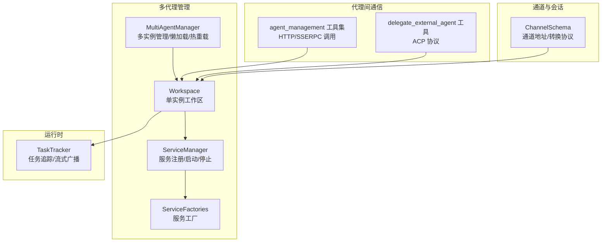
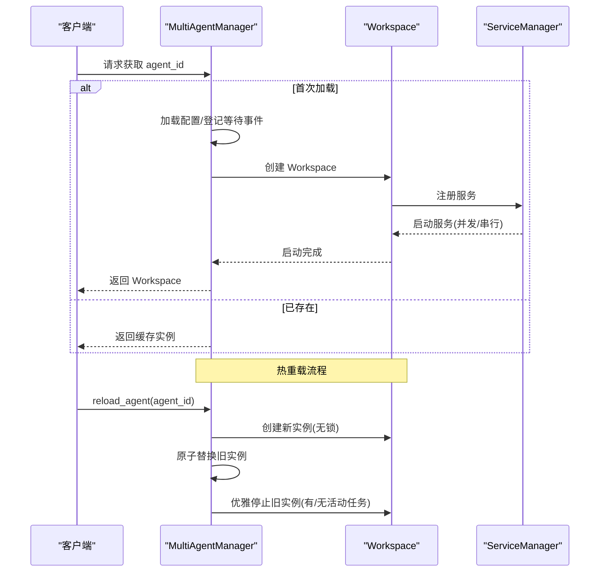
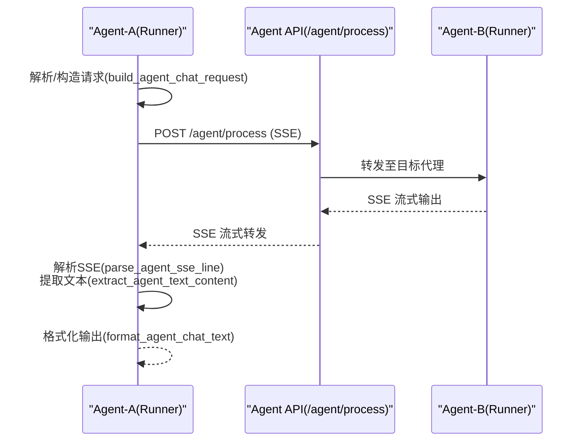
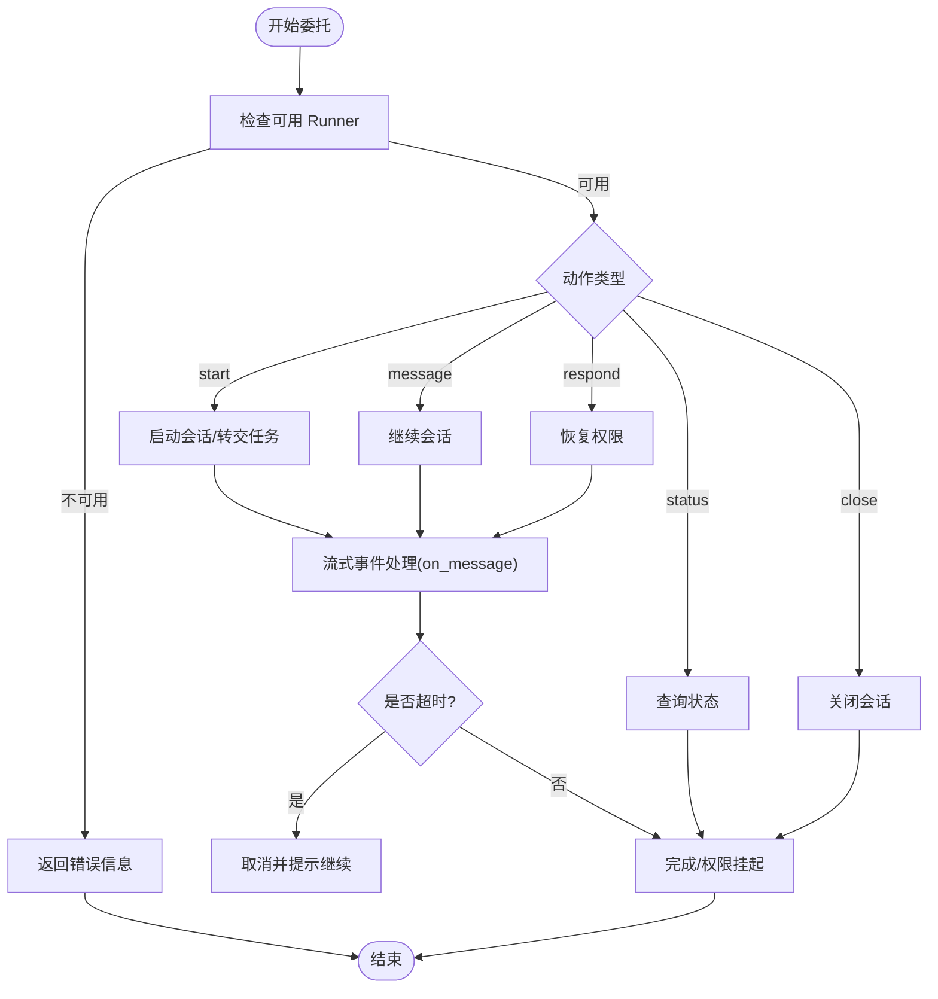
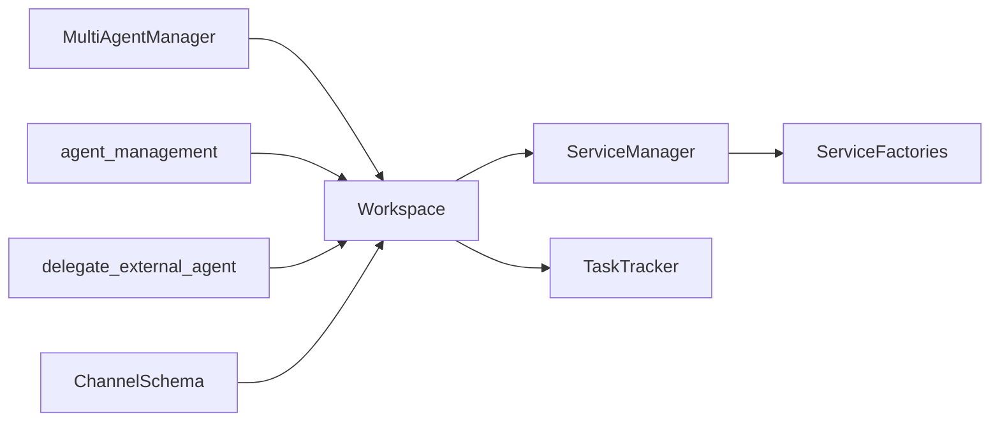

# 多代理协作

<cite>
**本文引用的文件**
- [src/qwenpaw/app/multi_agent_manager.py](file://src/qwenpaw/app/multi_agent_manager.py)
- [src/qwenpaw/app/workspace/workspace.py](file://src/qwenpaw/app/workspace/workspace.py)
- [src/qwenpaw/app/workspace/service_manager.py](file://src/qwenpaw/app/workspace/service_manager.py)
- [src/qwenpaw/app/workspace/service_factories.py](file://src/qwenpaw/app/workspace/service_factories.py)
- [src/qwenpaw/agents/tools/agent_management.py](file://src/qwenpaw/agents/tools/agent_management.py)
- [src/qwenpaw/agents/tools/delegate_external_agent.py](file://src/qwenpaw/agents/tools/delegate_external_agent.py)
- [src/qwenpaw/app/runner/task_tracker.py](file://src/qwenpaw/app/runner/task_tracker.py)
- [src/qwenpaw/app/runner/mission_dispatch.py](file://src/qwenpaw/app/runner/mission_dispatch.py)
- [src/qwenpaw/app/channels/schema.py](file://src/qwenpaw/app/channels/schema.py)
- [website/public/docs/multi-agent.en.md](file://website/public/docs/multi-agent.en.md)
- [website/public/docs/channels.en.md](file://website/public/docs/channels.en.md)
</cite>

## 目录
1. [简介](#简介)
2. [项目结构](#项目结构)
3. [核心组件](#核心组件)
4. [架构总览](#架构总览)
5. [详细组件分析](#详细组件分析)
6. [依赖关系分析](#依赖关系分析)
7. [性能与可扩展性](#性能与可扩展性)
8. [故障排查指南](#故障排查指南)
9. [结论](#结论)
10. [附录：配置与使用示例](#附录配置与使用示例)

## 简介
本技术文档聚焦于 QwenPaw 的“多代理协作”能力，系统阐述多个代理实例之间的协调机制、任务分发与结果汇总流程，以及代理间通信协议、消息传递机制、任务调度与负载均衡策略。文档同时覆盖协作配置方法、权限控制与安全考虑，并通过图示与路径引用帮助读者快速落地实践。

## 项目结构
围绕多代理协作的关键代码分布在以下模块：
- 多代理生命周期与热重载：MultiAgentManager、Workspace、ServiceManager、ServiceFactories
- 代理间通信与工具：agent_management（HTTP/SSERPC）、delegate_external_agent（ACP）
- 运行时任务追踪：TaskTracker
- 会话与通道：ChannelSchema
- 任务编排与任务流：MissionDispatch



图表来源
- [src/qwenpaw/app/multi_agent_manager.py:22-537](file://src/qwenpaw/app/multi_agent_manager.py#L22-L537)
- [src/qwenpaw/app/workspace/workspace.py:38-467](file://src/qwenpaw/app/workspace/workspace.py#L38-L467)
- [src/qwenpaw/app/workspace/service_manager.py:76-453](file://src/qwenpaw/app/workspace/service_manager.py#L76-L453)
- [src/qwenpaw/app/workspace/service_factories.py:18-176](file://src/qwenpaw/app/workspace/service_factories.py#L18-L176)
- [src/qwenpaw/app/runner/task_tracker.py:37-350](file://src/qwenpaw/app/runner/task_tracker.py#L37-L350)
- [src/qwenpaw/agents/tools/agent_management.py:64-629](file://src/qwenpaw/agents/tools/agent_management.py#L64-L629)
- [src/qwenpaw/agents/tools/delegate_external_agent.py:69-800](file://src/qwenpaw/agents/tools/delegate_external_agent.py#L69-L800)
- [src/qwenpaw/app/channels/schema.py:12-71](file://src/qwenpaw/app/channels/schema.py#L12-L71)

章节来源
- [src/qwenpaw/app/multi_agent_manager.py:22-537](file://src/qwenpaw/app/multi_agent_manager.py#L22-L537)
- [src/qwenpaw/app/workspace/workspace.py:38-467](file://src/qwenpaw/app/workspace/workspace.py#L38-L467)
- [src/qwenpaw/app/workspace/service_manager.py:76-453](file://src/qwenpaw/app/workspace/service_manager.py#L76-L453)
- [src/qwenpaw/app/workspace/service_factories.py:18-176](file://src/qwenpaw/app/workspace/service_factories.py#L18-L176)
- [src/qwenpaw/app/runner/task_tracker.py:37-350](file://src/qwenpaw/app/runner/task_tracker.py#L37-L350)
- [src/qwenpaw/agents/tools/agent_management.py:64-629](file://src/qwenpaw/agents/tools/agent_management.py#L64-L629)
- [src/qwenpaw/agents/tools/delegate_external_agent.py:69-800](file://src/qwenpaw/agents/tools/delegate_external_agent.py#L69-L800)
- [src/qwenpaw/app/channels/schema.py:12-71](file://src/qwenpaw/app/channels/schema.py#L12-L71)

## 核心组件
- MultiAgentManager：集中管理多个 Workspace 实例，支持懒加载、并发启动、原子替换与零停机热重载；内部使用异步锁与事件协调并发请求，避免重复初始化。
- Workspace：封装单个代理实例的完整运行时组件（Runner、ChannelManager、MemoryManager、MCPClientManager、CronManager），通过 ServiceManager 统一生命周期管理。
- ServiceManager：声明式服务注册与启动顺序控制，支持并发/串行初始化、依赖解析、可复用组件在热重载中的迁移。
- ServiceFactories：服务工厂函数，负责按配置创建并注入各服务到 Runner/ChannelManager 等组件。
- agent_management：提供跨代理 HTTP/SSERPC 能力，包括列表查询、会话构建、SSE 流式接收、后台任务提交与状态轮询等。
- delegate_external_agent：基于 ACP 协议委托外部 Runner 执行，支持权限挂起、会话状态跟踪、超时中断与流式快照输出。
- TaskTracker：统一的任务追踪器，支持运行中任务查询、全局状态统计、订阅队列广播、断线重连缓冲回放、外部任务注册与清理。
- ChannelSchema：通道类型标识、路由地址（ChannelAddress）与消息转换协议，支撑多通道接入与消息路由。

章节来源
- [src/qwenpaw/app/multi_agent_manager.py:22-537](file://src/qwenpaw/app/multi_agent_manager.py#L22-L537)
- [src/qwenpaw/app/workspace/workspace.py:38-467](file://src/qwenpaw/app/workspace/workspace.py#L38-L467)
- [src/qwenpaw/app/workspace/service_manager.py:76-453](file://src/qwenpaw/app/workspace/service_manager.py#L76-L453)
- [src/qwenpaw/app/workspace/service_factories.py:18-176](file://src/qwenpaw/app/workspace/service_factories.py#L18-L176)
- [src/qwenpaw/agents/tools/agent_management.py:64-629](file://src/qwenpaw/agents/tools/agent_management.py#L64-L629)
- [src/qwenpaw/agents/tools/delegate_external_agent.py:69-800](file://src/qwenpaw/agents/tools/delegate_external_agent.py#L69-L800)
- [src/qwenpaw/app/runner/task_tracker.py:37-350](file://src/qwenpaw/app/runner/task_tracker.py#L37-L350)
- [src/qwenpaw/app/channels/schema.py:12-71](file://src/qwenpaw/app/channels/schema.py#L12-L71)

## 架构总览
多代理协作以“单实例工作区 + 多实例管理”的分层架构实现：
- 上层：MultiAgentManager 对外暴露统一入口，负责实例发现、懒加载、并发启动与热重载。
- 中层：Workspace 将 Runner、ChannelManager、MemoryManager、MCPClientManager、CronManager 等组件整合为独立运行时。
- 下层：ServiceManager 以优先级与依赖关系驱动服务的并发/串行初始化；ServiceFactories 将配置映射为具体服务实例。
- 通信层：agent_management 提供跨代理 HTTP/SSERPC；delegate_external_agent 基于 ACP 协议对接外部 Runner。
- 运行时：TaskTracker 统一管理流式任务、订阅与断线重连；ChannelSchema 定义通道路由与消息转换。

```mermaid
graph TB
Caller["调用方/用户"]
MAM["MultiAgentManager"]
WS1["Workspace(Agent-A)"]
WS2["Workspace(Agent-B)"]
SM1["ServiceManager(A)"]
SM2["ServiceManager(B)"]
RUN1["Runner(A)"]
RUN2["Runner(B)"]
CH1["ChannelManager(A)"]
CH2["ChannelManager(B)"]
TT["TaskTracker"]
AMT["agent_management(HTTP/SSERPC)"]
DEA["delegate_external_agent(ACP)"]
Caller --> MAM
MAM --> WS1
MAM --> WS2
WS1 --> SM1 --> RUN1
WS2 --> SM2 --> RUN2
RUN1 --> CH1
RUN2 --> CH2
RUN1 <- --> AMT
RUN2 <- --> AMT
RUN1 <- --> DEA
RUN2 <- --> DEA
RUN1 --> TT
RUN2 --> TT
```

图表来源
- [src/qwenpaw/app/multi_agent_manager.py:42-137](file://src/qwenpaw/app/multi_agent_manager.py#L42-L137)
- [src/qwenpaw/app/workspace/workspace.py:137-351](file://src/qwenpaw/app/workspace/workspace.py#L137-L351)
- [src/qwenpaw/agents/tools/agent_management.py:158-322](file://src/qwenpaw/agents/tools/agent_management.py#L158-L322)
- [src/qwenpaw/agents/tools/delegate_external_agent.py:425-682](file://src/qwenpaw/agents/tools/delegate_external_agent.py#L425-L682)
- [src/qwenpaw/app/runner/task_tracker.py:248-327](file://src/qwenpaw/app/runner/task_tracker.py#L248-L327)

## 详细组件分析

### 多代理管理与热重载（MultiAgentManager）
- 懒加载与去重：首次访问某 agent_id 时才创建 Workspace 并启动；同一 agent_id 的并发请求共享等待事件，避免重复初始化。
- 原子替换与零停机：reload_agent 通过“创建新实例 → 原子替换 → 优雅停止旧实例”的流程，确保新请求立即由新实例处理，旧实例在无活动任务时即时停止或延后清理。
- 并发启动：start_all_configured_agents 并发启动所有启用的代理，利用细粒度锁与释放策略提升启动吞吐。
- 清理与兜底：cancel_all_cleanup_tasks 在关闭前取消待清理任务；stop_all 统一停止并清空缓存。



图表来源
- [src/qwenpaw/app/multi_agent_manager.py:42-137](file://src/qwenpaw/app/multi_agent_manager.py#L42-L137)
- [src/qwenpaw/app/multi_agent_manager.py:255-382](file://src/qwenpaw/app/multi_agent_manager.py#L255-L382)
- [src/qwenpaw/app/workspace/workspace.py:351-458](file://src/qwenpaw/app/workspace/workspace.py#L351-L458)

章节来源
- [src/qwenpaw/app/multi_agent_manager.py:22-537](file://src/qwenpaw/app/multi_agent_manager.py#L22-L537)

### 单实例工作区（Workspace）
- 组件聚合：Runner、ChannelManager、MemoryManager、MCPClientManager、CronManager 由 ServiceManager 统一管理。
- 生命周期：start() 先加载配置、执行数据迁移、再按优先级并发/串行启动服务；stop(final) 支持可选的可复用组件保留。
- 可复用组件：set_reusable_components 在热重载时将内存/上下文/聊天管理器等可复用组件迁移到新实例，减少重建成本。

章节来源
- [src/qwenpaw/app/workspace/workspace.py:38-467](file://src/qwenpaw/app/workspace/workspace.py#L38-L467)
- [src/qwenpaw/app/workspace/service_manager.py:173-251](file://src/qwenpaw/app/workspace/service_manager.py#L173-L251)
- [src/qwenpaw/app/workspace/service_factories.py:18-176](file://src/qwenpaw/app/workspace/service_factories.py#L18-L176)

### 服务管理（ServiceManager）
- 声明式描述：ServiceDescriptor 定义服务类、初始化参数、post_init、start/stop 方法、可复用性、依赖与优先级。
- 启动策略：同优先级并发，不同优先级串行；sequential 服务逐个启动；between 组之间让出事件循环，保证服务器响应。
- 停止策略：逆序优先级停止；可复用组件在非 final 停止时跳过，以便热重载迁移。

章节来源
- [src/qwenpaw/app/workspace/service_manager.py:32-453](file://src/qwenpaw/app/workspace/service_manager.py#L32-L453)

### 代理间通信与任务编排（agent_management）
- 列表与校验：list_agents_data/agent_exists 获取可用代理列表并校验目标代理存在性。
- 会话与身份：generate_unique_session_id 构造并发安全会话；ensure_agent_identity_prefix 为跨代理消息添加来源标识。
- 请求构建：build_agent_chat_request 统一封装输入、根会话与请求上下文。
- 传输协议：支持 SSE 流式（stream_agent_chat）、一次性收集最终响应（collect_final_agent_chat_response）、后台任务提交（submit_agent_chat_task）与状态轮询（get_agent_chat_task_status）。
- 头部与路由：_request_headers 设置 X-Agent-Id，便于下游识别目标代理。



图表来源
- [src/qwenpaw/agents/tools/agent_management.py:192-322](file://src/qwenpaw/agents/tools/agent_management.py#L192-L322)
- [src/qwenpaw/agents/tools/agent_management.py:432-512](file://src/qwenpaw/agents/tools/agent_management.py#L432-L512)

章节来源
- [src/qwenpaw/agents/tools/agent_management.py:64-629](file://src/qwenpaw/agents/tools/agent_management.py#L64-L629)

### 外部 Runner 委托（delegate_external_agent + ACP）
- ACP 服务：_get_acp_service 初始化/获取 ACP 服务，结合当前代理配置。
- 可用 Runner：_get_available_acp_runners 列举已启用的外部 Runner。
- 会话状态：_get_runner_session_state 查询会话是否打开、是否等待权限、进程是否退出。
- 动作执行：_run_action 支持 start/message/respond/close 等动作，配合 on_message 回调进行流式事件处理。
- 超时与中断：_stream_action_responses 支持最大运行时间，到期自动取消并提示继续对话。
- 权限挂起：当返回 suspended_permission 时，格式化权限提示并等待用户选择选项继续。



图表来源
- [src/qwenpaw/agents/tools/delegate_external_agent.py:425-682](file://src/qwenpaw/agents/tools/delegate_external_agent.py#L425-L682)
- [src/qwenpaw/agents/tools/delegate_external_agent.py:703-796](file://src/qwenpaw/agents/tools/delegate_external_agent.py#L703-L796)

章节来源
- [src/qwenpaw/agents/tools/delegate_external_agent.py:69-800](file://src/qwenpaw/agents/tools/delegate_external_agent.py#L69-L800)

### 任务追踪与流式广播（TaskTracker）
- 运行状态：has_active_tasks/list_active_tasks/wait_all_done 提供全局与单任务状态查询。
- 订阅与重连：attach/attach_or_start 支持断线重连回放缓冲；stream_from_queue 自动清理订阅队列。
- 外部任务：register_external_task/unregister_external_task 用于非内部流式任务的可见性与清理。
- 停止与取消：request_stop 触发任务取消，适用于长任务中断。

章节来源
- [src/qwenpaw/app/runner/task_tracker.py:37-350](file://src/qwenpaw/app/runner/task_tracker.py#L37-L350)

### 通道与会话路由（ChannelSchema）
- ChannelAddress：统一路由键（kind/id/extra），替代分散元信息；to_handle 生成稳定句柄。
- 内置通道类型：imessage、discord、dingtalk、feishu、qq、telegram、mqtt、console、voice、sip、xiaoyi。
- 消息转换协议：ChannelMessageConverter 定义原生消息到 AgentRequest 的转换与响应发送。

章节来源
- [src/qwenpaw/app/channels/schema.py:12-71](file://src/qwenpaw/app/channels/schema.py#L12-L71)

### 任务编排与任务流（MissionDispatch）
- 命令检测：maybe_handle_mission_command 检测 /mission 命令并委派给 Mission Handler。
- 活跃任务检测：detect_active_mission_phase 识别会话绑定的活跃任务阶段（Phase 1/2），决定后续处理路径。

章节来源
- [src/qwenpaw/app/runner/mission_dispatch.py:33-118](file://src/qwenpaw/app/runner/mission_dispatch.py#L33-L118)

## 依赖关系分析
- MultiAgentManager 依赖 Workspace 与配置加载；Workspace 依赖 ServiceManager 与 ServiceFactories；ServiceManager 依赖 ServiceDescriptor 与具体服务类。
- agent_management 依赖 Workspace 的 Runner 与 ChannelManager；delegate_external_agent 依赖 ACP 服务与 Runner 会话。
- TaskTracker 作为通用运行时组件被 Runner 使用；ChannelSchema 为通道接入提供统一抽象。



图表来源
- [src/qwenpaw/app/multi_agent_manager.py:16-40](file://src/qwenpaw/app/multi_agent_manager.py#L16-L40)
- [src/qwenpaw/app/workspace/workspace.py:20-33](file://src/qwenpaw/app/workspace/workspace.py#L20-L33)
- [src/qwenpaw/app/workspace/service_manager.py:83-92](file://src/qwenpaw/app/workspace/service_manager.py#L83-L92)
- [src/qwenpaw/app/workspace/service_factories.py:74-107](file://src/qwenpaw/app/workspace/service_factories.py#L74-L107)
- [src/qwenpaw/agents/tools/agent_management.py:64-75](file://src/qwenpaw/agents/tools/agent_management.py#L64-L75)
- [src/qwenpaw/agents/tools/delegate_external_agent.py:69-82](file://src/qwenpaw/agents/tools/delegate_external_agent.py#L69-L82)
- [src/qwenpaw/app/channels/schema.py:12-28](file://src/qwenpaw/app/channels/schema.py#L12-L28)

章节来源
- [src/qwenpaw/app/multi_agent_manager.py:16-40](file://src/qwenpaw/app/multi_agent_manager.py#L16-L40)
- [src/qwenpaw/app/workspace/workspace.py:20-33](file://src/qwenpaw/app/workspace/workspace.py#L20-L33)
- [src/qwenpaw/app/workspace/service_manager.py:83-92](file://src/qwenpaw/app/workspace/service_manager.py#L83-L92)
- [src/qwenpaw/app/workspace/service_factories.py:74-107](file://src/qwenpaw/app/workspace/service_factories.py#L74-L107)
- [src/qwenpaw/agents/tools/agent_management.py:64-75](file://src/qwenpaw/agents/tools/agent_management.py#L64-L75)
- [src/qwenpaw/agents/tools/delegate_external_agent.py:69-82](file://src/qwenpaw/agents/tools/delegate_external_agent.py#L69-L82)
- [src/qwenpaw/app/channels/schema.py:12-28](file://src/qwenpaw/app/channels/schema.py#L12-L28)

## 性能与可扩展性
- 并发启动：MultiAgentManager 与 ServiceManager 的并发初始化显著缩短启动时间，适合多代理部署。
- 热重载零停机：reload_agent 采用原子替换与延迟清理，保障高可用。
- 流式广播：TaskTracker 的队列广播与缓冲回放降低断线重连成本。
- 资源复用：ServiceManager 的可复用组件在热重载中迁移，减少重建开销。
- 负载均衡建议：可通过多实例部署与反向代理实现横向扩展；任务分发可结合会话维度（session_id）与权限控制（X-Agent-Id）实现细粒度路由。

[本节为通用指导，无需特定文件引用]

## 故障排查指南
- 代理不存在或未启动
  - 现象：agent_exists 返回 False 或请求超时
  - 排查：确认 agent_management.list_agents_data 返回包含目标 agent_id；检查 MultiAgentManager.get_agent 是否抛出配置异常
  - 参考
    - [src/qwenpaw/agents/tools/agent_management.py:184-190](file://src/qwenpaw/agents/tools/agent_management.py#L184-L190)
    - [src/qwenpaw/app/multi_agent_manager.py:81-105](file://src/qwenpaw/app/multi_agent_manager.py#L81-L105)
- 热重载失败或旧实例未清理
  - 现象：reload_agent 成功但旧实例仍在后台运行
  - 排查：查看 _graceful_stop_old_instance 的日志与异常；确认 has_active_tasks 与 wait_all_done 的返回值
  - 参考
    - [src/qwenpaw/app/multi_agent_manager.py:138-234](file://src/qwenpaw/app/multi_agent_manager.py#L138-L234)
    - [src/qwenpaw/app/runner/task_tracker.py:111-129](file://src/qwenpaw/app/runner/task_tracker.py#L111-L129)
- SSE 流中断或无法重连
  - 现象：流式响应中断或重连无缓冲
  - 排查：确认 TaskTracker.attach_or_start 的 run_key 与 attach；检查 _SENTINEL 与 detach_subscriber 的调用
  - 参考
    - [src/qwenpaw/app/runner/task_tracker.py:248-327](file://src/qwenpaw/app/runner/task_tracker.py#L248-L327)
- ACP 权限挂起或会话状态异常
  - 现象：返回 suspended_permission 或会话状态为 exited
  - 排查：检查 _get_runner_session_state 与 get_pending_permission；确认 on_message 事件是否正确处理
  - 参考
    - [src/qwenpaw/agents/tools/delegate_external_agent.py:255-273](file://src/qwenpaw/agents/tools/delegate_external_agent.py#L255-L273)
    - [src/qwenpaw/agents/tools/delegate_external_agent.py:425-482](file://src/qwenpaw/agents/tools/delegate_external_agent.py#L425-L482)

章节来源
- [src/qwenpaw/agents/tools/agent_management.py:184-190](file://src/qwenpaw/agents/tools/agent_management.py#L184-L190)
- [src/qwenpaw/app/multi_agent_manager.py:138-234](file://src/qwenpaw/app/multi_agent_manager.py#L138-L234)
- [src/qwenpaw/app/runner/task_tracker.py:248-327](file://src/qwenpaw/app/runner/task_tracker.py#L248-L327)
- [src/qwenpaw/agents/tools/delegate_external_agent.py:255-273](file://src/qwenpaw/agents/tools/delegate_external_agent.py#L255-L273)

## 结论
QwenPaw 的多代理协作通过“多实例管理 + 单实例工作区 + 声明式服务管理 + 统一任务追踪”的架构实现了高可用、可观测与可扩展的跨代理协同。代理间通信既支持本地 HTTP/SSERPC，也支持外部 ACP 协议；配合热重载与流式广播，满足生产环境对稳定性与实时性的双重需求。

[本节为总结，无需特定文件引用]

## 附录：配置与使用示例
- 启用多代理协作
  - 控制台方式：进入“Workspace → Skills”，勾选“多代理协作”技能并保存
  - CLI 方式：使用 qwenpaw skills config 配置指定 agent 的技能开关
  - 参考
    - [website/public/docs/multi-agent.en.md:265-288](file://website/public/docs/multi-agent.en.md#L265-L288)
- 触发协作
  - 用户显式请求：例如“请让代码助手审查这段代码”
  - 代理主动决策：当前代理根据任务需要调用其他代理
  - 参考
    - [website/public/docs/multi-agent.en.md:290-327](file://website/public/docs/multi-agent.en.md#L290-L327)
- 代理间通信要点
  - 会话隔离：每个跨代理交互生成唯一 session_id，避免上下文污染
  - 权限控制：通过 X-Agent-Id 与 ACP 权限挂起机制实现细粒度授权
  - 参考
    - [src/qwenpaw/agents/tools/agent_management.py:77-108](file://src/qwenpaw/agents/tools/agent_management.py#L77-L108)
    - [src/qwenpaw/agents/tools/agent_management.py:238-253](file://src/qwenpaw/agents/tools/agent_management.py#L238-L253)
    - [src/qwenpaw/agents/tools/delegate_external_agent.py:318-360](file://src/qwenpaw/agents/tools/delegate_external_agent.py#L318-L360)
- 通道与消息路由
  - 使用 ChannelAddress 统一路由键；内置多种通道类型
  - 参考
    - [src/qwenpaw/app/channels/schema.py:12-43](file://src/qwenpaw/app/channels/schema.py#L12-L43)
    - [website/public/docs/channels.en.md:1386-1389](file://website/public/docs/channels.en.md#L1386-L1389)

章节来源
- [website/public/docs/multi-agent.en.md:256-417](file://website/public/docs/multi-agent.en.md#L256-L417)
- [website/public/docs/channels.en.md:1370-1389](file://website/public/docs/channels.en.md#L1370-L1389)
- [src/qwenpaw/agents/tools/agent_management.py:77-108](file://src/qwenpaw/agents/tools/agent_management.py#L77-L108)
- [src/qwenpaw/agents/tools/agent_management.py:238-253](file://src/qwenpaw/agents/tools/agent_management.py#L238-L253)
- [src/qwenpaw/agents/tools/delegate_external_agent.py:318-360](file://src/qwenpaw/agents/tools/delegate_external_agent.py#L318-L360)
- [src/qwenpaw/app/channels/schema.py:12-43](file://src/qwenpaw/app/channels/schema.py#L12-L43)