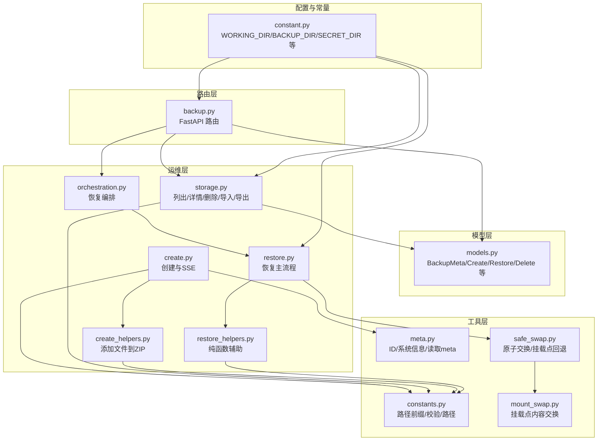
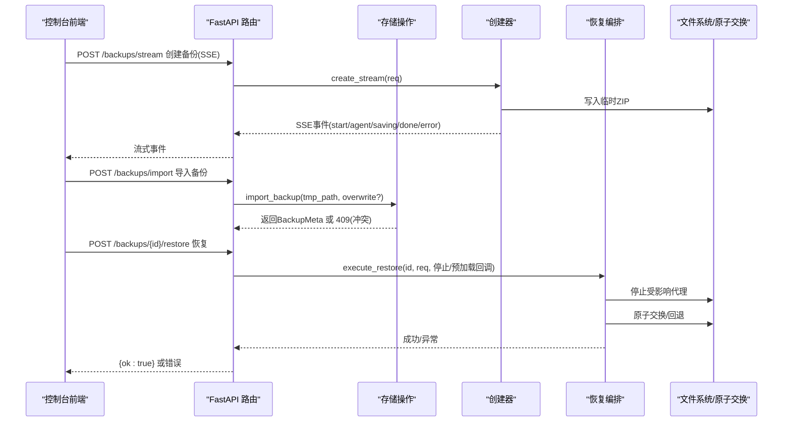
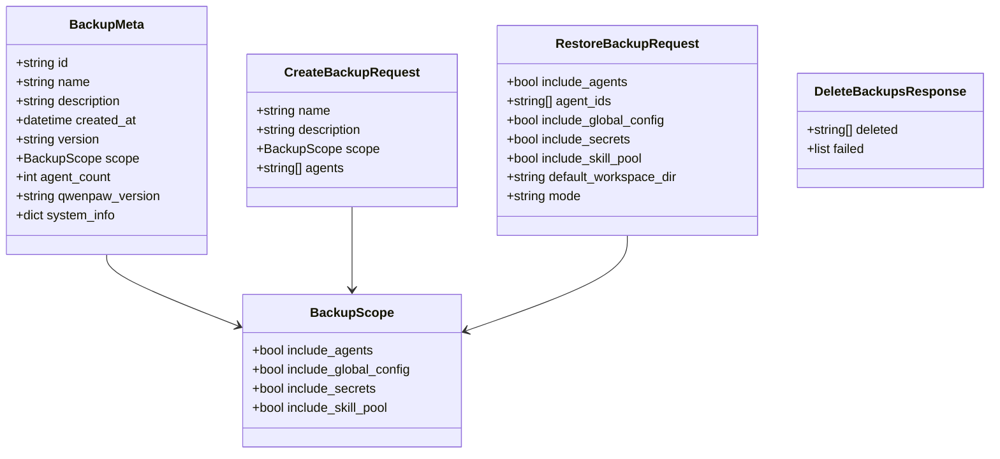
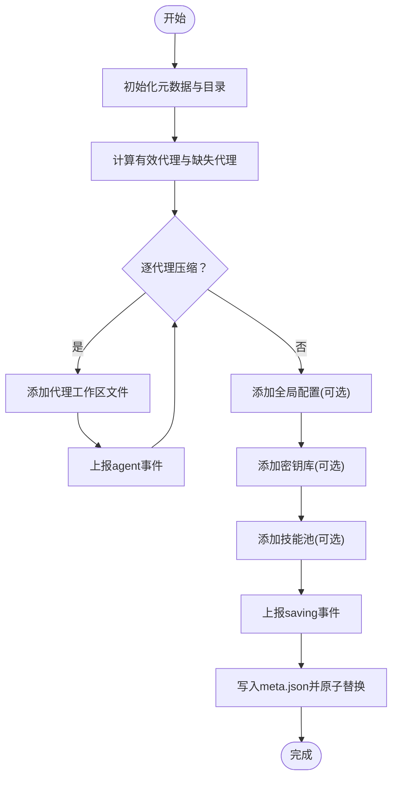
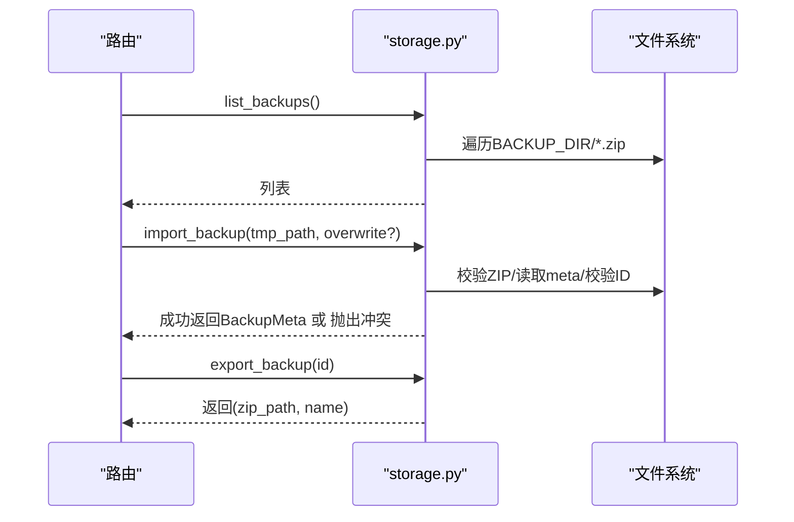
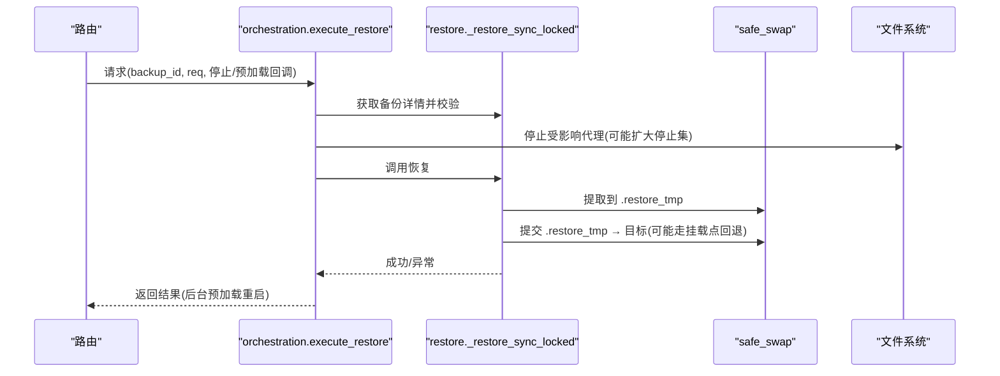
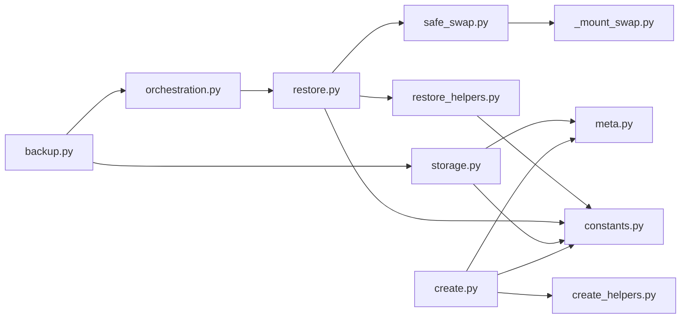

# 备份与恢复

<cite>
**本文引用的文件**
- [src/qwenpaw/backup/__init__.py](file://src/qwenpaw/backup/__init__.py)
- [src/qwenpaw/backup/models.py](file://src/qwenpaw/backup/models.py)
- [src/qwenpaw/backup/orchestration.py](file://src/qwenpaw/backup/orchestration.py)
- [src/qwenpaw/app/routers/backup.py](file://src/qwenpaw/app/routers/backup.py)
- [src/qwenpaw/backup/_ops/create.py](file://src/qwenpaw/backup/_ops/create.py)
- [src/qwenpaw/backup/_ops/create_helpers.py](file://src/qwenpaw/backup/_ops/create_helpers.py)
- [src/qwenpaw/backup/_ops/storage.py](file://src/qwenpaw/backup/_ops/storage.py)
- [src/qwenpaw/backup/_ops/restore.py](file://src/qwenpaw/backup/_ops/restore.py)
- [src/qwenpaw/backup/_ops/restore_helpers.py](file://src/qwenpaw/backup/_ops/restore_helpers.py)
- [src/qwenpaw/backup/_utils/constants.py](file://src/qwenpaw/backup/_utils/constants.py)
- [src/qwenpaw/backup/_utils/meta.py](file://src/qwenpaw/backup/_utils/meta.py)
- [src/qwenpaw/backup/_utils/safe_swap.py](file://src/qwenpaw/backup/_utils/safe_swap.py)
- [src/qwenpaw/backup/_utils/_mount_swap.py](file://src/qwenpaw/backup/_utils/_mount_swap.py)
- [src/qwenpaw/constant.py](file://src/qwenpaw/constant.py)
- [console/src/api/modules/backup.ts](file://console/src/api/modules/backup.ts)
- [console/src/api/types/backup.ts](file://console/src/api/types/backup.ts)
- [tests/unit/backup/test_safe_swap.py](file://tests/unit/backup/test_safe_swap.py)
</cite>

## 目录
1. [简介](#简介)
2. [项目结构](#项目结构)
3. [核心组件](#核心组件)
4. [架构总览](#架构总览)
5. [详细组件分析](#详细组件分析)
6. [依赖关系分析](#依赖关系分析)
7. [性能考量](#性能考量)
8. [故障排查指南](#故障排查指南)
9. [结论](#结论)
10. [附录](#附录)

## 简介
本文件面向QwenPaw的备份与恢复系统，提供从策略设计到落地实现的完整技术文档。内容覆盖备份范围与粒度、备份流程与进度流式输出、恢复机制与原子化目录交换、跨版本兼容与安全策略、以及灾备与恢复演练的实践建议。读者可据此完成备份配置、执行备份与恢复、验证完整性，并制定灾难恢复预案。

## 项目结构
备份子系统位于src/qwenpaw/backup下，采用分层设计：
- 路由层：FastAPI路由，提供备份列表、创建（SSE）、导入/导出、删除、恢复等HTTP接口
- 模型层：备份元数据、请求/响应模型定义
- 运维层：备份创建、存储读写、恢复编排与原子化目录交换
- 工具层：常量、元数据生成、安全交换与挂载点回退

图表来源
- [src/qwenpaw/app/routers/backup.py:1-275](file://src/qwenpaw/app/routers/backup.py#L1-L275)
- [src/qwenpaw/backup/models.py:1-133](file://src/qwenpaw/backup/models.py#L1-L133)
- [src/qwenpaw/backup/_ops/create.py:1-219](file://src/qwenpaw/backup/_ops/create.py#L1-L219)
- [src/qwenpaw/backup/_ops/create_helpers.py:1-179](file://src/qwenpaw/backup/_ops/create_helpers.py#L1-L179)
- [src/qwenpaw/backup/_ops/storage.py:1-242](file://src/qwenpaw/backup/_ops/storage.py#L1-L242)
- [src/qwenpaw/backup/orchestration.py:1-147](file://src/qwenpaw/backup/orchestration.py#L1-L147)
- [src/qwenpaw/backup/_ops/restore.py:1-567](file://src/qwenpaw/backup/_ops/restore.py#L1-L567)
- [src/qwenpaw/backup/_ops/restore_helpers.py:1-159](file://src/qwenpaw/backup/_ops/restore_helpers.py#L1-L159)
- [src/qwenpaw/backup/_utils/constants.py:1-38](file://src/qwenpaw/backup/_utils/constants.py#L1-L38)
- [src/qwenpaw/backup/_utils/meta.py:1-61](file://src/qwenpaw/backup/_utils/meta.py#L1-L61)
- [src/qwenpaw/backup/_utils/safe_swap.py:1-442](file://src/qwenpaw/backup/_utils/safe_swap.py#L1-L442)
- [src/qwenpaw/backup/_utils/_mount_swap.py:1-331](file://src/qwenpaw/backup/_utils/_mount_swap.py#L1-L331)
- [src/qwenpaw/constant.py:221-231](file://src/qwenpaw/constant.py#L221-L231)

章节来源
- [src/qwenpaw/app/routers/backup.py:1-275](file://src/qwenpaw/app/routers/backup.py#L1-L275)
- [src/qwenpaw/backup/__init__.py:1-22](file://src/qwenpaw/backup/__init__.py#L1-L22)

## 核心组件
- 备份范围与粒度
  - 支持按范围选择：全局配置、代理工作区、技能池、密钥库；可显式指定代理ID集合
  - 元数据包含备份ID、名称、描述、时间戳、版本、系统信息、代理计数等
- 备份创建
  - 基于ZIP压缩，支持SSE流式进度事件（开始、逐代理进度、保存阶段、完成、错误）
  - 写入临时文件后原子替换，支持客户端断开取消
- 存储与导入/导出
  - 列表/详情/删除/导入/导出；导入时处理备份ID冲突并返回待确认令牌
- 恢复编排
  - 停止受影响代理 → 执行恢复 → 后台预加载重启；当包含密钥库或技能池时扩展停止集以避免Windows句柄占用
- 原子化目录交换
  - 通过“.restore_tmp”与“.restore_old”两阶段交换，失败自动回滚；对Docker挂载点提供内容级交换回退
- 安全与兼容
  - 支持备份版本校验；主密钥不一致时保留旧密钥并备份至独立位置
  - Zip Slip防护与保留内部恢复标记名过滤

章节来源
- [src/qwenpaw/backup/models.py:13-133](file://src/qwenpaw/backup/models.py#L13-L133)
- [src/qwenpaw/backup/_ops/create.py:21-219](file://src/qwenpaw/backup/_ops/create.py#L21-L219)
- [src/qwenpaw/backup/_ops/storage.py:29-242](file://src/qwenpaw/backup/_ops/storage.py#L29-L242)
- [src/qwenpaw/backup/orchestration.py:44-147](file://src/qwenpaw/backup/orchestration.py#L44-L147)
- [src/qwenpaw/backup/_ops/restore.py:50-567](file://src/qwenpaw/backup/_ops/restore.py#L50-L567)
- [src/qwenpaw/backup/_utils/safe_swap.py:1-442](file://src/qwenpaw/backup/_utils/safe_swap.py#L1-L442)
- [src/qwenpaw/backup/_utils/_mount_swap.py:1-331](file://src/qwenpaw/backup/_utils/_mount_swap.py#L1-L331)

## 架构总览
备份与恢复的端到端流程如下：

图表来源
- [src/qwenpaw/app/routers/backup.py:65-275](file://src/qwenpaw/app/routers/backup.py#L65-L275)
- [src/qwenpaw/backup/_ops/create.py:21-219](file://src/qwenpaw/backup/_ops/create.py#L21-L219)
- [src/qwenpaw/backup/_ops/storage.py:182-242](file://src/qwenpaw/backup/_ops/storage.py#L182-L242)
- [src/qwenpaw/backup/orchestration.py:44-147](file://src/qwenpaw/backup/orchestration.py#L44-L147)
- [src/qwenpaw/backup/_ops/restore.py:50-567](file://src/qwenpaw/backup/_ops/restore.py#L50-L567)

## 详细组件分析

### 备份范围与数据模型
- BackupScope：控制是否包含代理工作区、全局配置、密钥库、技能池
- BackupMeta：备份元数据，含备份ID、名称、描述、时间、版本、系统信息、代理数量、作用域
- CreateBackupRequest：创建请求，支持显式代理ID列表
- RestoreBackupRequest：恢复请求，支持“全量替换”和“自定义合并”，可指定默认工作区根目录
- 删除批量响应：记录成功与失败项

图表来源
- [src/qwenpaw/backup/models.py:13-133](file://src/qwenpaw/backup/models.py#L13-L133)

章节来源
- [src/qwenpaw/backup/models.py:13-133](file://src/qwenpaw/backup/models.py#L13-L133)

### 备份创建流程与SSE
- 创建入口：create_stream(req)在后台线程中压缩，使用队列向事件循环推送事件
- 进度事件：start、agent（含索引与百分比）、saving、done、error
- 压缩策略：逐代理遍历工作区，按需添加全局配置、密钥库、技能池
- 原子落盘：先写入“.tmp”，再原子替换为“.zip”
- 取消语义：客户端断开触发停止事件，线程在下一次取消点退出并清理临时文件

图表来源
- [src/qwenpaw/backup/_ops/create.py:21-219](file://src/qwenpaw/backup/_ops/create.py#L21-L219)
- [src/qwenpaw/backup/_ops/create_helpers.py:138-179](file://src/qwenpaw/backup/_ops/create_helpers.py#L138-L179)
- [src/qwenpaw/backup/_utils/meta.py:49-61](file://src/qwenpaw/backup/_utils/meta.py#L49-L61)

章节来源
- [src/qwenpaw/backup/_ops/create.py:21-219](file://src/qwenpaw/backup/_ops/create.py#L21-L219)
- [src/qwenpaw/backup/_ops/create_helpers.py:1-179](file://src/qwenpaw/backup/_ops/create_helpers.py#L1-L179)
- [src/qwenpaw/backup/_utils/meta.py:1-61](file://src/qwenpaw/backup/_utils/meta.py#L1-L61)

### 存储与导入/导出
- 列表/详情：扫描BACKUP_DIR下的“.zip”，读取根部meta.json解析为BackupMeta/BackupDetail
- 删除：批量删除，记录失败原因
- 导入：校验ZIP与meta.json，校验备份ID合法性，支持覆盖模式
- 导出：直接返回已存在的“.zip”及其名称

图表来源
- [src/qwenpaw/backup/_ops/storage.py:29-242](file://src/qwenpaw/backup/_ops/storage.py#L29-L242)
- [src/qwenpaw/backup/_utils/constants.py:36-38](file://src/qwenpaw/backup/_utils/constants.py#L36-L38)

章节来源
- [src/qwenpaw/backup/_ops/storage.py:1-242](file://src/qwenpaw/backup/_ops/storage.py#L1-L242)
- [src/qwenpaw/backup/_utils/constants.py:1-38](file://src/qwenpaw/backup/_utils/constants.py#L1-L38)

### 恢复编排与原子化交换
- 编排：execute_restore根据请求决定受影响代理集，必要时扩展停止集（包含密钥库/技能池场景），调用停止回调，执行恢复，最后后台预加载重启
- 恢复主流程：版本校验、收集代理ID、规划目标路径、分阶段提取与提交、最终写回配置
- 原子交换：safe_swap通过“.restore_tmp/.restore_old”两阶段交换，失败回滚；挂载点回退通过内容级移动与状态标记保障一致性

图表来源
- [src/qwenpaw/backup/orchestration.py:44-147](file://src/qwenpaw/backup/orchestration.py#L44-L147)
- [src/qwenpaw/backup/_ops/restore.py:361-418](file://src/qwenpaw/backup/_ops/restore.py#L361-L418)
- [src/qwenpaw/backup/_utils/safe_swap.py:381-442](file://src/qwenpaw/backup/_utils/safe_swap.py#L381-L442)
- [src/qwenpaw/backup/_utils/_mount_swap.py:85-151](file://src/qwenpaw/backup/_utils/_mount_swap.py#L85-L151)

章节来源
- [src/qwenpaw/backup/orchestration.py:1-147](file://src/qwenpaw/backup/orchestration.py#L1-L147)
- [src/qwenpaw/backup/_ops/restore.py:1-567](file://src/qwenpaw/backup/_ops/restore.py#L1-L567)
- [src/qwenpaw/backup/_utils/safe_swap.py:1-442](file://src/qwenpaw/backup/_utils/safe_swap.py#L1-L442)
- [src/qwenpaw/backup/_utils/_mount_swap.py:1-331](file://src/qwenpaw/backup/_utils/_mount_swap.py#L1-L331)

### 跨版本兼容与安全
- 版本校验：仅支持特定版本字符串，不匹配则报错
- 主密钥冲突处理：若备份中的主密钥与当前不同，将当前密钥备份到独立位置，避免凭据解密失败
- Zip Slip防护：对逻辑路径进行归一化校验，跳过保留名
- 并发保护：恢复过程锁与进程级锁，避免并发破坏

章节来源
- [src/qwenpaw/backup/_ops/restore.py:42-68](file://src/qwenpaw/backup/_ops/restore.py#L42-L68)
- [src/qwenpaw/backup/_ops/restore_helpers.py:111-159](file://src/qwenpaw/backup/_ops/restore_helpers.py#L111-L159)
- [src/qwenpaw/backup/_utils/safe_swap.py:291-322](file://src/qwenpaw/backup/_utils/safe_swap.py#L291-L322)

### 前端交互与事件契约
- 控制台前端通过SSE订阅“/backups/stream”，接收start/agent/saving/done/error事件
- 导入冲突时返回409并携带existing元数据与pending_token，前端可二次提交确认覆盖

章节来源
- [console/src/api/modules/backup.ts:1-39](file://console/src/api/modules/backup.ts#L1-L39)
- [console/src/api/types/backup.ts:58-80](file://console/src/api/types/backup.ts#L58-L80)
- [src/qwenpaw/app/routers/backup.py:108-216](file://src/qwenpaw/app/routers/backup.py#L108-L216)

## 依赖关系分析
- 路由依赖存储与编排模块，存储依赖常量与元数据工具，创建器依赖帮助器与常量，恢复主流程依赖安全交换与挂载点回退
- 配置常量提供WORKING_DIR、BACKUP_DIR、SECRET_DIR等关键路径，影响所有文件操作

图表来源
- [src/qwenpaw/app/routers/backup.py:15-33](file://src/qwenpaw/app/routers/backup.py#L15-L33)
- [src/qwenpaw/backup/_ops/storage.py:1-242](file://src/qwenpaw/backup/_ops/storage.py#L1-L242)
- [src/qwenpaw/backup/orchestration.py:1-147](file://src/qwenpaw/backup/orchestration.py#L1-L147)
- [src/qwenpaw/backup/_ops/restore.py:1-567](file://src/qwenpaw/backup/_ops/restore.py#L1-L567)
- [src/qwenpaw/backup/_utils/safe_swap.py:1-442](file://src/qwenpaw/backup/_utils/safe_swap.py#L1-L442)
- [src/qwenpaw/backup/_utils/_mount_swap.py:1-331](file://src/qwenpaw/backup/_utils/_mount_swap.py#L1-L331)
- [src/qwenpaw/backup/_ops/create.py:1-219](file://src/qwenpaw/backup/_ops/create.py#L1-L219)
- [src/qwenpaw/backup/_ops/create_helpers.py:1-179](file://src/qwenpaw/backup/_ops/create_helpers.py#L1-L179)
- [src/qwenpaw/backup/_utils/constants.py:1-38](file://src/qwenpaw/backup/_utils/constants.py#L1-L38)
- [src/qwenpaw/backup/_utils/meta.py:1-61](file://src/qwenpaw/backup/_utils/meta.py#L1-L61)

章节来源
- [src/qwenpaw/constant.py:221-231](file://src/qwenpaw/constant.py#L221-L231)

## 性能考量
- 压缩与I/O
  - 使用ZIP_DEFLATED压缩，边写边落盘，避免内存累积
  - 代理工作区递归遍历，建议仅包含必要文件；可通过范围控制减少体积
- 并发与锁
  - 恢复过程串行化，避免Windows上目录重命名冲突
  - 每个目标目录有独立线程锁，防止并发交错
- 网络与SSE
  - SSE禁用代理缓冲，确保事件实时到达
- 磁盘空间
  - BACKUP_DIR默认位于WORKING_DIR同级“.backups”，注意监控磁盘配额

章节来源
- [src/qwenpaw/backup/_ops/create.py:162-219](file://src/qwenpaw/backup/_ops/create.py#L162-L219)
- [src/qwenpaw/backup/_ops/restore.py:47-47](file://src/qwenpaw/backup/_ops/restore.py#L47-L47)
- [src/qwenpaw/app/routers/backup.py:82-87](file://src/qwenpaw/app/routers/backup.py#L82-L87)
- [src/qwenpaw/constant.py:221-231](file://src/qwenpaw/constant.py#L221-L231)

## 故障排查指南
- 备份创建失败
  - 检查客户端是否断开导致停止事件触发；查看日志中的“cancelled”提示
  - 确认WORKING_DIR与BACKUP_DIR存在且可写
- 导入冲突
  - 409返回携带existing元数据与pending_token；前端应使用该令牌再次提交以覆盖
- 恢复失败回滚
  - safe_swap会在失败时回滚“.restore_tmp”或“.restore_old”，确保原内容不被破坏
  - 挂载点回退会依据状态标记进行恢复或清理
- 主密钥不一致
  - 当备份与当前主密钥不一致时，系统会将当前密钥备份到BACKUP_DIR/_pre_restore_keys下
- 单元测试参考
  - 可参考test_safe_swap.py验证挂载点回退、状态标记与回滚行为

章节来源
- [src/qwenpaw/app/routers/backup.py:108-216](file://src/qwenpaw/app/routers/backup.py#L108-L216)
- [src/qwenpaw/backup/_ops/restore.py:178-220](file://src/qwenpaw/backup/_ops/restore.py#L178-L220)
- [src/qwenpaw/backup/_ops/restore_helpers.py:111-159](file://src/qwenpaw/backup/_ops/restore_helpers.py#L111-L159)
- [src/qwenpaw/backup/_utils/safe_swap.py:170-289](file://src/qwenpaw/backup/_utils/safe_swap.py#L170-L289)
- [tests/unit/backup/test_safe_swap.py:1-340](file://tests/unit/backup/test_safe_swap.py#L1-L340)

## 结论
QwenPaw的备份与恢复系统以“可审计、可回滚、可跨平台”为核心设计目标，通过范围化备份、SSE进度、原子化目录交换与挂载点回退、版本校验与Zip Slip防护，提供了稳定可靠的备份与恢复能力。结合本文的配置与操作建议，用户可在生产环境中建立可持续的备份策略与灾备流程。

## 附录

### 备份策略与配置清单
- 备份范围
  - include_agents: 是否包含代理工作区
  - include_global_config: 是否包含全局配置
  - include_secrets: 是否包含密钥库（谨慎开启）
  - include_skill_pool: 是否包含技能池
- 备份频率
  - 建议：变更密集期每日、稳定期每周；重要节点前手动备份
- 存储位置
  - BACKUP_DIR默认位于WORKING_DIR同级“.backups”，可通过环境变量调整
- 备份验证
  - 导入后使用“获取备份详情”核对代理数量、系统信息与版本
  - 执行恢复演练：先在隔离环境或非生产实例验证

章节来源
- [src/qwenpaw/backup/models.py:13-133](file://src/qwenpaw/backup/models.py#L13-L133)
- [src/qwenpaw/backup/_ops/storage.py:63-124](file://src/qwenpaw/backup/_ops/storage.py#L63-L124)
- [src/qwenpaw/constant.py:221-231](file://src/qwenpaw/constant.py#L221-L231)

### 恢复模式说明
- 全量替换(full)
  - 替换全局配置（包括agents.profiles）；适用于完全重建
- 自定义合并(custom，默认)
  - 顶层键来自备份，agents.profiles仅合并请求的代理ID；未请求的代理保持本地状态，避免“幽灵条目”

章节来源
- [src/qwenpaw/backup/models.py:69-109](file://src/qwenpaw/backup/models.py#L69-L109)
- [src/qwenpaw/backup/_ops/restore.py:468-535](file://src/qwenpaw/backup/_ops/restore.py#L468-L535)

### 增量备份与压缩优化
- 增量备份
  - 当前实现为全量打包；如需增量，建议在外部调度器中按代理工作区差异进行选择性打包
- 压缩优化
  - 使用ZIP_DEFLATED；避免将临时/缓存文件纳入备份
  - 控制include_secrets与include_skill_pool范围，降低体积

章节来源
- [src/qwenpaw/backup/_ops/create_helpers.py:138-179](file://src/qwenpaw/backup/_ops/create_helpers.py#L138-L179)
- [src/qwenpaw/backup/_ops/create.py:162-219](file://src/qwenpaw/backup/_ops/create.py#L162-L219)

### 备份测试与验证标准流程
- 备份完整性检查
  - 列出备份 → 获取详情 → 核对代理统计与系统信息
  - 解压校验meta.json与关键文件存在性
- 恢复演练
  - 在隔离环境执行恢复 → 校验代理工作区、全局配置、密钥库与技能池
  - 验证代理可启动与功能正常
- 冲突与回滚验证
  - 导入冲突时使用pending_token覆盖
  - 触发失败路径验证回滚与残留清理

章节来源
- [src/qwenpaw/backup/_ops/storage.py:63-124](file://src/qwenpaw/backup/_ops/storage.py#L63-L124)
- [src/qwenpaw/app/routers/backup.py:108-216](file://src/qwenpaw/app/routers/backup.py#L108-L216)
- [tests/unit/backup/test_safe_swap.py:1-340](file://tests/unit/backup/test_safe_swap.py#L1-L340)

### 灾难恢复预案与紧急流程
- 预案要点
  - 明确可接受恢复时间(RTO)/恢复点(RPO)，定期演练
  - 保留多份异地备份，验证导入与恢复
- 紧急恢复步骤
  - 识别最近可用备份 → 导入/上传 → 执行恢复 → 后台预加载重启 → 验证服务
- 数据修复
  - 若主密钥不一致，使用备份的旧密钥恢复凭据解密
  - 对挂载点回退失败场景，依据状态标记进行人工清理或回滚

章节来源
- [src/qwenpaw/backup/_ops/restore_helpers.py:111-159](file://src/qwenpaw/backup/_ops/restore_helpers.py#L111-L159)
- [src/qwenpaw/backup/_utils/_mount_swap.py:153-209](file://src/qwenpaw/backup/_utils/_mount_swap.py#L153-L209)

### 备份存储管理与清理策略
- 清理策略
  - 定期删除过期备份；保留最近N次全量与增量
  - 使用批量删除接口清理无效或重复备份
- 存储优化
  - 将BACKUP_DIR置于高容量磁盘；监控空间使用率
  - 对历史备份进行归档压缩，降低长期成本

章节来源
- [src/qwenpaw/backup/_ops/storage.py:131-151](file://src/qwenpaw/backup/_ops/storage.py#L131-L151)
- [src/qwenpaw/constant.py:221-231](file://src/qwenpaw/constant.py#L221-L231)