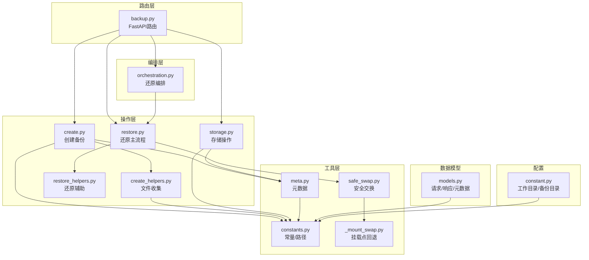
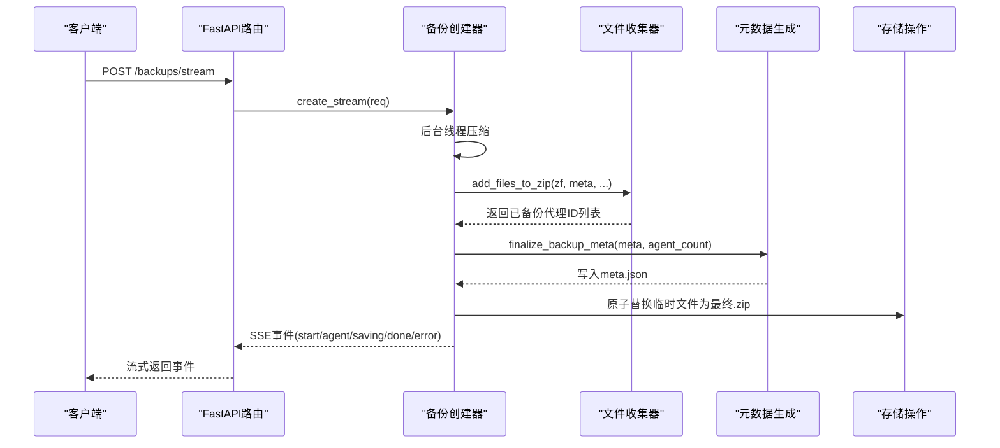
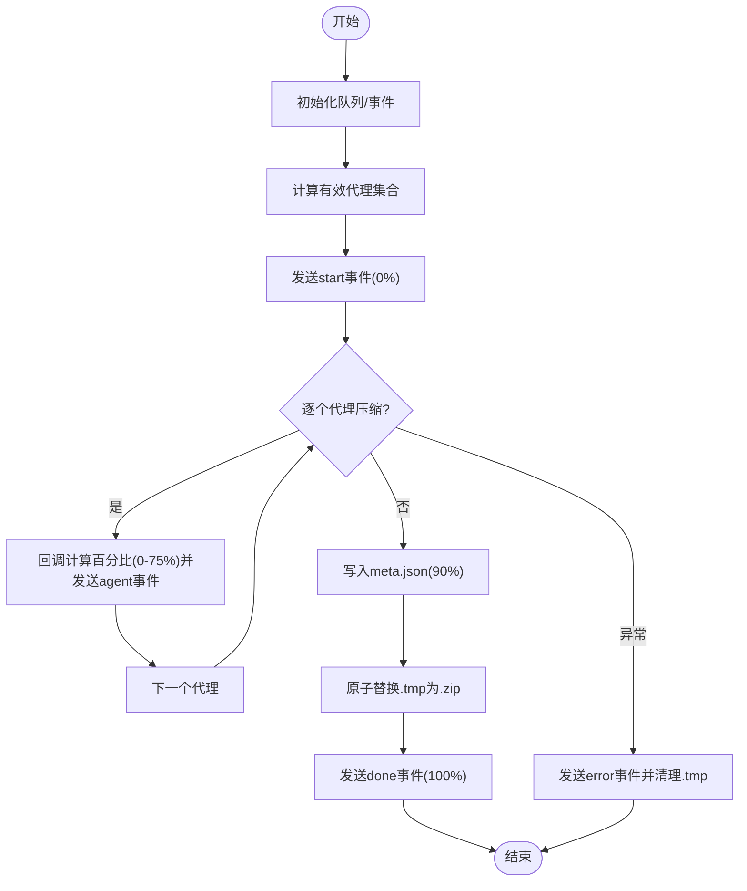
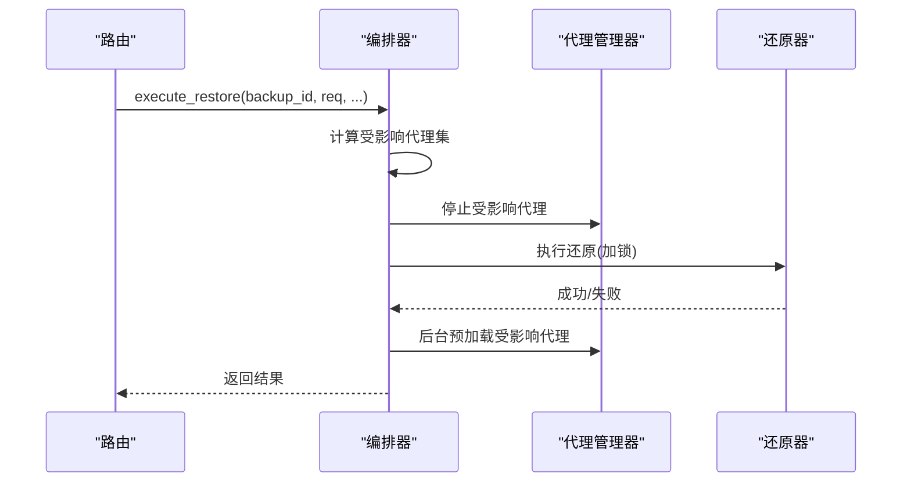
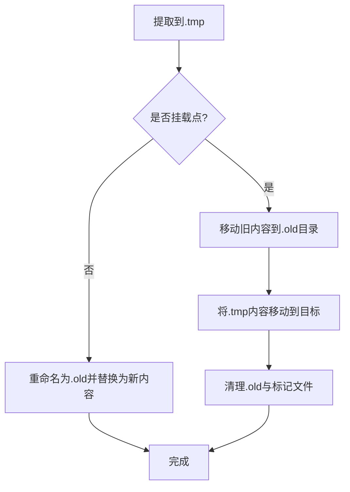
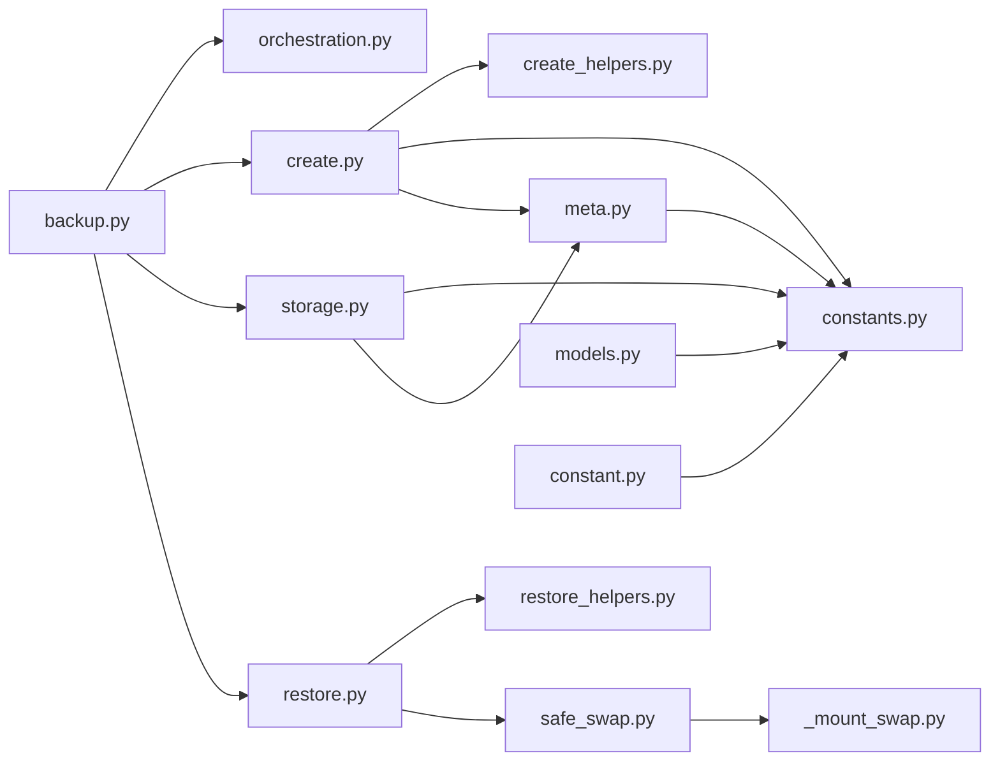

# 备份操作流程

<cite>
**本文档引用的文件**
- [orchestration.py](file://src/qwenpaw/backup/orchestration.py)
- [create.py](file://src/qwenpaw/backup/_ops/create.py)
- [create_helpers.py](file://src/qwenpaw/backup/_ops/create_helpers.py)
- [restore.py](file://src/qwenpaw/backup/_ops/restore.py)
- [restore_helpers.py](file://src/qwenpaw/backup/_ops/restore_helpers.py)
- [storage.py](file://src/qwenpaw/backup/_ops/storage.py)
- [models.py](file://src/qwenpaw/backup/models.py)
- [meta.py](file://src/qwenpaw/backup/_utils/meta.py)
- [constants.py](file://src/qwenpaw/backup/_utils/constants.py)
- [safe_swap.py](file://src/qwenpaw/backup/_utils/safe_swap.py)
- [_mount_swap.py](file://src/qwenpaw/backup/_utils/_mount_swap.py)
- [backup.py](file://src/qwenpaw/app/routers/backup.py)
- [constant.py](file://src/qwenpaw/constant.py)
- [test_safe_swap.py](file://tests/unit/backup/test_safe_swap.py)
</cite>

## 目录
1. [简介](#简介)
2. [项目结构](#项目结构)
3. [核心组件](#核心组件)
4. [架构总览](#架构总览)
5. [详细组件分析](#详细组件分析)
6. [依赖关系分析](#依赖关系分析)
7. [性能考虑](#性能考虑)
8. [故障排除指南](#故障排除指南)
9. [结论](#结论)

## 简介
本文件面向QwenPaw的备份与还原系统，提供从数据收集、文件打包、元数据生成到备份文件创建的完整技术文档。重点覆盖以下方面：
- 备份创建流程：异步事件流、进度追踪、压缩与原子写入
- 还原流程：并发控制、事务管理、挂载点回退、原子目录交换
- 错误处理与容错：断点续传、冲突解决、中断恢复
- 备份文件格式、版本标识与完整性校验
- 性能优化与监控建议

## 项目结构
备份子系统位于src/qwenpaw/backup目录下，采用分层设计：
- 路由层：FastAPI路由，暴露REST接口（创建、列表、删除、导入、导出、还原）
- 编排层：orchestration.py负责还原编排（停止/重启代理、并发控制）
- 操作层：_ops/目录包含具体操作实现（create、restore、storage、helpers）
- 工具层：_utils/目录包含常量、元数据、安全交换等工具模块
- 数据模型：models.py定义请求/响应与备份元数据结构

图表来源
- [backup.py:1-275](file://src/qwenpaw/app/routers/backup.py#L1-L275)
- [orchestration.py:1-147](file://src/qwenpaw/backup/orchestration.py#L1-L147)
- [create.py:1-219](file://src/qwenpaw/backup/_ops/create.py#L1-L219)
- [create_helpers.py:1-179](file://src/qwenpaw/backup/_ops/create_helpers.py#L1-L179)
- [restore.py:1-567](file://src/qwenpaw/backup/_ops/restore.py#L1-L567)
- [restore_helpers.py:1-159](file://src/qwenpaw/backup/_ops/restore_helpers.py#L1-L159)
- [storage.py:1-242](file://src/qwenpaw/backup/_ops/storage.py#L1-L242)
- [constants.py:1-38](file://src/qwenpaw/backup/_utils/constants.py#L1-L38)
- [meta.py:1-61](file://src/qwenpaw/backup/_utils/meta.py#L1-L61)
- [safe_swap.py:1-442](file://src/qwenpaw/backup/_utils/safe_swap.py#L1-L442)
- [_mount_swap.py:1-331](file://src/qwenpaw/backup/_utils/_mount_swap.py#L1-L331)
- [models.py:1-133](file://src/qwenpaw/backup/models.py#L1-L133)
- [constant.py:221-231](file://src/qwenpaw/constant.py#L221-L231)

章节来源
- [backup.py:1-275](file://src/qwenpaw/app/routers/backup.py#L1-L275)
- [constant.py:221-231](file://src/qwenpaw/constant.py#L221-L231)

## 核心组件
- 备份创建器：create_stream通过后台线程执行压缩，使用队列向异步事件循环推送SSE事件；支持客户端断开取消、原子写入最终ZIP
- 文件收集器：按作用域收集全局配置、机密、技能池与代理工作区
- 元数据生成器：生成备份ID、填充系统信息、写入meta.json
- 存储操作：列出、详情、删除、导入、导出备份
- 还原编排器：在还原前停止受影响代理，完成后后台预加载；处理包含机密/技能池时的额外停机范围
- 还原操作器：版本校验、目标规划、阶段化提取与提交、挂载点内容替换、主密钥冲突处理
- 安全交换：两阶段事务（提取到.tmp → 提交），失败自动回滚；挂载点回退方案保证容器场景可用

章节来源
- [create.py:21-219](file://src/qwenpaw/backup/_ops/create.py#L21-L219)
- [create_helpers.py:138-179](file://src/qwenpaw/backup/_ops/create_helpers.py#L138-L179)
- [meta.py:49-61](file://src/qwenpaw/backup/_utils/meta.py#L49-L61)
- [storage.py:29-151](file://src/qwenpaw/backup/_ops/storage.py#L29-L151)
- [orchestration.py:44-147](file://src/qwenpaw/backup/orchestration.py#L44-L147)
- [restore.py:50-418](file://src/qwenpaw/backup/_ops/restore.py#L50-L418)
- [safe_swap.py:380-442](file://src/qwenpaw/backup/_utils/safe_swap.py#L380-L442)

## 架构总览
备份系统围绕“事件驱动 + 原子操作”的设计原则构建，确保在高并发与异常情况下仍保持一致性。

图表来源
- [backup.py:65-87](file://src/qwenpaw/app/routers/backup.py#L65-L87)
- [create.py:21-219](file://src/qwenpaw/backup/_ops/create.py#L21-L219)
- [create_helpers.py:138-179](file://src/qwenpaw/backup/_ops/create_helpers.py#L138-L179)
- [meta.py:49-61](file://src/qwenpaw/backup/_utils/meta.py#L49-L61)
- [storage.py:220-241](file://src/qwenpaw/backup/_ops/storage.py#L220-L241)

## 详细组件分析

### 备份创建流程
- 异步事件流：使用asyncio.Queue与线程间通信，避免阻塞事件循环；客户端断开时通过Event触发优雅退出
- 并发与取消：每个备份任务独立运行；stop_event用于在下一个取消点终止
- 压缩与原子写入：先写入.tmp，成功后原子替换为.zip，失败清理.tmp
- 进度计算：start(0%) → agent阶段(0%-75%) → saving(90%) → done(100%)

图表来源
- [create.py:116-219](file://src/qwenpaw/backup/_ops/create.py#L116-L219)
- [create_helpers.py:138-179](file://src/qwenpaw/backup/_ops/create_helpers.py#L138-L179)
- [meta.py:49-61](file://src/qwenpaw/backup/_utils/meta.py#L49-L61)

章节来源
- [create.py:21-219](file://src/qwenpaw/backup/_ops/create.py#L21-L219)
- [create_helpers.py:138-179](file://src/qwenpaw/backup/_ops/create_helpers.py#L138-L179)
- [meta.py:49-61](file://src/qwenpaw/backup/_utils/meta.py#L49-L61)

### 还原编排与并发控制
- 编排职责：根据请求决定受影响代理集；当包含机密或技能池时，扩展停机范围以释放文件句柄
- 并发控制：使用asyncio.Lock串行化还原操作，避免Windows上目录重命名冲突
- 进程级锁：restore_process_lock通过文件锁防止多进程同时进行还原/清理
- 后台预加载：还原完成后异步预加载受影响代理，提升用户体验

图表来源
- [orchestration.py:44-147](file://src/qwenpaw/backup/orchestration.py#L44-L147)
- [restore.py:50-54](file://src/qwenpaw/backup/_ops/restore.py#L50-L54)

章节来源
- [orchestration.py:44-147](file://src/qwenpaw/backup/orchestration.py#L44-L147)
- [restore.py:42-48](file://src/qwenpaw/backup/_ops/restore.py#L42-L48)

### 原子目录交换与挂载点回退
- 三阶段协议：提取到.tmp → 旧内容移至.restore_old → 交换并清理
- 并发保护：按目标路径加锁，避免并发交错操作
- 挂载点回退：当目录重命名不可用时，仅交换挂载点内容，保留挂载目录稳定
- 启动清理：应用启动时扫描残留.artifacts并恢复或清理

图表来源
- [safe_swap.py:324-425](file://src/qwenpaw/backup/_utils/safe_swap.py#L324-L425)
- [_mount_swap.py:85-151](file://src/qwenpaw/backup/_utils/_mount_swap.py#L85-L151)

章节来源
- [safe_swap.py:1-442](file://src/qwenpaw/backup/_utils/safe_swap.py#L1-L442)
- [_mount_swap.py:1-331](file://src/qwenpaw/backup/_utils/_mount_swap.py#L1-L331)

### 错误处理与容错机制
- 断点续传：客户端断开时，压缩线程在下一个取消点退出，不写入最终文件；可重新发起
- 冲突处理：导入备份时若ID冲突，保留上传的.tmp文件并通过pending_token确认覆盖
- 主密钥冲突：还原前检测机密目录中.master_key差异，必要时备份当前密钥以防解密历史凭据
- 版本兼容：只接受受支持的备份版本，拒绝不兼容版本
- 非法路径防护：Zip Slip防护，跳过解析后越权路径

章节来源
- [create.py:121-144](file://src/qwenpaw/backup/_ops/create.py#L121-L144)
- [backup.py:108-137](file://src/qwenpaw/app/routers/backup.py#L108-L137)
- [restore.py:61-67](file://src/qwenpaw/backup/_ops/restore.py#L61-L67)
- [restore_helpers.py:111-159](file://src/qwenpaw/backup/_ops/restore_helpers.py#L111-L159)
- [safe_swap.py:291-322](file://src/qwenpaw/backup/_utils/safe_swap.py#L291-L322)

### 备份文件格式、版本与完整性
- 文件格式：ZIP归档，根目录包含meta.json
- 内部结构：data/config.json、data/secrets/*、data/skill_pool/*、data/workspaces/{agent_id}/*
- 元数据字段：备份ID、名称、描述、创建时间、版本、作用域、代理数量、QwenPaw版本、系统信息
- 版本标识：BackupMeta.version，默认"1"，restore阶段进行版本校验
- 完整性校验：meta.json存在性与JSON有效性检查；导入时验证ZIP与meta.json

章节来源
- [constants.py:10-24](file://src/qwenpaw/backup/_utils/constants.py#L10-L24)
- [models.py:32-56](file://src/qwenpaw/backup/models.py#L32-L56)
- [meta.py:56-61](file://src/qwenpaw/backup/_utils/meta.py#L56-L61)
- [storage.py:67-123](file://src/qwenpaw/backup/_ops/storage.py#L67-L123)

### API与路由
- 创建备份（SSE）：POST /backups/stream，返回start/agent/saving/done/error事件
- 列表/详情/删除/导入/导出：GET/POST /backups、DELETE /backups/delete、POST /backups/import、GET /backups/{backup_id}/export
- 还原：POST /backups/{backup_id}/restore，支持full/custom模式

章节来源
- [backup.py:65-275](file://src/qwenpaw/app/routers/backup.py#L65-L275)

## 依赖关系分析

图表来源
- [backup.py:15-33](file://src/qwenpaw/app/routers/backup.py#L15-L33)
- [create.py:11-16](file://src/qwenpaw/backup/_ops/create.py#L11-L16)
- [storage.py:11-19](file://src/qwenpaw/backup/_ops/storage.py#L11-L19)
- [restore.py:13-38](file://src/qwenpaw/backup/_ops/restore.py#L13-L38)
- [safe_swap.py:53-58](file://src/qwenpaw/backup/_utils/safe_swap.py#L53-L58)
- [_mount_swap.py:1-18](file://src/qwenpaw/backup/_utils/_mount_swap.py#L1-L18)
- [models.py:1-12](file://src/qwenpaw/backup/models.py#L1-L12)
- [constant.py:221-231](file://src/qwenpaw/constant.py#L221-L231)

章节来源
- [backup.py:1-275](file://src/qwenpaw/app/routers/backup.py#L1-L275)
- [create.py:1-219](file://src/qwenpaw/backup/_ops/create.py#L1-L219)
- [storage.py:1-242](file://src/qwenpaw/backup/_ops/storage.py#L1-L242)
- [restore.py:1-567](file://src/qwenpaw/backup/_ops/restore.py#L1-L567)
- [safe_swap.py:1-442](file://src/qwenpaw/backup/_utils/safe_swap.py#L1-L442)
- [_mount_swap.py:1-331](file://src/qwenpaw/backup/_utils/_mount_swap.py#L1-L331)
- [models.py:1-133](file://src/qwenpaw/backup/models.py#L1-L133)
- [constant.py:221-231](file://src/qwenpaw/constant.py#L221-L231)

## 性能考虑
- I/O与CPU分离：压缩在后台线程执行，避免阻塞事件循环
- 原子写入：.tmp + replace减少部分写入风险，提高可靠性
- 并发串行化：还原使用锁避免Windows目录重命名竞争
- 挂载点优化：容器场景下避免rename失败导致的性能与稳定性问题
- 进度粒度：按代理维度报告进度，便于前端反馈与用户感知

## 故障排除指南
- 客户端断开导致备份未完成：检查BACKUP_DIR下的.tmp文件是否残留；重新发起备份即可续传
- 导入备份ID冲突：使用pending_token再次调用导入接口确认覆盖
- 还原失败回滚：safe_swap会自动回滚到旧内容；检查.restore_old与日志定位问题
- 挂载点还原异常：确认挂载点内容交换状态文件与保留目录不存在；清理后重试
- 版本不兼容：确认备份版本是否在_supported_versions集合内

章节来源
- [create.py:121-144](file://src/qwenpaw/backup/_ops/create.py#L121-L144)
- [backup.py:108-137](file://src/qwenpaw/app/routers/backup.py#L108-L137)
- [safe_swap.py:170-284](file://src/qwenpaw/backup/_utils/safe_swap.py#L170-L284)
- [restore.py:61-67](file://src/qwenpaw/backup/_ops/restore.py#L61-L67)

## 结论
QwenPaw的备份系统通过事件驱动的异步创建、严格的原子操作与完善的并发控制，实现了高可靠性的备份与还原能力。其设计兼顾了跨平台与容器环境的特殊需求，并提供了清晰的错误处理与恢复策略，适合在生产环境中长期使用。