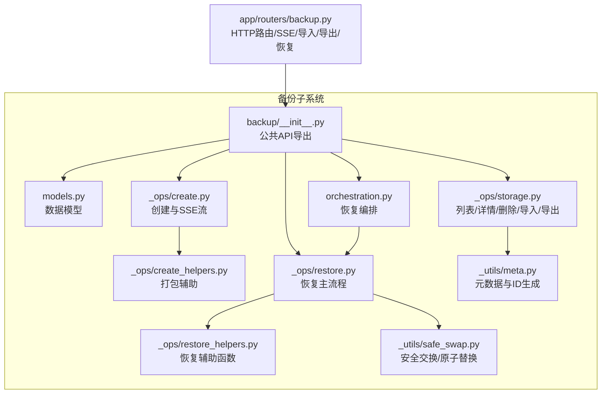
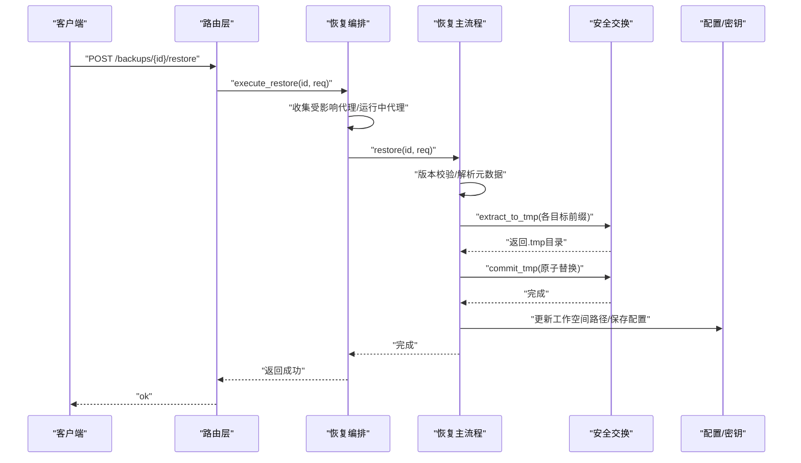
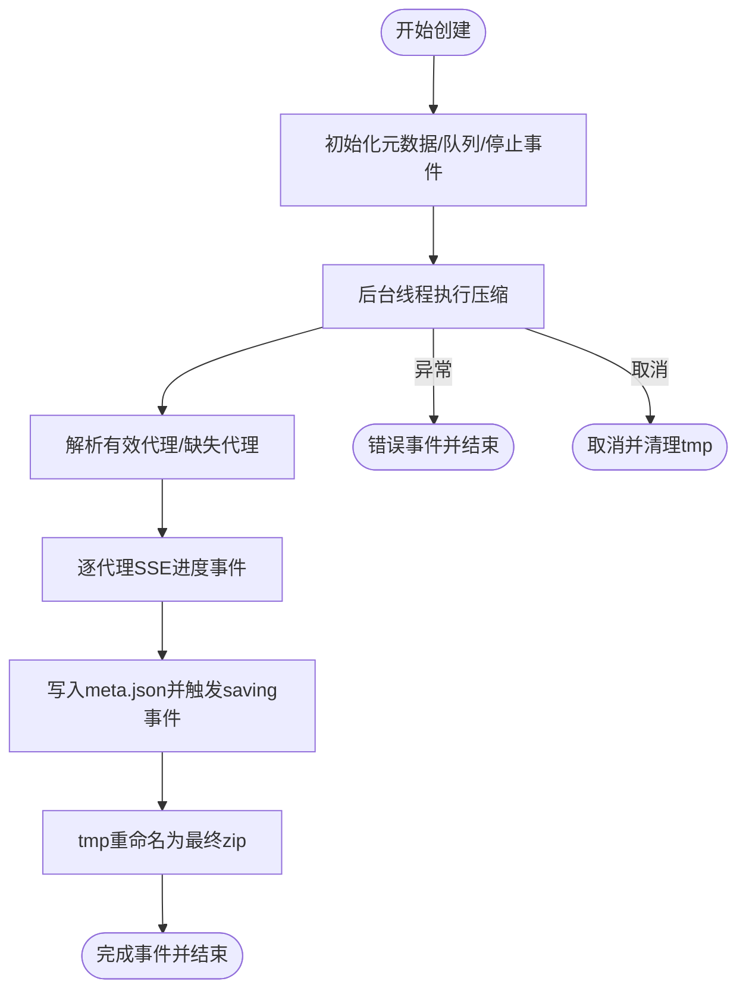
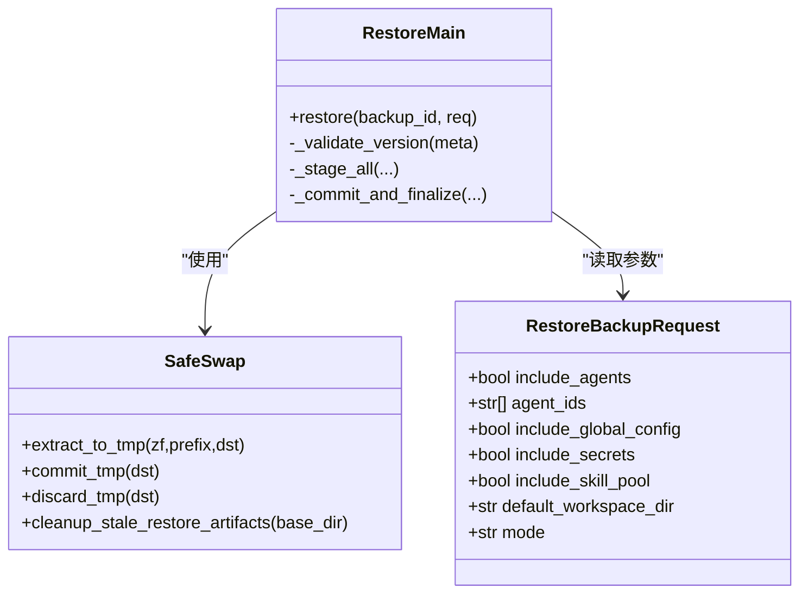
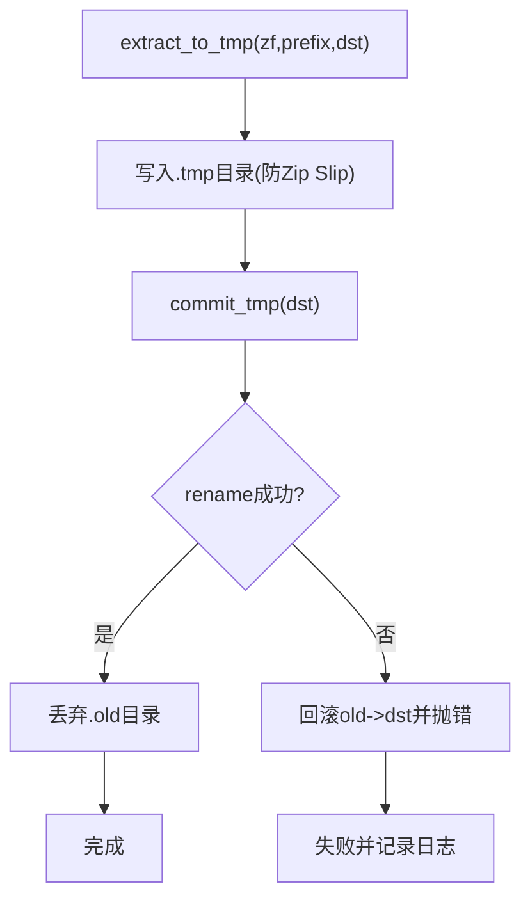
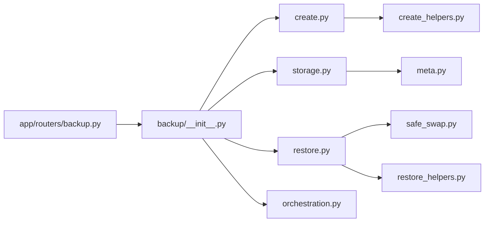

# 备份测试与验证

<cite>
**本文引用的文件**
- [src/qwenpaw/backup/__init__.py](file://src/qwenpaw/backup/__init__.py)
- [src/qwenpaw/backup/models.py](file://src/qwenpaw/backup/models.py)
- [src/qwenpaw/backup/orchestration.py](file://src/qwenpaw/backup/orchestration.py)
- [src/qwenpaw/backup/_ops/create.py](file://src/qwenpaw/backup/_ops/create.py)
- [src/qwenpaw/backup/_ops/create_helpers.py](file://src/qwenpaw/backup/_ops/create_helpers.py)
- [src/qwenpaw/backup/_ops/restore.py](file://src/qwenpaw/backup/_ops/restore.py)
- [src/qwenpaw/backup/_ops/restore_helpers.py](file://src/qwenpaw/backup/_ops/restore_helpers.py)
- [src/qwenpaw/backup/_ops/storage.py](file://src/qwenpaw/backup/_ops/storage.py)
- [src/qwenpaw/backup/_utils/meta.py](file://src/qwenpaw/backup/_utils/meta.py)
- [src/qwenpaw/backup/_utils/safe_swap.py](file://src/qwenpaw/backup/_utils/safe_swap.py)
- [src/qwenpaw/app/routers/backup.py](file://src/qwenpaw/app/routers/backup.py)
- [tests/unit/backup/test_safe_swap.py](file://tests/unit/backup/test_safe_swap.py)
- [website/public/docs/backup.en.md](file://website/public/docs/backup.en.md)
</cite>

## 目录
1. [简介](#简介)
2. [项目结构](#项目结构)
3. [核心组件](#核心组件)
4. [架构总览](#架构总览)
5. [详细组件分析](#详细组件分析)
6. [依赖分析](#依赖分析)
7. [性能考虑](#性能考虑)
8. [故障排查指南](#故障排查指南)
9. [结论](#结论)
10. [附录](#附录)

## 简介
本文件面向QwenPaw的备份与恢复能力，提供一套系统化的“备份测试与验证”技术文档。内容覆盖备份完整性检查方法（文件校验、数据一致性验证、元数据完整性）、恢复演练标准流程（模拟恢复、功能验证、性能测试）、备份质量评估指标与测试用例设计、自动化测试框架实现建议、备份恢复成功率统计与应急响应测试指南，以及备份存储管理、清理策略与长期保存最佳实践。目标是帮助测试工程师与运维人员建立可重复、可度量、可追溯的备份质量保障体系。

## 项目结构
备份子系统位于src/qwenpaw/backup目录下，采用分层设计：
- 公共API入口：导出创建、列举、详情、删除、导入、导出、执行恢复等能力
- 数据模型：定义备份范围、元数据、请求/响应模型
- 操作层：创建、存储、恢复、辅助工具
- 工具层：安全交换（原子替换）、元数据读写、常量与路径
- 路由层：FastAPI路由，提供HTTP接口与SSE进度流
- 测试：单元测试覆盖安全交换与挂载点场景



图表来源
- [src/qwenpaw/backup/__init__.py:1-22](file://src/qwenpaw/backup/__init__.py#L1-L22)
- [src/qwenpaw/backup/models.py:1-133](file://src/qwenpaw/backup/models.py#L1-L133)
- [src/qwenpaw/backup/orchestration.py:1-147](file://src/qwenpaw/backup/orchestration.py#L1-L147)
- [src/qwenpaw/backup/_ops/create.py:1-219](file://src/qwenpaw/backup/_ops/create.py#L1-L219)
- [src/qwenpaw/backup/_ops/create_helpers.py:1-179](file://src/qwenpaw/backup/_ops/create_helpers.py#L1-L179)
- [src/qwenpaw/backup/_ops/storage.py:1-242](file://src/qwenpaw/backup/_ops/storage.py#L1-L242)
- [src/qwenpaw/backup/_ops/restore.py:1-567](file://src/qwenpaw/backup/_ops/restore.py#L1-L567)
- [src/qwenpaw/backup/_ops/restore_helpers.py:1-159](file://src/qwenpaw/backup/_ops/restore_helpers.py#L1-L159)
- [src/qwenpaw/backup/_utils/meta.py:1-61](file://src/qwenpaw/backup/_utils/meta.py#L1-L61)
- [src/qwenpaw/backup/_utils/safe_swap.py:1-442](file://src/qwenpaw/backup/_utils/safe_swap.py#L1-L442)
- [src/qwenpaw/app/routers/backup.py:1-275](file://src/qwenpaw/app/routers/backup.py#L1-L275)

章节来源
- [src/qwenpaw/backup/__init__.py:1-22](file://src/qwenpaw/backup/__init__.py#L1-L22)
- [src/qwenpaw/backup/models.py:1-133](file://src/qwenpaw/backup/models.py#L1-L133)
- [src/qwenpaw/app/routers/backup.py:1-275](file://src/qwenpaw/app/routers/backup.py#L1-L275)

## 核心组件
- 备份数据模型：BackupScope、BackupMeta、CreateBackupRequest、RestoreBackupRequest、BackupDetail、DeleteBackupsRequest/Response、BackupConflictError
- 创建流程：异步SSE事件流，后台线程压缩，原子写入临时文件后重命名
- 存储操作：列出、详情、删除、导入（冲突处理）、导出
- 恢复编排：停止受影响代理→执行恢复→重启代理；支持全量/自定义模式
- 恢复主流程：版本校验、全局配置合并策略、工作空间目的地规划、安全交换原子替换
- 安全交换：三阶段协议（提取到.tmp → 原子替换 → 清理.old），跨平台兼容（Windows EBUSY回退到挂载点交换）
- 路由接口：SSE进度流、导入/导出、删除、恢复、详情、列表

章节来源
- [src/qwenpaw/backup/models.py:13-133](file://src/qwenpaw/backup/models.py#L13-L133)
- [src/qwenpaw/backup/_ops/create.py:21-219](file://src/qwenpaw/backup/_ops/create.py#L21-L219)
- [src/qwenpaw/backup/_ops/storage.py:29-242](file://src/qwenpaw/backup/_ops/storage.py#L29-L242)
- [src/qwenpaw/backup/orchestration.py:44-147](file://src/qwenpaw/backup/orchestration.py#L44-L147)
- [src/qwenpaw/backup/_ops/restore.py:50-567](file://src/qwenpaw/backup/_ops/restore.py#L50-L567)
- [src/qwenpaw/backup/_utils/safe_swap.py:1-442](file://src/qwenpaw/backup/_utils/safe_swap.py#L1-L442)
- [src/qwenpaw/app/routers/backup.py:65-275](file://src/qwenpaw/app/routers/backup.py#L65-L275)

## 架构总览
备份与恢复的端到端流程如下：



图表来源
- [src/qwenpaw/app/routers/backup.py:230-256](file://src/qwenpaw/app/routers/backup.py#L230-L256)
- [src/qwenpaw/backup/orchestration.py:44-147](file://src/qwenpaw/backup/orchestration.py#L44-L147)
- [src/qwenpaw/backup/_ops/restore.py:361-418](file://src/qwenpaw/backup/_ops/restore.py#L361-L418)
- [src/qwenpaw/backup/_utils/safe_swap.py:381-425](file://src/qwenpaw/backup/_utils/safe_swap.py#L381-L425)

## 详细组件分析

### 组件A：备份创建与SSE流
- 异步SSE事件流：start/agent/saving/done/error
- 后台线程压缩：避免阻塞事件循环；支持客户端断开取消
- 原子写入：先写.tmp再重命名为最终.zip
- 进度计算：按代理数量加权（约10%-90%）



图表来源
- [src/qwenpaw/backup/_ops/create.py:21-219](file://src/qwenpaw/backup/_ops/create.py#L21-L219)
- [src/qwenpaw/backup/_ops/create_helpers.py:138-179](file://src/qwenpaw/backup/_ops/create_helpers.py#L138-L179)
- [src/qwenpaw/backup/_utils/meta.py:49-61](file://src/qwenpaw/backup/_utils/meta.py#L49-L61)

章节来源
- [src/qwenpaw/backup/_ops/create.py:21-219](file://src/qwenpaw/backup/_ops/create.py#L21-L219)
- [src/qwenpaw/backup/_ops/create_helpers.py:1-179](file://src/qwenpaw/backup/_ops/create_helpers.py#L1-L179)
- [src/qwenpaw/backup/_utils/meta.py:1-61](file://src/qwenpaw/backup/_utils/meta.py#L1-L61)

### 组件B：恢复编排与原子替换
- 编排职责：停止受影响代理→执行恢复→后台预加载重启
- 并发控制：序列化恢复过程锁，防止并发文件操作冲突
- 安全交换：三阶段协议，失败自动回滚，支持挂载点替换
- 配置合并：full模式全量替换，custom模式仅对选中代理合并



图表来源
- [src/qwenpaw/backup/models.py:69-109](file://src/qwenpaw/backup/models.py#L69-L109)
- [src/qwenpaw/backup/_ops/restore.py:50-567](file://src/qwenpaw/backup/_ops/restore.py#L50-L567)
- [src/qwenpaw/backup/_utils/safe_swap.py:381-442](file://src/qwenpaw/backup/_utils/safe_swap.py#L381-L442)

章节来源
- [src/qwenpaw/backup/orchestration.py:44-147](file://src/qwenpaw/backup/orchestration.py#L44-L147)
- [src/qwenpaw/backup/_ops/restore.py:50-567](file://src/qwenpaw/backup/_ops/restore.py#L50-L567)
- [src/qwenpaw/backup/_utils/safe_swap.py:1-442](file://src/qwenpaw/backup/_utils/safe_swap.py#L1-L442)

### 组件C：HTTP路由与SSE/导入/导出
- SSE：/backups/stream，事件格式为data: {...}\n\n
- 导入：支持冲突重试（pending_token）与类型校验
- 导出：返回zip文件
- 删除：批量删除并记录失败项
- 详情：读取zip内meta.json并统计每个agent的文件数与大小

```mermaid
sequenceDiagram
participant Client as "客户端"
participant Router as "路由层"
participant Storage as "存储操作"
participant Create as "创建操作"
Client->>Router : "POST /backups/import"
Router->>Storage : "import_backup(tmp_path)"
alt 冲突
Storage-->>Router : "BackupConflictError"
Router-->>Client : "409 + existing + pending_token"
else 成功
Storage-->>Router : "BackupMeta"
Router-->>Client : "BackupMeta"
end
Client->>Router : "GET /backups/stream"
Router->>Create : "create_stream(req)"
loop 事件流
Create-->>Router : "SSE事件"
Router-->>Client : "data : {event}\n\n"
end
```

图表来源
- [src/qwenpaw/app/routers/backup.py:65-275](file://src/qwenpaw/app/routers/backup.py#L65-L275)
- [src/qwenpaw/backup/_ops/storage.py:182-242](file://src/qwenpaw/backup/_ops/storage.py#L182-L242)
- [src/qwenpaw/backup/_ops/create.py:21-81](file://src/qwenpaw/backup/_ops/create.py#L21-L81)

章节来源
- [src/qwenpaw/app/routers/backup.py:1-275](file://src/qwenpaw/app/routers/backup.py#L1-L275)
- [src/qwenpaw/backup/_ops/storage.py:1-242](file://src/qwenpaw/backup/_ops/storage.py#L1-L242)

### 组件D：安全交换与挂载点替换
- 三阶段协议：extract_to_tmp → commit_tmp → discard_tmp
- 锁机制：按目标路径加锁，避免并发交错
- 回退策略：Windows EBUSY或挂载点场景自动切换到挂载点内容替换
- 启动清理：恢复中断时自动回滚或清理残留.artifacts



图表来源
- [src/qwenpaw/backup/_utils/safe_swap.py:291-374](file://src/qwenpaw/backup/_utils/safe_swap.py#L291-L374)

章节来源
- [src/qwenpaw/backup/_utils/safe_swap.py:1-442](file://src/qwenpaw/backup/_utils/safe_swap.py#L1-L442)

## 依赖分析
- 模块耦合
  - orchestration依赖storage与restore，保持路由薄逻辑
  - restore依赖safe_swap与restore_helpers，确保原子性与可测试性
  - create依赖create_helpers与meta，分离打包与元数据
  - 路由层依赖backup包公共API，便于替换实现
- 外部依赖
  - FastAPI用于HTTP接口与SSE
  - zipfile用于压缩/解压
  - pathlib用于路径处理
  - asyncio/threading用于并发与同步



图表来源
- [src/qwenpaw/app/routers/backup.py:1-37](file://src/qwenpaw/app/routers/backup.py#L1-L37)
- [src/qwenpaw/backup/__init__.py:1-22](file://src/qwenpaw/backup/__init__.py#L1-L22)
- [src/qwenpaw/backup/_ops/create.py:1-18](file://src/qwenpaw/backup/_ops/create.py#L1-L18)
- [src/qwenpaw/backup/_ops/storage.py:1-21](file://src/qwenpaw/backup/_ops/storage.py#L1-L21)
- [src/qwenpaw/backup/_ops/restore.py:1-38](file://src/qwenpaw/backup/_ops/restore.py#L1-L38)
- [src/qwenpaw/backup/_utils/safe_swap.py:1-60](file://src/qwenpaw/backup/_utils/safe_swap.py#L1-L60)

章节来源
- [src/qwenpaw/backup/__init__.py:1-22](file://src/qwenpaw/backup/__init__.py#L1-L22)
- [src/qwenpaw/backup/_ops/restore.py:1-567](file://src/qwenpaw/backup/_ops/restore.py#L1-L567)

## 性能考虑
- 压缩与I/O
  - 使用后台线程压缩，避免阻塞事件循环
  - 分块读取上传文件，降低内存峰值
- 并发与锁
  - 恢复过程串行化，减少Windows上目录重命名失败风险
  - 按目标路径加锁，避免竞态
- 网络与客户端
  - SSE禁用代理缓冲，保证事件实时到达
  - 断开连接时及时清理临时文件

[本节为通用性能讨论，无需特定文件来源]

## 故障排查指南
- 常见问题定位
  - 备份不存在：路由层返回404；storage与restore均会检查zip与meta
  - 版本不支持：restore阶段校验meta.version
  - 冲突导入：返回409并携带existing与pending_token
  - 恢复失败：编排器记录异常并尝试后台重启
- 日志与可观测性
  - 关键路径均有日志输出，包含backup_id、百分比、警告与异常堆栈
- 单元测试参考
  - 安全交换：覆盖rename失败回退、挂载点替换、启动清理、保留名过滤等

章节来源
- [src/qwenpaw/backup/_ops/storage.py:182-242](file://src/qwenpaw/backup/_ops/storage.py#L182-L242)
- [src/qwenpaw/backup/_ops/restore.py:61-67](file://src/qwenpaw/backup/_ops/restore.py#L61-L67)
- [src/qwenpaw/app/routers/backup.py:230-256](file://src/qwenpaw/app/routers/backup.py#L230-L256)
- [tests/unit/backup/test_safe_swap.py:1-340](file://tests/unit/backup/test_safe_swap.py#L1-L340)

## 结论
QwenPaw的备份与恢复体系通过清晰的模块划分、严格的原子性保障与完善的HTTP接口，提供了高可靠性的数据保护能力。结合本文的测试与验证方法，可在开发、集成与生产环境中建立一致的质量基线，确保备份可用、恢复可控、回滚可逆。

[本节为总结，无需特定文件来源]

## 附录

### 备份完整性检查方法
- 文件校验
  - 校验meta.json存在且可解析
  - 校验各目标前缀存在性（config/workspaces/secrets/skill_pool）
  - 对agent工作空间进行文件计数与大小统计，核对与meta.agent_count一致
- 数据一致性验证
  - 解析agent.json中的workspace_dir，确认与实际路径一致
  - 比对全局配置合并策略（full vs custom）与预期行为
- 元数据完整性检查
  - 校验备份ID格式、版本号、系统信息字段
  - 校验备份时间戳与创建环境匹配

章节来源
- [src/qwenpaw/backup/_ops/storage.py:67-124](file://src/qwenpaw/backup/_ops/storage.py#L67-L124)
- [src/qwenpaw/backup/_ops/restore.py:361-418](file://src/qwenpaw/backup/_ops/restore.py#L361-L418)
- [src/qwenpaw/backup/_utils/meta.py:49-61](file://src/qwenpaw/backup/_utils/meta.py#L49-L61)

### 恢复演练标准流程
- 准备阶段
  - 创建“预恢复备份”，作为回滚锚点
  - 明确恢复模式（full/custom）与目标代理集合
- 执行阶段
  - 调用/restore接口，观察SSE进度
  - 记录受影响代理列表与停止/重启时间
- 验证阶段
  - 功能验证：代理工作空间、全局配置、技能池、密钥可用性
  - 性能验证：启动耗时、代理预加载时间
- 回滚与复盘
  - 如异常，使用预恢复备份快速回滚
  - 输出恢复报告与失败根因

章节来源
- [src/qwenpaw/app/routers/backup.py:230-256](file://src/qwenpaw/app/routers/backup.py#L230-L256)
- [src/qwenpaw/backup/orchestration.py:44-147](file://src/qwenpaw/backup/orchestration.py#L44-L147)
- [website/public/docs/backup.en.md:77-126](file://website/public/docs/backup.en.md#L77-L126)

### 备份质量评估指标与测试用例设计
- 指标
  - 备份成功率（创建/导入/导出/删除）
  - 恢复成功率（完整恢复/部分恢复）
  - 平均创建耗时、平均恢复耗时
  - 备份体积与压缩比
  - 失败率与失败原因分布
- 测试用例
  - 正常路径：创建→导出→导入→恢复→校验
  - 边界路径：空代理、缺失代理、版本不支持、挂载点场景
  - 异常路径：客户端断开、导入冲突、磁盘满、权限不足
  - 自动化：SSE事件顺序校验、原子替换状态机、挂载点回退

章节来源
- [tests/unit/backup/test_safe_swap.py:1-340](file://tests/unit/backup/test_safe_swap.py#L1-L340)
- [src/qwenpaw/backup/_ops/create.py:21-81](file://src/qwenpaw/backup/_ops/create.py#L21-L81)
- [src/qwenpaw/backup/_ops/storage.py:182-242](file://src/qwenpaw/backup/_ops/storage.py#L182-L242)

### 自动化测试框架实现
- 单元测试
  - 使用pytest与unittest.mock，隔离外部依赖
  - 覆盖extract_to_tmp/commit_tmp/discard_tmp与启动清理
- 集成测试
  - 搭建最小化服务，调用路由接口，验证SSE与HTTP状态码
- 回归测试
  - 基于真实zip样本，验证版本校验与合并策略

章节来源
- [tests/unit/backup/test_safe_swap.py:1-340](file://tests/unit/backup/test_safe_swap.py#L1-L340)
- [src/qwenpaw/app/routers/backup.py:65-275](file://src/qwenpaw/app/routers/backup.py#L65-L275)

### 备份恢复成功率统计与应急响应测试
- 统计维度
  - 时间窗口内的成功/失败次数与失败原因
  - 不同模式（full/custom）的成功率差异
- 应急响应
  - 预恢复备份策略
  - 自动回滚脚本与演练计划
  - SLA与告警阈值设定

章节来源
- [website/public/docs/backup.en.md:77-96](file://website/public/docs/backup.en.md#L77-L96)

### 备份存储管理、清理策略与长期保存最佳实践
- 存储位置
  - 默认路径：~/.qwenpaw.backups/，Docker部署需持久化卷
- 清理策略
  - 定期清理过期上传临时文件与创建临时文件
  - 恢复中断后的残留.artifacts自动清理
- 长期保存
  - 归档策略：按版本/日期命名，保留关键快照
  - 多副本与异地备份
  - 定期抽样恢复演练

章节来源
- [src/qwenpaw/app/routers/backup.py:42-63](file://src/qwenpaw/app/routers/backup.py#L42-L63)
- [src/qwenpaw/backup/_utils/safe_swap.py:170-289](file://src/qwenpaw/backup/_utils/safe_swap.py#L170-L289)
- [website/public/docs/backup.en.md:157-179](file://website/public/docs/backup.en.md#L157-L179)