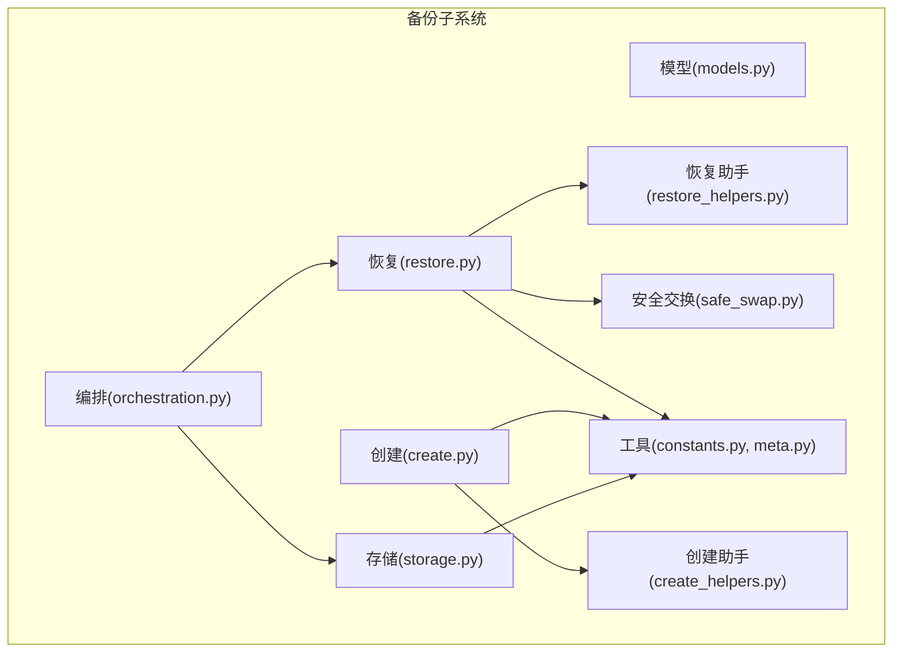
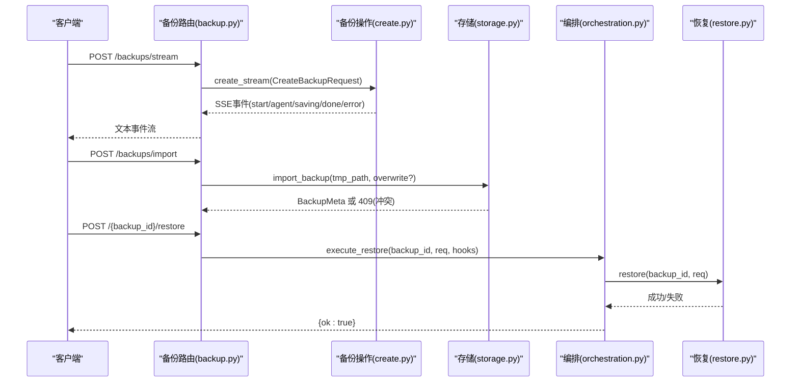
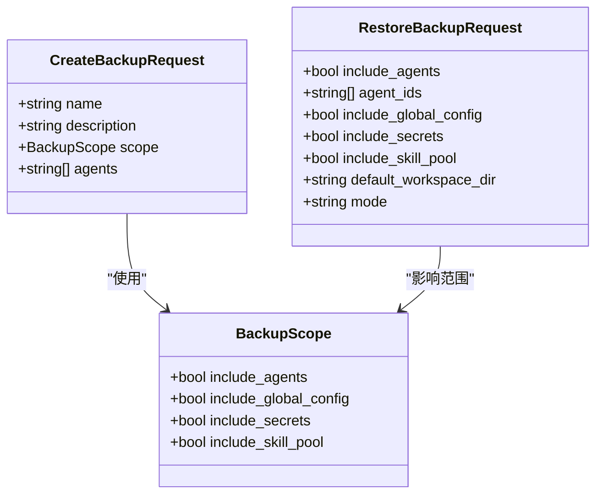
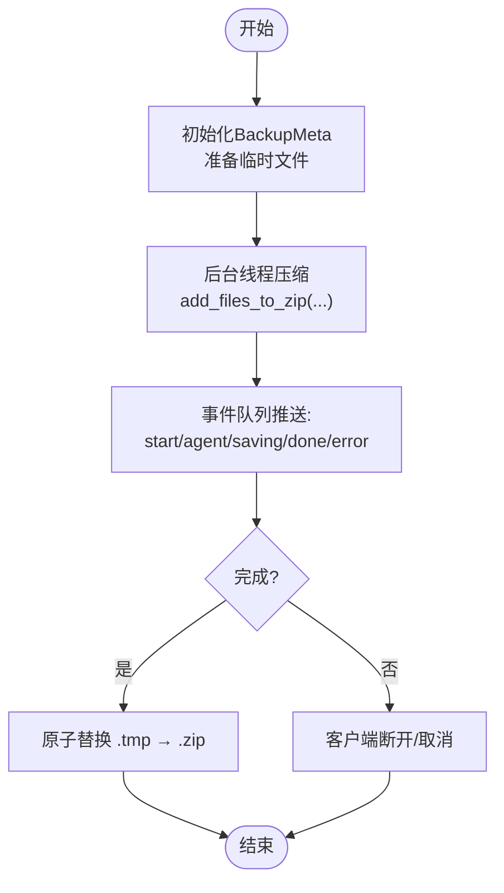
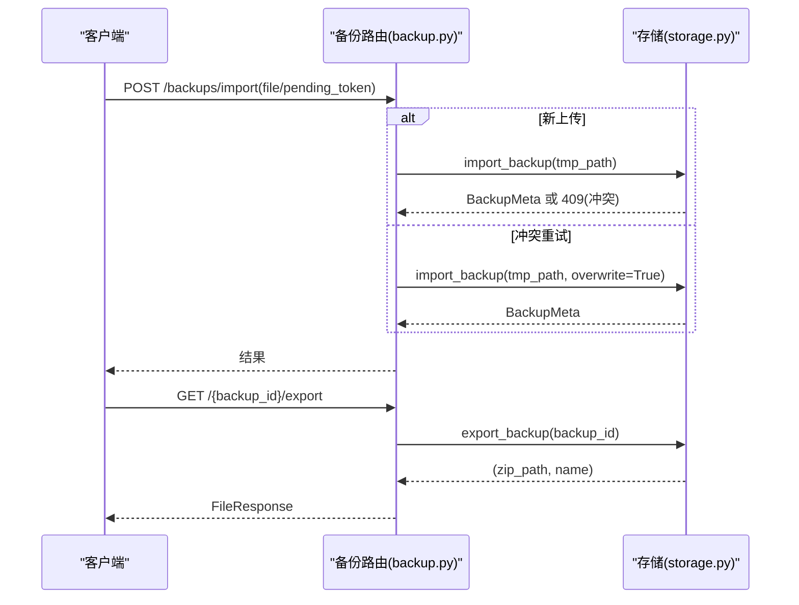
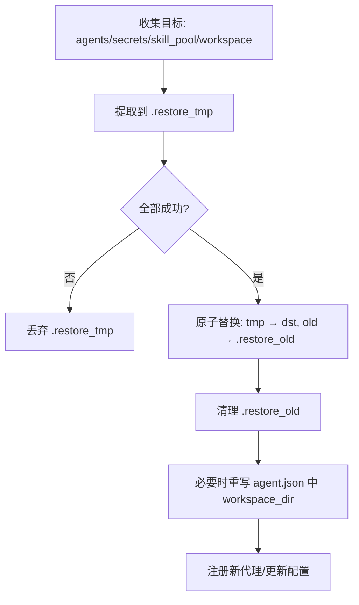
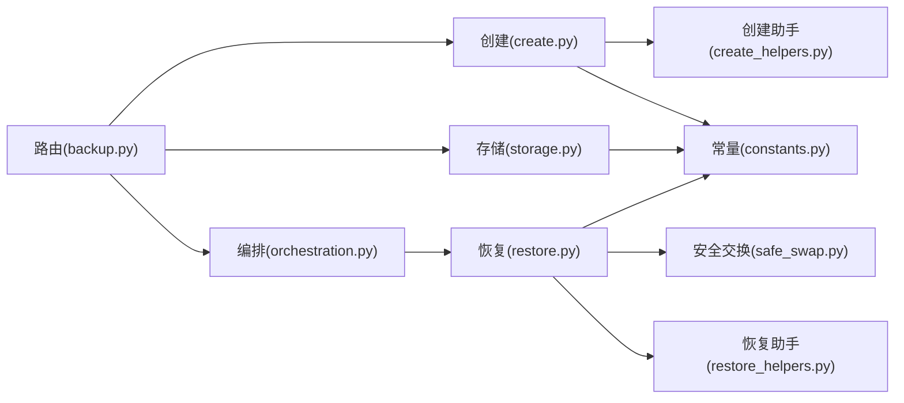

# 备份策略设计

<cite>
**本文引用的文件**
- [src/qwenpaw/backup/__init__.py](file://src/qwenpaw/backup/__init__.py)
- [src/qwenpaw/backup/models.py](file://src/qwenpaw/backup/models.py)
- [src/qwenpaw/backup/orchestration.py](file://src/qwenpaw/backup/orchestration.py)
- [src/qwenpaw/backup/_ops/create.py](file://src/qwenpaw/backup/_ops/create.py)
- [src/qwenpaw/backup/_ops/create_helpers.py](file://src/qwenpaw/backup/_ops/create_helpers.py)
- [src/qwenpaw/backup/_ops/restore.py](file://src/qwenpaw/backup/_ops/restore.py)
- [src/qwenpaw/backup/_ops/restore_helpers.py](file://src/qwenpaw/backup/_ops/restore_helpers.py)
- [src/qwenpaw/backup/_ops/storage.py](file://src/qwenpaw/backup/_ops/storage.py)
- [src/qwenpaw/backup/_ops/safe_swap.py](file://src/qwenpaw/backup/_ops/safe_swap.py)
- [src/qwenpaw/backup/_utils/constants.py](file://src/qwenpaw/backup/_utils/constants.py)
- [src/qwenpaw/backup/_utils/meta.py](file://src/qwenpaw/backup/_utils/meta.py)
- [src/qwenpaw/app/routers/backup.py](file://src/qwenpaw/app/routers/backup.py)
- [src/qwenpaw/constant.py](file://src/qwenpaw/constant.py)
- [console/src/api/types/backup.ts](file://console/src/api/types/backup.ts)
- [website/public/docs/backup.en.md](file://website/public/docs/backup.en.md)
</cite>

## 目录
1. [引言](#引言)
2. [项目结构](#项目结构)
3. [核心组件](#核心组件)
4. [架构总览](#架构总览)
5. [详细组件分析](#详细组件分析)
6. [依赖关系分析](#依赖关系分析)
7. [性能考量](#性能考量)
8. [故障排查指南](#故障排查指南)
9. [结论](#结论)
10. [附录](#附录)

## 引言
本技术文档围绕 QwenPaw 的备份与恢复能力，系统化阐述备份策略设计的关键要素：备份范围定义、备份粒度控制、备份优先级设置；备份类型分类（完整备份、增量备份、差异备份）的选择标准与适用场景；备份频率配置策略（自动备份计划、手动备份触发条件、备份时机优化）；备份存储位置配置、存储介质选择与存储容量规划；以及备份加密、数据压缩与传输安全的技术实现要点。文档以代码为依据，辅以可视化图示，帮助读者在理解实现细节的同时，形成可落地的备份策略。

## 项目结构
备份子系统由“模型层、操作层、编排层、路由层”构成，采用模块化设计，职责清晰：
- 模型层：定义备份元数据、请求/响应模型与错误类型
- 操作层：负责备份创建、恢复、存储管理等具体操作
- 编排层：协调停止/重启代理、跨目录原子替换等流程
- 路由层：对外暴露 REST 接口，支持 SSE 进度流与文件导入导出

图表来源
- [src/qwenpaw/backup/models.py:13-133](file://src/qwenpaw/backup/models.py#L13-L133)
- [src/qwenpaw/backup/_ops/create.py:1-219](file://src/qwenpaw/backup/_ops/create.py#L1-L219)
- [src/qwenpaw/backup/_ops/create_helpers.py:1-179](file://src/qwenpaw/backup/_ops/create_helpers.py#L1-L179)
- [src/qwenpaw/backup/_ops/restore.py:1-567](file://src/qwenpaw/backup/_ops/restore.py#L1-L567)
- [src/qwenpaw/backup/_ops/restore_helpers.py:1-159](file://src/qwenpaw/backup/_ops/restore_helpers.py#L1-L159)
- [src/qwenpaw/backup/_ops/storage.py:1-242](file://src/qwenpaw/backup/_ops/storage.py#L1-L242)
- [src/qwenpaw/backup/_ops/safe_swap.py:1-442](file://src/qwenpaw/backup/_ops/safe_swap.py#L1-L442)
- [src/qwenpaw/backup/_utils/constants.py:1-38](file://src/qwenpaw/backup/_utils/constants.py#L1-L38)
- [src/qwenpaw/backup/_utils/meta.py:1-61](file://src/qwenpaw/backup/_utils/meta.py#L1-L61)
- [src/qwenpaw/backup/orchestration.py:1-147](file://src/qwenpaw/backup/orchestration.py#L1-L147)

章节来源
- [src/qwenpaw/backup/__init__.py:1-22](file://src/qwenpaw/backup/__init__.py#L1-L22)
- [src/qwenpaw/backup/models.py:13-133](file://src/qwenpaw/backup/models.py#L13-L133)
- [src/qwenpaw/backup/_ops/create.py:1-219](file://src/qwenpaw/backup/_ops/create.py#L1-L219)
- [src/qwenpaw/backup/_ops/restore.py:1-567](file://src/qwenpaw/backup/_ops/restore.py#L1-L567)
- [src/qwenpaw/backup/_ops/storage.py:1-242](file://src/qwenpaw/backup/_ops/storage.py#L1-L242)
- [src/qwenpaw/backup/orchestration.py:1-147](file://src/qwenpaw/backup/orchestration.py#L1-L147)

## 核心组件
- 备份范围与粒度
  - 范围：工作空间、全局配置、密钥、技能池等
  - 粒度：按代理维度选择性包含或排除
- 备份优先级
  - 通过“是否包含密钥/技能池/全局配置”等字段进行优先级控制
- 备份类型
  - 完整备份：包含上述范围
  - 增量/差异备份：当前未实现，但可通过“仅包含变更文件”的方式扩展
- 频率策略
  - 支持手动触发与定时任务结合（CLI 提供调度参数）
- 存储与传输
  - 存储位置：可配置的备份目录
  - 压缩：ZIP 压缩（默认 Deflate）
  - 传输：SSE 流式进度、文件上传/下载

章节来源
- [src/qwenpaw/backup/models.py:13-108](file://src/qwenpaw/backup/models.py#L13-L108)
- [src/qwenpaw/backup/_ops/create_helpers.py:138-179](file://src/qwenpaw/backup/_ops/create_helpers.py#L138-L179)
- [src/qwenpaw/app/routers/backup.py:65-87](file://src/qwenpaw/app/routers/backup.py#L65-L87)
- [src/qwenpaw/constant.py:221-231](file://src/qwenpaw/constant.py#L221-L231)
- [src/qwenpaw/backup/_utils/constants.py:10-38](file://src/qwenpaw/backup/_utils/constants.py#L10-L38)

## 架构总览
备份与恢复的端到端流程如下：

图表来源
- [src/qwenpaw/app/routers/backup.py:65-275](file://src/qwenpaw/app/routers/backup.py#L65-L275)
- [src/qwenpaw/backup/_ops/create.py:21-81](file://src/qwenpaw/backup/_ops/create.py#L21-L81)
- [src/qwenpaw/backup/_ops/storage.py:182-242](file://src/qwenpaw/backup/_ops/storage.py#L182-L242)
- [src/qwenpaw/backup/orchestration.py:44-147](file://src/qwenpaw/backup/orchestration.py#L44-L147)
- [src/qwenpaw/backup/_ops/restore.py:50-54](file://src/qwenpaw/backup/_ops/restore.py#L50-L54)

## 详细组件分析

### 备份范围与粒度控制
- 范围定义
  - 工作空间：每个代理的工作目录
  - 全局配置：config.json
  - 密钥：secrets 目录
  - 技能池：skill_pool 目录
- 粒度控制
  - 通过 CreateBackupRequest.scope 与 agents 列表控制包含范围
  - 仅当 scope.include_agents 为真时，才按 agents 列表筛选
- 优先级设置
  - 通过字段 include_global_config/include_secrets/include_skill_pool 控制优先级
  - 默认包含工作空间与全局配置，密钥与技能池默认关闭

图表来源
- [src/qwenpaw/backup/models.py:13-108](file://src/qwenpaw/backup/models.py#L13-L108)

章节来源
- [src/qwenpaw/backup/models.py:13-108](file://src/qwenpaw/backup/models.py#L13-L108)
- [src/qwenpaw/backup/_ops/create_helpers.py:138-179](file://src/qwenpaw/backup/_ops/create_helpers.py#L138-L179)

### 备份创建流程（含进度事件）
- 创建过程
  - 生成 BackupMeta，写入临时 .tmp 文件，完成后原子替换为 .zip
  - 并发压缩在后台线程执行，通过 asyncio.Queue 与事件循环通信
  - 事件类型：start、agent、saving、done、error
- 取消与断连
  - 客户端断开时设置 stop_event，在下一次取消点退出
- 进度计算
  - start: 0%
  - agent: 10 + 75*(已处理/总数)
  - saving: 90%
  - done: 100%

图表来源
- [src/qwenpaw/backup/_ops/create.py:21-219](file://src/qwenpaw/backup/_ops/create.py#L21-L219)
- [src/qwenpaw/backup/_ops/create_helpers.py:138-179](file://src/qwenpaw/backup/_ops/create_helpers.py#L138-L179)
- [src/qwenpaw/backup/_utils/constants.py:10-38](file://src/qwenpaw/backup/_utils/constants.py#L10-L38)

章节来源
- [src/qwenpaw/backup/_ops/create.py:21-219](file://src/qwenpaw/backup/_ops/create.py#L21-L219)
- [console/src/api/types/backup.ts:63-80](file://console/src/api/types/backup.ts#L63-L80)

### 备份存储与导入/导出
- 存储
  - 列表：扫描 BACKUP_DIR 下 .zip，读取 meta.json 解析
  - 详情：解析 zip 内 meta.json，统计各代理文件数与大小
  - 删除：逐个删除 .zip
- 导入/导出
  - 导入：校验 zip 与 meta，支持覆盖模式；冲突返回 pending_token
  - 导出：返回 zip 路径与名称

图表来源
- [src/qwenpaw/app/routers/backup.py:193-275](file://src/qwenpaw/app/routers/backup.py#L193-L275)
- [src/qwenpaw/backup/_ops/storage.py:182-242](file://src/qwenpaw/backup/_ops/storage.py#L182-L242)

章节来源
- [src/qwenpaw/backup/_ops/storage.py:29-151](file://src/qwenpaw/backup/_ops/storage.py#L29-L151)
- [src/qwenpaw/app/routers/backup.py:193-275](file://src/qwenpaw/app/routers/backup.py#L193-L275)

### 恢复流程与原子替换
- 恢复模式
  - full：整体替换（包括 agents.profiles）
  - custom：合并策略，除 agents.profiles 以外的顶层键以备份为准，仅对实际恢复的代理更新其配置
- 安全替换
  - 使用 .restore_tmp/.restore_old 两阶段原子替换，失败回滚
  - 对 secrets 目录在存在 master_key 冲突时，先备份当前密钥
- 代理生命周期
  - 执行前停止受影响代理，执行后后台预加载

图表来源
- [src/qwenpaw/backup/_ops/restore.py:261-418](file://src/qwenpaw/backup/_ops/restore.py#L261-L418)
- [src/qwenpaw/backup/_ops/safe_swap.py:381-442](file://src/qwenpaw/backup/_ops/safe_swap.py#L381-L442)
- [src/qwenpaw/backup/_ops/restore_helpers.py:111-159](file://src/qwenpaw/backup/_ops/restore_helpers.py#L111-L159)

章节来源
- [src/qwenpaw/backup/_ops/restore.py:44-147](file://src/qwenpaw/backup/_ops/restore.py#L44-L147)
- [src/qwenpaw/backup/_ops/safe_swap.py:1-442](file://src/qwenpaw/backup/_ops/safe_swap.py#L1-L442)
- [src/qwenpaw/backup/_ops/restore_helpers.py:78-109](file://src/qwenpaw/backup/_ops/restore_helpers.py#L78-L109)

### 备份类型分类与选择标准
- 完整备份
  - 适用：重大版本升级、实验性变更前、迁移所有代理
  - 特征：包含工作空间、全局配置、密钥、技能池
- 增量备份
  - 当前实现：未内置增量/差异算法
  - 建议：基于文件时间戳或哈希的“仅变更文件”策略，结合现有 add_files_to_zip 扩展
- 差异备份
  - 当前实现：未内置
  - 建议：记录上次备份快照，仅打包与快照不同的文件

章节来源
- [src/qwenpaw/backup/models.py:58-108](file://src/qwenpaw/backup/models.py#L58-L108)
- [website/public/docs/backup.en.md:147-185](file://website/public/docs/backup.en.md#L147-L185)

### 备份频率配置策略
- 自动备份计划
  - CLI 支持基于 cron 或一次性计划的任务创建，可配置重复周期、结束条件等
- 手动备份触发
  - 通过 /backups/stream 接口手动创建
- 备份时机优化
  - 在业务低峰期执行
  - 对大体积代理工作空间分批备份
  - 使用自定义模式恢复避免“幽灵代理”

章节来源
- [src/qwenpaw/cli/cron_cmd.py:170-213](file://src/qwenpaw/cli/cron_cmd.py#L170-L213)
- [src/qwenpaw/app/routers/backup.py:65-87](file://src/qwenpaw/app/routers/backup.py#L65-L87)
- [src/qwenpaw/backup/_ops/restore.py:468-535](file://src/qwenpaw/backup/_ops/restore.py#L468-L535)

### 备份存储位置、介质与容量规划
- 存储位置
  - 默认：WORKING_DIR/.backups（可通过环境变量 QWENPAW_BACKUP_DIR 覆盖）
- 存储介质
  - 本地磁盘（推荐挂载持久卷）
  - Docker 用户需将容器内 /app/working.backups 挂载至宿主机持久存储
- 容量规划
  - 评估代理数量与工作空间大小，预留 2-3 倍历史备份空间
  - 定期清理过期备份，保留最近 N 份

章节来源
- [src/qwenpaw/constant.py:221-231](file://src/qwenpaw/constant.py#L221-L231)
- [website/public/docs/backup.en.md:157-185](file://website/public/docs/backup.en.md#L157-L185)

### 加密、压缩与传输安全
- 加密
  - 密钥管理：secrets 目录包含 master_key；恢复时若与备份不一致会备份当前密钥，确保凭据可解密
- 压缩
  - 使用 ZIP 压缩（默认 Deflate），压缩在后台线程执行
- 传输安全
  - SSE 事件流：禁用代理缓冲，保证实时性
  - 文件上传：服务端保存为 .upload_tmp，导入时校验并原子移动
  - 路由层对 pending_token 做路径合法性检查，防止越权

章节来源
- [src/qwenpaw/backup/_ops/safe_swap.py:1-442](file://src/qwenpaw/backup/_ops/safe_swap.py#L1-L442)
- [src/qwenpaw/backup/_ops/create.py:1-219](file://src/qwenpaw/backup/_ops/create.py#L1-L219)
- [src/qwenpaw/app/routers/backup.py:108-215](file://src/qwenpaw/app/routers/backup.py#L108-L215)

## 依赖关系分析
- 组件耦合
  - orchestration 依赖 storage 与 restore，保持路由薄层
  - restore 依赖 safe_swap 与 restore_helpers，确保原子替换与路径修正
  - create 依赖 create_helpers 与 constants，统一路径前缀与压缩行为
- 外部依赖
  - FastAPI 路由、SSE、文件上传
  - Python 标准库（asyncio、threading、zipfile、pathlib）

图表来源
- [src/qwenpaw/app/routers/backup.py:1-275](file://src/qwenpaw/app/routers/backup.py#L1-L275)
- [src/qwenpaw/backup/_ops/create.py:1-219](file://src/qwenpaw/backup/_ops/create.py#L1-L219)
- [src/qwenpaw/backup/_ops/restore.py:1-567](file://src/qwenpaw/backup/_ops/restore.py#L1-L567)
- [src/qwenpaw/backup/_ops/storage.py:1-242](file://src/qwenpaw/backup/_ops/storage.py#L1-L242)
- [src/qwenpaw/backup/_ops/safe_swap.py:1-442](file://src/qwenpaw/backup/_ops/safe_swap.py#L1-L442)
- [src/qwenpaw/backup/_ops/create_helpers.py:1-179](file://src/qwenpaw/backup/_ops/create_helpers.py#L1-L179)
- [src/qwenpaw/backup/_utils/constants.py:1-38](file://src/qwenpaw/backup/_utils/constants.py#L1-L38)

章节来源
- [src/qwenpaw/app/routers/backup.py:1-275](file://src/qwenpaw/app/routers/backup.py#L1-L275)
- [src/qwenpaw/backup/_ops/create.py:1-219](file://src/qwenpaw/backup/_ops/create.py#L1-L219)
- [src/qwenpaw/backup/_ops/restore.py:1-567](file://src/qwenpaw/backup/_ops/restore.py#L1-L567)
- [src/qwenpaw/backup/_ops/storage.py:1-242](file://src/qwenpaw/backup/_ops/storage.py#L1-L242)
- [src/qwenpaw/backup/_ops/safe_swap.py:1-442](file://src/qwenpaw/backup/_ops/safe_swap.py#L1-L442)

## 性能考量
- 压缩与并发
  - 后台线程压缩，避免阻塞事件循环
  - 事件队列通过 loop.call_soon_threadsafe 非阻塞投递
- I/O 与锁
  - 恢复阶段使用 per-destination 线程锁，避免并发目录操作冲突
  - 通过 .restore_tmp/.restore_old 实现原子替换，减少多次 rename 的开销
- 网络与缓冲
  - SSE 设置 Cache-Control=no-cache 与 X-Accel-Buffering=no，避免代理缓冲导致延迟

章节来源
- [src/qwenpaw/backup/_ops/create.py:46-81](file://src/qwenpaw/backup/_ops/create.py#L46-L81)
- [src/qwenpaw/backup/_ops/safe_swap.py:70-80](file://src/qwenpaw/backup/_ops/safe_swap.py#L70-L80)
- [src/qwenpaw/app/routers/backup.py:82-87](file://src/qwenpaw/app/routers/backup.py#L82-L87)

## 故障排查指南
- 备份冲突
  - 导入时若备份 ID 已存在，返回 409 并提供 pending_token；使用该令牌再次调用可覆盖
- 备份不存在
  - 列表/详情/导出/恢复均可能返回 404
- 恢复失败
  - safe_swap 在提交阶段失败会回滚旧目录，日志记录失败原因
  - 若涉及密钥冲突，会备份当前 master_key，避免凭据不可解
- 清理与恢复
  - 启动前清理残留 .restore_tmp/.restore_old，避免中断状态影响启动

章节来源
- [src/qwenpaw/app/routers/backup.py:108-191](file://src/qwenpaw/app/routers/backup.py#L108-L191)
- [src/qwenpaw/backup/_ops/storage.py:135-151](file://src/qwenpaw/backup/_ops/storage.py#L135-L151)
- [src/qwenpaw/backup/_ops/safe_swap.py:170-284](file://src/qwenpaw/backup/_ops/safe_swap.py#L170-L284)
- [src/qwenpaw/backup/_ops/restore_helpers.py:111-159](file://src/qwenpaw/backup/_ops/restore_helpers.py#L111-L159)

## 结论
QwenPaw 的备份子系统以模块化设计实现了“范围可控、粒度灵活、安全可靠”的备份与恢复能力。通过明确的范围模型、SSE 进度流、原子替换与密钥保护机制，满足了生产环境对一致性与可恢复性的要求。建议在实际部署中结合业务场景制定备份策略：以完整备份作为基线，配合手动与定时备份，合理规划存储与清理策略，并在迁移或升级前优先创建完整备份。

## 附录
- 备份范围与优先级对照表
  - include_agents: 控制是否包含工作空间
  - include_global_config: 控制是否包含全局配置
  - include_secrets: 控制是否包含密钥
  - include_skill_pool: 控制是否包含技能池
- 恢复模式对照表
  - full：整体替换
  - custom：合并策略，仅对实际恢复的代理更新配置

章节来源
- [src/qwenpaw/backup/models.py:58-108](file://src/qwenpaw/backup/models.py#L58-L108)
- [src/qwenpaw/backup/_ops/restore.py:468-535](file://src/qwenpaw/backup/_ops/restore.py#L468-L535)