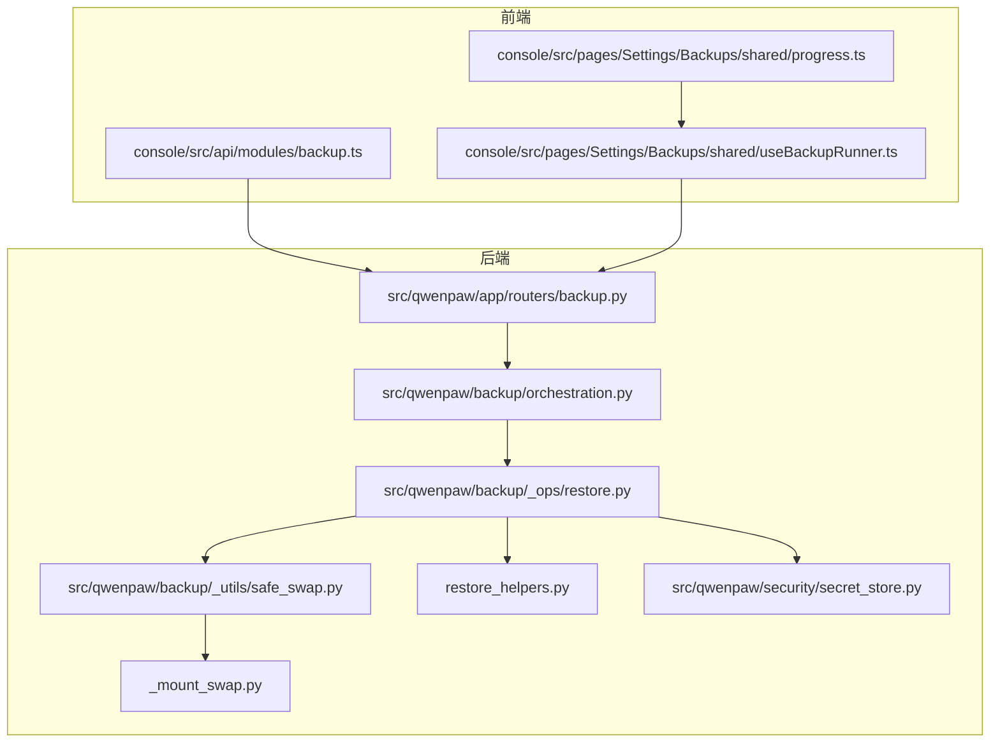
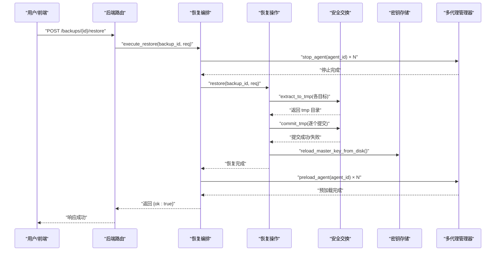
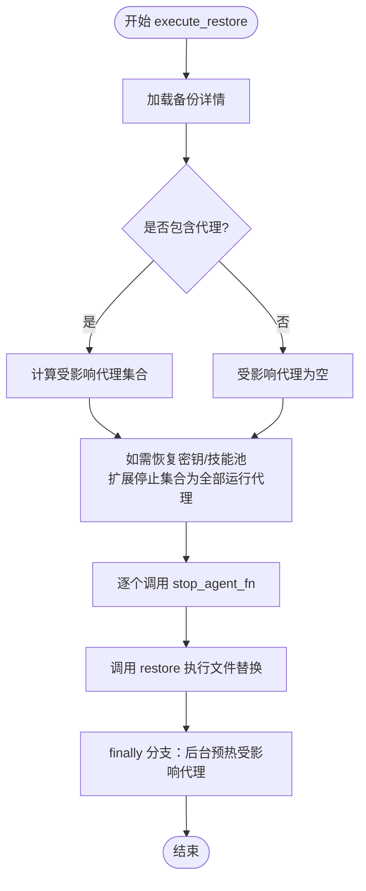
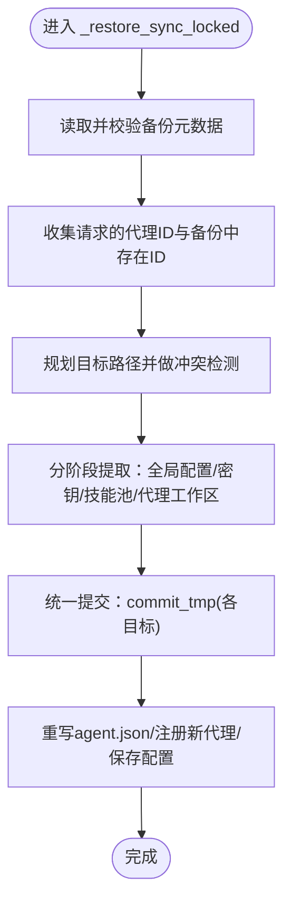
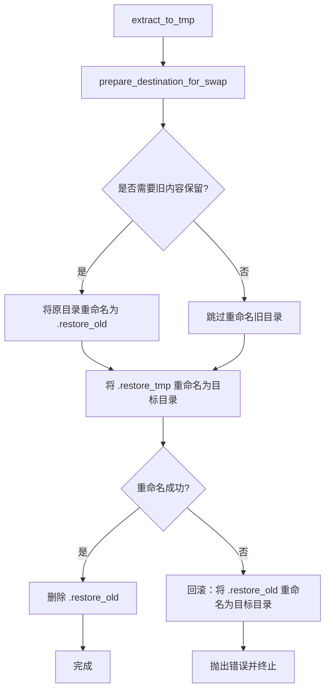
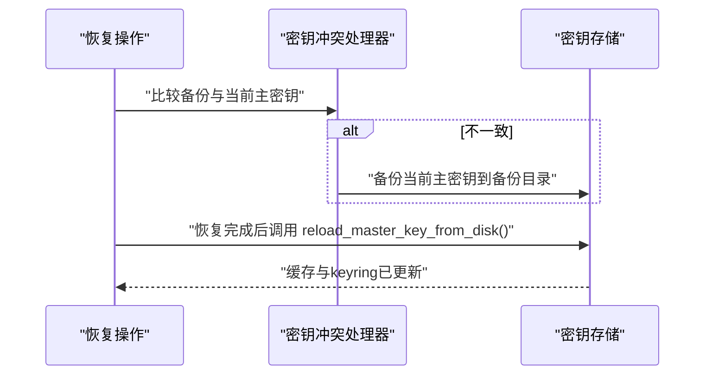
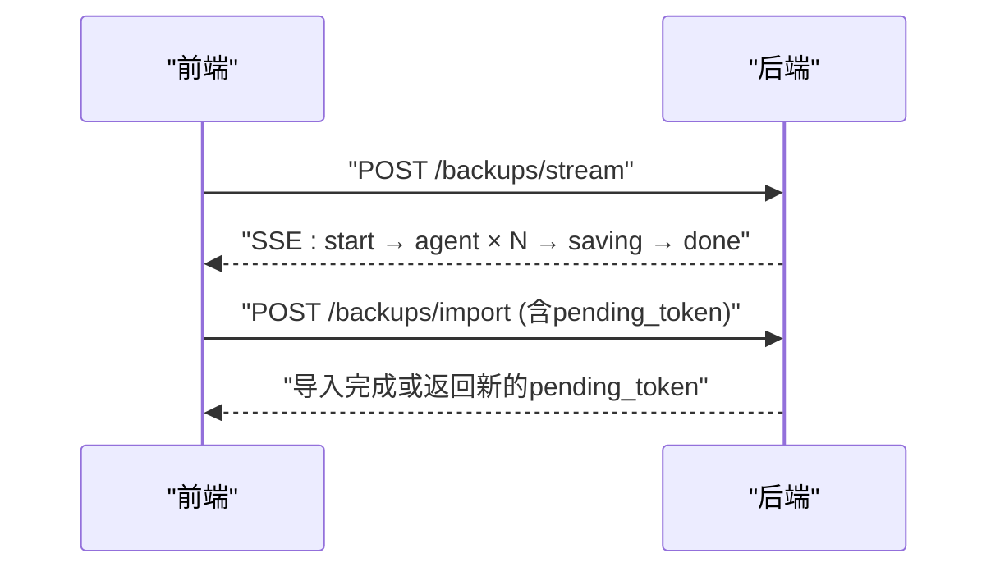
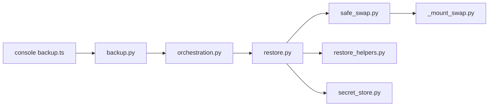

# 恢复机制

<cite>
**本文引用的文件**
- [src/qwenpaw/backup/orchestration.py](file://src/qwenpaw/backup/orchestration.py)
- [src/qwenpaw/backup/_ops/restore.py](file://src/qwenpaw/backup/_ops/restore.py)
- [src/qwenpaw/backup/_ops/restore_helpers.py](file://src/qwenpaw/backup/_ops/restore_helpers.py)
- [src/qwenpaw/backup/_utils/safe_swap.py](file://src/qwenpaw/backup/_utils/safe_swap.py)
- [src/qwenpaw/backup/_utils/_mount_swap.py](file://src/qwenpaw/backup/_utils/_mount_swap.py)
- [src/qwenpaw/backup/_ops/create.py](file://src/qwenpaw/backup/_ops/create.py)
- [src/qwenpaw/backup/models.py](file://src/qwenpaw/backup/models.py)
- [src/qwenpaw/app/routers/backup.py](file://src/qwenpaw/app/routers/backup.py)
- [src/qwenpaw/backup/_utils/constants.py](file://src/qwenpaw/backup/_utils/constants.py)
- [src/qwenpaw/backup/_utils/meta.py](file://src/qwenpaw/backup/_utils/meta.py)
- [src/qwenpaw/security/secret_store.py](file://src/qwenpaw/security/secret_store.py)
- [console/src/api/modules/backup.ts](file://console/src/api/modules/backup.ts)
- [console/src/pages/Settings/Backups/shared/progress.ts](file://console/src/pages/Settings/Backups/shared/progress.ts)
- [console/src/pages/Settings/Backups/shared/useBackupRunner.ts](file://console/src/pages/Settings/Backups/shared/useBackupRunner.ts)
</cite>

## 目录
1. [简介](#简介)
2. [项目结构](#项目结构)
3. [核心组件](#核心组件)
4. [架构总览](#架构总览)
5. [详细组件分析](#详细组件分析)
6. [依赖分析](#依赖分析)
7. [性能考虑](#性能考虑)
8. [故障排查指南](#故障排查指南)
9. [结论](#结论)
10. [附录](#附录)

## 简介
本文件系统化阐述 QwenPaw 的系统恢复机制，覆盖从“停止服务 → 文件替换 → 重启服务”的原子性保障、数据一致性校验、依赖关系处理与冲突解决策略；同时解释恢复过程中的权限控制、安全验证与访问权限重建；并提供恢复进度监控、状态回滚与失败恢复的容错机制，以及恢复验证测试、数据完整性检查与系统健康检查的完整流程。

## 项目结构
围绕备份与恢复的关键模块分布如下：
- 后端路由与接口：FastAPI 路由器负责接收恢复请求、触发恢复编排，并返回进度事件或结果。
- 恢复编排层：协调停止/重启代理、执行文件替换、最终重启受影响的代理。
- 恢复操作层：解析备份、规划目标路径、分阶段提取与提交、处理密钥冲突与配置合并。
- 安全交换工具：提供跨平台、可回滚的目录级原子替换（.restore_tmp/.restore_old）。
- 前端备份 API 与进度 UI：通过 SSE 推送恢复进度，支持取消与重试。

图表来源
- [src/qwenpaw/app/routers/backup.py:230-256](file://src/qwenpaw/app/routers/backup.py#L230-L256)
- [src/qwenpaw/backup/orchestration.py:44-147](file://src/qwenpaw/backup/orchestration.py#L44-L147)
- [src/qwenpaw/backup/_ops/restore.py:50-418](file://src/qwenpaw/backup/_ops/restore.py#L50-L418)
- [src/qwenpaw/backup/_utils/safe_swap.py:1-442](file://src/qwenpaw/backup/_utils/safe_swap.py#L1-L442)
- [src/qwenpaw/backup/_utils/_mount_swap.py:168-258](file://src/qwenpaw/backup/_utils/_mount_swap.py#L168-L258)
- [src/qwenpaw/backup/_ops/restore_helpers.py:1-159](file://src/qwenpaw/backup/_ops/restore_helpers.py#L1-L159)
- [src/qwenpaw/security/secret_store.py:329-370](file://src/qwenpaw/security/secret_store.py#L329-L370)
- [console/src/api/modules/backup.ts:1-39](file://console/src/api/modules/backup.ts#L1-L39)
- [console/src/pages/Settings/Backups/shared/progress.ts:1-34](file://console/src/pages/Settings/Backups/shared/progress.ts#L1-L34)
- [console/src/pages/Settings/Backups/shared/useBackupRunner.ts:1-40](file://console/src/pages/Settings/Backups/shared/useBackupRunner.ts#L1-L40)

章节来源
- [src/qwenpaw/app/routers/backup.py:1-275](file://src/qwenpaw/app/routers/backup.py#L1-L275)
- [src/qwenpaw/backup/orchestration.py:1-147](file://src/qwenpaw/backup/orchestration.py#L1-L147)
- [src/qwenpaw/backup/_ops/restore.py:1-567](file://src/qwenpaw/backup/_ops/restore.py#L1-L567)
- [src/qwenpaw/backup/_utils/safe_swap.py:1-442](file://src/qwenpaw/backup/_utils/safe_swap.py#L1-L442)
- [src/qwenpaw/backup/_utils/_mount_swap.py:168-258](file://src/qwenpaw/backup/_utils/_mount_swap.py#L168-L258)
- [src/qwenpaw/backup/_ops/restore_helpers.py:1-159](file://src/qwenpaw/backup/_ops/restore_helpers.py#L1-L159)
- [src/qwenpaw/security/secret_store.py:1-414](file://src/qwenpaw/security/secret_store.py#L1-L414)
- [console/src/api/modules/backup.ts:1-39](file://console/src/api/modules/backup.ts#L1-L39)
- [console/src/pages/Settings/Backups/shared/progress.ts:1-34](file://console/src/pages/Settings/Backups/shared/progress.ts#L1-L34)
- [console/src/pages/Settings/Backups/shared/useBackupRunner.ts:1-40](file://console/src/pages/Settings/Backups/shared/useBackupRunner.ts#L1-L40)

## 核心组件
- 恢复编排 execute_restore：定义“停止代理 → 执行恢复 → 重启代理”的三段式流程，确保在失败时也能尽力重启，避免服务长期不可用。
- 恢复操作 restore：解析备份、收集目标、规划路径、分阶段提取与提交、处理密钥冲突与配置合并。
- 安全交换 safe_swap：提供跨平台的三阶段原子替换（tmp → old → live），并在失败时自动回滚，保证目录级一致性。
- 前端备份 API 与进度：通过 SSE 流推送恢复进度事件，支持取消与重试，UI 将事件映射为百分比与状态消息。
- 密钥与安全：在恢复密钥不一致时进行备份与保留，恢复后刷新主密钥缓存，确保凭据解密连续性。

章节来源
- [src/qwenpaw/backup/orchestration.py:44-147](file://src/qwenpaw/backup/orchestration.py#L44-L147)
- [src/qwenpaw/backup/_ops/restore.py:50-418](file://src/qwenpaw/backup/_ops/restore.py#L50-L418)
- [src/qwenpaw/backup/_utils/safe_swap.py:1-442](file://src/qwenpaw/backup/_utils/safe_swap.py#L1-L442)
- [console/src/api/modules/backup.ts:19-39](file://console/src/api/modules/backup.ts#L19-L39)
- [console/src/pages/Settings/Backups/shared/progress.ts:12-34](file://console/src/pages/Settings/Backups/shared/progress.ts#L12-L34)
- [src/qwenpaw/security/secret_store.py:329-370](file://src/qwenpaw/security/secret_store.py#L329-L370)

## 架构总览
下图展示从用户触发到恢复完成的端到端流程，包括权限与安全验证、原子替换与回滚、以及代理生命周期管理。

图表来源
- [src/qwenpaw/app/routers/backup.py:230-256](file://src/qwenpaw/app/routers/backup.py#L230-L256)
- [src/qwenpaw/backup/orchestration.py:44-147](file://src/qwenpaw/backup/orchestration.py#L44-L147)
- [src/qwenpaw/backup/_ops/restore.py:361-418](file://src/qwenpaw/backup/_ops/restore.py#L361-L418)
- [src/qwenpaw/backup/_utils/safe_swap.py:410-425](file://src/qwenpaw/backup/_utils/safe_swap.py#L410-L425)
- [src/qwenpaw/security/secret_store.py:329-370](file://src/qwenpaw/security/secret_store.py#L329-L370)

## 详细组件分析

### 组件一：恢复编排 execute_restore
- 设计要点
  - 明确三段式流程：停止受影响代理 → 执行恢复 → 重启代理。
  - 对 include_secrets/include_skill_pool 的场景，扩展停止集合以释放文件句柄，避免 Windows 下目录重命名失败。
  - 失败时仍尝试后台重启，确保服务尽快可用。
- 关键行为
  - 收集受影响代理与运行中代理，统一纳入停止集合。
  - 调用 stop_agent_fn 阻止文件句柄持有导致的原子替换失败。
  - 调用 restore 完成文件替换，随后通过 preload_agent_fn 进行后台预热。
- 错误处理
  - 恢复异常会记录日志并向上抛出，由上层路由转换为 HTTP 500。
  - finally 分支保证即使失败也尽量重启代理，降低停机风险。

图表来源
- [src/qwenpaw/backup/orchestration.py:85-147](file://src/qwenpaw/backup/orchestration.py#L85-L147)

章节来源
- [src/qwenpaw/backup/orchestration.py:44-147](file://src/qwenpaw/backup/orchestration.py#L44-L147)

### 组件二：恢复操作 restore 与阶段化流程
- 版本与范围校验
  - 读取备份元数据，校验版本兼容性。
  - 根据请求范围决定是否包含代理工作区、全局配置、密钥与技能池。
- 目标规划与冲突检测
  - 计算每个代理的目标工作区路径，避免物理路径冲突与覆盖非目标代理的工作区。
  - 新增代理时，若默认工作区与现有代理工作区冲突则报错。
- 分阶段提取与提交
  - 全局配置：full 模式整包替换，custom 模式仅合并顶层键，agents.profiles 仅对实际恢复的代理进行覆盖。
  - 密钥与技能池：按需提取至临时目录，再统一提交。
  - 代理工作区：按代理逐一提取至临时目录，统一提交。
- 提交与收尾
  - 提交全局配置与各目标目录，必要时重写 agent.json 中的 workspace_dir。
  - 若涉及密钥目录，刷新主密钥缓存以适配新密钥。
  - 更新配置并持久化，记录恢复完成日志。

图表来源
- [src/qwenpaw/backup/_ops/restore.py:361-418](file://src/qwenpaw/backup/_ops/restore.py#L361-L418)
- [src/qwenpaw/backup/_ops/restore.py:468-567](file://src/qwenpaw/backup/_ops/restore.py#L468-L567)

章节来源
- [src/qwenpaw/backup/_ops/restore.py:50-418](file://src/qwenpaw/backup/_ops/restore.py#L50-L418)
- [src/qwenpaw/backup/_ops/restore_helpers.py:35-109](file://src/qwenpaw/backup/_ops/restore_helpers.py#L35-L109)

### 组件三：安全交换 safe_swap 与回滚
- 三阶段协议
  - 阶段1：将内容提取到同级 .restore_tmp。
  - 阶段2：将原目录重命名为 .restore_old，再将 .restore_tmp 重命名为目标目录；若第二步失败则回滚到 .restore_old。
  - 阶段3：删除 .restore_old。
- 并发与进程锁
  - 每个目标目录有独立线程锁，防止并发交错操作。
  - 进程级文件锁用于串行化恢复与清理，避免多个进程同时操作。
- 启动时清理
  - 应用启动前扫描可能的残留 artifacts 并恢复或清理，确保系统处于一致状态。

图表来源
- [src/qwenpaw/backup/_utils/safe_swap.py:324-368](file://src/qwenpaw/backup/_utils/safe_swap.py#L324-L368)
- [src/qwenpaw/backup/_utils/_mount_swap.py:168-258](file://src/qwenpaw/backup/_utils/_mount_swap.py#L168-L258)

章节来源
- [src/qwenpaw/backup/_utils/safe_swap.py:1-442](file://src/qwenpaw/backup/_utils/safe_swap.py#L1-L442)
- [src/qwenpaw/backup/_utils/_mount_swap.py:168-258](file://src/qwenpaw/backup/_utils/_mount_swap.py#L168-L258)

### 组件四：密钥与安全验证
- 主密钥冲突处理
  - 当备份中的主密钥与当前不同，先将当前密钥备份到备份目录，再进行恢复，确保历史凭据仍可解密。
- 主密钥缓存刷新
  - 恢复密钥目录后，调用 reload_master_key_from_disk 刷新进程内缓存与 OS keyring，保证后续解密使用新密钥。
- 前端安全设置
  - 前端安全页提供工具守卫、规则预览、文件保护等能力，配合后端安全策略共同保障恢复后的访问控制。

图表来源
- [src/qwenpaw/backup/_ops/restore_helpers.py:111-159](file://src/qwenpaw/backup/_ops/restore_helpers.py#L111-L159)
- [src/qwenpaw/security/secret_store.py:329-370](file://src/qwenpaw/security/secret_store.py#L329-L370)

章节来源
- [src/qwenpaw/backup/_ops/restore_helpers.py:111-159](file://src/qwenpaw/backup/_ops/restore_helpers.py#L111-L159)
- [src/qwenpaw/security/secret_store.py:329-370](file://src/qwenpaw/security/secret_store.py#L329-L370)

### 组件五：前端进度监控与交互
- SSE 进度事件
  - 后端通过 create_stream 生成 start/agent/saving/done/error 事件，前端消费并映射为进度条与状态文本。
- 取消与重试
  - 用户可取消备份/恢复任务；导入备份遇到冲突时，后端返回 pending_token，前端可凭此重试覆盖导入。
- UI 协作
  - useBackupRunner 统一管理 loading/progress/cancel/reset，progress.ts 将事件转为 UI 状态。

图表来源
- [console/src/api/modules/backup.ts:19-39](file://console/src/api/modules/backup.ts#L19-L39)
- [console/src/pages/Settings/Backups/shared/progress.ts:12-34](file://console/src/pages/Settings/Backups/shared/progress.ts#L12-L34)
- [console/src/pages/Settings/Backups/shared/useBackupRunner.ts:24-40](file://console/src/pages/Settings/Backups/shared/useBackupRunner.ts#L24-L40)
- [src/qwenpaw/app/routers/backup.py:108-137](file://src/qwenpaw/app/routers/backup.py#L108-L137)

章节来源
- [console/src/api/modules/backup.ts:1-39](file://console/src/api/modules/backup.ts#L1-L39)
- [console/src/pages/Settings/Backups/shared/progress.ts:1-34](file://console/src/pages/Settings/Backups/shared/progress.ts#L1-L34)
- [console/src/pages/Settings/Backups/shared/useBackupRunner.ts:1-40](file://console/src/pages/Settings/Backups/shared/useBackupRunner.ts#L1-L40)
- [src/qwenpaw/app/routers/backup.py:108-137](file://src/qwenpaw/app/routers/backup.py#L108-L137)

## 依赖分析
- 模块耦合
  - 路由器依赖编排层，编排层依赖恢复操作层，恢复操作层依赖安全交换与辅助函数。
  - 安全交换与挂载交换相互协作，确保跨平台一致性。
- 外部依赖
  - 文件系统与进程锁（fcntl/msvcrt）、zip 解压、Fernet 加密（密钥存储）。
- 循环依赖
  - 未发现直接循环依赖；常量与元数据模块被多处引用但保持单向依赖。

图表来源
- [src/qwenpaw/app/routers/backup.py:15-23](file://src/qwenpaw/app/routers/backup.py#L15-L23)
- [src/qwenpaw/backup/orchestration.py:13-15](file://src/qwenpaw/backup/orchestration.py#L13-L15)
- [src/qwenpaw/backup/_ops/restore.py:13-38](file://src/qwenpaw/backup/_ops/restore.py#L13-L38)
- [src/qwenpaw/backup/_utils/safe_swap.py:53-58](file://src/qwenpaw/backup/_utils/safe_swap.py#L53-L58)
- [src/qwenpaw/backup/_ops/restore_helpers.py:16-17](file://src/qwenpaw/backup/_ops/restore_helpers.py#L16-L17)
- [src/qwenpaw/security/secret_store.py:24-32](file://src/qwenpaw/security/secret_store.py#L24-L32)
- [console/src/api/modules/backup.ts:1-12](file://console/src/api/modules/backup.ts#L1-L12)

章节来源
- [src/qwenpaw/app/routers/backup.py:1-37](file://src/qwenpaw/app/routers/backup.py#L1-L37)
- [src/qwenpaw/backup/orchestration.py:1-21](file://src/qwenpaw/backup/orchestration.py#L1-L21)
- [src/qwenpaw/backup/_ops/restore.py:1-38](file://src/qwenpaw/backup/_ops/restore.py#L1-L38)
- [src/qwenpaw/backup/_utils/safe_swap.py:1-58](file://src/qwenpaw/backup/_utils/safe_swap.py#L1-L58)
- [src/qwenpaw/backup/_ops/restore_helpers.py:1-17](file://src/qwenpaw/backup/_ops/restore_helpers.py#L1-L17)
- [src/qwenpaw/security/secret_store.py:1-32](file://src/qwenpaw/security/secret_store.py#L1-L32)
- [console/src/api/modules/backup.ts:1-12](file://console/src/api/modules/backup.ts#L1-L12)

## 性能考虑
- 异步与线程隔离
  - 恢复创建采用异步事件流与后台线程压缩，避免阻塞事件循环。
- 并发控制
  - 使用 per-destination 线程锁与进程级文件锁，避免并发交错导致的数据损坏。
- I/O 优化
  - 采用“tmp → 目标”原子替换，减少多次小写入带来的磁盘抖动。
- Windows 兼容
  - 在涉及密钥与技能池时扩大停止集合，避免打开句柄导致的目录重命名失败，提升成功率。

## 故障排查指南
- 常见问题与定位
  - “备份不存在/找不到”：检查备份 ID 与文件是否存在，确认元数据读取正常。
  - “恢复失败/部分提交”：查看提交阶段日志，确认是否有目录重命名失败并触发回滚。
  - “密钥不一致/凭据无法解密”：确认是否触发了主密钥备份与刷新流程。
  - “代理无法重启/预热失败”：检查后台预热任务日志，确认多代理管理器可用。
- 容错与回滚
  - 安全交换在提交失败时自动回滚到旧内容，确保目录一致性。
  - 编排层在异常时仍尝试重启代理，降低停机时间。
- 前端交互
  - 使用 pending_token 重试导入覆盖；利用 SSE 进度事件判断卡顿点。

章节来源
- [src/qwenpaw/app/routers/backup.py:230-256](file://src/qwenpaw/app/routers/backup.py#L230-L256)
- [src/qwenpaw/backup/_utils/safe_swap.py:324-368](file://src/qwenpaw/backup/_utils/safe_swap.py#L324-L368)
- [src/qwenpaw/backup/orchestration.py:132-147](file://src/qwenpaw/backup/orchestration.py#L132-L147)

## 结论
QwenPaw 的恢复机制通过“停止服务 → 原子文件替换 → 重启服务”的三段式设计，结合跨平台安全交换、密钥冲突处理与后台预热，实现了高可靠与低停机的系统恢复。前端通过 SSE 实时反馈进度，配合 pending_token 与取消能力，提供了良好的用户体验。整体方案在数据一致性、依赖关系处理与冲突解决方面具备完善的容错与回滚策略。

## 附录
- 数据模型与范围
  - BackupScope/RestoreBackupRequest 定义了可恢复范围与模式（full/custom），确保选择性恢复与配置合并的安全性。
- 元数据与常量
  - 备份 ID 生成、系统信息采集与 zip 内部路径前缀常量，保证跨环境可移植性与一致性。

章节来源
- [src/qwenpaw/backup/models.py:13-108](file://src/qwenpaw/backup/models.py#L13-L108)
- [src/qwenpaw/backup/_utils/constants.py:10-38](file://src/qwenpaw/backup/_utils/constants.py#L10-L38)
- [src/qwenpaw/backup/_utils/meta.py:24-61](file://src/qwenpaw/backup/_utils/meta.py#L24-L61)