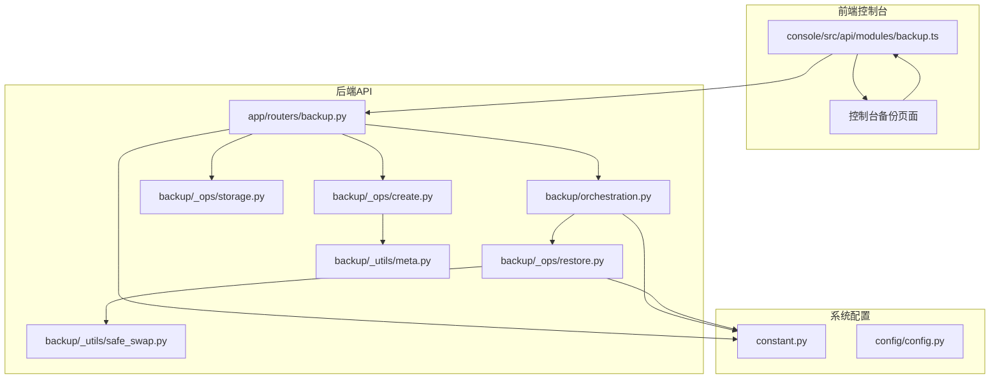
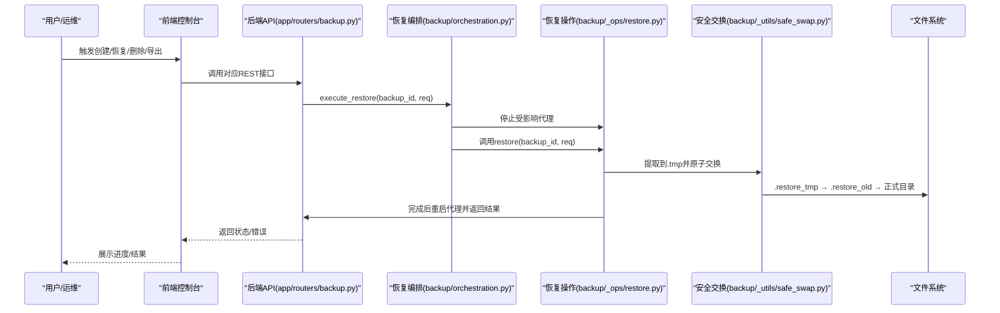
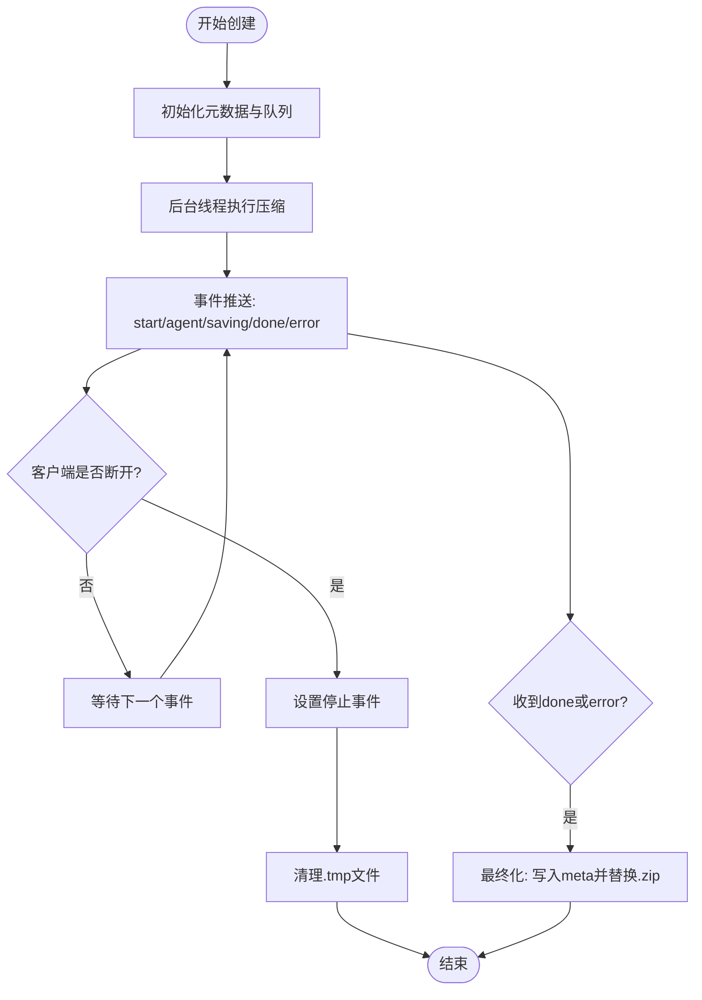
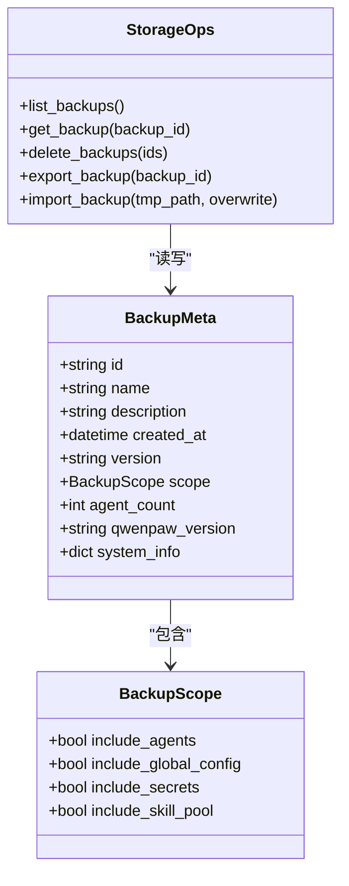
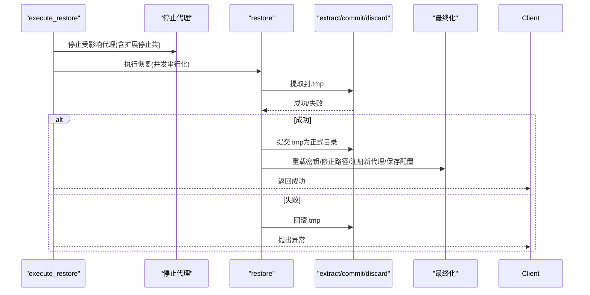
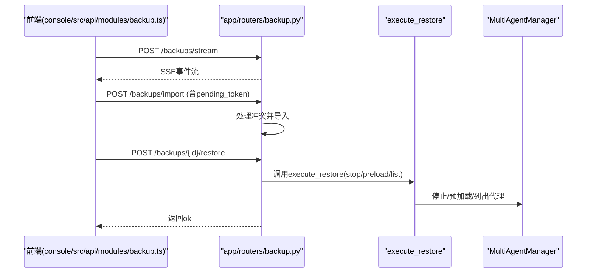
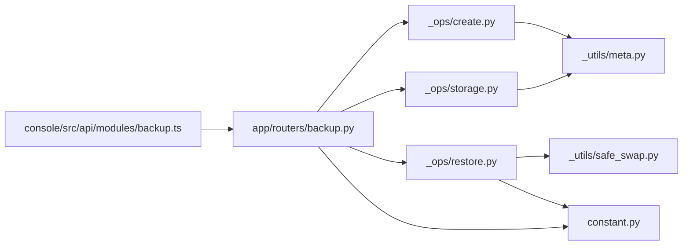

# 灾难恢复预案

<cite>
**本文档引用的文件**
- [backup/__init__.py](file://src/qwenpaw/backup/__init__.py)
- [backup/orchestration.py](file://src/qwenpaw/backup/orchestration.py)
- [backup/models.py](file://src/qwenpaw/backup/models.py)
- [backup/_ops/create.py](file://src/qwenpaw/backup/_ops/create.py)
- [backup/_ops/restore.py](file://src/qwenpaw/backup/_ops/restore.py)
- [backup/_ops/storage.py](file://src/qwenpaw/backup/_ops/storage.py)
- [backup/_utils/meta.py](file://src/qwenpaw/backup/_utils/meta.py)
- [backup/_utils/safe_swap.py](file://src/qwenpaw/backup/_utils/safe_swap.py)
- [app/routers/backup.py](file://src/qwenpaw/app/routers/backup.py)
- [constant.py](file://src/qwenpaw/constant.py)
- [config/config.py](file://src/qwenpaw/config/config.py)
- [app/crons/heartbeat.py](file://src/qwenpaw/app/crons/heartbeat.py)
- [app/utils.py](file://src/qwenpaw/app/utils.py)
- [cli/doctor_cmd.py](file://src/qwenpaw/cli/doctor_cmd.py)
- [console/src/api/modules/backup.ts](file://console/src/api/modules/backup.ts)
</cite>

## 目录
1. [简介](#简介)
2. [项目结构](#项目结构)
3. [核心组件](#核心组件)
4. [架构总览](#架构总览)
5. [详细组件分析](#详细组件分析)
6. [依赖关系分析](#依赖关系分析)
7. [性能考虑](#性能考虑)
8. [故障排查指南](#故障排查指南)
9. [结论](#结论)
10. [附录](#附录)

## 简介
本预案面向QwenPaw系统，基于其内置的备份与恢复能力，构建一套可执行、可验证的灾难恢复流程与策略。内容涵盖：故障检测与影响评估、恢复优先级、数据修复与系统重建、恢复时间目标（RTO）与恢复点目标（RPO）设定、多地点备份与异地容灾设计、高可用架构建议、恢复资源准备、人员职责与沟通机制、恢复演练与持续改进。

## 项目结构
QwenPaw的灾难恢复能力由后端Python模块与前端控制台共同组成：
- 后端提供备份创建、存储、导入导出、恢复编排与安全原子交换等能力
- 前端通过API模块调用后端接口，支持备份列表、创建流式进度、恢复、导出与删除
- 配置与常量定义了工作目录、备份目录、日志与环境变量等关键路径与参数

**图表来源**
- [app/routers/backup.py:1-275](file://src/qwenpaw/app/routers/backup.py#L1-L275)
- [backup/orchestration.py:1-147](file://src/qwenpaw/backup/orchestration.py#L1-L147)
- [backup/_ops/restore.py:1-567](file://src/qwenpaw/backup/_ops/restore.py#L1-L567)
- [backup/_ops/storage.py:1-242](file://src/qwenpaw/backup/_ops/storage.py#L1-L242)
- [backup/_ops/create.py:1-219](file://src/qwenpaw/backup/_ops/create.py#L1-L219)
- [backup/_utils/safe_swap.py:1-442](file://src/qwenpaw/backup/_utils/safe_swap.py#L1-L442)
- [backup/_utils/meta.py:1-61](file://src/qwenpaw/backup/_utils/meta.py#L1-L61)
- [constant.py:221-231](file://src/qwenpaw/constant.py#L221-L231)
- [console/src/api/modules/backup.ts:1-39](file://console/src/api/modules/backup.ts#L1-L39)

**章节来源**
- [app/routers/backup.py:1-275](file://src/qwenpaw/app/routers/backup.py#L1-L275)
- [backup/__init__.py:1-22](file://src/qwenpaw/backup/__init__.py#L1-L22)
- [constant.py:221-231](file://src/qwenpaw/constant.py#L221-L231)

## 核心组件
- 备份创建与流式进度：异步压缩、后台线程事件推送、原子写入与取消处理
- 备份存储与元数据：列表、详情、删除、导入导出、冲突检测
- 恢复编排与原子交换：停止受影响代理、阶段化提取、原子替换、回滚与最终化
- 安全原子交换：三段式临时目录交换、清理陈旧工件、进程锁与并发保护
- API路由与前端交互：SSE进度流、导入冲突令牌、恢复编排调用
- 系统常量与配置：工作目录、备份目录、配置文件、心跳与通道健康检查

**章节来源**
- [backup/_ops/create.py:21-219](file://src/qwenpaw/backup/_ops/create.py#L21-L219)
- [backup/_ops/storage.py:29-242](file://src/qwenpaw/backup/_ops/storage.py#L29-L242)
- [backup/_ops/restore.py:50-567](file://src/qwenpaw/backup/_ops/restore.py#L50-L567)
- [backup/_utils/safe_swap.py:1-442](file://src/qwenpaw/backup/_utils/safe_swap.py#L1-L442)
- [app/routers/backup.py:65-275](file://src/qwenpaw/app/routers/backup.py#L65-L275)
- [constant.py:93-231](file://src/qwenpaw/constant.py#L93-L231)

## 架构总览
灾难恢复以“备份-存储-恢复”为核心闭环，并通过心跳与通道健康检查实现故障早期发现与影响评估。

**图表来源**
- [app/routers/backup.py:230-255](file://src/qwenpaw/app/routers/backup.py#L230-L255)
- [backup/orchestration.py:44-147](file://src/qwenpaw/backup/orchestration.py#L44-L147)
- [backup/_ops/restore.py:50-418](file://src/qwenpaw/backup/_ops/restore.py#L50-L418)
- [backup/_utils/safe_swap.py:381-425](file://src/qwenpaw/backup/_utils/safe_swap.py#L381-L425)

## 详细组件分析

### 组件A：备份创建与流式进度
- 异步生成器通过队列与线程协作，避免阻塞事件循环
- 进度事件类型包括开始、逐代理进度、保存元数据、完成与错误
- 原子写入：先写.tmp再替换.zip，支持客户端断开时清理

**图表来源**
- [backup/_ops/create.py:21-81](file://src/qwenpaw/backup/_ops/create.py#L21-L81)
- [backup/_ops/create.py:116-219](file://src/qwenpaw/backup/_ops/create.py#L116-L219)

**章节来源**
- [backup/_ops/create.py:21-219](file://src/qwenpaw/backup/_ops/create.py#L21-L219)

### 组件B：备份存储与元数据
- 列表：扫描备份目录，读取每个zip中的meta.json
- 详情：解析备份中各代理的文件数量与大小统计
- 删除：批量删除并记录失败项
- 导入/导出：校验zip与meta，冲突时返回待确认令牌
- 元数据：版本、系统信息、作用域、创建时间等

**图表来源**
- [backup/models.py:13-133](file://src/qwenpaw/backup/models.py#L13-L133)
- [backup/_ops/storage.py:29-242](file://src/qwenpaw/backup/_ops/storage.py#L29-L242)
- [backup/_utils/meta.py:49-61](file://src/qwenpaw/backup/_utils/meta.py#L49-L61)

**章节来源**
- [backup/_ops/storage.py:29-242](file://src/qwenpaw/backup/_ops/storage.py#L29-L242)
- [backup/models.py:13-133](file://src/qwenpaw/backup/models.py#L13-L133)
- [backup/_utils/meta.py:14-61](file://src/qwenpaw/backup/_utils/meta.py#L14-L61)

### 组件C：恢复编排与原子交换
- 编排：根据请求决定受影响代理集合；当恢复密钥或技能池时，扩展停止集以释放文件句柄
- 原子交换：三段式临时目录交换，失败自动回滚；并发通过进程锁与全局锁保护
- 最终化：重载主密钥、修正工作空间路径、注册新代理、保存配置

**图表来源**
- [backup/orchestration.py:44-147](file://src/qwenpaw/backup/orchestration.py#L44-L147)
- [backup/_ops/restore.py:50-418](file://src/qwenpaw/backup/_ops/restore.py#L50-L418)
- [backup/_utils/safe_swap.py:381-442](file://src/qwenpaw/backup/_utils/safe_swap.py#L381-L442)

**章节来源**
- [backup/orchestration.py:44-147](file://src/qwenpaw/backup/orchestration.py#L44-L147)
- [backup/_ops/restore.py:50-418](file://src/qwenpaw/backup/_ops/restore.py#L50-L418)
- [backup/_utils/safe_swap.py:1-442](file://src/qwenpaw/backup/_utils/safe_swap.py#L1-L442)

### 组件D：API路由与前端交互
- SSE流：/backups/stream返回事件流，前端逐条解析
- 导入冲突：返回现有备份元数据与待确认令牌，避免重复覆盖
- 恢复编排：调用execute_restore，传入代理管理器回调

**图表来源**
- [console/src/api/modules/backup.ts:19-39](file://console/src/api/modules/backup.ts#L19-L39)
- [app/routers/backup.py:65-275](file://src/qwenpaw/app/routers/backup.py#L65-L275)

**章节来源**
- [console/src/api/modules/backup.ts:1-39](file://console/src/api/modules/backup.ts#L1-L39)
- [app/routers/backup.py:65-275](file://src/qwenpaw/app/routers/backup.py#L65-L275)

### 组件E：系统常量与配置
- 工作目录与备份目录：通过环境变量与默认值组合，确保可移植性
- 配置文件与内存、模型、通道等配置：用于恢复后路径修正与服务启动

**章节来源**
- [constant.py:93-231](file://src/qwenpaw/constant.py#L93-L231)
- [config/config.py:1-200](file://src/qwenpaw/config/config.py#L1-L200)

## 依赖关系分析
- 模块内聚：备份子模块内部高度内聚，API路由薄封装，便于测试与演进
- 外部依赖：依赖zipfile、pathlib、asyncio、threading等标准库；通过常量统一路径
- 并发与锁：restore使用全局锁与进程锁，避免交叉文件操作导致的数据不一致

**图表来源**
- [backup/_ops/create.py:1-219](file://src/qwenpaw/backup/_ops/create.py#L1-L219)
- [backup/_ops/storage.py:1-242](file://src/qwenpaw/backup/_ops/storage.py#L1-L242)
- [backup/_ops/restore.py:1-567](file://src/qwenpaw/backup/_ops/restore.py#L1-L567)
- [backup/_utils/safe_swap.py:1-442](file://src/qwenpaw/backup/_utils/safe_swap.py#L1-L442)
- [app/routers/backup.py:1-275](file://src/qwenpaw/app/routers/backup.py#L1-L275)
- [console/src/api/modules/backup.ts:1-39](file://console/src/api/modules/backup.ts#L1-L39)

**章节来源**
- [backup/_ops/create.py:1-219](file://src/qwenpaw/backup/_ops/create.py#L1-L219)
- [backup/_ops/storage.py:1-242](file://src/qwenpaw/backup/_ops/storage.py#L1-L242)
- [backup/_ops/restore.py:1-567](file://src/qwenpaw/backup/_ops/restore.py#L1-L567)
- [backup/_utils/safe_swap.py:1-442](file://src/qwenpaw/backup/_utils/safe_swap.py#L1-L442)
- [app/routers/backup.py:1-275](file://src/qwenpaw/app/routers/backup.py#L1-L275)

## 性能考虑
- 压缩与I/O：压缩在后台线程进行，避免阻塞事件循环；采用分块写入与原子替换，减少磁盘碎片
- 并发控制：恢复过程通过全局锁与进程锁串行化，避免Windows下目录重命名失败
- 进度反馈：SSE事件粒度细，前端可实时展示进度，提升可观测性
- 资源占用：恢复前停止代理可降低文件句柄竞争，提高成功率与稳定性

[本节为通用指导，无需特定文件引用]

## 故障排查指南
- 常见问题定位
  - 备份创建中断：检查客户端断开信号、线程清理与.tmp文件
  - 恢复失败：查看原子交换阶段的日志与回滚行为
  - 导入冲突：使用pending_token重新提交覆盖导入
- 健康检查与诊断
  - 心跳与通道健康：通过心跳任务与通道健康接口快速判断运行状态
  - doctor命令：提供只读诊断与保守修复建议，辅助定位配置与权限问题

**章节来源**
- [backup/_ops/create.py:70-81](file://src/qwenpaw/backup/_ops/create.py#L70-L81)
- [backup/_ops/restore.py:325-337](file://src/qwenpaw/backup/_ops/restore.py#L325-L337)
- [app/routers/backup.py:108-137](file://src/qwenpaw/app/routers/backup.py#L108-L137)
- [app/crons/heartbeat.py:1-379](file://src/qwenpaw/app/crons/heartbeat.py#L1-L379)
- [cli/doctor_cmd.py:1-200](file://src/qwenpaw/cli/doctor_cmd.py#L1-L200)

## 结论
QwenPaw的灾难恢复体系以“可验证的备份-可编排的恢复-可审计的原子交换”为核心，结合前端SSE进度与后端严格锁机制，能够在复杂场景下保证数据一致性与系统可用性。建议在生产环境中配套制定RTO/RPO目标、多地点备份与异地容灾策略，并定期开展恢复演练与预案更新。

[本节为总结，无需特定文件引用]

## 附录

### 灾难场景分类与恢复优先级
- 数据中心级故障：优先恢复备份目录与工作目录，按代理重要性与业务影响排序
- 单机故障：优先恢复配置与密钥，再逐步恢复代理工作空间
- 误操作/破坏性变更：优先使用最近备份恢复，必要时启用“自定义模式”最小化影响范围

[本节为概念性内容，无需特定文件引用]

### RTO/RPO目标设定
- RPO：建议按业务容忍度设定，如“分钟级”或“小时级”，结合备份频率与增量策略
- RTO：建议结合恢复流程耗时与自动化程度，如“单机恢复不超过数小时”

[本节为概念性内容，无需特定文件引用]

### 多地点备份与异地容灾
- 本地+远程：本地定期备份，远程同步归档；跨地域保留多个副本
- 异地容灾：在不同可用区/城市部署热备节点，结合DNS/负载均衡切换

[本节为概念性内容，无需特定文件引用]

### 高可用架构建议
- 无状态API + 有状态数据分离：API可水平扩展，数据通过共享存储或对象存储
- 健康检查与自动切换：心跳与通道健康接口配合自动化运维工具
- 配置即代码：通过配置文件与脚本化流程固化恢复步骤

[本节为概念性内容，无需特定文件引用]

### 恢复资源准备与人员职责
- 资源清单：备份介质、恢复环境、网络与权限、文档与演练计划
- 职责分工：故障响应、数据恢复、系统重建、验证与回切、沟通与记录
- 沟通机制：分级通知、状态更新、变更审批与复盘

[本节为概念性内容，无需特定文件引用]

### 恢复演练与持续改进
- 计划：制定年度/季度演练计划，覆盖不同场景与角色
- 执行：记录演练过程、耗时与问题，形成问题清单
- 更新：根据演练结果修订预案、工具与培训材料
- 复盘：形成复盘报告，纳入知识库与培训课程

[本节为概念性内容，无需特定文件引用]