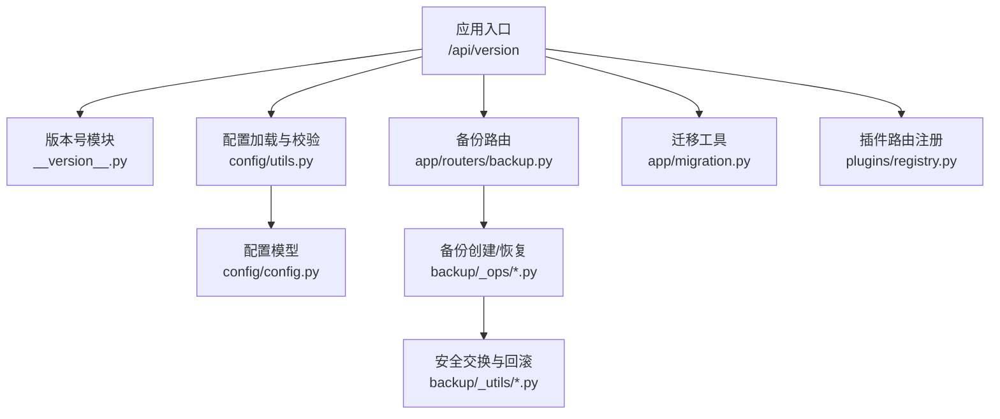
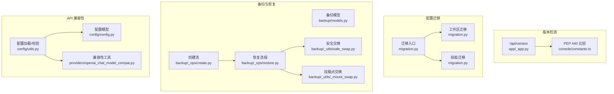
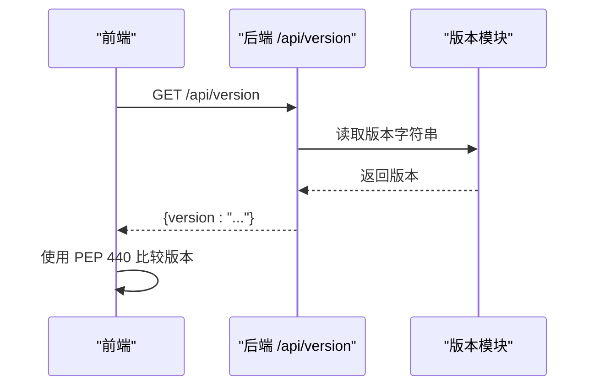
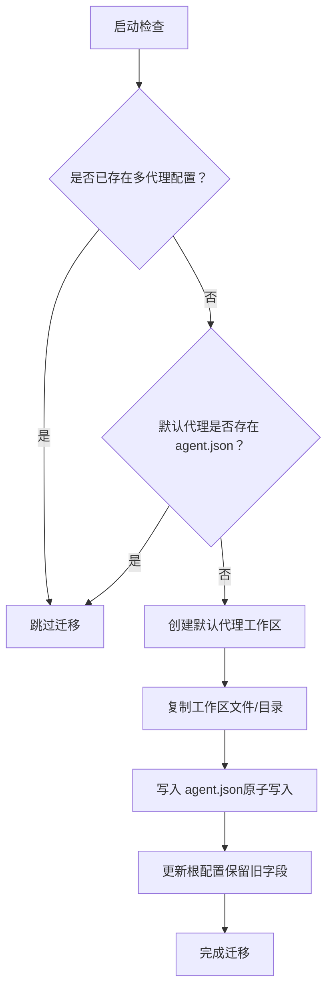
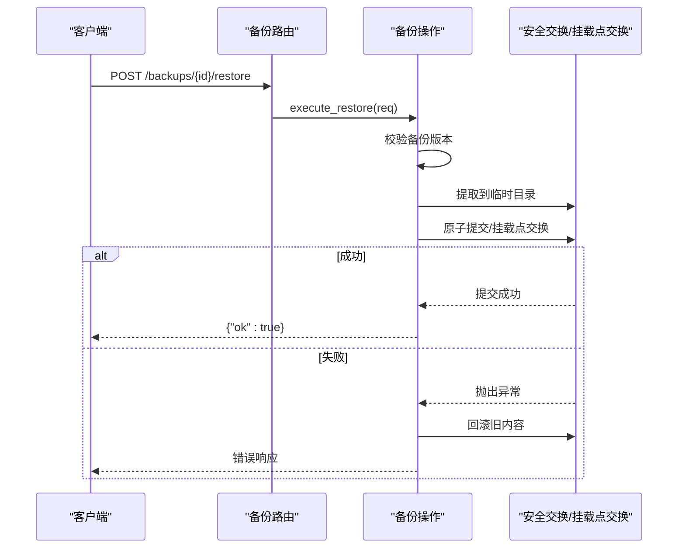
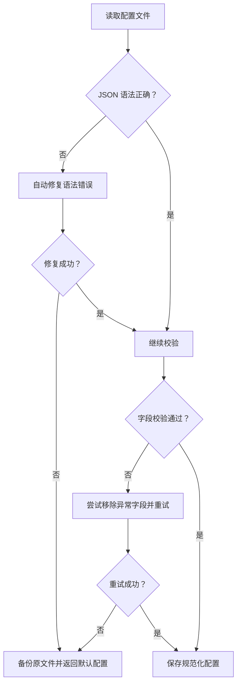
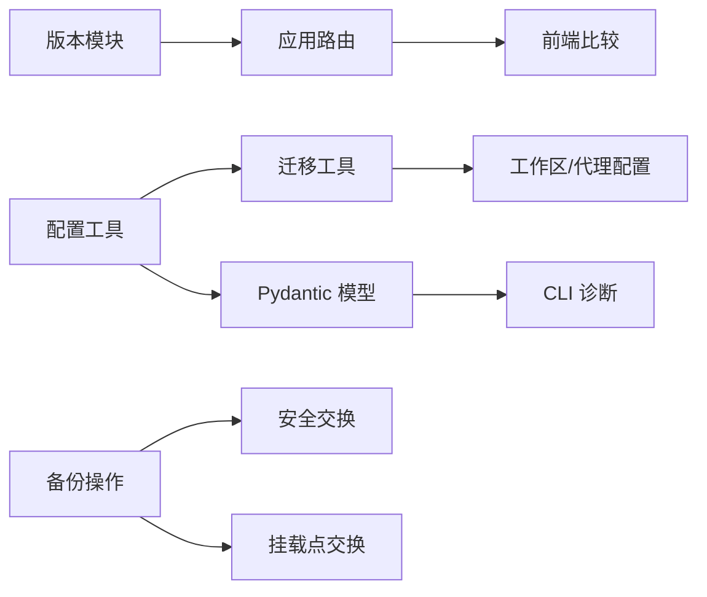
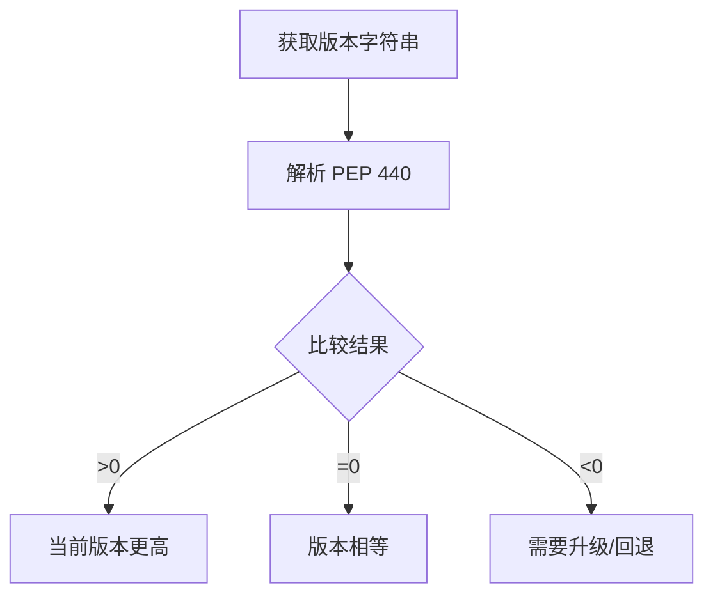

# 跨版本兼容性

<cite>
**本文引用的文件**
- [src/qwenpaw/__version__.py](file://src/qwenpaw/__version__.py)
- [src/qwenpaw/app/migration.py](file://src/qwenpaw/app/migration.py)
- [src/qwenpaw/backup/models.py](file://src/qwenpaw/backup/models.py)
- [src/qwenpaw/backup/_ops/create.py](file://src/qwenpaw/backup/_ops/create.py)
- [src/qwenpaw/backup/_ops/restore.py](file://src/qwenpaw/backup/_ops/restore.py)
- [src/qwenpaw/backup/_utils/_mount_swap.py](file://src/qwenpaw/backup/_utils/_mount_swap.py)
- [src/qwenpaw/backup/_utils/safe_swap.py](file://src/qwenpaw/backup/_utils/safe_swap.py)
- [src/qwenpaw/backup/__init__.py](file://src/qwenpaw/backup/__init__.py)
- [src/qwenpaw/app/routers/backup.py](file://src/qwenpaw/app/routers/backup.py)
- [src/qwenpaw/config/config.py](file://src/qwenpaw/config/config.py)
- [src/qwenpaw/config/utils.py](file://src/qwenpaw/config/utils.py)
- [src/qwenpaw/app/_app.py](file://src/qwenpaw/app/_app.py)
- [src/qwenpaw/providers/openai_chat_model_compat.py](file://src/qwenpaw/providers/openai_chat_model_compat.py)
- [src/qwenpaw/cli/doctor_checks.py](file://src/qwenpaw/cli/doctor_checks.py)
- [src/qwenpaw/plugins/registry.py](file://src/qwenpaw/plugins/registry.py)
- [console/src/layouts/constants.ts](file://console/src/layouts/constants.ts)
- [tests/integration/test_version.py](file://tests/integration/test_version.py)
- [tests/unit/backup/test_safe_swap.py](file://tests/unit/backup/test_safe_swap.py)
</cite>

## 目录
1. [简介](#简介)
2. [项目结构](#项目结构)
3. [核心组件](#核心组件)
4. [架构总览](#架构总览)
5. [详细组件分析](#详细组件分析)
6. [依赖分析](#依赖分析)
7. [性能考虑](#性能考虑)
8. [故障排查指南](#故障排查指南)
9. [结论](#结论)
10. [附录](#附录)

## 简介
本文件系统化阐述 QwenPaw 的跨版本兼容性设计与实现，覆盖版本检测机制、兼容性矩阵、迁移路径与策略、备份文件格式演进与向后兼容、API 兼容性处理、版本回退与降级恢复、以及兼容性测试流程。重点围绕“配置迁移”“备份/恢复”“版本号与比较”“API 兼容性”等主题展开，帮助开发者与运维人员在升级、回滚与维护过程中保持数据与行为稳定。

## 项目结构
- 版本号与版本检测：通过应用入口暴露版本接口，并在前端进行版本比较。
- 配置与迁移：提供从单代理到多代理结构的迁移工具，确保历史数据平滑过渡。
- 备份与恢复：定义备份元数据模型与版本约束，提供安全的原子化恢复流程。
- API 兼容性：通过 Pydantic 模型与校验器保证配置字段的向前/向后兼容。
- 插件与路由：插件前缀注册与路由组织，避免冲突并保障 API 可扩展性。

**图表来源**
- [src/qwenpaw/app/_app.py:629-634](file://src/qwenpaw/app/_app.py#L629-L634)
- [src/qwenpaw/config/utils.py:586-604](file://src/qwenpaw/config/utils.py#L586-L604)
- [src/qwenpaw/config/config.py:1-200](file://src/qwenpaw/config/config.py#L1-L200)
- [src/qwenpaw/app/routers/backup.py:1-275](file://src/qwenpaw/app/routers/backup.py#L1-L275)
- [src/qwenpaw/backup/_ops/create.py:1-219](file://src/qwenpaw/backup/_ops/create.py#L1-L219)
- [src/qwenpaw/backup/_ops/restore.py:1-567](file://src/qwenpaw/backup/_ops/restore.py#L1-L567)
- [src/qwenpaw/backup/_utils/_mount_swap.py:133-258](file://src/qwenpaw/backup/_utils/_mount_swap.py#L133-L258)
- [src/qwenpaw/app/migration.py:1-889](file://src/qwenpaw/app/migration.py#L1-L889)
- [src/qwenpaw/plugins/registry.py:170-258](file://src/qwenpaw/plugins/registry.py#L170-L258)

**章节来源**
- [src/qwenpaw/app/_app.py:629-634](file://src/qwenpaw/app/_app.py#L629-L634)
- [src/qwenpaw/config/utils.py:586-604](file://src/qwenpaw/config/utils.py#L586-L604)
- [src/qwenpaw/app/routers/backup.py:1-275](file://src/qwenpaw/app/routers/backup.py#L1-L275)

## 核心组件
- 版本检测与比较
  - 应用提供 /api/version 接口返回当前版本字符串；前端使用 PEP 440 规范比较版本，支持预发布与 post 修订版排序。
- 配置迁移
  - 将旧版单代理工作区迁移到新的多代理结构，保留必要字段以兼容降级场景；迁移技能布局到统一工作区目录。
- 备份与恢复
  - 定义备份元数据模型与版本约束（当前支持版本 1），提供原子化恢复与挂载点内容交换，确保失败可回滚。
- API 兼容性
  - 使用 Pydantic 模型与字段校验器，自动修复与清理异常字段，避免因字段变更导致的破坏性升级。
- 插件路由
  - 统一注册插件 HTTP 前缀，防止冲突并支持动态卸载与诊断。

**章节来源**
- [src/qwenpaw/__version__.py:1-3](file://src/qwenpaw/__version__.py#L1-L3)
- [console/src/layouts/constants.ts:90-120](file://console/src/layouts/constants.ts#L90-L120)
- [src/qwenpaw/app/migration.py:56-228](file://src/qwenpaw/app/migration.py#L56-L228)
- [src/qwenpaw/backup/models.py:32-56](file://src/qwenpaw/backup/models.py#L32-L56)
- [src/qwenpaw/backup/_ops/restore.py:42-47](file://src/qwenpaw/backup/_ops/restore.py#L42-L47)
- [src/qwenpaw/config/utils.py:481-604](file://src/qwenpaw/config/utils.py#L481-L604)
- [src/qwenpaw/plugins/registry.py:170-258](file://src/qwenpaw/plugins/registry.py#L170-L258)

## 架构总览
下图展示版本检测、配置迁移、备份恢复与 API 兼容性之间的交互关系。

**图表来源**
- [src/qwenpaw/app/_app.py:629-634](file://src/qwenpaw/app/_app.py#L629-L634)
- [console/src/layouts/constants.ts:90-120](file://console/src/layouts/constants.ts#L90-L120)
- [src/qwenpaw/app/migration.py:56-228](file://src/qwenpaw/app/migration.py#L56-L228)
- [src/qwenpaw/backup/models.py:32-56](file://src/qwenpaw/backup/models.py#L32-L56)
- [src/qwenpaw/backup/_ops/create.py:21-81](file://src/qwenpaw/backup/_ops/create.py#L21-L81)
- [src/qwenpaw/backup/_ops/restore.py:50-567](file://src/qwenpaw/backup/_ops/restore.py#L50-L567)
- [src/qwenpaw/backup/_utils/safe_swap.py](file://src/qwenpaw/backup/_utils/safe_swap.py)
- [src/qwenpaw/backup/_utils/_mount_swap.py:133-258](file://src/qwenpaw/backup/_utils/_mount_swap.py#L133-L258)
- [src/qwenpaw/config/utils.py:586-604](file://src/qwenpaw/config/utils.py#L586-L604)
- [src/qwenpaw/config/config.py:1-200](file://src/qwenpaw/config/config.py#L1-L200)
- [src/qwenpaw/providers/openai_chat_model_compat.py:199-213](file://src/qwenpaw/providers/openai_chat_model_compat.py#L199-L213)

## 详细组件分析

### 版本检测与比较
- 后端通过 /api/version 返回版本字符串，供前端调用与显示。
- 前端使用 PEP 440 规范解析与比较版本，支持预发布（alpha/beta/rc）、修订版（post）排序，便于判断升级/降级需求。

**图表来源**
- [src/qwenpaw/app/_app.py:629-634](file://src/qwenpaw/app/_app.py#L629-L634)
- [console/src/layouts/constants.ts:90-120](file://console/src/layouts/constants.ts#L90-L120)

**章节来源**
- [src/qwenpaw/app/_app.py:629-634](file://src/qwenpaw/app/_app.py#L629-L634)
- [console/src/layouts/constants.ts:90-120](file://console/src/layouts/constants.ts#L90-L120)
- [tests/integration/test_version.py:1-49](file://tests/integration/test_version.py#L1-L49)

### 配置迁移与向后兼容
- 单代理到多代理迁移：自动创建默认代理工作区，复制历史工作区文件与目录，同时在根配置中保留旧字段以兼容降级。
- 技能迁移：将 legacy 的 active_skills/customized_skills 迁移至统一的 skills/ 目录，解决同名冲突并保留用户选择。
- 启动时确保默认代理存在，补齐必要的工作区 JSON 文件。

**图表来源**
- [src/qwenpaw/app/migration.py:82-228](file://src/qwenpaw/app/migration.py#L82-L228)

**章节来源**
- [src/qwenpaw/app/migration.py:56-228](file://src/qwenpaw/app/migration.py#L56-L228)

### 备份与恢复：格式演进与向后兼容
- 备份元数据模型包含版本字段，默认值为“1”，用于标识备份格式版本。
- 支持的备份版本集合在恢复逻辑中显式声明，不被支持的版本将抛出错误。
- 恢复流程采用“阶段化原子提交”：先临时提取到 .tmp 目标，再通过安全交换或挂载点交换完成最终提交；若失败则回滚。
- 挂载点交换提供更稳健的跨设备/挂载场景下的内容替换，失败时可恢复旧内容。

**图表来源**
- [src/qwenpaw/app/routers/backup.py:230-255](file://src/qwenpaw/app/routers/backup.py#L230-L255)
- [src/qwenpaw/backup/_ops/restore.py:50-567](file://src/qwenpaw/backup/_ops/restore.py#L50-L567)
- [src/qwenpaw/backup/_utils/_mount_swap.py:133-258](file://src/qwenpaw/backup/_utils/_mount_swap.py#L133-L258)

**章节来源**
- [src/qwenpaw/backup/models.py:32-56](file://src/qwenpaw/backup/models.py#L32-L56)
- [src/qwenpaw/backup/_ops/restore.py:42-67](file://src/qwenpaw/backup/_ops/restore.py#L42-L67)
- [src/qwenpaw/backup/_ops/restore.py:366-418](file://src/qwenpaw/backup/_ops/restore.py#L366-L418)
- [src/qwenpaw/backup/_utils/_mount_swap.py:133-258](file://src/qwenpaw/backup/_utils/_mount_swap.py#L133-L258)
- [src/qwenpaw/backup/_utils/safe_swap.py](file://src/qwenpaw/backup/_utils/safe_swap.py)

### API 兼容性与配置校验
- 配置加载与修复：对 JSON 语法错误进行自动修复，对验证错误尝试移除异常字段并重试；必要时备份原始配置文件。
- 字段兼容性：针对历史字段（如通道配置中的键名变化）提供一次性迁移与规范化。
- 模型层兼容：Pydantic 模型定义严格字段类型与默认值，避免升级导致的破坏性变更。

**图表来源**
- [src/qwenpaw/config/utils.py:481-604](file://src/qwenpaw/config/utils.py#L481-L604)

**章节来源**
- [src/qwenpaw/config/utils.py:481-604](file://src/qwenpaw/config/utils.py#L481-L604)
- [src/qwenpaw/config/config.py:1-200](file://src/qwenpaw/config/config.py#L1-L200)
- [src/qwenpaw/providers/openai_chat_model_compat.py:199-213](file://src/qwenpaw/providers/openai_chat_model_compat.py#L199-L213)

### 插件路由与 API 扩展兼容
- 插件 HTTP 前缀注册时进行冲突校验，确保不会与已有前缀重复。
- 支持动态卸载并清理路由注册，便于插件生命周期管理与诊断。

**章节来源**
- [src/qwenpaw/plugins/registry.py:170-258](file://src/qwenpaw/plugins/registry.py#L170-L258)

## 依赖分析
- 版本检测依赖应用路由与版本模块，前端依赖 PEP 440 比较函数。
- 配置迁移依赖配置模型与常量，影响工作区与代理配置。
- 备份/恢复依赖安全交换与挂载点交换工具，确保原子性与可回滚。
- API 兼容性依赖 Pydantic 模型与校验器，配合 CLI 诊断工具进行字段合规检查。

**图表来源**
- [src/qwenpaw/app/_app.py:629-634](file://src/qwenpaw/app/_app.py#L629-L634)
- [console/src/layouts/constants.ts:90-120](file://console/src/layouts/constants.ts#L90-L120)
- [src/qwenpaw/config/utils.py:586-604](file://src/qwenpaw/config/utils.py#L586-L604)
- [src/qwenpaw/app/migration.py:56-228](file://src/qwenpaw/app/migration.py#L56-L228)
- [src/qwenpaw/backup/_ops/restore.py:50-567](file://src/qwenpaw/backup/_ops/restore.py#L50-L567)
- [src/qwenpaw/backup/_utils/_mount_swap.py:133-258](file://src/qwenpaw/backup/_utils/_mount_swap.py#L133-L258)
- [src/qwenpaw/config/config.py:1-200](file://src/qwenpaw/config/config.py#L1-L200)
- [src/qwenpaw/cli/doctor_checks.py:366-403](file://src/qwenpaw/cli/doctor_checks.py#L366-L403)

**章节来源**
- [src/qwenpaw/app/_app.py:629-634](file://src/qwenpaw/app/_app.py#L629-L634)
- [src/qwenpaw/config/utils.py:586-604](file://src/qwenpaw/config/utils.py#L586-L604)
- [src/qwenpaw/backup/_ops/restore.py:50-567](file://src/qwenpaw/backup/_ops/restore.py#L50-L567)

## 性能考虑
- 备份创建采用异步事件流与后台线程压缩，避免阻塞主事件循环；进度事件通过队列传递，减少同步等待。
- 恢复流程分阶段提交，失败即回滚，避免部分写入造成的数据不一致。
- 工作区迁移与技能迁移采用幂等与非破坏性策略，尽量避免重复拷贝与覆盖。

[本节为通用指导，无需特定文件引用]

## 故障排查指南
- 版本不一致或比较异常
  - 确认后端 /api/version 返回值符合预期；前端使用 PEP 440 比较函数，注意预发布与 post 修订版排序。
- 配置加载失败或字段缺失
  - 检查配置文件语法与字段合法性；工具会尝试自动修复与清理异常字段；必要时查看备份文件。
- 备份/恢复失败
  - 查看恢复日志中的状态标记与回滚提示；挂载点交换失败时会触发回滚旧内容；清理残留 artifacts 后重试。
- 插件路由冲突
  - 注册前检查前缀是否已被占用；卸载插件时清理对应路由与前缀映射。

**章节来源**
- [tests/integration/test_version.py:1-49](file://tests/integration/test_version.py#L1-L49)
- [src/qwenpaw/config/utils.py:481-604](file://src/qwenpaw/config/utils.py#L481-L604)
- [src/qwenpaw/backup/_ops/restore.py:366-418](file://src/qwenpaw/backup/_ops/restore.py#L366-L418)
- [src/qwenpaw/backup/_utils/_mount_swap.py:211-231](file://src/qwenpaw/backup/_utils/_mount_swap.py#L211-L231)
- [src/qwenpaw/plugins/registry.py:170-258](file://src/qwenpaw/plugins/registry.py#L170-L258)

## 结论
QwenPaw 在跨版本兼容性方面采取了系统化的设计：通过版本检测与比较、配置迁移与向后兼容、备份/恢复的原子化与可回滚、API 层的模型校验与修复、以及插件路由的冲突控制，确保在升级、回滚与维护过程中的稳定性与安全性。遵循本文档提供的策略与流程，可在不同版本间平滑迁移并降低风险。

[本节为总结性内容，无需特定文件引用]

## 附录

### 版本检测与比较流程

**图表来源**
- [console/src/layouts/constants.ts:90-120](file://console/src/layouts/constants.ts#L90-L120)

**章节来源**
- [console/src/layouts/constants.ts:90-120](file://console/src/layouts/constants.ts#L90-L120)

### 兼容性测试流程
- 单元测试：覆盖挂载点交换、回滚、残留清理等关键路径，确保恢复流程在异常场景下的正确性。
- 集成测试：验证版本接口可用性与前端版本比较逻辑。

**章节来源**
- [tests/unit/backup/test_safe_swap.py:1-340](file://tests/unit/backup/test_safe_swap.py#L1-L340)
- [tests/integration/test_version.py:1-49](file://tests/integration/test_version.py#L1-L49)