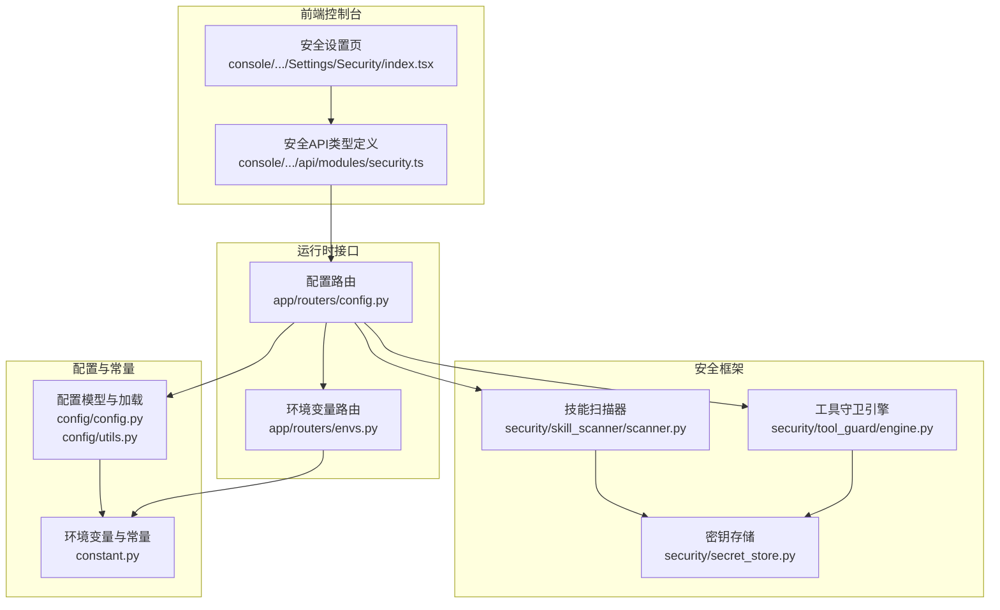
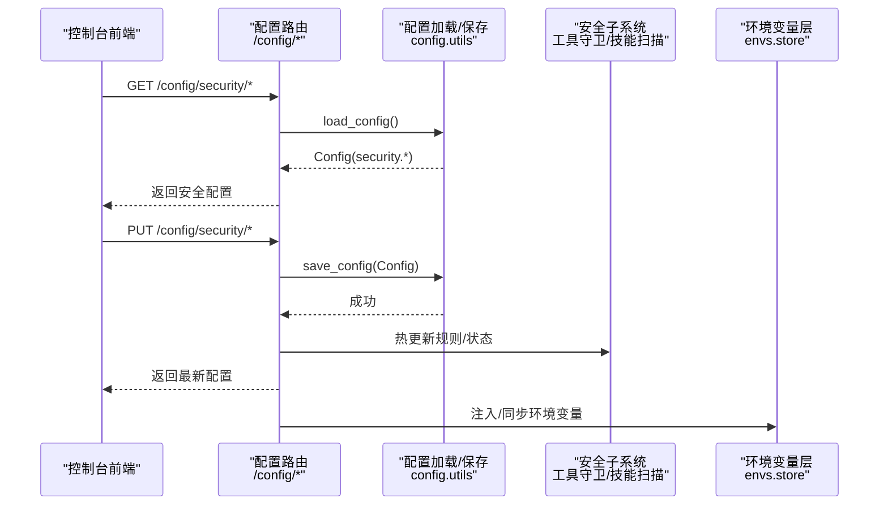
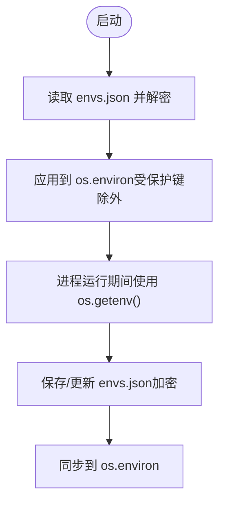
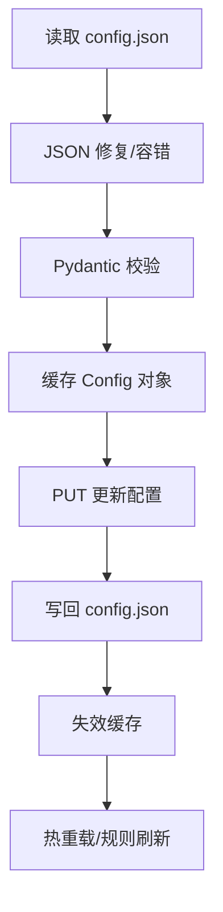
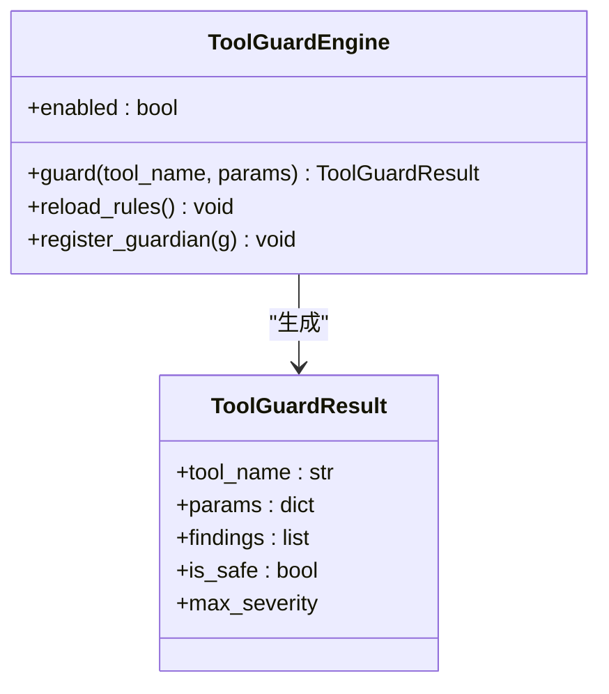
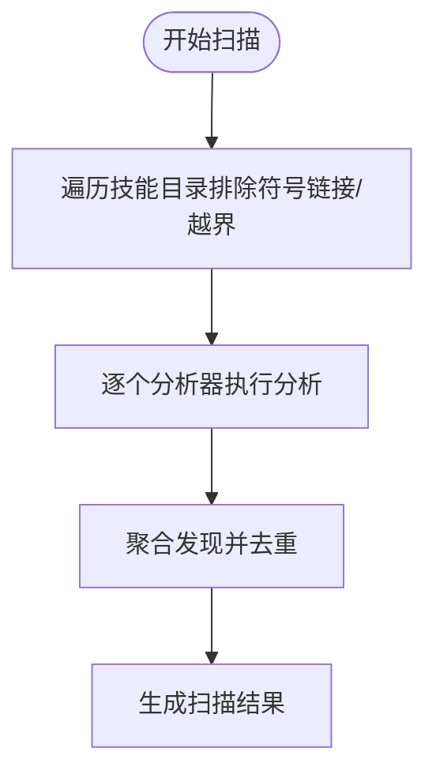
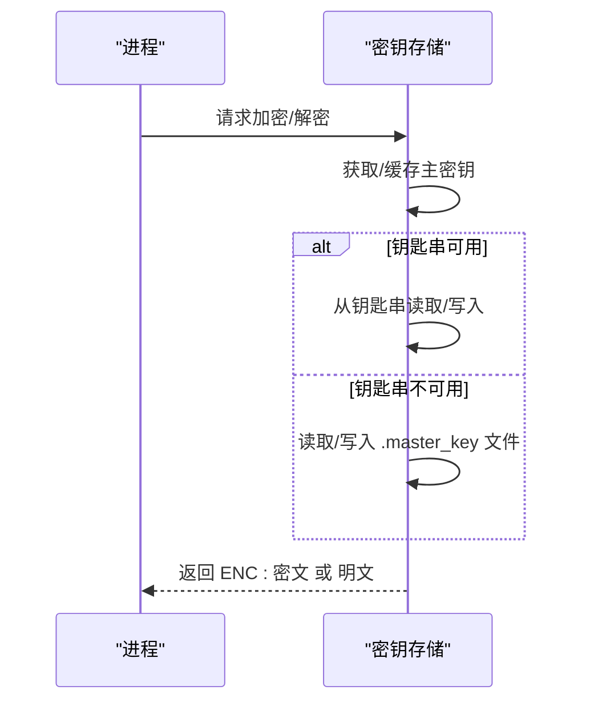
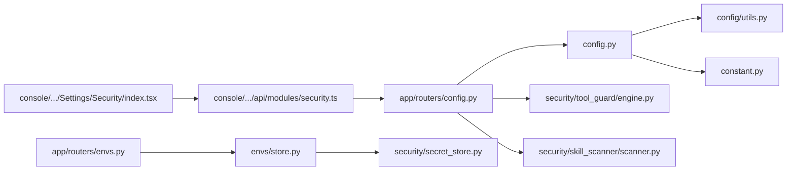

# 安全配置

<cite>
**本文引用的文件**
- [src/qwenpaw/security/__init__.py](file://src/qwenpaw/security/__init__.py)
- [src/qwenpaw/security/secret_store.py](file://src/qwenpaw/security/secret_store.py)
- [src/qwenpaw/envs/store.py](file://src/qwenpaw/envs/store.py)
- [src/qwenpaw/constant.py](file://src/qwenpaw/constant.py)
- [src/qwenpaw/config/config.py](file://src/qwenpaw/config/config.py)
- [src/qwenpaw/config/utils.py](file://src/qwenpaw/config/utils.py)
- [src/qwenpaw/app/routers/config.py](file://src/qwenpaw/app/routers/config.py)
- [src/qwenpaw/app/routers/envs.py](file://src/qwenpaw/app/routers/envs.py)
- [src/qwenpaw/security/tool_guard/engine.py](file://src/qwenpaw/security/tool_guard/engine.py)
- [src/qwenpaw/security/tool_guard/models.py](file://src/qwenpaw/security/tool_guard/models.py)
- [src/qwenpaw/security/skill_scanner/scanner.py](file://src/qwenpaw/security/skill_scanner/scanner.py)
- [src/qwenpaw/security/skill_scanner/models.py](file://src/qwenpaw/security/skill_scanner/models.py)
- [console/src/pages/Settings/Security/index.tsx](file://console/src/pages/Settings/Security/index.tsx)
- [console/src/api/modules/security.ts](file://console/src/api/modules/security.ts)
- [website/public/docs/security.en.md](file://website/public/docs/security.en.md)
</cite>

## 目录
1. [简介](#简介)
2. [项目结构](#项目结构)
3. [核心组件](#核心组件)
4. [架构总览](#架构总览)
5. [详细组件分析](#详细组件分析)
6. [依赖关系分析](#依赖关系分析)
7. [性能考虑](#性能考虑)
8. [故障排查指南](#故障排查指南)
9. [结论](#结论)
10. [附录](#附录)

## 简介
本技术文档聚焦于 QwenPaw 的安全配置管理，系统性阐述安全配置参数、环境变量管理、配置验证与覆盖规则，并覆盖网络安全、TLS 证书、防火墙与访问控制等主题。文档同时提供安全配置模板、检查清单、审计工具与最佳实践，以及配置变更与回滚机制建议，帮助运维与开发团队在保障安全的前提下高效管理与维护系统。

## 项目结构
围绕“安全配置”的关键代码分布在以下模块：
- 安全框架入口与子系统：工具守卫、技能扫描器、密钥存储
- 配置模型与加载：config.json 的安全段落、加载与校验、缓存与热更新
- 运行时 API：安全配置的读取与写入接口
- 控制台前端：安全配置页面与 API 调用
- 环境变量层：envs.json 的持久化与注入

图示来源
- [src/qwenpaw/security/tool_guard/engine.py:54-269](file://src/qwenpaw/security/tool_guard/engine.py#L54-L269)
- [src/qwenpaw/security/skill_scanner/scanner.py:76-319](file://src/qwenpaw/security/skill_scanner/scanner.py#L76-L319)
- [src/qwenpaw/security/secret_store.py:1-414](file://src/qwenpaw/security/secret_store.py#L1-L414)
- [src/qwenpaw/config/config.py:1715-1735](file://src/qwenpaw/config/config.py#L1715-L1735)
- [src/qwenpaw/config/utils.py:586-686](file://src/qwenpaw/config/utils.py#L586-L686)
- [src/qwenpaw/constant.py:28-87](file://src/qwenpaw/constant.py#L28-L87)
- [src/qwenpaw/app/routers/config.py:661-800](file://src/qwenpaw/app/routers/config.py#L661-L800)
- [src/qwenpaw/app/routers/envs.py:1-81](file://src/qwenpaw/app/routers/envs.py#L1-L81)
- [console/src/pages/Settings/Security/index.tsx:124-240](file://console/src/pages/Settings/Security/index.tsx#L124-L240)
- [console/src/api/modules/security.ts:1-172](file://console/src/api/modules/security.ts#L1-L172)

章节来源
- [src/qwenpaw/security/__init__.py:1-21](file://src/qwenpaw/security/__init__.py#L1-L21)
- [src/qwenpaw/config/config.py:1715-1735](file://src/qwenpaw/config/config.py#L1715-L1735)
- [src/qwenpaw/app/routers/config.py:661-800](file://src/qwenpaw/app/routers/config.py#L661-L800)

## 核心组件
- 安全框架入口：集中管理工具守卫、技能扫描与密钥存储三大能力，模块间低耦合、可独立启用/禁用与演进。
- 工具守卫引擎：对工具调用参数进行预执行扫描，支持路径级防护、规则基守卫与逃逸检测。
- 技能扫描器：对技能包进行静态分析，基于策略与签名规则发现潜在风险。
- 密钥存储：透明加密/解密敏感字段（如 API Key、JWT Secret），主密钥来自系统钥匙串或文件，自动迁移与容错。
- 配置与常量：以 Pydantic 模型定义 config.json 的安全段落，提供严格校验、自动修复与缓存；EnvVarLoader 提供类型安全的环境变量读取。
- 运行时 API：提供安全配置的 GET/PUT 接口，支持热更新；环境变量提供批量保存与注入。
- 前端控制台：提供安全设置页，支持工具守卫、文件守卫、技能扫描器与免认证主机白名单的可视化配置。

章节来源
- [src/qwenpaw/security/__init__.py:1-21](file://src/qwenpaw/security/__init__.py#L1-L21)
- [src/qwenpaw/security/tool_guard/engine.py:54-269](file://src/qwenpaw/security/tool_guard/engine.py#L54-L269)
- [src/qwenpaw/security/skill_scanner/scanner.py:76-319](file://src/qwenpaw/security/skill_scanner/scanner.py#L76-L319)
- [src/qwenpaw/security/secret_store.py:1-414](file://src/qwenpaw/security/secret_store.py#L1-L414)
- [src/qwenpaw/config/config.py:1715-1735](file://src/qwenpaw/config/config.py#L1715-L1735)
- [src/qwenpaw/config/utils.py:586-686](file://src/qwenpaw/config/utils.py#L586-L686)
- [src/qwenpaw/constant.py:28-87](file://src/qwenpaw/constant.py#L28-L87)
- [src/qwenpaw/app/routers/config.py:661-800](file://src/qwenpaw/app/routers/config.py#L661-L800)
- [src/qwenpaw/app/routers/envs.py:1-81](file://src/qwenpaw/app/routers/envs.py#L1-L81)
- [console/src/pages/Settings/Security/index.tsx:124-240](file://console/src/pages/Settings/Security/index.tsx#L124-L240)
- [console/src/api/modules/security.ts:1-172](file://console/src/api/modules/security.ts#L1-L172)

## 架构总览
下图展示从控制台到后端 API、配置与安全子系统的交互流程，以及密钥存储与环境变量层的协作。

图示来源
- [src/qwenpaw/app/routers/config.py:661-800](file://src/qwenpaw/app/routers/config.py#L661-L800)
- [src/qwenpaw/config/utils.py:586-686](file://src/qwenpaw/config/utils.py#L586-L686)
- [src/qwenpaw/envs/store.py:242-270](file://src/qwenpaw/envs/store.py#L242-L270)

## 详细组件分析

### 安全配置参数与默认值
- 安全顶层配置位于 config.json 的 security 字段，包含：
  - 工具守卫：启用开关、受保护工具集、禁止工具集、自定义规则、自动拒绝规则、Shell 逃逸检查项
  - 文件守卫：启用开关、敏感路径列表（支持绝对/相对/用户家目录/目录递归）
  - 技能扫描器：模式（阻断/警告/关闭）、超时、白名单条目
  - 免认证主机白名单：允许无需鉴权访问 API 的客户端 IP 列表，默认包含本地回环地址
- 默认值与覆盖规则：
  - 优先级：环境变量 > config.json > 内置默认值
  - 工具守卫启用开关可通过环境变量覆盖
  - 免认证主机白名单默认仅允许本地回环地址，需谨慎添加可信 IP

章节来源
- [src/qwenpaw/config/config.py:1715-1735](file://src/qwenpaw/config/config.py#L1715-L1735)
- [src/qwenpaw/constant.py:326-349](file://src/qwenpaw/constant.py#L326-L349)
- [website/public/docs/security.en.md:305-319](file://website/public/docs/security.en.md#L305-L319)

### 环境变量管理与注入
- envs.json 持久化存储，采用透明加密（ENC: 前缀）保存敏感值；启动时注入 os.environ，支持覆盖但保留进程/系统环境
- 受保护键（如工作目录与密钥目录）不会被注入到进程环境
- 支持批量保存、删除与列出；保存时自动迁移明文并设置安全权限

图示来源
- [src/qwenpaw/envs/store.py:142-221](file://src/qwenpaw/envs/store.py#L142-L221)
- [src/qwenpaw/envs/store.py:242-270](file://src/qwenpaw/envs/store.py#L242-L270)

章节来源
- [src/qwenpaw/envs/store.py:1-270](file://src/qwenpaw/envs/store.py#L1-L270)
- [src/qwenpaw/constant.py:28-87](file://src/qwenpaw/constant.py#L28-L87)

### 配置验证与热更新
- 配置加载采用 mtime 缓存减少磁盘 IO；JSON 自动修复与字段移除策略用于容错
- 严格校验模式用于诊断；保存后失效缓存并触发代理热重载
- 安全配置更新后，工具守卫引擎会重新加载规则并按需热更新

图示来源
- [src/qwenpaw/config/utils.py:467-584](file://src/qwenpaw/config/utils.py#L467-L584)
- [src/qwenpaw/config/utils.py:627-686](file://src/qwenpaw/config/utils.py#L627-L686)
- [src/qwenpaw/app/routers/config.py:674-692](file://src/qwenpaw/app/routers/config.py#L674-L692)

章节来源
- [src/qwenpaw/config/utils.py:586-686](file://src/qwenpaw/config/utils.py#L586-L686)
- [src/qwenpaw/app/routers/config.py:661-720](file://src/qwenpaw/app/routers/config.py#L661-L720)

### 工具守卫（Tool Guard）
- 启用优先级：环境变量 > config.json > 默认开启
- 守护范围：受保护工具集、禁止工具集、自动拒绝规则集
- 守护器集合：路径守卫、规则基守卫、Shell 逃逸守卫
- 结果模型：聚合各守护器的发现，按严重级别排序，支持去重与失败记录

图示来源
- [src/qwenpaw/security/tool_guard/engine.py:54-269](file://src/qwenpaw/security/tool_guard/engine.py#L54-L269)
- [src/qwenpaw/security/tool_guard/models.py:103-185](file://src/qwenpaw/security/tool_guard/models.py#L103-L185)

章节来源
- [src/qwenpaw/security/tool_guard/engine.py:36-110](file://src/qwenpaw/security/tool_guard/engine.py#L36-L110)
- [src/qwenpaw/security/tool_guard/models.py:25-185](file://src/qwenpaw/security/tool_guard/models.py#L25-L185)

### 技能扫描器（Skill Scanner）
- 扫描策略：基于策略 YAML 的文件分类、扩展跳过、文件数量与大小限制
- 分析器：默认使用模式签名分析器；支持注册更多分析器
- 结果模型：聚合各分析器发现，按严重级别与类别统计，支持去重与失败记录

图示来源
- [src/qwenpaw/security/skill_scanner/scanner.py:148-242](file://src/qwenpaw/security/skill_scanner/scanner.py#L148-L242)
- [src/qwenpaw/security/skill_scanner/models.py:168-235](file://src/qwenpaw/security/skill_scanner/models.py#L168-L235)

章节来源
- [src/qwenpaw/security/skill_scanner/scanner.py:76-319](file://src/qwenpaw/security/skill_scanner/scanner.py#L76-L319)
- [src/qwenpaw/security/skill_scanner/models.py:1-235](file://src/qwenpaw/security/skill_scanner/models.py#L1-L235)

### 密钥存储（Secret Store）
- 主密钥来源：系统钥匙串（首选）→ 文件（降级）→ 自动生成
- 加密算法：Fernet（AES-128-CBC + HMAC-SHA256），前缀 ENC: 区分明文与密文
- 字段级加解密：针对 provider/auth 等敏感字段提供浅拷贝加解密
- 备份恢复：支持从磁盘重载主密钥并同步钥匙串

图示来源
- [src/qwenpaw/security/secret_store.py:234-370](file://src/qwenpaw/security/secret_store.py#L234-L370)

章节来源
- [src/qwenpaw/security/secret_store.py:1-414](file://src/qwenpaw/security/secret_store.py#L1-L414)

### 网络安全与访问控制
- 免认证主机白名单：通过 /config/security/allow-no-auth-hosts 管理，支持 IPv4/IPv6 校验与去重
- CORS 与开放文档：开发模式下的 CORS 允许来源列表；生产环境默认关闭开放文档
- TLS 通道配置：部分通道（如 MQTT）支持 TLS 参数（CA、证书、私钥）

章节来源
- [src/qwenpaw/app/routers/config.py:922-970](file://src/qwenpaw/app/routers/config.py#L922-L970)
- [src/qwenpaw/constant.py:257-260](file://src/qwenpaw/constant.py#L257-L260)
- [src/qwenpaw/config/config.py:273-287](file://src/qwenpaw/config/config.py#L273-L287)

## 依赖关系分析
- 组件内聚与耦合
  - 安全子系统彼此独立，通过配置与规则共享概念模型（严重级别、威胁类别）
  - 配置层与常量层提供统一的类型安全与默认值解析
  - API 层负责将配置变更传播至运行时（热更新、规则重载）
- 外部依赖
  - 系统钥匙串（keyring）用于主密钥存储
  - JSON 修复库用于容错
  - Pydantic 用于配置模型与校验

图示来源
- [src/qwenpaw/config/config.py:1715-1735](file://src/qwenpaw/config/config.py#L1715-L1735)
- [src/qwenpaw/config/utils.py:586-686](file://src/qwenpaw/config/utils.py#L586-L686)
- [src/qwenpaw/constant.py:28-87](file://src/qwenpaw/constant.py#L28-L87)
- [src/qwenpaw/app/routers/config.py:661-800](file://src/qwenpaw/app/routers/config.py#L661-L800)
- [src/qwenpaw/security/tool_guard/engine.py:54-269](file://src/qwenpaw/security/tool_guard/engine.py#L54-L269)
- [src/qwenpaw/security/skill_scanner/scanner.py:76-319](file://src/qwenpaw/security/skill_scanner/scanner.py#L76-L319)
- [src/qwenpaw/envs/store.py:1-270](file://src/qwenpaw/envs/store.py#L1-L270)
- [src/qwenpaw/security/secret_store.py:1-414](file://src/qwenpaw/security/secret_store.py#L1-L414)
- [console/src/pages/Settings/Security/index.tsx:124-240](file://console/src/pages/Settings/Security/index.tsx#L124-L240)
- [console/src/api/modules/security.ts:1-172](file://console/src/api/modules/security.ts#L1-L172)

## 性能考虑
- 配置缓存：mtime 基础的内存缓存降低频繁磁盘读取开销
- JSON 修复与容错：自动修复常见语法问题，避免因格式错误导致的失败重试
- 工具守卫与技能扫描：支持超时、文件数量与大小限制，防止大包扫描造成资源耗尽
- 热更新：仅在必要时重载规则与缓存，避免不必要的重启

## 故障排查指南
- 配置文件损坏
  - 使用严格校验模式定位错误字段
  - 自动备份原始文件以便回滚
- 工具守卫误报/漏报
  - 检查规则禁用/启用状态与 Shell 逃逸检查项
  - 通过热更新接口即时生效新规则
- 技能扫描失败
  - 查看扫描结果中的失败分析器与去重后的发现
  - 调整文件限制与策略 YAML
- 密钥存储异常
  - 重载主密钥并同步钥匙串
  - 检查钥匙串可用性与容器环境限制

章节来源
- [src/qwenpaw/config/utils.py:627-686](file://src/qwenpaw/config/utils.py#L627-L686)
- [src/qwenpaw/security/tool_guard/engine.py:166-172](file://src/qwenpaw/security/tool_guard/engine.py#L166-L172)
- [src/qwenpaw/security/skill_scanner/scanner.py:204-213](file://src/qwenpaw/security/skill_scanner/scanner.py#L204-L213)
- [src/qwenpaw/security/secret_store.py:329-370](file://src/qwenpaw/security/secret_store.py#L329-L370)

## 结论
QwenPaw 的安全配置管理通过“配置模型 + 运行时 API + 前端控制台”的协同，实现了对工具调用、技能包与环境变量的多维安全防护。借助严格的配置校验、热更新与密钥存储的透明加密，系统在保障安全性的同时提供了良好的可运维性。建议在生产环境中遵循最小权限原则、定期审计白名单与规则集，并建立完善的配置变更与回滚流程。

## 附录

### 安全配置模板
- 工具守卫
  - enabled: true/false
  - guarded_tools: ["execute_shell_command","read_file"] 或 null（全部）
  - denied_tools: ["dangerous_tool"]
  - custom_rules: [{id,tools,params,category,severity,patterns,exclude_patterns}]
  - disabled_rules: ["rule_id"]
  - auto_denied_rules: ["rule_id"]
  - shell_evasion_checks: {check_id: true/false}
- 文件守卫
  - enabled: true/false
  - sensitive_files: ["/etc/passwd","~/secrets","/var/log/"]
- 技能扫描器
  - mode: "block"|"warn"|"off"
  - timeout: 30
  - whitelist: [{"skill_name","content_hash","added_at"}]
- 免认证主机白名单
  - hosts: ["127.0.0.1","::1","192.168.1.10"]

章节来源
- [src/qwenpaw/config/config.py:1715-1735](file://src/qwenpaw/config/config.py#L1715-L1735)
- [console/src/api/modules/security.ts:15-88](file://console/src/api/modules/security.ts#L15-L88)

### 配置检查清单
- 环境变量
  - 是否存在敏感键（API Key/JWT Secret）且已加密
  - 受保护键是否未注入到进程环境
- 工具守卫
  - 是否启用；受保护工具集是否覆盖关键工具
  - Shell 逃逸检查是否开启
- 技能扫描器
  - 模式是否符合组织策略；超时与文件限制是否合理
- 免认证主机白名单
  - 是否仅包含可信 IP；是否定期清理
- 网络与 TLS
  - 通道 TLS 参数是否正确配置
  - 生产环境是否关闭开放文档

章节来源
- [src/qwenpaw/envs/store.py:84-96](file://src/qwenpaw/envs/store.py#L84-L96)
- [src/qwenpaw/security/tool_guard/engine.py:36-52](file://src/qwenpaw/security/tool_guard/engine.py#L36-L52)
- [src/qwenpaw/security/skill_scanner/scanner.py:100-134](file://src/qwenpaw/security/skill_scanner/scanner.py#L100-L134)
- [src/qwenpaw/app/routers/config.py:922-970](file://src/qwenpaw/app/routers/config.py#L922-L970)
- [src/qwenpaw/config/config.py:273-287](file://src/qwenpaw/config/config.py#L273-L287)

### 配置审计工具
- 严格校验：用于诊断 config.json 的有效性与错误位置
- 扫描历史：技能扫描阻断记录与白名单管理
- 环境变量审计：列出所有已保存的键值，便于核对敏感信息

章节来源
- [src/qwenpaw/config/utils.py:627-664](file://src/qwenpaw/config/utils.py#L627-L664)
- [console/src/api/modules/security.ts:124-159](file://console/src/api/modules/security.ts#L124-L159)
- [src/qwenpaw/app/routers/envs.py:32-81](file://src/qwenpaw/app/routers/envs.py#L32-L81)

### 配置变更与回滚机制
- 变更流程
  - 在控制台或 API 更新安全配置
  - 触发热更新（规则重载、配置保存）
  - 记录变更时间与操作者（建议）
- 回滚策略
  - 利用严格校验模式定位问题并回退到上一个有效版本
  - 通过备份文件恢复 config.json 与 envs.json
  - 重载主密钥并同步钥匙串以恢复密钥访问

章节来源
- [src/qwenpaw/config/utils.py:447-465](file://src/qwenpaw/config/utils.py#L447-L465)
- [src/qwenpaw/config/utils.py:667-686](file://src/qwenpaw/config/utils.py#L667-L686)
- [src/qwenpaw/security/secret_store.py:329-370](file://src/qwenpaw/security/secret_store.py#L329-L370)