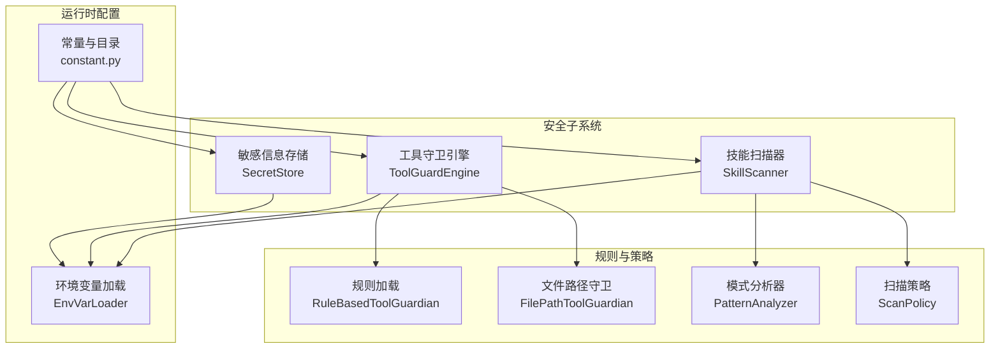
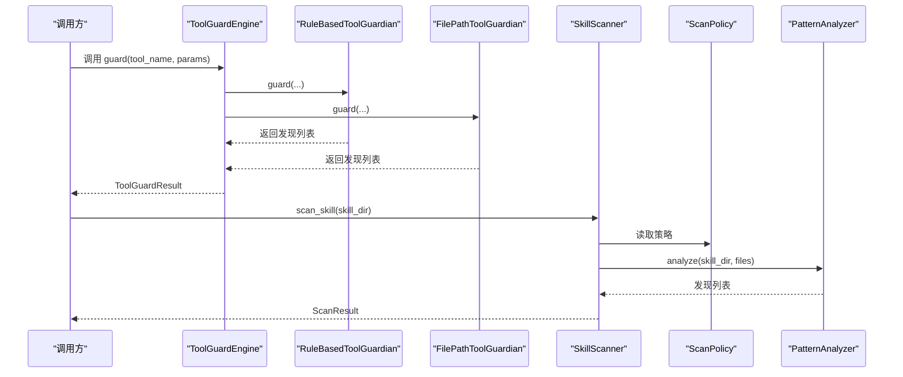
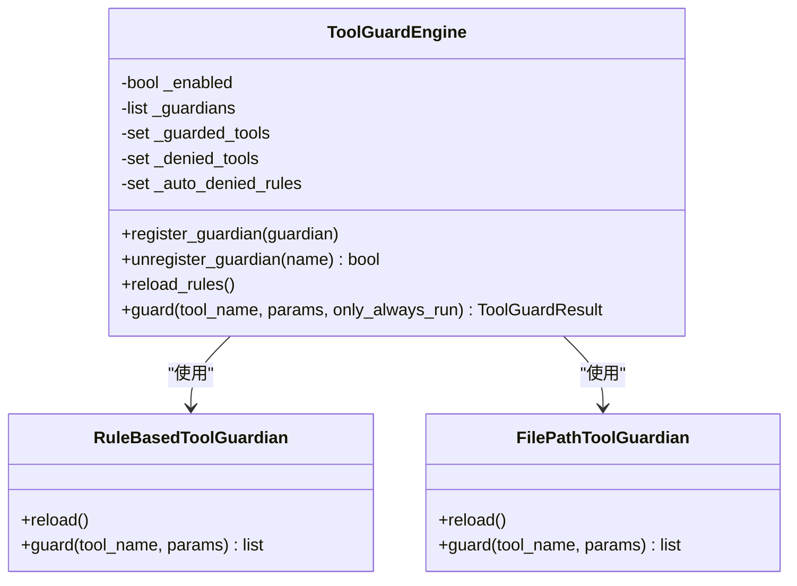
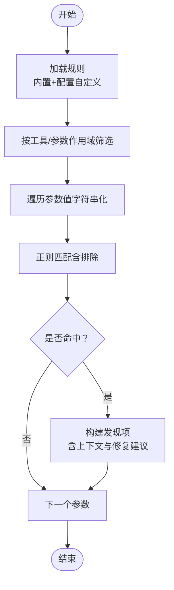
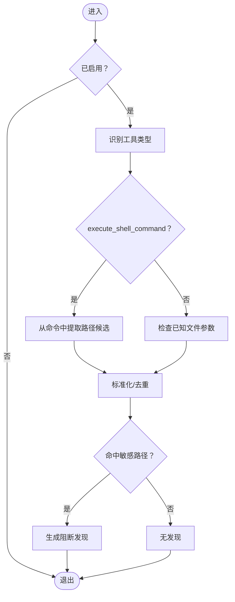
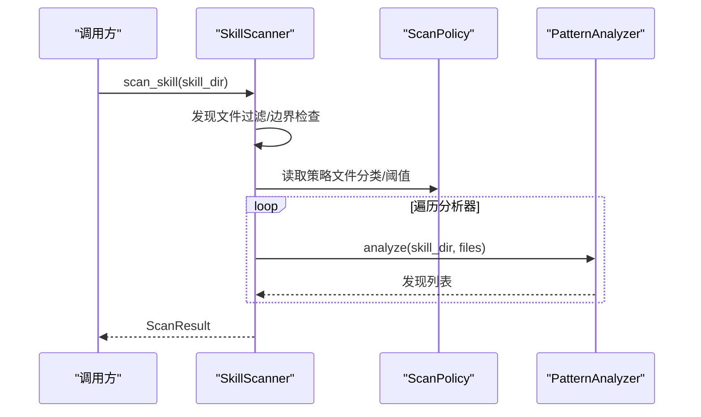
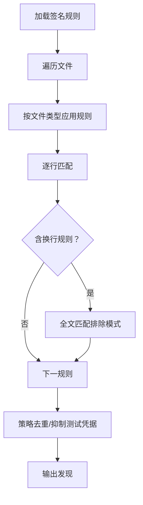
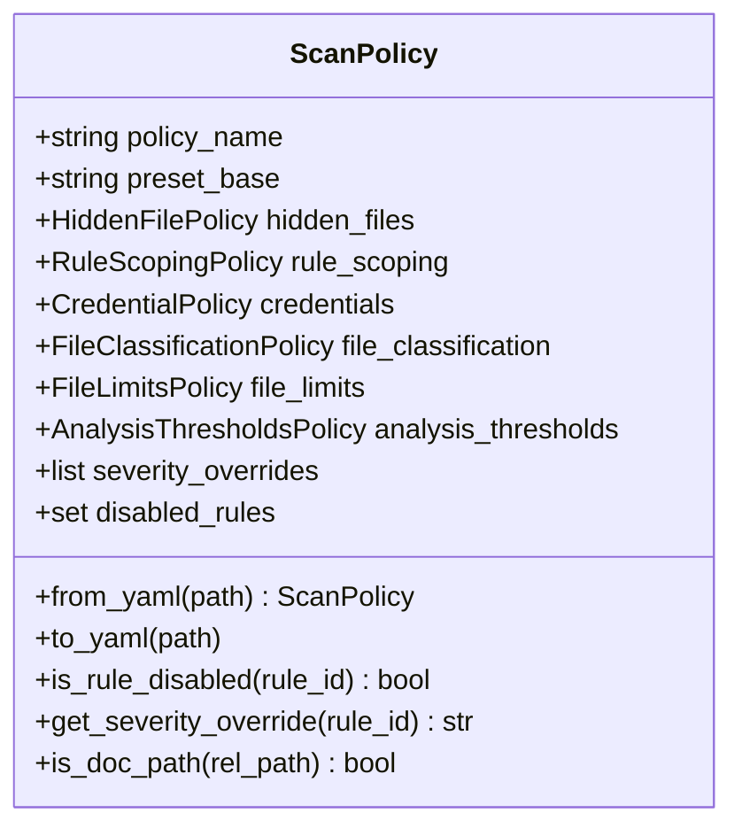
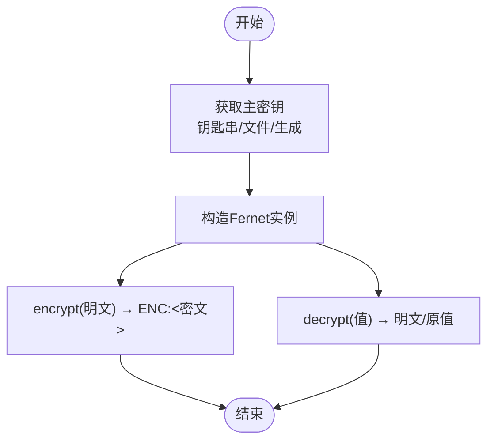
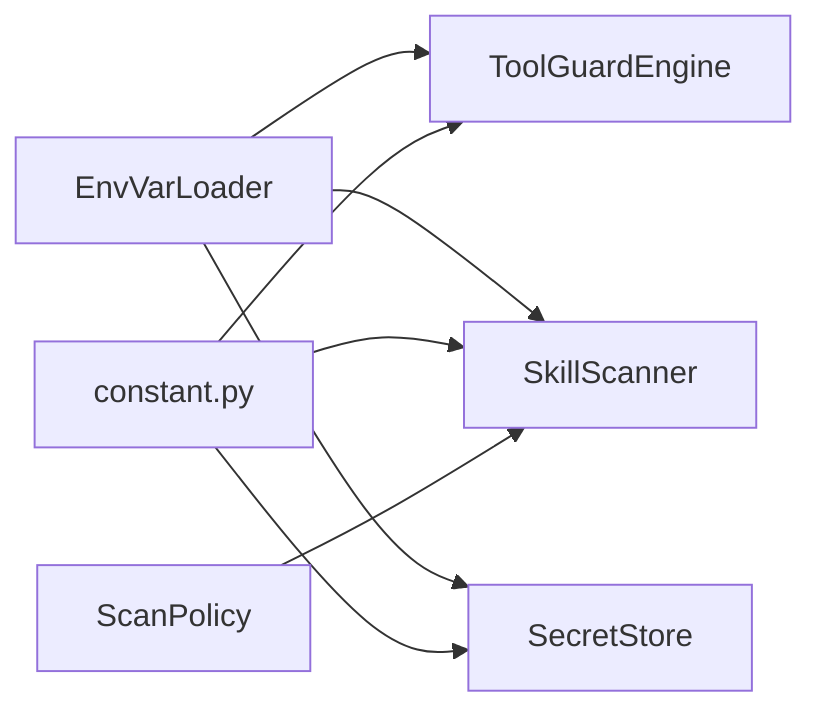

# 安全防护

<cite>
**本文引用的文件**
- [security/__init__.py](file://src/qwenpaw/security/__init__.py)
- [security/tool_guard/__init__.py](file://src/qwenpaw/security/tool_guard/__init__.py)
- [security/tool_guard/engine.py](file://src/qwenpaw/security/tool_guard/engine.py)
- [security/tool_guard/guardians/rule_guardian.py](file://src/qwenpaw/security/tool_guard/guardians/rule_guardian.py)
- [security/tool_guard/guardians/file_guardian.py](file://src/qwenpaw/security/tool_guard/guardians/file_guardian.py)
- [security/tool_guard/models.py](file://src/qwenpaw/security/tool_guard/models.py)
- [security/skill_scanner/__init__.py](file://src/qwenpaw/security/skill_scanner/__init__.py)
- [security/skill_scanner/scanner.py](file://src/qwenpaw/security/skill_scanner/scanner.py)
- [security/skill_scanner/analyzers/pattern_analyzer.py](file://src/qwenpaw/security/skill_scanner/analyzers/pattern_analyzer.py)
- [security/skill_scanner/models.py](file://src/qwenpaw/security/skill_scanner/models.py)
- [security/skill_scanner/scan_policy.py](file://src/qwenpaw/security/skill_scanner/scan_policy.py)
- [security/secret_store.py](file://src/qwenpaw/security/secret_store.py)
- [constant.py](file://src/qwenpaw/constant.py)
</cite>

## 目录
1. [简介](#简介)
2. [项目结构](#项目结构)
3. [核心组件](#核心组件)
4. [架构总览](#架构总览)
5. [详细组件分析](#详细组件分析)
6. [依赖关系分析](#依赖关系分析)
7. [性能考量](#性能考量)
8. [故障排查指南](#故障排查指南)
9. [结论](#结论)
10. [附录](#附录)

## 简介
本文件面向QwenPaw的安全防护体系，系统性阐述工具守卫机制、文件访问控制与技能安全扫描的实现原理与配置方法；并从权限管理、安全策略、访问控制规则、敏感信息存储与加密、安全审计等方面给出可操作的实践建议。同时提供威胁检测、入侵防护与应急响应流程，以及漏洞修复与风险评估的实用指南。

## 项目结构
安全子系统由三大部分组成：
- 工具调用前守卫（Tool Guard）：在工具执行前对参数进行扫描，识别命令注入、敏感文件访问等高危模式。
- 技能安全扫描（Skill Scanner）：在技能安装/激活前对其目录进行静态分析，发现硬编码凭证、命令注入等威胁。
- 敏感信息存储（Secret Store）：对磁盘上存储的敏感字段（如API Key、Token）进行透明加解密，采用Fernet（AES-128-CBC + HMAC-SHA256），主密钥来自系统钥匙串或文件备份。

图表来源
- [security/tool_guard/engine.py:54-269](file://src/qwenpaw/security/tool_guard/engine.py#L54-L269)
- [security/tool_guard/guardians/rule_guardian.py:559-758](file://src/qwenpaw/security/tool_guard/guardians/rule_guardian.py#L559-L758)
- [security/tool_guard/guardians/file_guardian.py:301-501](file://src/qwenpaw/security/tool_guard/guardians/file_guardian.py#L301-L501)
- [security/skill_scanner/scanner.py:76-319](file://src/qwenpaw/security/skill_scanner/scanner.py#L76-L319)
- [security/skill_scanner/analyzers/pattern_analyzer.py:236-393](file://src/qwenpaw/security/skill_scanner/analyzers/pattern_analyzer.py#L236-L393)
- [security/skill_scanner/scan_policy.py:156-476](file://src/qwenpaw/security/skill_scanner/scan_policy.py#L156-L476)
- [security/secret_store.py:28-414](file://src/qwenpaw/security/secret_store.py#L28-L414)
- [constant.py:28-368](file://src/qwenpaw/constant.py#L28-L368)

章节来源
- [security/__init__.py:1-21](file://src/qwenpaw/security/__init__.py#L1-21)
- [security/tool_guard/__init__.py:1-59](file://src/qwenpaw/security/tool_guard/__init__.py#L1-59)
- [security/skill_scanner/__init__.py:1-514](file://src/qwenpaw/security/skill_scanner/__init__.py#L1-514)
- [security/secret_store.py:1-414](file://src/qwenpaw/security/secret_store.py#L1-414)

## 核心组件
- 工具守卫引擎（ToolGuardEngine）
  - 统一编排多个“守护者”（Guardian），在工具调用前扫描参数，生成聚合结果。
  - 支持按环境变量/配置开关启用/禁用，支持动态重载规则与受控工具集。
- 规则型工具守卫（RuleBasedToolGuardian）
  - 基于YAML签名规则进行正则匹配，覆盖命令注入、危险shell命令、路径逃逸等场景。
  - 对特定规则（如rm命令）增强工作区边界检查，提供UI提示与修复建议。
- 文件路径守卫（FilePathToolGuardian）
  - 检测针对敏感文件/目录的访问意图，支持Windows/POSIX路径归一化与工作区边界校验。
- 技能扫描器（SkillScanner）
  - 发现技能目录中的文件，交由分析器（默认为PatternAnalyzer）进行多规则扫描。
  - 支持策略驱动的文件分类、规则禁用/覆盖、去重与超时控制。
- 模式分析器（PatternAnalyzer）
  - 加载签名规则，逐行/多行匹配，输出带严重级别与修复建议的发现。
- 扫描策略（ScanPolicy）
  - 组织化的策略对象，支持规则范围、文件类型分类、阈值、严重级别覆盖、禁用规则等。
- 敏感信息存储（SecretStore）
  - 透明加解密，使用Fernet（AES-128-CBC + HMAC-SHA256），主密钥来自系统钥匙串或文件备份。
  - 提供加密字典字段、解密字典字段、主密钥重载等能力。

章节来源
- [security/tool_guard/engine.py:54-269](file://src/qwenpaw/security/tool_guard/engine.py#L54-L269)
- [security/tool_guard/guardians/rule_guardian.py:559-758](file://src/qwenpaw/security/tool_guard/guardians/rule_guardian.py#L559-L758)
- [security/tool_guard/guardians/file_guardian.py:301-501](file://src/qwenpaw/security/tool_guard/guardians/file_guardian.py#L301-L501)
- [security/skill_scanner/scanner.py:76-319](file://src/qwenpaw/security/skill_scanner/scanner.py#L76-L319)
- [security/skill_scanner/analyzers/pattern_analyzer.py:236-393](file://src/qwenpaw/security/skill_scanner/analyzers/pattern_analyzer.py#L236-L393)
- [security/skill_scanner/scan_policy.py:156-476](file://src/qwenpaw/security/skill_scanner/scan_policy.py#L156-L476)
- [security/secret_store.py:28-414](file://src/qwenpaw/security/secret_store.py#L28-L414)

## 架构总览
下图展示工具守卫与技能扫描在运行期的交互与关键依赖：

图表来源
- [security/tool_guard/engine.py:200-258](file://src/qwenpaw/security/tool_guard/engine.py#L200-L258)
- [security/tool_guard/guardians/rule_guardian.py:608-757](file://src/qwenpaw/security/tool_guard/guardians/rule_guardian.py#L608-L757)
- [security/tool_guard/guardians/file_guardian.py:449-500](file://src/qwenpaw/security/tool_guard/guardians/file_guardian.py#L449-L500)
- [security/skill_scanner/scanner.py:148-242](file://src/qwenpaw/security/skill_scanner/scanner.py#L148-L242)
- [security/skill_scanner/analyzers/pattern_analyzer.py:265-347](file://src/qwenpaw/security/skill_scanner/analyzers/pattern_analyzer.py#L265-L347)

## 详细组件分析

### 工具守卫引擎（ToolGuardEngine）
- 启用控制：优先级为环境变量 > 配置 > 默认开启。
- 守护者集合：默认包含文件路径守卫、规则型守卫、Shell规避守卫；支持注册/注销与动态重载。
- 受控工具集：支持仅对指定工具生效，或对不在受控范围内的工具执行“始终运行”的路径检查。
- 结果聚合：记录每个守护者使用的耗时、失败原因，并计算最高严重级别。

图表来源
- [security/tool_guard/engine.py:54-172](file://src/qwenpaw/security/tool_guard/engine.py#L54-L172)
- [security/tool_guard/guardians/rule_guardian.py:559-598](file://src/qwenpaw/security/tool_guard/guardians/rule_guardian.py#L559-L598)
- [security/tool_guard/guardians/file_guardian.py:301-364](file://src/qwenpaw/security/tool_guard/guardians/file_guardian.py#L301-L364)

章节来源
- [security/tool_guard/engine.py:36-172](file://src/qwenpaw/security/tool_guard/engine.py#L36-L172)
- [security/tool_guard/models.py:103-185](file://src/qwenpaw/security/tool_guard/models.py#L103-L185)

### 规则型工具守卫（RuleBasedToolGuardian）
- 规则来源：内置规则目录与配置自定义规则合并，支持禁用规则ID。
- 匹配策略：对字符串化参数值进行正则匹配，支持排除模式；对命中规则生成上下文片段与修复建议。
- 特殊增强：针对rm命令提取目标路径，结合工作区边界判断，生成中英双语提示与结构化元数据。

图表来源
- [security/tool_guard/guardians/rule_guardian.py:432-510](file://src/qwenpaw/security/tool_guard/guardians/rule_guardian.py#L432-L510)
- [security/tool_guard/guardians/rule_guardian.py:608-757](file://src/qwenpaw/security/tool_guard/guardians/rule_guardian.py#L608-L757)

章节来源
- [security/tool_guard/guardians/rule_guardian.py:518-594](file://src/qwenpaw/security/tool_guard/guardians/rule_guardian.py#L518-L594)

### 文件路径守卫（FilePathToolGuardian）
- 启用控制：通过配置开关控制是否启用。
- 路径解析：兼容Windows/POSIX路径，统一大小写与分隔符，支持工作区根目录边界检查。
- 敏感路径判定：对显式敏感文件/目录集合进行前缀匹配，支持附加重定向路径提取。

图表来源
- [security/tool_guard/guardians/file_guardian.py:449-500](file://src/qwenpaw/security/tool_guard/guardians/file_guardian.py#L449-L500)
- [security/tool_guard/guardians/file_guardian.py:246-298](file://src/qwenpaw/security/tool_guard/guardians/file_guardian.py#L246-L298)

章节来源
- [security/tool_guard/guardians/file_guardian.py:147-173](file://src/qwenpaw/security/tool_guard/guardians/file_guardian.py#L147-L173)

### 技能扫描器（SkillScanner）
- 文件发现：递归遍历技能目录，跳过符号链接与外部路径，按策略限制文件数量与大小。
- 分析器编排：默认使用PatternAnalyzer，支持注册自定义分析器；聚合各分析器结果。
- 结果汇总：统计最高严重级别、分析器失败列表、扫描耗时与时间戳。

图表来源
- [security/skill_scanner/scanner.py:148-242](file://src/qwenpaw/security/skill_scanner/scanner.py#L148-L242)

章节来源
- [security/skill_scanner/scanner.py:76-134](file://src/qwenpaw/security/skill_scanner/scanner.py#L76-L134)

### 模式分析器（PatternAnalyzer）
- 规则加载：从签名目录加载规则，支持按文件类型筛选。
- 匹配过程：先逐行匹配，再对含换行的规则进行全文匹配；支持排除模式与严重级别覆盖。
- 去重与抑制：根据策略去重重复发现；对测试占位符与常见测试凭据进行抑制。

图表来源
- [security/skill_scanner/analyzers/pattern_analyzer.py:265-347](file://src/qwenpaw/security/skill_scanner/analyzers/pattern_analyzer.py#L265-L347)

章节来源
- [security/skill_scanner/analyzers/pattern_analyzer.py:163-230](file://src/qwenpaw/security/skill_scanner/analyzers/pattern_analyzer.py#L163-L230)

### 扫描策略（ScanPolicy）
- 结构化策略：隐藏文件、规则范围、凭证、文件分类、文件限制、分析阈值、严重级别覆盖、禁用规则等。
- 动态加载：支持从YAML加载与合并默认策略；提供导出能力便于组织定制。
- 运行期辅助：提供文档路径识别、规则禁用查询、严重级别覆盖查询等便捷方法。

图表来源
- [security/skill_scanner/scan_policy.py:156-476](file://src/qwenpaw/security/skill_scanner/scan_policy.py#L156-L476)

章节来源
- [security/skill_scanner/scan_policy.py:236-304](file://src/qwenpaw/security/skill_scanner/scan_policy.py#L236-L304)

### 敏感信息存储（SecretStore）
- 主密钥管理：优先从系统钥匙串获取，失败回退到密钥文件；支持缓存与重载。
- 加解密：Fernet（AES-128-CBC + HMAC-SHA256），密钥经URL安全Base64编码；值以“ENC:”前缀标识。
- 字段级加密：提供对字典字段的批量加/解密，自动跳过已加密字段。

图表来源
- [security/secret_store.py:279-322](file://src/qwenpaw/security/secret_store.py#L279-L322)

章节来源
- [security/secret_store.py:49-82](file://src/qwenpaw/security/secret_store.py#L49-L82)
- [security/secret_store.py:229-269](file://src/qwenpaw/security/secret_store.py#L229-L269)

## 依赖关系分析
- 环境变量与常量
  - 通过EnvVarLoader统一读取，支持QWENPAW/COPAW前缀兼容；提供布尔/整数/浮点/字符串解析。
  - 工作目录与密钥目录通过常量模块解析，支持容器/无桌面环境下的钥匙串降级。
- 工具守卫与技能扫描
  - 两者均通过EnvVarLoader读取开关与超时等配置；扫描器通过ScanPolicy控制规则范围与阈值。
- 敏感信息存储
  - 依赖系统钥匙串库；在容器/无桌面/CI环境下自动降级至文件存储；支持主密钥重载以适配备份恢复后的一致性。

图表来源
- [constant.py:28-368](file://src/qwenpaw/constant.py#L28-L368)
- [security/tool_guard/engine.py:36-52](file://src/qwenpaw/security/tool_guard/engine.py#L36-L52)
- [security/skill_scanner/scanner.py:100-134](file://src/qwenpaw/security/skill_scanner/scanner.py#L100-L134)
- [security/secret_store.py:49-82](file://src/qwenpaw/security/secret_store.py#L49-L82)

章节来源
- [constant.py:89-201](file://src/qwenpaw/constant.py#L89-L201)

## 性能考量
- 工具守卫
  - 使用线程池限制并发，避免长时间阻塞；守护者失败不影响整体结果，但会记录失败详情。
  - 规则匹配采用预编译正则，减少重复开销；路径提取与规范化在必要时进行，避免不必要的IO。
- 技能扫描
  - 文件发现阶段严格限制数量与大小，防止大体积技能导致内存与CPU压力。
  - 分析器失败会被捕获并记录，不影响其他分析器执行；支持策略去重降低冗余。
- 密钥存储
  - 主密钥与Fernet实例缓存，减少重复初始化；钥匙串访问使用带超时的异步线程，避免阻塞。

[本节为通用指导，不直接分析具体文件]

## 故障排查指南
- 工具守卫未生效
  - 检查环境变量QWENPAW_TOOL_GUARD_ENABLED与配置项security.tool_guard.enabled。
  - 确认守护者是否正确注册与重载；查看guardians_failed字段定位失败原因。
- 规则误报/漏报
  - 自定义规则需确保正则有效且长度合理；通过ScanPolicy覆盖严重级别或禁用规则。
  - 对rm命令等特殊规则，检查工作区边界与路径解析逻辑。
- 技能扫描超时/未扫描
  - 调整超时与最大文件数/大小；检查策略中的文件分类与阈值。
  - 确认symlink与外部路径已被跳过，避免异常行为。
- 密钥无法解密
  - 检查ENC:前缀与主密钥一致性；若主密钥变更，使用reload_master_key_from_disk同步。
  - 在容器/CI环境中确认钥匙串不可用时的文件回退路径存在且权限正确。

章节来源
- [security/tool_guard/engine.py:240-257](file://src/qwenpaw/security/tool_guard/engine.py#L240-L257)
- [security/skill_scanner/__init__.py:480-513](file://src/qwenpaw/security/skill_scanner/__init__.py#L480-L513)
- [security/secret_store.py:329-370](file://src/qwenpaw/security/secret_store.py#L329-L370)

## 结论
QwenPaw的安全防护体系通过“工具调用前守卫 + 技能静态扫描 + 敏感信息透明加密”形成闭环。其设计强调可插拔、可配置与可观测，既满足默认安全基线，又允许组织基于策略进行精细化调整。配合完善的环境变量与常量管理，可在不同部署形态（容器/桌面/CI）下稳定运行。

[本节为总结性内容，不直接分析具体文件]

## 附录

### 权限管理体系与访问控制规则
- 工具守卫
  - 受控工具集与自动阻断规则可通过配置解析并动态刷新。
  - 文件路径守卫对敏感目录（含兼容历史目录）进行统一拦截。
- 技能扫描
  - 通过ScanPolicy控制规则范围与严重级别，支持禁用规则与文档路径抑制。
- 访问控制
  - 建议结合平台ACL与工作区边界，限制对敏感路径的访问；对高危工具（如rm、execute_shell_command）实施更严格规则。

章节来源
- [security/tool_guard/engine.py:154-172](file://src/qwenpaw/security/tool_guard/engine.py#L154-L172)
- [security/tool_guard/guardians/file_guardian.py:318-365](file://src/qwenpaw/security/tool_guard/guardians/file_guardian.py#L318-L365)
- [security/skill_scanner/scan_policy.py:183-204](file://src/qwenpaw/security/skill_scanner/scan_policy.py#L183-L204)

### 安全策略配置与最佳实践
- 环境变量管理
  - 使用QWENPAW前缀统一管理，COPAW前缀作为兼容回退；容器/CI环境通过环境变量控制行为。
- API密钥保护
  - 使用SecretStore对敏感字段进行透明加密；确保主密钥持久化与备份恢复后的同步。
- 网络安全设置
  - 通过常量模块的CORS/ORIGIN配置在开发环境启用；生产环境关闭OpenAPI文档暴露。

章节来源
- [constant.py:28-87](file://src/qwenpaw/constant.py#L28-L87)
- [constant.py:257-260](file://src/qwenpaw/constant.py#L257-L260)
- [constant.py:214-217](file://src/qwenpaw/constant.py#L214-L217)
- [security/secret_store.py:198-201](file://src/qwenpaw/security/secret_store.py#L198-L201)

### 安全威胁检测、入侵防护与应急响应
- 威胁检测
  - 工具守卫：命令注入、敏感文件访问、路径逃逸、危险shell命令。
  - 技能扫描：硬编码凭证、命令注入、混淆、供应链攻击等。
- 入侵防护
  - 通过ScanPolicy与规则范围限制，降低误报与漏报；对高危规则自动阻断。
- 应急响应
  - 记录被阻断技能与工具调用结果；在备份恢复后重载主密钥，确保解密一致。

章节来源
- [security/tool_guard/guardians/rule_guardian.py:645-757](file://src/qwenpaw/security/tool_guard/guardians/rule_guardian.py#L645-L757)
- [security/skill_scanner/__init__.py:240-269](file://src/qwenpaw/security/skill_scanner/__init__.py#L240-L269)
- [security/secret_store.py:329-370](file://src/qwenpaw/security/secret_store.py#L329-L370)

### 安全漏洞修复与风险评估
- 规则维护
  - 定期更新签名规则与策略；对误报/漏报进行针对性调整。
- 风险评估
  - 基于ScanResult的最高严重级别与发现数量评估风险；对高危发现制定修复计划与复核流程。

章节来源
- [security/skill_scanner/models.py:186-219](file://src/qwenpaw/security/skill_scanner/models.py#L186-L219)
- [security/tool_guard/models.py:121-145](file://src/qwenpaw/security/tool_guard/models.py#L121-L145)