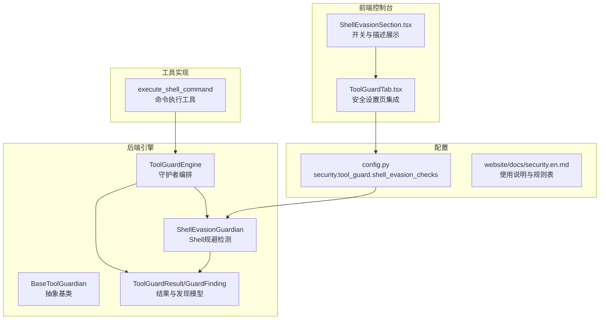
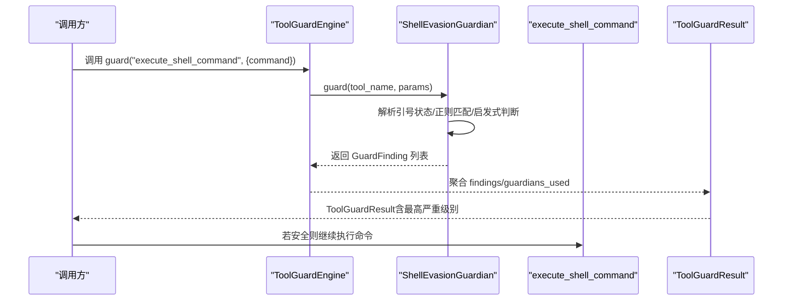
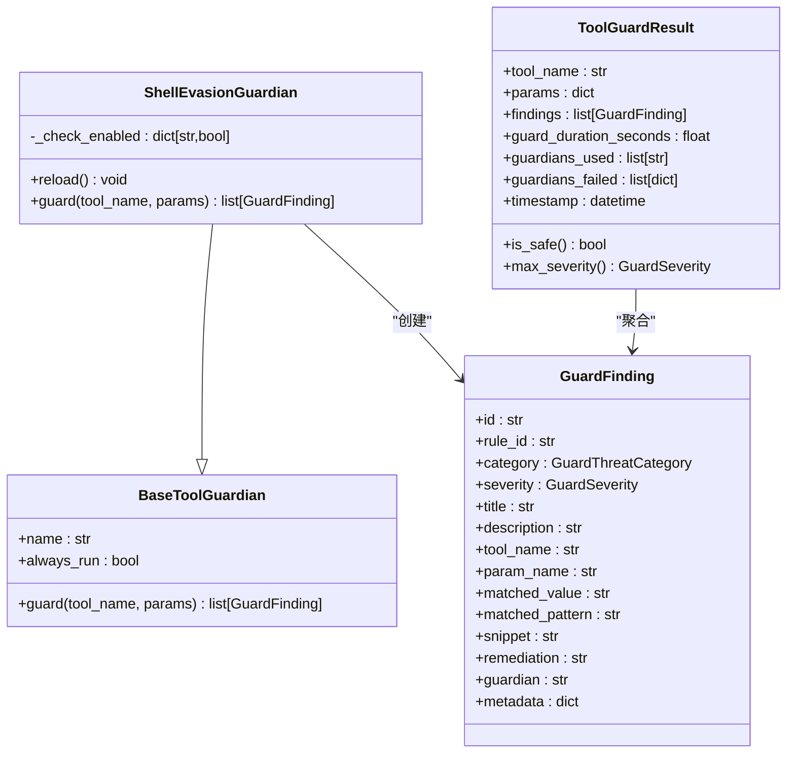
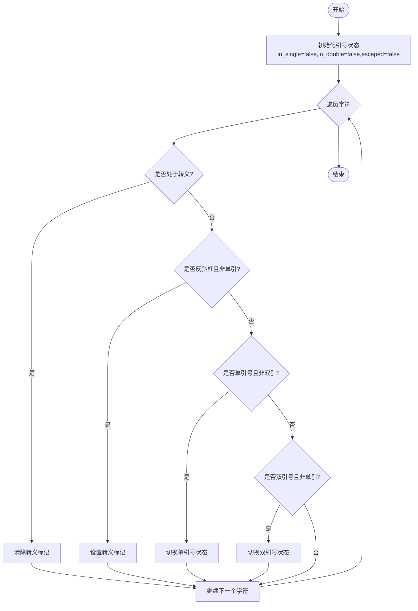
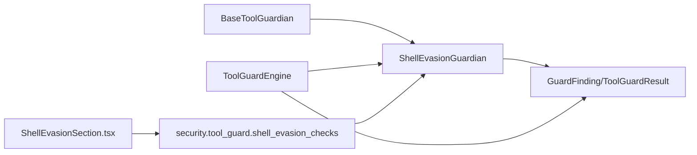

# Shell规避守护

<cite>
**本文档引用的文件**
- [src/qwenpaw/security/tool_guard/guardians/shell_evasion_guardian.py](file://src/qwenpaw/security/tool_guard/guardians/shell_evasion_guardian.py)
- [src/qwenpaw/security/tool_guard/engine.py](file://src/qwenpaw/security/tool_guard/engine.py)
- [src/qwenpaw/security/tool_guard/models.py](file://src/qwenpaw/security/tool_guard/models.py)
- [src/qwenpaw/security/tool_guard/guardians/__init__.py](file://src/qwenpaw/security/tool_guard/guardians/__init__.py)
- [src/qwenpaw/config/config.py](file://src/qwenpaw/config/config.py)
- [console/src/pages/Settings/Security/components/ShellEvasionSection.tsx](file://console/src/pages/Settings/Security/components/ShellEvasionSection.tsx)
- [console/src/pages/Settings/Security/components/ToolGuardTab.tsx](file://console/src/pages/Settings/Security/components/ToolGuardTab.tsx)
- [website/public/docs/security.en.md](file://website/public/docs/security.en.md)
- [src/qwenpaw/agents/tools/shell.py](file://src/qwenpaw/agents/tools/shell.py)
</cite>

## 目录
1. [简介](#简介)
2. [项目结构](#项目结构)
3. [核心组件](#核心组件)
4. [架构总览](#架构总览)
5. [详细组件分析](#详细组件分析)
6. [依赖分析](#依赖分析)
7. [性能考虑](#性能考虑)
8. [故障排查指南](#故障排查指南)
9. [结论](#结论)
10. [附录](#附录)

## 简介
本文件面向“Shell规避守护”（ShellEvasionGuardian）的技术文档，系统阐述其在执行shell命令前对规避检测与混淆识别的算法与实现，包括命令替换检测、编码绕过识别、恶意命令模式分析、启发式规则、正则匹配与行为分析技术，并覆盖配置参数、检测阈值、误报抑制机制、使用示例、规则定制与性能优化建议，以及与其他守护机制的协同与检测结果处理流程。

## 项目结构
Shell规避守护位于安全子系统的工具守卫（Tool Guard）模块中，围绕execute_shell_command工具参数进行前置检查。前端控制台提供开关与可视化配置入口；后端引擎负责加载默认守护者并聚合结果；配置模块提供可调的检测开关与全局策略。

**图表来源**
- [console/src/pages/Settings/Security/components/ShellEvasionSection.tsx:1-71](file://console/src/pages/Settings/Security/components/ShellEvasionSection.tsx#L1-L71)
- [console/src/pages/Settings/Security/components/ToolGuardTab.tsx:135-154](file://console/src/pages/Settings/Security/components/ToolGuardTab.tsx#L135-L154)
- [src/qwenpaw/security/tool_guard/engine.py:85-110](file://src/qwenpaw/security/tool_guard/engine.py#L85-L110)
- [src/qwenpaw/security/tool_guard/guardians/shell_evasion_guardian.py:539-593](file://src/qwenpaw/security/tool_guard/guardians/shell_evasion_guardian.py#L539-L593)
- [src/qwenpaw/security/tool_guard/models.py:60-185](file://src/qwenpaw/security/tool_guard/models.py#L60-L185)
- [src/qwenpaw/config/config.py:1637-1665](file://src/qwenpaw/config/config.py#L1637-L1665)
- [website/public/docs/security.en.md:245-273](file://website/public/docs/security.en.md#L245-L273)
- [src/qwenpaw/agents/tools/shell.py:357-542](file://src/qwenpaw/agents/tools/shell.py#L357-L542)

**章节来源**
- [console/src/pages/Settings/Security/components/ShellEvasionSection.tsx:1-71](file://console/src/pages/Settings/Security/components/ShellEvasionSection.tsx#L1-L71)
- [console/src/pages/Settings/Security/components/ToolGuardTab.tsx:135-154](file://console/src/pages/Settings/Security/components/ToolGuardTab.tsx#L135-L154)
- [src/qwenpaw/security/tool_guard/engine.py:85-110](file://src/qwenpaw/security/tool_guard/engine.py#L85-L110)
- [src/qwenpaw/security/tool_guard/guardians/shell_evasion_guardian.py:539-593](file://src/qwenpaw/security/tool_guard/guardians/shell_evasion_guardian.py#L539-L593)
- [src/qwenpaw/security/tool_guard/models.py:60-185](file://src/qwenpaw/security/tool_guard/models.py#L60-L185)
- [src/qwenpaw/config/config.py:1637-1665](file://src/qwenpaw/config/config.py#L1637-L1665)
- [website/public/docs/security.en.md:245-273](file://website/public/docs/security.en.md#L245-L273)
- [src/qwenpaw/agents/tools/shell.py:357-542](file://src/qwenpaw/agents/tools/shell.py#L357-L542)

## 核心组件
- ShellEvasionGuardian：针对execute_shell_command的quote-aware启发式检测守护者，覆盖命令替换、标志位混淆、反斜杠转义空白/操作符、换行拆分、注释引号不同步、引号内换行+注释等风险。
- ToolGuardEngine：默认注册多种守护者（含ShellEvasionGuardian），统一收集findings并生成ToolGuardResult。
- GuardFinding/ToolGuardResult：标准化的安全发现与结果聚合模型。
- 配置项security.tool_guard.shell_evasion_checks：按check名启用/禁用各子检测，初始均为false。

**章节来源**
- [src/qwenpaw/security/tool_guard/guardians/shell_evasion_guardian.py:539-593](file://src/qwenpaw/security/tool_guard/guardians/shell_evasion_guardian.py#L539-L593)
- [src/qwenpaw/security/tool_guard/engine.py:85-110](file://src/qwenpaw/security/tool_guard/engine.py#L85-L110)
- [src/qwenpaw/security/tool_guard/models.py:60-185](file://src/qwenpaw/security/tool_guard/models.py#L60-L185)
- [src/qwenpaw/config/config.py:1637-1665](file://src/qwenpaw/config/config.py#L1637-L1665)

## 架构总览
Shell规避守护在工具调用前被ToolGuardEngine触发，仅对execute_shell_command生效。它通过逐字符跟踪引号状态，结合正则模式与语义规则，识别常见的shell规避手法，输出高危发现并进入审批或记录流程。

**图表来源**
- [src/qwenpaw/security/tool_guard/engine.py:200-257](file://src/qwenpaw/security/tool_guard/engine.py#L200-L257)
- [src/qwenpaw/security/tool_guard/guardians/shell_evasion_guardian.py:555-593](file://src/qwenpaw/security/tool_guard/guardians/shell_evasion_guardian.py#L555-L593)
- [src/qwenpaw/agents/tools/shell.py:357-542](file://src/qwenpaw/agents/tools/shell.py#L357-L542)

## 详细组件分析

### ShellEvasionGuardian 类与检测流程
- 仅对execute_shell_command生效，接收字符串参数command。
- 预先计算“去除单引号内容”的未单引文本，用于命令替换类规则的匹配。
- 按顺序执行7类检查，收集所有命中发现；异常捕获并告警但不中断整体流程。
- 每个检查返回GuardFinding或None，统一由工厂方法构造，包含规则ID、严重级别、标题、描述、匹配片段、元数据等。

**图表来源**
- [src/qwenpaw/security/tool_guard/guardians/__init__.py:17-62](file://src/qwenpaw/security/tool_guard/guardians/__init__.py#L17-L62)
- [src/qwenpaw/security/tool_guard/guardians/shell_evasion_guardian.py:539-593](file://src/qwenpaw/security/tool_guard/guardians/shell_evasion_guardian.py#L539-L593)
- [src/qwenpaw/security/tool_guard/models.py:60-185](file://src/qwenpaw/security/tool_guard/models.py#L60-L185)

**章节来源**
- [src/qwenpaw/security/tool_guard/guardians/shell_evasion_guardian.py:539-593](file://src/qwenpaw/security/tool_guard/guardians/shell_evasion_guardian.py#L539-L593)
- [src/qwenpaw/security/tool_guard/guardians/__init__.py:17-62](file://src/qwenpaw/security/tool_guard/guardians/__init__.py#L17-L62)
- [src/qwenpaw/security/tool_guard/models.py:60-185](file://src/qwenpaw/security/tool_guard/models.py#L60-L185)

### 引号状态跟踪器与预处理
- _QuoteState：逐字符跟踪单/双引号与反斜杠转义，支持in_any_quote判定。
- _extract_outside_single_quotes：移除单引号内容，保留双引号内可能展开的命令替换，供外部规则使用。
- _looks_like_heredoc：识别heredoc以避免将多行输入误判为隐藏命令拆分。

**图表来源**
- [src/qwenpaw/security/tool_guard/guardians/shell_evasion_guardian.py:61-106](file://src/qwenpaw/security/tool_guard/guardians/shell_evasion_guardian.py#L61-L106)

**章节来源**
- [src/qwenpaw/security/tool_guard/guardians/shell_evasion_guardian.py:61-106](file://src/qwenpaw/security/tool_guard/guardians/shell_evasion_guardian.py#L61-L106)

### 命令替换检测（command_substitution）
- 检测范围：反引号（未被单引号包裹）、$()、$[]、Zsh process substitution与扩展、PowerShell注释语法等。
- 对未单引文本应用正则集合匹配，命中即返回高危发现。
- 单独处理反引号场景：在遍历过程中若遇到未被单引号包裹的反引号，立即返回发现。

**章节来源**
- [src/qwenpaw/security/tool_guard/guardians/shell_evasion_guardian.py:115-158](file://src/qwenpaw/security/tool_guard/guardians/shell_evasion_guardian.py#L115-L158)

### 标志位混淆检测（obfuscated_flags）
- 检测ANSI-C引号（$'...'）与locale引号（$"..."）隐藏flag字符。
- 检测空引号+连字符组合与引号内flag名（如''-exec）。
- 使用引号状态机扫描，遇空白+引号时窥视引号内内容，匹配潜在flag模式。

**章节来源**
- [src/qwenpaw/security/tool_guard/guardians/shell_evasion_guardian.py:161-241](file://src/qwenpaw/security/tool_guard/guardians/shell_evasion_guardian.py#L161-L241)

### 反斜杠转义空白/操作符检测（backslash_escaped_whitespace/operator）
- 检测在引号外的\空格、\制表符、\;、\|、\&、\<、\>等。
- 特殊豁免：find ... -exec ... {} \; 正常语法，需排除。
- 命中返回高危发现。

**章节来源**
- [src/qwenpaw/security/tool_guard/guardians/shell_evasion_guardian.py:244-307](file://src/qwenpaw/security/tool_guard/guardians/shell_evasion_guardian.py#L244-L307)

### 换行与回车检测（newlines）
- heredoc豁免：_looks_like_heredoc识别heredoc避免误报。
- 回车检测：在双引号外出现的\r被视为parser差异风险。
- 未引号内的换行后跟随非空白字符，视为隐藏命令拆分。

**章节来源**
- [src/qwenpaw/security/tool_guard/guardians/shell_evasion_guardian.py:310-355](file://src/qwenpaw/security/tool_guard/guardians/shell_evasion_guardian.py#L310-L355)

### 注释引号不同步（comment_quote_desync）
- 在#注释行内出现引号字符，会破坏后续行的引号状态追踪，导致权限校验遗漏参数。
- 仅在#未被引号包裹时检查该行注释内容。

**章节来源**
- [src/qwenpaw/security/tool_guard/guardians/shell_evasion_guardian.py:377-413](file://src/qwenpaw/security/tool_guard/guardians/shell_evasion_guardian.py#L377-L413)

### 引号内换行+注释（quoted_newline）
- 在引号内出现换行，随后下一行以#开头，可能导致基于行的注释清理逻辑忽略参数，从而绕过路径验证。
- 命中返回高危发现。

**章节来源**
- [src/qwenpaw/security/tool_guard/guardians/shell_evasion_guardian.py:416-453](file://src/qwenpaw/security/tool_guard/guardians/shell_evasion_guardian.py#L416-L453)

### 配置与前端开关
- 配置键：security.tool_guard.shell_evasion_checks，包含7个check名，默认全部为false。
- 前端组件ShellEvasionSection.tsx列出7类check，绑定到后端配置，支持按需开启。
- ToolGuardTab.tsx在安全设置页集成Shell规避检测开关与描述。

**章节来源**
- [src/qwenpaw/config/config.py:1637-1665](file://src/qwenpaw/config/config.py#L1637-L1665)
- [console/src/pages/Settings/Security/components/ShellEvasionSection.tsx:9-17](file://console/src/pages/Settings/Security/components/ShellEvasionSection.tsx#L9-L17)
- [console/src/pages/Settings/Security/components/ToolGuardTab.tsx:135-154](file://console/src/pages/Settings/Security/components/ToolGuardTab.tsx#L135-L154)

### 与execute_shell_command的协作
- 命令在执行前经过ToolGuardEngine的guard调用，Shell规避守护仅对execute_shell_command生效。
- 命令字符串在工具层可能经历换行折叠与平台特定处理，但这些步骤不影响Shell规避守护的检测逻辑。

**章节来源**
- [src/qwenpaw/security/tool_guard/engine.py:200-257](file://src/qwenpaw/security/tool_guard/engine.py#L200-L257)
- [src/qwenpaw/agents/tools/shell.py:357-542](file://src/qwenpaw/agents/tools/shell.py#L357-L542)

## 依赖分析
- ShellEvasionGuardian依赖BaseToolGuardian接口，遵循最小化抽象，便于扩展新的检测引擎。
- ToolGuardEngine默认注册多种守护者，包括ShellEvasionGuardian，统一聚合findings。
- 配置模块提供shell_evasion_checks字典，运行时动态加载启用状态。
- 前端组件与配置联动，实现可视化开关与描述展示。

**图表来源**
- [src/qwenpaw/security/tool_guard/guardians/__init__.py:17-62](file://src/qwenpaw/security/tool_guard/guardians/__init__.py#L17-L62)
- [src/qwenpaw/security/tool_guard/guardians/shell_evasion_guardian.py:539-593](file://src/qwenpaw/security/tool_guard/guardians/shell_evasion_guardian.py#L539-L593)
- [src/qwenpaw/security/tool_guard/engine.py:85-110](file://src/qwenpaw/security/tool_guard/engine.py#L85-L110)
- [src/qwenpaw/config/config.py:1637-1665](file://src/qwenpaw/config/config.py#L1637-L1665)
- [console/src/pages/Settings/Security/components/ShellEvasionSection.tsx:1-71](file://console/src/pages/Settings/Security/components/ShellEvasionSection.tsx#L1-L71)

**章节来源**
- [src/qwenpaw/security/tool_guard/guardians/__init__.py:17-62](file://src/qwenpaw/security/tool_guard/guardians/__init__.py#L17-L62)
- [src/qwenpaw/security/tool_guard/engine.py:85-110](file://src/qwenpaw/security/tool_guard/engine.py#L85-L110)
- [src/qwenpaw/config/config.py:1637-1665](file://src/qwenpaw/config/config.py#L1637-L1665)
- [console/src/pages/Settings/Security/components/ShellEvasionSection.tsx:1-71](file://console/src/pages/Settings/Security/components/ShellEvasionSection.tsx#L1-L71)

## 性能考虑
- 检测顺序固定，按需短路：一旦某检查失败，仍会继续执行后续检查以收集完整发现，但整体开销可控。
- 引号状态机为O(n)线性扫描，正则匹配数量有限，适合高频工具调用场景。
- heredoc快速路径过滤避免对多行输入进行昂贵的逐行解析。
- ToolGuardEngine对每个守护者的失败进行日志记录但不中断整体流程，保证稳定性。

[本节为通用性能讨论，无需具体文件分析]

## 故障排查指南
- 检测未生效：确认security.tool_guard.enabled为true，且execute_shell_command在受保护工具列表中；检查shell_evasion_checks对应check已开启。
- 误报处理：对于合法但触发的场景（如find -exec的正常用法），可通过自定义规则或调整阈值缓解；必要时临时关闭特定check。
- 日志定位：守护者内部异常会被记录并计入ToolGuardResult.guardians_failed，便于定位问题。
- 结果解读：ToolGuardResult包含findings、最大严重级别、耗时等，用于决策是否进入审批流程。

**章节来源**
- [src/qwenpaw/security/tool_guard/engine.py:240-257](file://src/qwenpaw/security/tool_guard/engine.py#L240-L257)
- [src/qwenpaw/security/tool_guard/models.py:103-185](file://src/qwenpaw/security/tool_guard/models.py#L103-L185)

## 结论
Shell规避守护通过quote-aware启发式与正则签名相结合的方式，有效识别常见的shell命令规避与混淆手法。其设计遵循最小接口、可插拔扩展原则，配置灵活、易于定制，能够与工具守卫其他组件协同工作，在保障安全性的同时兼顾可用性。

[本节为总结性内容，无需具体文件分析]

## 附录

### 使用示例与最佳实践
- 启用方式：在config.json中将security.tool_guard.shell_evasion_checks对应check设为true；或通过前端安全设置页逐项开启。
- 规则定制：结合业务场景，优先保留CRITICAL/HIGH规则；对MEDIUM级别规则根据实际误报率调整。
- 误报抑制：对已知合法的find -exec等场景保持默认豁免；必要时通过自定义规则或规则禁用策略降低误报。
- 性能优化：保持check数量适中，避免过度检测；关注ToolGuardEngine耗时统计，定期评估规则集。

**章节来源**
- [website/public/docs/security.en.md:52-77](file://website/public/docs/security.en.md#L52-L77)
- [website/public/docs/security.en.md:261-268](file://website/public/docs/security.en.md#L261-L268)
- [src/qwenpaw/config/config.py:1637-1665](file://src/qwenpaw/config/config.py#L1637-L1665)

### 检测规则与阈值对照
- 规则ID与描述参考官方文档中的Shell evasion guardian表格，严重级别为HIGH。
- 阈值与误报抑制：默认全部check关闭，按需开启；通过自定义规则与规则禁用策略实现阈值调节。

**章节来源**
- [website/public/docs/security.en.md:245-259](file://website/public/docs/security.en.md#L245-L259)