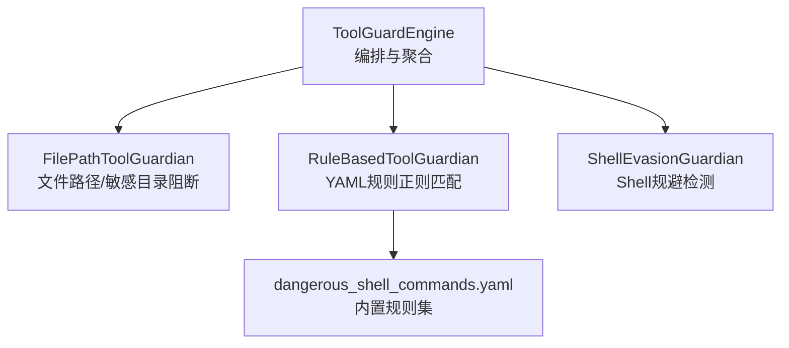
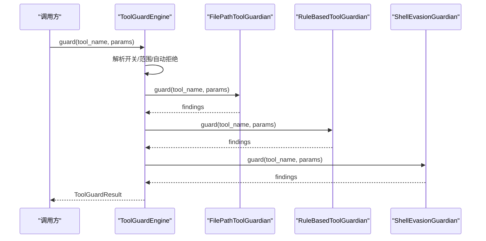
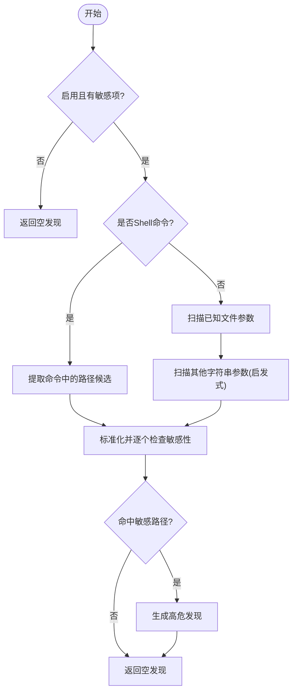
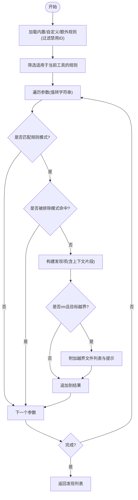
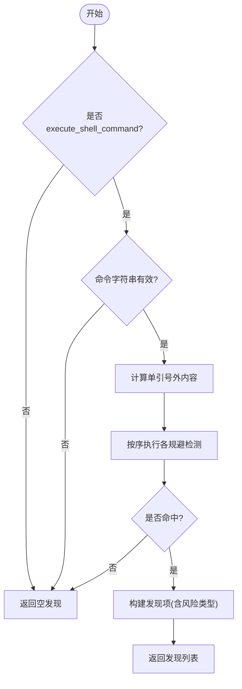
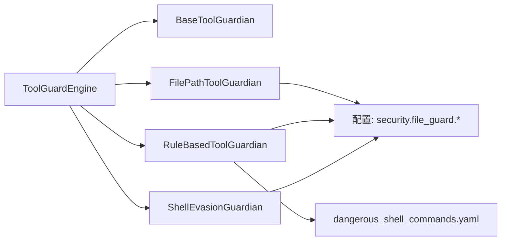

# 守护机制

<cite>
**本文引用的文件**
- [src/qwenpaw/security/tool_guard/__init__.py](file://src/qwenpaw/security/tool_guard/__init__.py)
- [src/qwenpaw/security/tool_guard/engine.py](file://src/qwenpaw/security/tool_guard/engine.py)
- [src/qwenpaw/security/tool_guard/models.py](file://src/qwenpaw/security/tool_guard/models.py)
- [src/qwenpaw/security/tool_guard/guardians/__init__.py](file://src/qwenpaw/security/tool_guard/guardians/__init__.py)
- [src/qwenpaw/security/tool_guard/guardians/file_guardian.py](file://src/qwenpaw/security/tool_guard/guardians/file_guardian.py)
- [src/qwenpaw/security/tool_guard/guardians/rule_guardian.py](file://src/qwenpaw/security/tool_guard/guardians/rule_guardian.py)
- [src/qwenpaw/security/tool_guard/guardians/shell_evasion_guardian.py](file://src/qwenpaw/security/tool_guard/guardians/shell_evasion_guardian.py)
- [src/qwenpaw/security/tool_guard/rules/dangerous_shell_commands.yaml](file://src/qwenpaw/security/tool_guard/rules/dangerous_shell_commands.yaml)
- [src/qwenpaw/security/tool_guard/approval.py](file://src/qwenpaw/security/tool_guard/approval.py)
</cite>

## 目录
1. [简介](#简介)
2. [项目结构](#项目结构)
3. [核心组件](#核心组件)
4. [架构总览](#架构总览)
5. [详细组件分析](#详细组件分析)
6. [依赖分析](#依赖分析)
7. [性能考虑](#性能考虑)
8. [故障排查指南](#故障排查指南)
9. [结论](#结论)
10. [附录](#附录)

## 简介
本文件系统性地文档化工具守卫（Tool Guard）的多种守护机制，包括：
- 文件守护（文件路径与敏感目录阻断）
- 规则守护（基于YAML签名的正则匹配）
- Shell规避守护（命令替换、转义、注释脱钩等规避技术检测）

重点覆盖：
- 各机制的触发条件、检测范围与防护策略
- 配置参数、检测阈值与误报处理机制
- 使用示例、自定义检测规则与性能优化建议
- 多机制之间的协作关系与优先级处理逻辑

## 项目结构
工具守卫模块采用“引擎 + 守护者”分层设计，引擎负责编排与聚合结果，各守护者实现具体检测逻辑；规则集中于YAML文件，支持运行时加载与热重载。

图示来源
- [src/qwenpaw/security/tool_guard/engine.py:85-110](file://src/qwenpaw/security/tool_guard/engine.py#L85-L110)
- [src/qwenpaw/security/tool_guard/guardians/file_guardian.py:301-501](file://src/qwenpaw/security/tool_guard/guardians/file_guardian.py#L301-L501)
- [src/qwenpaw/security/tool_guard/guardians/rule_guardian.py:559-758](file://src/qwenpaw/security/tool_guard/guardians/rule_guardian.py#L559-L758)
- [src/qwenpaw/security/tool_guard/guardians/shell_evasion_guardian.py:539-593](file://src/qwenpaw/security/tool_guard/guardians/shell_evasion_guardian.py#L539-L593)
- [src/qwenpaw/security/tool_guard/rules/dangerous_shell_commands.yaml:1-310](file://src/qwenpaw/security/tool_guard/rules/dangerous_shell_commands.yaml#L1-L310)

章节来源
- [src/qwenpaw/security/tool_guard/__init__.py:1-59](file://src/qwenpaw/security/tool_guard/__init__.py#L1-L59)
- [src/qwenpaw/security/tool_guard/engine.py:54-110](file://src/qwenpaw/security/tool_guard/engine.py#L54-L110)

## 核心组件
- 引擎（ToolGuardEngine）：负责守护开关、默认守护者集合、工具白名单/黑名单、自动拒绝规则、执行顺序与异常容错。
- 守护者基类（BaseToolGuardian）：统一接口，便于扩展新检测引擎。
- 文件守护者（FilePathToolGuardian）：对文件路径进行规范化、提取与敏感性判断，支持Shell命令中的路径抽取。
- 规则守护者（RuleBasedToolGuardian）：从YAML加载规则，按工具/参数维度匹配正则，支持排除模式与工作区边界检查。
- Shell规避守护者（ShellEvasionGuardian）：检测命令替换、转义、注释脱钩、引号内换行等规避技术，仅针对Shell命令。
- 数据模型（models）：统一的威胁分类、严重级别、发现项与结果聚合。
- 审批辅助（approval）：审批决策枚举与风险摘要格式化。

章节来源
- [src/qwenpaw/security/tool_guard/models.py:25-185](file://src/qwenpaw/security/tool_guard/models.py#L25-L185)
- [src/qwenpaw/security/tool_guard/guardians/__init__.py:17-62](file://src/qwenpaw/security/tool_guard/guardians/__init__.py#L17-L62)
- [src/qwenpaw/security/tool_guard/approval.py:12-42](file://src/qwenpaw/security/tool_guard/approval.py#L12-L42)

## 架构总览
工具调用在进入实际执行前，由引擎依次调用各守护者进行检测，最终汇总为ToolGuardResult。引擎支持：
- 全局开关（环境变量/配置）
- 工具范围控制（白名单/黑名单）
- 自动拒绝规则（命中即阻断）
- 按需只运行“总是运行”的守护者（如对非受控工具做路径级检查）

图示来源
- [src/qwenpaw/security/tool_guard/engine.py:200-257](file://src/qwenpaw/security/tool_guard/engine.py#L200-L257)
- [src/qwenpaw/security/tool_guard/guardians/file_guardian.py:449-501](file://src/qwenpaw/security/tool_guard/guardians/file_guardian.py#L449-L501)
- [src/qwenpaw/security/tool_guard/guardians/rule_guardian.py:608-758](file://src/qwenpaw/security/tool_guard/guardians/rule_guardian.py#L608-L758)
- [src/qwenpaw/security/tool_guard/guardians/shell_evasion_guardian.py:555-593](file://src/qwenpaw/security/tool_guard/guardians/shell_evasion_guardian.py#L555-L593)

## 详细组件分析

### 文件守护（FilePathToolGuardian）
- 触发条件
  - 工具名命中已知文件工具（如读写/发送文件），或为Shell命令且参数中包含疑似路径。
  - 当前启用状态与敏感文件/目录列表非空。
- 检测范围
  - 已知文件工具：仅扫描指定参数（如file_path、path）。
  - Shell命令：通过安全的shell解析提取路径候选，去重后逐一检查。
  - 其他工具：扫描所有字符串参数，使用启发式识别疑似路径。
- 敏感性判断
  - 对输入进行标准化（大小写归一、分隔符归一、相对路径解析至工作区根）。
  - 支持Windows风格路径识别与UNC路径处理。
  - 基于前缀匹配判断是否命中敏感目录或精确敏感文件。
- 防护策略
  - 命中即生成高危发现，提示更换为非敏感路径。
- 关键流程

图示来源
- [src/qwenpaw/security/tool_guard/guardians/file_guardian.py:449-501](file://src/qwenpaw/security/tool_guard/guardians/file_guardian.py#L449-L501)
- [src/qwenpaw/security/tool_guard/guardians/file_guardian.py:426-448](file://src/qwenpaw/security/tool_guard/guardians/file_guardian.py#L426-L448)

章节来源
- [src/qwenpaw/security/tool_guard/guardians/file_guardian.py:21-31](file://src/qwenpaw/security/tool_guard/guardians/file_guardian.py#L21-L31)
- [src/qwenpaw/security/tool_guard/guardians/file_guardian.py:147-173](file://src/qwenpaw/security/tool_guard/guardians/file_guardian.py#L147-L173)
- [src/qwenpaw/security/tool_guard/guardians/file_guardian.py:366-393](file://src/qwenpaw/security/tool_guard/guardians/file_guardian.py#L366-L393)
- [src/qwenpaw/security/tool_guard/guardians/file_guardian.py:426-448](file://src/qwenpaw/security/tool_guard/guardians/file_guardian.py#L426-L448)

### 规则守护（RuleBasedToolGuardian）
- 触发条件
  - 存在适用该工具的规则（工具白名单为空表示全匹配）。
  - 参数名称满足规则的参数白名单（为空表示全匹配）。
- 检测范围
  - 将参数值转换为字符串后进行正则匹配。
  - 支持排除模式（exclude_patterns）优先过滤。
- 特殊增强
  - rm命令：额外检查目标是否位于工作区外，并生成结构化提示与修复建议。
- 防护策略
  - 不同规则严重级别不同，引擎可据此判定是否阻断或进入审批流程。
- 关键流程

图示来源
- [src/qwenpaw/security/tool_guard/guardians/rule_guardian.py:583-594](file://src/qwenpaw/security/tool_guard/guardians/rule_guardian.py#L583-L594)
- [src/qwenpaw/security/tool_guard/guardians/rule_guardian.py:608-758](file://src/qwenpaw/security/tool_guard/guardians/rule_guardian.py#L608-L758)
- [src/qwenpaw/security/tool_guard/rules/dangerous_shell_commands.yaml:1-310](file://src/qwenpaw/security/tool_guard/rules/dangerous_shell_commands.yaml#L1-L310)

章节来源
- [src/qwenpaw/security/tool_guard/guardians/rule_guardian.py:331-425](file://src/qwenpaw/security/tool_guard/guardians/rule_guardian.py#L331-L425)
- [src/qwenpaw/security/tool_guard/guardians/rule_guardian.py:518-552](file://src/qwenpaw/security/tool_guard/guardians/rule_guardian.py#L518-L552)
- [src/qwenpaw/security/tool_guard/guardians/rule_guardian.py:645-735](file://src/qwenpaw/security/tool_guard/guardians/rule_guardian.py#L645-L735)

### Shell规避守护（ShellEvasionGuardian）
- 触发条件
  - 仅对execute_shell_command工具生效。
  - 命令参数为非空字符串。
- 检测范围与算法
  - 命令替换检测：反引号、$(...)、$[…]、Zsh进程替换等。
  - ANSI-C/本地化引号与空引号绕过：$'...'、$"..."、''/"" + -。
  - 反斜杠转义空白/操作符：隐藏命令分隔。
  - 新行/回车：跨行隐藏命令或与解析差异相关的风险。
  - 注释与引号脱钩：#注释内的引号导致后续行引号跟踪错误。
  - 引号内换行 + 下一行以#开头：可能绕过逐行注释清理。
- 防护策略
  - 对每类规避技术生成对应发现，标注风险类型，建议人工复核。
- 关键流程

图示来源
- [src/qwenpaw/security/tool_guard/guardians/shell_evasion_guardian.py:555-593](file://src/qwenpaw/security/tool_guard/guardians/shell_evasion_guardian.py#L555-L593)
- [src/qwenpaw/security/tool_guard/guardians/shell_evasion_guardian.py:115-158](file://src/qwenpaw/security/tool_guard/guardians/shell_evasion_guardian.py#L115-L158)
- [src/qwenpaw/security/tool_guard/guardians/shell_evasion_guardian.py:161-241](file://src/qwenpaw/security/tool_guard/guardians/shell_evasion_guardian.py#L161-L241)
- [src/qwenpaw/security/tool_guard/guardians/shell_evasion_guardian.py:244-307](file://src/qwenpaw/security/tool_guard/guardians/shell_evasion_guardian.py#L244-L307)
- [src/qwenpaw/security/tool_guard/guardians/shell_evasion_guardian.py:310-355](file://src/qwenpaw/security/tool_guard/guardians/shell_evasion_guardian.py#L310-L355)
- [src/qwenpaw/security/tool_guard/guardians/shell_evasion_guardian.py:377-413](file://src/qwenpaw/security/tool_guard/guardians/shell_evasion_guardian.py#L377-L413)
- [src/qwenpaw/security/tool_guard/guardians/shell_evasion_guardian.py:416-453](file://src/qwenpaw/security/tool_guard/guardians/shell_evasion_guardian.py#L416-L453)

章节来源
- [src/qwenpaw/security/tool_guard/guardians/shell_evasion_guardian.py:517-554](file://src/qwenpaw/security/tool_guard/guardians/shell_evasion_guardian.py#L517-L554)

### 引擎与审批协作
- 引擎
  - 开关：支持环境变量与配置双重来源，优先级明确。
  - 工具范围：受控工具白名单/黑名单，None表示全量。
  - 自动拒绝：命中特定规则ID直接阻断。
  - 执行顺序：默认按注册顺序，支持仅执行always_run守护者。
  - 异常容错：守护者异常记录日志但不中断整体流程。
- 审批
  - 提供审批决策枚举与风险摘要格式化工具，便于UI展示与交互。

章节来源
- [src/qwenpaw/security/tool_guard/engine.py:36-52](file://src/qwenpaw/security/tool_guard/engine.py#L36-L52)
- [src/qwenpaw/security/tool_guard/engine.py:154-172](file://src/qwenpaw/security/tool_guard/engine.py#L154-L172)
- [src/qwenpaw/security/tool_guard/engine.py:200-257](file://src/qwenpaw/security/tool_guard/engine.py#L200-L257)
- [src/qwenpaw/security/tool_guard/approval.py:12-42](file://src/qwenpaw/security/tool_guard/approval.py#L12-L42)

## 依赖分析
- 组件耦合
  - 引擎与守护者：通过统一抽象接口解耦，新增守护者无需修改引擎。
  - 规则守护者与规则文件：规则集中管理，支持运行时重载。
  - 文件守护者与配置：敏感文件列表与启用状态来自配置，支持热更新。
- 外部依赖
  - YAML解析、正则表达式、shlex解析、路径规范化与工作区上下文。

图示来源
- [src/qwenpaw/security/tool_guard/engine.py:26-29](file://src/qwenpaw/security/tool_guard/engine.py#L26-L29)
- [src/qwenpaw/security/tool_guard/guardians/rule_guardian.py:42-47](file://src/qwenpaw/security/tool_guard/guardians/rule_guardian.py#L42-L47)
- [src/qwenpaw/security/tool_guard/guardians/file_guardian.py:147-154](file://src/qwenpaw/security/tool_guard/guardians/file_guardian.py#L147-L154)
- [src/qwenpaw/security/tool_guard/guardians/shell_evasion_guardian.py:517-536](file://src/qwenpaw/security/tool_guard/guardians/shell_evasion_guardian.py#L517-L536)

## 性能考虑
- 正则预编译：规则守护者在初始化时预编译所有规则模式，避免重复编译开销。
- 排除模式优先：先用排除模式快速过滤，减少后续匹配成本。
- 字符串化扫描：将参数值统一转为字符串后扫描，降低类型分支复杂度。
- 路径解析与去重：文件守护者对候选路径进行稳定去重，避免重复检查。
- 早停策略：Shell规避守护按序执行，命中即停止某些分支（如heredoc判断）。
- 运行时重载：规则与配置变更时仅重载相关模块，不影响引擎主流程。

[本节为通用性能建议，不直接分析具体文件，故无章节来源]

## 故障排查指南
- 守护未生效
  - 检查全局开关：环境变量与配置的优先级与取值。
  - 检查工具范围：是否命中白名单/黑名单。
- 守护异常
  - 查看引擎日志：守护者抛出的异常会被记录但不会中断流程。
- 规则未命中
  - 确认规则是否被禁用（disabled_rules）。
  - 检查参数白名单与工具白名单。
  - 确认排除模式是否误伤。
- 路径误报
  - 检查敏感文件列表是否包含过宽路径。
  - 使用工作区边界检查功能定位越界风险。
- Shell规避误报
  - 通过配置启用/禁用具体规避检测项。
  - 在命令中避免使用高风险构造（如反引号、IFS注入等）。

章节来源
- [src/qwenpaw/security/tool_guard/engine.py:240-255](file://src/qwenpaw/security/tool_guard/engine.py#L240-L255)
- [src/qwenpaw/security/tool_guard/guardians/rule_guardian.py:518-552](file://src/qwenpaw/security/tool_guard/guardians/rule_guardian.py#L518-L552)
- [src/qwenpaw/security/tool_guard/guardians/shell_evasion_guardian.py:517-554](file://src/qwenpaw/security/tool_guard/guardians/shell_evasion_guardian.py#L517-L554)

## 结论
工具守卫通过“引擎 + 多守护者”的架构实现了对工具调用前的安全前置拦截。文件守护聚焦路径与敏感目录，规则守护覆盖广泛威胁类别，Shell规避守护专门对抗规避技术。配合审批与配置体系，可在保证安全性的同时兼顾灵活性与可维护性。

[本节为总结性内容，不直接分析具体文件，故无章节来源]

## 附录

### 配置参数与阈值
- 全局开关
  - 环境变量：QWENPAW_TOOL_GUARD_ENABLED（true/1/yes启用）
  - 配置：security.tool_guard.enabled
- 文件守护
  - 启用：security.file_guard.enabled
  - 敏感文件：security.file_guard.sensitive_files（支持兼容历史/当前密钥目录）
- 规则守护
  - 自定义规则：security.tool_guard.custom_rules
  - 禁用规则：security.tool_guard.disabled_rules
  - 规则目录：默认内置rules/，可自定义目录与文件列表
- Shell规避守护
  - 检测项开关：security.tool_guard.shell_evasion_checks（按名称启用）
- 审批与结果
  - 自动拒绝规则ID集合：security.tool_guard.auto_deny_rule_ids（命中即阻断）
  - 结果模型：ToolGuardResult（包含最高严重级别、发现计数、耗时等）

章节来源
- [src/qwenpaw/security/tool_guard/engine.py:36-52](file://src/qwenpaw/security/tool_guard/engine.py#L36-L52)
- [src/qwenpaw/security/tool_guard/guardians/file_guardian.py:147-173](file://src/qwenpaw/security/tool_guard/guardians/file_guardian.py#L147-L173)
- [src/qwenpaw/security/tool_guard/guardians/rule_guardian.py:518-552](file://src/qwenpaw/security/tool_guard/guardians/rule_guardian.py#L518-L552)
- [src/qwenpaw/security/tool_guard/guardians/shell_evasion_guardian.py:517-554](file://src/qwenpaw/security/tool_guard/guardians/shell_evasion_guardian.py#L517-L554)
- [src/qwenpaw/security/tool_guard/models.py:103-177](file://src/qwenpaw/security/tool_guard/models.py#L103-L177)

### 使用示例与最佳实践
- 快速启用
  - 设置全局开关为启用，确保默认守护者集合生效。
- 限制工具范围
  - 仅对execute_shell_command等高危工具启用严格规则。
- 自定义规则
  - 在配置中添加security.tool_guard.custom_rules，或提供自定义规则目录。
- 误报处理
  - 使用exclude_patterns降低误报；必要时临时禁用特定规则ID。
- Shell命令安全
  - 避免IFS注入、Unicode空白、反引号命令替换等规避手段。
  - 对rm命令增加工作区边界检查，必要时要求用户确认。

[本节为通用实践建议，不直接分析具体文件，故无章节来源]