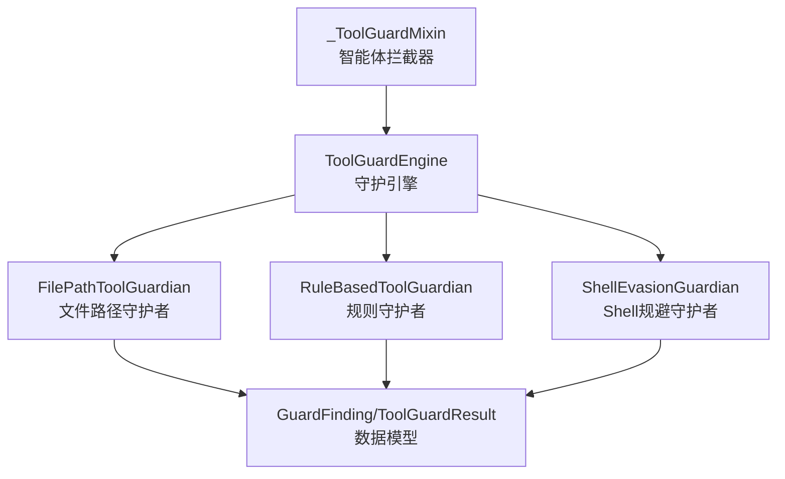
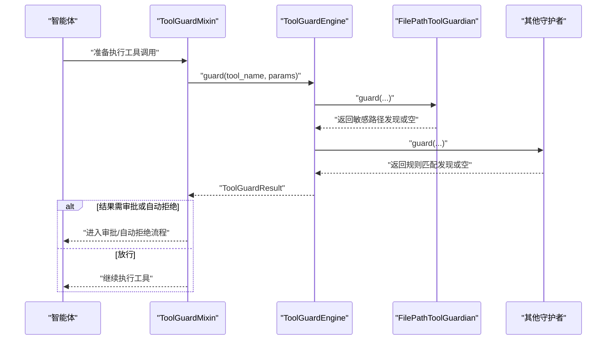
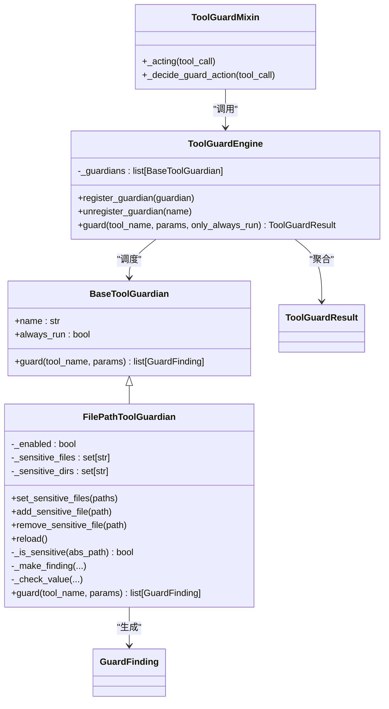
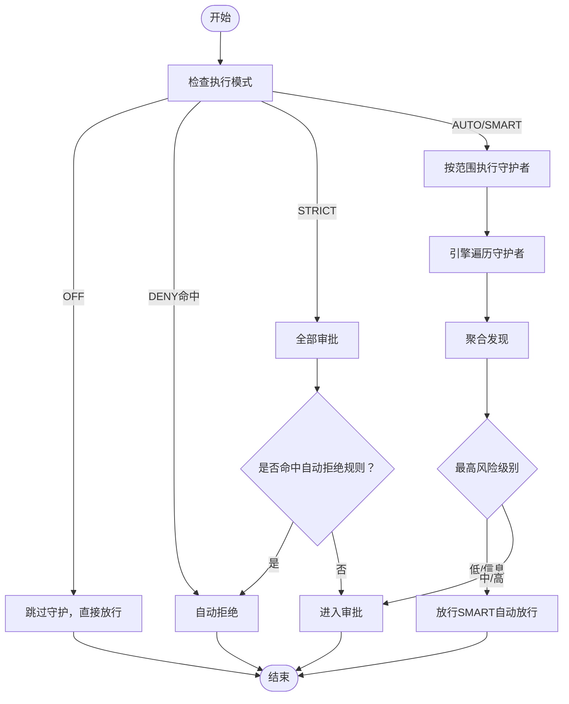
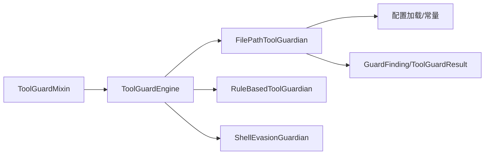

# 文件守护

<cite>
**本文引用的文件**
- [src/qwenpaw/security/tool_guard/guardians/file_guardian.py](file://src/qwenpaw/security/tool_guard/guardians/file_guardian.py)
- [src/qwenpaw/security/tool_guard/engine.py](file://src/qwenpaw/security/tool_guard/engine.py)
- [src/qwenpaw/agents/tool_guard_mixin.py](file://src/qwenpaw/agents/tool_guard_mixin.py)
- [src/qwenpaw/security/tool_guard/models.py](file://src/qwenpaw/security/tool_guard/models.py)
- [src/qwenpaw/security/tool_guard/utils.py](file://src/qwenpaw/security/tool_guard/utils.py)
- [src/qwenpaw/security/tool_guard/guardians/rule_guardian.py](file://src/qwenpaw/security/tool_guard/guardians/rule_guardian.py)
- [src/qwenpaw/security/tool_guard/guardians/shell_evasion_guardian.py](file://src/qwenpaw/security/tool_guard/guardians/shell_evasion_guardian.py)
- [website/public/docs/security.en.md](file://website/public/docs/security.en.md)
</cite>

## 目录
1. [简介](#简介)
2. [项目结构](#项目结构)
3. [核心组件](#核心组件)
4. [架构总览](#架构总览)
5. [详细组件分析](#详细组件分析)
6. [依赖分析](#依赖分析)
7. [性能考虑](#性能考虑)
8. [故障排查指南](#故障排查指南)
9. [结论](#结论)
10. [附录](#附录)

## 简介
本文件针对“文件守护”机制进行系统化技术文档化，重点围绕 FilePathToolGuardian 类的实现原理展开，涵盖以下方面：
- 敏感文件路径检测算法与递归目录保护策略
- 路径规范化处理（POSIX 与 Windows 兼容）
- 配置参数与敏感文件列表管理
- 文件路径提取算法（含 shell 重定向操作符识别）
- 使用示例、自定义敏感文件配置与性能优化建议
- 与其他守护机制的协作关系与优先级处理逻辑

## 项目结构
文件守护位于安全子系统的工具守卫（Tool Guard）框架内，采用“引擎 + 守护者”的分层设计：
- 引擎负责注册、调度与聚合多个守护者，并统一输出结果
- FilePathToolGuardian 作为独立守护者之一，专注于敏感文件路径检查
- 工具守卫混入在智能体执行前拦截工具调用，按策略决定是否放行或进入审批流程

图表来源
- [src/qwenpaw/security/tool_guard/engine.py:85-110](file://src/qwenpaw/security/tool_guard/engine.py#L85-L110)
- [src/qwenpaw/security/tool_guard/guardians/file_guardian.py:301-302](file://src/qwenpaw/security/tool_guard/guardians/file_guardian.py#L301-L302)
- [src/qwenpaw/agents/tool_guard_mixin.py:138-176](file://src/qwenpaw/agents/tool_guard_mixin.py#L138-L176)
- [src/qwenpaw/security/tool_guard/models.py:60-104](file://src/qwenpaw/security/tool_guard/models.py#L60-L104)

章节来源
- [src/qwenpaw/security/tool_guard/engine.py:54-110](file://src/qwenpaw/security/tool_guard/engine.py#L54-L110)
- [src/qwenpaw/agents/tool_guard_mixin.py:138-176](file://src/qwenpaw/agents/tool_guard_mixin.py#L138-L176)

## 核心组件
- FilePathToolGuardian：负责敏感文件/目录阻断的核心守护者，支持：
  - 已知文件工具（如 read_file/write_file 等）的专用参数扫描
  - Shell 命令字符串中的路径提取与重定向目标识别
  - 对所有字符串参数中疑似路径的启发式扫描
  - 绝对化与规范化路径比较，支持递归目录保护
- ToolGuardEngine：守护引擎，统一注册默认守护者（含文件守护），并按策略执行
- ToolGuardMixin：智能体拦截器，在执行前运行守护引擎，依据严重级别与执行模式决定自动拒绝、审批或放行
- 数据模型 GuardFinding/ToolGuardResult：标准化的发现与结果载体

章节来源
- [src/qwenpaw/security/tool_guard/guardians/file_guardian.py:301-501](file://src/qwenpaw/security/tool_guard/guardians/file_guardian.py#L301-L501)
- [src/qwenpaw/security/tool_guard/engine.py:54-110](file://src/qwenpaw/security/tool_guard/engine.py#L54-L110)
- [src/qwenpaw/agents/tool_guard_mixin.py:138-305](file://src/qwenpaw/agents/tool_guard_mixin.py#L138-L305)
- [src/qwenpaw/security/tool_guard/models.py:60-104](file://src/qwenpaw/security/tool_guard/models.py#L60-L104)

## 架构总览
文件守护在工具调用生命周期中的位置如下：

图表来源
- [src/qwenpaw/agents/tool_guard_mixin.py:178-305](file://src/qwenpaw/agents/tool_guard_mixin.py#L178-L305)
- [src/qwenpaw/security/tool_guard/engine.py:200-257](file://src/qwenpaw/security/tool_guard/engine.py#L200-L257)
- [src/qwenpaw/security/tool_guard/guardians/file_guardian.py:449-501](file://src/qwenpaw/security/tool_guard/guardians/file_guardian.py#L449-L501)

## 详细组件分析

### FilePathToolGuardian 类详解
- 角色定位
  - 名称与运行策略：始终运行（always_run=True），确保对所有工具调用进行敏感路径检查
  - 默认启用：从配置加载开关状态；若未配置则默认启用
- 敏感文件与目录管理
  - set_sensitive_files：批量设置敏感路径集合，自动区分文件与目录（以斜杠结尾或实际目录即视为目录保护）
  - add/remove：动态增删敏感路径
  - reload：从配置重新加载敏感列表
- 路径规范化与跨平台兼容
  - _normalize_path：统一将输入路径规范化为绝对路径字符串
    - Windows 检测：通过正则与信号字符判断是否为 Windows 风格路径
    - Windows 规范化：使用 ntpath 进行解析与拼接，最终转为小写斜杠形式，适配 NTFS 大小写不敏感
    - POSIX 规范化：使用 Path.expanduser + resolve(strict=False)，结合工作区根目录处理相对路径
  - _canonicalize_windows_path：在非 Windows 平台也能正确处理 Windows 风格路径（测试与混合环境常用）
- 路径提取与 shell 重定向识别
  - 已知文件工具：仅扫描专用参数（如 file_path）
  - Shell 命令：_extract_paths_from_shell_command
    - 使用 shlex.split 解析命令，Windows 下 posix=False 以避免反斜杠被误删
    - 分离与附着两类重定向：如 “> out.txt”、“2>err.log”、“< in.txt”
    - 去除引号与转义边界，稳定去重后提取候选路径
  - 其他工具：对每个字符串参数调用 _looks_like_path_token 判断是否为路径风格，再进行规范化与匹配
- 匹配与阻断
  - _is_sensitive：对规范化后的绝对路径进行匹配
    - 文件精确匹配
    - 目录递归匹配：去除尾部分隔符后，使用前缀匹配（同时兼容 “/” 与 “\” 分隔符），实现目录内文件与子目录的全量阻断
  - _make_finding：构造高风险发现，包含工具名、参数名、原始值、匹配路径与修复建议
- 执行流程
  - guard：根据工具类型分流到上述三种扫描路径，收集所有发现并返回

图表来源
- [src/qwenpaw/security/tool_guard/guardians/__init__.py:17-61](file://src/qwenpaw/security/tool_guard/guardians/__init__.py#L17-L61)
- [src/qwenpaw/security/tool_guard/guardians/file_guardian.py:301-501](file://src/qwenpaw/security/tool_guard/guardians/file_guardian.py#L301-L501)
- [src/qwenpaw/security/tool_guard/engine.py:54-110](file://src/qwenpaw/security/tool_guard/engine.py#L54-L110)
- [src/qwenpaw/agents/tool_guard_mixin.py:138-305](file://src/qwenpaw/agents/tool_guard_mixin.py#L138-L305)
- [src/qwenpaw/security/tool_guard/models.py:60-104](file://src/qwenpaw/security/tool_guard/models.py#L60-L104)

章节来源
- [src/qwenpaw/security/tool_guard/guardians/file_guardian.py:301-501](file://src/qwenpaw/security/tool_guard/guardians/file_guardian.py#L301-L501)

### 路径规范化与跨平台兼容
- Windows 风格识别
  - 正则：驱动器盘符、UNC 路径、以反斜杠开头等
  - 语义：当路径包含反斜杠或符合上述正则时，判定为 Windows 风格
- 规范化策略
  - Windows：使用 ntpath 进行扩展、拼接与规范化，最终统一为小写斜杠
  - POSIX：使用 Path.expanduser + resolve(strict=False)，结合当前工作区根目录
- 重要注意
  - 在非 Windows 主机上也能正确处理 Windows 风格路径（测试与混合环境）

章节来源
- [src/qwenpaw/security/tool_guard/guardians/file_guardian.py:90-144](file://src/qwenpaw/security/tool_guard/guardians/file_guardian.py#L90-L144)

### 文件路径提取与 shell 重定向操作符检测
- 已知文件工具
  - 通过预定义映射表直接扫描专用参数（如 file_path）
- Shell 命令
  - 使用 shlex.split 解析命令，Windows 下 posix=False
  - 分离重定向：如 “>”、“>>”、“1>”、“2>”、“&>”、“<”、“<<”、“<<<”
  - 附着与分离两类处理：先处理分离式重定向（操作符与下一个 token），再处理附着式重定向（操作符+路径）
  - 去引号与转义边界处理，稳定去重后提取候选路径
- 其他工具
  - 对每个字符串参数调用启发式函数判断是否为路径风格（排除 http/ftp/data/mime 前缀、排除以 “-” 开头的参数等）

章节来源
- [src/qwenpaw/security/tool_guard/guardians/file_guardian.py:246-298](file://src/qwenpaw/security/tool_guard/guardians/file_guardian.py#L246-L298)

### 目录保护机制与递归阻断
- 目录识别
  - 若路径为真实目录或以 “/” 或 “\” 结尾，则视为目录保护
- 递归阻断
  - 匹配时去除尾部分隔符，使用前缀匹配（同时兼容 “/” 与 “\”），从而阻断该目录下所有文件与子目录

章节来源
- [src/qwenpaw/security/tool_guard/guardians/file_guardian.py:334-392](file://src/qwenpaw/security/tool_guard/guardians/file_guardian.py#L334-L392)

### 配置参数与敏感文件列表管理
- 启用控制
  - security.file_guard.enabled：从配置加载，默认启用
- 敏感文件列表
  - security.file_guard.sensitive_files：用户可配置敏感路径列表
  - 默认行为：若为空（新安装），自动加入兼容的密钥目录（兼容历史与当前名称）
- 动态管理
  - set_sensitive_files：替换整组敏感路径
  - add_sensitive_file/remove_sensitive_file：单条增删
  - reload：从配置刷新

章节来源
- [src/qwenpaw/security/tool_guard/guardians/file_guardian.py:147-172](file://src/qwenpaw/security/tool_guard/guardians/file_guardian.py#L147-L172)
- [website/public/docs/security.en.md:290-303](file://website/public/docs/security.en.md#L290-L303)

### 与其他守护机制的协作与优先级
- 默认守护者集合
  - FilePathToolGuardian（始终运行）、RuleBasedToolGuardian（规则匹配）、ShellEvasionGuardian（Shell 规避检测）
- 执行顺序
  - 引擎遍历守护者列表，依次执行 guard，聚合所有发现
- 优先级与策略
  - ToolGuardMixin 决策流程：
    - OFF 模式：完全跳过守护
    - DENY 列表命中：直接自动拒绝
    - STRICT 模式：所有工具均需审批，无低风险自动放行
    - AUTO/SMART 模式：仅中高风险需要审批；SMART 模式对低风险自动放行
  - 引擎层面还支持“自动拒绝规则”，一旦发现命中即直接拒绝

图表来源
- [src/qwenpaw/agents/tool_guard_mixin.py:178-305](file://src/qwenpaw/agents/tool_guard_mixin.py#L178-L305)
- [src/qwenpaw/security/tool_guard/engine.py:85-110](file://src/qwenpaw/security/tool_guard/engine.py#L85-L110)

章节来源
- [src/qwenpaw/security/tool_guard/engine.py:54-110](file://src/qwenpaw/security/tool_guard/engine.py#L54-L110)
- [src/qwenpaw/agents/tool_guard_mixin.py:178-305](file://src/qwenpaw/agents/tool_guard_mixin.py#L178-L305)

## 依赖分析
- 组件耦合
  - FilePathToolGuardian 依赖配置加载、常量（工作区与密钥目录）、工具守卫数据模型
  - ToolGuardEngine 统一注册默认守护者并聚合结果
  - ToolGuardMixin 在智能体执行前拦截，按策略决定后续流程
- 外部依赖
  - shlex：跨平台 shell 令牌解析
  - re/pathlib/os/ntpath：路径识别与规范化
  - yaml（规则守护者）：规则文件加载与匹配

图表来源
- [src/qwenpaw/security/tool_guard/guardians/file_guardian.py:16-19](file://src/qwenpaw/security/tool_guard/guardians/file_guardian.py#L16-L19)
- [src/qwenpaw/security/tool_guard/engine.py:26-29](file://src/qwenpaw/security/tool_guard/engine.py#L26-L29)
- [src/qwenpaw/agents/tool_guard_mixin.py:93-98](file://src/qwenpaw/agents/tool_guard_mixin.py#L93-L98)

章节来源
- [src/qwenpaw/security/tool_guard/guardians/file_guardian.py:16-19](file://src/qwenpaw/security/tool_guard/guardians/file_guardian.py#L16-L19)
- [src/qwenpaw/security/tool_guard/engine.py:26-29](file://src/qwenpaw/security/tool_guard/engine.py#L26-L29)

## 性能考虑
- 路径规范化
  - Windows 风格路径在非 Windows 主机上使用 ntpath 规范化，避免额外 I/O 与解析开销
  - POSIX 路径使用 resolve(strict=False)，减少异常抛出成本
- shell 解析
  - 使用最长优先的重定向操作符排序，避免多余匹配
  - shlex.split 在 Windows 下 posix=False，减少引号与反斜杠处理复杂度
- 匹配策略
  - 目录保护采用前缀匹配，避免对大量子文件逐一比对
  - 候选路径稳定去重，降低重复计算
- 执行模式
  - AUTO/SMART 模式对低风险自动放行，减少审批与日志压力

[本节为通用性能建议，无需特定文件来源]

## 故障排查指南
- 常见问题
  - 路径未生效：确认 security.file_guard.enabled 与 sensitive_files 是否正确配置；必要时调用 reload 刷新
  - Windows 路径误判：检查是否包含反斜杠或驱动器盘符；确保在非 Windows 主机上使用 _canonicalize_windows_path
  - shell 命令未识别：确认重定向操作符格式（分离式与附着式）；检查引号与转义是否被正确剥离
  - 目录保护无效：确认路径以 “/” 或 “\” 结尾或确为真实目录
- 日志与告警
  - 引擎会记录每次守护的摘要与详细发现，便于定位具体工具与参数
  - ToolGuardMixin 将根据严重级别输出 info/warning 级别日志

章节来源
- [src/qwenpaw/security/tool_guard/utils.py:159-193](file://src/qwenpaw/security/tool_guard/utils.py#L159-L193)
- [src/qwenpaw/security/tool_guard/engine.py:240-257](file://src/qwenpaw/security/tool_guard/engine.py#L240-L257)

## 结论
FilePathToolGuardian 通过“已知参数扫描 + shell 命令路径提取 + 其他参数启发式扫描”的多场景覆盖，结合跨平台路径规范化与目录递归保护，形成稳健的敏感文件防护体系。配合 ToolGuardEngine 与 ToolGuardMixin 的策略化执行，可在不同执行模式下灵活平衡安全与可用性。

[本节为总结性内容，无需特定文件来源]

## 附录

### 使用示例与最佳实践
- 启用与配置
  - 在配置中开启 security.file_guard.enabled，并在 security.file_guard.sensitive_files 中添加敏感路径
  - 新安装时若为空，将自动保护兼容的密钥目录
- 自定义敏感文件
  - 使用 set_sensitive_files/add_sensitive_file/remove_sensitive_file 动态维护敏感列表
  - 目录保护：以 “/” 或 “\” 结尾或传入真实目录即可
- 性能优化
  - 合理设置 guarded_tools 与 denied_tools，缩小扫描范围
  - 在 SMART 模式下减少审批压力
  - 避免在敏感文件列表中使用过多通配，优先精确路径

章节来源
- [website/public/docs/security.en.md:290-303](file://website/public/docs/security.en.md#L290-L303)
- [src/qwenpaw/security/tool_guard/guardians/file_guardian.py:323-359](file://src/qwenpaw/security/tool_guard/guardians/file_guardian.py#L323-L359)
- [src/qwenpaw/security/tool_guard/utils.py:64-96](file://src/qwenpaw/security/tool_guard/utils.py#L64-L96)