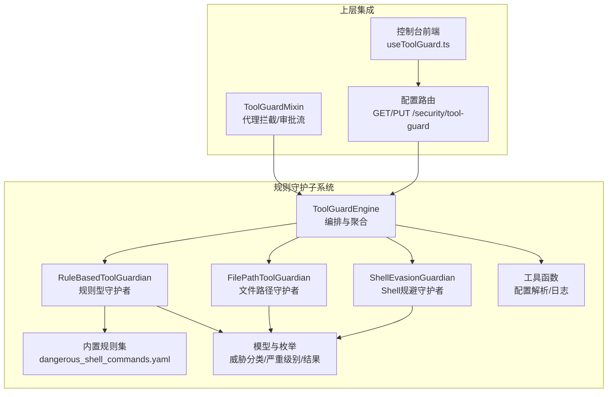
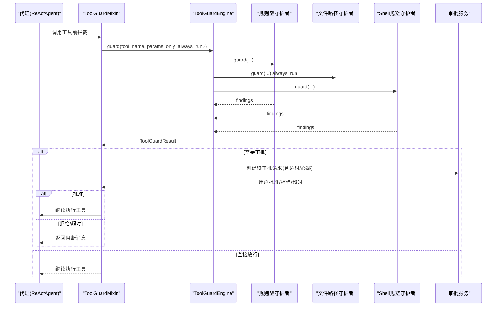
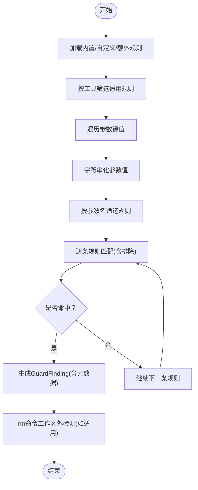
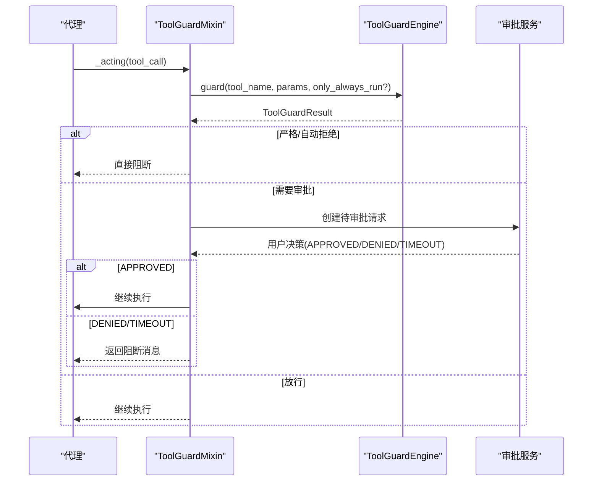
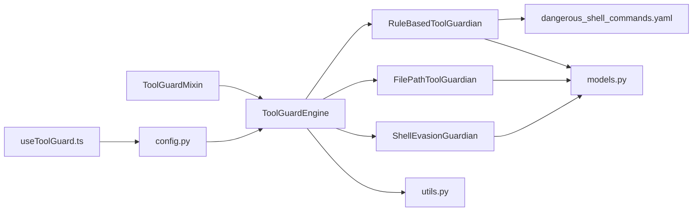

# 规则守护

<cite>
**本文引用的文件**
- [engine.py](file://src/qwenpaw/security/tool_guard/engine.py)
- [rule_guardian.py](file://src/qwenpaw/security/tool_guard/guardians/rule_guardian.py)
- [file_guardian.py](file://src/qwenpaw/security/tool_guard/guardians/file_guardian.py)
- [shell_evasion_guardian.py](file://src/qwenpaw/security/tool_guard/guardians/shell_evasion_guardian.py)
- [models.py](file://src/qwenpaw/security/tool_guard/models.py)
- [utils.py](file://src/qwenpaw/security/tool_guard/utils.py)
- [dangerous_shell_commands.yaml](file://src/qwenpaw/security/tool_guard/rules/dangerous_shell_commands.yaml)
- [tool_guard_mixin.py](file://src/qwenpaw/agents/tool_guard_mixin.py)
- [execution_level.py](file://src/qwenpaw/security/tool_guard/execution_level.py)
- [config.py](file://src/qwenpaw/app/routers/config.py)
- [useToolGuard.ts](file://console/src/pages/Settings/Security/useToolGuard.ts)
- [security.en.md](file://website/public/docs/security.en.md)
</cite>

## 目录
1. [简介](#简介)
2. [项目结构](#项目结构)
3. [核心组件](#核心组件)
4. [架构总览](#架构总览)
5. [详细组件分析](#详细组件分析)
6. [依赖关系分析](#依赖关系分析)
7. [性能考量](#性能考量)
8. [故障排查指南](#故障排查指南)
9. [结论](#结论)
10. [附录](#附录)

## 简介
本文件系统性阐述“规则守护”机制，围绕基于预定义规则集的工具调用检测与威胁识别展开，覆盖规则配置格式、匹配模式、检测逻辑、动态更新、执行策略与与文件守护、shell规避守护的协同机制。文档同时提供使用示例、自定义规则编写指南、测试方法、性能优化建议、误报处理与规则优先级管理策略。

## 项目结构
规则守护位于安全子系统中，采用“引擎 + 多守护者”的架构设计：
- 引擎负责编排与聚合各守护者的检测结果
- 守护者按职责划分：规则型（正则签名）、文件路径型（敏感路径阻断）、shell规避型（反混淆/反逃逸）
- 模型层定义威胁分类、严重级别与检测结果结构
- 工具层解析配置、计算自动拒绝规则、日志输出
- 配置路由与控制台前端提供运行时动态更新能力

图表来源
- [engine.py:54-269](file://src/qwenpaw/security/tool_guard/engine.py#L54-L269)
- [rule_guardian.py:559-758](file://src/qwenpaw/security/tool_guard/guardians/rule_guardian.py#L559-L758)
- [file_guardian.py:301-501](file://src/qwenpaw/security/tool_guard/guardians/file_guardian.py#L301-L501)
- [shell_evasion_guardian.py:539-593](file://src/qwenpaw/security/tool_guard/guardians/shell_evasion_guardian.py#L539-L593)
- [models.py:25-185](file://src/qwenpaw/security/tool_guard/models.py#L25-L185)
- [utils.py:64-194](file://src/qwenpaw/security/tool_guard/utils.py#L64-L194)
- [dangerous_shell_commands.yaml:1-310](file://src/qwenpaw/security/tool_guard/rules/dangerous_shell_commands.yaml#L1-L310)
- [tool_guard_mixin.py:138-517](file://src/qwenpaw/agents/tool_guard_mixin.py#L138-L517)
- [config.py:661-748](file://src/qwenpaw/app/routers/config.py#L661-L748)
- [useToolGuard.ts:27-124](file://console/src/pages/Settings/Security/useToolGuard.ts#L27-L124)

章节来源
- [engine.py:54-269](file://src/qwenpaw/security/tool_guard/engine.py#L54-L269)
- [rule_guardian.py:559-758](file://src/qwenpaw/security/tool_guard/guardians/rule_guardian.py#L559-L758)
- [file_guardian.py:301-501](file://src/qwenpaw/security/tool_guard/guardians/file_guardian.py#L301-L501)
- [shell_evasion_guardian.py:539-593](file://src/qwenpaw/security/tool_guard/guardians/shell_evasion_guardian.py#L539-L593)
- [models.py:25-185](file://src/qwenpaw/security/tool_guard/models.py#L25-L185)
- [utils.py:64-194](file://src/qwenpaw/security/tool_guard/utils.py#L64-L194)
- [dangerous_shell_commands.yaml:1-310](file://src/qwenpaw/security/tool_guard/rules/dangerous_shell_commands.yaml#L1-L310)
- [tool_guard_mixin.py:138-517](file://src/qwenpaw/agents/tool_guard_mixin.py#L138-L517)
- [config.py:661-748](file://src/qwenpaw/app/routers/config.py#L661-L748)
- [useToolGuard.ts:27-124](file://console/src/pages/Settings/Security/useToolGuard.ts#L27-L124)

## 核心组件
- 工具调用引擎（ToolGuardEngine）：统一调度多个守护者，聚合结果，支持动态启用/禁用、规则重载、自动拒绝规则判定、仅always_run守护者执行等。
- 规则型守护者（RuleBasedToolGuardian）：从YAML加载规则，对字符串化参数值进行正则匹配；支持排除模式、针对rm命令的工作区外路径检查增强。
- 文件路径守护者（FilePathToolGuardian）：阻断对敏感文件/目录的访问；支持从配置加载、路径归一化、Windows/POSIX兼容、从shell命令提取候选路径。
- Shell规避守护者（ShellEvasionGuardian）：检测命令替换、标志位混淆、转义空白符/操作符、换行隐藏命令、注释引号不同步、带引号换行+注释剥离等规避技术。
- 数据模型（models.py）：定义威胁类别、严重级别、检测发现（GuardFinding）与结果聚合（ToolGuardResult），并提供序列化与统计属性。
- 工具函数（utils.py）：解析受保护工具集合、被禁止工具集合、自动拒绝规则集合；提供结构化日志输出。
- 内置规则集（dangerous_shell_commands.yaml）：涵盖破坏性、资源滥用、权限提升、网络滥用、路径遍历、反混淆等威胁场景的正则签名。
- 执行级别（execution_level.py）：定义STRICT/AUTO/SMART/OFF四种执行策略，影响审批流程与自动放行行为。
- 上层集成（tool_guard_mixin.py）：在代理的_acting/_reasoning阶段插入拦截与审批流，支持超时心跳、用户批准/拒绝、自动拒绝与UI消息生成。
- 配置与前端（config.py, useToolGuard.ts）：提供REST接口读写工具守护配置，前端可动态加载内置规则、编辑自定义规则、切换规避检查项。

章节来源
- [engine.py:54-269](file://src/qwenpaw/security/tool_guard/engine.py#L54-L269)
- [rule_guardian.py:559-758](file://src/qwenpaw/security/tool_guard/guardians/rule_guardian.py#L559-L758)
- [file_guardian.py:301-501](file://src/qwenpaw/security/tool_guard/guardians/file_guardian.py#L301-L501)
- [shell_evasion_guardian.py:539-593](file://src/qwenpaw/security/tool_guard/guardians/shell_evasion_guardian.py#L539-L593)
- [models.py:25-185](file://src/qwenpaw/security/tool_guard/models.py#L25-L185)
- [utils.py:64-194](file://src/qwenpaw/security/tool_guard/utils.py#L64-L194)
- [dangerous_shell_commands.yaml:1-310](file://src/qwenpaw/security/tool_guard/rules/dangerous_shell_commands.yaml#L1-L310)
- [execution_level.py:15-79](file://src/qwenpaw/security/tool_guard/execution_level.py#L15-L79)
- [tool_guard_mixin.py:138-517](file://src/qwenpaw/agents/tool_guard_mixin.py#L138-L517)
- [config.py:661-748](file://src/qwenpaw/app/routers/config.py#L661-L748)
- [useToolGuard.ts:27-124](file://console/src/pages/Settings/Security/useToolGuard.ts#L27-L124)

## 架构总览
规则守护以“引擎为中心”的多守护者协作模型，贯穿“规则加载—参数扫描—结果聚合—审批决策—执行/阻断”的完整链路，并与文件守护、shell规避守护形成互补。

图表来源
- [tool_guard_mixin.py:138-517](file://src/qwenpaw/agents/tool_guard_mixin.py#L138-L517)
- [engine.py:200-258](file://src/qwenpaw/security/tool_guard/engine.py#L200-L258)
- [rule_guardian.py:608-758](file://src/qwenpaw/security/tool_guard/guardians/rule_guardian.py#L608-L758)
- [file_guardian.py:449-501](file://src/qwenpaw/security/tool_guard/guardians/file_guardian.py#L449-L501)
- [shell_evasion_guardian.py:555-593](file://src/qwenpaw/security/tool_guard/guardians/shell_evasion_guardian.py#L555-L593)

## 详细组件分析

### 规则型守护者（RuleBasedToolGuardian）
- 规则来源与合并
  - 内置规则：从默认规则目录加载YAML文件，当前默认包含危险shell命令规则集。
  - 自定义规则：从配置中读取custom_rules，合并后剔除disabled_rules。
  - 额外规则：可通过构造函数注入额外规则。
- 匹配逻辑
  - 仅对字符串化后的参数值进行扫描；若参数为空则跳过。
  - 先按工具名过滤适用规则，再按参数名过滤；最后对每个规则尝试匹配，支持忽略模式（exclude_patterns）优先。
  - 对命中规则生成GuardFinding，包含标题、描述、严重级别、威胁类别、匹配片段、修复建议、元数据等。
- 特殊增强
  - rm命令工作区外路径检测：解析命令中的目标路径，判断是否位于工作区外，若存在则在描述与修复建议中给出明确提示与结构化元数据，便于前端展示。
- 性能要点
  - 规则与排除模式均预编译为正则对象，避免重复编译开销。
  - 仅在适用工具/参数上执行匹配，减少不必要扫描。

图表来源
- [rule_guardian.py:583-758](file://src/qwenpaw/security/tool_guard/guardians/rule_guardian.py#L583-L758)
- [dangerous_shell_commands.yaml:13-188](file://src/qwenpaw/security/tool_guard/rules/dangerous_shell_commands.yaml#L13-L188)

章节来源
- [rule_guardian.py:559-758](file://src/qwenpaw/security/tool_guard/guardians/rule_guardian.py#L559-L758)
- [dangerous_shell_commands.yaml:1-310](file://src/qwenpaw/security/tool_guard/rules/dangerous_shell_commands.yaml#L1-L310)

### 文件路径守护者（FilePathToolGuardian）
- 敏感路径管理
  - 支持从配置加载敏感文件/目录列表，自动去重与标准化；目录以斜杠结尾或为目录即视为目录守卫。
  - 默认包含兼容的历史/当前秘密目录，确保默认保护。
- 命令解析与路径提取
  - 对execute_shell_command：使用shlex按平台解析命令，提取重定向与路径参数，去除引号干扰，识别可能的敏感路径。
  - 对已知文件类工具：仅检查声明的文件路径参数。
  - 对其他工具：对所有疑似路径的字符串参数进行扫描。
- 路径归一化与比较
  - 统一归一化为绝对路径，Windows下大小写不敏感、斜杠统一；通过前缀匹配判断是否命中目录守卫。
- 结果生成
  - 命中时生成高危发现，包含原始值、匹配路径、修复建议与解析后的绝对路径元数据。

章节来源
- [file_guardian.py:301-501](file://src/qwenpaw/security/tool_guard/guardians/file_guardian.py#L301-L501)

### Shell规避守护者（ShellEvasionGuardian）
- 检测范围
  - 命令替换：$(...)、`...`、=()、Zsh扩展等
  - 标志位混淆：ANSI-C引号、locale引号、空引号+短横线组合
  - 反斜杠转义空白符/操作符
  - 新行/回车隐藏命令
  - 注释内引号不同步
  - 带引号换行+注释剥离
- 执行策略
  - 仅对execute_shell_command触发
  - 支持按配置逐项开启/关闭具体检查
  - 逐项执行检查，收集所有发现

章节来源
- [shell_evasion_guardian.py:539-593](file://src/qwenpaw/security/tool_guard/guardians/shell_evasion_guardian.py#L539-L593)

### 引擎与审批流程（ToolGuardMixin + Engine）
- 引擎职责
  - 统一注册/注销守护者，按always_run策略选择执行守护者
  - 动态启用/禁用、规则重载、自动拒绝规则判定
  - 计时与错误记录，聚合结果
- 执行级别策略
  - OFF：完全绕过
  - STRICT：所有工具均需审批
  - SMART：低风险自动放行，中高风险需要审批
  - AUTO：仅受保护工具需要审批（向后兼容）
- 审批交互
  - 通过审批服务创建待审批请求，支持超时与心跳保活
  - 用户批准/拒绝/超时三种结果，分别执行工具或阻断
  - 严格模式下无发现也会生成信息级发现以触发审批

图表来源
- [tool_guard_mixin.py:138-517](file://src/qwenpaw/agents/tool_guard_mixin.py#L138-L517)
- [engine.py:200-258](file://src/qwenpaw/security/tool_guard/engine.py#L200-L258)
- [execution_level.py:15-79](file://src/qwenpaw/security/tool_guard/execution_level.py#L15-L79)

章节来源
- [engine.py:54-269](file://src/qwenpaw/security/tool_guard/engine.py#L54-L269)
- [tool_guard_mixin.py:138-517](file://src/qwenpaw/agents/tool_guard_mixin.py#L138-L517)
- [execution_level.py:15-79](file://src/qwenpaw/security/tool_guard/execution_level.py#L15-L79)

### 配置与动态更新
- 配置项（来自文档与实现）
  - enabled：是否启用工具守护
  - guarded_tools：受保护工具集合（null表示全部，[]表示无）
  - denied_tools：无条件禁止的工具
  - custom_rules：自定义规则数组
  - disabled_rules：禁用的内置规则ID
  - auto_denied_rules：命中即自动拒绝的规则ID
  - shell_evasion_checks：逐项开关规避检测
- 运行时更新
  - PUT /security/tool-guard 更新配置并触发引擎reload_rules
  - 控制台前端支持加载内置规则、编辑自定义规则、切换规避检查项

章节来源
- [config.py:661-748](file://src/qwenpaw/app/routers/config.py#L661-L748)
- [useToolGuard.ts:27-124](file://console/src/pages/Settings/Security/useToolGuard.ts#L27-L124)
- [security.en.md:79-152](file://website/public/docs/security.en.md#L79-L152)

## 依赖关系分析
- 组件耦合
  - 引擎与守护者：松耦合，通过统一guard接口聚合结果
  - 守护者之间无直接依赖，各自独立完成职责
  - 上层代理通过Mixin与引擎交互，保持代理主流程清晰
- 外部依赖
  - 配置加载：从全局配置读取工具守护设置
  - 日志：结构化输出，区分高危与一般级别
  - 审批服务：提供超时、心跳、取消等能力

图表来源
- [engine.py:54-269](file://src/qwenpaw/security/tool_guard/engine.py#L54-L269)
- [rule_guardian.py:559-758](file://src/qwenpaw/security/tool_guard/guardians/rule_guardian.py#L559-L758)
- [file_guardian.py:301-501](file://src/qwenpaw/security/tool_guard/guardians/file_guardian.py#L301-L501)
- [shell_evasion_guardian.py:539-593](file://src/qwenpaw/security/tool_guard/guardians/shell_evasion_guardian.py#L539-L593)
- [models.py:25-185](file://src/qwenpaw/security/tool_guard/models.py#L25-L185)
- [utils.py:64-194](file://src/qwenpaw/security/tool_guard/utils.py#L64-L194)
- [dangerous_shell_commands.yaml:1-310](file://src/qwenpaw/security/tool_guard/rules/dangerous_shell_commands.yaml#L1-L310)
- [tool_guard_mixin.py:138-517](file://src/qwenpaw/agents/tool_guard_mixin.py#L138-L517)
- [config.py:661-748](file://src/qwenpaw/app/routers/config.py#L661-L748)
- [useToolGuard.ts:27-124](file://console/src/pages/Settings/Security/useToolGuard.ts#L27-L124)

## 性能考量
- 正则预编译：规则与排除模式在初始化时编译，避免重复开销
- 早停策略：命中排除模式立即跳过，命中规则立即生成发现并停止该规则后续匹配
- 参数扫描范围控制：仅对字符串化且非空的参数值扫描；按工具/参数维度过滤规则
- always_run守护者：文件路径守护者始终运行，确保路径层面的最低限度保护
- 并发与锁：审批决策在锁内串行，实际工具执行在锁外并行，兼顾一致性与吞吐

## 故障排查指南
- 规则未生效
  - 检查enabled与guarded_tools配置；确认规则未被disabled_rules禁用
  - 使用PUT /security/tool-guard后确认引擎reload_rules已执行
- 误报处理
  - 在规则中添加更严格的exclude_patterns
  - 将误报规则加入disabled_rules临时屏蔽
  - 调整执行级别（SMART可自动放行低风险）
- 审批超时/卡住
  - 检查审批超时配置与心跳间隔
  - 确认会话ID可用，否则无法进入审批流程
- Shell规避检测误报
  - 逐项关闭shell_evasion_checks中误报对应的检查项
- 日志定位
  - 使用log_findings输出的结构化日志快速定位工具名、参数、规则ID与匹配值

章节来源
- [utils.py:159-194](file://src/qwenpaw/security/tool_guard/utils.py#L159-L194)
- [tool_guard_mixin.py:519-616](file://src/qwenpaw/agents/tool_guard_mixin.py#L519-L616)
- [config.py:679-692](file://src/qwenpaw/app/routers/config.py#L679-L692)

## 结论
规则守护通过“引擎 + 多守护者”的模块化设计，在工具调用前提供多层次、可配置的威胁检测与审批控制。内置规则覆盖常见高危模式，结合文件路径与Shell规避检测，形成完整的前置防护体系。配合灵活的执行级别与动态配置更新，既能满足生产环境的严格要求，也能在开发与演示环境中提供便捷体验。

## 附录

### 规则配置格式与示例
- 字段说明（节选）
  - id：规则唯一标识
  - tools/params：作用工具/参数名（支持单个或数组；省略表示全部）
  - category：威胁类别（见威胁分类枚举）
  - severity：严重级别（CRITICAL/HIGH/MEDIUM/LOW/INFO）
  - patterns/exclude_patterns：正则表达式数组（大小写不敏感）
  - description/remediation：描述与修复建议
- 示例（节选）
  - 禁止直接访问生产数据库
  - 警告全局安装npm包

章节来源
- [security.en.md:88-152](file://website/public/docs/security.en.md#L88-L152)

### 自定义规则编写指南
- 选择合适的category与severity
- patterns应尽量精确，避免宽泛导致误报；必要时配合exclude_patterns
- 为每条规则提供清晰的description与remediation
- 在测试环境验证后再上线

章节来源
- [security.en.md:88-152](file://website/public/docs/security.en.md#L88-L152)

### 规则测试方法
- 单规则测试：构造边界输入，覆盖包含/排除模式
- 组合规则测试：多规则同时触发的场景
- 排除模式测试：确保exclude_patterns有效
- 性能回归：大体量规则下的匹配耗时

章节来源
- [rule_guardian.py:432-511](file://src/qwenpaw/security/tool_guard/guardians/rule_guardian.py#L432-L511)

### 规则优先级与执行策略
- 工具/参数维度优先：先按工具/参数筛选，再匹配规则
- 排除模式优先：命中排除模式直接跳过
- 严重级别决定审批：CRITICAL/HIGH通常需要审批，SMART模式下INFO/LOW可自动放行
- 自动拒绝规则：命中auto_denied_rules直接阻断

章节来源
- [rule_guardian.py:409-425](file://src/qwenpaw/security/tool_guard/guardians/rule_guardian.py#L409-L425)
- [engine.py:177-189](file://src/qwenpaw/security/tool_guard/engine.py#L177-L189)
- [execution_level.py:28-79](file://src/qwenpaw/security/tool_guard/execution_level.py#L28-L79)

### 与文件守护、Shell规避守护的协同
- 文件守护：始终运行（always_run），对路径进行严格阻断，与规则守护互补
- Shell规避守护：按需开启，针对复杂规避技术进行深度检测
- 三者共同构成“路径+参数+规避”的立体防护

章节来源
- [file_guardian.py:309-365](file://src/qwenpaw/security/tool_guard/guardians/file_guardian.py#L309-L365)
- [shell_evasion_guardian.py:547-554](file://src/qwenpaw/security/tool_guard/guardians/shell_evasion_guardian.py#L547-L554)