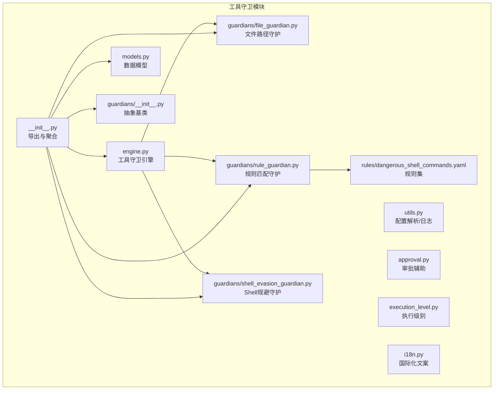
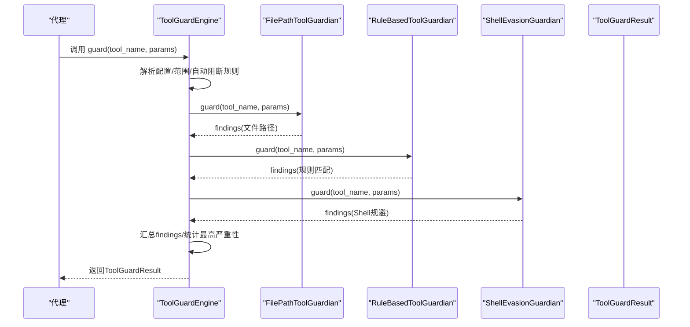
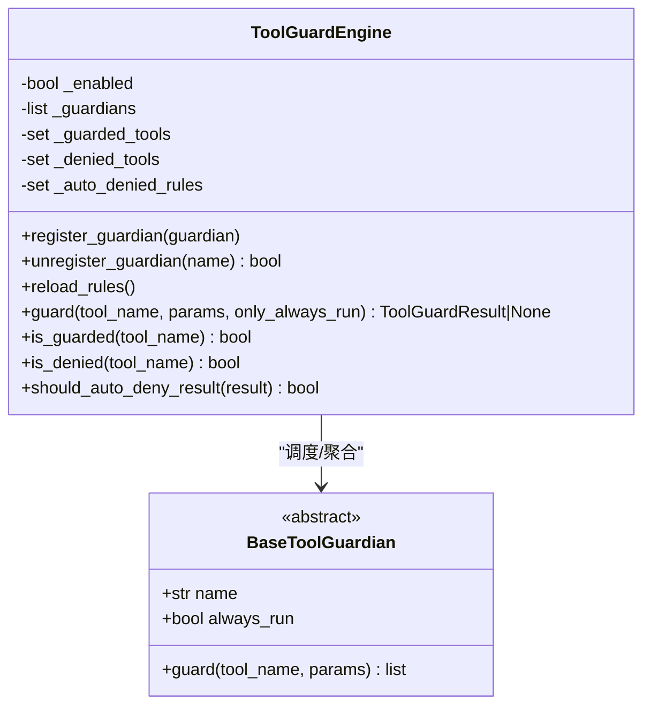
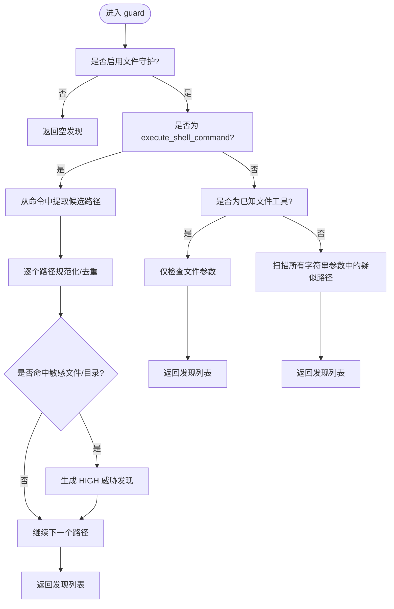
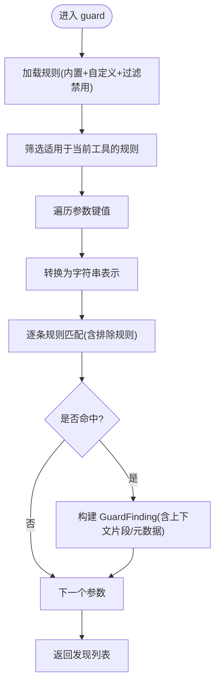
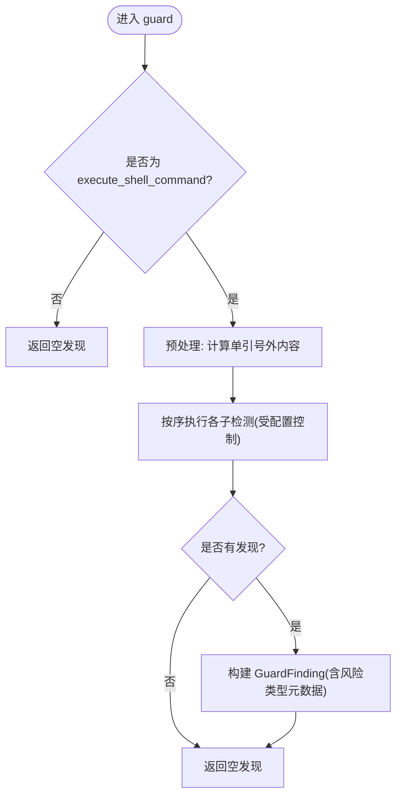
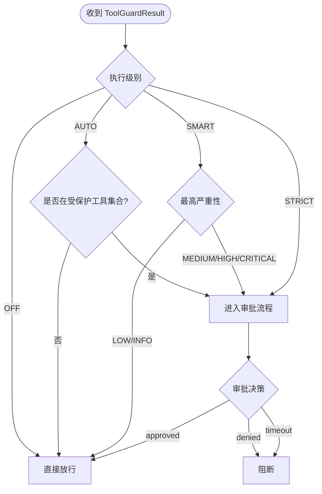
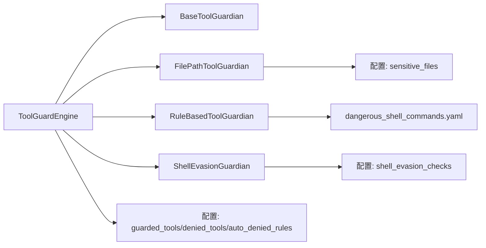

# 工具守卫

<cite>
**本文引用的文件**
- [src/qwenpaw/security/tool_guard/__init__.py](file://src/qwenpaw/security/tool_guard/__init__.py)
- [src/qwenpaw/security/tool_guard/engine.py](file://src/qwenpaw/security/tool_guard/engine.py)
- [src/qwenpaw/security/tool_guard/approval.py](file://src/qwenpaw/security/tool_guard/approval.py)
- [src/qwenpaw/security/tool_guard/execution_level.py](file://src/qwenpaw/security/tool_guard/execution_level.py)
- [src/qwenpaw/security/tool_guard/models.py](file://src/qwenpaw/security/tool_guard/models.py)
- [src/qwenpaw/security/tool_guard/utils.py](file://src/qwenpaw/security/tool_guard/utils.py)
- [src/qwenpaw/security/tool_guard/guardians/__init__.py](file://src/qwenpaw/security/tool_guard/guardians/__init__.py)
- [src/qwenpaw/security/tool_guard/guardians/file_guardian.py](file://src/qwenpaw/security/tool_guard/guardians/file_guardian.py)
- [src/qwenpaw/security/tool_guard/guardians/rule_guardian.py](file://src/qwenpaw/security/tool_guard/guardians/rule_guardian.py)
- [src/qwenpaw/security/tool_guard/guardians/shell_evasion_guardian.py](file://src/qwenpaw/security/tool_guard/guardians/shell_evasion_guardian.py)
- [src/qwenpaw/security/tool_guard/rules/dangerous_shell_commands.yaml](file://src/qwenpaw/security/tool_guard/rules/dangerous_shell_commands.yaml)
- [src/qwenpaw/security/tool_guard/i18n.py](file://src/qwenpaw/security/tool_guard/i18n.py)
</cite>

## 目录
1. [简介](#简介)
2. [项目结构](#项目结构)
3. [核心组件](#核心组件)
4. [架构总览](#架构总览)
5. [详细组件分析](#详细组件分析)
6. [依赖关系分析](#依赖关系分析)
7. [性能考量](#性能考量)
8. [故障排查指南](#故障排查指南)
9. [结论](#结论)
10. [附录](#附录)

## 简介
本文件面向QwenPaw的“工具守卫”系统，提供从架构设计到实现细节的完整技术文档。工具守卫在代理调用工具前对工具参数进行安全扫描，识别潜在的危险模式（如命令注入、数据外泄、敏感文件访问、路径穿越、网络滥用、凭据暴露、资源滥用、提示注入、代码执行、权限提升等），并结合“执行级别”策略决定是否需要人工审批或直接阻断。

系统采用“规则驱动 + 多守护者并行”的设计：默认包含“文件路径守护”“规则匹配守护”“Shell规避检测守护”，并通过引擎统一编排，支持动态重载规则与配置，提供结构化的审计结果与国际化文案，便于在控制台中展示与交互。

## 项目结构
工具守卫模块位于src/qwenpaw/security/tool_guard下，主要目录与文件如下：
- 引擎与入口：engine.py、__init__.py
- 审批与执行级别：approval.py、execution_level.py
- 数据模型与工具函数：models.py、utils.py、i18n.py
- 守护者实现：guardians/*.py（抽象基类、文件守护、规则守护、Shell规避守护）
- 规则文件：rules/dangerous_shell_commands.yaml

图表来源
- [src/qwenpaw/security/tool_guard/engine.py:54-269](file://src/qwenpaw/security/tool_guard/engine.py#L54-L269)
- [src/qwenpaw/security/tool_guard/guardians/__init__.py:17-62](file://src/qwenpaw/security/tool_guard/guardians/__init__.py#L17-L62)
- [src/qwenpaw/security/tool_guard/guardians/file_guardian.py:301-501](file://src/qwenpaw/security/tool_guard/guardians/file_guardian.py#L301-L501)
- [src/qwenpaw/security/tool_guard/guardians/rule_guardian.py:559-758](file://src/qwenpaw/security/tool_guard/guardians/rule_guardian.py#L559-L758)
- [src/qwenpaw/security/tool_guard/guardians/shell_evasion_guardian.py:539-593](file://src/qwenpaw/security/tool_guard/guardians/shell_evasion_guardian.py#L539-L593)
- [src/qwenpaw/security/tool_guard/rules/dangerous_shell_commands.yaml:1-310](file://src/qwenpaw/security/tool_guard/rules/dangerous_shell_commands.yaml#L1-L310)

章节来源
- [src/qwenpaw/security/tool_guard/__init__.py:1-59](file://src/qwenpaw/security/tool_guard/__init__.py#L1-L59)
- [src/qwenpaw/security/tool_guard/engine.py:54-269](file://src/qwenpaw/security/tool_guard/engine.py#L54-L269)

## 核心组件
- 工具守卫引擎（ToolGuardEngine）：负责注册与调度所有守护者，聚合结果，支持按需重载规则与配置，以及“仅运行always_run守护者”的特殊模式。
- 审批辅助（approval.py）：提供审批决策枚举与风险摘要格式化工具。
- 执行级别（execution_level.py）：定义STRICT/SMART/AUTO/OFF四种策略，控制何时需要审批。
- 数据模型（models.py）：定义威胁严重性、威胁类别、单次检查结果与聚合结果等。
- 工具函数（utils.py）：解析受保护/禁止工具集合、自动阻断规则ID、记录结构化日志。
- 国际化（i18n.py）：提供多语言的UI文案，用于控制台展示。

章节来源
- [src/qwenpaw/security/tool_guard/engine.py:54-269](file://src/qwenpaw/security/tool_guard/engine.py#L54-L269)
- [src/qwenpaw/security/tool_guard/approval.py:12-42](file://src/qwenpaw/security/tool_guard/approval.py#L12-L42)
- [src/qwenpaw/security/tool_guard/execution_level.py:15-80](file://src/qwenpaw/security/tool_guard/execution_level.py#L15-L80)
- [src/qwenpaw/security/tool_guard/models.py:25-185](file://src/qwenpaw/security/tool_guard/models.py#L25-L185)
- [src/qwenpaw/security/tool_guard/utils.py:64-194](file://src/qwenpaw/security/tool_guard/utils.py#L64-L194)
- [src/qwenpaw/security/tool_guard/i18n.py:6-169](file://src/qwenpaw/security/tool_guard/i18n.py#L6-L169)

## 架构总览
工具守卫采用“守护者插件化 + 规则集”的架构。引擎在初始化时加载默认守护者集合，并根据配置刷新受保护/禁止工具集合与自动阻断规则集；每次工具调用前，引擎遍历所有守护者，收集发现并汇总为ToolGuardResult，随后依据执行级别策略决定是否需要审批或直接阻断。

图表来源
- [src/qwenpaw/security/tool_guard/engine.py:200-257](file://src/qwenpaw/security/tool_guard/engine.py#L200-L257)
- [src/qwenpaw/security/tool_guard/guardians/file_guardian.py:449-501](file://src/qwenpaw/security/tool_guard/guardians/file_guardian.py#L449-L501)
- [src/qwenpaw/security/tool_guard/guardians/rule_guardian.py:608-758](file://src/qwenpaw/security/tool_guard/guardians/rule_guardian.py#L608-L758)
- [src/qwenpaw/security/tool_guard/guardians/shell_evasion_guardian.py:555-593](file://src/qwenpaw/security/tool_guard/guardians/shell_evasion_guardian.py#L555-L593)

## 详细组件分析

### 引擎与编排（ToolGuardEngine）
- 初始化与默认守护者：优先尝试实例化文件路径守护、规则匹配守护、Shell规避守护，失败会记录警告但不影响其他守护者。
- 配置开关与范围：支持环境变量与配置文件双重开关；受保护工具集合、禁止工具集合、自动阻断规则集合均支持通过环境变量/配置覆盖。
- 运行模式：支持only_always_run模式，仅执行always_run的守护者，用于对未受保护工具仍做路径级检查。
- 结果聚合：收集每个守护者的发现与失败信息，计算耗时，输出ToolGuardResult。

图表来源
- [src/qwenpaw/security/tool_guard/engine.py:54-269](file://src/qwenpaw/security/tool_guard/engine.py#L54-L269)
- [src/qwenpaw/security/tool_guard/guardians/__init__.py:17-62](file://src/qwenpaw/security/tool_guard/guardians/__init__.py#L17-L62)

章节来源
- [src/qwenpaw/security/tool_guard/engine.py:54-269](file://src/qwenpaw/security/tool_guard/engine.py#L54-L269)

### 文件守护（FilePathToolGuardian）
- 作用：阻止对敏感文件/目录的访问，支持Windows/POSIX路径规范化与兼容性处理。
- 关注点：execute_shell_command的命令字符串中提取路径；已知文件工具参数；其他工具中对疑似路径的字符串参数进行扫描。
- 敏感路径判定：基于标准化后的绝对路径前缀匹配，兼容斜杠/反斜杠与大小写不敏感。
- 可动态重载：支持从配置加载敏感文件列表并更新。

图表来源
- [src/qwenpaw/security/tool_guard/guardians/file_guardian.py:449-501](file://src/qwenpaw/security/tool_guard/guardians/file_guardian.py#L449-L501)
- [src/qwenpaw/security/tool_guard/guardians/file_guardian.py:246-299](file://src/qwenpaw/security/tool_guard/guardians/file_guardian.py#L246-L299)

章节来源
- [src/qwenpaw/security/tool_guard/guardians/file_guardian.py:301-501](file://src/qwenpaw/security/tool_guard/guardians/file_guardian.py#L301-L501)

### 规则守护（RuleBasedToolGuardian）
- 作用：基于YAML规则集进行正则匹配，快速扫描工具参数字符串表示。
- 规则来源：内置规则目录与配置中的自定义规则；支持禁用规则ID；支持按工具/参数维度筛选。
- 特殊增强：针对rm命令，额外检查目标是否位于工作区外，生成结构化提示与多语言提醒。
- 性能优化：预编译正则表达式；仅对非空字符串参数进行扫描。

图表来源
- [src/qwenpaw/security/tool_guard/guardians/rule_guardian.py:608-758](file://src/qwenpaw/security/tool_guard/guardians/rule_guardian.py#L608-L758)
- [src/qwenpaw/security/tool_guard/rules/dangerous_shell_commands.yaml:1-310](file://src/qwenpaw/security/tool_guard/rules/dangerous_shell_commands.yaml#L1-L310)

章节来源
- [src/qwenpaw/security/tool_guard/guardians/rule_guardian.py:559-758](file://src/qwenpaw/security/tool_guard/guardians/rule_guardian.py#L559-L758)
- [src/qwenpaw/security/tool_guard/rules/dangerous_shell_commands.yaml:1-310](file://src/qwenpaw/security/tool_guard/rules/dangerous_shell_commands.yaml#L1-L310)

### Shell规避守护（ShellEvasionGuardian）
- 作用：检测Shell命令中的规避/混淆技术，避免被简单正则绕过。
- 检测类型：命令替换($()、反引号、${}等)、ANSI-C/本地化引号隐藏、反斜杠转义空白/操作符、换行/回车隐藏命令、注释内引号不同步、带引号换行后#行隐藏等。
- 可配置开关：通过配置项选择启用哪些子检测，避免误报或性能影响。
- 仅对execute_shell_command生效。

图表来源
- [src/qwenpaw/security/tool_guard/guardians/shell_evasion_guardian.py:555-593](file://src/qwenpaw/security/tool_guard/guardians/shell_evasion_guardian.py#L555-L593)

章节来源
- [src/qwenpaw/security/tool_guard/guardians/shell_evasion_guardian.py:539-593](file://src/qwenpaw/security/tool_guard/guardians/shell_evasion_guardian.py#L539-L593)

### 执行级别与审批流程
- 执行级别（ToolExecutionLevel）：
  - STRICT：所有工具均需审批
  - SMART：低风险自动放行，中高风险需审批
  - AUTO：仅受保护工具需要审批（向后兼容）
  - OFF：完全关闭工具守卫
- 审批辅助（ApprovalDecision）：提供approved/denied/timeout三种结果，配合UI与控制台交互。
- 自动阻断：若任一发现命中配置的自动阻断规则ID，则直接阻断，无需审批。

图表来源
- [src/qwenpaw/security/tool_guard/execution_level.py:15-80](file://src/qwenpaw/security/tool_guard/execution_level.py#L15-L80)
- [src/qwenpaw/security/tool_guard/approval.py:12-42](file://src/qwenpaw/security/tool_guard/approval.py#L12-L42)
- [src/qwenpaw/security/tool_guard/engine.py:177-188](file://src/qwenpaw/security/tool_guard/engine.py#L177-L188)

章节来源
- [src/qwenpaw/security/tool_guard/execution_level.py:15-80](file://src/qwenpaw/security/tool_guard/execution_level.py#L15-L80)
- [src/qwenpaw/security/tool_guard/approval.py:12-42](file://src/qwenpaw/security/tool_guard/approval.py#L12-L42)
- [src/qwenpaw/security/tool_guard/engine.py:177-188](file://src/qwenpaw/security/tool_guard/engine.py#L177-L188)

### 危险命令规则配置与规则定制
- 内置规则：位于rules/dangerous_shell_commands.yaml，涵盖rm/mv破坏性命令、文件系统/块设备破坏、DoS与炸弹、下载即执行、反连与隧道、持久化与提权、危险权限变更、规避与防御绕过、系统重启/关机、服务管理、进程终止、IFS注入、控制字符、Unicode空白、/proc/environ访问、jq危险用法、Zsh危险命令等。
- 规则字段：id、tools/params（可为空代表全工具/全参数）、category、severity、patterns/exclude_patterns、description、remediation。
- 自定义规则：通过配置文件security.tool_guard.custom_rules添加；可通过disabled_rules禁用特定规则ID。
- 规则重载：调用reload_rules或守护者reload以重新加载规则与配置。

章节来源
- [src/qwenpaw/security/tool_guard/rules/dangerous_shell_commands.yaml:1-310](file://src/qwenpaw/security/tool_guard/rules/dangerous_shell_commands.yaml#L1-L310)
- [src/qwenpaw/security/tool_guard/guardians/rule_guardian.py:518-594](file://src/qwenpaw/security/tool_guard/guardians/rule_guardian.py#L518-L594)

### 安全策略参数与环境变量
- 开关与范围：
  - QWENPAW_TOOL_GUARD_ENABLED：整体开关（true/1/yes启用）
  - QWENPAW_TOOL_GUARD_TOOLS：受保护工具集合（*, all全量；none/off/false/0禁用；逗号分隔列表）
  - QWENPAW_TOOL_GUARD_DENIED_TOOLS：禁止工具集合（逗号分隔）
  - QWENPAW_TOOL_GUARD_AUTO_DENIED_RULES：自动阻断规则ID集合（逗号分隔）
- 执行级别：来自配置security.tool_guard.execution_level（strict/smart/auto/off，默认auto）
- Shell规避检测开关：security.tool_guard.shell_evasion_checks（字典，键为检测名，布尔值控制启用）

章节来源
- [src/qwenpaw/security/tool_guard/engine.py:36-52](file://src/qwenpaw/security/tool_guard/engine.py#L36-L52)
- [src/qwenpaw/security/tool_guard/utils.py:64-157](file://src/qwenpaw/security/tool_guard/utils.py#L64-L157)
- [src/qwenpaw/security/tool_guard/execution_level.py:52-68](file://src/qwenpaw/security/tool_guard/execution_level.py#L52-L68)
- [src/qwenpaw/security/tool_guard/guardians/shell_evasion_guardian.py:517-537](file://src/qwenpaw/security/tool_guard/guardians/shell_evasion_guardian.py#L517-L537)

### 常见攻击模式与检测原理
- 命令注入与管道执行：检测curl|bash、wget|sh等直接管道执行远程payload。
- 路径穿越与敏感文件访问：检测../、~、UNC路径、/proc/*/environ等。
- 资源滥用与DoS：检测经典fork炸弹、mass kill -9。
- 权限提升与持久化：检测sudo/su/doas/pkexec/runas、crontab/authorized_keys/sudoers。
- Shell规避与混淆：检测IFS注入、控制字符、Unicode空白、反引号/$(...)、空引号+短横线、带引号换行+#行等。
- 系统重启/关机与服务管理：检测reboot/shutdown/init/telinit等。
- jq危险用法：system()函数、-f/--from-file等文件读取标志。

章节来源
- [src/qwenpaw/security/tool_guard/rules/dangerous_shell_commands.yaml:12-310](file://src/qwenpaw/security/tool_guard/rules/dangerous_shell_commands.yaml#L12-L310)
- [src/qwenpaw/security/tool_guard/guardians/shell_evasion_guardian.py:26-58](file://src/qwenpaw/security/tool_guard/guardians/shell_evasion_guardian.py#L26-L58)

### 误报处理与安全事件响应
- 误报处理建议：
  - 使用exclude_patterns排除合法注释/白名单场景
  - 在配置中禁用不必要的规则ID（disabled_rules）
  - 对于Shell规避检测，按需启用具体子检测，减少误报
  - 将高风险规则提升为自动阻断（auto_denied_rules），降低误报带来的风险
- 安全事件响应：
  - 结构化日志：log_findings输出每条发现与摘要，便于审计
  - 审批流程：根据执行级别策略进入审批，审批超时按策略阻断
  - 国际化UI：i18n提供多语言文案，便于运营与安全人员理解

章节来源
- [src/qwenpaw/security/tool_guard/utils.py:159-194](file://src/qwenpaw/security/tool_guard/utils.py#L159-L194)
- [src/qwenpaw/security/tool_guard/i18n.py:6-169](file://src/qwenpaw/security/tool_guard/i18n.py#L6-L169)

## 依赖关系分析
- 组件耦合：
  - 引擎依赖守护者接口（BaseToolGuardian），通过多态调度，耦合度低，易于扩展新守护者
  - 规则守护依赖YAML规则文件与配置模型，规则加载与禁用逻辑清晰
  - 文件守护依赖配置中的敏感文件列表与工作区根目录解析
  - Shell规避守护依赖配置的子检测开关
- 外部依赖：
  - 配置加载：qwenpaw.config.load_config
  - 环境变量：EnvVarLoader
  - 日志：标准logging模块

图表来源
- [src/qwenpaw/security/tool_guard/engine.py:25-29](file://src/qwenpaw/security/tool_guard/engine.py#L25-L29)
- [src/qwenpaw/security/tool_guard/guardians/rule_guardian.py:467-511](file://src/qwenpaw/security/tool_guard/guardians/rule_guardian.py#L467-L511)
- [src/qwenpaw/security/tool_guard/guardians/file_guardian.py:157-173](file://src/qwenpaw/security/tool_guard/guardians/file_guardian.py#L157-L173)
- [src/qwenpaw/security/tool_guard/guardians/shell_evasion_guardian.py:517-537](file://src/qwenpaw/security/tool_guard/guardians/shell_evasion_guardian.py#L517-L537)
- [src/qwenpaw/security/tool_guard/utils.py:51-62](file://src/qwenpaw/security/tool_guard/utils.py#L51-L62)

章节来源
- [src/qwenpaw/security/tool_guard/engine.py:25-29](file://src/qwenpaw/security/tool_guard/engine.py#L25-L29)
- [src/qwenpaw/security/tool_guard/guardians/rule_guardian.py:467-511](file://src/qwenpaw/security/tool_guard/guardians/rule_guardian.py#L467-L511)
- [src/qwenpaw/security/tool_guard/guardians/file_guardian.py:157-173](file://src/qwenpaw/security/tool_guard/guardians/file_guardian.py#L157-L173)
- [src/qwenpaw/security/tool_guard/guardians/shell_evasion_guardian.py:517-537](file://src/qwenpaw/security/tool_guard/guardians/shell_evasion_guardian.py#L517-L537)
- [src/qwenpaw/security/tool_guard/utils.py:51-62](file://src/qwenpaw/security/tool_guard/utils.py#L51-L62)

## 性能考量
- 正则预编译：规则守护对所有patterns/exclude_patterns进行预编译，减少重复开销
- 快速扫描：规则守护仅对非空字符串参数进行扫描，避免对复杂对象的无意义处理
- 路径提取与去重：文件守护对Shell命令中的路径进行去重，减少重复判断
- 子检测开关：Shell规避守护按配置启用，避免不必要的检测
- 超时与失败隔离：引擎捕获守护者异常并记录，不影响其他守护者执行

## 故障排查指南
- 守护者初始化失败：引擎会在日志中记录警告，但不会中断其他守护者；检查守护者依赖与配置
- 规则加载失败：规则文件缺失或格式错误会被忽略并记录警告；检查YAML语法与字段
- 配置解析异常：环境变量与配置文件解析失败时回退到默认行为；检查配置键名与值
- 审批超时：根据执行级别策略，超时将导致阻断；检查审批通道与超时设置
- 日志定位：使用log_findings输出的结构化日志定位具体规则与参数

章节来源
- [src/qwenpaw/security/tool_guard/engine.py:240-255](file://src/qwenpaw/security/tool_guard/engine.py#L240-L255)
- [src/qwenpaw/security/tool_guard/guardians/rule_guardian.py:432-464](file://src/qwenpaw/security/tool_guard/guardians/rule_guardian.py#L432-L464)
- [src/qwenpaw/security/tool_guard/utils.py:159-194](file://src/qwenpaw/security/tool_guard/utils.py#L159-L194)

## 结论
工具守卫系统通过“规则+多守护者”的组合，在工具调用前提供多层次的安全防护。其设计强调可扩展性（新增守护者无需改动引擎）、可配置性（环境变量与配置双通道）、可观测性（结构化日志与国际化UI），并结合执行级别策略实现从“自动放行”到“严格审批”的灵活安全控制。建议在生产环境中采用SMART或STRICT策略，合理配置规则与敏感文件列表，并定期评估误报与漏报，持续优化规则集与检测开关。

## 附录
- 配置示例（概念性说明，非代码片段）
  - 启用工具守卫：设置QWENPAW_TOOL_GUARD_ENABLED=true
  - 受保护工具：QWENPAW_TOOL_GUARD_TOOLS=execute_shell_command,read_file,write_file
  - 禁止工具：QWWENPAW_TOOL_GUARD_DENIED_TOOLS=send_file_to_user
  - 自动阻断规则：QWENPAW_TOOL_GUARD_AUTO_DENIED_RULES=TOOL_CMD_PIPE_TO_SHELL,TOOL_CMD_PRIVILEGE_ESCALATION
  - 执行级别：security.tool_guard.execution_level=smart
  - Shell规避检测：security.tool_guard.shell_evasion_checks.command_substitution=true
- 规则定制方法
  - 在security.tool_guard.custom_rules中添加新规则，使用id/tools/params/category/severity/patterns/exclude_patterns/description/remediation
  - 通过security.tool_guard.disabled_rules禁用不需要的内置规则
  - 通过security.tool_guard.rules_dir指定自定义规则目录（规则守护支持）
- 调试技巧
  - 查看结构化日志：关注“[TOOL GUARD]”前缀的发现与摘要
  - 临时关闭部分守护者：在引擎构造时传入自定义守护者列表
  - 仅运行always_run守护者：调用guard时设置only_always_run=True，用于路径级检查