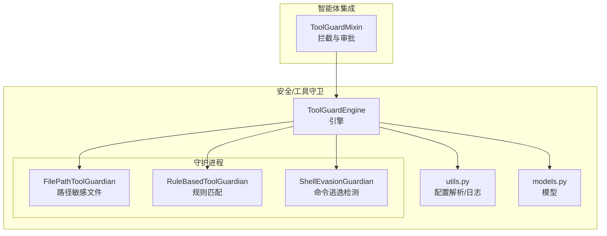
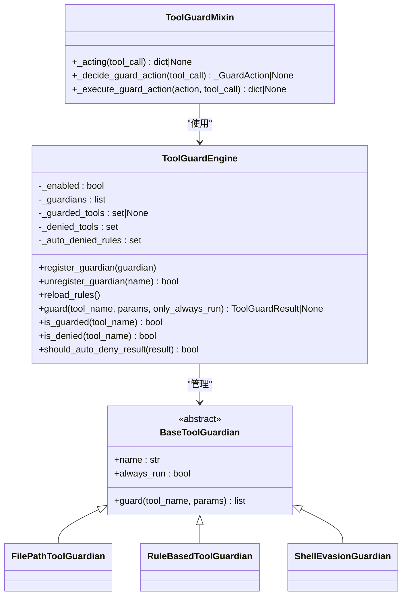
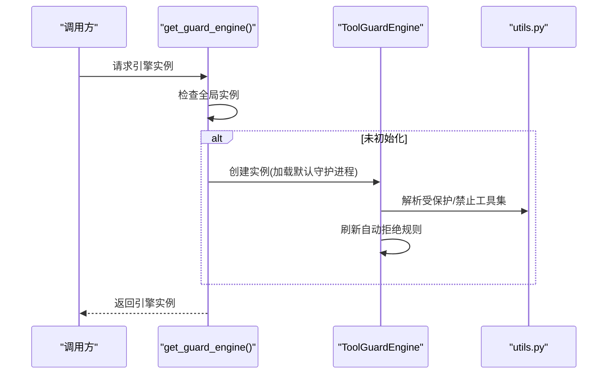
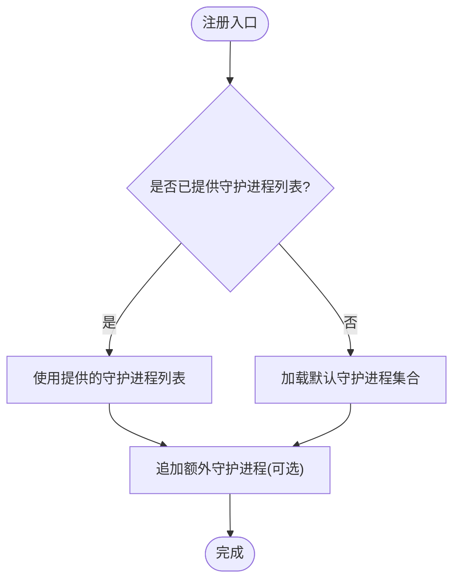
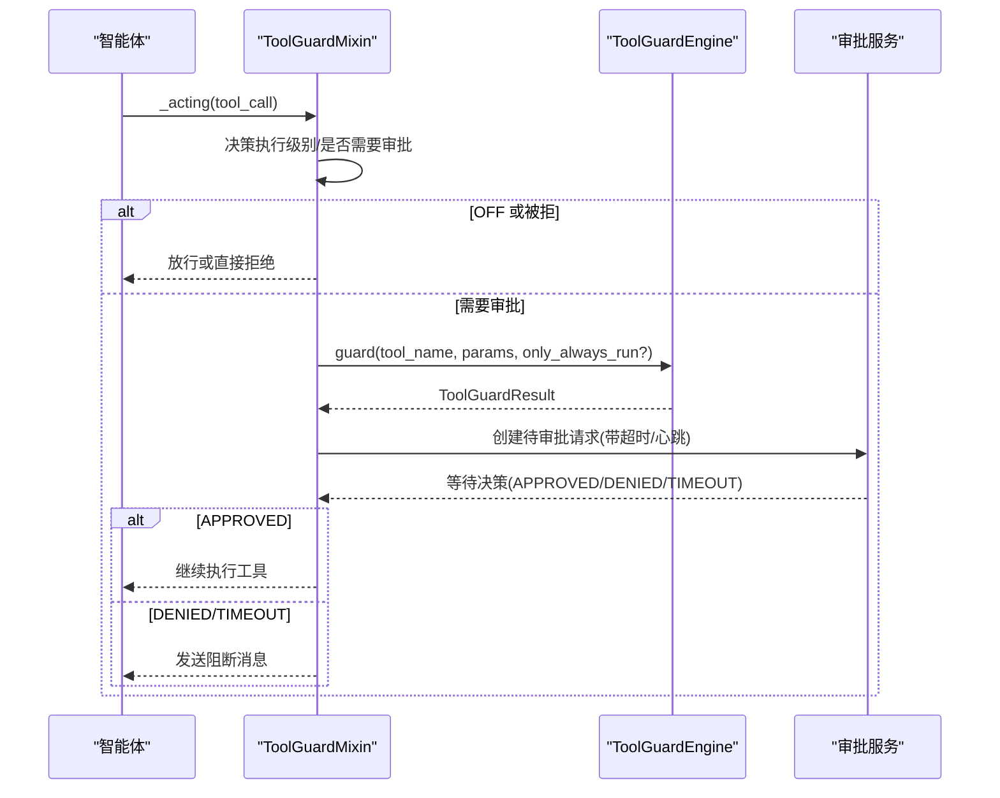
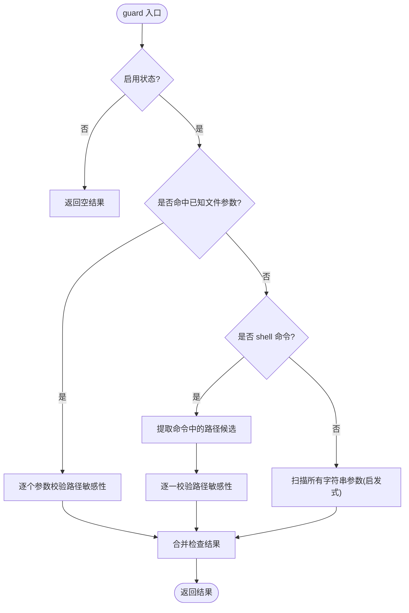
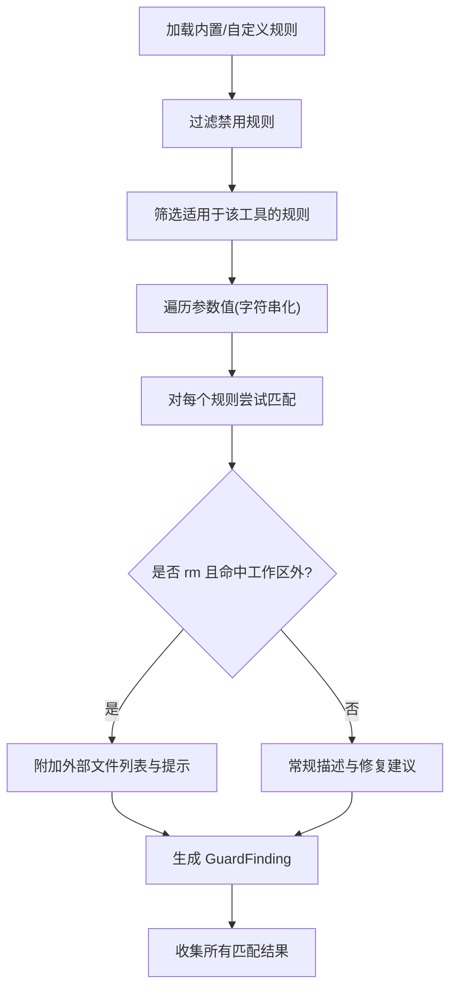
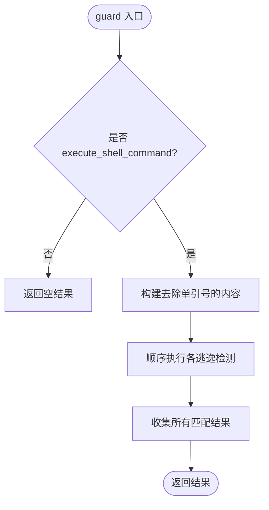
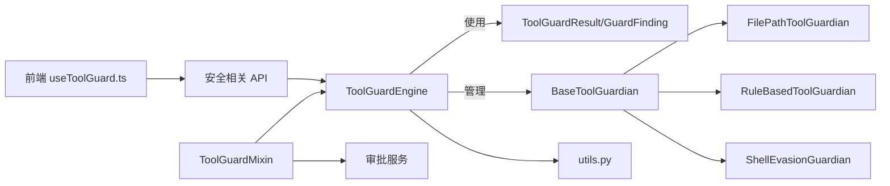

# 引擎架构

<cite>
**本文引用的文件**
- [engine.py](file://src/qwenpaw/security/tool_guard/engine.py)
- [__init__.py（守护进程基类）](file://src/qwenpaw/security/tool_guard/guardians/__init__.py)
- [file_guardian.py](file://src/qwenpaw/security/tool_guard/guardians/file_guardian.py)
- [rule_guardian.py](file://src/qwenpaw/security/tool_guard/guardians/rule_guardian.py)
- [shell_evasion_guardian.py](file://src/qwenpaw/security/tool_guard/guardians/shell_evasion_guardian.py)
- [models.py](file://src/qwenpaw/security/tool_guard/models.py)
- [utils.py](file://src/qwenpaw/security/tool_guard/utils.py)
- [dangerous_shell_commands.yaml](file://src/qwenpaw/security/tool_guard/rules/dangerous_shell_commands.yaml)
- [tool_guard_mixin.py](file://src/qwenpaw/agents/tool_guard_mixin.py)
- [useToolGuard.ts](file://console/src/pages/Settings/Security/useToolGuard.ts)
</cite>

## 目录
1. [引言](#引言)
2. [项目结构](#项目结构)
3. [核心组件](#核心组件)
4. [架构总览](#架构总览)
5. [详细组件分析](#详细组件分析)
6. [依赖分析](#依赖分析)
7. [性能考量](#性能考量)
8. [故障排查指南](#故障排查指南)
9. [结论](#结论)
10. [附录](#附录)

## 引言
本文件面向工具守卫引擎（ToolGuardEngine）的架构与实现，系统阐述其设计理念、单例模式、守护进程（Guardian）管理机制、初始化流程、守护范围与自动拒绝规则、工具调用拦截流程、配置选项、性能监控与错误处理策略，并提供配置示例、自定义守护进程注册方法与调试技巧，以及与安全组件的集成方式与最佳实践。

## 项目结构
工具守卫子系统位于安全模块下，围绕“引擎-守护进程-模型-工具函数”的分层组织：
- 引擎层：负责守护进程的发现、注册、执行与结果聚合
- 守护进程层：提供不同维度的安全检查（规则匹配、路径敏感性、命令逃逸检测）
- 模型层：统一表示威胁分类、严重级别、检查结果与聚合结果
- 工具层：解析配置来源、计算守护范围与自动拒绝规则、结构化日志输出
- 集成层：在智能体中以混入形式拦截工具调用，驱动审批流

图表来源
- [engine.py:54-268](file://src/qwenpaw/security/tool_guard/engine.py#L54-L268)
- [file_guardian.py:301-501](file://src/qwenpaw/security/tool_guard/guardians/file_guardian.py#L301-L501)
- [rule_guardian.py:559-758](file://src/qwenpaw/security/tool_guard/guardians/rule_guardian.py#L559-L758)
- [shell_evasion_guardian.py:539-593](file://src/qwenpaw/security/tool_guard/guardians/shell_evasion_guardian.py#L539-L593)
- [utils.py:64-194](file://src/qwenpaw/security/tool_guard/utils.py#L64-L194)
- [models.py:60-185](file://src/qwenpaw/security/tool_guard/models.py#L60-L185)
- [tool_guard_mixin.py:79-800](file://src/qwenpaw/agents/tool_guard_mixin.py#L79-L800)

章节来源
- [engine.py:1-269](file://src/qwenpaw/security/tool_guard/engine.py#L1-L269)
- [utils.py:1-194](file://src/qwenpaw/security/tool_guard/utils.py#L1-L194)
- [models.py:1-185](file://src/qwenpaw/security/tool_guard/models.py#L1-L185)

## 核心组件
- ToolGuardEngine：懒加载单例，负责守护进程集合的生命周期与执行；支持动态注册/注销守护进程、按配置刷新受保护/禁止工具集、自动拒绝规则判定、执行耗时统计与失败记录。
- BaseToolGuardian：抽象基类，定义统一的 guard 接口，便于扩展新的守护进程。
- 具体守护进程：
  - FilePathToolGuardian：基于路径规范化与敏感目录/文件集合的阻断检查，覆盖 shell 命令中的路径提取与扫描。
  - RuleBasedToolGuardian：从 YAML 加载规则，对参数字符串进行正则匹配，支持工作区外 rm 目标检测与增强提示。
  - ShellEvasionGuardian：检测命令替换、转义空白、控制字符、注释/引号不同步等逃逸与混淆技术。
- ToolGuardMixin：在智能体中拦截工具调用，依据引擎结果与执行级别决定自动拒绝、进入审批或直接放行，并提供心跳保活与超时处理。
- 模型与工具：统一的威胁分类、严重级别、检查结果与聚合结果；配置解析与结构化日志。

章节来源
- [engine.py:54-268](file://src/qwenpaw/security/tool_guard/engine.py#L54-L268)
- [__init__.py（守护进程基类）:17-62](file://src/qwenpaw/security/tool_guard/guardians/__init__.py#L17-L62)
- [file_guardian.py:301-501](file://src/qwenpaw/security/tool_guard/guardians/file_guardian.py#L301-L501)
- [rule_guardian.py:559-758](file://src/qwenpaw/security/tool_guard/guardians/rule_guardian.py#L559-L758)
- [shell_evasion_guardian.py:539-593](file://src/qwenpaw/security/tool_guard/guardians/shell_evasion_guardian.py#L539-L593)
- [tool_guard_mixin.py:79-800](file://src/qwenpaw/agents/tool_guard_mixin.py#L79-L800)
- [models.py:60-185](file://src/qwenpaw/security/tool_guard/models.py#L60-L185)
- [utils.py:64-194](file://src/qwenpaw/security/tool_guard/utils.py#L64-L194)

## 架构总览
工具守卫引擎采用“懒加载单例 + 可插拔守护进程”的设计，通过统一的 guard 接口串联多个检查器，最终形成可审计、可配置、可扩展的工具调用安全网。

图表来源
- [engine.py:54-268](file://src/qwenpaw/security/tool_guard/engine.py#L54-L268)
- [__init__.py（守护进程基类）:17-62](file://src/qwenpaw/security/tool_guard/guardians/__init__.py#L17-L62)
- [file_guardian.py:301-501](file://src/qwenpaw/security/tool_guard/guardians/file_guardian.py#L301-L501)
- [rule_guardian.py:559-758](file://src/qwenpaw/security/tool_guard/guardians/rule_guardian.py#L559-L758)
- [shell_evasion_guardian.py:539-593](file://src/qwenpaw/security/tool_guard/guardians/shell_evasion_guardian.py#L539-L593)
- [tool_guard_mixin.py:79-800](file://src/qwenpaw/agents/tool_guard_mixin.py#L79-L800)

## 详细组件分析

### 引擎初始化与单例模式
- 启动优先级：环境变量 > 配置文件 > 默认值
- 默认守护进程：路径敏感文件、规则匹配、命令逃逸检测三类守护进程按需初始化
- 规则重载：支持运行时重新加载规则与配置，刷新受保护/禁止工具集
- 单例获取：通过全局懒加载函数返回同一实例，避免重复初始化

图表来源
- [engine.py:36-52](file://src/qwenpaw/security/tool_guard/engine.py#L36-L52)
- [engine.py:66-80](file://src/qwenpaw/security/tool_guard/engine.py#L66-L80)
- [engine.py:154-172](file://src/qwenpaw/security/tool_guard/engine.py#L154-L172)
- [utils.py:64-97](file://src/qwenpaw/security/tool_guard/utils.py#L64-L97)

章节来源
- [engine.py:36-52](file://src/qwenpaw/security/tool_guard/engine.py#L36-L52)
- [engine.py:66-80](file://src/qwenpaw/security/tool_guard/engine.py#L66-L80)
- [engine.py:154-172](file://src/qwenpaw/security/tool_guard/engine.py#L154-L172)
- [utils.py:64-97](file://src/qwenpaw/security/tool_guard/utils.py#L64-L97)

### 守护进程注册机制
- 动态注册：支持在构造后追加自定义守护进程
- 条件执行：always_run 的守护进程在非受保护工具调用时也会执行（如路径敏感性检查）
- 注销与查询：按名称移除守护进程，暴露当前守护进程名称列表

图表来源
- [engine.py:66-78](file://src/qwenpaw/security/tool_guard/engine.py#L66-L78)
- [engine.py:116-126](file://src/qwenpaw/security/tool_guard/engine.py#L116-L126)

章节来源
- [engine.py:66-78](file://src/qwenpaw/security/tool_guard/engine.py#L66-L78)
- [engine.py:116-126](file://src/qwenpaw/security/tool_guard/engine.py#L116-L126)

### 工具调用拦截流程（智能体混入）
- 执行级别：OFF/AUTO/SMART/STRICT 四档，影响是否需要审批与自动放行阈值
- 拒绝优先：deny 列表中的工具无条件拒绝
- 严格模式：所有工具均需审批，若命中自动拒绝规则则直接拒绝
- 自动/智能模式：仅对受保护工具执行完整检查；非受保护工具仅执行 always_run 守护进程；低风险（INFO/LOW）在智能模式下自动放行
- 审批与超时：等待用户批准或超时，期间保持心跳；取消任务时自动拒绝并传播异常

图表来源
- [tool_guard_mixin.py:138-177](file://src/qwenpaw/agents/tool_guard_mixin.py#L138-L177)
- [tool_guard_mixin.py:179-306](file://src/qwenpaw/agents/tool_guard_mixin.py#L179-L306)
- [tool_guard_mixin.py:339-358](file://src/qwenpaw/agents/tool_guard_mixin.py#L339-L358)
- [engine.py:200-258](file://src/qwenpaw/security/tool_guard/engine.py#L200-L258)

章节来源
- [tool_guard_mixin.py:138-177](file://src/qwenpaw/agents/tool_guard_mixin.py#L138-L177)
- [tool_guard_mixin.py:179-306](file://src/qwenpaw/agents/tool_guard_mixin.py#L179-L306)
- [tool_guard_mixin.py:339-358](file://src/qwenpaw/agents/tool_guard_mixin.py#L339-L358)
- [engine.py:200-258](file://src/qwenpaw/security/tool_guard/engine.py#L200-L258)

### 路径敏感文件守护进程（FilePathToolGuardian）
- 敏感文件/目录：支持配置与兼容目录（含历史命名），统一归一化比较
- 路径提取：针对 shell 命令提取重定向与普通路径，去重与清洗
- 适用范围：已知文件工具参数、shell 命令、其他工具的字符串参数（启发式识别）

图表来源
- [file_guardian.py:449-501](file://src/qwenpaw/security/tool_guard/guardians/file_guardian.py#L449-L501)
- [file_guardian.py:246-299](file://src/qwenpaw/security/tool_guard/guardians/file_guardian.py#L246-L299)

章节来源
- [file_guardian.py:301-501](file://src/qwenpaw/security/tool_guard/guardians/file_guardian.py#L301-L501)
- [file_guardian.py:147-173](file://src/qwenpaw/security/tool_guard/guardians/file_guardian.py#L147-L173)

### 规则匹配守护进程（RuleBasedToolGuardian）
- 规则来源：内置 YAML 规则目录与配置中的自定义规则，支持排除规则
- 工作区外 rm 检测：解析命令、标准化路径、判断是否越权删除
- 结果增强：为 rm 场景附加“工作区外文件”提示与多语言提醒

图表来源
- [rule_guardian.py:583-594](file://src/qwenpaw/security/tool_guard/guardians/rule_guardian.py#L583-L594)
- [rule_guardian.py:608-758](file://src/qwenpaw/security/tool_guard/guardians/rule_guardian.py#L608-L758)
- [dangerous_shell_commands.yaml:1-310](file://src/qwenpaw/security/tool_guard/rules/dangerous_shell_commands.yaml#L1-L310)

章节来源
- [rule_guardian.py:583-594](file://src/qwenpaw/security/tool_guard/guardians/rule_guardian.py#L583-L594)
- [rule_guardian.py:608-758](file://src/qwenpaw/security/tool_guard/guardians/rule_guardian.py#L608-L758)
- [dangerous_shell_commands.yaml:1-310](file://src/qwenpaw/security/tool_guard/rules/dangerous_shell_commands.yaml#L1-L310)

### 命令逃逸检测守护进程（ShellEvasionGuardian）
- 检测要点：命令替换、ANSI-C/本地化引号、反斜杠转义、换行/回车拆分、注释与引号不同步、引号内换行+注释剥离
- 可配置开关：按检查项粒度启用/禁用
- 仅对 execute_shell_command 生效

图表来源
- [shell_evasion_guardian.py:555-593](file://src/qwenpaw/security/tool_guard/guardians/shell_evasion_guardian.py#L555-L593)
- [shell_evasion_guardian.py:517-537](file://src/qwenpaw/security/tool_guard/guardians/shell_evasion_guardian.py#L517-L537)

章节来源
- [shell_evasion_guardian.py:555-593](file://src/qwenpaw/security/tool_guard/guardians/shell_evasion_guardian.py#L555-L593)
- [shell_evasion_guardian.py:517-537](file://src/qwenpaw/security/tool_guard/guardians/shell_evasion_guardian.py#L517-L537)

### 配置选项与规则解析
- 启用控制：环境变量 QWENPAW_TOOL_GUARD_ENABLED > 配置文件 > 默认开启
- 受保护工具集：支持通配符/关闭/逗号分隔；优先级：构造参数 > 环境变量 > 配置 > 内置高危集合
- 禁止工具集：构造参数 > 环境变量 > 配置 > 空集
- 自动拒绝规则：构造参数 > 环境变量 > 配置 > 空集
- 规则重载：引擎 reload_rules 会触发守护进程 reload 与工具集刷新
- 日志：结构化输出每条发现与汇总信息，高风险级别使用警告级别日志

章节来源
- [engine.py:36-52](file://src/qwenpaw/security/tool_guard/engine.py#L36-L52)
- [utils.py:64-157](file://src/qwenpaw/security/tool_guard/utils.py#L64-L157)
- [utils.py:159-194](file://src/qwenpaw/security/tool_guard/utils.py#L159-L194)

### 性能监控与错误处理
- 性能监控：记录单次 guard 执行耗时，便于定位瓶颈
- 错误处理：守护进程内部异常会被记录并计入失败列表，不影响整体执行；路径/规则加载异常有降级策略
- 并发与锁：拦截逻辑在互斥锁内串行决策，实际工具执行在锁外并行，保证状态一致性与吞吐

章节来源
- [engine.py:228-258](file://src/qwenpaw/security/tool_guard/engine.py#L228-L258)
- [tool_guard_mixin.py:163-177](file://src/qwenpaw/agents/tool_guard_mixin.py#L163-L177)

## 依赖分析
- 引擎依赖守护进程接口与模型；守护进程依赖配置解析与常量；混入依赖引擎与审批服务；前端设置页通过 API 获取配置与规则。

图表来源
- [engine.py:24-29](file://src/qwenpaw/security/tool_guard/engine.py#L24-L29)
- [__init__.py（守护进程基类）:17-62](file://src/qwenpaw/security/tool_guard/guardians/__init__.py#L17-L62)
- [file_guardian.py:18-19](file://src/qwenpaw/security/tool_guard/guardians/file_guardian.py#L18-L19)
- [rule_guardian.py:36-37](file://src/qwenpaw/security/tool_guard/guardians/rule_guardian.py#L36-L37)
- [shell_evasion_guardian.py:21-22](file://src/qwenpaw/security/tool_guard/guardians/shell_evasion_guardian.py#L21-L22)
- [utils.py:12-15](file://src/qwenpaw/security/tool_guard/utils.py#L12-L15)
- [tool_guard_mixin.py:93-98](file://src/qwenpaw/agents/tool_guard_mixin.py#L93-L98)
- [useToolGuard.ts:27-50](file://console/src/pages/Settings/Security/useToolGuard.ts#L27-L50)

章节来源
- [engine.py:24-29](file://src/qwenpaw/security/tool_guard/engine.py#L24-L29)
- [tool_guard_mixin.py:93-98](file://src/qwenpaw/agents/tool_guard_mixin.py#L93-L98)
- [useToolGuard.ts:27-50](file://console/src/pages/Settings/Security/useToolGuard.ts#L27-L50)

## 性能考量
- 守护进程数量与规则规模直接影响执行时间；建议按需启用 shell_evasion_check 子项，减少不必要的正则匹配
- 规则匹配采用预编译正则，但复杂模式仍可能带来开销；可通过减少规则数量或细化工具/参数范围提升性能
- 路径规范化与工作区边界检查在 Windows 与跨平台场景下有额外成本，建议在 CI/测试环境使用更严格的路径解析策略
- 并行执行：拦截阶段串行决策，工具执行阶段并行，兼顾安全性与吞吐

## 故障排查指南
- 引擎未生效：检查环境变量与配置文件的启用标志；确认 get_guard_engine 是否被正确调用
- 守护进程未执行：确认 is_guarded/is_denied 与 only_always_run 参数；检查 always_run 标记
- 规则不生效：确认规则文件存在与格式正确；检查 disabled_rules 与配置中的自定义规则
- 审批卡住：检查审批服务可用性与超时设置；关注心跳保活与取消任务的处理
- 日志定位：利用结构化日志快速定位最高风险级别与匹配规则；结合前端设置页查看当前配置

章节来源
- [engine.py:240-255](file://src/qwenpaw/security/tool_guard/engine.py#L240-L255)
- [utils.py:159-194](file://src/qwenpaw/security/tool_guard/utils.py#L159-L194)
- [tool_guard_mixin.py:519-616](file://src/qwenpaw/agents/tool_guard_mixin.py#L519-L616)

## 结论
工具守卫引擎通过“懒加载单例 + 可插拔守护进程 + 分层配置”的架构，实现了对工具调用的多维安全防护。其拦截流程与审批机制在保障安全的同时兼顾了用户体验与可运维性。建议在生产环境中合理配置受保护工具集与自动拒绝规则，按需启用高级检测能力，并结合前端配置界面与日志监控持续优化。

## 附录

### 引擎配置示例（环境变量与配置文件）
- 启用控制：QWENPAW_TOOL_GUARD_ENABLED=true/false/1/yes
- 受保护工具集：QWENPAW_TOOL_GUARD_TOOLS=execute_shell_command,read_file,write_file 或 *
- 禁止工具集：QWENPAW_TOOL_GUARD_DENIED_TOOLS=execute_shell_command
- 自动拒绝规则：QWENPAW_TOOL_GUARD_AUTO_DENIED_RULES=TOOL_CMD_PIPE_TO_SHELL,TOOL_CMD_PRIVILEGE_ESCALATION
- Shell 逃逸检测子项：security.tool_guard.shell_evasion_checks 中按检查名启用

章节来源
- [engine.py:36-52](file://src/qwenpaw/security/tool_guard/engine.py#L36-L52)
- [utils.py:83-156](file://src/qwenpaw/security/tool_guard/utils.py#L83-L156)
- [shell_evasion_guardian.py:517-537](file://src/qwenpaw/security/tool_guard/guardians/shell_evasion_guardian.py#L517-L537)

### 自定义守护进程注册方法
- 在构造引擎时传入自定义守护进程列表
- 使用 register_guardian 在运行时追加守护进程
- 使用 unregister_guardian 按名称移除守护进程
- 注意 always_run 标记以确保关键检查（如路径敏感性）在非受保护工具上也执行

章节来源
- [engine.py:66-78](file://src/qwenpaw/security/tool_guard/engine.py#L66-L78)
- [engine.py:116-126](file://src/qwenpaw/security/tool_guard/engine.py#L116-L126)

### 调试技巧
- 启用高冗余日志：观察结构化日志中的 severity、rule_id、匹配片段与耗时
- 使用前端设置页：加载/切换规则、启用/禁用规则、查看当前配置
- 逐步缩小范围：先关闭 shell_evasion_check，再逐一开启，定位具体规则或守护进程的性能瓶颈
- 复现最小化：构造最小命令或参数，验证特定规则是否命中

章节来源
- [utils.py:159-194](file://src/qwenpaw/security/tool_guard/utils.py#L159-L194)
- [useToolGuard.ts:27-50](file://console/src/pages/Settings/Security/useToolGuard.ts#L27-L50)

### 与安全组件的集成方式与最佳实践
- 与审批服务集成：在需要审批时创建待审批请求，发送 UI 提示消息，等待决策
- 与智能体混入集成：在 _acting 中拦截工具调用，依据执行级别与结果决定放行/审批/拒绝
- 最佳实践：
  - 将高危工具纳入受保护范围
  - 对 rm 等破坏性命令启用工作区外文件检测
  - 在 STRICT 模式下要求所有工具审批
  - 为低风险（INFO/LOW）在 SMART 模式下自动放行，减少人工负担
  - 定期审查与更新规则，结合日志与告警优化策略

章节来源
- [tool_guard_mixin.py:179-306](file://src/qwenpaw/agents/tool_guard_mixin.py#L179-L306)
- [tool_guard_mixin.py:417-517](file://src/qwenpaw/agents/tool_guard_mixin.py#L417-L517)
- [dangerous_shell_commands.yaml:1-310](file://src/qwenpaw/security/tool_guard/rules/dangerous_shell_commands.yaml#L1-L310)