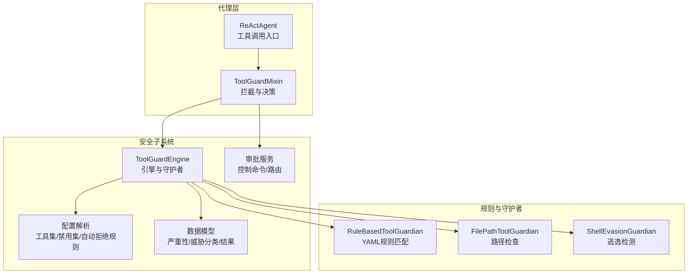
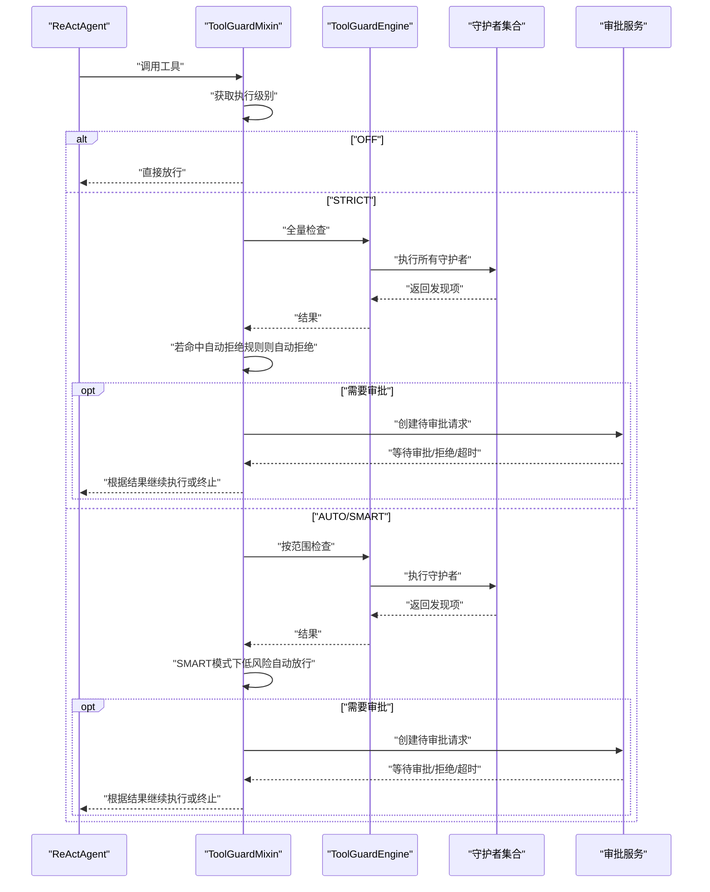
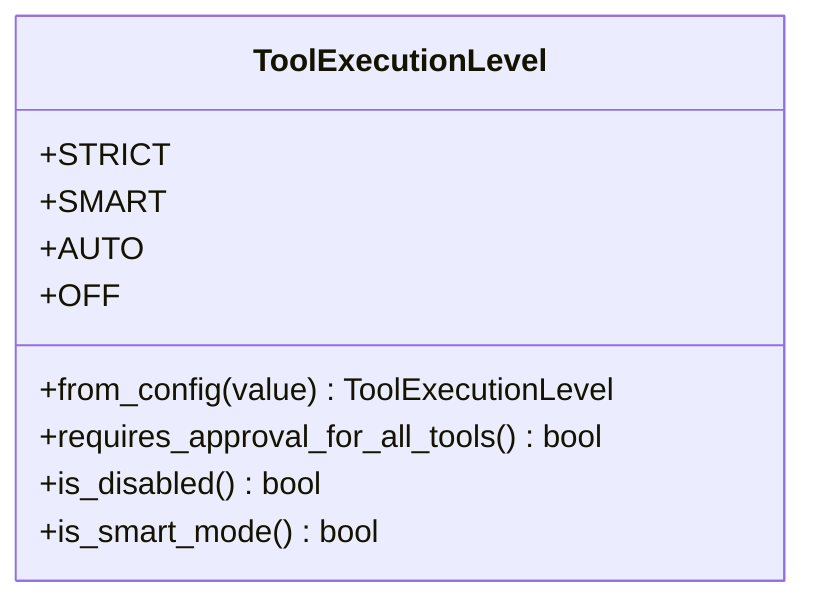
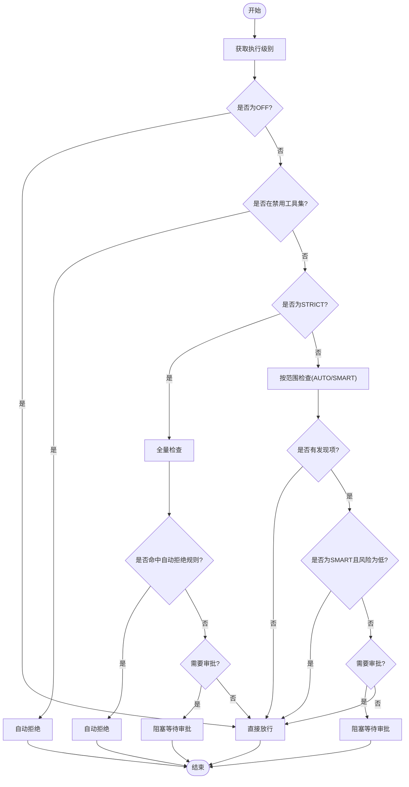
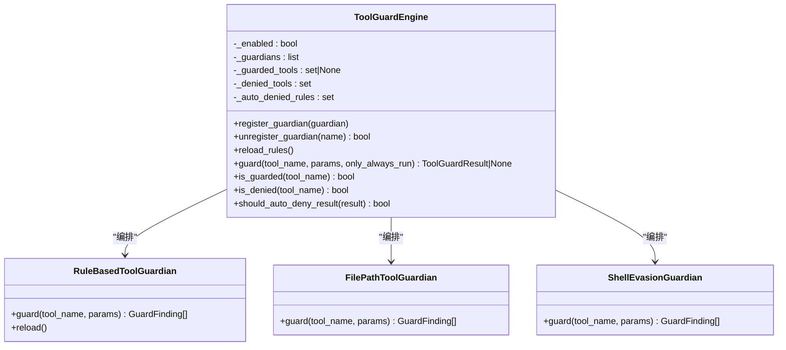
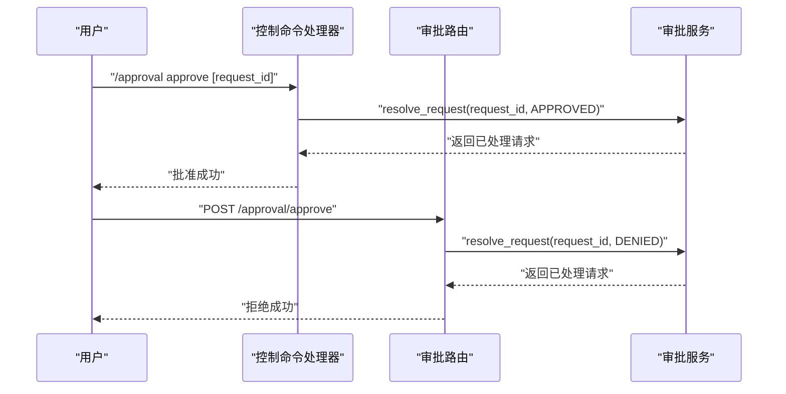
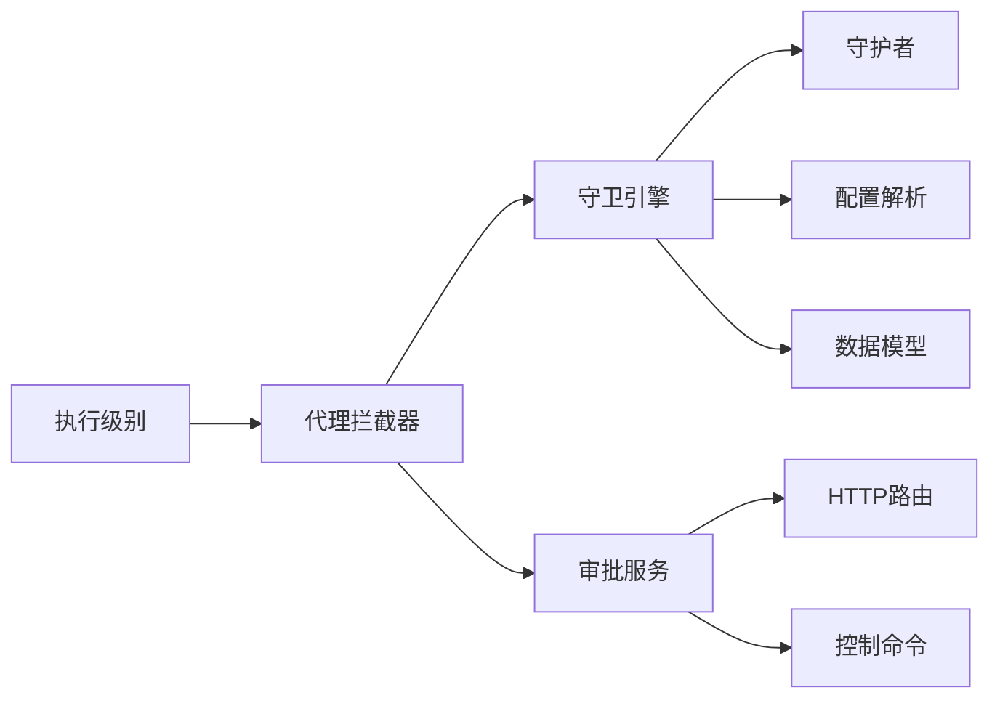

# 执行级别管理

<cite>
**本文引用的文件**
- [execution_level.py](file://src/qwenpaw/security/tool_guard/execution_level.py)
- [tool_guard_mixin.py](file://src/qwenpaw/agents/tool_guard_mixin.py)
- [engine.py](file://src/qwenpaw/security/tool_guard/engine.py)
- [models.py](file://src/qwenpaw/security/tool_guard/models.py)
- [utils.py](file://src/qwenpaw/security/tool_guard/utils.py)
- [approval.py](file://src/qwenpaw/security/tool_guard/approval.py)
- [approval.py（控制命令）](file://src/qwenpaw/app/runner/control_commands/approval_handler.py)
- [approval.py（路由）](file://src/qwenpaw/app/routers/approval.py)
- [security.en.md](file://website/public/docs/security.en.md)
</cite>

## 目录
1. [简介](#简介)
2. [项目结构](#项目结构)
3. [核心组件](#核心组件)
4. [架构总览](#架构总览)
5. [详细组件分析](#详细组件分析)
6. [依赖关系分析](#依赖关系分析)
7. [性能考量](#性能考量)
8. [故障排查指南](#故障排查指南)
9. [结论](#结论)
10. [附录](#附录)

## 简介
本文件围绕“工具守卫的执行级别管理”进行系统化技术文档编制，重点阐述：
- 执行级别的概念、分级策略与权限控制机制
- 不同执行级别的安全阈值、审批流程与风险评估标准
- 执行级别的配置方法、动态调整策略与安全策略参数
- 执行级别与工具调用的关系、审批流程集成与安全审计功能
- 配置示例、风险评估指南与安全决策支持

目标读者包括平台管理员、安全工程师与后端开发者，帮助其在生产环境中正确部署与运维工具守卫的执行级别策略。

## 项目结构
执行级别管理涉及的核心模块分布于安全子系统与代理运行时，主要文件如下：
- 执行级别定义与解析：execution_level.py
- 代理拦截与决策：tool_guard_mixin.py
- 守卫引擎与规则加载：engine.py、utils.py、guardians/*（规则加载）
- 数据模型与严重性等级：models.py
- 审批流程与前端交互：approval.py（审批枚举）、approval_handler.py（控制命令）、approval.py（路由）
- 文档与配置参考：security.en.md

图示来源
- [tool_guard_mixin.py:138-305](file://src/qwenpaw/agents/tool_guard_mixin.py#L138-L305)
- [engine.py:54-269](file://src/qwenpaw/security/tool_guard/engine.py#L54-L269)
- [utils.py:64-157](file://src/qwenpaw/security/tool_guard/utils.py#L64-L157)
- [models.py:25-185](file://src/qwenpaw/security/tool_guard/models.py#L25-L185)
- [approval.py（控制命令）:20-367](file://src/qwenpaw/app/runner/control_commands/approval_handler.py#L20-L367)
- [approval.py（路由）:16-240](file://src/qwenpaw/app/routers/approval.py#L16-L240)

章节来源
- [execution_level.py:15-80](file://src/qwenpaw/security/tool_guard/execution_level.py#L15-L80)
- [tool_guard_mixin.py:113-305](file://src/qwenpaw/agents/tool_guard_mixin.py#L113-L305)
- [engine.py:54-269](file://src/qwenpaw/security/tool_guard/engine.py#L54-L269)
- [utils.py:64-157](file://src/qwenpaw/security/tool_guard/utils.py#L64-L157)
- [models.py:25-185](file://src/qwenpaw/security/tool_guard/models.py#L25-L185)
- [approval.py（控制命令）:20-367](file://src/qwenpaw/app/runner/control_commands/approval_handler.py#L20-L367)
- [approval.py（路由）:16-240](file://src/qwenpaw/app/routers/approval.py#L16-L240)
- [security.en.md:155-178](file://website/public/docs/security.en.md#L155-L178)

## 核心组件
- 执行级别枚举与解析：定义 STRICT、SMART、AUTO、OFF 四级策略，并提供从配置字符串解析的方法。
- 代理拦截器：在工具调用前进行拦截，依据执行级别与规则结果决定是否进入审批流程或直接放行。
- 守卫引擎：统一编排多个守护者（规则匹配、路径检查、逃逸检测），聚合结果并判定是否自动拒绝。
- 数据模型：统一严重性等级、威胁类别、发现项与结果对象，支撑风险评估与日志输出。
- 审批服务：提供控制命令与HTTP接口，支持审批、拒绝、列出待审批与跨会话审批。

章节来源
- [execution_level.py:15-80](file://src/qwenpaw/security/tool_guard/execution_level.py#L15-L80)
- [tool_guard_mixin.py:179-305](file://src/qwenpaw/agents/tool_guard_mixin.py#L179-L305)
- [engine.py:54-269](file://src/qwenpaw/security/tool_guard/engine.py#L54-L269)
- [models.py:25-185](file://src/qwenpaw/security/tool_guard/models.py#L25-L185)
- [approval.py（控制命令）:20-367](file://src/qwenpaw/app/runner/control_commands/approval_handler.py#L20-L367)
- [approval.py（路由）:16-240](file://src/qwenpaw/app/routers/approval.py#L16-L240)

## 架构总览
下图展示从代理发起工具调用到最终执行或阻塞等待审批的关键流程，以及执行级别如何影响决策分支。

图示来源
- [tool_guard_mixin.py:138-305](file://src/qwenpaw/agents/tool_guard_mixin.py#L138-L305)
- [engine.py:200-257](file://src/qwenpaw/security/tool_guard/engine.py#L200-L257)
- [approval.py（控制命令）:37-114](file://src/qwenpaw/app/runner/control_commands/approval_handler.py#L37-L114)
- [approval.py（路由）:50-114](file://src/qwenpaw/app/routers/approval.py#L50-L114)

## 详细组件分析

### 执行级别定义与策略
- STRICT：严格模式，所有工具调用均需人工审批；即使INFO级也会触发审批流。
- SMART：智能模式，默认对低风险（INFO/LOW）自动放行，中高风险（MEDIUM/HIGH/CRITICAL）需审批。
- AUTO：自动模式，仅对被显式纳入“受保护工具集”的工具进行检查；兼容历史行为。
- OFF：关闭模式，完全跳过工具守卫，直接执行。

图示来源
- [execution_level.py:15-80](file://src/qwenpaw/security/tool_guard/execution_level.py#L15-L80)

章节来源
- [execution_level.py:15-80](file://src/qwenpaw/security/tool_guard/execution_level.py#L15-L80)
- [security.en.md:155-178](file://website/public/docs/security.en.md#L155-L178)

### 代理拦截与决策逻辑
- 在工具调用前，代理通过 Mixin 进行拦截与决策。
- 决策流程要点：
  - 若执行级别为 OFF，则直接放行。
  - 若命中“禁用工具集”，立即自动拒绝。
  - STRICT 模式：对所有工具进行全量检查，若存在自动拒绝规则则自动拒绝；否则进入审批。
  - AUTO/SMART 模式：仅对“受保护工具集”内的工具进行全量检查；SMART 对低风险自动放行；其余进入审批。
  - 若存在审批会话信息且需要审批，则创建待审批请求并阻塞等待，期间发送心跳维持连接。

图示来源
- [tool_guard_mixin.py:179-305](file://src/qwenpaw/agents/tool_guard_mixin.py#L179-L305)

章节来源
- [tool_guard_mixin.py:138-305](file://src/qwenpaw/agents/tool_guard_mixin.py#L138-L305)

### 守卫引擎与规则加载
- 引擎负责：
  - 统一初始化默认守护者（路径检查、规则匹配、逃逸检测）。
  - 动态加载受保护工具集、禁用工具集与自动拒绝规则。
  - 条件执行守护者（only_always_run 参数用于非受保护工具的敏感参数检查）。
  - 判定是否应自动拒绝（基于规则ID集合）。
- 规则加载优先级：
  - 用户传入 > 环境变量 > 配置文件 > 默认内置集。
- 严重性与威胁分类：
  - 严重性等级：CRITICAL > HIGH > MEDIUM > LOW > INFO > SAFE。
  - 威胁类别覆盖命令注入、路径穿越、敏感文件访问、网络滥用、凭证暴露、资源滥用、提示注入、代码执行、权限提升等。

图示来源
- [engine.py:54-269](file://src/qwenpaw/security/tool_guard/engine.py#L54-L269)
- [utils.py:64-157](file://src/qwenpaw/security/tool_guard/utils.py#L64-L157)
- [models.py:25-185](file://src/qwenpaw/security/tool_guard/models.py#L25-L185)

章节来源
- [engine.py:54-269](file://src/qwenpaw/security/tool_guard/engine.py#L54-L269)
- [utils.py:64-157](file://src/qwenpaw/security/tool_guard/utils.py#L64-L157)
- [models.py:25-185](file://src/qwenpaw/security/tool_guard/models.py#L25-L185)

### 审批流程与权限控制
- 控制命令：
  - /approval approve/deny/list/cancel 支持跨会话审批与权限校验（仅能审批自身Agent的请求）。
- HTTP 接口：
  - /approval/approve、/approval/deny、/approval/list 提供REST风格审批能力，支持根会话校验与跨会话路由。
- 心跳与超时：
  - 等待审批期间定期发送心跳保持连接；超时自动拒绝并记录。

图示来源
- [approval.py（控制命令）:37-114](file://src/qwenpaw/app/runner/control_commands/approval_handler.py#L37-L114)
- [approval.py（路由）:50-114](file://src/qwenpaw/app/routers/approval.py#L50-L114)

章节来源
- [approval.py（控制命令）:20-367](file://src/qwenpaw/app/runner/control_commands/approval_handler.py#L20-L367)
- [approval.py（路由）:16-240](file://src/qwenpaw/app/routers/approval.py#L16-L240)

### 风险评估与严重性等级
- 严重性排序：CRITICAL > HIGH > MEDIUM > LOW > INFO > SAFE。
- 结果聚合：
  - 最高严重性：max_severity。
  - 是否安全：is_safe（不含CRITICAL/ HIGH）。
  - 记录失败的守护者以便诊断。
- 日志输出：
  - 高风险（CRITICAL/ HIGH）使用警告级别日志；低风险使用信息级别日志。
  - 输出每条发现与汇总信息，便于审计与排障。

章节来源
- [models.py:121-176](file://src/qwenpaw/security/tool_guard/models.py#L121-L176)
- [utils.py:159-194](file://src/qwenpaw/security/tool_guard/utils.py#L159-L194)

## 依赖关系分析
- 执行级别与代理拦截强耦合：代理通过 Mixin 读取执行级别并驱动后续流程。
- 守卫引擎与规则加载弱耦合：引擎通过工具集/禁用集/自动拒绝规则集进行条件判断。
- 审批服务与代理解耦：通过消息与Future实现异步等待，避免阻塞代理主流程。
- 数据模型独立：严重性与威胁类别在多个模块复用，保证一致性。

图示来源
- [tool_guard_mixin.py:113-305](file://src/qwenpaw/agents/tool_guard_mixin.py#L113-L305)
- [engine.py:140-172](file://src/qwenpaw/security/tool_guard/engine.py#L140-L172)
- [utils.py:64-157](file://src/qwenpaw/security/tool_guard/utils.py#L64-L157)
- [models.py:25-185](file://src/qwenpaw/security/tool_guard/models.py#L25-L185)
- [approval.py（控制命令）:20-367](file://src/qwenpaw/app/runner/control_commands/approval_handler.py#L20-L367)
- [approval.py（路由）:16-240](file://src/qwenpaw/app/routers/approval.py#L16-L240)

章节来源
- [tool_guard_mixin.py:113-305](file://src/qwenpaw/agents/tool_guard_mixin.py#L113-L305)
- [engine.py:140-172](file://src/qwenpaw/security/tool_guard/engine.py#L140-L172)
- [utils.py:64-157](file://src/qwenpaw/security/tool_guard/utils.py#L64-L157)
- [models.py:25-185](file://src/qwenpaw/security/tool_guard/models.py#L25-L185)
- [approval.py（控制命令）:20-367](file://src/qwenpaw/app/runner/control_commands/approval_handler.py#L20-L367)
- [approval.py（路由）:16-240](file://src/qwenpaw/app/routers/approval.py#L16-L240)

## 性能考量
- 并发与串行：
  - 决策阶段在锁内完成，确保状态一致性；实际工具执行在锁外并行，避免阻塞。
- 规则匹配：
  - 使用预编译正则与字符串扫描，减少重复开销；仅对适用工具与参数执行规则匹配。
- 日志与审计：
  - 高风险发现使用警告级别日志，低风险使用信息级别，兼顾可观测性与性能。
- 心跳与超时：
  - 等待审批期间的心跳频率可配置，避免长连接占用过多资源。

[本节为通用性能讨论，不直接分析具体文件]

## 故障排查指南
- 常见问题
  - 审批未生效：确认代理上下文中存在会话ID；检查执行级别是否为需要审批的模式。
  - 自动拒绝未触发：核对自动拒绝规则ID集合与规则匹配情况。
  - 审批超时：检查审批超时时间配置与网络稳定性；确认心跳机制正常。
  - 跨会话审批失败：确认根会话ID一致与权限校验通过。
- 定位手段
  - 查看工具守卫日志中的发现项与汇总信息。
  - 使用 /approval list 查看待审批队列，定位请求ID与会话树。
  - 检查配置文件与环境变量对工具集/禁用集/自动拒绝规则的影响。

章节来源
- [tool_guard_mixin.py:417-517](file://src/qwenpaw/agents/tool_guard_mixin.py#L417-L517)
- [utils.py:159-194](file://src/qwenpaw/security/tool_guard/utils.py#L159-L194)
- [approval.py（控制命令）:174-230](file://src/qwenpaw/app/runner/control_commands/approval_handler.py#L174-L230)
- [approval.py（路由）:187-240](file://src/qwenpaw/app/routers/approval.py#L187-L240)

## 结论
执行级别管理通过“策略—拦截—检查—审批—执行”的闭环，实现了对工具调用的精细化安全控制。在生产环境中建议采用 SMART 模式作为默认策略，在高风险场景启用 STRICT 模式，并结合严格的规则集与自动拒绝规则，配合完善的审批与审计机制，达到安全与效率的平衡。

[本节为总结性内容，不直接分析具体文件]

## 附录

### 配置方法与动态调整
- 执行级别配置位置
  - agent.json 中的 approval_level 字段，支持 strict/smart/auto/off。
  - 控制台“Settings → Agents”中进行可视化配置。
- 规则与工具集
  - 受保护工具集：可通过环境变量、配置文件或默认内置集设定。
  - 禁用工具集：对命中工具直接自动拒绝。
  - 自动拒绝规则：命中即刻拒绝，无需人工审批。
- 动态调整
  - 引擎支持重新加载规则与刷新工具集，适用于运行时策略变更。

章节来源
- [execution_level.py:52-67](file://src/qwenpaw/security/tool_guard/execution_level.py#L52-L67)
- [utils.py:64-157](file://src/qwenpaw/security/tool_guard/utils.py#L64-L157)
- [engine.py:166-171](file://src/qwenpaw/security/tool_guard/engine.py#L166-L171)
- [security.en.md:155-178](file://website/public/docs/security.en.md#L155-L178)

### 安全策略参数
- 严重性阈值
  - SMART 模式：INFO/LOW 自动放行；MEDIUM/HIGH/CRITICAL 需审批。
  - AUTO 模式：仅受保护工具集内的高风险需要审批。
- 自动拒绝规则
  - 命中特定规则ID即自动拒绝，无需人工干预。
- 审批超时与心跳
  - 超时时间可配置；等待期间发送心跳维持连接。

章节来源
- [tool_guard_mixin.py:284-304](file://src/qwenpaw/agents/tool_guard_mixin.py#L284-L304)
- [engine.py:177-188](file://src/qwenpaw/security/tool_guard/engine.py#L177-L188)
- [models.py:121-144](file://src/qwenpaw/security/tool_guard/models.py#L121-L144)

### 执行级别设置示例
- 示例一：严格模式
  - 将 agent.json 的 approval_level 设为 strict，所有工具调用均需审批。
- 示例二：智能模式
  - 将 approval_level 设为 smart，默认低风险自动放行，中高风险进入审批。
- 示例三：自动模式
  - 保持默认 AUTO，仅对受保护工具集内的工具进行检查。
- 示例四：关闭模式
  - 将 approval_level 设为 off，完全跳过工具守卫。

章节来源
- [security.en.md:155-178](file://website/public/docs/security.en.md#L155-L178)

### 风险评估指南与安全决策支持
- 风险评估
  - 依据最高严重性与发现项数量综合评估；高风险发现项使用警告级别日志。
- 决策支持
  - 提供发现项摘要与修复建议；在SMART模式下自动放行低风险项。
- 审计与追溯
  - 审批请求包含工具名、严重性、发现数、参数与时间戳，便于审计。

章节来源
- [approval.py:20-42](file://src/qwenpaw/security/tool_guard/approval.py#L20-L42)
- [models.py:121-176](file://src/qwenpaw/security/tool_guard/models.py#L121-L176)
- [tool_guard_mixin.py:617-684](file://src/qwenpaw/agents/tool_guard_mixin.py#L617-L684)