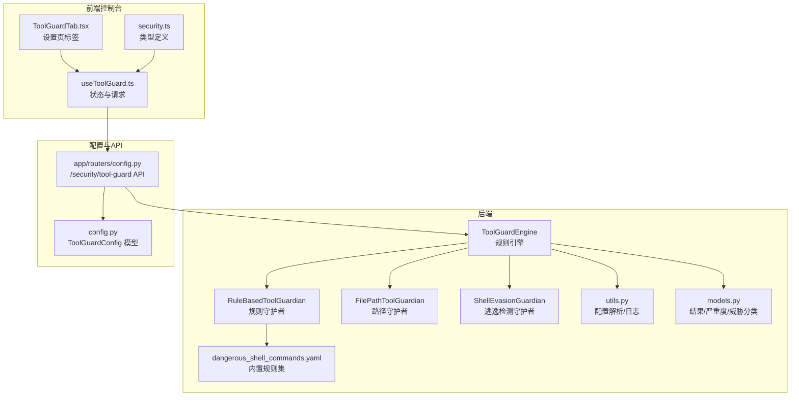
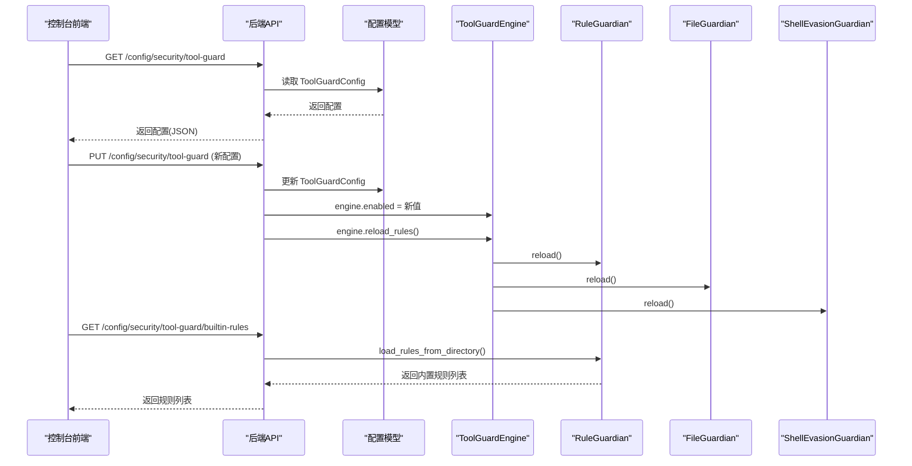
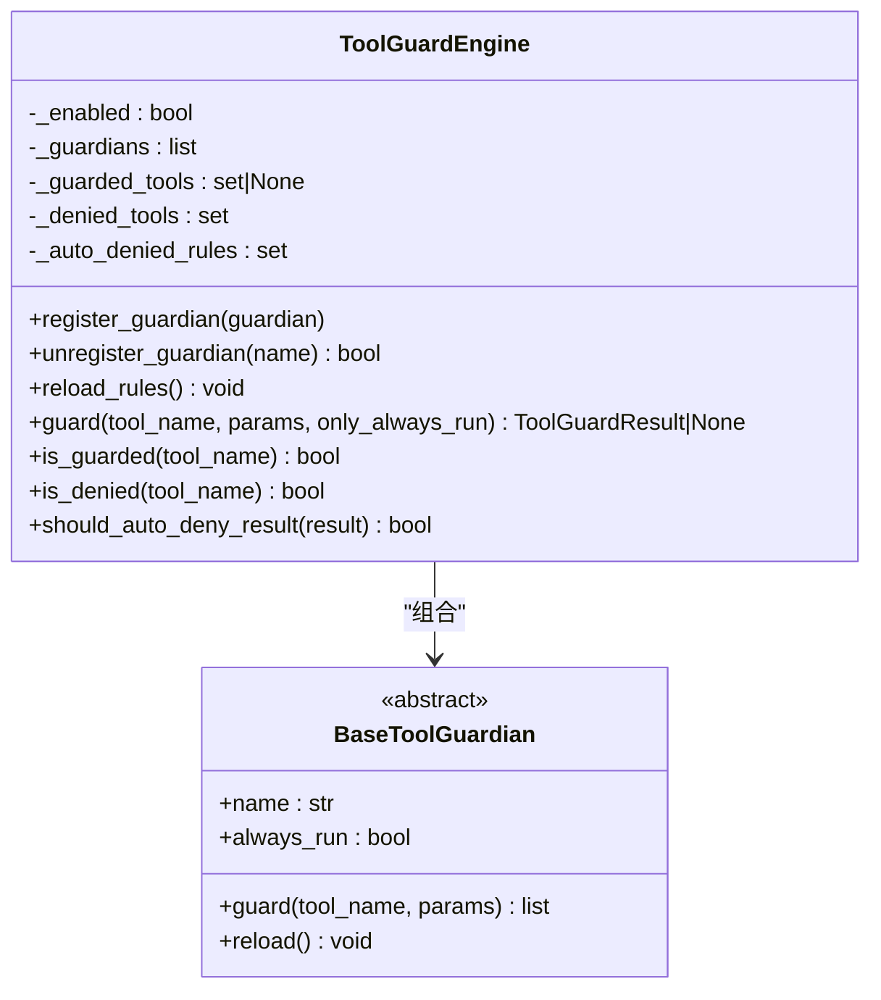
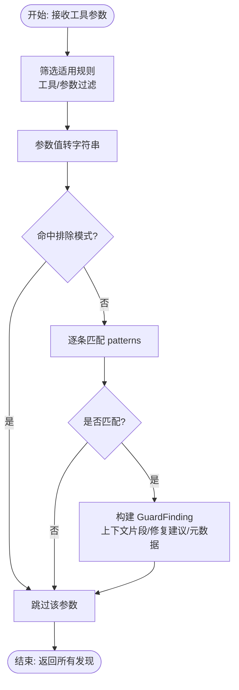
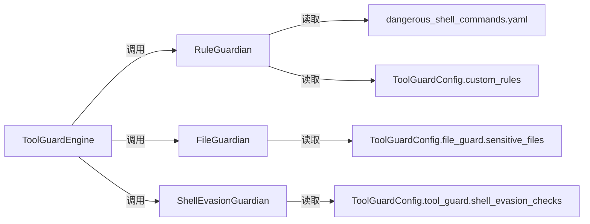

# 规则配置

<cite>
**本文引用的文件**
- [engine.py](file://src/qwenpaw/security/tool_guard/engine.py)
- [models.py](file://src/qwenpaw/security/tool_guard/models.py)
- [utils.py](file://src/qwenpaw/security/tool_guard/utils.py)
- [rule_guardian.py](file://src/qwenpaw/security/tool_guard/guardians/rule_guardian.py)
- [file_guardian.py](file://src/qwenpaw/security/tool_guard/guardians/file_guardian.py)
- [shell_evasion_guardian.py](file://src/qwenpaw/security/tool_guard/guardians/shell_evasion_guardian.py)
- [__init__.py（guardians）](file://src/qwenpaw/security/tool_guard/guardians/__init__.py)
- [dangerous_shell_commands.yaml](file://src/qwenpaw/security/tool_guard/rules/dangerous_shell_commands.yaml)
- [config.py（配置模型）](file://src/qwenpaw/config/config.py)
- [config.py（应用路由）](file://src/qwenpaw/app/routers/config.py)
- [security.ts（前端类型）](file://console/src/api/modules/security.ts)
- [useToolGuard.ts（前端逻辑）](file://console/src/pages/Settings/Security/useToolGuard.ts)
- [ToolGuardTab.tsx（前端界面）](file://console/src/pages/Settings/Security/components/ToolGuardTab.tsx)
- [approval.py](file://src/qwenpaw/security/tool_guard/approval.py)
- [execution_level.py](file://src/qwenpaw/security/tool_guard/execution_level.py)
- [tool_guard_mixin.py](file://src/qwenpaw/agents/tool_guard_mixin.py)
- [security.en.md（示例）](file://website/public/docs/security.en.md)
</cite>

## 目录
1. [简介](#简介)
2. [项目结构](#项目结构)
3. [核心组件](#核心组件)
4. [架构总览](#架构总览)
5. [详细组件分析](#详细组件分析)
6. [依赖关系分析](#依赖关系分析)
7. [性能考量](#性能考量)
8. [故障排查指南](#故障排查指南)
9. [结论](#结论)
10. [附录](#附录)

## 简介
本文件面向工具守卫的“规则配置系统”，系统性阐述规则引擎的工作原理、规则加载机制与动态更新策略；详解危险命令规则的定义格式、匹配算法与优先级处理；文档化规则配置文件的语法、验证机制与错误处理；并提供规则定制示例、自定义规则开发与规则测试方法，以及版本管理、批量更新与回滚机制建议。

## 项目结构
规则配置系统由“规则引擎 + 多守护者 + 配置解析 + 前端控制台”构成，核心代码位于 src/qwenpaw/security/tool_guard 及其子模块，配置模型与API路由位于 src/qwenpaw/config 与 src/qwenpaw/app/routers 下，前端控制台位于 console/src。

图示来源
- [engine.py:54-269](file://src/qwenpaw/security/tool_guard/engine.py#L54-L269)
- [rule_guardian.py:559-758](file://src/qwenpaw/security/tool_guard/guardians/rule_guardian.py#L559-L758)
- [file_guardian.py:301-501](file://src/qwenpaw/security/tool_guard/guardians/file_guardian.py#L301-L501)
- [shell_evasion_guardian.py:539-593](file://src/qwenpaw/security/tool_guard/guardians/shell_evasion_guardian.py#L539-L593)
- [utils.py:64-194](file://src/qwenpaw/security/tool_guard/utils.py#L64-L194)
- [models.py:25-185](file://src/qwenpaw/security/tool_guard/models.py#L25-L185)
- [dangerous_shell_commands.yaml:1-310](file://src/qwenpaw/security/tool_guard/rules/dangerous_shell_commands.yaml#L1-L310)
- [config.py（配置模型）](file://src/qwenpaw/config/config.py)
- [config.py（应用路由）:661-703](file://src/qwenpaw/app/routers/config.py#L661-L703)
- [security.ts:1-172](file://console/src/api/modules/security.ts#L1-L172)
- [useToolGuard.ts:1-69](file://console/src/pages/Settings/Security/useToolGuard.ts#L1-L69)
- [ToolGuardTab.tsx:1-43](file://console/src/pages/Settings/Security/components/ToolGuardTab.tsx#L1-L43)

章节来源
- [engine.py:54-269](file://src/qwenpaw/security/tool_guard/engine.py#L54-L269)
- [rule_guardian.py:559-758](file://src/qwenpaw/security/tool_guard/guardians/rule_guardian.py#L559-L758)
- [file_guardian.py:301-501](file://src/qwenpaw/security/tool_guard/guardians/file_guardian.py#L301-L501)
- [shell_evasion_guardian.py:539-593](file://src/qwenpaw/security/tool_guard/guardians/shell_evasion_guardian.py#L539-L593)
- [utils.py:64-194](file://src/qwenpaw/security/tool_guard/utils.py#L64-L194)
- [models.py:25-185](file://src/qwenpaw/security/tool_guard/models.py#L25-L185)
- [dangerous_shell_commands.yaml:1-310](file://src/qwenpaw/security/tool_guard/rules/dangerous_shell_commands.yaml#L1-L310)
- [config.py（配置模型）](file://src/qwenpaw/config/config.py)
- [config.py（应用路由）:661-703](file://src/qwenpaw/app/routers/config.py#L661-L703)
- [security.ts:1-172](file://console/src/api/modules/security.ts#L1-L172)
- [useToolGuard.ts:1-69](file://console/src/pages/Settings/Security/useToolGuard.ts#L1-L69)
- [ToolGuardTab.tsx:1-43](file://console/src/pages/Settings/Security/components/ToolGuardTab.tsx#L1-L43)

## 核心组件
- 规则引擎（ToolGuardEngine）
  - 单例模式，负责注册/调用守护者、聚合结果、动态重载规则与工具集合。
  - 支持环境变量与配置文件双重开关，支持按工具名/规则ID的白名单/黑名单。
- 守护者体系
  - 规则守护者：基于YAML签名规则进行正则匹配，支持排除模式、上下文片段、工作区外路径检查等增强。
  - 路径守护者：对敏感文件/目录访问进行阻断，支持Windows/POSIX路径归一化与工作区边界检查。
  - 逃逸检测守护者：检测命令替换、转义空格/操作符、换行隐藏命令、注释引号不同步、带引号换行+注释行剥离等逃逸技巧。
- 配置与模型
  - ToolGuardConfig：启用开关、受保护工具集、禁止工具集、自定义规则、禁用规则ID、自动拒绝规则ID、Shell逃逸检测项等。
  - GuardFinding/ToolGuardResult：统一的发现与结果模型，含严重度、威胁类别、修复建议、元数据等。
- 前端控制台
  - 类型定义、获取/更新工具守卫配置、内置规则列表、合并内置与自定义规则、切换规则启用/自动拒绝、Shell逃逸检测开关。

章节来源
- [engine.py:54-269](file://src/qwenpaw/security/tool_guard/engine.py#L54-L269)
- [rule_guardian.py:559-758](file://src/qwenpaw/security/tool_guard/guardians/rule_guardian.py#L559-L758)
- [file_guardian.py:301-501](file://src/qwenpaw/security/tool_guard/guardians/file_guardian.py#L301-L501)
- [shell_evasion_guardian.py:539-593](file://src/qwenpaw/security/tool_guard/guardians/shell_evasion_guardian.py#L539-L593)
- [models.py:25-185](file://src/qwenpaw/security/tool_guard/models.py#L25-L185)
- [config.py（配置模型）](file://src/qwenpaw/config/config.py)
- [security.ts:1-172](file://console/src/api/modules/security.ts#L1-L172)
- [useToolGuard.ts:1-69](file://console/src/pages/Settings/Security/useToolGuard.ts#L1-L69)

## 架构总览
规则配置系统采用“引擎-守护者-规则文件-配置模型-前端控制台”的分层架构。引擎在运行时组合多个守护者，守护者从YAML规则与配置中读取规则，扫描工具参数字符串，生成标准化的发现记录，并由引擎汇总为最终结果。前端通过API获取/更新配置，实时反映规则状态。

图示来源
- [config.py（应用路由）:661-703](file://src/qwenpaw/app/routers/config.py#L661-L703)
- [engine.py:166-172](file://src/qwenpaw/security/tool_guard/engine.py#L166-L172)
- [rule_guardian.py:590-594](file://src/qwenpaw/security/tool_guard/guardians/rule_guardian.py#L590-L594)
- [file_guardian.py:361-365](file://src/qwenpaw/security/tool_guard/guardians/file_guardian.py#L361-L365)
- [shell_evasion_guardian.py:551-554](file://src/qwenpaw/security/tool_guard/guardians/shell_evasion_guardian.py#L551-L554)

## 详细组件分析

### 规则引擎（ToolGuardEngine）
- 职责
  - 注册默认守护者（路径、规则、逃逸），聚合各守护者结果。
  - 解析环境变量与配置文件，决定是否启用与作用范围。
  - 动态重载规则与工具集合，支持运行时调整。
- 关键点
  - 默认守护者集合与失败降级日志。
  - 工具/规则集合解析：受保护工具集、禁止工具集、自动拒绝规则集。
  - 结果聚合：记录使用的守护者、失败的守护者及其错误。
- 动态更新
  - reload_rules() 调用各守护者的 reload()，随后刷新工具/规则集合。

图示来源
- [engine.py:54-269](file://src/qwenpaw/security/tool_guard/engine.py#L54-L269)
- [__init__.py（guardians）:17-62](file://src/qwenpaw/security/tool_guard/guardians/__init__.py#L17-L62)

章节来源
- [engine.py:54-269](file://src/qwenpaw/security/tool_guard/engine.py#L54-L269)
- [__init__.py（guardians）:17-62](file://src/qwenpaw/security/tool_guard/guardians/__init__.py#L17-L62)

### 规则守护者（RuleBasedToolGuardian）
- 规则来源
  - 内置规则：dangerous_shell_commands.yaml 等YAML文件。
  - 自定义规则：config.json 中 security.tool_guard.custom_rules。
  - 禁用规则：config.json 中 security.tool_guard.disabled_rules。
- 匹配流程
  - 过滤适用工具与参数。
  - 将参数值转换为字符串进行扫描。
  - 正则匹配 patterns，排除 exclude_patterns。
  - 生成 GuardFinding，包含上下文片段、修复建议、元数据。
- 特殊增强
  - rm 命令：检测工作区外文件删除风险，附加提示与修复建议。
- 动态更新
  - reload() 合并内置+自定义规则并剔除禁用ID。

图示来源
- [rule_guardian.py:608-758](file://src/qwenpaw/security/tool_guard/guardians/rule_guardian.py#L608-L758)
- [dangerous_shell_commands.yaml:1-310](file://src/qwenpaw/security/tool_guard/rules/dangerous_shell_commands.yaml#L1-L310)

章节来源
- [rule_guardian.py:559-758](file://src/qwenpaw/security/tool_guard/guardians/rule_guardian.py#L559-L758)
- [dangerous_shell_commands.yaml:1-310](file://src/qwenpaw/security/tool_guard/rules/dangerous_shell_commands.yaml#L1-L310)

### 路径守护者（FilePathToolGuardian）
- 职责
  - 对敏感文件/目录访问进行阻断。
  - 支持Windows/POSIX路径归一化、工作区边界检查。
- 路径提取与检查
  - 从 shell 命令中提取候选路径，处理重定向、引号、转义等。
  - 使用前缀匹配判断是否命中敏感路径或目录。
- 动态更新
  - reload() 重新加载配置中的敏感文件列表。

章节来源
- [file_guardian.py:301-501](file://src/qwenpaw/security/tool_guard/guardians/file_guardian.py#L301-L501)

### 逃逸检测守护者（ShellEvasionGuardian）
- 职责
  - 检测命令替换、标志位混淆、反斜杠转义空格/操作符、隐藏换行、注释引号不同步、带引号换行+注释行剥离等逃逸技术。
- 实现要点
  - 引号状态机跟踪，区分单/双引号与转义字符。
  - 对“单引号外内容”进行特定模式匹配。
  - 按需启用具体检测项（来自配置）。

章节来源
- [shell_evasion_guardian.py:539-593](file://src/qwenpaw/security/tool_guard/guardians/shell_evasion_guardian.py#L539-L593)

### 配置模型与API
- ToolGuardConfig
  - 字段：enabled、guarded_tools、denied_tools、custom_rules、disabled_rules、auto_denied_rules、shell_evasion_checks。
- API
  - GET /security/tool-guard：获取当前配置。
  - PUT /security/tool-guard：更新配置并触发引擎 reload_rules()。
  - GET /security/tool-guard/builtin-rules：列出内置规则。
- 前端
  - useToolGuard.ts：并发拉取配置与内置规则，维护禁用/自动拒绝集合与Shell逃逸检测开关。
  - ToolGuardTab.tsx：渲染设置页，支持预览/编辑/删除自定义规则，切换启用状态与自动拒绝。

章节来源
- [config.py（配置模型）](file://src/qwenpaw/config/config.py)
- [config.py（应用路由）:661-703](file://src/qwenpaw/app/routers/config.py#L661-L703)
- [security.ts:1-172](file://console/src/api/modules/security.ts#L1-L172)
- [useToolGuard.ts:1-69](file://console/src/pages/Settings/Security/useToolGuard.ts#L1-L69)
- [ToolGuardTab.tsx:1-43](file://console/src/pages/Settings/Security/components/ToolGuardTab.tsx#L1-L43)

### 执行级别与审批
- 执行级别（ToolExecutionLevel）
  - STRICT：严格模式，所有工具均需审批。
  - SMART：智能模式，低风险自动放行，中高风险需要审批。
  - AUTO：仅受保护工具需要审批（向后兼容）。
  - OFF：完全关闭。
- 审批摘要
  - format_findings_summary() 用于生成审批摘要文本。

章节来源
- [execution_level.py:15-80](file://src/qwenpaw/security/tool_guard/execution_level.py#L15-L80)
- [approval.py:20-42](file://src/qwenpaw/security/tool_guard/approval.py#L20-L42)
- [tool_guard_mixin.py:296-337](file://src/qwenpaw/agents/tool_guard_mixin.py#L296-L337)

## 依赖关系分析
- 组件耦合
  - ToolGuardEngine 依赖守护者接口 BaseToolGuardian，通过组合实现多策略并行。
  - RuleBasedToolGuardian 依赖 YAML 规则文件与配置模型，动态合并内置/自定义规则。
  - FilePathToolGuardian 依赖工作区上下文与配置敏感路径列表。
  - ShellEvasionGuardian 依赖配置中的检测项开关。
- 外部依赖
  - YAML 解析（ruamel.yaml 或 pyyaml）、正则表达式、路径库、时间戳记录。
- 循环依赖
  - 未见循环导入；守护者通过抽象接口与引擎交互。

图示来源
- [engine.py:200-258](file://src/qwenpaw/security/tool_guard/engine.py#L200-L258)
- [rule_guardian.py:583-594](file://src/qwenpaw/security/tool_guard/guardians/rule_guardian.py#L583-L594)
- [file_guardian.py:361-365](file://src/qwenpaw/security/tool_guard/guardians/file_guardian.py#L361-L365)
- [shell_evasion_guardian.py:551-554](file://src/qwenpaw/security/tool_guard/guardians/shell_evasion_guardian.py#L551-L554)

章节来源
- [engine.py:200-258](file://src/qwenpaw/security/tool_guard/engine.py#L200-L258)
- [rule_guardian.py:583-594](file://src/qwenpaw/security/tool_guard/guardians/rule_guardian.py#L583-L594)
- [file_guardian.py:361-365](file://src/qwenpaw/security/tool_guard/guardians/file_guardian.py#L361-L365)
- [shell_evasion_guardian.py:551-554](file://src/qwenpaw/security/tool_guard/guardians/shell_evasion_guardian.py#L551-L554)

## 性能考量
- 规则匹配
  - 正则预编译，避免重复编译开销；排除模式优先于主模式。
  - 参数值转字符串后进行扫描，避免深层对象遍历。
- 路径检查
  - 归一化与去重，减少重复匹配；Windows/POSIX 兼容路径处理。
- 逃逸检测
  - 引号状态机线性扫描，避免复杂解析器；仅对 execute_shell_command 生效。
- 引擎聚合
  - 逐守护者收集发现，记录失败守护者以便诊断。
- 建议
  - 控制规则数量与正则复杂度；合理使用 exclude_patterns；必要时拆分规则文件。

[本节为通用指导，不直接分析具体文件]

## 故障排查指南
- 规则加载失败
  - YAML 文件不存在或格式错误：守护者会记录警告并跳过无效规则。
  - 自定义规则字段缺失或非法：记录警告并跳过该规则。
- 配置更新未生效
  - 确认已调用 PUT /security/tool-guard 并触发 engine.reload_rules()。
  - 检查禁用规则ID是否正确；检查 auto_denied_rules 是否命中。
- 路径误报/漏报
  - 检查敏感路径列表与工作区根目录；确认路径归一化是否符合预期。
- 逃逸检测误报
  - 通过配置关闭特定检测项；仅在确有需要时启用。
- 日志定位
  - 使用 utils.log_findings() 输出结构化日志，便于审计与问题追踪。

章节来源
- [rule_guardian.py:432-465](file://src/qwenpaw/security/tool_guard/guardians/rule_guardian.py#L432-L465)
- [rule_guardian.py:518-551](file://src/qwenpaw/security/tool_guard/guardians/rule_guardian.py#L518-L551)
- [utils.py:159-194](file://src/qwenpaw/security/tool_guard/utils.py#L159-L194)
- [config.py（应用路由）:674-692](file://src/qwenpaw/app/routers/config.py#L674-L692)

## 结论
规则配置系统以“可插拔守护者 + YAML规则 + 配置驱动”的方式实现了灵活、可扩展的工具调用安全防护。通过严格的规则加载与动态更新机制、完善的错误处理与日志输出，系统能够在生产环境中稳定运行。前端控制台提供了可视化的规则管理能力，配合执行级别与审批流程，形成完整的安全闭环。

[本节为总结性内容，不直接分析具体文件]

## 附录

### 规则定义格式与优先级
- 规则字段
  - id：唯一标识。
  - tools/params：目标工具/参数名（为空表示全部）。
  - category：威胁类别（如 command_injection、code_execution 等）。
  - severity：严重度（CRITICAL/HIGH/MEDIUM/LOW/INFO/SAFE）。
  - patterns：正则模式列表。
  - exclude_patterns：排除模式列表。
  - description/remediation：描述与修复建议。
- 匹配优先级
  - 先应用工具/参数过滤，再匹配 exclude_patterns，最后匹配 patterns。
  - rm 命令额外进行工作区外路径检查，增强提示与修复建议。
- 内置规则
  - dangerous_shell_commands.yaml 提供常见危险命令与逃逸检测规则。

章节来源
- [rule_guardian.py:331-425](file://src/qwenpaw/security/tool_guard/guardians/rule_guardian.py#L331-L425)
- [dangerous_shell_commands.yaml:1-310](file://src/qwenpaw/security/tool_guard/rules/dangerous_shell_commands.yaml#L1-L310)

### 配置文件语法与验证
- ToolGuardConfig 字段
  - enabled：是否启用。
  - guarded_tools：受保护工具集合（支持通配/空/关闭）。
  - denied_tools：禁止工具集合。
  - custom_rules：自定义规则数组。
  - disabled_rules：禁用规则ID集合。
  - auto_denied_rules：自动拒绝规则ID集合。
  - shell_evasion_checks：逐项启用/禁用的逃逸检测。
- 验证与默认
  - 通过 Pydantic 模型校验；未配置时使用默认值。
  - 环境变量可覆盖部分字段。

章节来源
- [config.py（配置模型）](file://src/qwenpaw/config/config.py)
- [utils.py:64-194](file://src/qwenpaw/security/tool_guard/utils.py#L64-L194)

### 动态更新与回滚
- 动态更新
  - PUT /security/tool-guard 更新配置后，引擎立即 reload_rules()。
  - 各守护者 reload() 刷新内部状态（如敏感路径、检测开关）。
- 回滚建议
  - 保留上一个配置快照；失败时恢复；通过前端撤销变更或再次 PUT 恢复。
  - 对关键规则（auto_denied_rules）变更进行审批与公告。

章节来源
- [config.py（应用路由）:674-692](file://src/qwenpaw/app/routers/config.py#L674-L692)
- [engine.py:166-172](file://src/qwenpaw/security/tool_guard/engine.py#L166-L172)

### 规则定制示例与测试
- 示例参考
  - 官方文档示例展示了如何添加敏感文件访问与资源滥用规则。
- 开发步骤
  - 在 config.json 的 custom_rules 中新增规则条目。
  - 使用 exclude_patterns 进行精确排除。
  - 通过前端“内置规则”页面对比效果。
- 测试方法
  - 编写最小化命令样例，覆盖 patterns 与排除场景。
  - 使用严格/智能/自动三种执行级别验证审批行为。
  - 查看结构化日志与 ToolGuardResult 字段核对匹配情况。

章节来源
- [security.en.md（示例）:118-153](file://website/public/docs/security.en.md#L118-L153)
- [useToolGuard.ts:27-69](file://console/src/pages/Settings/Security/useToolGuard.ts#L27-L69)
- [approval.py:20-42](file://src/qwenpaw/security/tool_guard/approval.py#L20-L42)