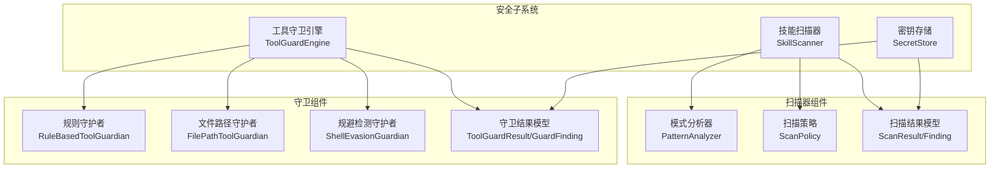
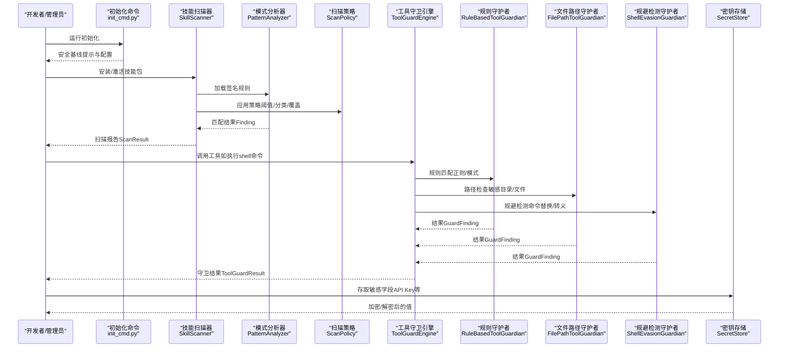
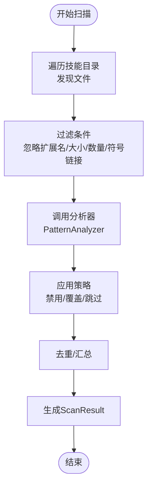
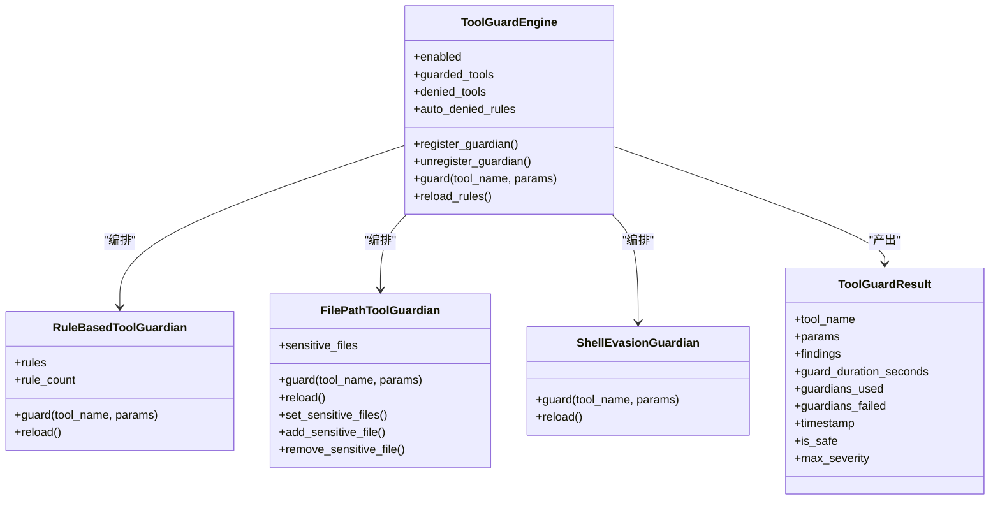
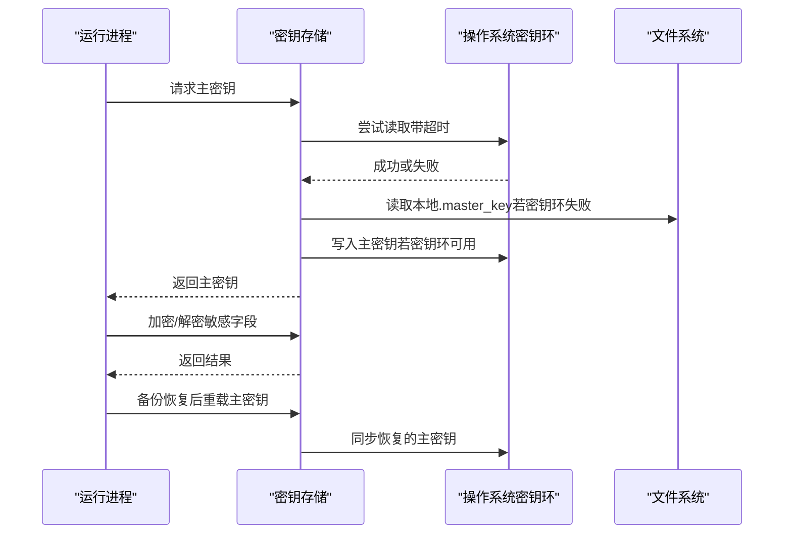
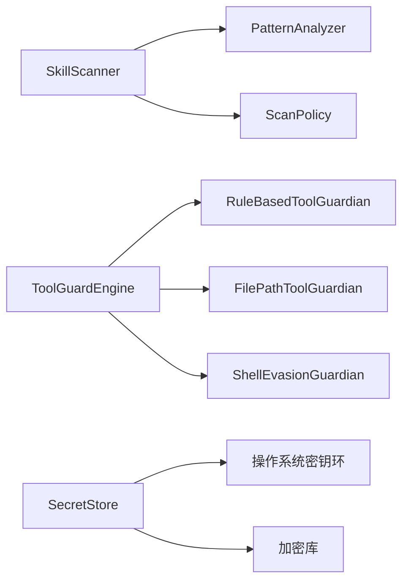

# 供应链攻击检测

<cite>
**本文档引用的文件**
- [README.md](file://README.md)
- [SECURITY.md](file://SECURITY.md)
- [__init__.py（安全框架）](file://src/qwenpaw/security/__init__.py)
- [scanner.py（技能扫描器）](file://src/qwenpaw/security/skill_scanner/scanner.py)
- [models.py（技能扫描模型）](file://src/qwenpaw/security/skill_scanner/models.py)
- [scan_policy.py（扫描策略）](file://src/qwenpaw/security/skill_scanner/scan_policy.py)
- [pattern_analyzer.py（模式分析器）](file://src/qwenpaw/security/skill_scanner/analyzers/pattern_analyzer.py)
- [engine.py（工具守卫引擎）](file://src/qwenpaw/security/tool_guard/engine.py)
- [models.py（工具守卫模型）](file://src/qwenpaw/security/tool_guard/models.py)
- [file_guardian.py（文件路径守护者）](file://src/qwenpaw/security/tool_guard/guardians/file_guardian.py)
- [rule_guardian.py（规则守护者）](file://src/qwenpaw/security/tool_guard/guardians/rule_guardian.py)
- [shell_evasion_guardian.py（命令行规避守护者）](file://src/qwenpaw/security/tool_guard/guardians/shell_evasion_guardian.py)
- [secret_store.py（密钥存储）](file://src/qwenpaw/security/secret_store.py)
- [init_cmd.py（初始化命令）](file://src/qwenpaw/cli/init_cmd.py)
</cite>

## 目录
1. [简介](#简介)
2. [项目结构](#项目结构)
3. [核心组件](#核心组件)
4. [架构总览](#架构总览)
5. [详细组件分析](#详细组件分析)
6. [依赖关系分析](#依赖关系分析)
7. [性能考虑](#性能考虑)
8. [故障排除指南](#故障排除指南)
9. [结论](#结论)
10. [附录](#附录)

## 简介
本文件面向QwenPaw供应链攻击检测系统，系统性阐述软件供应链安全威胁的检测机制与治理框架，覆盖依赖包篡改检测、恶意代码注入识别、构建过程攻击防护与分发链路监控。文档同时总结常见供应链攻击模式（依赖劫持、中间人攻击、恶意发布、回滚攻击等），并提供可落地的安全治理建议、依赖审计工具与安全构建流程，以及第三方组件风险管理、漏洞跟踪与应急响应预案。

## 项目结构
QwenPaw在src/qwenpaw/security目录下提供了完整的多层安全能力：
- 技能安全扫描：对技能包进行静态分析，识别硬编码密钥、命令注入、数据泄露等风险
- 工具调用守卫：在执行前拦截危险参数，阻断路径穿越、敏感文件访问、命令注入与规避行为
- 密钥存储：透明加密存储敏感字段，结合操作系统密钥环与文件备份恢复
- 初始化安全提示：通过交互式初始化流程强化用户对信任边界与最小权限的理解

**图表来源**
- [scanner.py:76-319](file://src/qwenpaw/security/skill_scanner/scanner.py#L76-L319)
- [engine.py:54-269](file://src/qwenpaw/security/tool_guard/engine.py#L54-L269)
- [pattern_analyzer.py:236-393](file://src/qwenpaw/security/skill_scanner/analyzers/pattern_analyzer.py#L236-L393)
- [scan_policy.py:156-476](file://src/qwenpaw/security/skill_scanner/scan_policy.py#L156-L476)
- [models.py（技能扫描）:168-235](file://src/qwenpaw/security/skill_scanner/models.py#L168-L235)
- [models.py（工具守卫）:103-185](file://src/qwenpaw/security/tool_guard/models.py#L103-L185)
- [secret_store.py:293-414](file://src/qwenpaw/security/secret_store.py#L293-L414)

**章节来源**
- [README.md:388-399](file://README.md#L388-L399)
- [SECURITY.md:1-158](file://SECURITY.md#L1-L158)
- [__init__.py（安全框架）:1-21](file://src/qwenpaw/security/__init__.py#L1-L21)

## 核心组件
- 技能扫描器（SkillScanner）
  - 遍历技能包文件，按策略配置选择性扫描，支持去重与超时/大小限制
  - 默认使用模式分析器（PatternAnalyzer）加载签名规则，识别硬编码密钥、命令注入、数据泄露等
- 工具守卫引擎（ToolGuardEngine）
  - 统一编排多个守护者：规则守护者、文件路径守护者、规避检测守护者
  - 支持动态启用/禁用、规则热加载、自动拒绝规则与受保护路径集
- 密钥存储（SecretStore）
  - 基于Fernet的透明加解密，主密钥来自操作系统密钥环或本地文件，支持备份恢复后同步
- 扫描策略（ScanPolicy）
  - 可组织化的策略文件，支持规则禁用、严重性覆盖、文档路径跳过、文件类型分类、阈值控制等

**章节来源**
- [scanner.py:76-319](file://src/qwenpaw/security/skill_scanner/scanner.py#L76-L319)
- [engine.py:54-269](file://src/qwenpaw/security/tool_guard/engine.py#L54-L269)
- [secret_store.py:293-414](file://src/qwenpaw/security/secret_store.py#L293-L414)
- [scan_policy.py:156-476](file://src/qwenpaw/security/skill_scanner/scan_policy.py#L156-L476)

## 架构总览
下图展示供应链攻击检测的关键流程：技能安装前的静态扫描、工具调用前的动态守卫、密钥的透明存储与恢复，以及初始化阶段的安全基线提示。

**图表来源**
- [init_cmd.py:30-55](file://src/qwenpaw/cli/init_cmd.py#L30-L55)
- [scanner.py:148-242](file://src/qwenpaw/security/skill_scanner/scanner.py#L148-L242)
- [pattern_analyzer.py:265-347](file://src/qwenpaw/security/skill_scanner/analyzers/pattern_analyzer.py#L265-L347)
- [engine.py:200-257](file://src/qwenpaw/security/tool_guard/engine.py#L200-L257)
- [rule_guardian.py:608-757](file://src/qwenpaw/security/tool_guard/guardians/rule_guardian.py#L608-L757)
- [file_guardian.py:449-500](file://src/qwenpaw/security/tool_guard/guardians/file_guardian.py#L449-L500)
- [shell_evasion_guardian.py:555-592](file://src/qwenpaw/security/tool_guard/guardians/shell_evasion_guardian.py#L555-L592)
- [secret_store.py:293-321](file://src/qwenpaw/security/secret_store.py#L293-L321)

## 详细组件分析

### 技能扫描器与模式分析器
- 文件发现与过滤
  - 递归遍历技能目录，跳过符号链接、不在技能目录内的文件、扩展名在忽略列表中的文件、过大文件与达到上限的文件数量
- 分析器编排
  - 默认加载PatternAnalyzer，按策略应用规则禁用、严重性覆盖、文档路径跳过、仅代码文件规则等
- 结果聚合与去重
  - 合并各分析器结果，按策略去重；输出ScanResult，包含最高严重级别与时间统计

**图表来源**
- [scanner.py:248-299](file://src/qwenpaw/security/skill_scanner/scanner.py#L248-L299)
- [pattern_analyzer.py:265-347](file://src/qwenpaw/security/skill_scanner/analyzers/pattern_analyzer.py#L265-L347)
- [scan_policy.py:194-230](file://src/qwenpaw/security/skill_scanner/scan_policy.py#L194-L230)

**章节来源**
- [scanner.py:76-319](file://src/qwenpaw/security/skill_scanner/scanner.py#L76-L319)
- [pattern_analyzer.py:236-393](file://src/qwenpaw/security/skill_scanner/analyzers/pattern_analyzer.py#L236-L393)
- [models.py（技能扫描）:168-235](file://src/qwenpaw/security/skill_scanner/models.py#L168-L235)
- [scan_policy.py:156-476](file://src/qwenpaw/security/skill_scanner/scan_policy.py#L156-L476)

### 工具守卫引擎与三大守护者
- 引擎职责
  - 统一注册与调度守护者，支持环境变量与配置开关、自动拒绝规则、受保护路径集
- 规则守护者（RuleBasedToolGuardian）
  - 从YAML加载规则，匹配工具参数字符串，支持危险shell命令、路径穿越、敏感文件访问等
  - 对rm命令进行特殊处理：检测工作区内/外目标路径并给出提示
- 文件路径守护者（FilePathToolGuardian）
  - 将输入标准化为绝对路径，基于敏感目录/文件集合阻断访问
  - 支持从配置加载敏感路径，动态重载
- 规避检测守护者（ShellEvasionGuardian）
  - 检测命令替换、ANSI-C引号、反斜杠转义、换行隐藏、注释引号不同步、带引号的新行等规避手段

**图表来源**
- [engine.py:54-269](file://src/qwenpaw/security/tool_guard/engine.py#L54-L269)
- [rule_guardian.py:559-758](file://src/qwenpaw/security/tool_guard/guardians/rule_guardian.py#L559-L758)
- [file_guardian.py:301-501](file://src/qwenpaw/security/tool_guard/guardians/file_guardian.py#L301-L501)
- [shell_evasion_guardian.py:539-593](file://src/qwenpaw/security/tool_guard/guardians/shell_evasion_guardian.py#L539-L593)
- [models.py（工具守卫）:103-185](file://src/qwenpaw/security/tool_guard/models.py#L103-L185)

**章节来源**
- [engine.py:54-269](file://src/qwenpaw/security/tool_guard/engine.py#L54-L269)
- [rule_guardian.py:559-758](file://src/qwenpaw/security/tool_guard/guardians/rule_guardian.py#L559-L758)
- [file_guardian.py:301-501](file://src/qwenpaw/security/tool_guard/guardians/file_guardian.py#L301-L501)
- [shell_evasion_guardian.py:539-593](file://src/qwenpaw/security/tool_guard/guardians/shell_evasion_guardian.py#L539-L593)
- [models.py（工具守卫）:103-185](file://src/qwenpaw/security/tool_guard/models.py#L103-L185)

### 密钥存储与恢复
- 主密钥管理
  - 优先从操作系统密钥环读取，失败则回退到本地文件；首次生成后写入密钥环并持久化
  - 支持容器/无桌面环境的超时回退，避免阻塞
- 加密/解密
  - 使用Fernet（AES-128-CBC + HMAC-SHA256）对敏感字段透明加解密
  - 以特定前缀标识已加密值，未识别时原样返回
- 备份恢复同步
  - 从磁盘恢复主密钥后，清空进程内缓存并同步至密钥环，确保新旧密钥一致

**图表来源**
- [secret_store.py:119-188](file://src/qwenpaw/security/secret_store.py#L119-L188)
- [secret_store.py:234-268](file://src/qwenpaw/security/secret_store.py#L234-L268)
- [secret_store.py:293-321](file://src/qwenpaw/security/secret_store.py#L293-L321)
- [secret_store.py:329-370](file://src/qwenpaw/security/secret_store.py#L329-L370)

**章节来源**
- [secret_store.py:293-414](file://src/qwenpaw/security/secret_store.py#L293-L414)

### 初始化安全基线与信任模型
- 安全基线提示
  - 在初始化时弹出安全警告，强调单操作员边界、共享实例的委托授权、通道/用户白名单、最小权限与沙箱、密钥隔离等
- 信任模型
  - 不将同一实例视为多租户对抗场景；同一实例的认证调用被视为可信操作者
  - 工作目录与配置被视为可信本地状态；技能在运行时与宿主同信任边界

**章节来源**
- [init_cmd.py:30-55](file://src/qwenpaw/cli/init_cmd.py#L30-L55)
- [SECURITY.md:65-119](file://SECURITY.md#L65-L119)

## 依赖关系分析
- 组件耦合
  - SkillScanner与PatternAnalyzer、ScanPolicy松耦合，便于独立演进与禁用
  - ToolGuardEngine与三大守护者同样松耦合，支持按需启用/禁用与热重载
  - SecretStore与配置/密钥环交互，提供透明加解密
- 外部依赖
  - 密钥存储依赖操作系统密钥环库与加密库
  - 扫描策略依赖YAML解析
  - 守卫规则依赖正则表达式与平台路径处理

**图表来源**
- [scanner.py:100-134](file://src/qwenpaw/security/skill_scanner/scanner.py#L100-L134)
- [engine.py:66-79](file://src/qwenpaw/security/tool_guard/engine.py#L66-L79)
- [secret_store.py:285-290](file://src/qwenpaw/security/secret_store.py#L285-L290)

**章节来源**
- [scanner.py:76-134](file://src/qwenpaw/security/skill_scanner/scanner.py#L76-L134)
- [engine.py:54-83](file://src/qwenpaw/security/tool_guard/engine.py#L54-L83)
- [secret_store.py:285-290](file://src/qwenpaw/security/secret_store.py#L285-L290)

## 性能考虑
- 技能扫描
  - 文件数量与大小上限、忽略扩展名集合、去重策略降低扫描成本
  - 正则长度限制与文档路径跳过减少误报与无效扫描
- 工具守卫
  - 字符串化参数快速匹配，规则守护者按工具/参数维度筛选
  - 文件路径守护者采用标准化与前缀匹配，规避复杂路径解析开销
- 密钥存储
  - 主密钥与Fernet实例缓存，避免重复解密与密钥环频繁访问
  - 超时回退机制避免在受限环境中阻塞

[本节为通用指导，无需具体文件引用]

## 故障排除指南
- 扫描器无法walk目录或发现文件
  - 检查目录权限与符号链接；确认未被忽略扩展名与大小/数量限制影响
- 扫描结果为空或误报过多
  - 调整扫描策略（禁用规则、严重性覆盖、文档路径跳过、代码文件规则）
- 守卫引擎未生效
  - 检查环境变量与配置开关；确认受保护路径集正确加载；必要时重载规则
- 文件路径守护者误判
  - 校验敏感路径配置；确认路径标准化逻辑（相对/绝对、平台差异）
- 规避检测守护者漏报
  - 开启对应规避检测检查项；更新规则集
- 密钥存储异常
  - 检查密钥环可用性与超时设置；确认主密钥文件存在且格式正确；恢复后重载主密钥

**章节来源**
- [scanner.py:252-294](file://src/qwenpaw/security/skill_scanner/scanner.py#L252-L294)
- [scan_policy.py:236-282](file://src/qwenpaw/security/skill_scanner/scan_policy.py#L236-L282)
- [engine.py:166-171](file://src/qwenpaw/security/tool_guard/engine.py#L166-L171)
- [file_guardian.py:361-364](file://src/qwenpaw/security/tool_guard/guardians/file_guardian.py#L361-L364)
- [shell_evasion_guardian.py:551-553](file://src/qwenpaw/security/tool_guard/guardians/shell_evasion_guardian.py#L551-L553)
- [secret_store.py:119-188](file://src/qwenpaw/security/secret_store.py#L119-L188)

## 结论
QwenPaw通过“静态扫描+动态守卫+透明加密”的三层安全机制，有效覆盖供应链攻击的多个关键环节。技能扫描器与扫描策略提供可定制的规则体系，工具守卫引擎在执行前阻断高危行为，密钥存储保障敏感信息不被明文暴露。配合初始化阶段的安全基线提示与信任模型，形成从开发、构建到运行的全生命周期供应链安全保障。

[本节为总结，无需具体文件引用]

## 附录

### 供应链攻击常见模式与检测要点
- 依赖劫持
  - 检测点：技能包中硬编码的外部依赖URL、版本锁定缺失、未校验哈希
  - 检测手段：扫描器规则（硬编码密钥/URL）、策略限制文档路径下的规则触发
- 中间人攻击
  - 检测点：下载脚本/二进制未校验证书或哈希
  - 检测手段：工具守卫拦截危险下载命令与路径；密钥存储避免明文凭据
- 恶意发布
  - 检测点：发布物签名缺失、版本回滚、替换发布
  - 检测手段：扫描器识别发布脚本中的可疑模式；守卫拦截危险命令
- 回滚攻击
  - 检测点：历史版本被重新部署
  - 检测手段：策略禁止文档路径中的规则；守卫拒绝不受控的rm命令

**章节来源**
- [pattern_analyzer.py:38-84](file://src/qwenpaw/security/skill_scanner/analyzers/pattern_analyzer.py#L38-L84)
- [rule_guardian.py:608-757](file://src/qwenpaw/security/tool_guard/guardians/rule_guardian.py#L608-L757)
- [file_guardian.py:449-500](file://src/qwenpaw/security/tool_guard/guardians/file_guardian.py#L449-L500)

### 供应链安全治理框架与实践
- 依赖审计工具
  - 使用扫描器对技能包进行静态分析，结合扫描策略实现组织级规则与阈值
- 安全构建流程
  - 构建镜像/制品签名与哈希校验；构建阶段禁用危险命令；最小权限原则
- 第三方组件风险管理
  - 严格白名单与版本锁定；定期扫描与更新；最小功能暴露
- 漏洞跟踪机制
  - 建立规则与策略的版本化管理；记录扫描与守卫命中情况；分级处置
- 应急响应预案
  - 快速隔离受影响实例；回滚到已知安全版本；审查密钥与配置变更；复盘与规则优化

[本节为通用指导，无需具体文件引用]