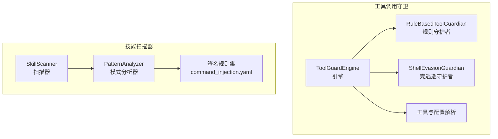
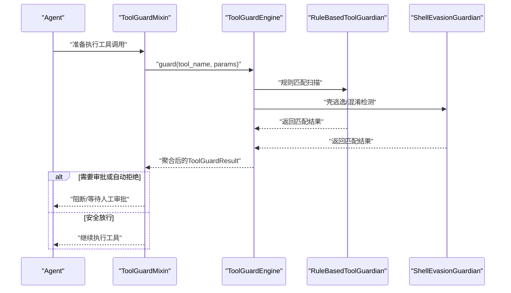
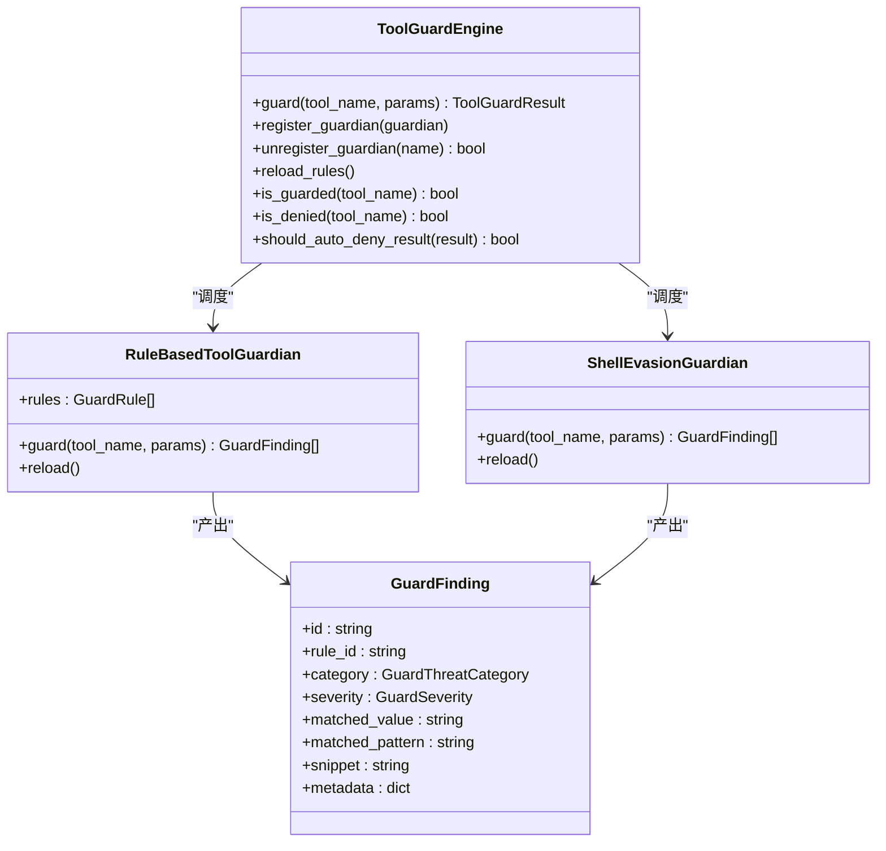
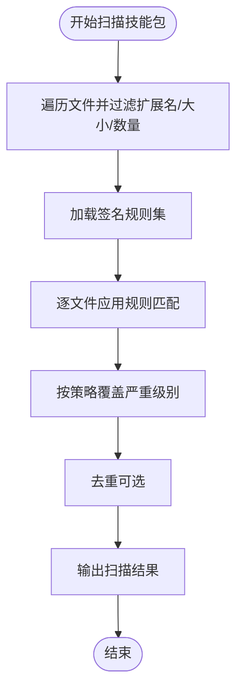
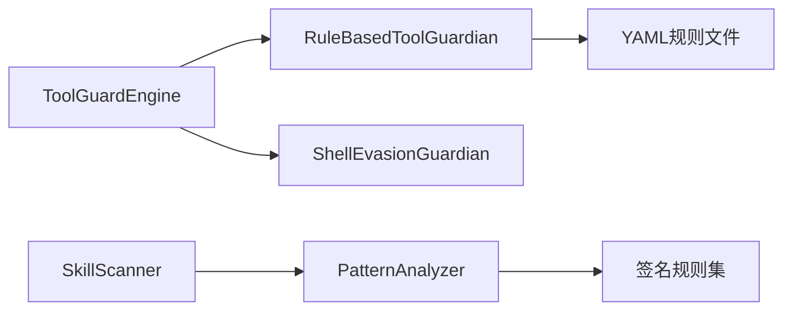

# 命令注入检测

<cite>
**本文引用的文件**
- [src/qwenpaw/security/tool_guard/engine.py](file://src/qwenpaw/security/tool_guard/engine.py)
- [src/qwenpaw/security/tool_guard/models.py](file://src/qwenpaw/security/tool_guard/models.py)
- [src/qwenpaw/security/tool_guard/guardians/rule_guardian.py](file://src/qwenpaw/security/tool_guard/guardians/rule_guardian.py)
- [src/qwenpaw/security/tool_guard/guardians/shell_evasion_guardian.py](file://src/qwenpaw/security/tool_guard/guardians/shell_evasion_guardian.py)
- [src/qwenpaw/security/tool_guard/utils.py](file://src/qwenpaw/security/tool_guard/utils.py)
- [src/qwenpaw/security/tool_guard/rules/dangerous_shell_commands.yaml](file://src/qwenpaw/security/tool_guard/rules/dangerous_shell_commands.yaml)
- [src/qwenpaw/security/skill_scanner/scanner.py](file://src/qwenpaw/security/skill_scanner/scanner.py)
- [src/qwenpaw/security/skill_scanner/analyzers/pattern_analyzer.py](file://src/qwenpaw/security/skill_scanner/analyzers/pattern_analyzer.py)
- [src/qwenpaw/security/skill_scanner/rules/signatures/command_injection.yaml](file://src/qwenpaw/security/skill_scanner/rules/signatures/command_injection.yaml)
- [console/src/api/modules/security.ts](file://console/src/api/modules/security.ts)
- [console/src/pages/Settings/Security/useToolGuard.ts](file://console/src/pages/Settings/Security/useToolGuard.ts)
- [src/qwenpaw/app/routers/config.py](file://src/qwenpaw/app/routers/config.py)
- [src/qwenpaw/agents/tool_guard_mixin.py](file://src/qwenpaw/agents/tool_guard_mixin.py)
- [website/public/docs/security.en.md](file://website/public/docs/security.en.md)
</cite>

## 目录
1. [简介](#简介)
2. [项目结构](#项目结构)
3. [核心组件](#核心组件)
4. [架构总览](#架构总览)
5. [详细组件分析](#详细组件分析)
6. [依赖分析](#依赖分析)
7. [性能考虑](#性能考虑)
8. [故障排查指南](#故障排查指南)
9. [结论](#结论)
10. [附录](#附录)

## 简介
本技术文档面向QwenPaw命令注入检测体系，系统阐述命令注入威胁的检测原理与实现，覆盖以下关键能力：
- eval/exec函数检测与动态代码执行风险识别
- shell命令执行风险识别（含管道、反连、权限提升、服务控制等）
- 字符串格式化中的用户输入注入（Python subprocess/os.system）
- 路径遍历漏洞检测（文件读写与路径校验）
- SQL注入防护（f-string拼接与字符串连接）
- 嵌入式脚本检测（SVG事件处理器与PDF JavaScript动作）

文档同时给出各类检测规则的正则表达式要点、误报过滤策略、修复建议及不同严重级别的威胁评估与缓解措施。

## 项目结构
QwenPaw的安全子系统由“工具调用守卫”和“技能扫描器”两大分支构成：
- 工具调用守卫：在Agent执行具体工具前对参数进行实时安全检查，重点覆盖shell命令注入、危险文件操作、权限提升与网络滥用等。
- 技能扫描器：对技能包内的源码与资源进行静态扫描，识别硬编码凭证、命令注入、路径遍历、SQL注入、SVG/PDF嵌入式脚本等风险。

图表来源
- [src/qwenpaw/security/tool_guard/engine.py:54-134](file://src/qwenpaw/security/tool_guard/engine.py#L54-L134)
- [src/qwenpaw/security/tool_guard/guardians/rule_guardian.py:559-598](file://src/qwenpaw/security/tool_guard/guardians/rule_guardian.py#L559-L598)
- [src/qwenpaw/security/tool_guard/guardians/shell_evasion_guardian.py:539-593](file://src/qwenpaw/security/tool_guard/guardians/shell_evasion_guardian.py#L539-L593)
- [src/qwenpaw/security/skill_scanner/scanner.py:76-142](file://src/qwenpaw/security/skill_scanner/scanner.py#L76-L142)
- [src/qwenpaw/security/skill_scanner/analyzers/pattern_analyzer.py:236-260](file://src/qwenpaw/security/skill_scanner/analyzers/pattern_analyzer.py#L236-L260)

章节来源
- [src/qwenpaw/security/tool_guard/engine.py:1-269](file://src/qwenpaw/security/tool_guard/engine.py#L1-L269)
- [src/qwenpaw/security/skill_scanner/scanner.py:1-319](file://src/qwenpaw/security/skill_scanner/scanner.py#L1-L319)

## 核心组件
- ToolGuardEngine：工具调用守卫的编排器，负责加载默认守护者（文件路径、规则、壳逃逸），聚合结果并支持按配置重载规则与开关。
- RuleBasedToolGuardian：基于YAML规则的正则匹配守护者，扫描工具参数字符串，支持排除模式、工作区边界检查（如rm目标越界）。
- ShellEvasionGuardian：专门检测shell逃逸与混淆技巧，如命令替换、ANSI-C/本地化引号、反斜杠转义、换行拆分、注释/引号不同步、带引号的换行+注释行剥离等。
- SkillScanner + PatternAnalyzer：对技能包进行静态扫描，使用签名规则集识别命令注入、路径遍历、SQL注入、SVG/PDF嵌入式脚本等。
- 规则与模型：GuardFinding/GuardSeverity/威胁分类；扫描器的Finding/Severity/威胁分类；统一的严重级别与分类体系便于跨子系统协同。

章节来源
- [src/qwenpaw/security/tool_guard/engine.py:54-257](file://src/qwenpaw/security/tool_guard/engine.py#L54-L257)
- [src/qwenpaw/security/tool_guard/guardians/rule_guardian.py:559-757](file://src/qwenpaw/security/tool_guard/guardians/rule_guardian.py#L559-L757)
- [src/qwenpaw/security/tool_guard/guardians/shell_evasion_guardian.py:539-593](file://src/qwenpaw/security/tool_guard/guardians/shell_evasion_guardian.py#L539-L593)
- [src/qwenpaw/security/skill_scanner/analyzers/pattern_analyzer.py:236-347](file://src/qwenpaw/security/skill_scanner/analyzers/pattern_analyzer.py#L236-L347)
- [src/qwenpaw/security/tool_guard/models.py:25-185](file://src/qwenpaw/security/tool_guard/models.py#L25-L185)

## 架构总览
下图展示工具调用守卫在Agent执行流程中的位置与交互：

图表来源
- [src/qwenpaw/agents/tool_guard_mixin.py:185-254](file://src/qwenpaw/agents/tool_guard_mixin.py#L185-L254)
- [src/qwenpaw/security/tool_guard/engine.py:200-257](file://src/qwenpaw/security/tool_guard/engine.py#L200-L257)
- [src/qwenpaw/security/tool_guard/guardians/rule_guardian.py:608-757](file://src/qwenpaw/security/tool_guard/guardians/rule_guardian.py#L608-L757)
- [src/qwenpaw/security/tool_guard/guardians/shell_evasion_guardian.py:555-593](file://src/qwenpaw/security/tool_guard/guardians/shell_evasion_guardian.py#L555-L593)

## 详细组件分析

### 工具调用守卫引擎与守护者
- 引擎职责：加载默认守护者集合（文件路径、规则、壳逃逸）、按配置启用/禁用、重载规则、计算最大严重级别、记录失败守护者。
- 规则守护者：将工具参数值转换为字符串后逐条匹配规则，支持排除模式；对rm命令额外做工作区边界检查，若发现越界路径，生成带结构化提示的修复建议。
- 壳逃逸守护者：对命令进行逐字符状态机跟踪，检测命令替换、ANSI-C/本地化引号、反斜杠转义空白/操作符、换行拆分、注释/引号不同步、带引号换行+注释行剥离等高危模式。

图表来源
- [src/qwenpaw/security/tool_guard/engine.py:54-257](file://src/qwenpaw/security/tool_guard/engine.py#L54-L257)
- [src/qwenpaw/security/tool_guard/guardians/rule_guardian.py:559-757](file://src/qwenpaw/security/tool_guard/guardians/rule_guardian.py#L559-L757)
- [src/qwenpaw/security/tool_guard/guardians/shell_evasion_guardian.py:539-593](file://src/qwenpaw/security/tool_guard/guardians/shell_evasion_guardian.py#L539-L593)
- [src/qwenpaw/security/tool_guard/models.py:60-96](file://src/qwenpaw/security/tool_guard/models.py#L60-L96)

章节来源
- [src/qwenpaw/security/tool_guard/engine.py:54-257](file://src/qwenpaw/security/tool_guard/engine.py#L54-L257)
- [src/qwenpaw/security/tool_guard/guardians/rule_guardian.py:559-757](file://src/qwenpaw/security/tool_guard/guardians/rule_guardian.py#L559-L757)
- [src/qwenpaw/security/tool_guard/guardians/shell_evasion_guardian.py:539-593](file://src/qwenpaw/security/tool_guard/guardians/shell_evasion_guardian.py#L539-L593)
- [src/qwenpaw/security/tool_guard/models.py:25-185](file://src/qwenpaw/security/tool_guard/models.py#L25-L185)

### 技能扫描器与签名规则
- 扫描器：遍历技能目录，按策略跳过归档/惰性文件类型，限制文件数量与大小，运行各分析器收集结果。
- 模式分析器：从签名规则集中加载规则，按文件类型筛选，逐行匹配并处理跨行模式，输出Finding并支持去重与严重级别覆盖。
- 签名规则集：覆盖命令注入、路径遍历、SQL注入、SVG/PDF嵌入式脚本等威胁类别，提供描述与修复建议。

图表来源
- [src/qwenpaw/security/skill_scanner/scanner.py:148-242](file://src/qwenpaw/security/skill_scanner/scanner.py#L148-L242)
- [src/qwenpaw/security/skill_scanner/analyzers/pattern_analyzer.py:265-347](file://src/qwenpaw/security/skill_scanner/analyzers/pattern_analyzer.py#L265-L347)
- [src/qwenpaw/security/skill_scanner/rules/signatures/command_injection.yaml:1-195](file://src/qwenpaw/security/skill_scanner/rules/signatures/command_injection.yaml#L1-L195)

章节来源
- [src/qwenpaw/security/skill_scanner/scanner.py:148-242](file://src/qwenpaw/security/skill_scanner/scanner.py#L148-L242)
- [src/qwenpaw/security/skill_scanner/analyzers/pattern_analyzer.py:236-347](file://src/qwenpaw/security/skill_scanner/analyzers/pattern_analyzer.py#L236-L347)
- [src/qwenpaw/security/skill_scanner/rules/signatures/command_injection.yaml:1-195](file://src/qwenpaw/security/skill_scanner/rules/signatures/command_injection.yaml#L1-L195)

### 正则表达式规则与检测要点
以下为关键威胁的规则要点与检测侧重点（不直接展示正则内容，详见文件路径）：
- 动态代码执行（eval/exec/compile/__import__/Function构造）
  - 关注点：eval/exec/compile/__import__调用，以及JavaScript中的Function/定时器字符串参数。
  - 文件路径：[command_injection.yaml:4-21](file://src/qwenpaw/security/skill_scanner/rules/signatures/command_injection.yaml#L4-L21)，[dangerous_shell_commands.yaml:116-125](file://src/qwenpaw/security/tool_guard/rules/dangerous_shell_commands.yaml#L116-L125)
- 字符串格式化注入（Python subprocess/os.system）
  - 关注点：f-string/格式化字符串中包含用户输入变量的shell命令拼接。
  - 文件路径：[command_injection.yaml:22-32](file://src/qwenpaw/security/skill_scanner/rules/signatures/command_injection.yaml#L22-L32)
- shell命令执行风险（管道下载执行、反连、权限提升、服务控制）
  - 关注点：curl|bash、base64|bash、/dev/tcp、ncat/socat、sudo/su/doas、systemctl/service/launchctl等。
  - 文件路径：[dangerous_shell_commands.yaml:64-188](file://src/qwenpaw/security/tool_guard/rules/dangerous_shell_commands.yaml#L64-L188)
- 壳逃逸与混淆（命令替换、ANSI-C/locale引号、反斜杠转义、换行拆分、注释/引号不同步）
  - 关注点：$()、``、${}、=()、ANSI-C $'...'、空引号+短横线、反斜杠操作符、回车/换行、注释内引号、带引号换行+注释行剥离。
  - 文件路径：[shell_evasion_guardian.py:115-355](file://src/qwenpaw/security/tool_guard/guardians/shell_evasion_guardian.py#L115-L355)
- 路径遍历（os.path.join/open/f-string路径）
  - 关注点：用户输入参与路径拼接并直接open()，或返回open(path)。
  - 文件路径：[command_injection.yaml:62-86](file://src/qwenpaw/security/skill_scanner/rules/signatures/command_injection.yaml#L62-L86)
- SQL注入（f-string变量、LIKE/WHERE、字符串拼接）
  - 关注点：f-string中变量出现在WHERE/LIKE等位置，或使用+进行字符串拼接。
  - 文件路径：[command_injection.yaml:87-109](file://src/qwenpaw/security/skill_scanner/rules/signatures/command_injection.yaml#L87-L109)
- 嵌入式脚本（SVG事件处理器、javascript:；PDF JavaScript动作/AcroJS）
  - 关注点：<script>标签、on事件、javascript:URI；/JS、/JavaScript、/OpenAction、/AA、/Launch。
  - 文件路径：[command_injection.yaml:111-134](file://src/qwenpaw/security/skill_scanner/rules/signatures/command_injection.yaml#L111-L134)

章节来源
- [src/qwenpaw/security/skill_scanner/rules/signatures/command_injection.yaml:1-195](file://src/qwenpaw/security/skill_scanner/rules/signatures/command_injection.yaml#L1-L195)
- [src/qwenpaw/security/tool_guard/rules/dangerous_shell_commands.yaml:1-310](file://src/qwenpaw/security/tool_guard/rules/dangerous_shell_commands.yaml#L1-L310)
- [src/qwenpaw/security/tool_guard/guardians/shell_evasion_guardian.py:115-355](file://src/qwenpaw/security/tool_guard/guardians/shell_evasion_guardian.py#L115-L355)

### 检测案例与误报过滤
- 案例一：危险rm命令（越界路径）
  - 触发条件：execute_shell_command的command参数包含rm/mv/del/Remove-Item且目标路径越出工作区。
  - 结果：生成高危Finding，附加结构化提示，建议用户确认路径与内容，必要时拒绝操作。
  - 文件路径：[rule_guardian.py:645-735](file://src/qwenpaw/security/tool_guard/guardians/rule_guardian.py#L645-L735)
- 案例二：管道下载并执行
  - 触发条件：curl/wget后接管道至bash/sh/zsh等解释器。
  - 结果：生成CRITICAL Finding，建议先下载到文件并人工审阅后再执行。
  - 文件路径：[dangerous_shell_commands.yaml:64-74](file://src/qwenpaw/security/tool_guard/rules/dangerous_shell_commands.yaml#L64-L74)
- 案例三：SVG嵌入脚本
  - 触发条件：SVG文件包含<script>标签、on事件属性或javascript:URI。
  - 结果：生成CRITICAL Finding，建议移除所有脚本与事件处理器。
  - 文件路径：[command_injection.yaml:111-121](file://src/qwenpaw/security/skill_scanner/rules/signatures/command_injection.yaml#L111-L121)
- 误报过滤策略
  - 排除模式：规则支持exclude_patterns，用于屏蔽测试样例、注释示例等。
  - 严格范围：规则限定file_types或仅针对特定工具/参数生效。
  - 交互审批：高危/严重Finding需人工审批，低危可自动放行。

章节来源
- [src/qwenpaw/security/tool_guard/guardians/rule_guardian.py:645-735](file://src/qwenpaw/security/tool_guard/guardians/rule_guardian.py#L645-L735)
- [src/qwenpaw/security/tool_guard/rules/dangerous_shell_commands.yaml:64-74](file://src/qwenpaw/security/tool_guard/rules/dangerous_shell_commands.yaml#L64-L74)
- [src/qwenpaw/security/skill_scanner/rules/signatures/command_injection.yaml:111-121](file://src/qwenpaw/security/skill_scanner/rules/signatures/command_injection.yaml#L111-L121)

### 修复建议与缓解措施
- 动态代码执行
  - 替代方案：避免eval/exec/compile，改用ast.literal_eval或operator模块；JavaScript中避免Function构造与字符串参数的定时器。
  - 文件路径：[command_injection.yaml:4-21](file://src/qwenpaw/security/skill_scanner/rules/signatures/command_injection.yaml#L4-L21)
- 字符串格式化注入
  - 替代方案：使用subprocess传参列表而非shell字符串；避免f-string拼接用户输入。
  - 文件路径：[command_injection.yaml:22-32](file://src/qwenpaw/security/skill_scanner/rules/signatures/command_injection.yaml#L22-L32)
- shell命令执行风险
  - 替代方案：禁止shell=True；避免管道下载执行；限制sudo/su/doas使用；避免对系统服务与设备进行管理操作。
  - 文件路径：[dangerous_shell_commands.yaml:127-188](file://src/qwenpaw/security/tool_guard/rules/dangerous_shell_commands.yaml#L127-L188)
- 壳逃逸与混淆
  - 替代方案：避免使用$()、反引号、ANSI-C引号、空引号+短横线、反斜杠操作符、回车/换行拆分等混淆手法。
  - 文件路径：[shell_evasion_guardian.py:115-355](file://src/qwenpaw/security/tool_guard/guardians/shell_evasion_guardian.py#L115-L355)
- 路径遍历
  - 替代方案：验证与清理路径，使用绝对路径与realpath，限定允许目录。
  - 文件路径：[command_injection.yaml:62-86](file://src/qwenpaw/security/skill_scanner/rules/signatures/command_injection.yaml#L62-L86)
- SQL注入
  - 替代方案：使用参数化查询（?/%s占位符）；避免f-string变量直接拼接。
  - 文件路径：[command_injection.yaml:87-109](file://src/qwenpaw/security/skill_scanner/rules/signatures/command_injection.yaml#L87-L109)
- 嵌入式脚本
  - 替代方案：移除SVG中的<script>与事件处理器，移除PDF中的JavaScript动作与触发器。
  - 文件路径：[command_injection.yaml:111-134](file://src/qwenpaw/security/skill_scanner/rules/signatures/command_injection.yaml#L111-L134)

章节来源
- [src/qwenpaw/security/skill_scanner/rules/signatures/command_injection.yaml:4-134](file://src/qwenpaw/security/skill_scanner/rules/signatures/command_injection.yaml#L4-L134)
- [src/qwenpaw/security/tool_guard/rules/dangerous_shell_commands.yaml:64-188](file://src/qwenpaw/security/tool_guard/rules/dangerous_shell_commands.yaml#L64-L188)
- [src/qwenpaw/security/tool_guard/guardians/shell_evasion_guardian.py:115-355](file://src/qwenpaw/security/tool_guard/guardians/shell_evasion_guardian.py#L115-L355)

## 依赖分析
- 组件耦合
  - ToolGuardEngine聚合多个守护者，守护者之间低耦合、职责清晰。
  - 规则守护者依赖YAML规则文件与配置，支持热重载。
  - 壳逃逸守护者通过状态机实现复杂逻辑，但保持独立。
  - 技能扫描器依赖签名规则集，按文件类型与策略筛选规则。
- 外部依赖
  - YAML解析、正则表达式、文件系统遍历、配置加载。
- 可能的循环依赖
  - 当前实现未见循环导入；规则加载与守护者初始化均在模块级完成。

图表来源
- [src/qwenpaw/security/tool_guard/engine.py:84-111](file://src/qwenpaw/security/tool_guard/engine.py#L84-L111)
- [src/qwenpaw/security/tool_guard/guardians/rule_guardian.py:467-511](file://src/qwenpaw/security/tool_guard/guardians/rule_guardian.py#L467-L511)
- [src/qwenpaw/security/skill_scanner/analyzers/pattern_analyzer.py:163-229](file://src/qwenpaw/security/skill_scanner/analyzers/pattern_analyzer.py#L163-L229)

章节来源
- [src/qwenpaw/security/tool_guard/engine.py:84-111](file://src/qwenpaw/security/tool_guard/engine.py#L84-L111)
- [src/qwenpaw/security/tool_guard/guardians/rule_guardian.py:467-511](file://src/qwenpaw/security/tool_guard/guardians/rule_guardian.py#L467-L511)
- [src/qwenpaw/security/skill_scanner/analyzers/pattern_analyzer.py:163-229](file://src/qwenpaw/security/skill_scanner/analyzers/pattern_analyzer.py#L163-L229)

## 性能考虑
- 规则预编译：规则守护者与扫描器均对正则表达式进行预编译，减少重复开销。
- 快速路径：扫描器先按行匹配，再对包含换行的模式进行全文匹配，避免不必要的全量扫描。
- 文件限制：扫描器支持最大文件数与单文件大小限制，防止大文件导致性能问题。
- 状态机优化：壳逃逸守护者使用字符级状态机跟踪引号与转义，兼顾准确性与效率。

章节来源
- [src/qwenpaw/security/tool_guard/guardians/rule_guardian.py:375-395](file://src/qwenpaw/security/tool_guard/guardians/rule_guardian.py#L375-L395)
- [src/qwenpaw/security/skill_scanner/analyzers/pattern_analyzer.py:67-84](file://src/qwenpaw/security/skill_scanner/analyzers/pattern_analyzer.py#L67-L84)
- [src/qwenpaw/security/skill_scanner/scanner.py:70-74](file://src/qwenpaw/security/skill_scanner/scanner.py#L70-L74)

## 故障排查指南
- 配置项与开关
  - Tool Guard总开关、受保护工具集、禁止工具集、自定义规则、自动拒绝规则、壳逃逸检查项均可通过配置接口获取与更新。
  - 文件路径：[config.py:664-703](file://src/qwenpaw/app/routers/config.py#L664-L703)，[security.ts:15-23](file://console/src/api/modules/security.ts#L15-L23)，[useToolGuard.ts:27-69](file://console/src/pages/Settings/Security/useToolGuard.ts#L27-L69)
- 日志与告警
  - 高危/严重Finding会以warning级别输出，普通Finding以info级别输出；引擎输出汇总日志，包含最大严重级别与耗时。
  - 文件路径：[utils.py:159-194](file://src/qwenpaw/security/tool_guard/utils.py#L159-L194)
- 常见问题
  - 规则未生效：确认已调用reload_rules并检查disabled_rules/auto_denied_rules。
  - 误报过多：通过exclude_patterns或调整规则严重级别与file_types缩小范围。
  - 壳逃逸检测未开启：检查shell_evasion_checks中对应检查项是否启用。

章节来源
- [src/qwenpaw/app/routers/config.py:664-703](file://src/qwenpaw/app/routers/config.py#L664-L703)
- [console/src/api/modules/security.ts:15-23](file://console/src/api/modules/security.ts#L15-L23)
- [console/src/pages/Settings/Security/useToolGuard.ts:27-69](file://console/src/pages/Settings/Security/useToolGuard.ts#L27-L69)
- [src/qwenpaw/security/tool_guard/utils.py:159-194](file://src/qwenpaw/security/tool_guard/utils.py#L159-L194)
- [website/public/docs/security.en.md:79-115](file://website/public/docs/security.en.md#L79-L115)

## 结论
QwenPaw的命令注入检测体系通过“工具调用守卫+技能扫描器”的双轨机制，实现了对动态代码执行、shell注入、路径遍历、SQL注入与嵌入式脚本的全面覆盖。规则驱动与状态机检测相结合，在保证准确性的前提下兼顾性能与可维护性。建议在生产环境中结合严格的审批策略与最小权限原则，持续优化规则集与误报过滤策略，确保安全与可用性的平衡。

## 附录
- 威胁评估与严重级别
  - CRITICAL：直接导致系统破坏、数据泄露或权限提升的风险。
  - HIGH：高风险操作或潜在破坏性行为。
  - MEDIUM/LOW/INFO：较低风险或信息提示。
  - 文件路径：[models.py:25-53](file://src/qwenpaw/security/tool_guard/models.py#L25-L53)
- 在线配置与可视化
  - 控制台提供Tool Guard配置界面，支持启用/禁用规则、设置自动拒绝规则、切换壳逃逸检查项等。
  - 文件路径：[security.ts:15-23](file://console/src/api/modules/security.ts#L15-L23)，[useToolGuard.ts:27-69](file://console/src/pages/Settings/Security/useToolGuard.ts#L27-L69)，[security.en.md:79-115](file://website/public/docs/security.en.md#L79-L115)

章节来源
- [src/qwenpaw/security/tool_guard/models.py:25-53](file://src/qwenpaw/security/tool_guard/models.py#L25-L53)
- [console/src/api/modules/security.ts:15-23](file://console/src/api/modules/security.ts#L15-L23)
- [console/src/pages/Settings/Security/useToolGuard.ts:27-69](file://console/src/pages/Settings/Security/useToolGuard.ts#L27-L69)
- [website/public/docs/security.en.md:79-115](file://website/public/docs/security.en.md#L79-L115)