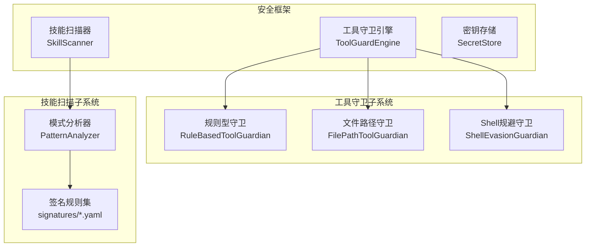
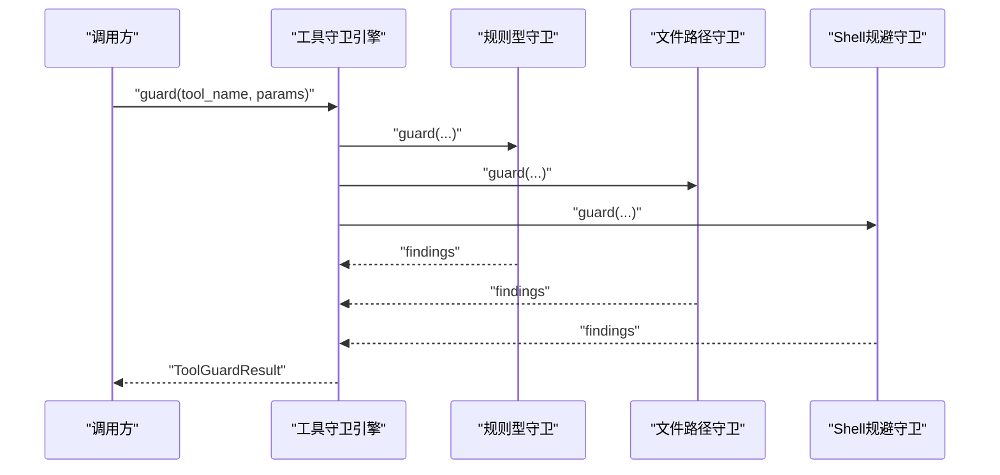
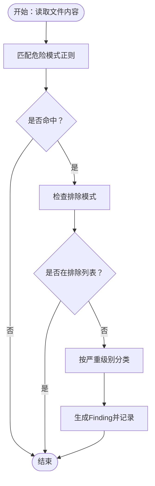
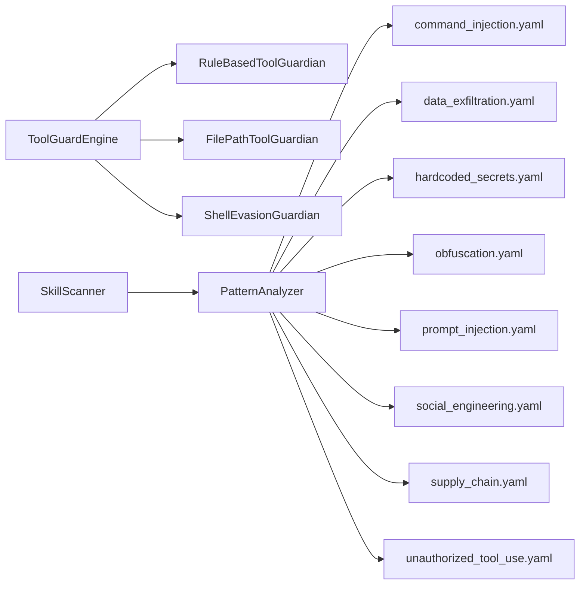

# 威胁检测规则

<cite>
**本文引用的文件**
- [security/__init__.py](file://src/qwenpaw/security/__init__.py)
- [engine.py](file://src/qwenpaw/security/tool_guard/engine.py)
- [models.py（工具守卫）](file://src/qwenpaw/security/tool_guard/models.py)
- [rule_guardian.py](file://src/qwenpaw/security/tool_guard/guardians/rule_guardian.py)
- [scanner.py](file://src/qwenpaw/security/skill_scanner/scanner.py)
- [models.py（技能扫描）](file://src/qwenpaw/security/skill_scanner/models.py)
- [command_injection.yaml](file://src/qwenpaw/security/skill_scanner/rules/signatures/command_injection.yaml)
- [data_exfiltration.yaml](file://src/qwenpaw/security/skill_scanner/rules/signatures/data_exfiltration.yaml)
- [hardcoded_secrets.yaml](file://src/qwenpaw/security/skill_scanner/rules/signatures/hardcoded_secrets.yaml)
- [obfuscation.yaml](file://src/qwenpaw/security/skill_scanner/rules/signatures/obfuscation.yaml)
- [prompt_injection.yaml](file://src/qwenpaw/security/skill_scanner/rules/signatures/prompt_injection.yaml)
- [social_engineering.yaml](file://src/qwenpaw/security/skill_scanner/rules/signatures/social_engineering.yaml)
- [supply_chain.yaml](file://src/qwenpaw/security/skill_scanner/rules/signatures/supply_chain.yaml)
- [unauthorized_tool_use.yaml](file://src/qwenpaw/security/skill_scanner/rules/signatures/unauthorized_tool_use.yaml)
- [security.en.md](file://website/public/docs/security.en.md)
</cite>

## 目录
1. [简介](#简介)
2. [项目结构](#项目结构)
3. [核心组件](#核心组件)
4. [架构总览](#架构总览)
5. [详细组件分析](#详细组件分析)
6. [依赖分析](#依赖分析)
7. [性能考虑](#性能考虑)
8. [故障排查指南](#故障排查指南)
9. [结论](#结论)
10. [附录](#附录)

## 简介
本文件面向QwenPaw威胁检测规则系统，系统性梳理并解释八类主要威胁的检测原理与规则配置，涵盖命令注入检测、数据泄露防护、硬编码密钥识别、混淆技术检测、提示词注入防范、社交工程识别、供应链攻击检测与未授权工具使用监控。文档从代码实现与规则文件出发，结合数据模型、引擎流程与规则格式，给出特征模式、正则表达式规则、上下文分析方法、优先级与误报过滤机制，并提供自定义规则开发指南与优化建议。

## 项目结构
QwenPaw的安全能力由三大子系统构成：
- 工具调用前守卫（Tool Guard）：在工具执行前扫描参数，阻断高危模式（命令注入、数据外泄、路径穿越、网络滥用等）
- 技能静态扫描（Skill Scanner）：安装/激活前对技能包进行静态分析，发现提示词注入、硬编码密钥、混淆、供应链攻击等
- 密钥存储（Secret Store）：透明加密存储敏感字段

图表来源
- [security/__init__.py:1-21](file://src/qwenpaw/security/__init__.py#L1-L21)
- [engine.py:54-110](file://src/qwenpaw/security/tool_guard/engine.py#L54-L110)
- [scanner.py:76-115](file://src/qwenpaw/security/skill_scanner/scanner.py#L76-L115)

章节来源
- [security/__init__.py:1-21](file://src/qwenpaw/security/__init__.py#L1-L21)

## 核心组件
- 工具守卫引擎（ToolGuardEngine）
  - 负责注册与调度各类守卫（规则型、文件路径、Shell规避），聚合结果并支持自动拒绝与工具范围控制
  - 提供启用开关、守护工具集合、禁止工具集合、自动拒绝规则集的动态解析与重载
- 规则型工具守卫（RuleBasedToolGuardian）
  - 基于JSON规则的正则匹配，支持工具名/参数名限定、威胁分类、严重级别、排除模式等
- 技能扫描器（SkillScanner）
  - 遍历技能目录，按策略加载分析器（默认模式分析器），收集Findings并去重
- 模式分析器（PatternAnalyzer）
  - 加载各威胁类别下的签名规则（signatures/*.yaml），对文件内容进行正则匹配
- 数据模型
  - 工具守卫：GuardSeverity、GuardThreatCategory、GuardFinding、ToolGuardResult
  - 技能扫描：Severity、ThreatCategory、Finding、ScanResult

章节来源
- [engine.py:54-110](file://src/qwenpaw/security/tool_guard/engine.py#L54-L110)
- [engine.py:200-257](file://src/qwenpaw/security/tool_guard/engine.py#L200-L257)
- [models.py（工具守卫）:25-53](file://src/qwenpaw/security/tool_guard/models.py#L25-L53)
- [models.py（工具守卫）:60-96](file://src/qwenpaw/security/tool_guard/models.py#L60-L96)
- [scanner.py:76-115](file://src/qwenpaw/security/skill_scanner/scanner.py#L76-L115)
- [models.py（技能扫描）:19-54](file://src/qwenpaw/security/skill_scanner/models.py#L19-L54)
- [models.py（技能扫描）:129-161](file://src/qwenpaw/security/skill_scanner/models.py#L129-L161)

## 架构总览
工具守卫与技能扫描分别在“调用前”和“安装前”两个关键阶段拦截潜在威胁，形成互补闭环。

图表来源
- [engine.py:200-257](file://src/qwenpaw/security/tool_guard/engine.py#L200-L257)

章节来源
- [engine.py:54-110](file://src/qwenpaw/security/tool_guard/engine.py#L54-L110)

## 详细组件分析

### 命令注入检测
- 检测目标
  - 危险函数调用（如动态求值、编译、子进程直接执行）、字符串格式化拼接shell命令、路径穿越、SQL拼接、SVG/PDF嵌入脚本、find -exec危险组合、Node.js动态代码执行等
- 特征与规则
  - Python：eval/exec/compile、os.system/subprocess、f-string拼接shell、open拼接用户输入路径、SQL f-string变量、find -exec非白名单命令
  - Bash：eval带用户输入、glob/hidden file定位
  - JavaScript/TypeScript：child_process直接执行、Function构造器、setTimeout/setInterval字符串参数
- 上下文分析
  - 文件类型限定（python/bash/javascript/typescript/other），结合exclude_patterns降低误报
  - 对高危模式采用CRITICAL/MEDIUM/HIGH分级
- 实际规则示例（路径）
  - [command_injection.yaml:4-21](file://src/qwenpaw/security/skill_scanner/rules/signatures/command_injection.yaml#L4-L21)
  - [command_injection.yaml:22-42](file://src/qwenpaw/security/skill_scanner/rules/signatures/command_injection.yaml#L22-L42)
  - [command_injection.yaml:45-61](file://src/qwenpaw/security/skill_scanner/rules/signatures/command_injection.yaml#L45-L61)
  - [command_injection.yaml:62-86](file://src/qwenpaw/security/skill_scanner/rules/signatures/command_injection.yaml#L62-L86)
  - [command_injection.yaml:87-110](file://src/qwenpaw/security/skill_scanner/rules/signatures/command_injection.yaml#L87-L110)
  - [command_injection.yaml:111-134](file://src/qwenpaw/security/skill_scanner/rules/signatures/command_injection.yaml#L111-L134)
  - [command_injection.yaml:135-163](file://src/qwenpaw/security/skill_scanner/rules/signatures/command_injection.yaml#L135-L163)
  - [command_injection.yaml:164-195](file://src/qwenpaw/security/skill_scanner/rules/signatures/command_injection.yaml#L164-L195)

图表来源
- [scanner.py:194-213](file://src/qwenpaw/security/skill_scanner/scanner.py#L194-L213)
- [models.py（技能扫描）:129-161](file://src/qwenpaw/security/skill_scanner/models.py#L129-L161)

章节来源
- [command_injection.yaml:4-195](file://src/qwenpaw/security/skill_scanner/rules/signatures/command_injection.yaml#L4-L195)

### 数据泄露防护
- 检测目标
  - 外发网络请求、敏感文件读取、Base64编码+网络组合、Socket直连外部、JS/Node文件系统访问
- 特征与规则
  - Python：requests/httpx/urllib/socket、敏感路径open、.env/.aws/.ssh/*、base64+网络
  - JavaScript/TypeScript：fetch/axios/XMLHttpRequest、fs.readFile/writeFile
- 上下文分析
  - 通过file_types限定语言范围；exclude_patterns过滤测试/示例/注释/健康检查
- 实际规则示例（路径）
  - [data_exfiltration.yaml:4-17](file://src/qwenpaw/security/skill_scanner/rules/signatures/data_exfiltration.yaml#L4-L17)
  - [data_exfiltration.yaml:22-35](file://src/qwenpaw/security/skill_scanner/rules/signatures/data_exfiltration.yaml#L22-L35)
  - [data_exfiltration.yaml:36-53](file://src/qwenpaw/security/skill_scanner/rules/signatures/data_exfiltration.yaml#L36-L53)
  - [data_exfiltration.yaml:54-83](file://src/qwenpaw/security/skill_scanner/rules/signatures/data_exfiltration.yaml#L54-L83)
  - [data_exfiltration.yaml:92-102](file://src/qwenpaw/security/skill_scanner/rules/signatures/data_exfiltration.yaml#L92-L102)
  - [data_exfiltration.yaml:103-125](file://src/qwenpaw/security/skill_scanner/rules/signatures/data_exfiltration.yaml#L103-L125)
  - [data_exfiltration.yaml:126-142](file://src/qwenpaw/security/skill_scanner/rules/signatures/data_exfiltration.yaml#L126-L142)

章节来源
- [data_exfiltration.yaml:4-142](file://src/qwenpaw/security/skill_scanner/rules/signatures/data_exfiltration.yaml#L4-L142)

### 硬编码密钥识别
- 检测目标
  - AWS密钥、Stripe密钥、Google API密钥、GitHub令牌、JWT、私钥块、密码/密钥变量、连接串
- 特征与规则
  - 使用强正则识别典型格式；对示例/占位符/环境变量注入进行排除
- 上下文分析
  - file_types覆盖多语言；exclude_patterns广泛覆盖示例与占位符
- 实际规则示例（路径）
  - [hardcoded_secrets.yaml:4-23](file://src/qwenpaw/security/skill_scanner/rules/signatures/hardcoded_secrets.yaml#L4-L23)
  - [hardcoded_secrets.yaml:24-32](file://src/qwenpaw/security/skill_scanner/rules/signatures/hardcoded_secrets.yaml#L24-L32)
  - [hardcoded_secrets.yaml:33-41](file://src/qwenpaw/security/skill_scanner/rules/signatures/hardcoded_secrets.yaml#L33-L41)
  - [hardcoded_secrets.yaml:42-50](file://src/qwenpaw/security/skill_scanner/rules/signatures/hardcoded_secrets.yaml#L42-L50)
  - [hardcoded_secrets.yaml:51-59](file://src/qwenpaw/security/skill_scanner/rules/signatures/hardcoded_secrets.yaml#L51-L59)
  - [hardcoded_secrets.yaml:60-83](file://src/qwenpaw/security/skill_scanner/rules/signatures/hardcoded_secrets.yaml#L60-L83)
  - [hardcoded_secrets.yaml:84-94](file://src/qwenpaw/security/skill_scanner/rules/signatures/hardcoded_secrets.yaml#L84-L94)
  - [hardcoded_secrets.yaml:95-150](file://src/qwenpaw/security/skill_scanner/rules/signatures/hardcoded_secrets.yaml#L95-L150)

章节来源
- [hardcoded_secrets.yaml:4-150](file://src/qwenpaw/security/skill_scanner/rules/signatures/hardcoded_secrets.yaml#L4-L150)

### 混淆技术检测
- 检测目标
  - Base64解码+执行链、大段十六进制、XOR编码、二进制可执行文件
- 特征与规则
  - 关注decode/exec链路而非泛化长串；对常见库表进行排除
- 上下文分析
  - binary文件特殊处理，标记为最高风险
- 实际规则示例（路径）
  - [obfuscation.yaml:4-14](file://src/qwenpaw/security/skill_scanner/rules/signatures/obfuscation.yaml#L4-L14)
  - [obfuscation.yaml:15-28](file://src/qwenpaw/security/skill_scanner/rules/signatures/obfuscation.yaml#L15-L28)
  - [obfuscation.yaml:29-38](file://src/qwenpaw/security/skill_scanner/rules/signatures/obfuscation.yaml#L29-L38)
  - [obfuscation.yaml:39-47](file://src/qwenpaw/security/skill_scanner/rules/signatures/obfuscation.yaml#L39-L47)

章节来源
- [obfuscation.yaml:4-47](file://src/qwenpaw/security/skill_scanner/rules/signatures/obfuscation.yaml#L4-L47)

### 提示词注入防范
- 检测目标
  - 忽略/覆盖系统指令、开启无限制模式、绕过安全策略、泄露系统提示、隐藏用户可见动作
- 特征与规则
  - 支持中英文关键词组合，覆盖多语言场景
- 上下文分析
  - 主要针对技能说明/提示词文档（markdown/manifest）
- 实际规则示例（路径）
  - [prompt_injection.yaml:4-19](file://src/qwenpaw/security/skill_scanner/rules/signatures/prompt_injection.yaml#L4-L19)
  - [prompt_injection.yaml:20-34](file://src/qwenpaw/security/skill_scanner/rules/signatures/prompt_injection.yaml#L20-L34)
  - [prompt_injection.yaml:35-49](file://src/qwenpaw/security/skill_scanner/rules/signatures/prompt_injection.yaml#L35-L49)
  - [prompt_injection.yaml:50-64](file://src/qwenpaw/security/skill_scanner/rules/signatures/prompt_injection.yaml#L50-L64)
  - [prompt_injection.yaml:65-80](file://src/qwenpaw/security/skill_scanner/rules/signatures/prompt_injection.yaml#L65-L80)

章节来源
- [prompt_injection.yaml:4-80](file://src/qwenpaw/security/skill_scanner/rules/signatures/prompt_injection.yaml#L4-L80)

### 社交工程识别
- 检测目标
  - 描述过于模糊、可能冒用官方品牌
- 特征与规则
  - manifest文件中的描述长度与品牌关键词
- 实际规则示例（路径）
  - [social_engineering.yaml:4-13](file://src/qwenpaw/security/skill_scanner/rules/signatures/social_engineering.yaml#L4-L13)
  - [social_engineering.yaml:14-28](file://src/qwenpaw/security/skill_scanner/rules/signatures/social_engineering.yaml#L14-L28)

章节来源
- [social_engineering.yaml:4-28](file://src/qwenpaw/security/skill_scanner/rules/signatures/social_engineering.yaml#L4-L28)

### 供应链攻击检测
- 检测目标
  - 隐藏文件（以点开头）中包含可执行代码
- 特征与规则
  - 仅匹配特定扩展名的隐藏文件
- 实际规则示例（路径）
  - [supply_chain.yaml:4-12](file://src/qwenpaw/security/skill_scanner/rules/signatures/supply_chain.yaml#L4-L12)

章节来源
- [supply_chain.yaml:4-12](file://src/qwenpaw/security/skill_scanner/rules/signatures/supply_chain.yaml#L4-L12)

### 未授权工具使用监控
- 检测目标
  - 系统级包安装、来自不可信源的包安装、系统权限修改与配置变更
- 特征与规则
  - sudo apt/yum/dnf/brew/pip 安装、远程URL/VCS安装、chmod/chown/systemctl/service 等
- 实际规则示例（路径）
  - [unauthorized_tool_use.yaml:6-22](file://src/qwenpaw/security/skill_scanner/rules/signatures/unauthorized_tool_use.yaml#L6-L22)
  - [unauthorized_tool_use.yaml:23-42](file://src/qwenpaw/security/skill_scanner/rules/signatures/unauthorized_tool_use.yaml#L23-L42)
  - [unauthorized_tool_use.yaml:43-60](file://src/qwenpaw/security/skill_scanner/rules/signatures/unauthorized_tool_use.yaml#L43-L60)

章节来源
- [unauthorized_tool_use.yaml:6-60](file://src/qwenpaw/security/skill_scanner/rules/signatures/unauthorized_tool_use.yaml#L6-L60)

## 依赖分析
- 工具守卫引擎依赖多个守卫实现，统一聚合结果并支持自动拒绝
- 技能扫描器依赖模式分析器与签名规则集，按策略进行文件发现与扫描
- 两类系统共享“严重级别”“威胁分类”“Finding/Result”等概念词汇，但模块独立演进

图表来源
- [engine.py:85-110](file://src/qwenpaw/security/tool_guard/engine.py#L85-L110)
- [scanner.py:305-318](file://src/qwenpaw/security/skill_scanner/scanner.py#L305-L318)

章节来源
- [engine.py:85-110](file://src/qwenpaw/security/tool_guard/engine.py#L85-L110)
- [scanner.py:305-318](file://src/qwenpaw/security/skill_scanner/scanner.py#L305-L318)

## 性能考虑
- 技能扫描
  - 文件上限与大小限制：默认最多扫描500个文件，单文件最大10MB；可通过策略或构造参数调整
  - 跳过扩展：根据策略或内置集合跳过图片、压缩包、可执行文件、字节码等
  - 去重：可按策略去重重复findings
- 工具守卫
  - 启用开关：支持环境变量与配置项控制；可按工具名集合限定守护范围
  - 守卫失败：记录失败的守卫名称与错误，不影响整体结果
- 建议
  - 在CI中启用严格策略，生产环境结合组织策略文件微调阈值
  - 对大型仓库或技能包，适当放宽文件数量/大小限制并增加排除扩展

章节来源
- [scanner.py:76-134](file://src/qwenpaw/security/skill_scanner/scanner.py#L76-L134)
- [scanner.py:189-242](file://src/qwenpaw/security/skill_scanner/scanner.py#L189-L242)
- [engine.py:36-52](file://src/qwenpaw/security/tool_guard/engine.py#L36-L52)
- [engine.py:240-257](file://src/qwenpaw/security/tool_guard/engine.py#L240-L257)

## 故障排查指南
- 工具守卫未生效
  - 检查启用开关与工具范围：确认环境变量与配置项设置；核对守护工具集合与禁止工具集合
  - 查看失败守卫：关注ToolGuardResult.guardians_failed
- 规则误报
  - 使用exclude_patterns细化排除；在策略中调整file_types或规则严重级别
  - 对高危规则（如eval/exec/compile、find -exec、socket connect）建议配合行为分析器进一步验证
- 扫描结果异常
  - 检查文件发现逻辑：symlink、路径越界、超大文件、超过文件数上限
  - 确认策略文件是否正确加载与合并

章节来源
- [engine.py:132-138](file://src/qwenpaw/security/tool_guard/engine.py#L132-L138)
- [engine.py:240-257](file://src/qwenpaw/security/tool_guard/engine.py#L240-L257)
- [scanner.py:248-299](file://src/qwenpaw/security/skill_scanner/scanner.py#L248-L299)

## 结论
QwenPaw的威胁检测规则体系通过“调用前”与“安装前”双防线，覆盖命令注入、数据泄露、硬编码密钥、混淆、提示词注入、社交工程、供应链与未授权工具使用等关键威胁面。规则以正则签名为主，辅以排除模式与文件类型限定，结合严重级别与策略化配置，既保证检测覆盖面，又兼顾误报控制。建议在组织内制定策略文件，持续迭代规则集并结合行为分析提升准确性。

## 附录

### 自定义规则开发指南
- 规则格式（工具守卫）
  - 字段说明：id、tools/params（工具/参数名限定）、category、severity、patterns、exclude_patterns、description、remediation
  - 参考：[security.en.md:88-116](file://website/public/docs/security.en.md#L88-L116)
- 规则格式（技能扫描）
  - 每条规则包含：id、category、severity、patterns、exclude_patterns、file_types、description、remediation
  - 示例：[command_injection.yaml:4-21](file://src/qwenpaw/security/skill_scanner/rules/signatures/command_injection.yaml#L4-L21)
- 优先级与严重级别
  - 工具守卫：CRITICAL/HIGH/MEDIUM/LOW/INFO/SAFE
  - 技能扫描：CRITICAL/HIGH/MEDIUM/LOW/INFO/SAFE
  - 参考：[models.py（工具守卫）:25-34](file://src/qwenpaw/security/tool_guard/models.py#L25-L34)、[models.py（技能扫描）:19-28](file://src/qwenpaw/security/skill_scanner/models.py#L19-L28)
- 误报过滤机制
  - 使用exclude_patterns排除测试/示例/注释/健康检查等低风险上下文
  - file_types限定语言范围，减少跨文件类型误报
- 规则优化建议
  - 将通用导入模式与实际调用模式分离，避免仅导入即触发
  - 对高危模式采用“组合+上下文”策略（如base64+网络、find -exec非白名单）
  - 引入行为分析器（如数据流追踪）辅助判断真实外泄路径

章节来源
- [security.en.md:88-116](file://website/public/docs/security.en.md#L88-L116)
- [models.py（工具守卫）:25-34](file://src/qwenpaw/security/tool_guard/models.py#L25-L34)
- [models.py（技能扫描）:19-28](file://src/qwenpaw/security/skill_scanner/models.py#L19-L28)
- [command_injection.yaml:4-21](file://src/qwenpaw/security/skill_scanner/rules/signatures/command_injection.yaml#L4-L21)