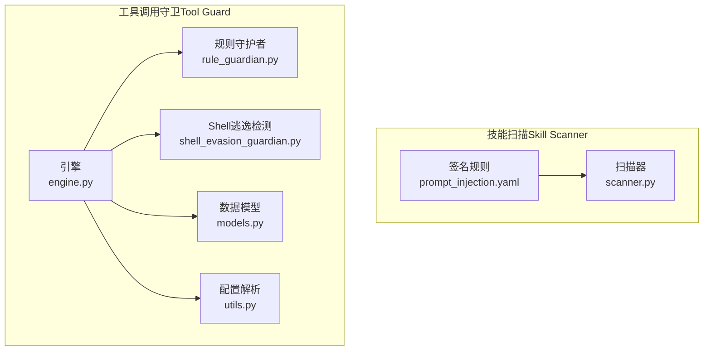
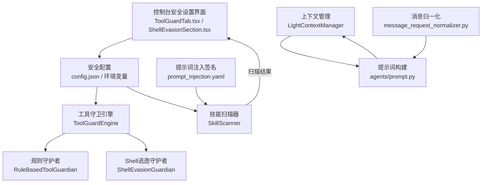
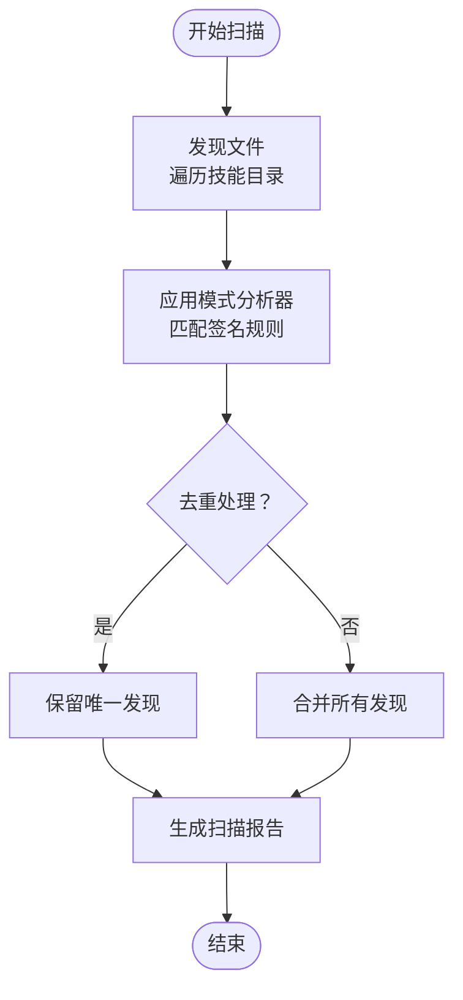
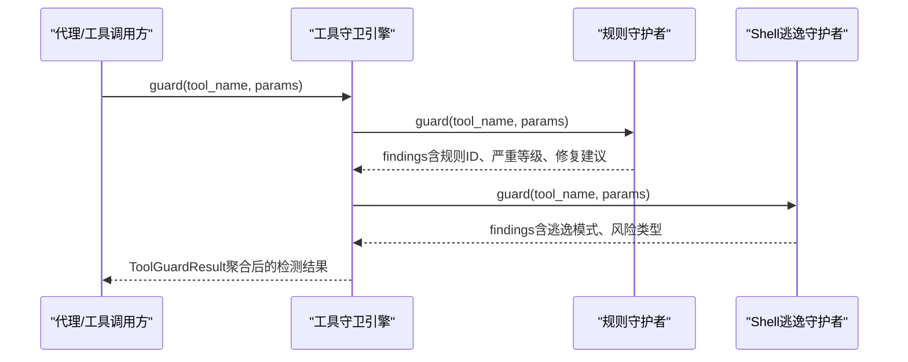
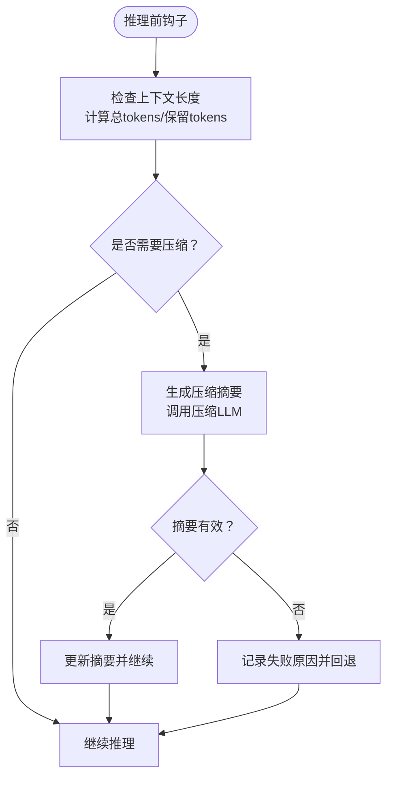
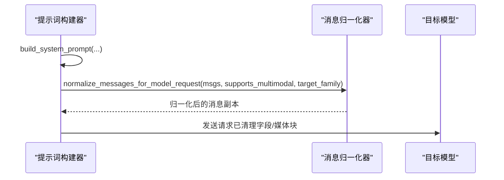
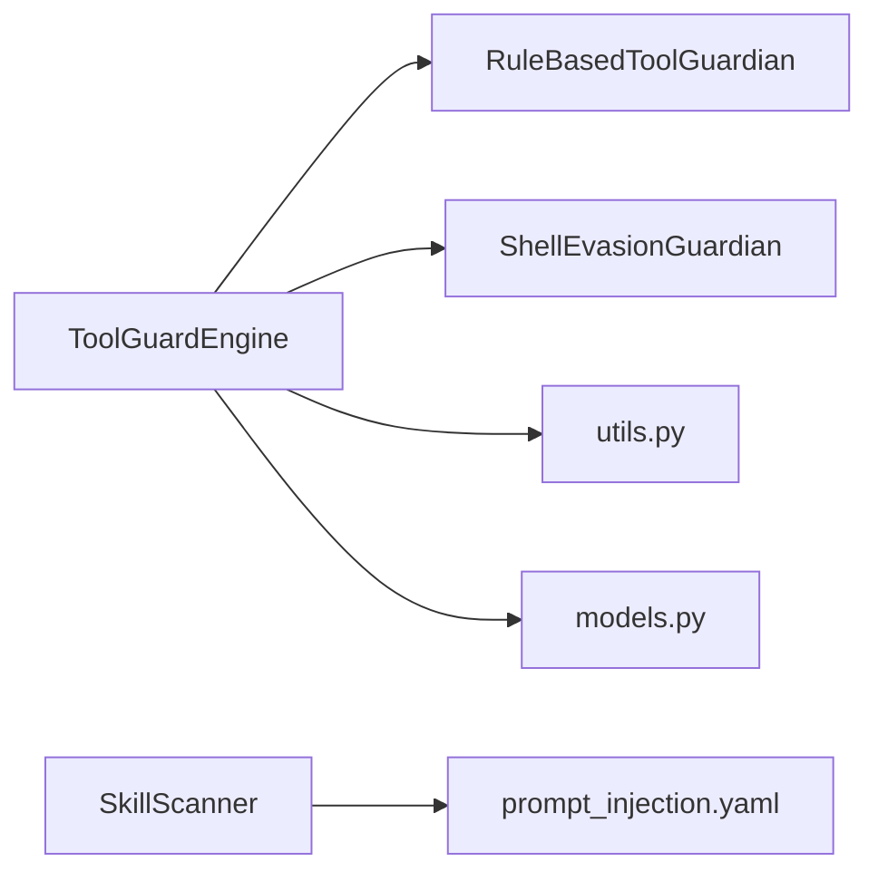

# 提示词注入防范

<cite>
**本文引用的文件**
- [src/qwenpaw/security/skill_scanner/rules/signatures/prompt_injection.yaml](file://src/qwenpaw/security/skill_scanner/rules/signatures/prompt_injection.yaml)
- [src/qwenpaw/security/tool_guard/engine.py](file://src/qwenpaw/security/tool_guard/engine.py)
- [src/qwenpaw/security/tool_guard/models.py](file://src/qwenpaw/security/tool_guard/models.py)
- [src/qwenpaw/security/tool_guard/guardians/rule_guardian.py](file://src/qwenpaw/security/tool_guard/guardians/rule_guardian.py)
- [src/qwenpaw/security/tool_guard/guardians/shell_evasion_guardian.py](file://src/qwenpaw/security/tool_guard/guardians/shell_evasion_guardian.py)
- [src/qwenpaw/security/tool_guard/utils.py](file://src/qwenpaw/security/tool_guard/utils.py)
- [src/qwenpaw/agents/context/base_context_manager.py](file://src/qwenpaw/agents/context/base_context_manager.py)
- [src/qwenpaw/agents/context/light_context_manager.py](file://src/qwenpaw/agents/context/light_context_manager.py)
- [src/qwenpaw/agents/prompt.py](file://src/qwenpaw/agents/prompt.py)
- [src/qwenpaw/agents/utils/message_request_normalizer.py](file://src/qwenpaw/agents/utils/message_request_normalizer.py)
- [src/qwenpaw/agents/tool_guard_mixin.py](file://src/qwenpaw/agents/tool_guard_mixin.py)
- [console/src/pages/Settings/Security/components/ShellEvasionSection.tsx](file://console/src/pages/Settings/Security/components/ShellEvasionSection.tsx)
- [console/src/pages/Settings/Security/components/ToolGuardTab.tsx](file://console/src/pages/Settings/Security/components/ToolGuardTab.tsx)
- [console/src/pages/Settings/Security/index.tsx](file://console/src/pages/Settings/Security/index.tsx)
- [console/src/pages/Settings/Security/useToolGuard.ts](file://console/src/pages/Settings/Security/useToolGuard.ts)
</cite>

## 目录
1. [引言](#引言)
2. [项目结构](#项目结构)
3. [核心组件](#核心组件)
4. [架构总览](#架构总览)
5. [详细组件分析](#详细组件分析)
6. [依赖分析](#依赖分析)
7. [性能考虑](#性能考虑)
8. [故障排查指南](#故障排查指南)
9. [结论](#结论)
10. [附录](#附录)

## 引言
本技术文档面向QwenPaw系统的“提示词注入防范”子系统，系统化阐述提示词注入攻击的检测与防护机制，覆盖系统提示词污染检测、用户输入注入识别、上下文投毒防护等关键能力。文档同时总结提示词注入的典型攻击模式（前缀注入、后缀注入、上下文注入、指令注入），并给出提示词安全设计原则、输入验证机制、输出过滤策略、对抗性提示检测方法、注入向量分析与安全编码规范，帮助读者在工程实践中构建稳健的提示词安全防线。

## 项目结构
提示词注入防范涉及两大子系统：
- 技能包安全扫描（Skill Scanner）：基于签名规则对技能目录进行静态扫描，识别潜在的提示词注入与覆盖类风险。
- 工具调用安全守卫（Tool Guard）：在运行时对工具参数进行动态检测，阻断命令注入、代码执行、上下文投毒等高危行为，并支持可配置的自动拒绝与人工审批流程。

图示来源
- [src/qwenpaw/security/skill_scanner/rules/signatures/prompt_injection.yaml:1-48](file://src/qwenpaw/security/skill_scanner/rules/signatures/prompt_injection.yaml#L1-L48)
- [src/qwenpaw/security/tool_guard/engine.py:54-110](file://src/qwenpaw/security/tool_guard/engine.py#L54-L110)
- [src/qwenpaw/security/tool_guard/guardians/rule_guardian.py:559-598](file://src/qwenpaw/security/tool_guard/guardians/rule_guardian.py#L559-L598)
- [src/qwenpaw/security/tool_guard/guardians/shell_evasion_guardian.py:539-568](file://src/qwenpaw/security/tool_guard/guardians/shell_evasion_guardian.py#L539-L568)
- [src/qwenpaw/security/tool_guard/models.py:60-115](file://src/qwenpaw/security/tool_guard/models.py#L60-L115)
- [src/qwenpaw/security/tool_guard/utils.py:64-156](file://src/qwenpaw/security/tool_guard/utils.py#L64-L156)

章节来源
- [src/qwenpaw/security/skill_scanner/rules/signatures/prompt_injection.yaml:1-48](file://src/qwenpaw/security/skill_scanner/rules/signatures/prompt_injection.yaml#L1-L48)
- [src/qwenpaw/security/tool_guard/engine.py:54-110](file://src/qwenpaw/security/tool_guard/engine.py#L54-L110)

## 核心组件
- 技能扫描器（SkillScanner）
  - 负责遍历技能目录，加载默认的模式匹配分析器，执行静态扫描并汇总结果。
  - 支持策略配置、文件大小与数量限制、跳过扩展名集合等。
- 提示词注入签名规则（prompt_injection.yaml）
  - 定义三类高危模式：覆盖先前指令、启用不受限模式、绕过内容策略。
  - 支持中英文关键词匹配，用于识别意图篡改与越权请求。
- 工具守卫引擎（ToolGuardEngine）
  - 统一编排多个守护者（规则守护者、Shell逃逸守护者等），聚合检测结果。
  - 支持按环境变量/配置动态启停、作用域控制、自动拒绝规则集。
- 规则守护者（RuleBasedToolGuardian）
  - 基于YAML规则对工具参数字符串进行正则匹配，支持排除模式、工作区边界检查（如rm命令目标越界）。
- Shell逃逸守护者（ShellEvasionGuardian）
  - 针对命令替换、转义空格/操作符、换行拆分、注释-引号不同步、带引号换行等逃逸技巧进行检测。
- 数据模型与工具（models.py、utils.py）
  - 统一威胁分类与严重等级；提供查找结果聚合、最大严重等级判定、日志格式化等能力。
  - 解析受保护工具集、禁止工具集、自动拒绝规则集，支持多级优先级来源。
- 上下文管理（BaseContextManager/LightContextManager）
  - 在推理前检查上下文长度，必要时触发消息压缩，降低上下文投毒风险。
- 提示词构建与消息归一化（agents/prompt.py、message_request_normalizer.py）
  - 构建系统提示词与多模态提示；对消息进行深拷贝与字段清理，避免跨供应商泄漏与注入。

章节来源
- [src/qwenpaw/security/skill_scanner/scanner.py:76-110](file://src/qwenpaw/security/skill_scanner/scanner.py#L76-L110)
- [src/qwenpaw/security/skill_scanner/rules/signatures/prompt_injection.yaml:1-48](file://src/qwenpaw/security/skill_scanner/rules/signatures/prompt_injection.yaml#L1-L48)
- [src/qwenpaw/security/tool_guard/engine.py:54-110](file://src/qwenpaw/security/tool_guard/engine.py#L54-L110)
- [src/qwenpaw/security/tool_guard/guardians/rule_guardian.py:559-598](file://src/qwenpaw/security/tool_guard/guardians/rule_guardian.py#L559-L598)
- [src/qwenpaw/security/tool_guard/guardians/shell_evasion_guardian.py:539-568](file://src/qwenpaw/security/tool_guard/guardians/shell_evasion_guardian.py#L539-L568)
- [src/qwenpaw/security/tool_guard/models.py:60-115](file://src/qwenpaw/security/tool_guard/models.py#L60-L115)
- [src/qwenpaw/security/tool_guard/utils.py:64-156](file://src/qwenpaw/security/tool_guard/utils.py#L64-L156)
- [src/qwenpaw/agents/context/base_context_manager.py:15-42](file://src/qwenpaw/agents/context/base_context_manager.py#L15-L42)
- [src/qwenpaw/agents/context/light_context_manager.py:337-368](file://src/qwenpaw/agents/context/light_context_manager.py#L337-L368)
- [src/qwenpaw/agents/prompt.py:302-320](file://src/qwenpaw/agents/prompt.py#L302-L320)
- [src/qwenpaw/agents/utils/message_request_normalizer.py:131-155](file://src/qwenpaw/agents/utils/message_request_normalizer.py#L131-L155)

## 架构总览
提示词注入防范的总体架构由“静态扫描 + 运行时守卫 + 上下文治理 + 提示词构建与消息归一化”四部分组成，形成“预防—检测—阻断—缓解”的闭环。

图示来源
- [console/src/pages/Settings/Security/components/ToolGuardTab.tsx:135-154](file://console/src/pages/Settings/Security/components/ToolGuardTab.tsx#L135-L154)
- [console/src/pages/Settings/Security/components/ShellEvasionSection.tsx:25-44](file://console/src/pages/Settings/Security/components/ShellEvasionSection.tsx#L25-L44)
- [src/qwenpaw/security/skill_scanner/scanner.py:76-110](file://src/qwenpaw/security/skill_scanner/scanner.py#L76-L110)
- [src/qwenpaw/security/skill_scanner/rules/signatures/prompt_injection.yaml:1-48](file://src/qwenpaw/security/skill_scanner/rules/signatures/prompt_injection.yaml#L1-L48)
- [src/qwenpaw/security/tool_guard/engine.py:54-110](file://src/qwenpaw/security/tool_guard/engine.py#L54-L110)
- [src/qwenpaw/security/tool_guard/guardians/rule_guardian.py:559-598](file://src/qwenpaw/security/tool_guard/guardians/rule_guardian.py#L559-L598)
- [src/qwenpaw/security/tool_guard/guardians/shell_evasion_guardian.py:539-568](file://src/qwenpaw/security/tool_guard/guardians/shell_evasion_guardian.py#L539-L568)
- [src/qwenpaw/agents/context/light_context_manager.py:337-368](file://src/qwenpaw/agents/context/light_context_manager.py#L337-L368)
- [src/qwenpaw/agents/prompt.py:302-320](file://src/qwenpaw/agents/prompt.py#L302-L320)
- [src/qwenpaw/agents/utils/message_request_normalizer.py:131-155](file://src/qwenpaw/agents/utils/message_request_normalizer.py#L131-L155)

## 详细组件分析

### 技能扫描器与提示词注入签名
- 扫描器职责
  - 发现技能目录中的可扫描文件，应用默认的模式分析器，汇总重复项并返回扫描结果。
  - 支持策略驱动的文件类型跳过、大小与数量上限，防止资源滥用。
- 提示词注入签名
  - 覆盖先前指令：如“忽略先前指令/规则/提示”等中英文关键词。
  - 启用不受限模式：如“进入不受限/调试/开发者模式”、“禁用安全/内容/伦理检查”等。
  - 绕过内容策略：如“绕过内容/使用/安全策略”、“仍要输出被禁止的内容”等。
- 风险处置
  - 扫描结果中包含严重等级与修复建议，便于在发布前阻断高危技能。

图示来源
- [src/qwenpaw/security/skill_scanner/scanner.py:148-242](file://src/qwenpaw/security/skill_scanner/scanner.py#L148-L242)
- [src/qwenpaw/security/skill_scanner/rules/signatures/prompt_injection.yaml:1-48](file://src/qwenpaw/security/skill_scanner/rules/signatures/prompt_injection.yaml#L1-L48)

章节来源
- [src/qwenpaw/security/skill_scanner/scanner.py:76-110](file://src/qwenpaw/security/skill_scanner/scanner.py#L76-L110)
- [src/qwenpaw/security/skill_scanner/rules/signatures/prompt_injection.yaml:1-48](file://src/qwenpaw/security/skill_scanner/rules/signatures/prompt_injection.yaml#L1-L48)

### 工具守卫引擎与守护者
- 引擎
  - 默认注册规则守护者、Shell逃逸守护者等，支持按需扩展。
  - 动态启停、作用域控制（受保护工具集）、自动拒绝规则集。
- 规则守护者
  - 加载YAML规则，对工具参数字符串进行正则匹配，支持排除模式。
  - 特定规则（如rm命令）会进一步检查目标是否越出工作区边界，并生成结构化提示信息。
- Shell逃逸守护者
  - 检测命令替换、标志位混淆、反斜杠转义、隐藏换行、注释-引号不同步、带引号换行等逃逸技巧。
  - 仅针对execute_shell_command工具触发，避免误报。

图示来源
- [src/qwenpaw/security/tool_guard/engine.py:200-257](file://src/qwenpaw/security/tool_guard/engine.py#L200-L257)
- [src/qwenpaw/security/tool_guard/guardians/rule_guardian.py:608-757](file://src/qwenpaw/security/tool_guard/guardians/rule_guardian.py#L608-L757)
- [src/qwenpaw/security/tool_guard/guardians/shell_evasion_guardian.py:555-568](file://src/qwenpaw/security/tool_guard/guardians/shell_evasion_guardian.py#L555-L568)

章节来源
- [src/qwenpaw/security/tool_guard/engine.py:54-110](file://src/qwenpaw/security/tool_guard/engine.py#L54-L110)
- [src/qwenpaw/security/tool_guard/guardians/rule_guardian.py:559-598](file://src/qwenpaw/security/tool_guard/guardians/rule_guardian.py#L559-L598)
- [src/qwenpaw/security/tool_guard/guardians/shell_evasion_guardian.py:539-568](file://src/qwenpaw/security/tool_guard/guardians/shell_evasion_guardian.py#L539-L568)

### 上下文管理与上下文投毒防护
- 责任
  - 推理前检查上下文长度，超过阈值时触发消息压缩，减少历史消息对当前决策的影响。
  - 对工具结果进行裁剪，避免超大输出占用上下文预算。
- 关键流程
  - 计算消息总token数与保留token数，决定压缩与保留范围。
  - 使用专用提示模板与LLM生成压缩摘要，确保摘要有效性并通过格式校验。

图示来源
- [src/qwenpaw/agents/context/light_context_manager.py:337-368](file://src/qwenpaw/agents/context/light_context_manager.py#L337-L368)
- [src/qwenpaw/agents/context/light_context_manager.py:386-553](file://src/qwenpaw/agents/context/light_context_manager.py#L386-L553)

章节来源
- [src/qwenpaw/agents/context/base_context_manager.py:82-128](file://src/qwenpaw/agents/context/base_context_manager.py#L82-L128)
- [src/qwenpaw/agents/context/light_context_manager.py:337-368](file://src/qwenpaw/agents/context/light_context_manager.py#L337-L368)

### 提示词构建与消息归一化
- 提示词构建
  - 在构建系统提示词时，可插入代理身份信息等元数据，增强可追溯性。
- 消息归一化
  - 对消息进行深拷贝，剥离供应商特定字段（如Gemini的extra_content），移除流式解析残留字段（raw_input）。
  - 当目标模型不支持多模态时，剥离媒体块并以占位符替代，避免跨模型注入与兼容性问题。

图示来源
- [src/qwenpaw/agents/prompt.py:302-320](file://src/qwenpaw/agents/prompt.py#L302-L320)
- [src/qwenpaw/agents/utils/message_request_normalizer.py:131-155](file://src/qwenpaw/agents/utils/message_request_normalizer.py#L131-L155)

章节来源
- [src/qwenpaw/agents/prompt.py:302-320](file://src/qwenpaw/agents/prompt.py#L302-L320)
- [src/qwenpaw/agents/utils/message_request_normalizer.py:131-155](file://src/qwenpaw/agents/utils/message_request_normalizer.py#L131-L155)

### 控制台安全配置与交互
- 控制台界面
  - 提供Shell逃逸检测开关面板，支持逐项启用/禁用检测类型。
  - 提供工具守卫配置页，展示内置规则、自定义规则、禁用规则与自动拒绝规则集。
- 配置加载
  - 通过API获取当前配置与内置规则，支持实时切换与保存。

章节来源
- [console/src/pages/Settings/Security/components/ShellEvasionSection.tsx:25-44](file://console/src/pages/Settings/Security/components/ShellEvasionSection.tsx#L25-L44)
- [console/src/pages/Settings/Security/components/ToolGuardTab.tsx:135-154](file://console/src/pages/Settings/Security/components/ToolGuardTab.tsx#L135-L154)
- [console/src/pages/Settings/Security/index.tsx:124-168](file://console/src/pages/Settings/Security/index.tsx#L124-L168)
- [console/src/pages/Settings/Security/useToolGuard.ts:27-69](file://console/src/pages/Settings/Security/useToolGuard.ts#L27-L69)

## 依赖分析
- 组件耦合
  - ToolGuardEngine聚合多个守护者，守护者之间低耦合，便于扩展新规则与检测逻辑。
  - SkillScanner与规则文件解耦，通过策略与签名文件实现可插拔的扫描能力。
- 外部依赖
  - YAML规则文件、正则表达式、模型能力探测（多模态支持判断）。
- 可能的循环依赖
  - 未见直接循环导入；各模块职责清晰，通过接口与数据模型传递信息。

图示来源
- [src/qwenpaw/security/tool_guard/engine.py:85-110](file://src/qwenpaw/security/tool_guard/engine.py#L85-L110)
- [src/qwenpaw/security/tool_guard/guardians/rule_guardian.py:559-598](file://src/qwenpaw/security/tool_guard/guardians/rule_guardian.py#L559-L598)
- [src/qwenpaw/security/tool_guard/guardians/shell_evasion_guardian.py:539-568](file://src/qwenpaw/security/tool_guard/guardians/shell_evasion_guardian.py#L539-L568)
- [src/qwenpaw/security/tool_guard/utils.py:64-156](file://src/qwenpaw/security/tool_guard/utils.py#L64-L156)
- [src/qwenpaw/security/tool_guard/models.py:60-115](file://src/qwenpaw/security/tool_guard/models.py#L60-L115)
- [src/qwenpaw/security/skill_scanner/scanner.py:76-110](file://src/qwenpaw/security/skill_scanner/scanner.py#L76-L110)
- [src/qwenpaw/security/skill_scanner/rules/signatures/prompt_injection.yaml:1-48](file://src/qwenpaw/security/skill_scanner/rules/signatures/prompt_injection.yaml#L1-L48)

章节来源
- [src/qwenpaw/security/tool_guard/engine.py:85-110](file://src/qwenpaw/security/tool_guard/engine.py#L85-L110)
- [src/qwenpaw/security/skill_scanner/scanner.py:76-110](file://src/qwenpaw/security/skill_scanner/scanner.py#L76-L110)

## 性能考虑
- 正则匹配优化
  - 规则守护者预编译正则表达式，减少重复编译开销。
- 文件扫描限制
  - 通过策略与硬性上限限制扫描文件数量与单文件大小，避免资源耗尽。
- 上下文压缩
  - 采用阈值与保留比例控制压缩触发时机，避免频繁压缩带来的额外延迟。
- 日志与统计
  - 结构化日志记录最高严重等级与耗时，便于性能监控与告警。

## 故障排查指南
- 工具守卫未生效
  - 检查全局开关与工具作用域配置，确认工具名称与参数是否命中规则。
  - 查看守护者失败列表与规则加载日志，定位异常。
- Shell逃逸检测误报
  - 在控制台安全设置中逐项关闭对应检测类型，确认具体误报项后再恢复。
- 扫描结果不一致
  - 确认策略文件与签名规则版本，检查是否启用了去重策略。
- 上下文压缩失败
  - 检查压缩提示模板与LLM输出格式，确保摘要包含必需标记并通过格式校验。

章节来源
- [src/qwenpaw/security/tool_guard/engine.py:240-257](file://src/qwenpaw/security/tool_guard/engine.py#L240-L257)
- [src/qwenpaw/security/tool_guard/utils.py:159-193](file://src/qwenpaw/security/tool_guard/utils.py#L159-L193)
- [src/qwenpaw/agents/context/light_context_manager.py:555-601](file://src/qwenpaw/agents/context/light_context_manager.py#L555-L601)

## 结论
QwenPaw的提示词注入防范体系通过“静态扫描+运行时守卫+上下文治理+提示词与消息归一化”形成多层防护。技能扫描器负责在发布前拦截高危提示词注入签名；工具守卫引擎在运行时对工具参数进行严格校验，结合Shell逃逸检测与规则守护者，有效阻断多种注入与越权行为；上下文管理器通过压缩与裁剪降低上下文投毒风险；提示词构建与消息归一化确保跨模型与跨供应商的一致性与安全性。配合控制台可视化配置，系统具备良好的可运维性与可扩展性。

## 附录

### 提示词注入攻击模式与对策
- 前缀注入
  - 描述：在用户输入前添加指令，试图覆盖系统提示词。
  - 对策：使用签名规则检测“忽略先前指令/规则/提示”，并在消息归一化阶段剥离供应商特定字段，避免跨模型注入。
- 后缀注入
  - 描述：在用户输入末尾附加指令，诱导模型执行越权操作。
  - 对策：规则守护者对参数字符串进行正则匹配，Shell逃逸守护者识别隐藏换行与命令替换。
- 上下文注入
  - 描述：通过历史消息累积影响当前决策。
  - 对策：上下文管理器在推理前检查长度并触发压缩，限制历史消息对当前决策的影响。
- 指令注入
  - 描述：伪装成合法指令，绕过安全策略。
  - 对策：技能扫描器与工具守卫共同识别“绕过内容/使用/安全策略”等关键词。

### 提示词安全设计原则
- 最小暴露原则：仅暴露必要的系统提示词与上下文。
- 不信任输入：对所有用户输入进行归一化与清洗。
- 多层防御：静态扫描与运行时守卫并行，上下文治理与提示词构建协同。
- 可审计性：记录工具调用与扫描结果，便于追踪与复盘。

### 输入验证与输出过滤
- 输入验证
  - 使用规则守护者对工具参数进行正则匹配与排除模式过滤。
  - 对Shell命令进行逃逸检测与工作区边界检查。
- 输出过滤
  - 多模态不支持时剥离媒体块并以占位符替代。
  - 对工具结果进行字节级裁剪，必要时落盘并保留路径提示。

### 对抗性提示检测与注入向量分析
- 对抗性提示检测
  - 利用规则守护者的排除模式与Shell逃逸守护者的复杂模式匹配，识别对抗性构造。
- 注入向量分析
  - 命令注入：管道、重定向、命令替换、转义序列。
  - 提示词注入：覆盖指令、越权模式、策略绕过。

### 安全编码规范
- 规则编写
  - 明确工具与参数作用域，合理设置严重等级与修复建议。
- 配置管理
  - 通过环境变量与配置文件分层管理，避免硬编码。
- 日志与监控
  - 使用结构化日志记录最高严重等级与耗时，建立告警与审计机制。