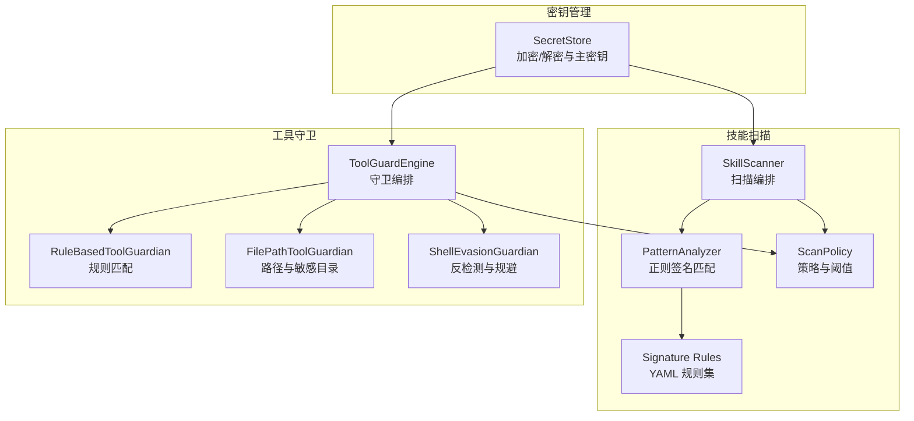
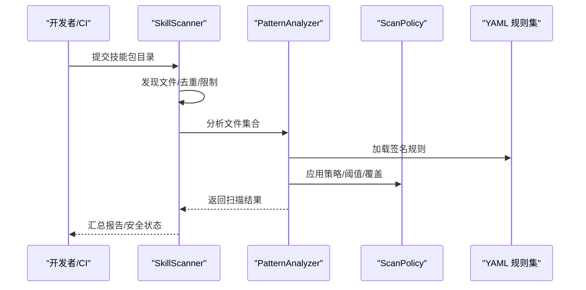
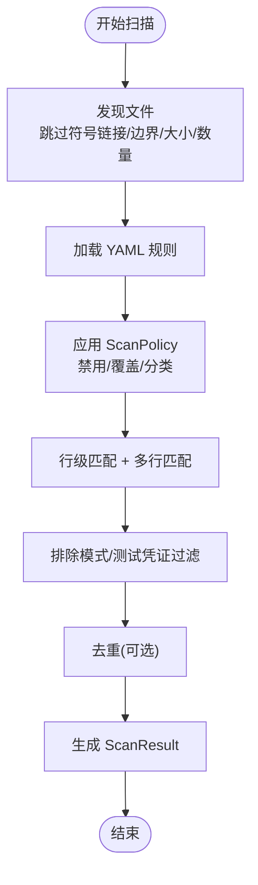
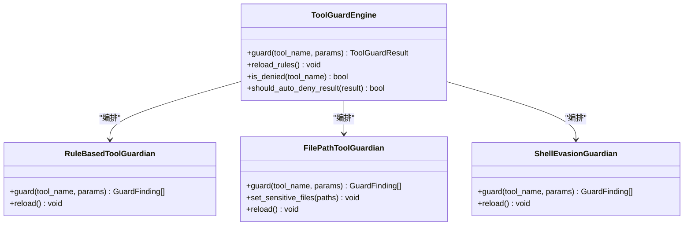
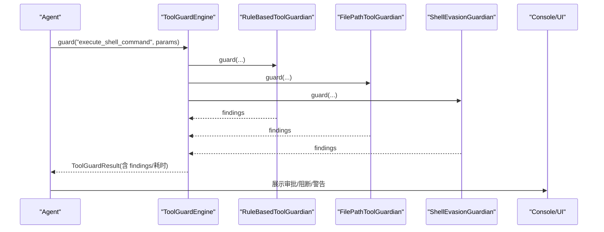
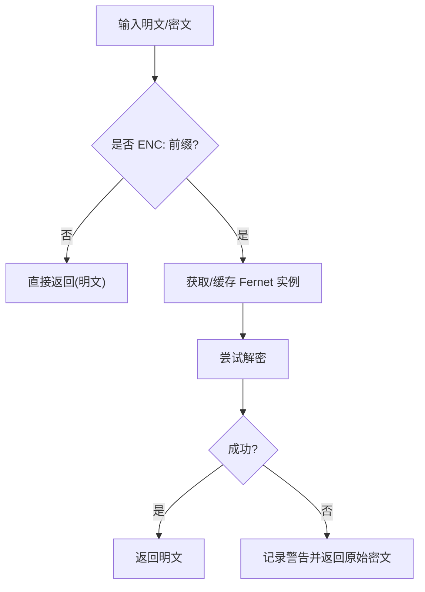
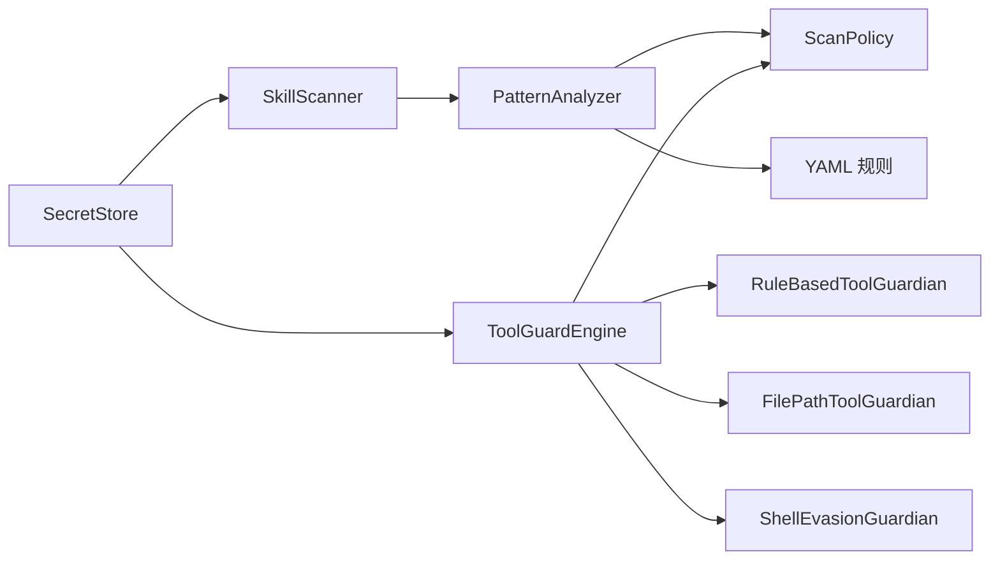

# 数据泄露防护

<cite>
**本文引用的文件**
- [scanner.py](file://src/qwenpaw/security/skill_scanner/scanner.py)
- [pattern_analyzer.py](file://src/qwenpaw/security/skill_scanner/analyzers/pattern_analyzer.py)
- [scan_policy.py](file://src/qwenpaw/security/skill_scanner/scan_policy.py)
- [data_exfiltration.yaml](file://src/qwenpaw/security/skill_scanner/rules/signatures/data_exfiltration.yaml)
- [hardcoded_secrets.yaml](file://src/qwenpaw/security/skill_scanner/rules/signatures/hardcoded_secrets.yaml)
- [engine.py](file://src/qwenpaw/security/tool_guard/engine.py)
- [file_guardian.py](file://src/qwenpaw/security/tool_guard/guardians/file_guardian.py)
- [rule_guardian.py](file://src/qwenpaw/security/tool_guard/guardians/rule_guardian.py)
- [shell_evasion_guardian.py](file://src/qwenpaw/security/tool_guard/guardians/shell_evasion_guardian.py)
- [dangerous_shell_commands.yaml](file://src/qwenpaw/security/tool_guard/rules/dangerous_shell_commands.yaml)
- [secret_store.py](file://src/qwenpaw/security/secret_store.py)
- [config.py](file://src/qwenpaw/app/routers/config.py)
- [useSkillScanner.ts](file://console/src/pages/Settings/Security/useSkillScanner.ts)
- [scanError.ts](file://console/src/utils/scanError.ts)
- [security.en.md](file://website/public/docs/security.en.md)
</cite>

## 目录
1. [简介](#简介)
2. [项目结构](#项目结构)
3. [核心组件](#核心组件)
4. [架构总览](#架构总览)
5. [详细组件分析](#详细组件分析)
6. [依赖关系分析](#依赖关系分析)
7. [性能考量](#性能考量)
8. [故障排查指南](#故障排查指南)
9. [结论](#结论)
10. [附录](#附录)

## 简介
本技术文档面向 QwenPaw 数据泄露防护体系，系统阐述其在技能包静态扫描与工具调用动态防护两大维度的检测机制与实现。重点覆盖以下方面：
- 敏感数据传输检测：基于正则签名的网络请求与文件读取识别、Base64 编码与外发结合的高危模式。
- 文件上传下载监控：通过路径规范化、重定向解析与工作区边界检查，阻断敏感文件访问与跨区破坏。
- API 调用中的数据暴露识别：对危险命令注入、权限提升、反检测与规避手段进行实时阻断。
- 第三方服务集成风险评估：对规则可扩展性、策略化阈值与白名单机制进行说明。
- 数据分类分级策略、传输加密要求与访问控制机制：结合代码实现给出落地建议。
- 实际检测案例与数据保护最佳实践：以仓库内规则与实现为依据，提供可操作的防护清单。

## 项目结构
QwenPaw 的安全能力由“技能扫描器 + 工具守卫引擎 + 密钥存储”三大部分构成：
- 技能扫描器：负责对技能包进行静态扫描，基于 YAML 规则库匹配潜在泄露与违规模式。
- 工具守卫引擎：在运行时拦截工具参数，针对危险命令与路径访问进行阻断与审批。
- 密钥存储：对敏感字段进行透明加解密，确保磁盘持久化安全。

图表来源
- [scanner.py:76-242](file://src/qwenpaw/security/skill_scanner/scanner.py#L76-L242)
- [pattern_analyzer.py:236-347](file://src/qwenpaw/security/skill_scanner/analyzers/pattern_analyzer.py#L236-L347)
- [scan_policy.py:156-475](file://src/qwenpaw/security/skill_scanner/scan_policy.py#L156-L475)
- [engine.py:54-257](file://src/qwenpaw/security/tool_guard/engine.py#L54-L257)
- [file_guardian.py:301-500](file://src/qwenpaw/security/tool_guard/guardians/file_guardian.py#L301-L500)
- [rule_guardian.py:559-757](file://src/qwenpaw/security/tool_guard/guardians/rule_guardian.py#L559-L757)
- [shell_evasion_guardian.py:539-592](file://src/qwenpaw/security/tool_guard/guardians/shell_evasion_guardian.py#L539-L592)
- [secret_store.py:293-321](file://src/qwenpaw/security/secret_store.py#L293-L321)

章节来源
- [scanner.py:76-242](file://src/qwenpaw/security/skill_scanner/scanner.py#L76-L242)
- [engine.py:54-257](file://src/qwenpaw/security/tool_guard/engine.py#L54-L257)

## 核心组件
- 技能扫描器（SkillScanner）
  - 负责遍历技能包、发现文件、加载分析器并聚合结果；支持去重、超限保护与错误处理。
- 正则签名分析器（PatternAnalyzer）
  - 加载 YAML 规则，按行与多行两种方式匹配，支持排除模式、文件类型过滤与策略覆盖。
- 扫描策略（ScanPolicy）
  - 组织级策略入口，支持规则禁用、严重度覆盖、文档路径跳过、文件类型分类与阈值配置。
- 工具守卫引擎（ToolGuardEngine）
  - 统一编排多个守卫器，按配置决定是否启用、自动拒绝与审批流程。
- 路径守卫（FilePathToolGuardian）
  - 对文件路径参数进行规范化与敏感目录/文件阻断，支持 shell 命令路径提取。
- 规则守卫（RuleBasedToolGuardian）
  - 基于 YAML 规则对工具参数进行正则匹配，涵盖危险命令、权限提升、反检测等。
- 反检测守卫（ShellEvasionGuardian）
  - 针对命令替换、转义空格、控制字符、Unicode 空白等规避手段进行检测。
- 密钥存储（SecretStore）
  - 使用 Fernet 对称加密，主密钥可落盘或存入系统钥匙串，提供透明加解密与容错回退。

章节来源
- [scanner.py:76-242](file://src/qwenpaw/security/skill_scanner/scanner.py#L76-L242)
- [pattern_analyzer.py:236-347](file://src/qwenpaw/security/skill_scanner/analyzers/pattern_analyzer.py#L236-L347)
- [scan_policy.py:156-475](file://src/qwenpaw/security/skill_scanner/scan_policy.py#L156-L475)
- [engine.py:54-257](file://src/qwenpaw/security/tool_guard/engine.py#L54-L257)
- [file_guardian.py:301-500](file://src/qwenpaw/security/tool_guard/guardians/file_guardian.py#L301-L500)
- [rule_guardian.py:559-757](file://src/qwenpaw/security/tool_guard/guardians/rule_guardian.py#L559-L757)
- [shell_evasion_guardian.py:539-592](file://src/qwenpaw/security/tool_guard/guardians/shell_evasion_guardian.py#L539-L592)
- [secret_store.py:293-321](file://src/qwenpaw/security/secret_store.py#L293-L321)

## 架构总览
下图展示从技能包扫描到工具调用拦截的整体流程，以及与密钥存储的协作关系。

图表来源
- [scanner.py:148-242](file://src/qwenpaw/security/skill_scanner/scanner.py#L148-L242)
- [pattern_analyzer.py:265-347](file://src/qwenpaw/security/skill_scanner/analyzers/pattern_analyzer.py#L265-L347)
- [scan_policy.py:156-475](file://src/qwenpaw/security/skill_scanner/scan_policy.py#L156-L475)

章节来源
- [scanner.py:148-242](file://src/qwenpaw/security/skill_scanner/scanner.py#L148-L242)
- [pattern_analyzer.py:265-347](file://src/qwenpaw/security/skill_scanner/analyzers/pattern_analyzer.py#L265-L347)
- [scan_policy.py:156-475](file://src/qwenpaw/security/skill_scanner/scan_policy.py#L156-L475)

## 详细组件分析

### 技能扫描器与正则签名分析器
- 文件发现与限制
  - 支持跳过符号链接、超出工作区边界、超大文件与文件数量上限，避免资源滥用。
- 规则加载与匹配
  - YAML 规则包含 id、类别、严重度、模式、排除模式、文件类型、描述与修复建议。
  - 匹配分为行级与多行两种，多行模式会剔除字符类后再判断是否含换行，降低误报。
- 策略化控制
  - 支持规则禁用、严重度覆盖、仅在文档路径/代码文件触发、去重等。
- 凭证过滤
  - 对已知测试凭证与占位符进行抑制，减少噪音。

图表来源
- [scanner.py:248-299](file://src/qwenpaw/security/skill_scanner/scanner.py#L248-L299)
- [pattern_analyzer.py:93-155](file://src/qwenpaw/security/skill_scanner/analyzers/pattern_analyzer.py#L93-L155)
- [scan_policy.py:183-193](file://src/qwenpaw/security/skill_scanner/scan_policy.py#L183-L193)

章节来源
- [scanner.py:248-299](file://src/qwenpaw/security/skill_scanner/scanner.py#L248-L299)
- [pattern_analyzer.py:93-155](file://src/qwenpaw/security/skill_scanner/analyzers/pattern_analyzer.py#L93-L155)
- [scan_policy.py:183-193](file://src/qwenpaw/security/skill_scanner/scan_policy.py#L183-L193)

### 数据外泄检测规则族
- 数据外泄（data_exfiltration）
  - 网络请求原语：requests/httpx/aiohttp/urllib/http.client。
  - 高危 POST：结合关键词与上下文限定，识别可疑外发。
  - Socket 连接：对外连接且非本地地址。
  - 敏感文件读取：/etc/passwd、.aws/credentials、.ssh/*、.gnupg、.netrc、.pgpass、.env 等。
  - Base64 + 网络：在同一行同时出现编码与网络操作，提示潜在外发。
  - JS/TS：fetch/axios/XMLHttpRequest 等。
- 硬编码密钥（hardcoded_secrets）
  - AWS/Stripe/Google/GitHub/JWT 私钥/令牌/连接串等。
  - 密钥块需包含完整 BEGIN/END，避免示例误报。
  - 连接串中若使用环境变量则不视为硬编码。

章节来源
- [data_exfiltration.yaml:4-142](file://src/qwenpaw/security/skill_scanner/rules/signatures/data_exfiltration.yaml#L4-L142)
- [hardcoded_secrets.yaml:4-150](file://src/qwenpaw/security/skill_scanner/rules/signatures/hardcoded_secrets.yaml#L4-L150)

### 工具守卫引擎与三大守卫器
- 守卫编排
  - ToolGuardEngine 统一加载默认守卫器集合，支持重载规则与受控启用。
- 规则守卫（RuleBasedToolGuardian）
  - 加载 YAML 规则，对 execute_shell_command 参数进行匹配，涵盖 rm/mv/格式化/反连/提权/权限变更/系统重启/服务管理/进程终止/IFS 注入/控制字符/Unicode 空白/proc/environ/jq 危险用法/Zsh 危险内置等。
  - 特别增强：对 rm 命令的目标路径进行工作区边界检查，标记“工作区外文件”并给出修复建议。
- 路径守卫（FilePathToolGuardian）
  - 将输入路径标准化（兼容 Windows/POSIX），识别敏感目录与文件，支持 shell 命令路径抽取。
- 反检测守卫（ShellEvasionGuardian）
  - 检测命令替换、ANSI-C 引号、转义空格/运算符、换行/回车、注释引号不同步、引号内换行+注释行等规避手法。

图表来源
- [engine.py:54-257](file://src/qwenpaw/security/tool_guard/engine.py#L54-L257)
- [rule_guardian.py:559-757](file://src/qwenpaw/security/tool_guard/guardians/rule_guardian.py#L559-L757)
- [file_guardian.py:301-500](file://src/qwenpaw/security/tool_guard/guardians/file_guardian.py#L301-L500)
- [shell_evasion_guardian.py:539-592](file://src/qwenpaw/security/tool_guard/guardians/shell_evasion_guardian.py#L539-L592)

章节来源
- [engine.py:54-257](file://src/qwenpaw/security/tool_guard/engine.py#L54-L257)
- [rule_guardian.py:559-757](file://src/qwenpaw/security/tool_guard/guardians/rule_guardian.py#L559-L757)
- [file_guardian.py:301-500](file://src/qwenpaw/security/tool_guard/guardians/file_guardian.py#L301-L500)
- [shell_evasion_guardian.py:539-592](file://src/qwenpaw/security/tool_guard/guardians/shell_evasion_guardian.py#L539-L592)

### 工具调用流程与审批

图表来源
- [engine.py:200-257](file://src/qwenpaw/security/tool_guard/engine.py#L200-L257)
- [rule_guardian.py:608-757](file://src/qwenpaw/security/tool_guard/guardians/rule_guardian.py#L608-L757)
- [file_guardian.py:449-500](file://src/qwenpaw/security/tool_guard/guardians/file_guardian.py#L449-L500)
- [shell_evasion_guardian.py:555-592](file://src/qwenpaw/security/tool_guard/guardians/shell_evasion_guardian.py#L555-L592)

章节来源
- [engine.py:200-257](file://src/qwenpaw/security/tool_guard/engine.py#L200-L257)

### 密钥存储与访问控制
- 主密钥管理
  - 优先使用系统钥匙串（keyring），失败时回退到 SECRET_DIR/.master_key 并设置 0o600 权限。
  - 支持热切换与恢复后同步。
- 加密/解密
  - 使用 Fernet(AES-128-CBC + HMAC-SHA256)，值带 ENC: 前缀以便区分明文与密文。
  - 解密失败时返回原始密文，避免崩溃。
- 字段级加解密
  - 提供 PROVIDER_SECRET_FIELDS/AUTH_SECRET_FIELDS 白名单，仅对指定字段执行加解密。

图表来源
- [secret_store.py:293-321](file://src/qwenpaw/security/secret_store.py#L293-L321)

章节来源
- [secret_store.py:293-321](file://src/qwenpaw/security/secret_store.py#L293-L321)

### 控制台与配置接口
- 技能扫描配置与白名单
  - Console 提供技能扫描配置读取/更新、阻断历史查询、白名单增删。
  - 后端提供白名单添加接口，校验重复与必填项。
- 错误与告警展示
  - 统一渲染扫描告警/错误模态框，支持分页与更多条目提示。

章节来源
- [useSkillScanner.ts:1-85](file://console/src/pages/Settings/Security/useSkillScanner.ts#L1-L85)
- [config.py:848-883](file://src/qwenpaw/app/routers/config.py#L848-L883)
- [scanError.ts:87-172](file://console/src/utils/scanError.ts#L87-L172)

## 依赖关系分析
- 组件耦合
  - SkillScanner 与 PatternAnalyzer 通过 ScanPolicy 解耦；规则与策略可独立演进。
  - ToolGuardEngine 通过守卫器抽象与规则/策略解耦，便于扩展新检测引擎。
- 外部依赖
  - 规则文件（YAML）与系统钥匙串（keyring）为关键外部依赖。
- 循环依赖
  - 未见循环导入；模块职责清晰，接口稳定。

图表来源
- [scanner.py:76-147](file://src/qwenpaw/security/skill_scanner/scanner.py#L76-L147)
- [pattern_analyzer.py:236-260](file://src/qwenpaw/security/skill_scanner/analyzers/pattern_analyzer.py#L236-L260)
- [engine.py:54-110](file://src/qwenpaw/security/tool_guard/engine.py#L54-L110)
- [secret_store.py:293-321](file://src/qwenpaw/security/secret_store.py#L293-L321)

章节来源
- [scanner.py:76-147](file://src/qwenpaw/security/skill_scanner/scanner.py#L76-L147)
- [engine.py:54-110](file://src/qwenpaw/security/tool_guard/engine.py#L54-L110)

## 性能考量
- 扫描器
  - 文件发现阶段对数量与大小设限，避免 OOM 与长时间扫描。
  - 去重与排除模式减少无效匹配成本。
- 分析器
  - 行级匹配优先，多行匹配仅对含换行的模式生效，兼顾准确率与性能。
- 守卫器
  - 规则守卫按工具/参数维度快速筛选适用规则，减少不必要的匹配。
  - 反检测守卫采用预编译正则与状态机，降低解析开销。
- 密钥存储
  - 主密钥与 Fernet 实例缓存，减少频繁 IO 与加密初始化。

## 故障排查指南
- 扫描器异常
  - 文件遍历失败/权限不足：检查目录权限与软链接；查看日志警告。
  - 规则加载失败：确认 YAML 语法与字段完整性。
- 守卫器异常
  - 规则匹配异常：检查正则表达式合法性；必要时调整忽略模式。
  - 路径解析异常：确认输入路径是否为空/非字符串；检查工作区边界逻辑。
- 密钥存储异常
  - 解密失败：确认主密钥是否变更或损坏；查看回退行为与日志。
  - 钥匙串不可用：检查 keyring 服务可用性与权限。
- 控制台交互
  - 扫描错误/告警弹窗：根据提示核对 findings 详情与修复建议。

章节来源
- [scanner.py:194-213](file://src/qwenpaw/security/skill_scanner/scanner.py#L194-L213)
- [pattern_analyzer.py:432-464](file://src/qwenpaw/security/skill_scanner/analyzers/pattern_analyzer.py#L432-L464)
- [rule_guardian.py:432-464](file://src/qwenpaw/security/tool_guard/guardians/rule_guardian.py#L432-L464)
- [secret_store.py:312-321](file://src/qwenpaw/security/secret_store.py#L312-L321)
- [scanError.ts:87-172](file://console/src/utils/scanError.ts#L87-L172)

## 结论
QwenPaw 的数据泄露防护体系通过“静态签名扫描 + 动态工具守卫 + 密钥透明加密”的组合，实现了对常见泄露模式（硬编码密钥、敏感文件读取、Base64 外发、危险命令注入、反检测规避）的全链路覆盖。策略化与可扩展的规则体系使组织能够按自身安全基线定制检测强度与范围；严格的路径与工作区边界检查有效降低了越权与破坏风险；密钥存储的透明加解密与主密钥回退机制保障了持久化数据的安全性。

## 附录

### 数据分类分级策略与实施建议
- 分类分级
  - 将规则按严重度（CRITICAL/HIGH/MEDIUM/LOW/INFO）映射到组织的分级标准。
  - 对涉及隐私/合规的数据（如 .env/.pgpass/.ssh/*）提高严重度或直接阻断。
- 策略化阈值
  - 利用 ScanPolicy 的 file_limits/analysis_thresholds/severity_overrides 控制误报与漏报。
- 白名单与豁免
  - 通过技能扫描白名单与工具守卫豁免列表，允许经审批的例外场景。

章节来源
- [scan_policy.py:134-177](file://src/qwenpaw/security/skill_scanner/scan_policy.py#L134-L177)
- [config.py:848-883](file://src/qwenpaw/app/routers/config.py#L848-L883)

### 传输加密与访问控制
- 传输加密
  - 网络外发检测仅作为风险信号，建议配合网络策略与 egress 控制。
- 访问控制
  - 路径守卫与工作区边界检查是防止越权访问的关键；建议结合最小权限模型与沙箱执行。

章节来源
- [data_exfiltration.yaml:4-142](file://src/qwenpaw/security/skill_scanner/rules/signatures/data_exfiltration.yaml#L4-L142)
- [file_guardian.py:125-144](file://src/qwenpaw/security/tool_guard/guardians/file_guardian.py#L125-L144)

### 实际检测案例与最佳实践
- 案例
  - 硬编码密钥：AWS/Stripe/Google/JWT/私钥/连接串等被规则精准识别。
  - 数据外泄：requests.post + base64 编码在同一行被标记为高危。
  - 危险命令：curl | bash、sudo、chmod 777、rm -rf、systemctl restart 等被阻断。
  - 反检测：IFS 注入、控制字符、Unicode 空白、反引号命令替换等被识别。
- 最佳实践
  - 不在代码中硬编码任何凭据；使用 SecretStore 或环境变量。
  - 严格限制文件系统访问，禁止读取敏感系统文件与用户密钥。
  - 对网络外发进行白名单化管理，并审计所有外发目的地。
  - 审批流程：在 STRONG 模式下对高危工具调用强制审批；对中高风险自动阻断。
  - 定期更新规则与策略，结合业务场景调整阈值与覆盖项。

章节来源
- [hardcoded_secrets.yaml:4-150](file://src/qwenpaw/security/skill_scanner/rules/signatures/hardcoded_secrets.yaml#L4-L150)
- [data_exfiltration.yaml:92-101](file://src/qwenpaw/security/skill_scanner/rules/signatures/data_exfiltration.yaml#L92-L101)
- [dangerous_shell_commands.yaml:13-187](file://src/qwenpaw/security/tool_guard/rules/dangerous_shell_commands.yaml#L13-L187)
- [security.en.md:468-497](file://website/public/docs/security.en.md#L468-L497)