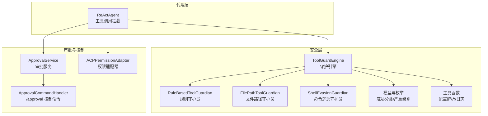
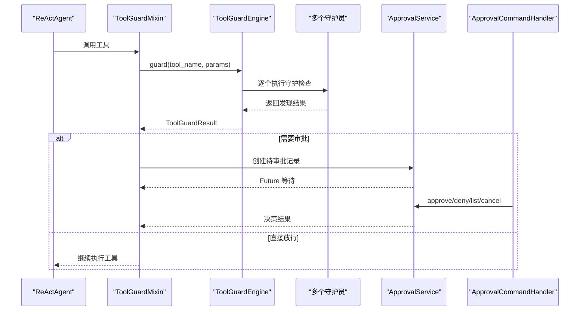
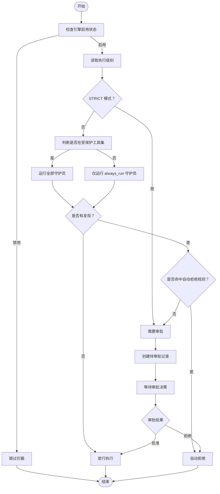
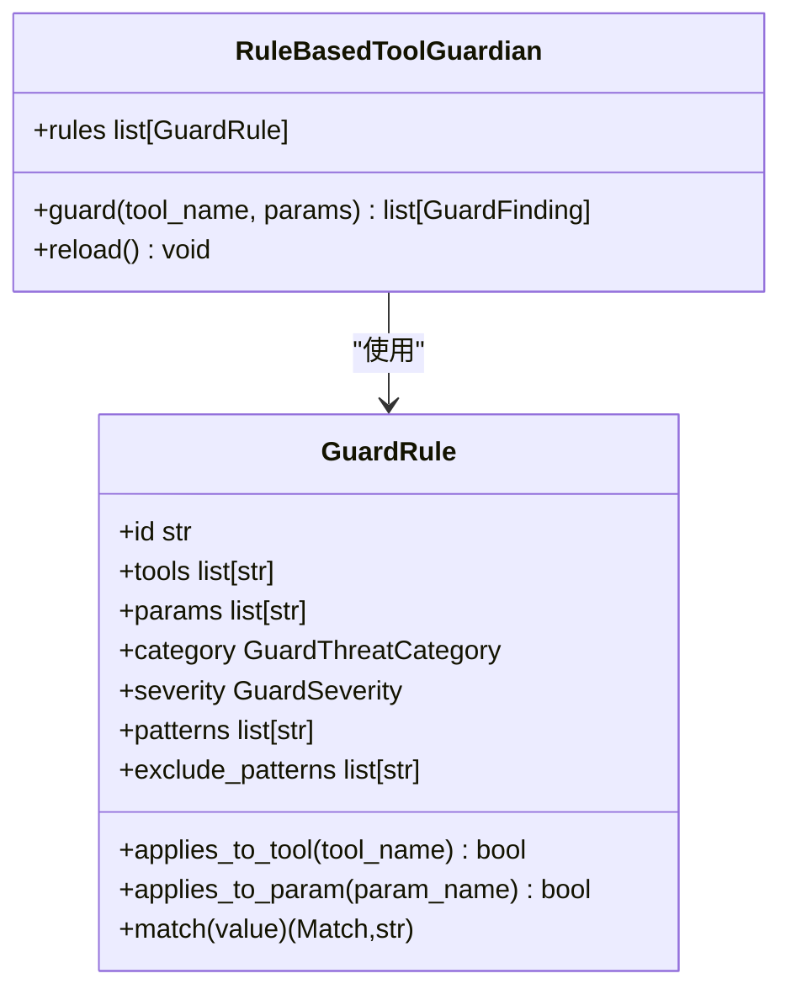
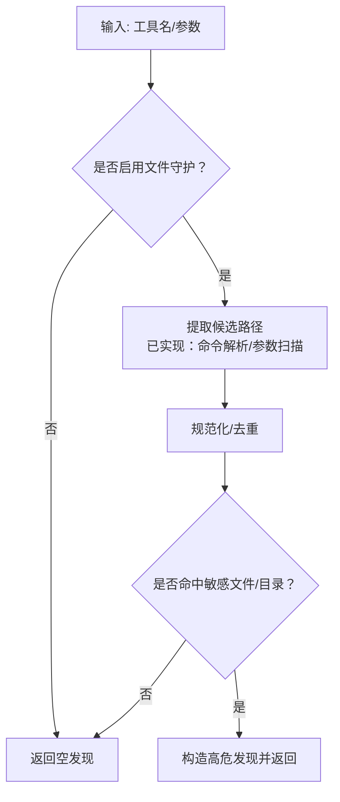
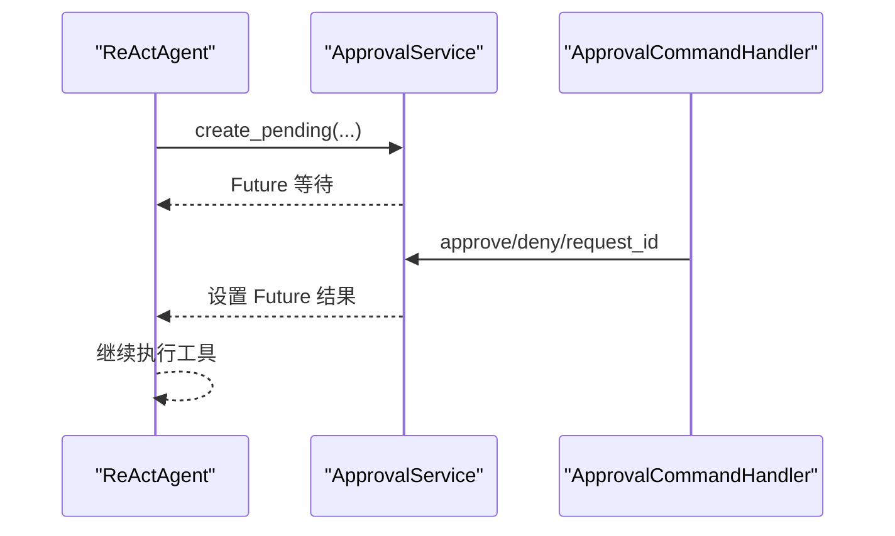
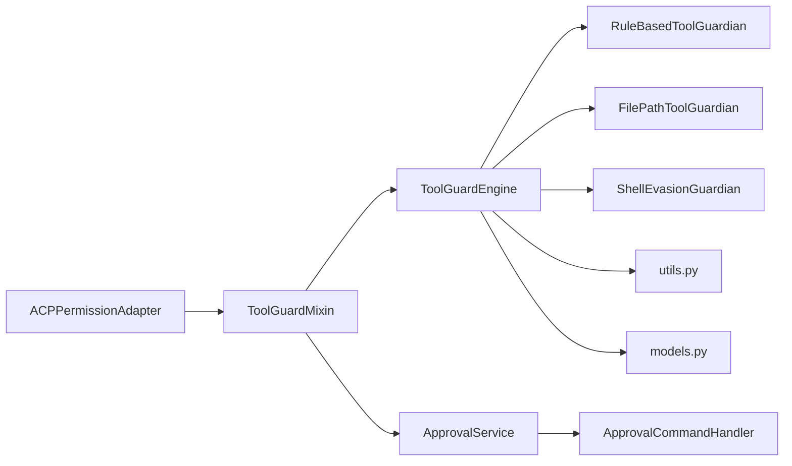

# 未授权工具使用监控

<cite>
**本文档引用的文件**
- [src/qwenpaw/agents/tool_guard_mixin.py](file://src/qwenpaw/agents/tool_guard_mixin.py)
- [src/qwenpaw/security/tool_guard/engine.py](file://src/qwenpaw/security/tool_guard/engine.py)
- [src/qwenpaw/security/tool_guard/guardians/__init__.py](file://src/qwenpaw/security/tool_guard/guardians/__init__.py)
- [src/qwenpaw/security/tool_guard/guardians/file_guardian.py](file://src/qwenpaw/security/tool_guard/guardians/file_guardian.py)
- [src/qwenpaw/security/tool_guard/guardians/rule_guardian.py](file://src/qwenpaw/security/tool_guard/guardians/rule_guardian.py)
- [src/qwenpaw/security/tool_guard/guardians/shell_evasion_guardian.py](file://src/qwenpaw/security/tool_guard/guardians/shell_evasion_guardian.py)
- [src/qwenpaw/security/tool_guard/models.py](file://src/qwenpaw/security/tool_guard/models.py)
- [src/qwenpaw/security/tool_guard/utils.py](file://src/qwenpaw/security/tool_guard/utils.py)
- [src/qwenpaw/app/approvals/service.py](file://src/qwenpaw/app/approvals/service.py)
- [src/qwenpaw/app/runner/control_commands/approval_handler.py](file://src/qwenpaw/app/runner/control_commands/approval_handler.py)
- [src/qwenpaw/agents/acp/permissions.py](file://src/qwenpaw/agents/acp/permissions.py)
</cite>

## 目录
1. [简介](#简介)
2. [项目结构](#项目结构)
3. [核心组件](#核心组件)
4. [架构总览](#架构总览)
5. [详细组件分析](#详细组件分析)
6. [依赖关系分析](#依赖关系分析)
7. [性能考虑](#性能考虑)
8. [故障排除指南](#故障排除指南)
9. [结论](#结论)
10. [附录](#附录)

## 简介
本技术文档面向 QwenPaw 的“未授权工具使用监控”体系，系统性阐述工具使用权限检测机制与监控策略，覆盖危险工具识别、权限滥用检测、执行环境监控与操作轨迹追踪。文档重点解析以下能力：
- 危险工具识别：基于规则的签名匹配、敏感文件路径阻断、命令注入与逃逸检测
- 权限滥用检测：严格模式下的全量审批、智能模式下的风险阈值放行
- 执行环境监控：工作区边界检查、路径规范化与平台兼容处理
- 操作轨迹追踪：审批流状态机、超时回收与跨会话审批
- 审批流程与最小权限：审批服务、超时策略与行为审计
- 实时监控告警与合规报告：结构化日志、严重级别分级与可视化呈现

## 项目结构
监控体系由“工具守卫引擎 + 多类守护员 + 审批服务 + 控制命令处理器”构成，贯穿代理执行链路，在工具调用前进行拦截与决策。

**图表来源**
- [src/qwenpaw/agents/tool_guard_mixin.py:138-177](file://src/qwenpaw/agents/tool_guard_mixin.py#L138-L177)
- [src/qwenpaw/security/tool_guard/engine.py:54-110](file://src/qwenpaw/security/tool_guard/engine.py#L54-L110)
- [src/qwenpaw/security/tool_guard/guardians/rule_guardian.py:559-593](file://src/qwenpaw/security/tool_guard/guardians/rule_guardian.py#L559-L593)
- [src/qwenpaw/security/tool_guard/guardians/file_guardian.py:301-365](file://src/qwenpaw/security/tool_guard/guardians/file_guardian.py#L301-L365)
- [src/qwenpaw/security/tool_guard/guardians/shell_evasion_guardian.py:539-593](file://src/qwenpaw/security/tool_guard/guardians/shell_evasion_guardian.py#L539-L593)
- [src/qwenpaw/app/approvals/service.py:64-138](file://src/qwenpaw/app/approvals/service.py#L64-L138)
- [src/qwenpaw/app/runner/control_commands/approval_handler.py:20-58](file://src/qwenpaw/app/runner/control_commands/approval_handler.py#L20-L58)
- [src/qwenpaw/agents/acp/permissions.py:20-52](file://src/qwenpaw/agents/acp/permissions.py#L20-L52)

**章节来源**
- [src/qwenpaw/agents/tool_guard_mixin.py:138-177](file://src/qwenpaw/agents/tool_guard_mixin.py#L138-L177)
- [src/qwenpaw/security/tool_guard/engine.py:54-110](file://src/qwenpaw/security/tool_guard/engine.py#L54-L110)

## 核心组件
- 工具守卫引擎：统一编排多类守护员，按配置决定是否拦截、自动拒绝与审批范围
- 规则守护员：基于 YAML 签名规则的正则匹配，覆盖危险命令、路径越权与工作区外删除
- 文件路径守护员：敏感目录/文件阻断、路径提取与规范化、跨平台兼容
- 命令逃逸守护员：命令替换、反斜杠转义、注释/引号不同步等高阶绕过检测
- 审批服务：全局待审批记录、超时回收、跨会话审批与取消
- 控制命令处理器：/approval、/approve、/deny 的统一入口与权限校验
- ACP 权限适配器：将工具调用封装为暂停权限请求，用于外部授权流程

**章节来源**
- [src/qwenpaw/security/tool_guard/engine.py:54-110](file://src/qwenpaw/security/tool_guard/engine.py#L54-L110)
- [src/qwenpaw/security/tool_guard/guardians/rule_guardian.py:559-593](file://src/qwenpaw/security/tool_guard/guardians/rule_guardian.py#L559-L593)
- [src/qwenpaw/security/tool_guard/guardians/file_guardian.py:301-365](file://src/qwenpaw/security/tool_guard/guardians/file_guardian.py#L301-L365)
- [src/qwenpaw/security/tool_guard/guardians/shell_evasion_guardian.py:539-593](file://src/qwenpaw/security/tool_guard/guardians/shell_evasion_guardian.py#L539-L593)
- [src/qwenpaw/app/approvals/service.py:64-138](file://src/qwenpaw/app/approvals/service.py#L64-L138)
- [src/qwenpaw/app/runner/control_commands/approval_handler.py:20-58](file://src/qwenpaw/app/runner/control_commands/approval_handler.py#L20-L58)
- [src/qwenpaw/agents/acp/permissions.py:20-52](file://src/qwenpaw/agents/acp/permissions.py#L20-L52)

## 架构总览
下图展示从代理发起工具调用到最终执行的关键路径与决策点，包括拦截、规则扫描、审批与回执。

**图表来源**
- [src/qwenpaw/agents/tool_guard_mixin.py:138-177](file://src/qwenpaw/agents/tool_guard_mixin.py#L138-L177)
- [src/qwenpaw/security/tool_guard/engine.py:200-257](file://src/qwenpaw/security/tool_guard/engine.py#L200-L257)
- [src/qwenpaw/app/approvals/service.py:84-137](file://src/qwenpaw/app/approvals/service.py#L84-L137)
- [src/qwenpaw/app/runner/control_commands/approval_handler.py:37-58](file://src/qwenpaw/app/runner/control_commands/approval_handler.py#L37-L58)

## 详细组件分析

### 工具守卫引擎与执行级别
- 引擎负责加载默认守护员集合（文件路径、规则、命令逃逸），并根据配置刷新受保护/禁止工具集与自动拒绝规则集
- 支持三种执行级别：
  - OFF：完全跳过拦截
  - STRICT：所有受保护工具均需审批
  - SMART/AUTO：中高风险进入审批，低风险自动放行
- 自动拒绝：命中配置中的自动拒绝规则时直接拒绝，无需人工审批

**图表来源**
- [src/qwenpaw/security/tool_guard/engine.py:173-188](file://src/qwenpaw/security/tool_guard/engine.py#L173-L188)
- [src/qwenpaw/agents/tool_guard_mixin.py:179-305](file://src/qwenpaw/agents/tool_guard_mixin.py#L179-L305)

**章节来源**
- [src/qwenpaw/security/tool_guard/engine.py:54-110](file://src/qwenpaw/security/tool_guard/engine.py#L54-L110)
- [src/qwenpaw/agents/tool_guard_mixin.py:179-305](file://src/qwenpaw/agents/tool_guard_mixin.py#L179-L305)

### 规则守护员（签名规则）
- 加载内置与自定义 YAML 规则，对参数字符串进行正则匹配
- 特殊增强：针对危险 rm 命令，额外检查目标是否位于工作区外，并给出明确提示与风险提醒
- 支持按工具/参数维度限定规则生效范围

**图表来源**
- [src/qwenpaw/security/tool_guard/guardians/rule_guardian.py:559-593](file://src/qwenpaw/security/tool_guard/guardians/rule_guardian.py#L559-L593)
- [src/qwenpaw/security/tool_guard/guardians/rule_guardian.py:331-425](file://src/qwenpaw/security/tool_guard/guardians/rule_guardian.py#L331-L425)

**章节来源**
- [src/qwenpaw/security/tool_guard/guardians/rule_guardian.py:559-593](file://src/qwenpaw/security/tool_guard/guardians/rule_guardian.py#L559-L593)

### 文件路径守护员（敏感文件阻断）
- 默认保护秘密目录与兼容历史目录
- 对路径进行规范化与去重，支持 Windows/POSIX 路径差异
- 针对 shell 命令提取潜在路径，对所有字符串参数进行启发式识别
- 敏感文件命中时返回高危发现，阻止执行

**图表来源**
- [src/qwenpaw/security/tool_guard/guardians/file_guardian.py:449-500](file://src/qwenpaw/security/tool_guard/guardians/file_guardian.py#L449-L500)

**章节来源**
- [src/qwenpaw/security/tool_guard/guardians/file_guardian.py:301-365](file://src/qwenpaw/security/tool_guard/guardians/file_guardian.py#L301-L365)

### 命令逃逸守护员（高级绕过检测）
- 检测命令替换、反斜杠转义、注释/引号不同步、带引号换行后注释等高阶绕过手法
- 仅对 execute_shell_command 生效，按配置开关启用具体检测项
- 对每种风险类型生成结构化发现，便于前端展示与审计

**章节来源**
- [src/qwenpaw/security/tool_guard/guardians/shell_evasion_guardian.py:539-593](file://src/qwenpaw/security/tool_guard/guardians/shell_evasion_guardian.py#L539-L593)

### 审批服务与控制命令
- 审批服务维护全局待审批记录，支持跨会话路由、超时回收与批量清理
- 控制命令处理器提供 approve/deny/list/cancel，具备权限校验与跨会话提示
- 代理侧通过消息元数据标记审批请求，驱动前端渲染与交互

**图表来源**
- [src/qwenpaw/app/approvals/service.py:84-137](file://src/qwenpaw/app/approvals/service.py#L84-L137)
- [src/qwenpaw/app/runner/control_commands/approval_handler.py:37-58](file://src/qwenpaw/app/runner/control_commands/approval_handler.py#L37-L58)

**章节来源**
- [src/qwenpaw/app/approvals/service.py:64-138](file://src/qwenpaw/app/approvals/service.py#L64-L138)
- [src/qwenpaw/app/runner/control_commands/approval_handler.py:20-58](file://src/qwenpaw/app/runner/control_commands/approval_handler.py#L20-L58)

### ACP 权限适配器
- 将工具调用与选项序列化为“暂停权限请求”，携带工具名、动作、目标、路径等信息
- 用于与外部授权系统集成，满足更严格的审批流程

**章节来源**
- [src/qwenpaw/agents/acp/permissions.py:20-52](file://src/qwenpaw/agents/acp/permissions.py#L20-L52)

## 依赖关系分析
- 组件内聚与解耦
  - 守护引擎与守护员通过抽象基类解耦，新增守护员无需修改引擎
  - 审批服务独立于代理与守护引擎，通过 Future 解耦等待与执行
- 外部依赖
  - 配置加载：从 config.json 与环境变量解析受保护工具集、自动拒绝规则与启用状态
  - 日志：结构化输出发现摘要与严重级别，便于审计与告警
- 潜在循环依赖
  - 审批服务与控制命令处理器相互配合，但无直接循环导入；注意避免在服务中直接引用处理器以保持单向依赖

**图表来源**
- [src/qwenpaw/security/tool_guard/engine.py:84-110](file://src/qwenpaw/security/tool_guard/engine.py#L84-L110)
- [src/qwenpaw/agents/tool_guard_mixin.py:91-104](file://src/qwenpaw/agents/tool_guard_mixin.py#L91-L104)
- [src/qwenpaw/app/approvals/service.py:64-79](file://src/qwenpaw/app/approvals/service.py#L64-L79)
- [src/qwenpaw/app/runner/control_commands/approval_handler.py:20-35](file://src/qwenpaw/app/runner/control_commands/approval_handler.py#L20-L35)
- [src/qwenpaw/agents/acp/permissions.py:20-52](file://src/qwenpaw/agents/acp/permissions.py#L20-L52)

**章节来源**
- [src/qwenpaw/security/tool_guard/engine.py:84-110](file://src/qwenpaw/security/tool_guard/engine.py#L84-L110)
- [src/qwenpaw/agents/tool_guard_mixin.py:91-104](file://src/qwenpaw/agents/tool_guard_mixin.py#L91-L104)

## 性能考虑
- 守护引擎延迟初始化与单例缓存，避免重复实例化
- 守护员按需执行：非受保护工具仅运行 always_run 守护员，减少开销
- 规则加载与重载：支持运行时重新加载规则与配置，降低重启成本
- 路径解析与正则预编译：提升文件路径与规则匹配效率
- 超时与回收：审批超时自动清理，防止内存泄漏与僵尸任务堆积

[本节为通用指导，不直接分析具体文件]

## 故障排除指南
- 守护引擎未生效
  - 检查启用开关与环境变量优先级
  - 确认受保护工具集与自动拒绝规则配置
- 审批请求未出现
  - 确认代理执行级别与会话上下文
  - 检查审批服务是否正确创建待审批记录
- 审批超时频繁
  - 调整超时时间与心跳间隔
  - 检查审批命令权限与跨会话路由
- 规则误报/漏报
  - 更新规则文件或禁用特定规则
  - 针对 rm 命令检查工作区外路径提示是否合理

**章节来源**
- [src/qwenpaw/security/tool_guard/engine.py:36-52](file://src/qwenpaw/security/tool_guard/engine.py#L36-L52)
- [src/qwenpaw/app/approvals/service.py:292-303](file://src/qwenpaw/app/approvals/service.py#L292-L303)
- [src/qwenpaw/app/runner/control_commands/approval_handler.py:232-250](file://src/qwenpaw/app/runner/control_commands/approval_handler.py#L232-L250)

## 结论
该监控体系通过“规则 + 路径 + 逃逸”的多层防护与“严格/智能/自动”的执行级别策略，实现了对未授权工具使用的有效识别与控制。结合审批服务与控制命令处理器，形成从检测、审批到执行的闭环，既保障安全又兼顾可用性。建议持续完善规则库、优化路径解析与日志审计，以提升整体可观测性与合规水平。

[本节为总结性内容，不直接分析具体文件]

## 附录

### 识别规则与威胁类别
- 威胁类别：命令注入、数据外泄、路径穿越、敏感文件访问、网络滥用、凭据暴露、资源滥用、提示词注入、代码执行、权限提升
- 识别方式：规则签名匹配、路径规范化比对、命令逃逸特征检测

**章节来源**
- [src/qwenpaw/security/tool_guard/models.py:42-53](file://src/qwenpaw/security/tool_guard/models.py#L42-L53)

### 审批流程与最小权限
- 审批流程：创建待审批 → 等待决策 → 超时回收 → 跨会话路由
- 最小权限：仅对受保护工具集启用拦截；低风险自动放行；严格模式下全量审批
- 行为审计：结构化日志输出发现详情与严重级别，支持生成合规报告

**章节来源**
- [src/qwenpaw/app/approvals/service.py:64-138](file://src/qwenpaw/app/approvals/service.py#L64-L138)
- [src/qwenpaw/security/tool_guard/utils.py:159-194](file://src/qwenpaw/security/tool_guard/utils.py#L159-L194)