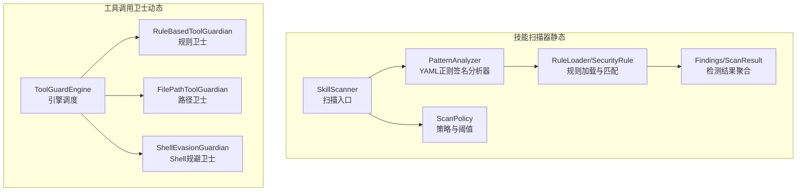
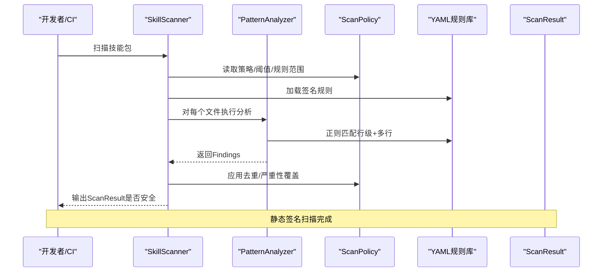
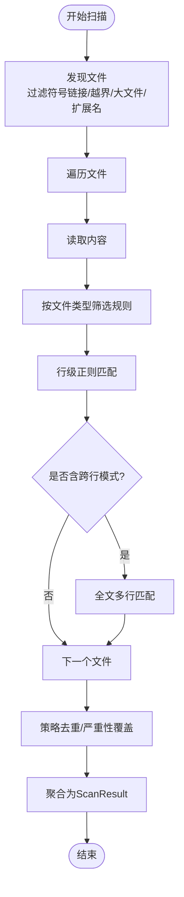
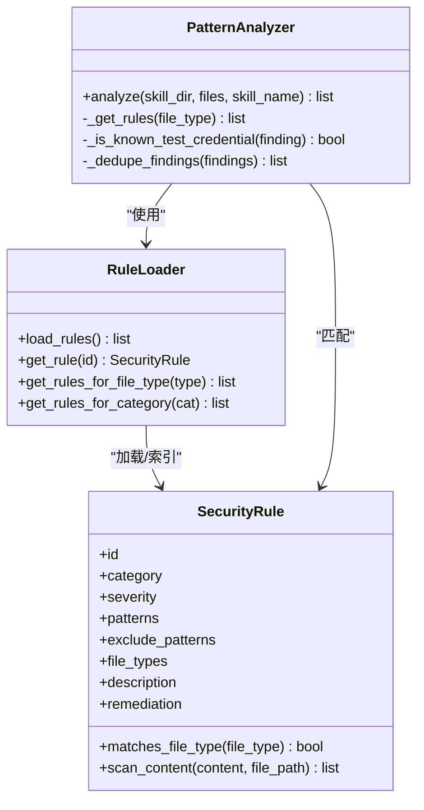
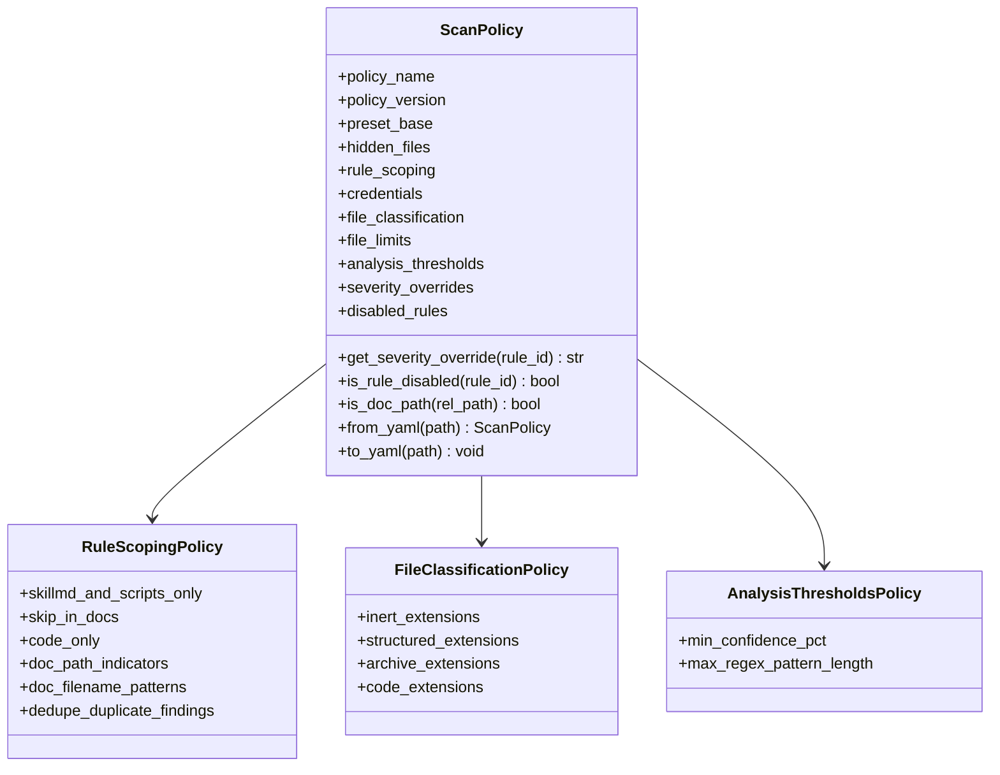
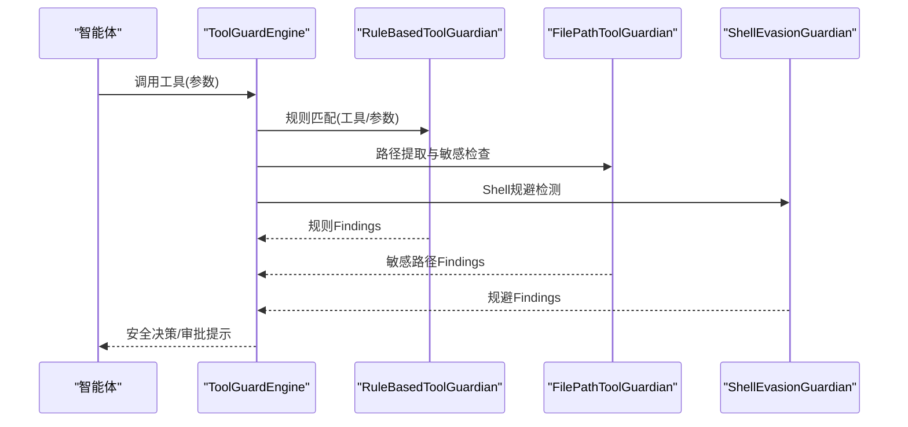
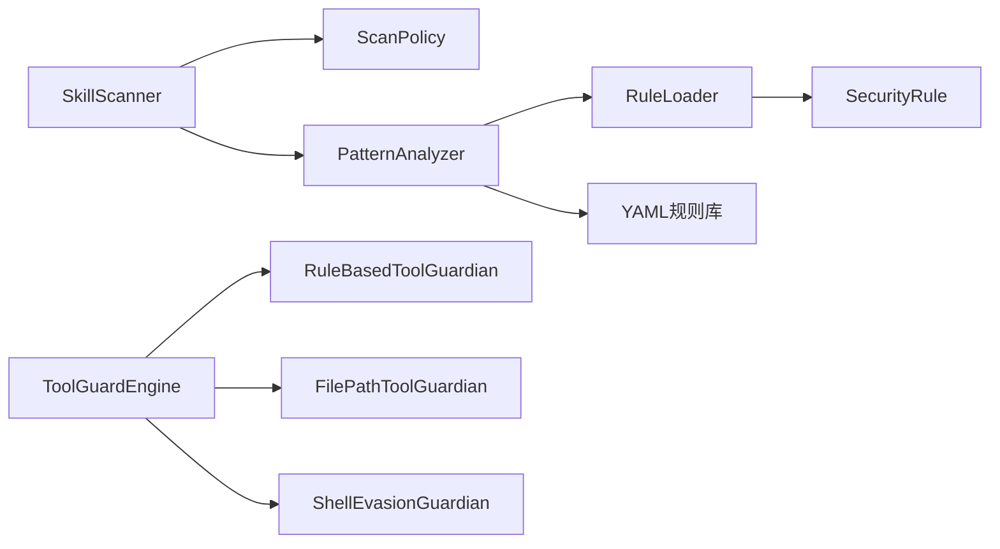

# 混淆技术检测

<cite>
**本文引用的文件**
- [scanner.py](file://src/qwenpaw/security/skill_scanner/scanner.py)
- [pattern_analyzer.py](file://src/qwenpaw/security/skill_scanner/analyzers/pattern_analyzer.py)
- [models.py](file://src/qwenpaw/security/skill_scanner/models.py)
- [scan_policy.py](file://src/qwenpaw/security/skill_scanner/scan_policy.py)
- [obfuscation.yaml](file://src/qwenpaw/security/skill_scanner/rules/signatures/obfuscation.yaml)
- [engine.py](file://src/qwenpaw/security/tool_guard/engine.py)
- [rule_guardian.py](file://src/qwenpaw/security/tool_guard/guardians/rule_guardian.py)
- [file_guardian.py](file://src/qwenpaw/security/tool_guard/guardians/file_guardian.py)
- [shell_evasion_guardian.py](file://src/qwenpaw/security/tool_guard/guardians/shell_evasion_guardian.py)
- [__init__.py](file://src/qwenpaw/security/tool_guard/guardians/__init__.py)
- [config.zh.md](file://website/public/docs/config.zh.md)
- [ShellEvasionSection.tsx](file://console/src/pages/Settings/Security/components/ShellEvasionSection.tsx)
</cite>

## 目录
1. [引言](#引言)
2. [项目结构](#项目结构)
3. [核心组件](#核心组件)
4. [架构总览](#架构总览)
5. [详细组件分析](#详细组件分析)
6. [依赖分析](#依赖分析)
7. [性能考虑](#性能考虑)
8. [故障排查指南](#故障排查指南)
9. [结论](#结论)
10. [附录](#附录)

## 引言
本文件面向QwenPaw的“混淆技术检测”能力，系统化阐述代码混淆与反检测技术的识别方法与工程实现。重点覆盖字符串编码（base64、十六进制）、控制流混淆、指令重排与动态加载等混淆手段的检测原理；归纳混淆特征模式（如base64解码执行链、大段十六进制块、XOR编码、二进制文件）；给出混淆分类体系、检测算法的性能优化与误报控制策略；并提供混淆工具识别、对抗性样本检测与混淆强度评估方法。文档同时结合项目现有技能扫描器与工具调用卫士两大防线，展示从静态签名到动态规避检测的综合防护思路。

## 项目结构
QwenPaw的安全子系统由“技能扫描器（静态）+ 工具调用卫士（动态）”构成，前者针对技能包内的源码与文档进行正则签名扫描，后者在运行期拦截危险命令与路径访问，二者共同抵御混淆与对抗性样本。

图示来源
- [scanner.py:76-319](file://src/qwenpaw/security/skill_scanner/scanner.py#L76-L319)
- [pattern_analyzer.py:236-393](file://src/qwenpaw/security/skill_scanner/analyzers/pattern_analyzer.py#L236-L393)
- [scan_policy.py:156-476](file://src/qwenpaw/security/skill_scanner/scan_policy.py#L156-L476)
- [engine.py:54-269](file://src/qwenpaw/security/tool_guard/engine.py#L54-L269)

章节来源
- [scanner.py:1-319](file://src/qwenpaw/security/skill_scanner/scanner.py#L1-L319)
- [engine.py:1-269](file://src/qwenpaw/security/tool_guard/engine.py#L1-L269)

## 核心组件
- 技能扫描器（SkillScanner）：遍历技能包文件，按策略与规则集执行分析器，汇总Findings并生成ScanResult。
- PatternAnalyzer：加载YAML签名规则，对文件内容进行行级与多行正则匹配，输出匹配结果。
- ScanPolicy：组织规则范围、文件分类、阈值与严重性覆盖，支持策略叠加与动态重载。
- ToolGuardEngine：在工具调用前执行多类卫士（规则、路径、Shell规避），阻断或警示潜在混淆与对抗行为。
- 规则与特征库：内置混淆特征（base64解码执行链、大段十六进制、XOR、二进制文件）与Shell规避模式。

章节来源
- [scanner.py:76-319](file://src/qwenpaw/security/skill_scanner/scanner.py#L76-L319)
- [pattern_analyzer.py:236-393](file://src/qwenpaw/security/skill_scanner/analyzers/pattern_analyzer.py#L236-L393)
- [scan_policy.py:156-476](file://src/qwenpaw/security/skill_scanner/scan_policy.py#L156-L476)
- [engine.py:54-269](file://src/qwenpaw/security/tool_guard/engine.py#L54-L269)

## 架构总览
下图展示“静态签名扫描 + 动态规避检测”的双层防护架构，以及关键数据模型与策略注入点。

图示来源
- [scanner.py:148-242](file://src/qwenpaw/security/skill_scanner/scanner.py#L148-L242)
- [pattern_analyzer.py:265-347](file://src/qwenpaw/security/skill_scanner/analyzers/pattern_analyzer.py#L265-L347)
- [scan_policy.py:156-476](file://src/qwenpaw/security/skill_scanner/scan_policy.py#L156-L476)

## 详细组件分析

### 组件A：技能扫描器与签名分析器
- 发现与过滤：递归发现文件，跳过符号链接、越界路径、大文件与归档/二进制扩展名，受策略限制。
- 分析流程：逐文件读取内容，按文件类型筛选规则，行级快速匹配，必要时多行回退，排除已知测试占位符，应用策略去重与严重性覆盖。
- 结果聚合：生成ScanResult，包含最高严重级别、是否安全、耗时与失败分析器列表。

图示来源
- [scanner.py:248-299](file://src/qwenpaw/security/skill_scanner/scanner.py#L248-L299)
- [pattern_analyzer.py:265-347](file://src/qwenpaw/security/skill_scanner/analyzers/pattern_analyzer.py#L265-L347)

章节来源
- [scanner.py:148-242](file://src/qwenpaw/security/skill_scanner/scanner.py#L148-L242)
- [pattern_analyzer.py:265-347](file://src/qwenpaw/security/skill_scanner/analyzers/pattern_analyzer.py#L265-L347)

### 组件B：混淆特征与规则体系
- 特征类别：字符串编码（base64解码执行链、十六进制大块、XOR）、二进制文件、Shell规避（命令替换、转义、注释脱钩、引号内换行等）。
- 规则格式：YAML条目包含id、category、severity、patterns/exclude_patterns、file_types、描述与修复建议。
- 内置混淆规则：见obfuscation.yaml，覆盖base64解码+执行链、大段十六进制、XOR与二进制文件等。

图示来源
- [pattern_analyzer.py:38-156](file://src/qwenpaw/security/skill_scanner/analyzers/pattern_analyzer.py#L38-L156)
- [pattern_analyzer.py:163-229](file://src/qwenpaw/security/skill_scanner/analyzers/pattern_analyzer.py#L163-L229)
- [pattern_analyzer.py:236-393](file://src/qwenpaw/security/skill_scanner/analyzers/pattern_analyzer.py#L236-L393)

章节来源
- [obfuscation.yaml:1-47](file://src/qwenpaw/security/skill_scanner/rules/signatures/obfuscation.yaml#L1-L47)
- [pattern_analyzer.py:38-156](file://src/qwenpaw/security/skill_scanner/analyzers/pattern_analyzer.py#L38-L156)

### 组件C：策略与阈值（ScanPolicy）
- 规则范围：支持按文件类型限定规则、文档路径排除、仅脚本生效规则、去重开关等。
- 文件分类：将扩展名归类为惰性/结构化/归档/可执行代码，影响扫描范围与性能。
- 阈值与覆盖：最大文件数/大小、正则长度上限、严重性覆盖、禁用规则集合。
- 动态重载：支持从YAML加载策略并与默认策略合并，便于组织定制。

图示来源
- [scan_policy.py:156-476](file://src/qwenpaw/security/skill_scanner/scan_policy.py#L156-L476)

章节来源
- [scan_policy.py:156-476](file://src/qwenpaw/security/skill_scanner/scan_policy.py#L156-L476)

### 组件D：工具调用卫士（动态检测）
- 规则卫士：对工具参数进行正则匹配，支持自定义规则与禁用规则，增强对Shell命令管道、下载后直执行等场景的识别。
- 路径卫士：识别敏感文件/目录，解析Shell命令中的重定向与路径，阻断越权访问。
- Shell规避卫士：检测命令替换、ANSI-C/本地化引号、反斜杠转义空白/操作符、换行隐藏、注释引号脱钩、引号内换行+注释剥离等规避手法。
- 引擎：统一注册与调度多个卫士，支持按配置启用/禁用检查项，自动拒绝命中特定规则的调用。

图示来源
- [engine.py:200-257](file://src/qwenpaw/security/tool_guard/engine.py#L200-L257)
- [rule_guardian.py:608-757](file://src/qwenpaw/security/tool_guard/guardians/rule_guardian.py#L608-L757)
- [file_guardian.py:449-500](file://src/qwenpaw/security/tool_guard/guardians/file_guardian.py#L449-L500)
- [shell_evasion_guardian.py:555-592](file://src/qwenpaw/security/tool_guard/guardians/shell_evasion_guardian.py#L555-L592)

章节来源
- [engine.py:54-269](file://src/qwenpaw/security/tool_guard/engine.py#L54-L269)
- [rule_guardian.py:559-757](file://src/qwenpaw/security/tool_guard/guardians/rule_guardian.py#L559-L757)
- [file_guardian.py:301-500](file://src/qwenpaw/security/tool_guard/guardians/file_guardian.py#L301-L500)
- [shell_evasion_guardian.py:539-592](file://src/qwenpaw/security/tool_guard/guardians/shell_evasion_guardian.py#L539-L592)

### 组件E：混淆特征与检测要点
- 字符串编码
  - base64解码+执行链：优先匹配“解码函数 + 执行函数”的短距离组合，避免泛化长blob误报。
  - 十六进制大块：检测连续出现的\xNN或0xNN序列，排除常见库表（如JS字符映射）。
  - XOR：检测^0xNN或xor上下文，常与解码/执行组合出现。
- 二进制文件：对binary类型文件直接标记高危，要求移除。
- Shell规避：命令替换、ANSI-C/locale引号、反斜杠转义、换行隐藏、注释引号脱钩、引号内换行+注释剥离等。
- 路径与权限：对敏感目录（含兼容历史目录）与越权路径进行阻断。

章节来源
- [obfuscation.yaml:4-46](file://src/qwenpaw/security/skill_scanner/rules/signatures/obfuscation.yaml#L4-L46)
- [shell_evasion_guardian.py:26-593](file://src/qwenpaw/security/tool_guard/guardians/shell_evasion_guardian.py#L26-L593)
- [file_guardian.py:301-500](file://src/qwenpaw/security/tool_guard/guardians/file_guardian.py#L301-L500)

## 依赖分析
- 组件耦合
  - SkillScanner依赖ScanPolicy与PatternAnalyzer；PatternAnalyzer依赖RuleLoader与SecurityRule；二者均依赖YAML规则库。
  - ToolGuardEngine依赖多个Guardian实现，彼此低耦合，便于扩展新检测引擎。
- 外部集成
  - YAML规则文件作为特征库；策略文件支持组织级定制；前端界面支持开启/关闭Shell规避检查项。
- 循环依赖
  - 当前模块间无循环导入；规则加载与匹配在分析器内部完成，避免跨模块循环。

图示来源
- [scanner.py:100-134](file://src/qwenpaw/security/skill_scanner/scanner.py#L100-L134)
- [pattern_analyzer.py:236-393](file://src/qwenpaw/security/skill_scanner/analyzers/pattern_analyzer.py#L236-L393)
- [engine.py:85-110](file://src/qwenpaw/security/tool_guard/engine.py#L85-L110)

章节来源
- [scanner.py:100-134](file://src/qwenpaw/security/skill_scanner/scanner.py#L100-L134)
- [engine.py:85-110](file://src/qwenpaw/security/tool_guard/engine.py#L85-L110)

## 性能考虑
- 快速路径
  - 行级正则优先，仅在检测到跨行意图时才进行全文多行匹配，降低CPU与内存压力。
  - 文件发现阶段即按扩展名与大小过滤，避免加载无关内容。
- 编译与缓存
  - 规则正则预编译，规则按文件类型缓存，减少重复编译成本。
  - 策略中的正则长度上限与最大文件大小限制，防止异常输入导致资源耗尽。
- 去重与收敛
  - 策略支持去重，避免同一规则在同一文件/行重复计分；规则覆盖可抑制噪声。
- 动态卫士
  - Shell规避卫士按需启用检查项，减少无效分支；路径卫士对可疑token进行启发式判定，避免昂贵解析。

章节来源
- [pattern_analyzer.py:93-155](file://src/qwenpaw/security/skill_scanner/analyzers/pattern_analyzer.py#L93-L155)
- [scanner.py:31-68](file://src/qwenpaw/security/skill_scanner/scanner.py#L31-L68)
- [scan_policy.py:36-67](file://src/qwenpaw/security/skill_scanner/scan_policy.py#L36-L67)
- [shell_evasion_guardian.py:517-537](file://src/qwenpaw/security/tool_guard/guardians/shell_evasion_guardian.py#L517-L537)

## 故障排查指南
- 扫描未触发或结果为空
  - 检查策略中的文件分类与扩展名过滤，确认目标文件未被跳过。
  - 确认规则是否被禁用或严重性被覆盖。
- 误报过高
  - 使用exclude_patterns排除常见库表（如JS字符映射）。
  - 在策略中启用去重与严重性覆盖，调整阈值。
- 规则加载失败
  - 检查YAML语法与字段完整性；关注日志中“Bad regex”警告。
- 动态卫士误判
  - 在配置中按需启用/禁用Shell规避检查项；对路径卫士的敏感目录进行校准。
- 配置生效
  - 通过配置文件覆盖默认策略；前端界面可直观调整Shell规避检查项。

章节来源
- [obfuscation.yaml:21-27](file://src/qwenpaw/security/skill_scanner/rules/signatures/obfuscation.yaml#L21-L27)
- [scan_policy.py:261-304](file://src/qwenpaw/security/skill_scanner/scan_policy.py#L261-L304)
- [config.zh.md:222-242](file://website/public/docs/config.zh.md#L222-L242)
- [ShellEvasionSection.tsx:1-44](file://console/src/pages/Settings/Security/components/ShellEvasionSection.tsx#L1-L44)

## 结论
QwenPaw通过“静态签名扫描 + 动态规避检测”的双轨机制，有效覆盖字符串编码、十六进制与XOR等常见混淆特征，并对Shell规避与敏感路径访问形成纵深防御。策略化设计使组织能够灵活裁剪规则、阈值与严重性，兼顾检测精度与性能。建议持续维护规则库与策略，结合实际误报反馈迭代优化，以提升对新型混淆与对抗性样本的适应能力。

## 附录

### 混淆技术分类与检测要点
- 字符串编码
  - base64：优先检测“解码+执行”链，限制跨度，避免长blob误报。
  - 十六进制：检测连续\xNN/0xNN序列，排除常见库表。
  - XOR：检测^0xNN或xor上下文，关注与解码/执行组合。
- 控制流混淆
  - 通过规则匹配“解码+执行”链与可疑控制流模式，结合策略排除文档与测试场景。
- 指令重排与动态加载
  - 动态侧通过Shell规避卫士识别命令替换、转义与隐藏命令，路径卫士阻断越权路径。
- 对抗性样本
  - 利用策略阈值与严重性覆盖抑制噪声；前端可视化开关便于快速定位问题。

章节来源
- [obfuscation.yaml:4-46](file://src/qwenpaw/security/skill_scanner/rules/signatures/obfuscation.yaml#L4-L46)
- [shell_evasion_guardian.py:115-593](file://src/qwenpaw/security/tool_guard/guardians/shell_evasion_guardian.py#L115-L593)
- [file_guardian.py:449-500](file://src/qwenpaw/security/tool_guard/guardians/file_guardian.py#L449-L500)