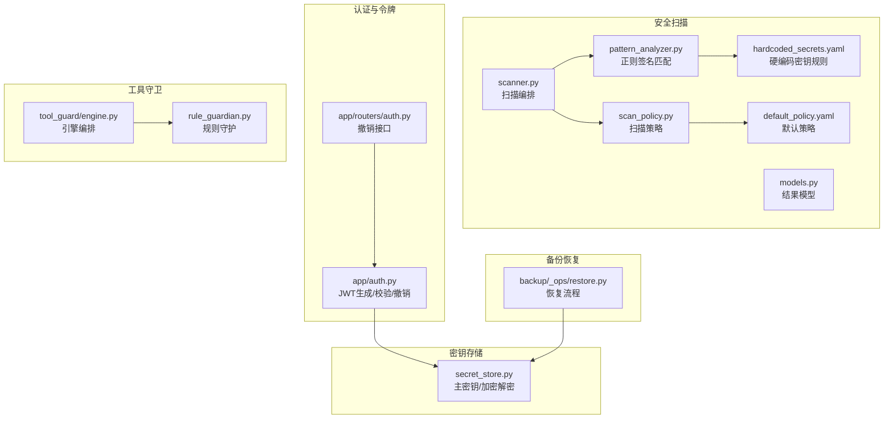
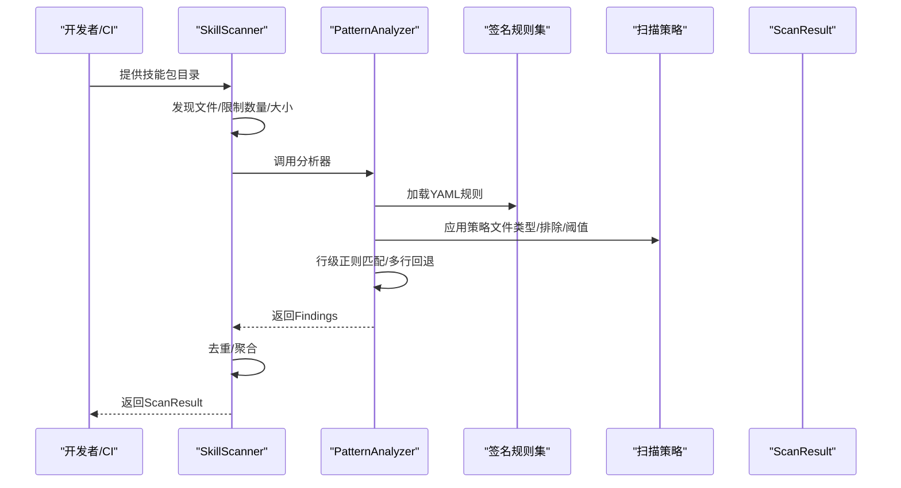
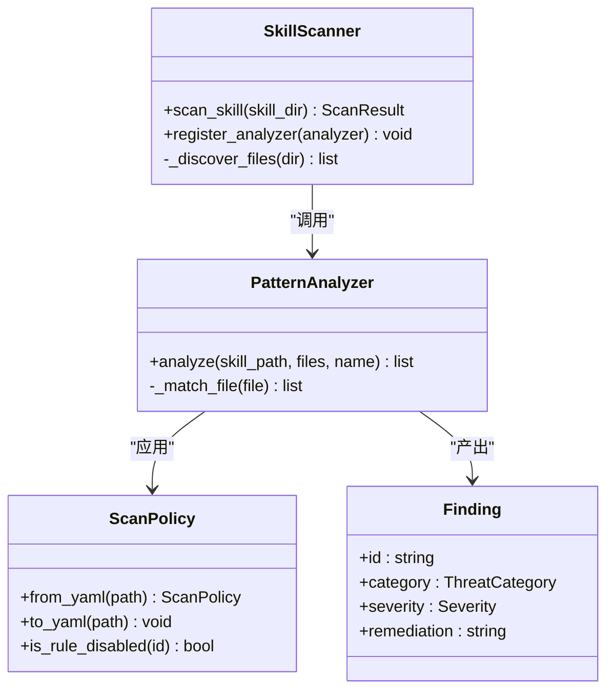
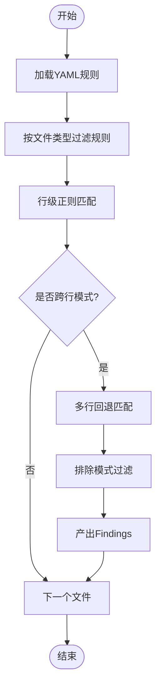
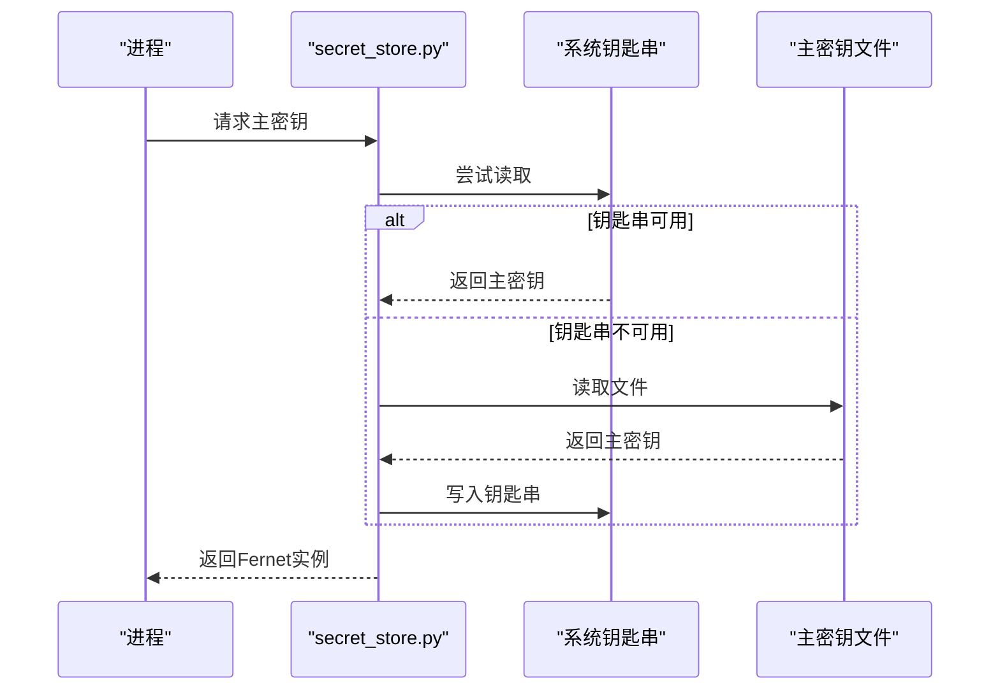
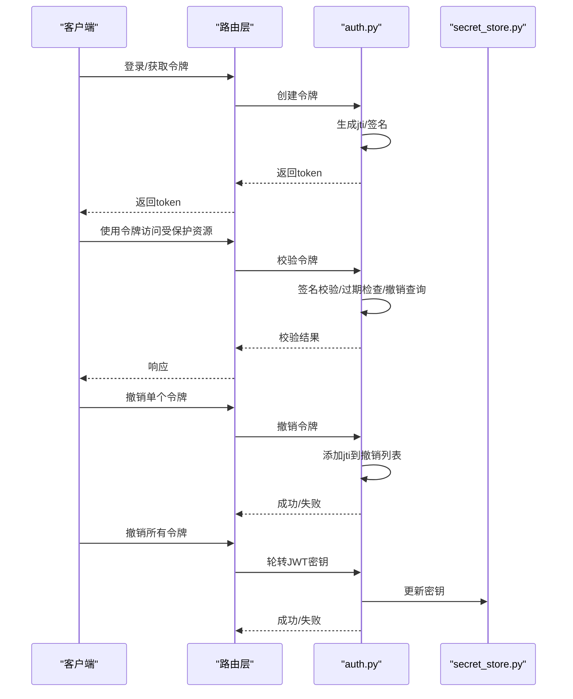
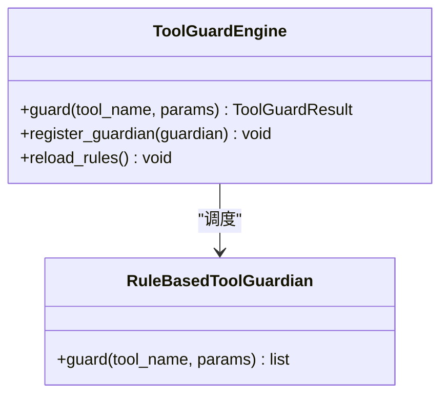
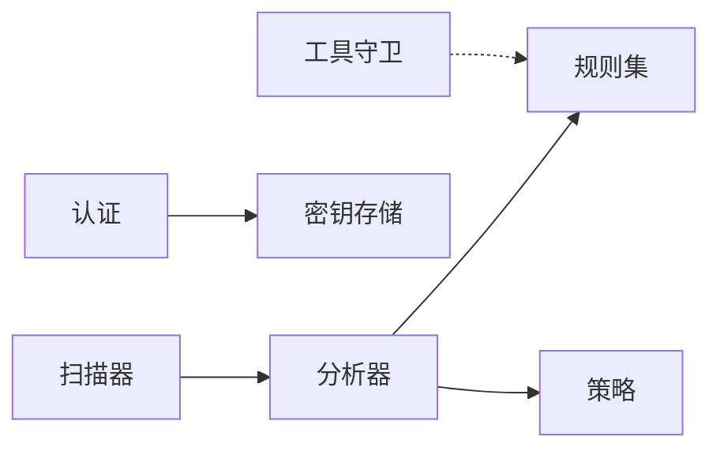

# 硬编码密钥识别

<cite>
**本文引用的文件**
- [src/qwenpaw/security/skill_scanner/scanner.py](file://src/qwenpaw/security/skill_scanner/scanner.py)
- [src/qwenpaw/security/skill_scanner/analyzers/pattern_analyzer.py](file://src/qwenpaw/security/skill_scanner/analyzers/pattern_analyzer.py)
- [src/qwenpaw/security/skill_scanner/models.py](file://src/qwenpaw/security/skill_scanner/models.py)
- [src/qwenpaw/security/skill_scanner/scan_policy.py](file://src/qwenpaw/security/skill_scanner/scan_policy.py)
- [src/qwenpaw/security/skill_scanner/data/default_policy.yaml](file://src/qwenpaw/security/skill_scanner/data/default_policy.yaml)
- [src/qwenpaw/security/skill_scanner/rules/signatures/hardcoded_secrets.yaml](file://src/qwenpaw/security/skill_scanner/rules/signatures/hardcoded_secrets.yaml)
- [src/qwenpaw/security/secret_store.py](file://src/qwenpaw/security/secret_store.py)
- [src/qwenpaw/app/auth.py](file://src/qwenpaw/app/auth.py)
- [src/qwenpaw/app/routers/auth.py](file://src/qwenpaw/app/routers/auth.py)
- [src/qwenpaw/security/tool_guard/engine.py](file://src/qwenpaw/security/tool_guard/engine.py)
- [src/qwenpaw/security/tool_guard/guardians/rule_guardian.py](file://src/qwenpaw/security/tool_guard/guardians/rule_guardian.py)
- [website/public/docs/security.en.md](file://website/public/docs/security.en.md)
- [website/public/docs/api-tutorial.en.md](file://website/public/docs/api-tutorial.en.md)
- [src/qwenpaw/backup/_ops/restore.py](file://src/qwenpaw/backup/_ops/restore.py)
</cite>

## 目录
1. [简介](#简介)
2. [项目结构](#项目结构)
3. [核心组件](#核心组件)
4. [架构总览](#架构总览)
5. [详细组件分析](#详细组件分析)
6. [依赖分析](#依赖分析)
7. [性能考虑](#性能考虑)
8. [故障排查指南](#故障排查指南)
9. [结论](#结论)
10. [附录](#附录)

## 简介
本文件面向QwenPaw的“硬编码密钥识别”能力，系统性阐述其检测原理、识别算法与工程实现，覆盖API密钥、数据库密码、令牌与证书等敏感信息的自动发现机制；并提供误报降低、检测精度优化与密钥泄露应急响应流程的实操建议。文档同时梳理了安全扫描器、密钥存储与工具调用守卫等关键模块之间的协作关系，帮助读者从架构到落地形成完整认知。

## 项目结构
围绕硬编码密钥识别，相关代码主要分布在以下模块：
- 安全扫描器：负责扫描技能包、加载签名规则、执行正则匹配与去重聚合
- 规则与策略：内置签名规则集与可定制扫描策略
- 密钥存储：提供主密钥管理与加密/解密能力，避免明文落盘
- 认证与令牌：提供JWT生成/校验、令牌撤销与轮转机制
- 工具守卫：对工具调用参数进行规则化安全检查
- 备份恢复：涉及密钥主密钥与机密数据的备份与恢复流程

**图表来源**
- [src/qwenpaw/security/skill_scanner/scanner.py:76-242](file://src/qwenpaw/security/skill_scanner/scanner.py#L76-L242)
- [src/qwenpaw/security/skill_scanner/analyzers/pattern_analyzer.py:236-330](file://src/qwenpaw/security/skill_scanner/analyzers/pattern_analyzer.py#L236-L330)
- [src/qwenpaw/security/skill_scanner/models.py:168-234](file://src/qwenpaw/security/skill_scanner/models.py#L168-L234)
- [src/qwenpaw/security/skill_scanner/scan_policy.py:156-397](file://src/qwenpaw/security/skill_scanner/scan_policy.py#L156-L397)
- [src/qwenpaw/security/skill_scanner/data/default_policy.yaml:1-243](file://src/qwenpaw/security/skill_scanner/data/default_policy.yaml#L1-L243)
- [src/qwenpaw/security/skill_scanner/rules/signatures/hardcoded_secrets.yaml:1-150](file://src/qwenpaw/security/skill_scanner/rules/signatures/hardcoded_secrets.yaml#L1-L150)
- [src/qwenpaw/security/secret_store.py:234-327](file://src/qwenpaw/security/secret_store.py#L234-L327)
- [src/qwenpaw/app/auth.py:126-198](file://src/qwenpaw/app/auth.py#L126-L198)
- [src/qwenpaw/app/routers/auth.py:206-287](file://src/qwenpaw/app/routers/auth.py#L206-L287)
- [src/qwenpaw/security/tool_guard/engine.py:54-257](file://src/qwenpaw/security/tool_guard/engine.py#L54-L257)
- [src/qwenpaw/security/tool_guard/guardians/rule_guardian.py:1-200](file://src/qwenpaw/security/tool_guard/guardians/rule_guardian.py#L1-L200)
- [src/qwenpaw/backup/_ops/restore.py:178-196](file://src/qwenpaw/backup/_ops/restore.py#L178-L196)

**章节来源**
- [src/qwenpaw/security/skill_scanner/scanner.py:76-242](file://src/qwenpaw/security/skill_scanner/scanner.py#L76-L242)
- [src/qwenpaw/security/skill_scanner/analyzers/pattern_analyzer.py:236-330](file://src/qwenpaw/security/skill_scanner/analyzers/pattern_analyzer.py#L236-L330)
- [src/qwenpaw/security/skill_scanner/models.py:168-234](file://src/qwenpaw/security/skill_scanner/models.py#L168-L234)
- [src/qwenpaw/security/skill_scanner/scan_policy.py:156-397](file://src/qwenpaw/security/skill_scanner/scan_policy.py#L156-L397)
- [src/qwenpaw/security/skill_scanner/data/default_policy.yaml:1-243](file://src/qwenpaw/security/skill_scanner/data/default_policy.yaml#L1-L243)
- [src/qwenpaw/security/skill_scanner/rules/signatures/hardcoded_secrets.yaml:1-150](file://src/qwenpaw/security/skill_scanner/rules/signatures/hardcoded_secrets.yaml#L1-L150)
- [src/qwenpaw/security/secret_store.py:234-327](file://src/qwenpaw/security/secret_store.py#L234-L327)
- [src/qwenpaw/app/auth.py:126-198](file://src/qwenpaw/app/auth.py#L126-L198)
- [src/qwenpaw/app/routers/auth.py:206-287](file://src/qwenpaw/app/routers/auth.py#L206-L287)
- [src/qwenpaw/security/tool_guard/engine.py:54-257](file://src/qwenpaw/security/tool_guard/engine.py#L54-L257)
- [src/qwenpaw/security/tool_guard/guardians/rule_guardian.py:1-200](file://src/qwenpaw/security/tool_guard/guardians/rule_guardian.py#L1-L200)
- [src/qwenpaw/backup/_ops/restore.py:178-196](file://src/qwenpaw/backup/_ops/restore.py#L178-L196)

## 核心组件
- 扫描编排器：遍历技能包文件、选择分析器、收集并聚合结果，支持去重与失败记录
- 正则签名分析器：加载YAML规则，按行快速匹配，必要时启用多行匹配
- 结果模型：统一表示严重级别、威胁类别、修复建议与元数据
- 扫描策略：隐藏文件白名单、规则范围、凭证占位符、文件分类与阈值
- 硬编码密钥规则：针对AWS、Stripe、Google API、GitHub、JWT、私钥、密码变量、连接串等的签名
- 密钥存储：主密钥管理（系统钥匙串/文件）、Fernet加解密、字段级加密/解密
- 认证与令牌：JWT生成/校验、撤销列表、轮转（撤销所有令牌）
- 工具守卫：对工具调用参数进行规则化检查，支持路径边界与危险命令识别
- 备份恢复：密钥主密钥冲突处理与恢复后主密钥同步

**章节来源**
- [src/qwenpaw/security/skill_scanner/scanner.py:76-242](file://src/qwenpaw/security/skill_scanner/scanner.py#L76-L242)
- [src/qwenpaw/security/skill_scanner/analyzers/pattern_analyzer.py:236-330](file://src/qwenpaw/security/skill_scanner/analyzers/pattern_analyzer.py#L236-L330)
- [src/qwenpaw/security/skill_scanner/models.py:168-234](file://src/qwenpaw/security/skill_scanner/models.py#L168-L234)
- [src/qwenpaw/security/skill_scanner/scan_policy.py:156-397](file://src/qwenpaw/security/skill_scanner/scan_policy.py#L156-L397)
- [src/qwenpaw/security/skill_scanner/rules/signatures/hardcoded_secrets.yaml:1-150](file://src/qwenpaw/security/skill_scanner/rules/signatures/hardcoded_secrets.yaml#L1-L150)
- [src/qwenpaw/security/secret_store.py:234-327](file://src/qwenpaw/security/secret_store.py#L234-L327)
- [src/qwenpaw/app/auth.py:126-198](file://src/qwenpaw/app/auth.py#L126-L198)
- [src/qwenpaw/security/tool_guard/engine.py:54-257](file://src/qwenpaw/security/tool_guard/engine.py#L54-L257)

## 架构总览
硬编码密钥识别以“扫描器 + 规则 + 策略”的组合为核心，贯穿代码静态扫描与运行时安全控制：

**图表来源**
- [src/qwenpaw/security/skill_scanner/scanner.py:148-242](file://src/qwenpaw/security/skill_scanner/scanner.py#L148-L242)
- [src/qwenpaw/security/skill_scanner/analyzers/pattern_analyzer.py:236-330](file://src/qwenpaw/security/skill_scanner/analyzers/pattern_analyzer.py#L236-L330)
- [src/qwenpaw/security/skill_scanner/scan_policy.py:156-397](file://src/qwenpaw/security/skill_scanner/scan_policy.py#L156-L397)
- [src/qwenpaw/security/skill_scanner/models.py:168-234](file://src/qwenpaw/security/skill_scanner/models.py#L168-L234)

## 详细组件分析

### 扫描器与分析器
- 扫描器职责：文件发现、限流、分析器编排、结果聚合与去重
- 分析器职责：加载规则、按文件类型筛选、正则匹配、排除模式、多行回退
- 关键点：默认仅启用基于YAML签名的正则分析器；支持策略驱动的文件分类与阈值

**图表来源**
- [src/qwenpaw/security/skill_scanner/scanner.py:76-242](file://src/qwenpaw/security/skill_scanner/scanner.py#L76-L242)
- [src/qwenpaw/security/skill_scanner/analyzers/pattern_analyzer.py:236-330](file://src/qwenpaw/security/skill_scanner/analyzers/pattern_analyzer.py#L236-L330)
- [src/qwenpaw/security/skill_scanner/models.py:129-161](file://src/qwenpaw/security/skill_scanner/models.py#L129-L161)
- [src/qwenpaw/security/skill_scanner/scan_policy.py:156-397](file://src/qwenpaw/security/skill_scanner/scan_policy.py#L156-L397)

**章节来源**
- [src/qwenpaw/security/skill_scanner/scanner.py:76-242](file://src/qwenpaw/security/skill_scanner/scanner.py#L76-L242)
- [src/qwenpaw/security/skill_scanner/analyzers/pattern_analyzer.py:236-330](file://src/qwenpaw/security/skill_scanner/analyzers/pattern_analyzer.py#L236-L330)
- [src/qwenpaw/security/skill_scanner/models.py:129-161](file://src/qwenpaw/security/skill_scanner/models.py#L129-L161)
- [src/qwenpaw/security/skill_scanner/scan_policy.py:156-397](file://src/qwenpaw/security/skill_scanner/scan_policy.py#L156-L397)

### 硬编码密钥规则与模式匹配
- 规则来源：YAML签名文件，定义威胁类别、严重级别、匹配模式、排除模式、文件类型
- 典型规则类别：AWS密钥、Stripe密钥、Google API密钥、GitHub令牌、JWT令牌、私钥块、密码变量、连接串
- 匹配策略：优先行级匹配，对跨行模式启用多行回退；结合排除模式降低误报
- 策略联动：扫描策略可限定规则适用范围、文档路径排除、去重开关等

**图表来源**
- [src/qwenpaw/security/skill_scanner/analyzers/pattern_analyzer.py:236-330](file://src/qwenpaw/security/skill_scanner/analyzers/pattern_analyzer.py#L236-L330)
- [src/qwenpaw/security/skill_scanner/rules/signatures/hardcoded_secrets.yaml:1-150](file://src/qwenpaw/security/skill_scanner/rules/signatures/hardcoded_secrets.yaml#L1-L150)
- [src/qwenpaw/security/skill_scanner/scan_policy.py:156-397](file://src/qwenpaw/security/skill_scanner/scan_policy.py#L156-L397)

**章节来源**
- [src/qwenpaw/security/skill_scanner/rules/signatures/hardcoded_secrets.yaml:1-150](file://src/qwenpaw/security/skill_scanner/rules/signatures/hardcoded_secrets.yaml#L1-L150)
- [src/qwenpaw/security/skill_scanner/analyzers/pattern_analyzer.py:236-330](file://src/qwenpaw/security/skill_scanner/analyzers/pattern_analyzer.py#L236-L330)
- [website/public/docs/security.en.md:468-517](file://website/public/docs/security.en.md#L468-L517)

### 密钥存储与安全存储
- 主密钥管理：优先使用系统钥匙串，失败时回退至SECRET_DIR下的只读主密钥文件
- 加密算法：Fernet（AES-128-CBC + HMAC-SHA256），前缀标识加密值
- 字段级加密：对提供者配置与认证数据中的敏感字段进行透明加解密
- 恢复同步：备份恢复后可重新加载主密钥，确保进程与钥匙串一致

**图表来源**
- [src/qwenpaw/security/secret_store.py:234-268](file://src/qwenpaw/security/secret_store.py#L234-L268)
- [src/qwenpaw/backup/_ops/restore.py:178-196](file://src/qwenpaw/backup/_ops/restore.py#L178-L196)

**章节来源**
- [src/qwenpaw/security/secret_store.py:234-327](file://src/qwenpaw/security/secret_store.py#L234-L327)
- [src/qwenpaw/backup/_ops/restore.py:178-196](file://src/qwenpaw/backup/_ops/restore.py#L178-L196)

### 认证与令牌撤销
- 令牌生成：HMAC-SHA256签名，携带jti（用于撤销）与exp（过期时间）
- 令牌验证：签名校验、过期检查、撤销列表查询
- 撤销机制：单个令牌撤销（基于jti）与全部令牌撤销（轮转JWT密钥）

**图表来源**
- [src/qwenpaw/app/auth.py:126-198](file://src/qwenpaw/app/auth.py#L126-L198)
- [src/qwenpaw/app/routers/auth.py:206-287](file://src/qwenpaw/app/routers/auth.py#L206-L287)
- [src/qwenpaw/security/secret_store.py:234-268](file://src/qwenpaw/security/secret_store.py#L234-L268)

**章节来源**
- [src/qwenpaw/app/auth.py:126-198](file://src/qwenpaw/app/auth.py#L126-L198)
- [src/qwenpaw/app/routers/auth.py:206-287](file://src/qwenpaw/app/routers/auth.py#L206-L287)
- [website/public/docs/api-tutorial.en.md:771-854](file://website/public/docs/api-tutorial.en.md#L771-L854)

### 工具调用守卫
- 引擎：注册并调度各类守护者（规则、路径、逃逸检测等）
- 规则守护：对工具参数字符串进行正则匹配，识别危险命令与越界路径
- 集成：支持按工具/参数维度启用/禁用，支持自动拒绝规则

**图表来源**
- [src/qwenpaw/security/tool_guard/engine.py:54-257](file://src/qwenpaw/security/tool_guard/engine.py#L54-L257)
- [src/qwenpaw/security/tool_guard/guardians/rule_guardian.py:1-200](file://src/qwenpaw/security/tool_guard/guardians/rule_guardian.py#L1-L200)

**章节来源**
- [src/qwenpaw/security/tool_guard/engine.py:54-257](file://src/qwenpaw/security/tool_guard/engine.py#L54-L257)
- [src/qwenpaw/security/tool_guard/guardians/rule_guardian.py:1-200](file://src/qwenpaw/security/tool_guard/guardians/rule_guardian.py#L1-L200)

## 依赖分析
- 组件耦合
  - 扫描器与分析器：强内聚，分析器依赖策略与规则
  - 密钥存储与认证：弱耦合，认证模块通过密钥存储进行字段级加解密
  - 工具守卫与扫描器：独立模块，分别面向运行时与静态扫描
- 外部依赖
  - 正则库、YAML解析、系统钥匙串（可选）、加密库（Fernet）
- 循环依赖
  - 未见循环导入；模块间通过函数/类接口交互

**图表来源**
- [src/qwenpaw/security/skill_scanner/scanner.py:76-242](file://src/qwenpaw/security/skill_scanner/scanner.py#L76-L242)
- [src/qwenpaw/security/skill_scanner/analyzers/pattern_analyzer.py:236-330](file://src/qwenpaw/security/skill_scanner/analyzers/pattern_analyzer.py#L236-L330)
- [src/qwenpaw/security/secret_store.py:234-327](file://src/qwenpaw/security/secret_store.py#L234-L327)
- [src/qwenpaw/security/tool_guard/engine.py:54-257](file://src/qwenpaw/security/tool_guard/engine.py#L54-L257)

**章节来源**
- [src/qwenpaw/security/skill_scanner/scanner.py:76-242](file://src/qwenpaw/security/skill_scanner/scanner.py#L76-L242)
- [src/qwenpaw/security/skill_scanner/analyzers/pattern_analyzer.py:236-330](file://src/qwenpaw/security/skill_scanner/analyzers/pattern_analyzer.py#L236-L330)
- [src/qwenpaw/security/secret_store.py:234-327](file://src/qwenpaw/security/secret_store.py#L234-L327)
- [src/qwenpaw/security/tool_guard/engine.py:54-257](file://src/qwenpaw/security/tool_guard/engine.py#L54-L257)

## 性能考虑
- 文件发现与限制：通过最大文件数与单文件大小阈值控制扫描规模
- 正则匹配优化：行级快速匹配优先，跨行模式按需启用；策略限制规则适用范围
- 缓存与懒加载：主密钥缓存、Fernet实例缓存；延迟初始化钥匙串访问
- 去重与失败记录：避免重复告警，记录失败分析器便于定位问题

**章节来源**
- [src/qwenpaw/security/skill_scanner/scanner.py:70-134](file://src/qwenpaw/security/skill_scanner/scanner.py#L70-L134)
- [src/qwenpaw/security/skill_scanner/analyzers/pattern_analyzer.py:236-330](file://src/qwenpaw/security/skill_scanner/analyzers/pattern_analyzer.py#L236-L330)
- [src/qwenpaw/security/secret_store.py:276-290](file://src/qwenpaw/security/secret_store.py#L276-L290)

## 故障排查指南
- 扫描器异常
  - 现象：某分析器失败导致整体扫描中断
  - 排查：查看失败记录与日志，确认规则/策略配置是否正确
- 正则规则无效
  - 现象：规则未生效或误报过多
  - 排查：检查规则长度上限、排除模式、文件类型限定；参考默认策略
- 密钥存储不可用
  - 现象：无法读取/写入系统钥匙串，主密钥文件损坏
  - 排查：确认容器/CI环境屏蔽钥匙串；检查主密钥文件权限与长度；必要时重新生成
- 令牌撤销不生效
  - 现象：撤销单个令牌后仍可使用
  - 排查：确认jti提取与撤销列表更新；检查过期清理逻辑；必要时轮转JWT密钥
- 工具调用被拒
  - 现象：合法命令被误判
  - 排查：调整规则/排除模式；确认工具/参数维度的守护范围

**章节来源**
- [src/qwenpaw/security/skill_scanner/scanner.py:190-213](file://src/qwenpaw/security/skill_scanner/scanner.py#L190-L213)
- [src/qwenpaw/security/skill_scanner/scan_policy.py:49-67](file://src/qwenpaw/security/skill_scanner/scan_policy.py#L49-L67)
- [src/qwenpaw/security/secret_store.py:118-188](file://src/qwenpaw/security/secret_store.py#L118-L188)
- [src/qwenpaw/app/auth.py:498-559](file://src/qwenpaw/app/auth.py#L498-L559)
- [src/qwenpaw/security/tool_guard/engine.py:200-257](file://src/qwenpaw/security/tool_guard/engine.py#L200-L257)

## 结论
QwenPaw的硬编码密钥识别以“YAML签名 + 扫描策略”的方式实现了对常见敏感信息的自动化发现，并通过密钥存储与令牌撤销机制强化了运行时安全。建议在组织内结合默认策略与自定义规则持续优化误报率，配合备份恢复流程保障密钥主密钥的一致性，形成从静态扫描到动态守卫的闭环。

## 附录
- 最佳实践
  - 使用环境变量或密钥管理系统替代硬编码
  - 对数据库连接串移除凭据，改用连接池与凭据注入
  - 定期轮转令牌与密钥，缩短有效期
  - 在CI中启用扫描器，将高危规则设为阻断项
- 检测精度优化
  - 合理设置排除模式与文档路径规则，减少误报
  - 限定规则适用文件类型，提升性能与准确性
  - 使用策略去重与阈值控制，避免噪声
- 误报减少
  - 为占位符与示例文本建立排除模式
  - 通过策略允许特定文档路径的规则放宽
- 密钥管理与轮换
  - 使用密钥存储进行字段级加密
  - 令牌撤销采用单个撤销或轮转JWT密钥两种策略
- 泄露应急响应
  - 单个令牌泄露：撤销该令牌
  - 大范围泄露：轮转JWT密钥并撤销所有令牌
  - 备份恢复：确保主密钥同步，避免凭据不可解

**章节来源**
- [website/public/docs/security.en.md:468-517](file://website/public/docs/security.en.md#L468-L517)
- [website/public/docs/api-tutorial.en.md:771-854](file://website/public/docs/api-tutorial.en.md#L771-L854)
- [src/qwenpaw/security/secret_store.py:234-327](file://src/qwenpaw/security/secret_store.py#L234-L327)
- [src/qwenpaw/app/auth.py:535-559](file://src/qwenpaw/app/auth.py#L535-L559)