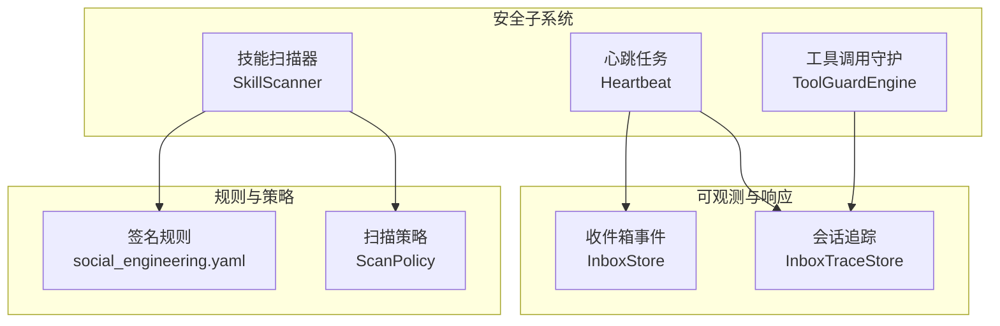
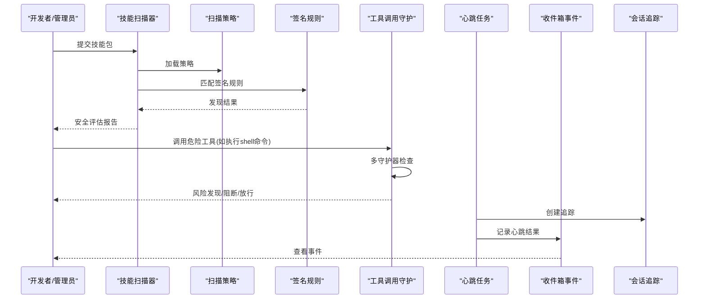
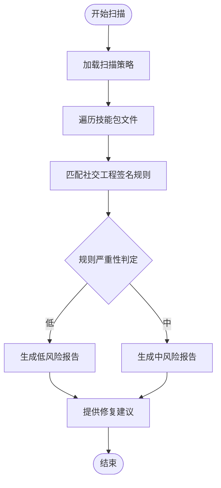
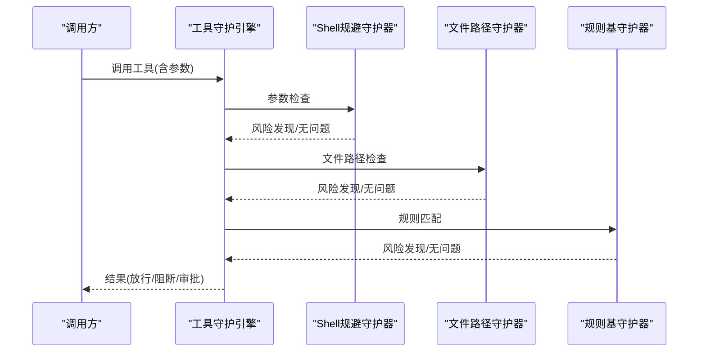
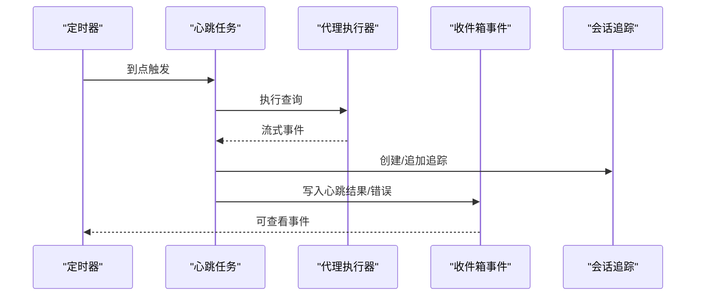
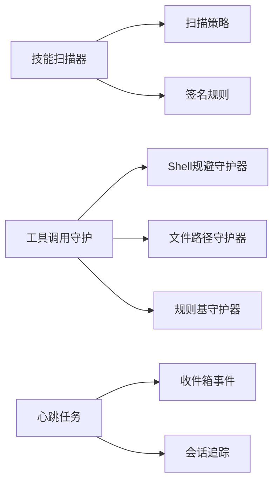

# 社交工程识别

<cite>
**本文引用的文件**
- [src/qwenpaw/security/__init__.py](file://src/qwenpaw/security/__init__.py)
- [src/qwenpaw/security/skill_scanner/scanner.py](file://src/qwenpaw/security/skill_scanner/scanner.py)
- [src/qwenpaw/security/skill_scanner/analyzers/pattern_analyzer.py](file://src/qwenpaw/security/skill_scanner/analyzers/pattern_analyzer.py)
- [src/qwenpaw/security/skill_scanner/scan_policy.py](file://src/qwenpaw/security/skill_scanner/scan_policy.py)
- [src/qwenpaw/security/skill_scanner/rules/signatures/social_engineering.yaml](file://src/qwenpaw/security/skill_scanner/rules/signatures/social_engineering.yaml)
- [src/qwenpaw/security/tool_guard/engine.py](file://src/qwenpaw/security/tool_guard/engine.py)
- [src/qwenpaw/security/tool_guard/models.py](file://src/qwenpaw/security/tool_guard/models.py)
- [src/qwenpaw/security/tool_guard/guardians/shell_evasion_guardian.py](file://src/qwenpaw/security/tool_guard/guardians/shell_evasion_guardian.py)
- [console/src/pages/Settings/Security/index.tsx](file://console/src/pages/Settings/Security/index.tsx)
- [console/src/pages/Settings/Security/components/ToolGuardTab.tsx](file://console/src/pages/Settings/Security/components/ToolGuardTab.tsx)
- [src/qwenpaw/app/crons/heartbeat.py](file://src/qwenpaw/app/crons/heartbeat.py)
- [src/qwenpaw/app/inbox_store.py](file://src/qwenpaw/app/inbox_store.py)
- [src/qwenpaw/app/inbox_trace_store.py](file://src/qwenpaw/app/inbox_trace_store.py)
- [src/qwenpaw/config/config.py](file://src/qwenpaw/config/config.py)
</cite>

## 目录
1. [引言](#引言)
2. [项目结构](#项目结构)
3. [核心组件](#核心组件)
4. [架构总览](#架构总览)
5. [详细组件分析](#详细组件分析)
6. [依赖分析](#依赖分析)
7. [性能考虑](#性能考虑)
8. [故障排查指南](#故障排查指南)
9. [结论](#结论)
10. [附录](#附录)

## 引言
本技术文档面向“QwenPaw社交工程识别系统”，聚焦于通过静态规则与运行时守护相结合的方式，对技能包安装与工具调用参数进行安全扫描与风险阻断，从而实现对社交工程攻击（如伪装、模糊描述、品牌冒用等）的早期发现与处置。文档涵盖检测原理、识别算法、典型特征、分类体系、模型与响应机制，并结合用户行为分析、威胁情报集成与安全意识教育策略给出实践建议。

## 项目结构
QwenPaw的安全能力由三大子系统协同构成：
- 技能扫描器：对技能包目录进行静态分析，基于签名规则识别可疑特征（如模糊描述、品牌冒用等）。
- 工具调用守护：在工具调用前对参数进行预检，阻断高危模式（如命令注入、路径穿越、隐蔽执行等），并支持“规避检测”专项检测。
- 运行时可观测与响应：通过心跳任务、收件箱事件与追踪存储，形成闭环的监控、记录与告警。

图表来源
- [src/qwenpaw/security/skill_scanner/scanner.py:76-242](file://src/qwenpaw/security/skill_scanner/scanner.py#L76-L242)
- [src/qwenpaw/security/tool_guard/engine.py:54-257](file://src/qwenpaw/security/tool_guard/engine.py#L54-L257)
- [src/qwenpaw/app/crons/heartbeat.py:169-379](file://src/qwenpaw/app/crons/heartbeat.py#L169-L379)
- [src/qwenpaw/app/inbox_store.py:36-157](file://src/qwenpaw/app/inbox_store.py#L36-L157)
- [src/qwenpaw/app/inbox_trace_store.py:64-205](file://src/qwenpaw/app/inbox_trace_store.py#L64-L205)

章节来源
- [src/qwenpaw/security/__init__.py:1-21](file://src/qwenpaw/security/__init__.py#L1-L21)

## 核心组件
- 技能扫描器（SkillScanner）
  - 负责遍历技能包目录，按策略与规则集进行静态分析，输出聚合结果。
  - 默认启用模式分析器（PatternAnalyzer），匹配YAML签名规则。
- 扫描策略（ScanPolicy）
  - 支持隐藏文件处理、规则作用域、凭证占位符抑制、文件类型分类、阈值与严重性覆盖等。
- 签名规则（social_engineering.yaml）
  - 针对社交工程与误导元数据的规则集合，如“模糊描述”“Anthropic品牌冒用”等。
- 工具调用守护（ToolGuardEngine）
  - 在工具调用前执行多守护器检查，汇总风险发现并决定是否阻断或需要人工审批。
- Shell规避检测（ShellEvasionGuardian）
  - 专门识别规避检测的命令模式，标记为高风险并提示人工复核。
- 心跳与可观测（Heartbeat、InboxStore、InboxTraceStore）
  - 定时触发任务，记录会话与事件，形成可追溯的审计轨迹。

章节来源
- [src/qwenpaw/security/skill_scanner/scanner.py:76-242](file://src/qwenpaw/security/skill_scanner/scanner.py#L76-L242)
- [src/qwenpaw/security/skill_scanner/scan_policy.py:156-476](file://src/qwenpaw/security/skill_scanner/scan_policy.py#L156-L476)
- [src/qwenpaw/security/skill_scanner/rules/signatures/social_engineering.yaml:1-27](file://src/qwenpaw/security/skill_scanner/rules/signatures/social_engineering.yaml#L1-L27)
- [src/qwenpaw/security/tool_guard/engine.py:54-257](file://src/qwenpaw/security/tool_guard/engine.py#L54-L257)
- [src/qwenpaw/security/tool_guard/guardians/shell_evasion_guardian.py:461-496](file://src/qwenpaw/security/tool_guard/guardians/shell_evasion_guardian.py#L461-L496)
- [src/qwenpaw/app/crons/heartbeat.py:169-379](file://src/qwenpaw/app/crons/heartbeat.py#L169-L379)
- [src/qwenpaw/app/inbox_store.py:36-157](file://src/qwenpaw/app/inbox_store.py#L36-L157)
- [src/qwenpaw/app/inbox_trace_store.py:64-205](file://src/qwenpaw/app/inbox_trace_store.py#L64-L205)

## 架构总览
下图展示了社交工程识别系统的整体交互流程：技能安装前的静态扫描、工具调用前的动态守护、以及运行时的心跳与事件追踪。

图表来源
- [src/qwenpaw/security/skill_scanner/scanner.py:148-242](file://src/qwenpaw/security/skill_scanner/scanner.py#L148-L242)
- [src/qwenpaw/security/skill_scanner/scan_policy.py:236-397](file://src/qwenpaw/security/skill_scanner/scan_policy.py#L236-L397)
- [src/qwenpaw/security/tool_guard/engine.py:200-257](file://src/qwenpaw/security/tool_guard/engine.py#L200-L257)
- [src/qwenpaw/app/crons/heartbeat.py:169-379](file://src/qwenpaw/app/crons/heartbeat.py#L169-L379)
- [src/qwenpaw/app/inbox_store.py:36-157](file://src/qwenpaw/app/inbox_store.py#L36-L157)
- [src/qwenpaw/app/inbox_trace_store.py:64-205](file://src/qwenpaw/app/inbox_trace_store.py#L64-L205)

## 详细组件分析

### 组件A：社交工程签名规则与扫描策略
- 规则类别
  - 社交工程与误导元数据：针对技能描述模糊、官方品牌冒用等特征设置低/中风险规则。
- 策略作用
  - 通过扫描策略控制规则生效范围（仅在特定文件类型/路径）、去重、阈值与严重性覆盖，确保组织化定制。
- 典型特征识别
  - 模糊描述：技能描述极短或仅包含通用词汇。
  - 品牌冒用：出现第三方品牌关键词且不在允许列表内。
- 响应机制
  - 发现后生成修复建议，要求提供更清晰的功能描述；对冒用品牌的行为给出明确禁止提示。

图表来源
- [src/qwenpaw/security/skill_scanner/scanner.py:148-242](file://src/qwenpaw/security/skill_scanner/scanner.py#L148-L242)
- [src/qwenpaw/security/skill_scanner/analyzers/pattern_analyzer.py:54-85](file://src/qwenpaw/security/skill_scanner/analyzers/pattern_analyzer.py#L54-L85)
- [src/qwenpaw/security/skill_scanner/rules/signatures/social_engineering.yaml:1-27](file://src/qwenpaw/security/skill_scanner/rules/signatures/social_engineering.yaml#L1-L27)
- [src/qwenpaw/security/skill_scanner/scan_policy.py:156-476](file://src/qwenpaw/security/skill_scanner/scan_policy.py#L156-L476)

章节来源
- [src/qwenpaw/security/skill_scanner/rules/signatures/social_engineering.yaml:1-27](file://src/qwenpaw/security/skill_scanner/rules/signatures/social_engineering.yaml#L1-L27)
- [src/qwenpaw/security/skill_scanner/scan_policy.py:156-476](file://src/qwenpaw/security/skill_scanner/scan_policy.py#L156-L476)
- [src/qwenpaw/security/skill_scanner/analyzers/pattern_analyzer.py:54-85](file://src/qwenpaw/security/skill_scanner/analyzers/pattern_analyzer.py#L54-L85)

### 组件B：工具调用守护与Shell规避检测
- 守护引擎
  - 统一编排多个守护器（文件路径、规则基、Shell规避等），聚合结果并支持自动阻断与规则覆盖。
- Shell规避检测
  - 识别常见规避模式（如编码执行、路径拼接绕过等），标注高风险并提示人工复核。
- 响应机制
  - 对命中自动阻断规则的发现直接拒绝；对其他高风险项进入审批流程。

图表来源
- [src/qwenpaw/security/tool_guard/engine.py:200-257](file://src/qwenpaw/security/tool_guard/engine.py#L200-L257)
- [src/qwenpaw/security/tool_guard/guardians/shell_evasion_guardian.py:461-496](file://src/qwenpaw/security/tool_guard/guardians/shell_evasion_guardian.py#L461-L496)
- [src/qwenpaw/security/tool_guard/models.py:60-77](file://src/qwenpaw/security/tool_guard/models.py#L60-L77)

章节来源
- [src/qwenpaw/security/tool_guard/engine.py:54-257](file://src/qwenpaw/security/tool_guard/engine.py#L54-L257)
- [src/qwenpaw/security/tool_guard/guardians/shell_evasion_guardian.py:461-496](file://src/qwenpaw/security/tool_guard/guardians/shell_evasion_guardian.py#L461-L496)
- [src/qwenpaw/security/tool_guard/models.py:60-77](file://src/qwenpaw/security/tool_guard/models.py#L60-L77)

### 组件C：用户行为分析与响应
- 心跳任务
  - 周期性读取工作区中的查询文件，驱动代理执行并记录结果，便于持续监控与审计。
- 收件箱事件与追踪
  - 将心跳结果、错误与超时等事件持久化至收件箱，并通过追踪记录会话增量消息，形成可回溯的审计链路。

图表来源
- [src/qwenpaw/app/crons/heartbeat.py:169-379](file://src/qwenpaw/app/crons/heartbeat.py#L169-L379)
- [src/qwenpaw/app/inbox_store.py:36-157](file://src/qwenpaw/app/inbox_store.py#L36-L157)
- [src/qwenpaw/app/inbox_trace_store.py:64-205](file://src/qwenpaw/app/inbox_trace_store.py#L64-L205)

章节来源
- [src/qwenpaw/app/crons/heartbeat.py:169-379](file://src/qwenpaw/app/crons/heartbeat.py#L169-L379)
- [src/qwenpaw/app/inbox_store.py:36-157](file://src/qwenpaw/app/inbox_store.py#L36-L157)
- [src/qwenpaw/app/inbox_trace_store.py:64-205](file://src/qwenpaw/app/inbox_trace_store.py#L64-L205)

### 组件D：前端安全配置与Shell规避检测开关
- 控制台安全页
  - 提供“文件守护”“技能扫描器”“允许无认证主机”等配置入口。
- Shell规避检测开关
  - 可在界面中启用/禁用Shell规避检测，配合守护引擎生效。

章节来源
- [console/src/pages/Settings/Security/index.tsx:124-240](file://console/src/pages/Settings/Security/index.tsx#L124-L240)
- [console/src/pages/Settings/Security/components/ToolGuardTab.tsx:135-154](file://console/src/pages/Settings/Security/components/ToolGuardTab.tsx#L135-L154)

## 依赖分析
- 组件耦合
  - 技能扫描器依赖扫描策略与签名规则；默认使用模式分析器进行规则匹配。
  - 工具调用守护依赖多个守护器模块，统一聚合结果并根据策略决定阻断或放行。
  - 心跳任务与收件箱/追踪模块解耦，通过事件与追踪接口进行数据交换。
- 外部依赖
  - 正则表达式用于规则匹配；文件系统用于策略与规则文件读取；异步锁保证事件持久化一致性。

图表来源
- [src/qwenpaw/security/skill_scanner/scanner.py:76-242](file://src/qwenpaw/security/skill_scanner/scanner.py#L76-L242)
- [src/qwenpaw/security/skill_scanner/scan_policy.py:156-476](file://src/qwenpaw/security/skill_scanner/scan_policy.py#L156-L476)
- [src/qwenpaw/security/tool_guard/engine.py:54-257](file://src/qwenpaw/security/tool_guard/engine.py#L54-L257)
- [src/qwenpaw/app/crons/heartbeat.py:169-379](file://src/qwenpaw/app/crons/heartbeat.py#L169-L379)
- [src/qwenpaw/app/inbox_store.py:36-157](file://src/qwenpaw/app/inbox_store.py#L36-L157)
- [src/qwenpaw/app/inbox_trace_store.py:64-205](file://src/qwenpaw/app/inbox_trace_store.py#L64-L205)

章节来源
- [src/qwenpaw/security/skill_scanner/scanner.py:76-242](file://src/qwenpaw/security/skill_scanner/scanner.py#L76-L242)
- [src/qwenpaw/security/tool_guard/engine.py:54-257](file://src/qwenpaw/security/tool_guard/engine.py#L54-L257)
- [src/qwenpaw/app/crons/heartbeat.py:169-379](file://src/qwenpaw/app/crons/heartbeat.py#L169-L379)

## 性能考虑
- 扫描器
  - 文件数量与大小上限、跳过扩展名集合、去重策略等均在策略中可控，避免大规模扫描带来的资源消耗。
- 守护引擎
  - 守护器按需执行，支持仅运行“总是运行”的守护器，减少非受控工具的检查开销。
- 心跳任务
  - 设置超时与日志记录，避免长时间阻塞；事件与追踪采用异步锁保护，降低并发写入冲突。

章节来源
- [src/qwenpaw/security/skill_scanner/scan_policy.py:122-132](file://src/qwenpaw/security/skill_scanner/scan_policy.py#L122-L132)
- [src/qwenpaw/security/skill_scanner/scanner.py:116-134](file://src/qwenpaw/security/skill_scanner/scanner.py#L116-L134)
- [src/qwenpaw/security/tool_guard/engine.py:200-257](file://src/qwenpaw/security/tool_guard/engine.py#L200-L257)
- [src/qwenpaw/app/crons/heartbeat.py:370-379](file://src/qwenpaw/app/crons/heartbeat.py#L370-L379)

## 故障排查指南
- 扫描失败或规则不生效
  - 检查扫描策略是否正确加载与覆盖；确认规则文件路径与权限；查看日志中关于无效正则或规则跳过的警告。
- 守护引擎未拦截预期风险
  - 确认守护引擎启用状态与环境变量；检查自动阻断规则是否被配置；核对工具名称是否在受保护范围内。
- Shell规避检测未触发
  - 在控制台安全页确认开关状态；检查命令参数是否命中规避模式；必要时手动复核高风险命令。
- 心跳任务异常
  - 关注超时与错误事件；检查查询文件是否存在与可读；核对收件箱事件与追踪文件是否正常写入。

章节来源
- [src/qwenpaw/security/skill_scanner/scanner.py:200-213](file://src/qwenpaw/security/skill_scanner/scanner.py#L200-L213)
- [src/qwenpaw/security/tool_guard/engine.py:36-52](file://src/qwenpaw/security/tool_guard/engine.py#L36-L52)
- [src/qwenpaw/app/crons/heartbeat.py:311-367](file://src/qwenpaw/app/crons/heartbeat.py#L311-L367)
- [src/qwenpaw/app/inbox_store.py:17-34](file://src/qwenpaw/app/inbox_store.py#L17-L34)

## 结论
QwenPaw通过“静态规则+动态守护+运行时可观测”的组合，为社交工程识别提供了可配置、可扩展、可审计的解决方案。针对模糊描述与品牌冒用等典型特征，系统可在技能安装阶段即进行阻断与修复引导；对高危工具调用，通过多守护器与Shell规避检测实现前置防护；借助心跳与事件追踪，形成闭环的监控与溯源能力。建议组织结合自身安全基线，定制扫描策略与规则，持续优化告警与响应流程。

## 附录

### 社交工程攻击典型特征与检测要点
- 紧急性语言：通过规则匹配紧急性词汇与短语，识别诱导性文本。
- 权威性暗示：识别第三方品牌、头衔等关键词，结合策略白名单进行判断。
- 情感操控：通过上下文与关键词识别情绪化表达，辅助人工复核。
- 认知偏见利用：识别“稀缺性”“从众效应”等模式，纳入规则库与策略阈值。

### 分类体系与检测模型
- 分类维度
  - 静态特征（技能包元数据与脚本）
  - 动态特征（工具调用参数与命令模式）
  - 行为特征（用户交互与会话上下文）
- 检测模型
  - 规则匹配（正则/关键词）
  - 策略过滤（文件类型/路径/严重性覆盖）
  - 审批流程（自动阻断/人工复核）

### 响应机制
- 自动阻断：命中自动阻断规则的工具调用直接拒绝。
- 人工审批：高风险发现进入审批流程，结合Shell规避检测与修复建议。
- 审计追踪：事件与追踪文件长期保存，支持回溯与合规检查。

### 用户行为分析与安全意识教育
- 用户行为分析
  - 借助心跳与会话追踪，识别异常活跃度与重复性操作，辅助发现潜在社交工程影响面。
- 威胁情报集成
  - 将第三方品牌与恶意域名加入策略白/黑名单，提升品牌冒用与钓鱼识别准确率。
- 安全意识教育
  - 通过控制台安全页展示规则与修复建议，推动团队在技能开发与工具使用中遵循最佳实践。

章节来源
- [src/qwenpaw/security/skill_scanner/rules/signatures/social_engineering.yaml:1-27](file://src/qwenpaw/security/skill_scanner/rules/signatures/social_engineering.yaml#L1-L27)
- [src/qwenpaw/security/skill_scanner/scan_policy.py:156-476](file://src/qwenpaw/security/skill_scanner/scan_policy.py#L156-L476)
- [console/src/pages/Settings/Security/index.tsx:124-240](file://console/src/pages/Settings/Security/index.tsx#L124-L240)
- [src/qwenpaw/app/crons/heartbeat.py:169-379](file://src/qwenpaw/app/crons/heartbeat.py#L169-L379)