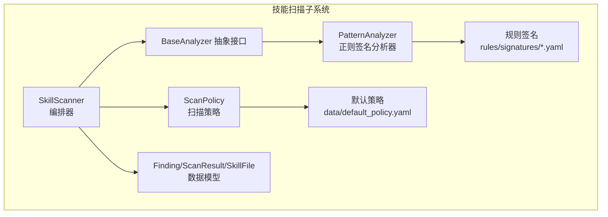
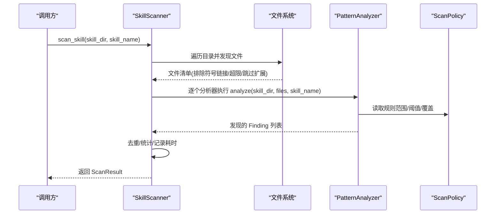
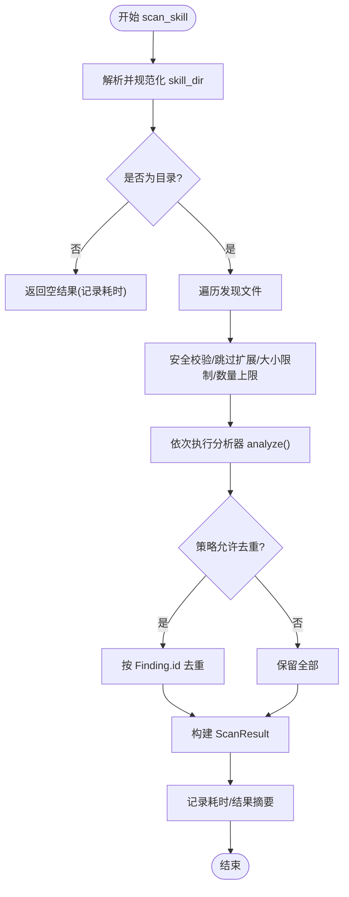
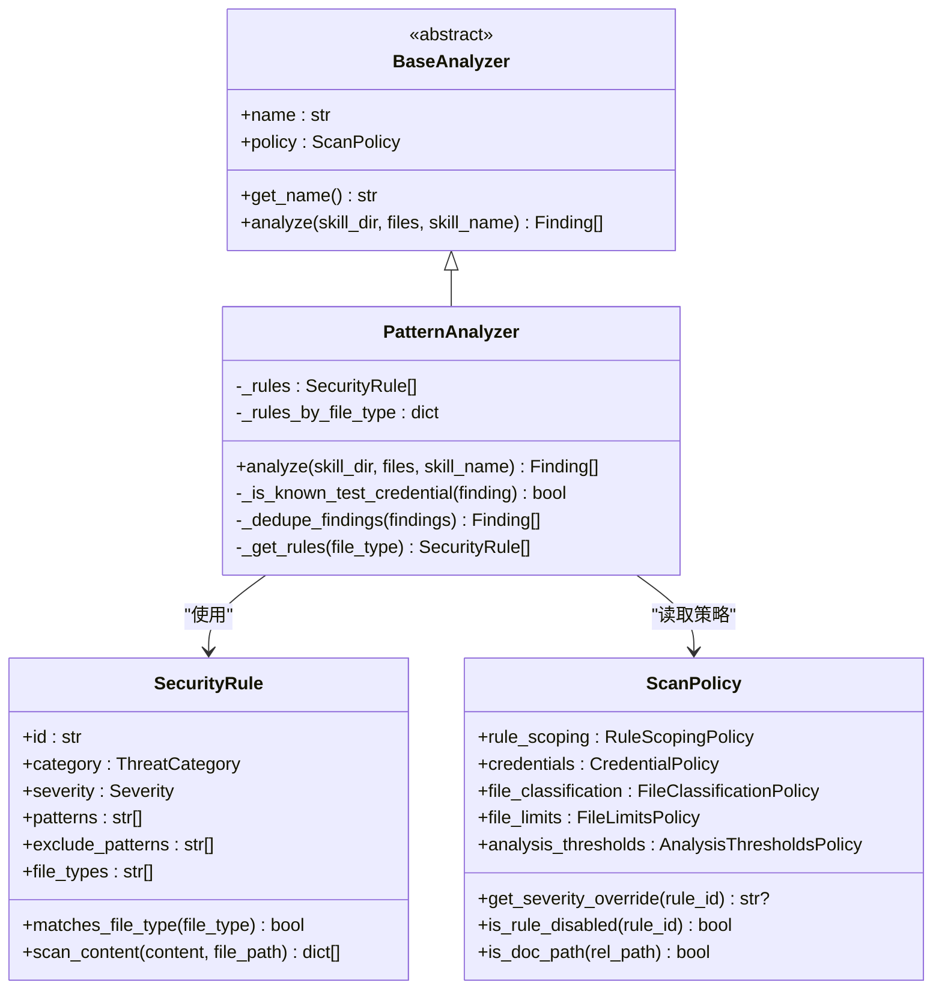
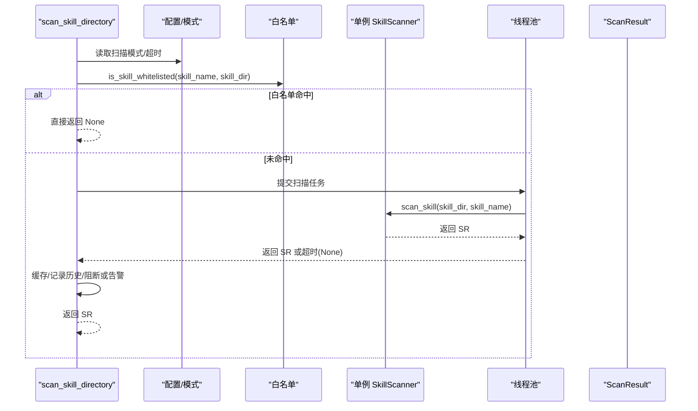
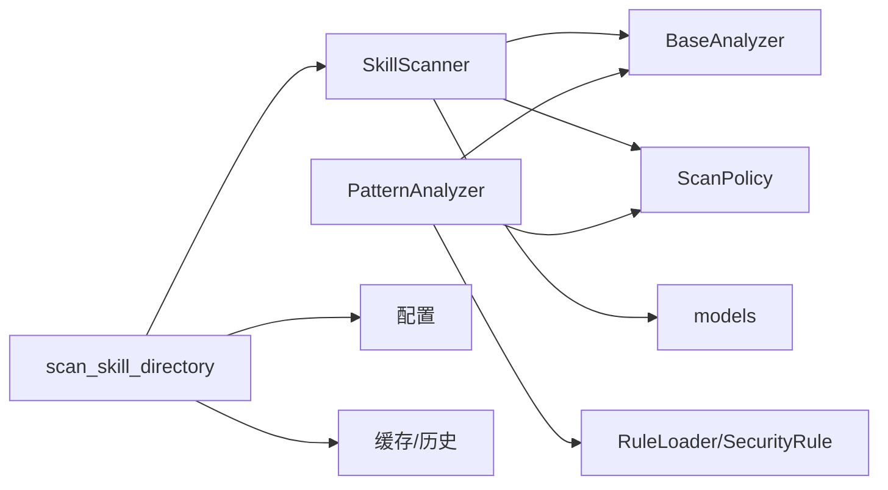

# 扫描引擎架构

<cite>
**本文档引用的文件**
- [src/qwenpaw/security/skill_scanner/scanner.py](file://src/qwenpaw/security/skill_scanner/scanner.py)
- [src/qwenpaw/security/skill_scanner/models.py](file://src/qwenpaw/security/skill_scanner/models.py)
- [src/qwenpaw/security/skill_scanner/scan_policy.py](file://src/qwenpaw/security/skill_scanner/scan_policy.py)
- [src/qwenpaw/security/skill_scanner/analyzers/__init__.py](file://src/qwenpaw/security/skill_scanner/analyzers/__init__.py)
- [src/qwenpaw/security/skill_scanner/analyzers/pattern_analyzer.py](file://src/qwenpaw/security/skill_scanner/analyzers/pattern_analyzer.py)
- [src/qwenpaw/security/skill_scanner/data/default_policy.yaml](file://src/qwenpaw/security/skill_scanner/data/default_policy.yaml)
- [src/qwenpaw/security/skill_scanner/rules/signatures/command_injection.yaml](file://src/qwenpaw/security/skill_scanner/rules/signatures/command_injection.yaml)
- [src/qwenpaw/security/skill_scanner/rules/signatures/hardcoded_secrets.yaml](file://src/qwenpaw/security/skill_scanner/rules/signatures/hardcoded_secrets.yaml)
- [src/qwenpaw/security/skill_scanner/__init__.py](file://src/qwenpaw/security/skill_scanner/__init__.py)
- [src/qwenpaw/config/config.py](file://src/qwenpaw/config/config.py)
</cite>

## 目录
1. [简介](#简介)
2. [项目结构](#项目结构)
3. [核心组件](#核心组件)
4. [架构总览](#架构总览)
5. [详细组件分析](#详细组件分析)
6. [依赖关系分析](#依赖关系分析)
7. [性能考量](#性能考量)
8. [故障排查指南](#故障排查指南)
9. [结论](#结论)
10. [附录](#附录)

## 简介
本文件系统性阐述 QwenPaw 技能扫描引擎的架构与实现细节，重点围绕 SkillScanner 类的设计原理展开，包括文件发现机制、分析器编排模式、扫描流程控制、安全路径校验、符号链接防护、文件大小限制、初始化与注册机制、错误处理策略，以及性能优化、并发能力与内存管理策略。同时提供扩展与自定义扫描引擎的实际代码示例路径。

## 项目结构
技能扫描子系统位于 src/qwenpaw/security/skill_scanner 目录下，采用“编排器 + 分析器 + 策略 + 数据模型”的分层组织：
- 编排器：SkillScanner 负责目录遍历、文件筛选、分析器调度与结果聚合
- 分析器：BaseAnalyzer 抽象接口；PatternAnalyzer 基于 YAML 规则的正则签名匹配
- 策略：ScanPolicy 提供组织级规则范围、阈值、严重度覆盖与允许列表
- 数据模型：Finding、ScanResult、SkillFile 等承载扫描结果与元数据
- 规则：rules/signatures 下的各类威胁签名（如命令注入、硬编码密钥等）
- 默认策略：data/default_policy.yaml 提供内置默认策略

**图表来源**
- [src/qwenpaw/security/skill_scanner/scanner.py:76-319](file://src/qwenpaw/security/skill_scanner/scanner.py#L76-L319)
- [src/qwenpaw/security/skill_scanner/analyzers/__init__.py:21-90](file://src/qwenpaw/security/skill_scanner/analyzers/__init__.py#L21-L90)
- [src/qwenpaw/security/skill_scanner/analyzers/pattern_analyzer.py:236-393](file://src/qwenpaw/security/skill_scanner/analyzers/pattern_analyzer.py#L236-L393)
- [src/qwenpaw/security/skill_scanner/scan_policy.py:156-476](file://src/qwenpaw/security/skill_scanner/scan_policy.py#L156-L476)
- [src/qwenpaw/security/skill_scanner/models.py:76-235](file://src/qwenpaw/security/skill_scanner/models.py#L76-L235)
- [src/qwenpaw/security/skill_scanner/data/default_policy.yaml:1-243](file://src/qwenpaw/security/skill_scanner/data/default_policy.yaml#L1-L243)

**章节来源**
- [src/qwenpaw/security/skill_scanner/scanner.py:1-319](file://src/qwenpaw/security/skill_scanner/scanner.py#L1-L319)
- [src/qwenpaw/security/skill_scanner/analyzers/__init__.py:1-90](file://src/qwenpaw/security/skill_scanner/analyzers/__init__.py#L1-L90)
- [src/qwenpaw/security/skill_scanner/analyzers/pattern_analyzer.py:1-393](file://src/qwenpaw/security/skill_scanner/analyzers/pattern_analyzer.py#L1-L393)
- [src/qwenpaw/security/skill_scanner/scan_policy.py:1-476](file://src/qwenpaw/security/skill_scanner/scan_policy.py#L1-L476)
- [src/qwenpaw/security/skill_scanner/models.py:1-235](file://src/qwenpaw/security/skill_scanner/models.py#L1-L235)
- [src/qwenpaw/security/skill_scanner/data/default_policy.yaml:1-243](file://src/qwenpaw/security/skill_scanner/data/default_policy.yaml#L1-L243)

## 核心组件
- SkillScanner：扫描编排器，负责目录遍历、文件过滤、分析器执行、结果聚合与日志记录
- BaseAnalyzer：分析器抽象接口，统一 analyze 接口，便于扩展新检测引擎
- PatternAnalyzer：基于 YAML 规则的正则签名匹配分析器，支持行内与多行模式
- ScanPolicy：组织级策略，控制规则范围、阈值、严重度覆盖、允许列表与文档路径识别
- 数据模型：Finding、ScanResult、SkillFile 定义扫描结果与元数据结构

**章节来源**
- [src/qwenpaw/security/skill_scanner/scanner.py:76-319](file://src/qwenpaw/security/skill_scanner/scanner.py#L76-L319)
- [src/qwenpaw/security/skill_scanner/analyzers/__init__.py:21-90](file://src/qwenpaw/security/skill_scanner/analyzers/__init__.py#L21-L90)
- [src/qwenpaw/security/skill_scanner/analyzers/pattern_analyzer.py:236-393](file://src/qwenpaw/security/skill_scanner/analyzers/pattern_analyzer.py#L236-L393)
- [src/qwenpaw/security/skill_scanner/scan_policy.py:156-476](file://src/qwenpaw/security/skill_scanner/scan_policy.py#L156-L476)
- [src/qwenpaw/security/skill_scanner/models.py:76-235](file://src/qwenpaw/security/skill_scanner/models.py#L76-L235)

## 架构总览
SkillScanner 的工作流分为三步：文件发现、分析器编排、结果聚合。策略驱动文件分类、阈值与规则范围，分析器按策略过滤后执行匹配，最终去重并生成 ScanResult。

**图表来源**
- [src/qwenpaw/security/skill_scanner/scanner.py:148-242](file://src/qwenpaw/security/skill_scanner/scanner.py#L148-L242)
- [src/qwenpaw/security/skill_scanner/analyzers/pattern_analyzer.py:265-347](file://src/qwenpaw/security/skill_scanner/analyzers/pattern_analyzer.py#L265-L347)
- [src/qwenpaw/security/skill_scanner/scan_policy.py:156-476](file://src/qwenpaw/security/skill_scanner/scan_policy.py#L156-L476)

## 详细组件分析

### SkillScanner 设计与实现
- 初始化与参数优先级
  - 支持显式传入 analyzers、policy、skip_extensions、max_files、max_file_size
  - 优先级：显式参数 > 策略配置 > 内置回退值
- 文件发现与安全校验
  - 使用 rglob 遍历候选项，跳过符号链接，对非符号链接进行 realpath 并校验相对性，防止路径穿越
  - 基于策略的 inert/archive 扩展集合决定跳过文件类型
  - 基于 max_file_size 与 max_files 进行容量控制
- 分析器编排
  - 顺序执行已注册分析器，捕获异常并记录失败分析器信息
  - 可选去重：依据策略开关与 Finding.id 去除重复
- 结果聚合
  - 统计耗时、收集分析器使用情况与失败列表，构造 ScanResult

**图表来源**
- [src/qwenpaw/security/skill_scanner/scanner.py:148-242](file://src/qwenpaw/security/skill_scanner/scanner.py#L148-L242)
- [src/qwenpaw/security/skill_scanner/scanner.py:248-299](file://src/qwenpaw/security/skill_scanner/scanner.py#L248-L299)

**章节来源**
- [src/qwenpaw/security/skill_scanner/scanner.py:100-134](file://src/qwenpaw/security/skill_scanner/scanner.py#L100-L134)
- [src/qwenpaw/security/skill_scanner/scanner.py:148-242](file://src/qwenpaw/security/skill_scanner/scanner.py#L148-L242)
- [src/qwenpaw/security/skill_scanner/scanner.py:248-299](file://src/qwenpaw/security/skill_scanner/scanner.py#L248-L299)

### 分析器接口与 PatternAnalyzer 实现
- BaseAnalyzer
  - 统一 analyze 接口，接收 skill_dir、文件列表与可选 skill_name
  - 持有 ScanPolicy 引用，用于规则范围、阈值与覆盖
- PatternAnalyzer
  - 从 rules/signatures 加载规则，按文件类型索引
  - 行内匹配 + 多行模式匹配，支持排除模式
  - 应用策略：禁用规则、文档路径跳过、仅代码文件规则、严重度覆盖
  - 过滤已知测试凭证，按策略去重

**图表来源**
- [src/qwenpaw/security/skill_scanner/analyzers/__init__.py:21-90](file://src/qwenpaw/security/skill_scanner/analyzers/__init__.py#L21-L90)
- [src/qwenpaw/security/skill_scanner/analyzers/pattern_analyzer.py:38-156](file://src/qwenpaw/security/skill_scanner/analyzers/pattern_analyzer.py#L38-L156)
- [src/qwenpaw/security/skill_scanner/analyzers/pattern_analyzer.py:236-393](file://src/qwenpaw/security/skill_scanner/analyzers/pattern_analyzer.py#L236-L393)
- [src/qwenpaw/security/skill_scanner/scan_policy.py:156-476](file://src/qwenpaw/security/skill_scanner/scan_policy.py#L156-L476)

**章节来源**
- [src/qwenpaw/security/skill_scanner/analyzers/__init__.py:21-90](file://src/qwenpaw/security/skill_scanner/analyzers/__init__.py#L21-L90)
- [src/qwenpaw/security/skill_scanner/analyzers/pattern_analyzer.py:236-393](file://src/qwenpaw/security/skill_scanner/analyzers/pattern_analyzer.py#L236-L393)

### ScanPolicy 策略体系
- 策略层次
  - hidden_files：点文件/点目录白名单
  - rule_scoping：规则范围控制（仅技能文档+脚本、仅代码文件、文档路径指示符、文档文件名模式、去重开关）
  - credentials：测试凭证与占位符抑制
  - file_classification：扩展分类（惰性/结构化/归档/代码）
  - file_limits：最大文件数、单文件大小、引用深度、名称/描述长度
  - analysis_thresholds：最小置信度、最大正则长度
  - severity_overrides：按规则的严重度覆盖
  - disabled_rules：禁用规则集合
- 加载与合并
  - 支持 from_yaml 加载组织策略，并与内置默认策略深合并
  - 提供 to_yaml 导出完整策略以便编辑

**章节来源**
- [src/qwenpaw/security/skill_scanner/scan_policy.py:156-476](file://src/qwenpaw/security/skill_scanner/scan_policy.py#L156-L476)
- [src/qwenpaw/security/skill_scanner/data/default_policy.yaml:1-243](file://src/qwenpaw/security/skill_scanner/data/default_policy.yaml#L1-L243)

### 数据模型与结果聚合
- SkillFile：封装文件路径、相对路径、类型、大小与内容读取
- Finding：扫描发现的安全问题，包含 id、规则 id、类别、严重度、标题、描述、文件路径、行号、片段、修复建议、分析器与元数据
- ScanResult：聚合结果，包含技能名、目录、发现列表、耗时、使用/失败分析器、时间戳与便捷属性（是否安全、最高严重度）

**章节来源**
- [src/qwenpaw/security/skill_scanner/models.py:76-235](file://src/qwenpaw/security/skill_scanner/models.py#L76-L235)

### 规则签名与威胁类别
- 规则来源：rules/signatures/*.yaml，每条规则包含 id、类别、严重度、模式、排除模式、适用文件类型、描述与修复建议
- 示例规则：命令注入、硬编码密钥等威胁类别均有对应规则集

**章节来源**
- [src/qwenpaw/security/skill_scanner/rules/signatures/command_injection.yaml:1-195](file://src/qwenpaw/security/skill_scanner/rules/signatures/command_injection.yaml#L1-L195)
- [src/qwenpaw/security/skill_scanner/rules/signatures/hardcoded_secrets.yaml:1-150](file://src/qwenpaw/security/skill_scanner/rules/signatures/hardcoded_secrets.yaml#L1-L150)

### 扫描引擎公共 API 与运行时特性
- scan_skill_directory：对外暴露的高层 API，支持阻断模式、告警模式、关闭模式、超时控制、缓存与白名单
- 单例懒加载：内部使用线程安全的单例 SkillScanner，避免重复初始化
- 缓存：基于目录 mtime 的轻量缓存，LRU 最大条目控制
- 白名单：支持按技能名与内容哈希匹配的白名单条目

**图表来源**
- [src/qwenpaw/security/skill_scanner/__init__.py:424-514](file://src/qwenpaw/security/skill_scanner/__init__.py#L424-L514)
- [src/qwenpaw/config/config.py:1690-1712](file://src/qwenpaw/config/config.py#L1690-L1712)

**章节来源**
- [src/qwenpaw/security/skill_scanner/__init__.py:424-514](file://src/qwenpaw/security/skill_scanner/__init__.py#L424-L514)
- [src/qwenpaw/config/config.py:1690-1712](file://src/qwenpaw/config/config.py#L1690-L1712)

## 依赖关系分析
- SkillScanner 依赖
  - BaseAnalyzer 抽象接口与具体实现（PatternAnalyzer）
  - ScanPolicy 提供策略与阈值
  - models 提供数据结构
- PatternAnalyzer 依赖
  - SecurityRule 与 RuleLoader 解析规则
  - ScanPolicy 控制规则范围与覆盖
- scan_skill_directory 依赖
  - 配置模块提供扫描模式与超时
  - 单例 SkillScanner 与线程池执行扫描
  - 缓存与历史持久化

**图表来源**
- [src/qwenpaw/security/skill_scanner/scanner.py:24-27](file://src/qwenpaw/security/skill_scanner/scanner.py#L24-L27)
- [src/qwenpaw/security/skill_scanner/analyzers/pattern_analyzer.py:17-19](file://src/qwenpaw/security/skill_scanner/analyzers/pattern_analyzer.py#L17-L19)
- [src/qwenpaw/security/skill_scanner/__init__.py:43-54](file://src/qwenpaw/security/skill_scanner/__init__.py#L43-L54)

**章节来源**
- [src/qwenpaw/security/skill_scanner/scanner.py:24-27](file://src/qwenpaw/security/skill_scanner/scanner.py#L24-L27)
- [src/qwenpaw/security/skill_scanner/analyzers/pattern_analyzer.py:17-19](file://src/qwenpaw/security/skill_scanner/analyzers/pattern_analyzer.py#L17-L19)
- [src/qwenpaw/security/skill_scanner/__init__.py:43-54](file://src/qwenpaw/security/skill_scanner/__init__.py#L43-L54)

## 性能考量
- 文件遍历与过滤
  - 使用 rglob 快速发现候选，随后严格过滤符号链接、越界路径、跳过扩展与超大文件，减少后续分析成本
- 正则匹配优化
  - 行内快速匹配 + 多行模式回退，避免全文件扫描
  - 规则预编译与按文件类型缓存规则集合
- 去重与阈值
  - 基于策略的去重与阈值（最大文件数/大小）降低结果规模
- 并发与缓存
  - scan_skill_directory 使用单线程池执行扫描，避免阻塞主流程
  - 基于目录 mtime 的轻量缓存，减少重复扫描开销
- 内存管理
  - SkillFile.content 仅在首次访问时读取，避免一次性加载所有文件内容
  - 去重使用集合与列表，控制内存占用

**章节来源**
- [src/qwenpaw/security/skill_scanner/scanner.py:248-299](file://src/qwenpaw/security/skill_scanner/scanner.py#L248-L299)
- [src/qwenpaw/security/skill_scanner/analyzers/pattern_analyzer.py:93-156](file://src/qwenpaw/security/skill_scanner/analyzers/pattern_analyzer.py#L93-L156)
- [src/qwenpaw/security/skill_scanner/__init__.py:376-390](file://src/qwenpaw/security/skill_scanner/__init__.py#L376-L390)

## 故障排查指南
- 常见问题
  - 目录不存在：返回空结果并记录警告
  - 分析器异常：捕获异常并记录失败分析器，不影响其他分析器执行
  - 符号链接与路径越界：自动跳过并记录警告
  - 文件过大/过多：达到阈值后停止继续发现
  - 超时：scan_skill_directory 在超时后返回 None
- 日志与诊断
  - 编排器记录扫描耗时、发现数量与安全性摘要
  - 分析器记录规则匹配详情与去重状态
  - 历史记录：阻断/告警记录持久化，支持查询与清理

**章节来源**
- [src/qwenpaw/security/skill_scanner/scanner.py:173-179](file://src/qwenpaw/security/skill_scanner/scanner.py#L173-L179)
- [src/qwenpaw/security/skill_scanner/scanner.py:203-213](file://src/qwenpaw/security/skill_scanner/scanner.py#L203-L213)
- [src/qwenpaw/security/skill_scanner/__init__.py:487-495](file://src/qwenpaw/security/skill_scanner/__init__.py#L487-L495)
- [src/qwenpaw/security/skill_scanner/__init__.py:240-312](file://src/qwenpaw/security/skill_scanner/__init__.py#L240-L312)

## 结论
SkillScanner 通过清晰的编排-分析器-策略三层架构，实现了可扩展、可配置且安全可控的技能扫描能力。其在文件发现阶段即进行严格的路径与大小控制，在分析阶段通过策略驱动规则范围与阈值，并在结果阶段提供去重与便捷属性。结合 scan_skill_directory 的运行时特性（模式、超时、缓存、白名单），可在生产环境中稳定高效地保障技能包安全。

## 附录

### 如何扩展与自定义扫描引擎
- 新增分析器
  - 继承 BaseAnalyzer 并实现 analyze 方法
  - 在构造函数中接收 policy 参数以适配策略
  - 将新分析器注册到 SkillScanner（构造时传入或运行时 register_analyzer）
- 自定义策略
  - 通过 ScanPolicy.from_yaml 加载组织策略，覆盖默认策略
  - 使用 ScanPolicy.to_yaml 导出策略以便编辑
- 自定义规则
  - 在 rules/signatures 下新增 YAML 规则文件，遵循现有格式
  - 通过 PatternAnalyzer 的规则加载机制自动生效
- 配置扫描行为
  - 通过配置模块设置扫描模式（block/warn/off）、超时与白名单
  - 使用 scan_skill_directory 高层 API 控制阻断与告警

**章节来源**
- [src/qwenpaw/security/skill_scanner/analyzers/__init__.py:21-90](file://src/qwenpaw/security/skill_scanner/analyzers/__init__.py#L21-L90)
- [src/qwenpaw/security/skill_scanner/scan_policy.py:261-304](file://src/qwenpaw/security/skill_scanner/scan_policy.py#L261-L304)
- [src/qwenpaw/security/skill_scanner/analyzers/pattern_analyzer.py:172-229](file://src/qwenpaw/security/skill_scanner/analyzers/pattern_analyzer.py#L172-L229)
- [src/qwenpaw/config/config.py:1690-1712](file://src/qwenpaw/config/config.py#L1690-L1712)
- [src/qwenpaw/security/skill_scanner/__init__.py:424-514](file://src/qwenpaw/security/skill_scanner/__init__.py#L424-L514)