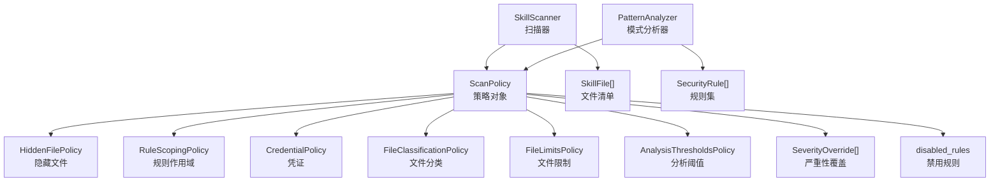
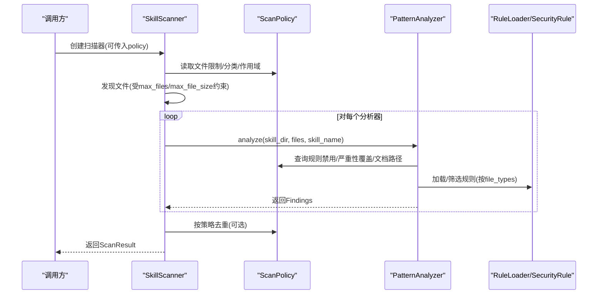
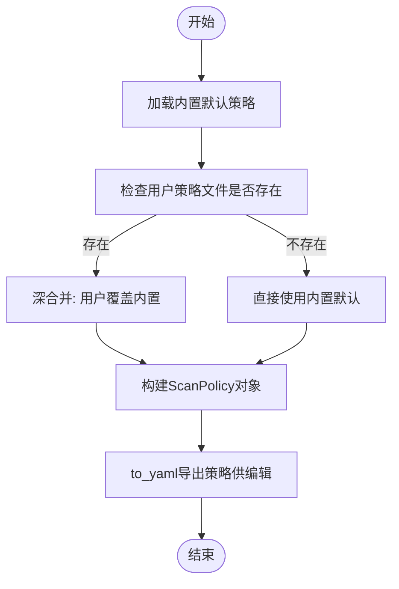
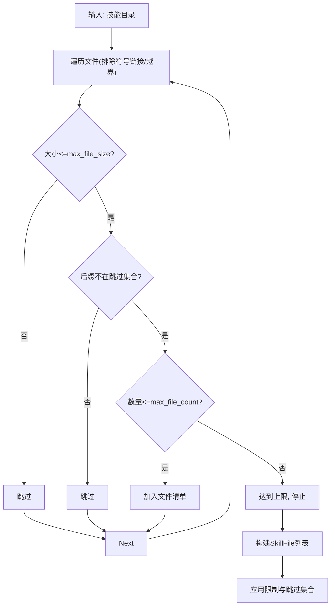
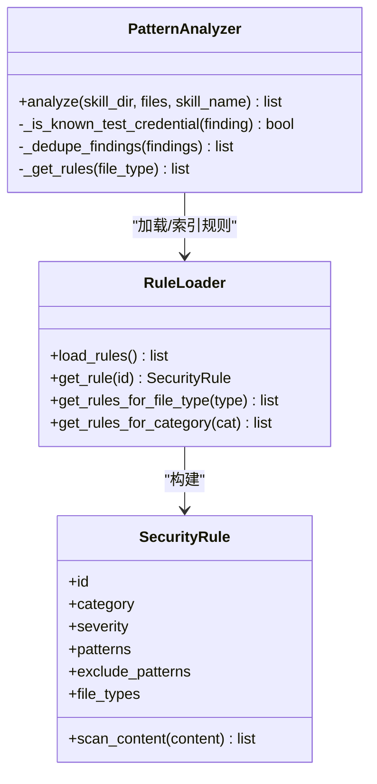
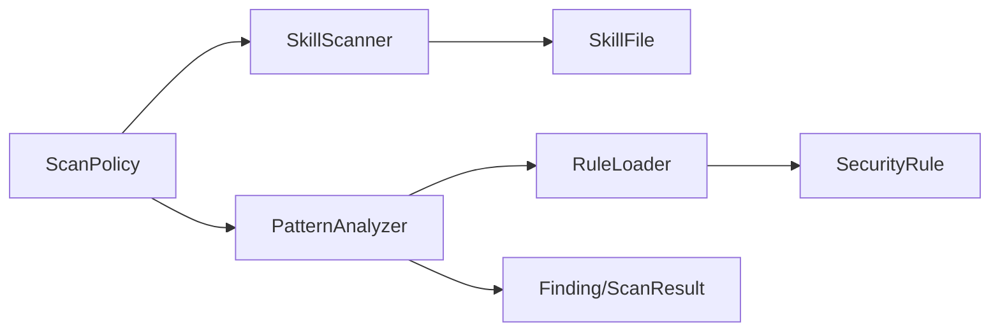

# 扫描策略配置

<cite>
**本文档引用的文件**
- [scan_policy.py](file://src/qwenpaw/security/skill_scanner/scan_policy.py)
- [default_policy.yaml](file://src/qwenpaw/security/skill_scanner/data/default_policy.yaml)
- [scanner.py](file://src/qwenpaw/security/skill_scanner/scanner.py)
- [pattern_analyzer.py](file://src/qwenpaw/security/skill_scanner/analyzers/pattern_analyzer.py)
- [models.py](file://src/qwenpaw/security/skill_scanner/models.py)
- [command_injection.yaml](file://src/qwenpaw/security/skill_scanner/rules/signatures/command_injection.yaml)
- [prompt_injection.yaml](file://src/qwenpaw/security/skill_scanner/rules/signatures/prompt_injection.yaml)
- [hardcoded_secrets.yaml](file://src/qwenpaw/security/skill_scanner/rules/signatures/hardcoded_secrets.yaml)
- [data_exfiltration.yaml](file://src/qwenpaw/security/skill_scanner/rules/signatures/data_exfiltration.yaml)
</cite>

## 目录
1. [简介](#简介)
2. [项目结构](#项目结构)
3. [核心组件](#核心组件)
4. [架构总览](#架构总览)
5. [详细组件分析](#详细组件分析)
6. [依赖关系分析](#依赖关系分析)
7. [性能考虑](#性能考虑)
8. [故障排查指南](#故障排查指南)
9. [结论](#结论)
10. [附录：策略配置示例与最佳实践](#附录策略配置示例与最佳实践)

## 简介
本文件面向QwenPaw技能扫描系统的“扫描策略管理”能力，围绕ScanPolicy类进行系统化技术文档化，涵盖以下主题：
- ScanPolicy类的设计架构与配置项
- 文件分类策略、文件限制设置、规则作用域配置与去重机制
- 默认策略的配置结构、组织特定策略的定制方法与策略继承机制
- 策略文件的YAML格式、字段含义与验证规则
- 策略配置的最佳实践、性能调优参数与安全加固建议
- 实际示例与常见配置场景

## 项目结构
扫描策略相关的核心代码位于src/qwenpaw/security/skill_scanner目录，主要文件如下：
- scan_policy.py：定义ScanPolicy及其数据类（文件分类、规则作用域、凭证、文件限制、分析阈值、严重性覆盖、禁用规则等），并提供从YAML加载/导出的能力
- default_policy.yaml：内置默认策略模板
- scanner.py：扫描器，负责文件发现、限制控制、去重与结果聚合，并消费ScanPolicy
- pattern_analyzer.py：基于YAML签名的正则匹配分析器，按策略过滤规则、应用严重性覆盖与去重
- models.py：扫描结果、威胁类别、严重性等级等数据模型

图表来源
- [scan_policy.py:156-476](file://src/qwenpaw/security/skill_scanner/scan_policy.py#L156-L476)
- [scanner.py:76-319](file://src/qwenpaw/security/skill_scanner/scanner.py#L76-L319)
- [pattern_analyzer.py:236-393](file://src/qwenpaw/security/skill_scanner/analyzers/pattern_analyzer.py#L236-L393)

章节来源
- [scan_policy.py:1-476](file://src/qwenpaw/security/skill_scanner/scan_policy.py#L1-L476)
- [scanner.py:1-319](file://src/qwenpaw/security/skill_scanner/scanner.py#L1-L319)
- [pattern_analyzer.py:1-393](file://src/qwenpaw/security/skill_scanner/analyzers/pattern_analyzer.py#L1-L393)

## 核心组件
本节聚焦ScanPolicy类及其子策略数据类，说明其职责、字段与行为。

- ScanPolicy顶层策略对象
  - 元数据：policy_name、policy_version、preset_base
  - 子策略：hidden_files、rule_scoping、credentials、file_classification、file_limits、analysis_thresholds、severity_overrides、disabled_rules
  - 工具方法：按规则ID查询严重性覆盖、判断规则是否禁用、文档路径判定、惰性编译文档名正则

- 隐藏文件策略（HiddenFilePolicy）
  - benign_dotfiles：被视作无害的点文件集合
  - benign_dotdirs：被视作无害的点目录集合

- 规则作用域策略（RuleScopingPolicy）
  - skillmd_and_scripts_only：仅在SKILL.md与脚本文件触发的规则集合
  - skip_in_docs：在文档路径中跳过的规则集合
  - code_only：仅在代码文件（.py/.sh等）触发的规则集合
  - doc_path_indicators：标记文档目录的路径组件集合
  - doc_filename_patterns：教育/示例类文件名的正则模式列表
  - dedupe_duplicate_findings：是否去重重复发现

- 凭证策略（CredentialPolicy）
  - known_test_values：已知测试值集合（自动抑制）
  - placeholder_markers：占位符标记集合（自动抑制）

- 文件分类策略（FileClassificationPolicy）
  - inert_extensions：惰性扩展（图片/字体等）
  - structured_extensions：结构化数据扩展（PDF/DOCX等）
  - archive_extensions：归档扩展
  - code_extensions：可执行代码扩展

- 文件限制策略（FileLimitsPolicy）
  - max_file_count、max_file_size_bytes、max_reference_depth、max_name_length、max_description_length、min_description_length

- 分析阈值策略（AnalysisThresholdsPolicy）
  - min_confidence_pct、max_regex_pattern_length

- 严重性覆盖（SeverityOverride）
  - rule_id、severity、reason

- 禁用规则（disabled_rules）
  - 规则ID集合，永不触发

章节来源
- [scan_policy.py:74-178](file://src/qwenpaw/security/skill_scanner/scan_policy.py#L74-L178)
- [scan_policy.py:156-178](file://src/qwenpaw/security/skill_scanner/scan_policy.py#L156-L178)

## 架构总览
扫描流程由SkillScanner驱动，PatternAnalyzer加载规则并按策略过滤，最终生成ScanResult。

图表来源
- [scanner.py:148-242](file://src/qwenpaw/security/skill_scanner/scanner.py#L148-L242)
- [pattern_analyzer.py:265-347](file://src/qwenpaw/security/skill_scanner/analyzers/pattern_analyzer.py#L265-L347)
- [scan_policy.py:183-193](file://src/qwenpaw/security/skill_scanner/scan_policy.py#L183-L193)

章节来源
- [scanner.py:76-319](file://src/qwenpaw/security/skill_scanner/scanner.py#L76-L319)
- [pattern_analyzer.py:236-393](file://src/qwenpaw/security/skill_scanner/analyzers/pattern_analyzer.py#L236-L393)

## 详细组件分析

### ScanPolicy类与策略加载/导出
- 默认策略加载：优先从内置default_policy.yaml加载，否则回退为空策略
- 预设策略：当前支持"balanced"预设（指向内置默认）
- YAML加载：用户策略与内置默认进行深合并，用户仅需覆盖差异部分
- 导出策略：将当前策略转为字典并写入YAML，便于编辑与版本化

图表来源
- [scan_policy.py:236-304](file://src/qwenpaw/security/skill_scanner/scan_policy.py#L236-L304)
- [scan_policy.py:309-334](file://src/qwenpaw/security/skill_scanner/scan_policy.py#L309-L334)
- [scan_policy.py:337-397](file://src/qwenpaw/security/skill_scanner/scan_policy.py#L337-L397)

章节来源
- [scan_policy.py:236-304](file://src/qwenpaw/security/skill_scanner/scan_policy.py#L236-L304)
- [scan_policy.py:309-397](file://src/qwenpaw/security/skill_scanner/scan_policy.py#L309-L397)

### 文件发现与限制控制（SkillScanner）
- 文件发现：递归遍历技能包，排除符号链接与越界文件，按后缀加入跳过集合
- 限制控制：max_files与max_file_size来自策略或硬编码回退值
- 去重：根据策略开关，按Finding.id去重

图表来源
- [scanner.py:248-299](file://src/qwenpaw/security/skill_scanner/scanner.py#L248-L299)
- [scanner.py:116-133](file://src/qwenpaw/security/skill_scanner/scanner.py#L116-L133)

章节来源
- [scanner.py:116-133](file://src/qwenpaw/security/skill_scanner/scanner.py#L116-L133)
- [scanner.py:248-299](file://src/qwenpaw/security/skill_scanner/scanner.py#L248-L299)

### 规则加载与匹配（PatternAnalyzer）
- 规则加载：从目录或单文件加载YAML规则，建立按ID、类别、文件类型的索引
- 匹配流程：逐文件读取内容，按文件类型筛选规则；应用策略过滤（禁用、文档路径、仅代码文件）；正则匹配并生成Finding；按策略去重与凭证抑制

图表来源
- [pattern_analyzer.py:38-156](file://src/qwenpaw/security/skill_scanner/analyzers/pattern_analyzer.py#L38-L156)
- [pattern_analyzer.py:163-229](file://src/qwenpaw/security/skill_scanner/analyzers/pattern_analyzer.py#L163-L229)
- [pattern_analyzer.py:236-393](file://src/qwenpaw/security/skill_scanner/analyzers/pattern_analyzer.py#L236-L393)

章节来源
- [pattern_analyzer.py:236-393](file://src/qwenpaw/security/skill_scanner/analyzers/pattern_analyzer.py#L236-L393)

### 文档路径判定与正则编译
- 文档路径判定：通过doc_path_indicators与doc_filename_patterns（惰性编译）判断相对路径是否属于文档区
- 正则长度限制：max_regex_pattern_length用于限制组合后的正则长度，避免过长正则导致性能问题

章节来源
- [scan_policy.py:194-230](file://src/qwenpaw/security/skill_scanner/scan_policy.py#L194-L230)
- [scan_policy.py:49-66](file://src/qwenpaw/security/skill_scanner/scan_policy.py#L49-L66)

### 去重机制
- 扫描器层去重：按Finding.id去重
- 分析器层去重：按rule_id:file_path:line_number去重
- 策略开关：dedupe_duplicate_findings控制是否启用

章节来源
- [scanner.py:214-224](file://src/qwenpaw/security/skill_scanner/scanner.py#L214-L224)
- [pattern_analyzer.py:370-380](file://src/qwenpaw/security/skill_scanner/analyzers/pattern_analyzer.py#L370-L380)
- [scan_policy.py:96-98](file://src/qwenpaw/security/skill_scanner/scan_policy.py#L96-L98)

### 凭证抑制
- 已知测试值与占位符标记：在硬编码密钥规则中，若命中snippet中的已知测试值或占位符，则抑制该Finding

章节来源
- [pattern_analyzer.py:353-364](file://src/qwenpaw/security/skill_scanner/analyzers/pattern_analyzer.py#L353-L364)
- [scan_policy.py:101-106](file://src/qwenpaw/security/skill_scanner/scan_policy.py#L101-L106)

## 依赖关系分析
- SkillScanner依赖ScanPolicy进行文件限制、跳过扩展与规则作用域控制
- PatternAnalyzer依赖ScanPolicy进行规则禁用、严重性覆盖、文档路径跳过与去重
- RuleLoader与SecurityRule提供规则集的加载与索引
- models提供Finding、ScanResult、Severity、ThreatCategory等数据模型

图表来源
- [scanner.py:100-138](file://src/qwenpaw/security/skill_scanner/scanner.py#L100-L138)
- [pattern_analyzer.py:249-259](file://src/qwenpaw/security/skill_scanner/analyzers/pattern_analyzer.py#L249-L259)
- [models.py:19-235](file://src/qwenpaw/security/skill_scanner/models.py#L19-L235)

章节来源
- [scanner.py:100-138](file://src/qwenpaw/security/skill_scanner/scanner.py#L100-L138)
- [pattern_analyzer.py:249-259](file://src/qwenpaw/security/skill_scanner/analyzers/pattern_analyzer.py#L249-L259)
- [models.py:19-235](file://src/qwenpaw/security/skill_scanner/models.py#L19-L235)

## 性能考虑
- 正则长度限制：max_regex_pattern_length防止过长正则导致匹配耗时增加
- 惰性编译文档名正则：仅在需要时编译并缓存，减少初始化成本
- 文件大小与数量限制：max_file_size_bytes与max_file_count避免大规模扫描带来的内存与CPU压力
- 跳过扩展集合：通过file_classification.inert_extensions与archive_extensions快速过滤非文本文件
- 去重策略：双重去重（扫描器层与分析器层）减少重复报告，降低后续处理成本

章节来源
- [scan_policy.py:138-140](file://src/qwenpaw/security/skill_scanner/scan_policy.py#L138-L140)
- [scan_policy.py:205-230](file://src/qwenpaw/security/skill_scanner/scan_policy.py#L205-L230)
- [scanner.py:116-133](file://src/qwenpaw/security/skill_scanner/scanner.py#L116-L133)
- [pattern_analyzer.py:370-380](file://src/qwenpaw/security/skill_scanner/analyzers/pattern_analyzer.py#L370-L380)

## 故障排查指南
- 策略文件未找到：from_yaml会抛出文件不存在异常
- 正则无效：加载规则时对无效正则进行警告并跳过
- 文档路径误判：检查doc_path_indicators与doc_filename_patterns配置
- 结果过多/重复：开启dedupe_duplicate_findings或调整规则作用域
- 大文件/超量文件：提高max_file_count或max_file_size_bytes，或优化file_classification

章节来源
- [scan_policy.py:268-270](file://src/qwenpaw/security/skill_scanner/scan_policy.py#L268-L270)
- [pattern_analyzer.py:67-83](file://src/qwenpaw/security/skill_scanner/analyzers/pattern_analyzer.py#L67-L83)
- [scanner.py:288-294](file://src/qwenpaw/security/skill_scanner/scanner.py#L288-L294)

## 结论
ScanPolicy为QwenPaw技能扫描提供了可组织、可继承、可定制的策略框架。通过文件分类、规则作用域、凭证抑制与去重机制，结合文件限制与正则阈值，既能满足不同组织的安全基线，又能在性能与准确性之间取得平衡。建议在生产环境中以内置默认策略为基础，按需覆盖最小化配置，并定期导出策略文件进行审计与版本管理。

## 附录：策略配置示例与最佳实践

### 默认策略结构概览
- 元数据：policy_name、policy_version、preset_base
- 隐藏文件：benign_dotfiles、benign_dotdirs
- 规则作用域：skillmd_and_scripts_only、skip_in_docs、code_only、doc_path_indicators、doc_filename_patterns、dedupe_duplicate_findings
- 凭证：known_test_values、placeholder_markers
- 文件分类：inert_extensions、structured_extensions、archive_extensions、code_extensions
- 文件限制：max_file_count、max_file_size_bytes、max_reference_depth、max_name_length、max_description_length、min_description_length
- 分析阈值：min_confidence_pct、max_regex_pattern_length
- 严重性覆盖：severity_overrides（空数组）
- 禁用规则：disabled_rules（空数组）

章节来源
- [default_policy.yaml:9-243](file://src/qwenpaw/security/skill_scanner/data/default_policy.yaml#L9-L243)

### 组织特定策略定制方法
- 使用ScanPolicy.default()加载内置默认
- 使用ScanPolicy.from_yaml("my_org_policy.yaml")加载组织策略
- 仅覆盖需要变更的section，其余沿用默认
- 使用ScanPolicy.to_yaml("generated_policy.yaml")导出当前策略以便编辑

章节来源
- [scan_policy.py:236-304](file://src/qwenpaw/security/skill_scanner/scan_policy.py#L236-L304)

### 策略继承机制
- 内置默认策略作为基础
- 用户策略与默认策略进行深合并，用户策略完全覆盖同级键值
- 列表/集合在合并时采用覆盖策略，便于窄化或扩展现有集合

章节来源
- [scan_policy.py:316-334](file://src/qwenpaw/security/skill_scanner/scan_policy.py#L316-L334)

### 规则作用域配置要点
- 仅在文档路径跳过：skip_in_docs
- 仅在代码文件触发：code_only
- 文档路径识别：doc_path_indicators与doc_filename_patterns
- 仅在SKILL.md与脚本触发：skillmd_and_scripts_only

章节来源
- [scan_policy.py:82-98](file://src/qwenpaw/security/skill_scanner/scan_policy.py#L82-L98)
- [pattern_analyzer.py:289-299](file://src/qwenpaw/security/skill_scanner/analyzers/pattern_analyzer.py#L289-L299)

### 文件分类策略
- 将图片/字体/压缩包等标记为inert/archive，避免不必要的解析
- 将PDF/DOCX等结构化文档标记为structured，便于后续处理
- 明确代码扩展集合，确保规则仅在目标文件类型生效

章节来源
- [default_policy.yaml:157-215](file://src/qwenpaw/security/skill_scanner/data/default_policy.yaml#L157-L215)
- [scanner.py:129-133](file://src/qwenpaw/security/skill_scanner/scanner.py#L129-L133)

### 去重机制与凭证抑制
- 启用dedupe_duplicate_findings以消除重复告警
- 在硬编码密钥规则中利用known_test_values与placeholder_markers抑制测试值与占位符

章节来源
- [scan_policy.py:96-98](file://src/qwenpaw/security/skill_scanner/scan_policy.py#L96-L98)
- [pattern_analyzer.py:353-364](file://src/qwenpaw/security/skill_scanner/analyzers/pattern_analyzer.py#L353-L364)

### 常见配置场景示例
- 场景一：严格文档路径跳过
  - 在skip_in_docs中添加命令注入相关规则ID
  - 在doc_path_indicators中加入更多文档标识词
- 场景二：扩大代码规则覆盖面
  - 在code_only中加入更多规则ID，确保仅在代码文件触发
- 场景三：收紧正则阈值
  - 降低max_regex_pattern_length以提升稳定性
- 场景四：禁用高误报规则
  - 在disabled_rules中加入误报较多的规则ID
- 场景五：调整文件限制
  - 提高max_file_count与max_file_size_bytes以适配大型技能包

章节来源
- [default_policy.yaml:82-117](file://src/qwenpaw/security/skill_scanner/data/default_policy.yaml#L82-L117)
- [default_policy.yaml:219-225](file://src/qwenpaw/security/skill_scanner/data/default_policy.yaml#L219-L225)
- [scan_policy.py:138-140](file://src/qwenpaw/security/skill_scanner/scan_policy.py#L138-L140)
- [scan_policy.py:190-193](file://src/qwenpaw/security/skill_scanner/scan_policy.py#L190-L193)

### 安全加固建议
- 仅在必要时放宽max_file_count与max_file_size_bytes
- 保持dedupe_duplicate_findings开启以减少噪声
- 定期更新doc_filename_patterns与doc_path_indicators以覆盖新增文档命名规范
- 对known_test_values与placeholder_markers进行最小化维护，避免过度抑制真实风险

章节来源
- [scanner.py:214-224](file://src/qwenpaw/security/skill_scanner/scanner.py#L214-L224)
- [default_policy.yaml:122-153](file://src/qwenpaw/security/skill_scanner/data/default_policy.yaml#L122-L153)