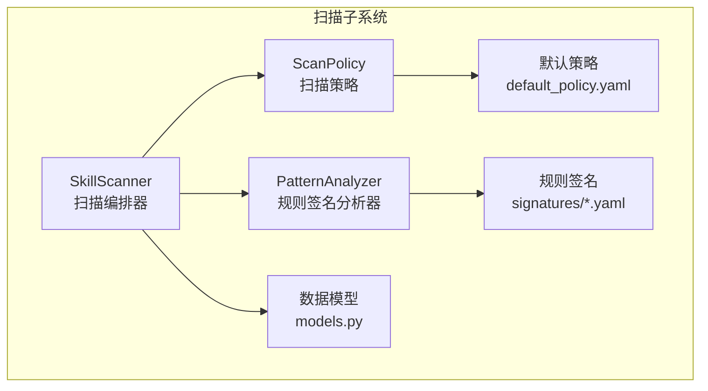
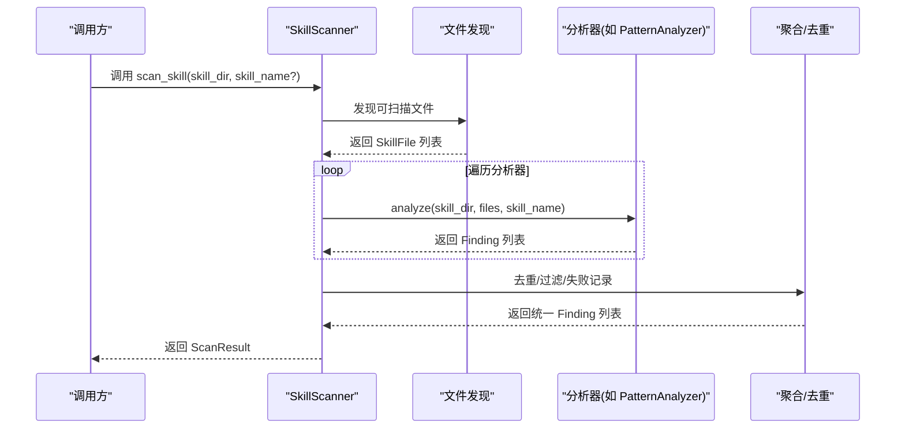
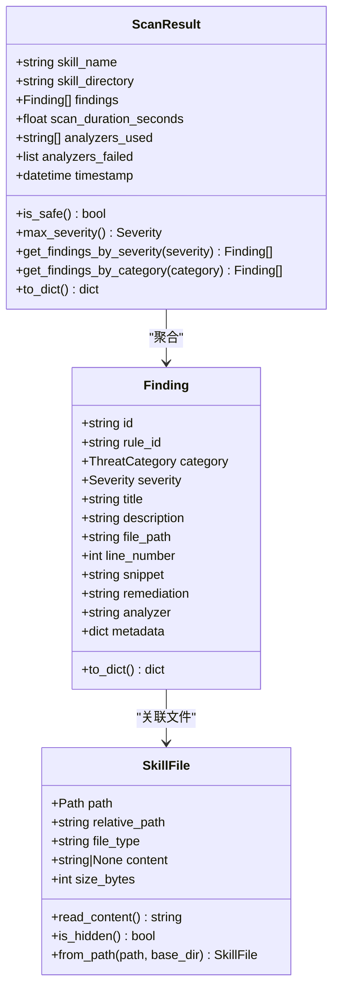
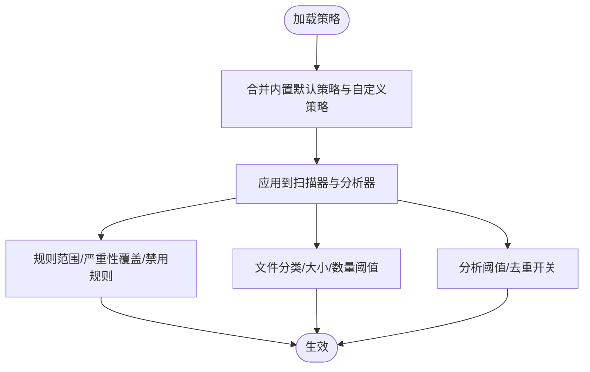
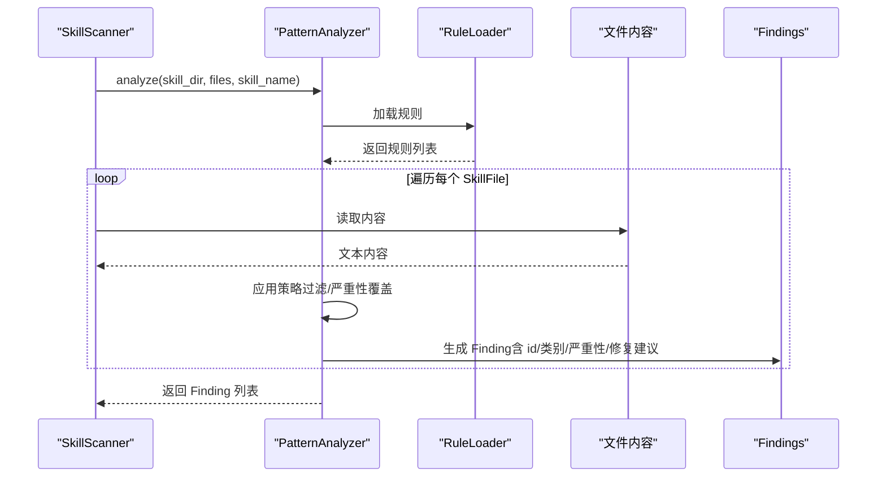
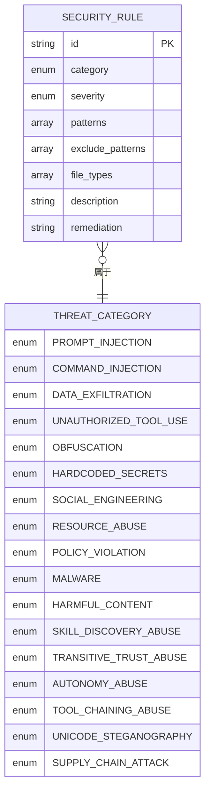
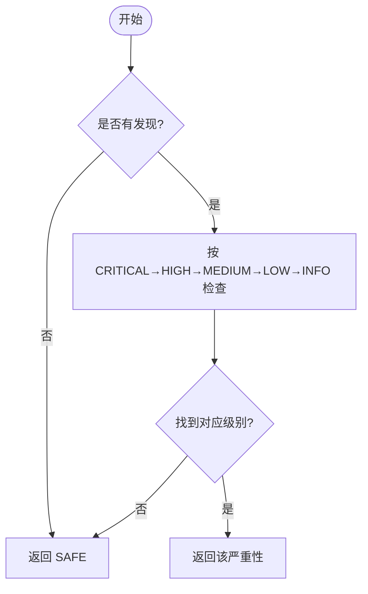
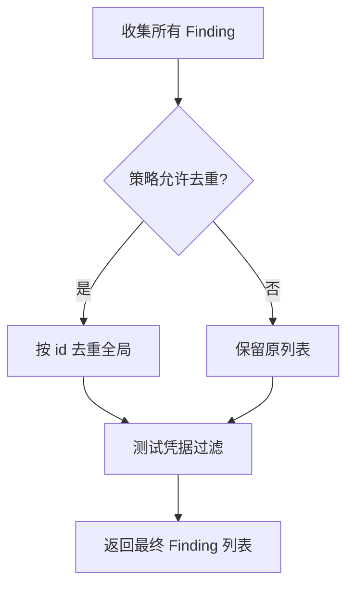
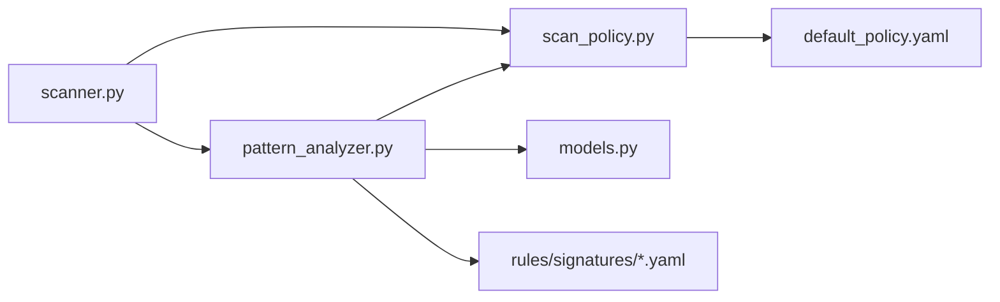

# 扫描结果分析

<cite>
**本文引用的文件**
- [models.py](file://src/qwenpaw/security/skill_scanner/models.py)
- [scanner.py](file://src/qwenpaw/security/skill_scanner/scanner.py)
- [scan_policy.py](file://src/qwenpaw/security/skill_scanner/scan_policy.py)
- [pattern_analyzer.py](file://src/qwenpaw/security/skill_scanner/analyzers/pattern_analyzer.py)
- [__init__.py（分析器基类）](file://src/qwenpaw/security/skill_scanner/analyzers/__init__.py)
- [default_policy.yaml](file://src/qwenpaw/security/skill_scanner/data/default_policy.yaml)
- [command_injection.yaml](file://src/qwenpaw/security/skill_scanner/rules/signatures/command_injection.yaml)
- [hardcoded_secrets.yaml](file://src/qwenpaw/security/skill_scanner/rules/signatures/hardcoded_secrets.yaml)
- [prompt_injection.yaml](file://src/qwenpaw/security/skill_scanner/rules/signatures/prompt_injection.yaml)
</cite>

## 目录
1. [简介](#简介)
2. [项目结构](#项目结构)
3. [核心组件](#核心组件)
4. [架构总览](#架构总览)
5. [详细组件分析](#详细组件分析)
6. [依赖分析](#依赖分析)
7. [性能考量](#性能考量)
8. [故障排查指南](#故障排查指南)
9. [结论](#结论)
10. [附录](#附录)

## 简介
本技术文档围绕 QwenPaw 的“技能包安全扫描”子系统，系统化阐述扫描结果分析流程与数据模型设计。重点包括：
- 数据模型：ScanResult、Finding、SkillFile 的职责与字段语义
- 风险评估与安全状态判断：严重性等级、最高风险判定、安全状态判定
- 发现记录生成机制：规则加载、匹配与去重策略
- 结果排序与呈现：按严重性与类别分组、统计与导出
- 报告解读与修复建议：风险等级划分、修复建议生成与落地实践
- 实战案例与可视化：常见威胁场景、结果解读与图表化展示思路

## 项目结构
扫描子系统位于 src/qwenpaw/security/skill_scanner，采用“策略驱动 + 多分析器并行”的架构：
- models.py：定义 ScanResult、Finding、SkillFile 三类核心数据模型
- scan_policy.py：组织策略对象，支持组织级规则范围、严重性覆盖、文件分类、阈值与去重开关
- scanner.py：扫描编排器，负责文件发现、调用分析器、聚合结果、去重与失败记录
- analyzers/pattern_analyzer.py：基于 YAML 规则签名的正则匹配分析器
- analyzers/__init__.py：抽象分析器基类接口
- data/default_policy.yaml：内置默认策略
- rules/signatures/*.yaml：威胁规则签名集合（命令注入、硬编码密钥、提示注入等）

**图示来源**
- [scanner.py:76-319](file://src/qwenpaw/security/skill_scanner/scanner.py#L76-L319)
- [pattern_analyzer.py:236-393](file://src/qwenpaw/security/skill_scanner/analyzers/pattern_analyzer.py#L236-L393)
- [scan_policy.py:156-476](file://src/qwenpaw/security/skill_scanner/scan_policy.py#L156-L476)
- [models.py:76-235](file://src/qwenpaw/security/skill_scanner/models.py#L76-L235)

**章节来源**
- [scanner.py:1-319](file://src/qwenpaw/security/skill_scanner/scanner.py#L1-L319)
- [scan_policy.py:1-476](file://src/qwenpaw/security/skill_scanner/scan_policy.py#L1-L476)
- [models.py:1-235](file://src/qwenpaw/security/skill_scanner/models.py#L1-L235)

## 核心组件
- ScanResult：单个技能包扫描的聚合结果，包含技能名、目录、发现列表、耗时、使用的分析器、失败的分析器、时间戳以及便捷属性（是否安全、最高严重性）
- Finding：一次具体的安全发现，包含唯一 id、规则 id、威胁类别、严重性、标题、描述、文件路径、行号、片段、修复建议、分析器名称与元数据
- SkillFile：技能包内的文件抽象，包含绝对路径、相对路径、类型（markdown/python/bash 等）、内容、大小，并提供从磁盘读取内容的方法与隐藏文件判断

这些模型共同构成“输入文件 → 规则匹配 → 发现记录 → 聚合结果”的数据闭环。

**章节来源**
- [models.py:76-235](file://src/qwenpaw/security/skill_scanner/models.py#L76-L235)

## 架构总览
扫描流程由 SkillScanner 统筹，按以下步骤执行：
1. 文件发现：遍历技能包目录，排除符号链接、不在边界内、扩展名在跳过清单、超过最大文件大小、超出最大文件数量
2. 分析器执行：逐个分析器调用 analyze，传入技能根目录、已发现的 SkillFile 列表与可选技能名
3. 结果聚合：收集各分析器返回的 Finding 列表，按策略进行去重与测试凭据过滤
4. 去重与失败记录：根据策略开关对重复发现进行去重；捕获分析器异常并记录失败信息
5. 完成输出：构造 ScanResult，包含 is_safe、max_severity、findings_count 等统计字段

**图示来源**
- [scanner.py:148-242](file://src/qwenpaw/security/skill_scanner/scanner.py#L148-L242)
- [pattern_analyzer.py:265-347](file://src/qwenpaw/security/skill_scanner/analyzers/pattern_analyzer.py#L265-L347)

**章节来源**
- [scanner.py:148-242](file://src/qwenpaw/security/skill_scanner/scanner.py#L148-L242)

## 详细组件分析

### 数据模型：ScanResult、Finding、SkillFile
- ScanResult
  - 字段要点：技能名、目录、发现列表、扫描耗时、使用过的分析器、失败的分析器、时间戳
  - 便捷属性：is_safe（无 CRITICAL/HIGH 即为安全）、max_severity（按 CRITICAL→HIGH→MEDIUM→LOW→INFO→SAFE 排序取最高）
  - 导出：to_dict 输出包含统计字段与发现数组
- Finding
  - 字段要点：id（由规则 id + 文件路径 + 行号拼接保证唯一性）、规则 id、类别、严重性、标题、描述、文件路径、行号、片段、修复建议、分析器、元数据
  - 导出：to_dict 将枚举转换为字符串值
- SkillFile
  - 字段要点：绝对路径、相对路径、文件类型（基于后缀映射）、内容、大小
  - 方法：read_content 懒加载内容；is_hidden 判断隐藏文件/目录

**图示来源**
- [models.py:76-235](file://src/qwenpaw/security/skill_scanner/models.py#L76-L235)

**章节来源**
- [models.py:76-235](file://src/qwenpaw/security/skill_scanner/models.py#L76-L235)

### 扫描策略：ScanPolicy
- 组织级定制：支持隐藏文件白名单、规则范围控制（仅文档/仅代码/文档路径跳过）、文件分类（惰性/结构化/归档/代码）、文件数量与大小阈值、分析阈值、严重性覆盖、禁用规则
- 动态加载：支持从 YAML 加载策略并与内置默认策略合并；提供 to_yaml 导出便于编辑
- 运行期应用：分析器与扫描器在运行期读取策略，决定规则启用/禁用、严重性覆盖、文档路径跳过、去重开关等

**图示来源**
- [scan_policy.py:236-476](file://src/qwenpaw/security/skill_scanner/scan_policy.py#L236-L476)
- [default_policy.yaml:1-243](file://src/qwenpaw/security/skill_scanner/data/default_policy.yaml#L1-L243)

**章节来源**
- [scan_policy.py:156-476](file://src/qwenpaw/security/skill_scanner/scan_policy.py#L156-L476)
- [default_policy.yaml:1-243](file://src/qwenpaw/security/skill_scanner/data/default_policy.yaml#L1-L243)

### 分析器基类与 PatternAnalyzer
- BaseAnalyzer：最小接口定义，要求实现 analyze，提供 get_name 与策略访问
- PatternAnalyzer：
  - 规则加载：从 YAML 目录或文件加载 SecurityRule，按类别与文件类型索引
  - 匹配流程：先按行匹配，再对含换行的模式进行多行匹配；支持排除模式
  - 策略集成：根据策略跳过禁用规则、文档路径规则、仅代码规则；支持严重性覆盖
  - 凭据过滤：对“硬编码密钥”类发现，按策略中的测试值与占位符标记自动抑制
  - 去重：按“规则 id + 文件路径 + 行号”去重

**图示来源**
- [pattern_analyzer.py:236-393](file://src/qwenpaw/security/skill_scanner/analyzers/pattern_analyzer.py#L236-L393)
- [pattern_analyzer.py:163-229](file://src/qwenpaw/security/skill_scanner/analyzers/pattern_analyzer.py#L163-L229)

**章节来源**
- [__init__.py:21-90](file://src/qwenpaw/security/skill_scanner/analyzers/__init__.py#L21-L90)
- [pattern_analyzer.py:236-393](file://src/qwenpaw/security/skill_scanner/analyzers/pattern_analyzer.py#L236-L393)

### 威胁类别与规则签名示例
- 命令注入：覆盖 eval/exec/compile、shell=True、find -exec、SVG/PDF 中嵌入脚本等高危模式
- 硬编码密钥：AWS/GitHub/Stripe/JWT/私钥/连接串等
- 提示注入：覆盖系统指令、解除安全限制、绕过策略、泄露系统提示、隐藏动作等

**图示来源**
- [models.py:19-54](file://src/qwenpaw/security/skill_scanner/models.py#L19-L54)
- [command_injection.yaml:1-195](file://src/qwenpaw/security/skill_scanner/rules/signatures/command_injection.yaml#L1-L195)
- [hardcoded_secrets.yaml:1-150](file://src/qwenpaw/security/skill_scanner/rules/signatures/hardcoded_secrets.yaml#L1-L150)
- [prompt_injection.yaml:1-80](file://src/qwenpaw/security/skill_scanner/rules/signatures/prompt_injection.yaml#L1-L80)

**章节来源**
- [command_injection.yaml:1-195](file://src/qwenpaw/security/skill_scanner/rules/signatures/command_injection.yaml#L1-L195)
- [hardcoded_secrets.yaml:1-150](file://src/qwenpaw/security/skill_scanner/rules/signatures/hardcoded_secrets.yaml#L1-L150)
- [prompt_injection.yaml:1-80](file://src/qwenpaw/security/skill_scanner/rules/signatures/prompt_injection.yaml#L1-L80)

### 风险评估与安全状态判断
- 严重性等级：CRITICAL > HIGH > MEDIUM > LOW > INFO > SAFE
- 最高风险：按顺序检查是否存在 CRITICAL/HIGH/MEDIUM/LOW/INFO，存在即返回该级别，否则 SAFE
- 安全状态：若无 CRITICAL/HIGH 发现，则 is_safe 为真
- 结果导出：ScanResult.to_dict 输出包含 is_safe、max_severity、findings_count、findings 数组、扫描耗时、分析器使用情况与失败信息

**图示来源**
- [models.py:186-210](file://src/qwenpaw/security/skill_scanner/models.py#L186-L210)

**章节来源**
- [models.py:186-235](file://src/qwenpaw/security/skill_scanner/models.py#L186-L235)

### 发现记录生成机制与去重策略
- 去重维度：PatternAnalyzer 使用“规则 id + 文件路径 + 行号”作为去重键；SkillScanner 在策略允许时也进行一次全局去重
- 测试凭据抑制：对“硬编码密钥”类发现，按策略中的 known_test_values 与 placeholder_markers 自动过滤
- 规则范围控制：根据策略的 code_only、skip_in_docs、doc_path_indicators、doc_filename_patterns 控制规则触发范围

**图示来源**
- [scanner.py:214-224](file://src/qwenpaw/security/skill_scanner/scanner.py#L214-L224)
- [pattern_analyzer.py:338-347](file://src/qwenpaw/security/skill_scanner/analyzers/pattern_analyzer.py#L338-L347)
- [pattern_analyzer.py:370-380](file://src/qwenpaw/security/skill_scanner/analyzers/pattern_analyzer.py#L370-L380)

**章节来源**
- [scanner.py:214-224](file://src/qwenpaw/security/skill_scanner/scanner.py#L214-L224)
- [pattern_analyzer.py:338-380](file://src/qwenpaw/security/skill_scanner/analyzers/pattern_analyzer.py#L338-L380)

### 结果排序与呈现规则
- 排序建议（基于模型能力）：
  - 按严重性降序（CRITICAL→HIGH→MEDIUM→LOW→INFO），同级别按类别分组
  - 同类别下按文件路径与行号排序，便于快速定位
- 统计与导出：
  - ScanResult 提供 is_safe、max_severity、findings_count 等字段
  - to_dict 输出可用于前端渲染或报告生成

**章节来源**
- [models.py:211-235](file://src/qwenpaw/security/skill_scanner/models.py#L211-L235)

### 扫描报告解读与修复建议
- 风险等级划分：依据模型中 Severity 枚举，结合 is_safe 与 max_severity 快速识别整体风险
- 修复建议来源：规则签名中的 remediation 字段直接用于生成建议
- 建议生成流程：
  - 以类别分组展示发现，优先处理 CRITICAL/HIGH
  - 对同一规则的多个命中，合并为一条建议并标注涉及文件
  - 提供“最小修复路径”：删除/替换/注释相关代码，或调整策略

**章节来源**
- [models.py:19-27](file://src/qwenpaw/security/skill_scanner/models.py#L19-L27)
- [pattern_analyzer.py:315-336](file://src/qwenpaw/security/skill_scanner/analyzers/pattern_analyzer.py#L315-L336)

### 可视化展示方法
- 发现分布图：按严重性与类别统计柱状图
- 文件热力图：按文件路径与行号标注风险密度
- 规则命中趋势：随时间变化的规则命中数折线图
- 建议卡片：每条建议附带规则 id、文件路径、行号、片段与修复步骤

[本节为概念性说明，不直接分析具体源码文件]

## 依赖分析
- 组件耦合
  - SkillScanner 依赖 ScanPolicy 与 BaseAnalyzer 子类（如 PatternAnalyzer）
  - PatternAnalyzer 依赖 ScanPolicy 与 RuleLoader，后者依赖规则签名 YAML
  - ScanPolicy 依赖 YAML 解析与策略合并逻辑
- 关键依赖链
  - scanner.py → analyzers/pattern_analyzer.py → analyzers/__init__.py
  - scanner.py → scan_policy.py → data/default_policy.yaml
  - pattern_analyzer.py → models.py

**图示来源**
- [scanner.py:24-27](file://src/qwenpaw/security/skill_scanner/scanner.py#L24-L27)
- [pattern_analyzer.py:17-19](file://src/qwenpaw/security/skill_scanner/analyzers/pattern_analyzer.py#L17-L19)
- [scan_policy.py:261-282](file://src/qwenpaw/security/skill_scanner/scan_policy.py#L261-L282)

**章节来源**
- [scanner.py:24-27](file://src/qwenpaw/security/skill_scanner/scanner.py#L24-L27)
- [pattern_analyzer.py:17-19](file://src/qwenpaw/security/skill_scanner/analyzers/pattern_analyzer.py#L17-L19)
- [scan_policy.py:261-282](file://src/qwenpaw/security/skill_scanner/scan_policy.py#L261-L282)

## 性能考量
- 文件发现阶段
  - 通过最大文件数量与最大文件大小阈值限制 IO 与内存占用
  - 跳过扩展名在策略/默认跳过清单中的文件，减少无关扫描
- 正则匹配优化
  - 先行按行匹配，再对含换行的模式进行多行匹配，避免全量内容扫描
  - 规则加载时编译正则，缓存按文件类型筛选结果
- 并发与容错
  - 分析器失败会被捕获并记录，不影响其他分析器执行
  - 建议在上层调用处按需并发扫描多个技能包

[本节提供通用指导，不直接分析具体源码文件]

## 故障排查指南
- 常见问题
  - 扫描无结果：确认策略未禁用所有规则；检查文件是否被跳过（扩展名/大小/数量阈值）
  - 误报/漏报：调整规则签名或策略中的 exclude_patterns、doc_path_indicators、code_only
  - 分析器异常：查看 analyzers_failed 字段，定位具体异常原因
- 定位步骤
  - 检查 ScanResult.analyzers_failed 是否为空
  - 核对 ScanPolicy 的 file_classification、rule_scoping、credentials 设置
  - 验证规则签名文件格式与正则有效性

**章节来源**
- [scanner.py:200-213](file://src/qwenpaw/security/skill_scanner/scanner.py#L200-L213)
- [scan_policy.py:183-193](file://src/qwenpaw/security/skill_scanner/scan_policy.py#L183-L193)

## 结论
本扫描子系统通过“策略驱动 + 多分析器并行”的方式，实现了对技能包的高效、可定制化安全扫描。数据模型清晰、策略灵活、规则丰富，能够有效识别命令注入、硬编码密钥、提示注入等关键威胁，并提供可执行的修复建议。建议在实际落地中结合组织策略与业务场景，持续迭代规则签名与阈值设置，以获得更佳的扫描效果与更低的误报率。

## 附录
- 实战案例（示例）
  - 命令注入：在 Python 中使用 shell=True 或 subprocess 传入用户可控参数，规则会标记为 CRITICAL
  - 硬编码密钥：在代码中出现 AWS/GitHub/Stripe 等密钥或连接串，规则会标记为 CRITICAL 或 HIGH
  - 提示注入：在 Markdown 中出现覆盖系统指令、绕过策略、隐藏动作等语句，规则会标记为 HIGH 或 MEDIUM
- 可视化建议
  - 使用柱状图展示各类威胁数量与占比
  - 使用热力图标注文件中高危模式分布
  - 以卡片形式展示每条修复建议与影响范围

[本节为概念性说明，不直接分析具体源码文件]