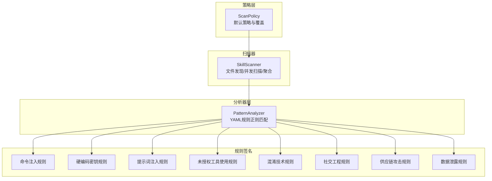
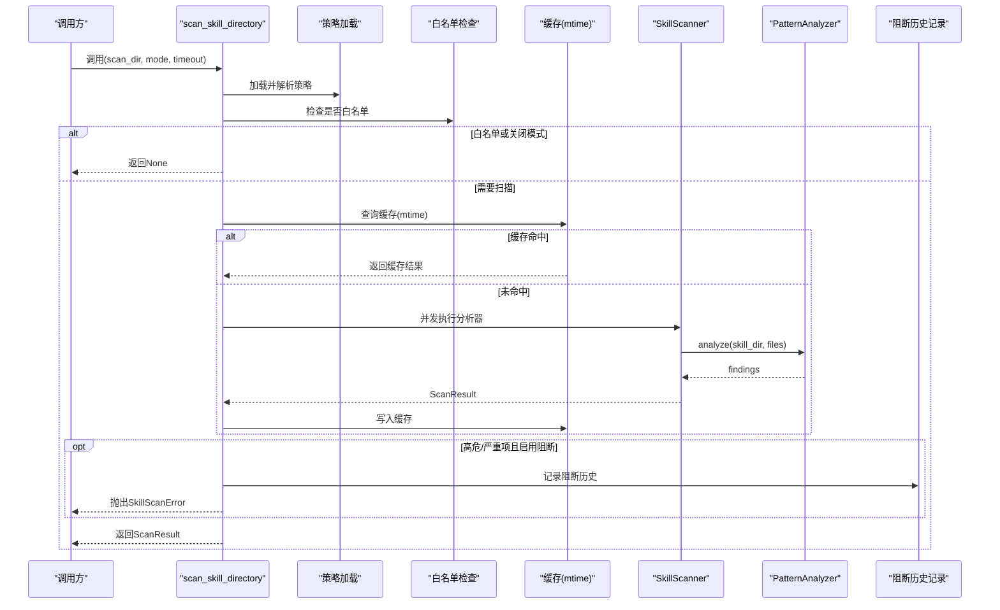
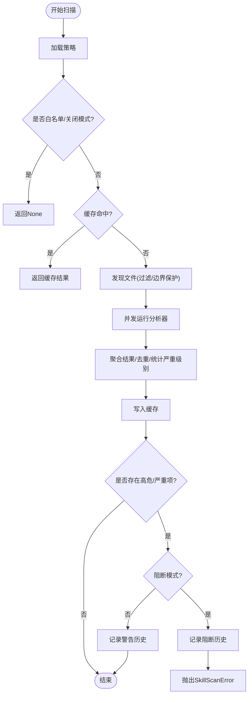
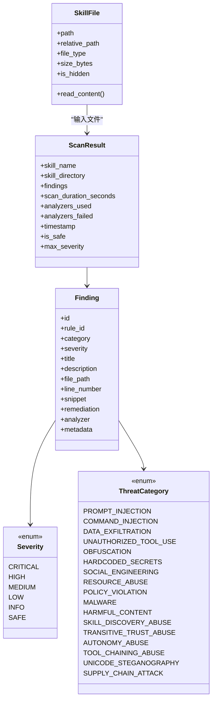
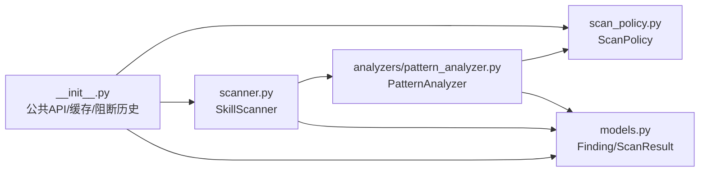

# 技能安全扫描

<cite>
**本文引用的文件**
- [src/qwenpaw/security/skill_scanner/__init__.py](file://src/qwenpaw/security/skill_scanner/__init__.py)
- [src/qwenpaw/security/skill_scanner/scanner.py](file://src/qwenpaw/security/skill_scanner/scanner.py)
- [src/qwenpaw/security/skill_scanner/models.py](file://src/qwenpaw/security/skill_scanner/models.py)
- [src/qwenpaw/security/skill_scanner/scan_policy.py](file://src/qwenpaw/security/skill_scanner/scan_policy.py)
- [src/qwenpaw/security/skill_scanner/analyzers/__init__.py](file://src/qwenpaw/security/skill_scanner/analyzers/__init__.py)
- [src/qwenpaw/security/skill_scanner/analyzers/pattern_analyzer.py](file://src/qwenpaw/security/skill_scanner/analyzers/pattern_analyzer.py)
- [src/qwenpaw/security/skill_scanner/data/default_policy.yaml](file://src/qwenpaw/security/skill_scanner/data/default_policy.yaml)
- [src/qwenpaw/security/skill_scanner/rules/signatures/command_injection.yaml](file://src/qwenpaw/security/skill_scanner/rules/signatures/command_injection.yaml)
- [src/qwenpaw/security/skill_scanner/rules/signatures/hardcoded_secrets.yaml](file://src/qwenpaw/security/skill_scanner/rules/signatures/hardcoded_secrets.yaml)
- [src/qwenpaw/security/skill_scanner/rules/signatures/prompt_injection.yaml](file://src/qwenpaw/security/skill_scanner/rules/signatures/prompt_injection.yaml)
- [src/qwenpaw/security/skill_scanner/rules/signatures/unauthorized_tool_use.yaml](file://src/qwenpaw/security/skill_scanner/rules/signatures/unauthorized_tool_use.yaml)
- [src/qwenpaw/security/skill_scanner/rules/signatures/obfuscation.yaml](file://src/qwenpaw/security/skill_scanner/rules/signatures/obfuscation.yaml)
- [src/qwenpaw/security/skill_scanner/rules/signatures/social_engineering.yaml](file://src/qwenpaw/security/skill_scanner/rules/signatures/social_engineering.yaml)
- [src/qwenpaw/security/skill_scanner/rules/signatures/supply_chain.yaml](file://src/qwenpaw/security/skill_scanner/rules/signatures/supply_chain.yaml)
- [src/qwenpaw/security/skill_scanner/rules/signatures/data_exfiltration.yaml](file://src/qwenpaw/security/skill_scanner/rules/signatures/data_exfiltration.yaml)
</cite>

## 目录
1. [简介](#简介)
2. [项目结构](#项目结构)
3. [核心组件](#核心组件)
4. [架构总览](#架构总览)
5. [详细组件分析](#详细组件分析)
6. [依赖关系分析](#依赖关系分析)
7. [性能考量](#性能考量)
8. [故障排查指南](#故障排查指南)
9. [结论](#结论)
10. [附录](#附录)

## 简介
本文件面向QwenPaw的“技能安全扫描”子系统，提供从架构设计、扫描策略配置到威胁检测算法的全景式技术文档。系统在技能安装与激活前执行静态安全扫描，通过可扩展的分析器框架与可定制的扫描策略，实现对命令注入、数据泄露、硬编码密钥、混淆技术、提示词注入、社交工程、供应链攻击以及未授权工具使用的快速识别与阻断。

## 项目结构
技能安全扫描位于src/qwenpaw/security/skill_scanner目录下，采用“策略-扫描器-分析器-规则签名”的分层组织方式：
- 策略层：ScanPolicy负责组织规则范围、严重性覆盖、文件分类、阈值与白名单等。
- 扫描器：SkillScanner负责文件发现、并发调用分析器、聚合结果与缓存。
- 分析器层：PatternAnalyzer基于YAML规则进行正则匹配；接口预留未来扩展LLM/行为分析等能力。
- 规则签名：按威胁类型分布在rules/signatures目录，每类规则独立文件便于维护与演进。

图示来源
- [src/qwenpaw/security/skill_scanner/scanner.py:76-319](file://src/qwenpaw/security/skill_scanner/scanner.py#L76-L319)
- [src/qwenpaw/security/skill_scanner/analyzers/pattern_analyzer.py:236-393](file://src/qwenpaw/security/skill_scanner/analyzers/pattern_analyzer.py#L236-L393)
- [src/qwenpaw/security/skill_scanner/scan_policy.py:156-476](file://src/qwenpaw/security/skill_scanner/scan_policy.py#L156-L476)

章节来源
- [src/qwenpaw/security/skill_scanner/__init__.py:1-514](file://src/qwenpaw/security/skill_scanner/__init__.py#L1-L514)
- [src/qwenpaw/security/skill_scanner/scanner.py:1-319](file://src/qwenpaw/security/skill_scanner/scanner.py#L1-L319)
- [src/qwenpaw/security/skill_scanner/scan_policy.py:1-476](file://src/qwenpaw/security/skill_scanner/scan_policy.py#L1-L476)

## 核心组件
- 扫描器入口与公共API
  - 提供scan_skill_directory等高层接口，支持扫描模式（block/warn/off）、超时控制、白名单、历史记录与缓存。
- 扫描器SkillScanner
  - 文件发现：递归遍历技能目录，跳过符号链接与越界路径，按策略与阈值筛选文件。
  - 并发扫描：单线程池顺序运行各分析器，避免竞争同时保证可扩展性。
  - 结果聚合：去重、统计最高严重级别、记录失败分析器。
- 数据模型
  - Severity/ThreatCategory枚举、Finding/ScanResult数据结构，统一表示威胁、严重性、类别与扫描结果。
- 扫描策略ScanPolicy
  - 隐藏文件处理、规则范围、凭证抑制、文件分类、文件数量/大小限制、分析阈值、严重性覆盖、禁用规则等。
- 分析器基类BaseAnalyzer与PatternAnalyzer
  - 基类定义最小接口；PatternAnalyzer加载YAML规则，按文件类型与策略过滤后执行行级/多行正则匹配，并支持排除模式与去重。

章节来源
- [src/qwenpaw/security/skill_scanner/__init__.py:424-514](file://src/qwenpaw/security/skill_scanner/__init__.py#L424-L514)
- [src/qwenpaw/security/skill_scanner/scanner.py:148-242](file://src/qwenpaw/security/skill_scanner/scanner.py#L148-L242)
- [src/qwenpaw/security/skill_scanner/models.py:19-235](file://src/qwenpaw/security/skill_scanner/models.py#L19-L235)
- [src/qwenpaw/security/skill_scanner/scan_policy.py:156-476](file://src/qwenpaw/security/skill_scanner/scan_policy.py#L156-L476)
- [src/qwenpaw/security/skill_scanner/analyzers/__init__.py:21-90](file://src/qwenpaw/security/skill_scanner/analyzers/__init__.py#L21-L90)
- [src/qwenpaw/security/skill_scanner/analyzers/pattern_analyzer.py:236-393](file://src/qwenpaw/security/skill_scanner/analyzers/pattern_analyzer.py#L236-L393)

## 架构总览
下图展示了从调用scan_skill_directory到最终返回ScanResult的端到端流程，包含策略加载、白名单检查、缓存命中、并发扫描与结果落盘等关键节点。

图示来源
- [src/qwenpaw/security/skill_scanner/__init__.py:424-514](file://src/qwenpaw/security/skill_scanner/__init__.py#L424-L514)
- [src/qwenpaw/security/skill_scanner/scanner.py:148-242](file://src/qwenpaw/security/skill_scanner/scanner.py#L148-L242)
- [src/qwenpaw/security/skill_scanner/analyzers/pattern_analyzer.py:265-347](file://src/qwenpaw/security/skill_scanner/analyzers/pattern_analyzer.py#L265-L347)

## 详细组件分析

### 扫描策略与默认配置
- 默认策略default_policy.yaml提供组织级基线，涵盖：
  - 隐藏文件白名单（.gitignore/.editorconfig等）
  - 规则范围（仅代码文件触发、文档路径跳过、文档名模式）
  - 凭证抑制（测试占位符与示例值）
  - 文件分类（惰性文件、结构化文件、归档、代码）
  - 文件数量/大小限制、分析阈值
  - 严重性覆盖与禁用规则列表
- ScanPolicy支持从YAML加载、深合并覆盖、导出编辑。

章节来源
- [src/qwenpaw/security/skill_scanner/data/default_policy.yaml:1-243](file://src/qwenpaw/security/skill_scanner/data/default_policy.yaml#L1-L243)
- [src/qwenpaw/security/skill_scanner/scan_policy.py:236-476](file://src/qwenpaw/security/skill_scanner/scan_policy.py#L236-L476)

### PatternAnalyzer与规则签名
- PatternAnalyzer职责
  - 加载YAML规则集，编译正则，按文件类型与策略过滤。
  - 行级匹配优先，随后对含换行的模式进行多行匹配。
  - 应用策略覆盖（严重性、禁用规则、文档路径跳过）。
  - 自动过滤已知测试凭证，支持去重。
- 规则签名覆盖的主要威胁类型
  - 命令注入：eval/exec/compile、shell命令拼接、路径穿越、SQL拼接、SVG/JS恶意嵌入、find -exec危险模式、Node child_process滥用、Function构造器等。
  - 硬编码密钥：AWS/GitHub/Stripe/Google API键、JWT、私钥块、密码变量、连接串等。
  - 提示词注入：覆盖系统指令、解除安全限制、绕过策略、泄露系统提示、隐藏用户交互等。
  - 未授权工具使用：系统包安装、非可信源安装、系统修改命令等。
  - 混淆技术：base64解码+执行链、大段十六进制、XOR编码、二进制文件等。
  - 社交工程：描述模糊、品牌冒用等。
  - 供应链攻击：隐藏文件中的可执行代码等。
  - 数据泄露：网络请求、HTTP POST敏感负载、socket外联、敏感文件读取、编码+网络组合等。

章节来源
- [src/qwenpaw/security/skill_scanner/analyzers/pattern_analyzer.py:236-393](file://src/qwenpaw/security/skill_scanner/analyzers/pattern_analyzer.py#L236-L393)
- [src/qwenpaw/security/skill_scanner/rules/signatures/command_injection.yaml:1-195](file://src/qwenpaw/security/skill_scanner/rules/signatures/command_injection.yaml#L1-L195)
- [src/qwenpaw/security/skill_scanner/rules/signatures/hardcoded_secrets.yaml:1-150](file://src/qwenpaw/security/skill_scanner/rules/signatures/hardcoded_secrets.yaml#L1-L150)
- [src/qwenpaw/security/skill_scanner/rules/signatures/prompt_injection.yaml:1-80](file://src/qwenpaw/security/skill_scanner/rules/signatures/prompt_injection.yaml#L1-L80)
- [src/qwenpaw/security/skill_scanner/rules/signatures/unauthorized_tool_use.yaml:1-60](file://src/qwenpaw/security/skill_scanner/rules/signatures/unauthorized_tool_use.yaml#L1-L60)
- [src/qwenpaw/security/skill_scanner/rules/signatures/obfuscation.yaml:1-47](file://src/qwenpaw/security/skill_scanner/rules/signatures/obfuscation.yaml#L1-L47)
- [src/qwenpaw/security/skill_scanner/rules/signatures/social_engineering.yaml:1-28](file://src/qwenpaw/security/skill_scanner/rules/signatures/social_engineering.yaml#L1-L28)
- [src/qwenpaw/security/skill_scanner/rules/signatures/supply_chain.yaml:1-12](file://src/qwenpaw/security/skill_scanner/rules/signatures/supply_chain.yaml#L1-L12)
- [src/qwenpaw/security/skill_scanner/rules/signatures/data_exfiltration.yaml:1-142](file://src/qwenpaw/security/skill_scanner/rules/signatures/data_exfiltration.yaml#L1-L142)

### 扫描器工作流与错误处理
- 文件发现与边界保护
  - 跳过符号链接与越界路径，确保只扫描技能目录内文件。
  - 按策略与阈值过滤文件（大小、数量、扩展名分类）。
- 并发与容错
  - 使用单线程池顺序执行分析器，避免资源竞争。
  - 捕获分析器异常并记录失败原因，不影响整体扫描。
- 结果聚合与去重
  - 合并所有分析器结果，按策略决定是否去重。
  - 统计最高严重级别，生成ScanResult。
- 错误与阻断
  - 当存在高危/严重项且阻断模式开启时，抛出SkillScanError并记录阻断历史。

图示来源
- [src/qwenpaw/security/skill_scanner/scanner.py:181-242](file://src/qwenpaw/security/skill_scanner/scanner.py#L181-L242)
- [src/qwenpaw/security/skill_scanner/__init__.py:424-514](file://src/qwenpaw/security/skill_scanner/__init__.py#L424-L514)

章节来源
- [src/qwenpaw/security/skill_scanner/scanner.py:148-242](file://src/qwenpaw/security/skill_scanner/scanner.py#L148-L242)
- [src/qwenpaw/security/skill_scanner/__init__.py:424-514](file://src/qwenpaw/security/skill_scanner/__init__.py#L424-L514)

### 类型与数据模型

图示来源
- [src/qwenpaw/security/skill_scanner/models.py:19-235](file://src/qwenpaw/security/skill_scanner/models.py#L19-L235)

章节来源
- [src/qwenpaw/security/skill_scanner/models.py:19-235](file://src/qwenpaw/security/skill_scanner/models.py#L19-L235)

### 威胁检测算法与规则设计要点
- 正则匹配策略
  - 行级优先：快速过滤常见模式，降低CPU消耗。
  - 多行模式：对含换行的复杂模式进行全文匹配，结合字符类剔除逻辑避免误报。
  - 排除模式：对测试/示例/注释等上下文进行排除，减少误报。
- 规则范围控制
  - 仅代码文件触发：如eval/exec仅在Python/JS等脚本文件中报警。
  - 文档路径跳过：对docs/examples等目录跳过部分规则。
  - 严重性覆盖：允许组织根据自身风险偏好调整规则严重性。
- 凭证抑制
  - 已知测试值与占位符标记自动抑制，避免误报。
- 去重与稳定性
  - 基于规则ID+文件路径+行号的复合键去重，提升报告质量。

章节来源
- [src/qwenpaw/security/skill_scanner/analyzers/pattern_analyzer.py:93-155](file://src/qwenpaw/security/skill_scanner/analyzers/pattern_analyzer.py#L93-L155)
- [src/qwenpaw/security/skill_scanner/scan_policy.py:82-140](file://src/qwenpaw/security/skill_scanner/scan_policy.py#L82-L140)

## 依赖关系分析
- 组件耦合
  - SkillScanner依赖ScanPolicy与BaseAnalyzer接口，具体实现由PatternAnalyzer提供。
  - PatternAnalyzer依赖ScanPolicy进行规则范围与严重性覆盖。
  - 扫描入口模块依赖配置加载、环境变量、工作目录与历史记录持久化。
- 外部依赖
  - YAML解析用于加载策略与规则签名。
  - 正则表达式库用于模式匹配。
  - 并发线程池用于顺序执行分析器，避免资源竞争。
- 循环依赖
  - 通过延迟导入避免循环依赖（例如BaseAnalyzer在TYPE_CHECKING分支中导入ScanPolicy）。

图示来源
- [src/qwenpaw/security/skill_scanner/__init__.py:43-76](file://src/qwenpaw/security/skill_scanner/__init__.py#L43-L76)
- [src/qwenpaw/security/skill_scanner/scanner.py:24-27](file://src/qwenpaw/security/skill_scanner/scanner.py#L24-L27)
- [src/qwenpaw/security/skill_scanner/analyzers/pattern_analyzer.py:17-19](file://src/qwenpaw/security/skill_scanner/analyzers/pattern_analyzer.py#L17-L19)

章节来源
- [src/qwenpaw/security/skill_scanner/__init__.py:43-76](file://src/qwenpaw/security/skill_scanner/__init__.py#L43-L76)
- [src/qwenpaw/security/skill_scanner/scanner.py:24-27](file://src/qwenpaw/security/skill_scanner/scanner.py#L24-L27)
- [src/qwenpaw/security/skill_scanner/analyzers/pattern_analyzer.py:17-19](file://src/qwenpaw/security/skill_scanner/analyzers/pattern_analyzer.py#L17-L19)

## 性能考量
- 文件发现与过滤
  - 通过策略与阈值提前筛除大文件与归档文件，降低IO与内存压力。
  - 对符号链接与越界路径进行严格校验，避免无效扫描。
- 匹配效率
  - 行级正则优先，多行模式仅在必要时启用，减少全局扫描成本。
  - 正则长度与复杂度受策略阈值限制，防止耗时模式。
- 缓存机制
  - 基于目录与文件最新修改时间的LRU缓存，显著降低重复扫描开销。
- 并发模型
  - 单线程池顺序执行分析器，避免锁争用与资源竞争，适合CPU密集型规则。

章节来源
- [src/qwenpaw/security/skill_scanner/scanner.py:248-299](file://src/qwenpaw/security/skill_scanner/scanner.py#L248-L299)
- [src/qwenpaw/security/skill_scanner/scan_policy.py:134-140](file://src/qwenpaw/security/skill_scanner/scan_policy.py#L134-L140)
- [src/qwenpaw/security/skill_scanner/__init__.py:356-390](file://src/qwenpaw/security/skill_scanner/__init__.py#L356-L390)

## 故障排查指南
- 常见问题
  - 扫描超时：检查timeout配置与文件数量/大小阈值；适当放宽阈值或拆分技能包。
  - 误报过多：通过策略的doc_path_indicators、doc_filename_patterns、exclude_patterns与known_test_values进行抑制。
  - 规则不生效：确认规则ID未被disabled_rules禁用，且未被code_only限制在非代码文件。
  - 阻断误判：使用is_skill_whitelisted或调整策略severity_overrides。
- 定位手段
  - 查看ScanResult.analyzers_failed了解分析器异常。
  - 检查阻断历史文件以复盘告警与处置记录。
  - 开启更详细的日志级别定位具体文件与规则。

章节来源
- [src/qwenpaw/security/skill_scanner/__init__.py:240-312](file://src/qwenpaw/security/skill_scanner/__init__.py#L240-L312)
- [src/qwenpaw/security/skill_scanner/scanner.py:194-213](file://src/qwenpaw/security/skill_scanner/scanner.py#L194-L213)

## 结论
QwenPaw技能安全扫描系统以轻量、可扩展、可定制为核心设计目标，通过策略驱动的规则体系与高效的正则匹配，在技能生命周期早期即能有效拦截多种高风险威胁。默认策略提供平衡的安全基线，组织可通过策略文件灵活调整规则范围、严重性与阈值，满足不同合规与风险偏好需求。

## 附录

### 默认策略配置清单
- 隐藏文件白名单：.gitignore、.editorconfig、.env.example等。
- 规则范围：skip_in_docs/code_only/doc_path_indicators/doc_filename_patterns。
- 凭证抑制：known_test_values与placeholder_markers。
- 文件分类：inert/structured/archive/code扩展集合。
- 文件限制：最大文件数、最大文件大小、名称/描述长度等。
- 分析阈值：最小置信度、最大正则长度。
- 严重性覆盖与禁用规则：空列表作为默认，可按需扩展。

章节来源
- [src/qwenpaw/security/skill_scanner/data/default_policy.yaml:16-243](file://src/qwenpaw/security/skill_scanner/data/default_policy.yaml#L16-L243)
- [src/qwenpaw/security/skill_scanner/scan_policy.py:156-476](file://src/qwenpaw/security/skill_scanner/scan_policy.py#L156-L476)

### 自定义规则编写指引
- 规则文件组织
  - 将新规则按威胁类型放入对应YAML文件，遵循现有字段与命名风格。
- 字段说明
  - id：唯一标识，建议使用UPPER_UNDERSCORE格式。
  - category：威胁类别枚举之一。
  - severity：严重性等级。
  - patterns/exclude_patterns：正则列表，注意长度限制与上下文排除。
  - file_types：限定文件类型，避免跨文件误报。
  - description/remediation：清晰的描述与修复建议。
- 策略覆盖
  - 在策略中通过severity_overrides调整严重性，或通过disabled_rules禁用特定规则。
  - 通过code_only限制规则仅在代码文件触发，通过skip_in_docs跳过文档路径。

章节来源
- [src/qwenpaw/security/skill_scanner/analyzers/pattern_analyzer.py:38-92](file://src/qwenpaw/security/skill_scanner/analyzers/pattern_analyzer.py#L38-L92)
- [src/qwenpaw/security/skill_scanner/scan_policy.py:183-193](file://src/qwenpaw/security/skill_scanner/scan_policy.py#L183-L193)

### 扫描结果分析与报告
- 关键指标
  - is_safe：是否存在高危/严重项。
  - max_severity：最高严重性等级。
  - findings：按严重性与类别分组统计。
- 建议流程
  - 首先查看max_severity与findings数量，快速定位风险等级。
  - 按类别筛选（如命令注入/硬编码密钥），逐条核验并修复。
  - 对误报规则提交exclude_patterns或调整策略。

章节来源
- [src/qwenpaw/security/skill_scanner/models.py:186-219](file://src/qwenpaw/security/skill_scanner/models.py#L186-L219)

### 安全审核流程与加固建议
- 审核流程
  - 新技能包入库前执行scan_skill_directory，默认warn模式，阻断模式用于生产环境。
  - 审核人员基于ScanResult与规则描述进行人工复核，必要时调整策略或禁用规则。
  - 记录阻断历史，定期复盘与优化策略。
- 风险评估
  - 依据max_severity与findings类别进行分级评估。
  - 对高危项（CRITICAL）立即阻断，中低危项限期整改。
- 安全加固
  - 移除硬编码密钥与敏感信息，改用环境变量或密钥管理服务。
  - 避免eval/exec/compile与shell=True，改用参数化/白名单方式。
  - 清理隐藏文件中的可执行代码，保持透明。
  - 限制未授权工具使用，仅在必要时提供文档与审批。

章节来源
- [src/qwenpaw/security/skill_scanner/__init__.py:424-514](file://src/qwenpaw/security/skill_scanner/__init__.py#L424-L514)
- [src/qwenpaw/security/skill_scanner/rules/signatures/command_injection.yaml:1-195](file://src/qwenpaw/security/skill_scanner/rules/signatures/command_injection.yaml#L1-L195)
- [src/qwenpaw/security/skill_scanner/rules/signatures/hardcoded_secrets.yaml:1-150](file://src/qwenpaw/security/skill_scanner/rules/signatures/hardcoded_secrets.yaml#L1-L150)
- [src/qwenpaw/security/skill_scanner/rules/signatures/unauthorized_tool_use.yaml:1-60](file://src/qwenpaw/security/skill_scanner/rules/signatures/unauthorized_tool_use.yaml#L1-L60)
- [src/qwenpaw/security/skill_scanner/rules/signatures/supply_chain.yaml:1-12](file://src/qwenpaw/security/skill_scanner/rules/signatures/supply_chain.yaml#L1-L12)