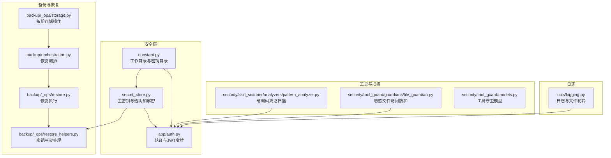
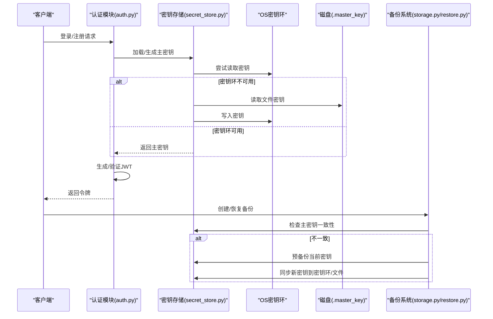
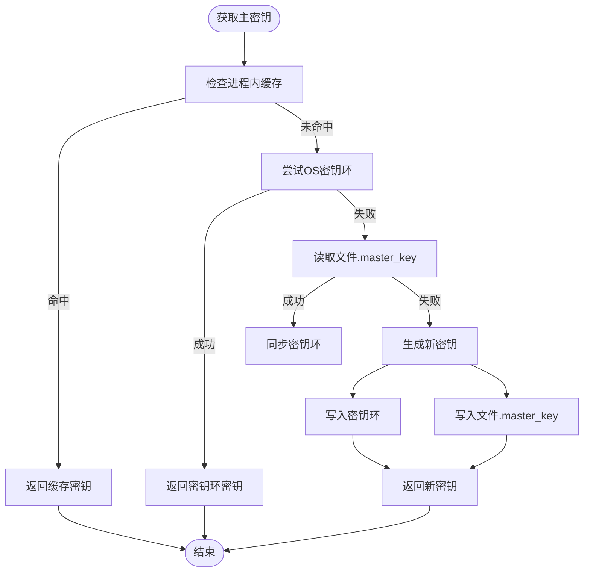
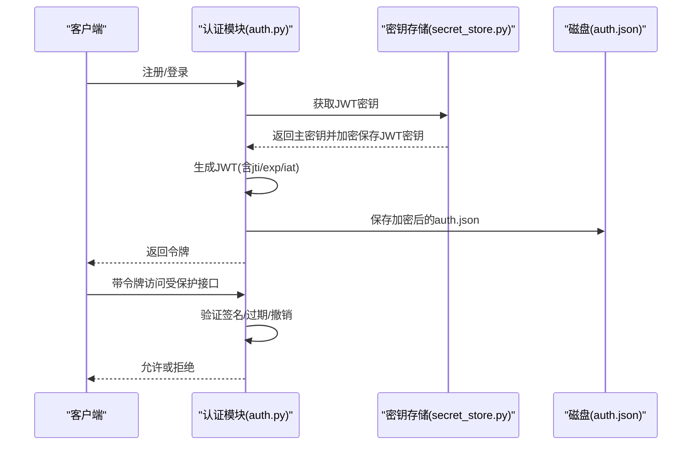
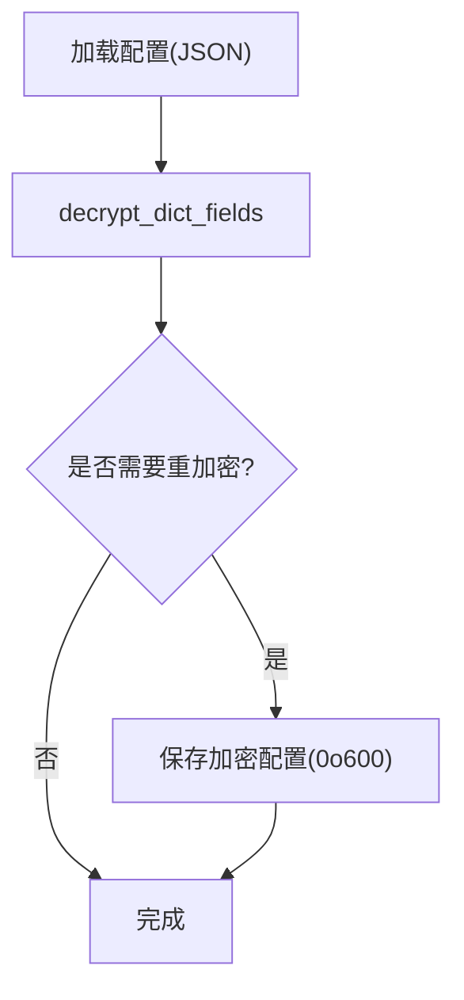
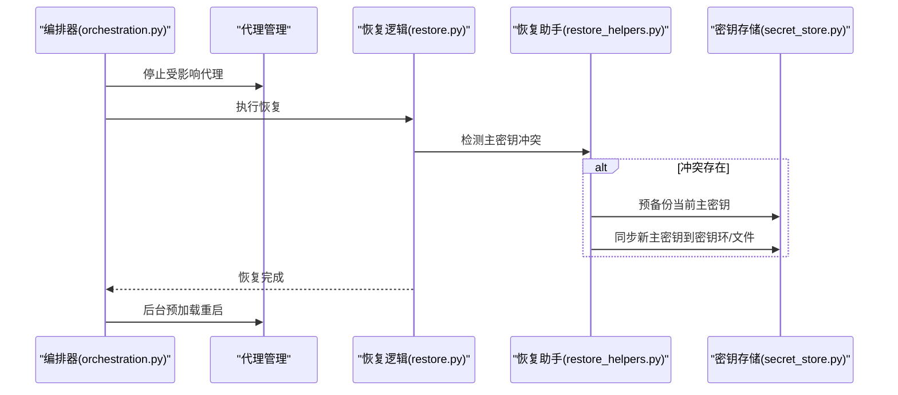
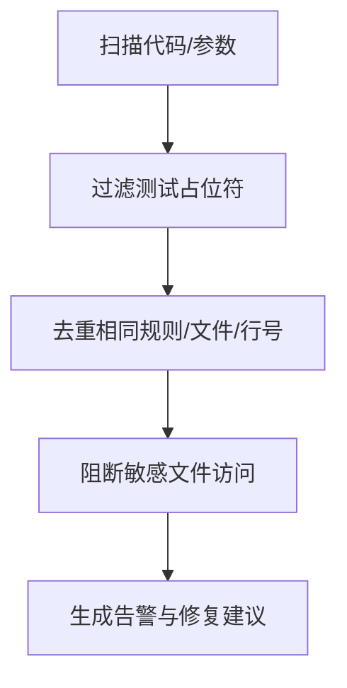
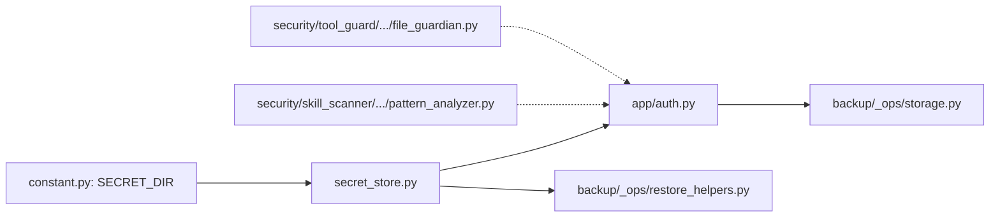

# 敏感信息存储

<cite>
**本文引用的文件**
- [secret_store.py](file://src/qwenpaw/security/secret_store.py)
- [auth.py](file://src/qwenpaw/app/auth.py)
- [constant.py](file://src/qwenpaw/constant.py)
- [restore.py](file://src/qwenpaw/backup/_ops/restore.py)
- [restore_helpers.py](file://src/qwenpaw/backup/_ops/restore_helpers.py)
- [storage.py](file://src/qwenpaw/backup/_ops/storage.py)
- [orchestration.py](file://src/qwenpaw/backup/orchestration.py)
- [test_secret_store.py](file://tests/unit/security/test_secret_store.py)
- [pattern_analyzer.py](file://src/qwenpaw/security/skill_scanner/analyzers/pattern_analyzer.py)
- [file_guardian.py](file://src/qwenpaw/security/tool_guard/guardians/file_guardian.py)
- [models.py](file://src/qwenpaw/security/tool_guard/models.py)
- [logging.py](file://src/qwenpaw/utils/logging.py)
- [api-tutorial.en.md](file://website/public/docs/api-tutorial.en.md)
</cite>

## 目录
1. [简介](#简介)
2. [项目结构](#项目结构)
3. [核心组件](#核心组件)
4. [架构总览](#架构总览)
5. [详细组件分析](#详细组件分析)
6. [依赖关系分析](#依赖关系分析)
7. [性能考虑](#性能考虑)
8. [故障排查指南](#故障排查指南)
9. [结论](#结论)
10. [附录](#附录)

## 简介
本文件面向QwenPaw的敏感信息存储系统，系统性阐述密钥管理机制、加密存储策略与访问控制流程；详细说明敏感数据的加密算法、密钥轮换机制与安全存储位置；文档化认证凭据管理、API密钥保护与会话令牌处理；提供敏感信息的生命周期管理、审计日志记录与安全删除机制；并给出密钥管理最佳实践、安全配置建议与故障恢复流程。

## 项目结构
围绕敏感信息存储的关键模块包括：
- 安全层：主密钥管理与透明加解密（secret_store）
- 认证与令牌：密码哈希、JWT签名与黑名单撤销（app/auth）
- 配置与路径：工作目录、密钥目录与环境变量解析（constant）
- 备份与恢复：备份列表、导入导出与恢复编排（backup）
- 工具与扫描：敏感文件访问防护与硬编码凭证扫描（security/tool_guard, security/skill_scanner）
- 日志：统一日志格式与文件轮转（utils/logging）

**图表来源**
- [secret_store.py:1-414](file://src/qwenpaw/security/secret_store.py#L1-L414)
- [auth.py:1-641](file://src/qwenpaw/app/auth.py#L1-L641)
- [constant.py:1-368](file://src/qwenpaw/constant.py#L1-L368)
- [orchestration.py:1-147](file://src/qwenpaw/backup/orchestration.py#L1-L147)
- [restore.py:361-389](file://src/qwenpaw/backup/_ops/restore.py#L361-L389)
- [restore_helpers.py:111-158](file://src/qwenpaw/backup/_ops/restore_helpers.py#L111-L158)
- [storage.py:1-242](file://src/qwenpaw/backup/_ops/storage.py#L1-L242)
- [pattern_analyzer.py:347-380](file://src/qwenpaw/security/skill_scanner/analyzers/pattern_analyzer.py#L347-L380)
- [file_guardian.py:394-424](file://src/qwenpaw/security/tool_guard/guardians/file_guardian.py#L394-L424)
- [models.py:39-77](file://src/qwenpaw/security/tool_guard/models.py#L39-L77)
- [logging.py:1-226](file://src/qwenpaw/utils/logging.py#L1-L226)

**章节来源**
- [secret_store.py:1-414](file://src/qwenpaw/security/secret_store.py#L1-L414)
- [auth.py:1-641](file://src/qwenpaw/app/auth.py#L1-L641)
- [constant.py:102-111](file://src/qwenpaw/constant.py#L102-L111)

## 核心组件
- 主密钥与透明加解密：基于Fernet（对称加密）的主密钥管理，支持OS密钥环与文件两种持久化方式，自动迁移明文字段并提供缓存加速。
- 认证与令牌：单用户注册、密码哈希（SHA-256+盐）、JWT（HMAC-SHA256签名）与撤销列表（黑名单），支持按需生成永久令牌。
- 备份与恢复：备份列表、导入导出、恢复编排；在密钥不一致时进行预恢复备份与密钥同步。
- 工具与扫描：硬编码凭证扫描与敏感文件访问防护，避免凭据泄露与越权访问。
- 日志：统一日志格式与文件轮转，便于审计追踪。

**章节来源**
- [secret_store.py:234-268](file://src/qwenpaw/security/secret_store.py#L234-L268)
- [auth.py:115-123](file://src/qwenpaw/app/auth.py#L115-L123)
- [restore_helpers.py:111-158](file://src/qwenpaw/backup/_ops/restore_helpers.py#L111-L158)
- [pattern_analyzer.py:347-380](file://src/qwenpaw/security/skill_scanner/analyzers/pattern_analyzer.py#L347-L380)
- [file_guardian.py:394-424](file://src/qwenpaw/security/tool_guard/guardians/file_guardian.py#L394-L424)
- [logging.py:154-188](file://src/qwenpaw/utils/logging.py#L154-L188)

## 架构总览
下图展示敏感信息存储系统的整体交互：主密钥从OS密钥环或文件加载，透明加解密用于API密钥与JWT密钥等敏感字段；认证模块使用主密钥加密保存JWT密钥，并通过撤销列表实现令牌失效；备份恢复流程在密钥冲突时进行预备份与同步。

**图表来源**
- [auth.py:115-123](file://src/qwenpaw/app/auth.py#L115-L123)
- [secret_store.py:119-188](file://src/qwenpaw/security/secret_store.py#L119-L188)
- [restore_helpers.py:111-158](file://src/qwenpaw/backup/_ops/restore_helpers.py#L111-L158)
- [storage.py:1-242](file://src/qwenpaw/backup/_ops/storage.py#L1-L242)
- [restore.py:361-389](file://src/qwenpaw/backup/_ops/restore.py#L361-L389)

## 详细组件分析

### 组件A：主密钥管理与透明加解密
- 主密钥来源与顺序：进程内缓存 → OS密钥环 → 文件（.master_key） → 生成新密钥并写回密钥环与文件。
- 双重检查锁定与线程安全：避免并发启动时重复生成密钥。
- 透明加解密：对API密钥与JWT密钥等字段进行加密存储，自动识别已加密值避免重复加密。
- 失败降级：解密失败返回原始密文，保证系统稳定运行。
- 密钥轮换：通过重新生成主密钥并更新密钥环/文件实现，不影响历史加密数据的可读性（同一主密钥下）。

**图表来源**
- [secret_store.py:234-268](file://src/qwenpaw/security/secret_store.py#L234-L268)
- [secret_store.py:119-188](file://src/qwenpaw/security/secret_store.py#L119-L188)
- [secret_store.py:195-227](file://src/qwenpaw/security/secret_store.py#L195-L227)

**章节来源**
- [secret_store.py:234-268](file://src/qwenpaw/security/secret_store.py#L234-L268)
- [secret_store.py:119-188](file://src/qwenpaw/security/secret_store.py#L119-L188)
- [secret_store.py:195-227](file://src/qwenpaw/security/secret_store.py#L195-L227)
- [secret_store.py:293-321](file://src/qwenpaw/security/secret_store.py#L293-L321)
- [secret_store.py:383-413](file://src/qwenpaw/security/secret_store.py#L383-L413)

### 组件B：认证凭据与会话令牌
- 单用户注册：首次注册后启用认证；后续可通过环境变量自动注册管理员账户。
- 密码存储：使用SHA-256哈希+随机盐，确保不可逆存储。
- JWT令牌：HMAC-SHA256签名，支持自定义过期时间（最大100年），支持永久令牌（特殊值）。
- 令牌撤销：维护撤销列表（字典O(1)查询），支持单个撤销与全部撤销（旋转JWT密钥）。
- 中间件：对受保护路由进行Bearer令牌校验，支持白名单主机跳过认证。

**图表来源**
- [auth.py:115-123](file://src/qwenpaw/app/auth.py#L115-L123)
- [auth.py:166-198](file://src/qwenpaw/app/auth.py#L166-L198)
- [auth.py:206-254](file://src/qwenpaw/app/auth.py#L206-L254)
- [secret_store.py:383-413](file://src/qwenpaw/security/secret_store.py#L383-L413)

**章节来源**
- [auth.py:115-123](file://src/qwenpaw/app/auth.py#L115-L123)
- [auth.py:166-198](file://src/qwenpaw/app/auth.py#L166-L198)
- [auth.py:206-254](file://src/qwenpaw/app/auth.py#L206-L254)
- [auth.py:498-559](file://src/qwenpaw/app/auth.py#L498-L559)
- [auth.py:567-641](file://src/qwenpaw/app/auth.py#L567-L641)

### 组件C：API密钥保护与持久化
- 字段选择：仅对api_key等敏感字段进行加密存储。
- 自动迁移：检测明文字段并在加载时透明重加密。
- 加载/保存：加载时解密，保存时加密，严格权限（0o600）。

**图表来源**
- [auth.py:206-254](file://src/qwenpaw/app/auth.py#L206-L254)
- [secret_store.py:383-413](file://src/qwenpaw/security/secret_store.py#L383-L413)

**章节来源**
- [auth.py:206-254](file://src/qwenpaw/app/auth.py#L206-L254)
- [secret_store.py:376-381](file://src/qwenpaw/security/secret_store.py#L376-L381)
- [secret_store.py:383-413](file://src/qwenpaw/security/secret_store.py#L383-L413)

### 组件D：备份与恢复中的密钥处理
- 编排流程：停止可能持有句柄的代理 → 执行恢复 → 后台预加载重启。
- 密钥冲突处理：当备份中主密钥与当前不一致时，先将当前密钥备份至备份目录，再同步新密钥。
- 恢复一致性：确保恢复后密钥环与磁盘一致，避免运行时无法解密。

**图表来源**
- [orchestration.py:44-147](file://src/qwenpaw/backup/orchestration.py#L44-L147)
- [restore.py:361-389](file://src/qwenpaw/backup/_ops/restore.py#L361-L389)
- [restore_helpers.py:111-158](file://src/qwenpaw/backup/_ops/restore_helpers.py#L111-L158)
- [secret_store.py:329-369](file://src/qwenpaw/security/secret_store.py#L329-L369)

**章节来源**
- [orchestration.py:44-147](file://src/qwenpaw/backup/orchestration.py#L44-L147)
- [restore.py:361-389](file://src/qwenpaw/backup/_ops/restore.py#L361-L389)
- [restore_helpers.py:111-158](file://src/qwenpaw/backup/_ops/restore_helpers.py#L111-L158)
- [secret_store.py:329-369](file://src/qwenpaw/security/secret_store.py#L329-L369)

### 组件E：工具与扫描中的敏感信息防护
- 硬编码凭证扫描：过滤测试占位符，去重重复发现，避免误报。
- 敏感文件访问防护：阻断工具参数中指向敏感文件的访问，提供修复建议。

**图表来源**
- [pattern_analyzer.py:347-380](file://src/qwenpaw/security/skill_scanner/analyzers/pattern_analyzer.py#L347-L380)
- [file_guardian.py:394-424](file://src/qwenpaw/security/tool_guard/guardians/file_guardian.py#L394-L424)
- [models.py:39-77](file://src/qwenpaw/security/tool_guard/models.py#L39-L77)

**章节来源**
- [pattern_analyzer.py:347-380](file://src/qwenpaw/security/skill_scanner/analyzers/pattern_analyzer.py#L347-L380)
- [file_guardian.py:394-424](file://src/qwenpaw/security/tool_guard/guardians/file_guardian.py#L394-L424)
- [models.py:39-77](file://src/qwenpaw/security/tool_guard/models.py#L39-L77)

## 依赖关系分析
- 路径与配置：SECRET_DIR由常量模块解析，作为所有敏感文件的根目录。
- 认证模块依赖密钥存储模块进行JWT密钥的透明加密保存。
- 备份模块依赖密钥存储模块进行密钥一致性检查与同步。
- 工具与扫描模块独立于主密钥，但与认证/配置相关联以避免泄露。

**图表来源**
- [constant.py:102-111](file://src/qwenpaw/constant.py#L102-L111)
- [secret_store.py:1-414](file://src/qwenpaw/security/secret_store.py#L1-L414)
- [auth.py:1-641](file://src/qwenpaw/app/auth.py#L1-L641)
- [restore_helpers.py:111-158](file://src/qwenpaw/backup/_ops/restore_helpers.py#L111-L158)
- [storage.py:1-242](file://src/qwenpaw/backup/_ops/storage.py#L1-L242)
- [pattern_analyzer.py:347-380](file://src/qwenpaw/security/skill_scanner/analyzers/pattern_analyzer.py#L347-L380)
- [file_guardian.py:394-424](file://src/qwenpaw/security/tool_guard/guardians/file_guardian.py#L394-L424)

**章节来源**
- [constant.py:102-111](file://src/qwenpaw/constant.py#L102-L111)
- [auth.py:32-38](file://src/qwenpaw/app/auth.py#L32-L38)
- [restore_helpers.py:111-158](file://src/qwenpaw/backup/_ops/restore_helpers.py#L111-L158)

## 性能考虑
- 主密钥缓存：进程内缓存减少频繁IO与密钥环调用，提升并发启动性能。
- 双重检查锁定：避免多线程重复生成密钥，降低竞争条件风险。
- 解密降级：解密异常返回原始密文，避免服务崩溃影响用户体验。
- 撤销列表：使用字典O(1)查询，定期清理过期项防止无限增长。
- 日志轮转：文件处理器具备跨平台兼容与锁冲突容错，保障长期运行稳定性。

[本节为通用指导，无需特定文件引用]

## 故障排查指南
- 主密钥不可用
  - 症状：无法读取/写入敏感数据。
  - 排查：确认OS密钥环可用性与超时设置；检查容器/无头环境跳过策略；查看密钥环写入日志。
  - 处理：在文件模式下检查.master_key权限（0o600）与完整性。
- 解密失败
  - 症状：返回原始密文而非明文。
  - 排查：确认主密钥未变更；检查密文格式前缀；查看日志警告。
  - 处理：必要时使用预备份的旧主密钥恢复。
- 令牌无效或被撤销
  - 症状：401未认证或提示令牌无效。
  - 排查：检查签名、过期时间与撤销列表；确认jti存在且未过期。
  - 处理：单个撤销或全部撤销（旋转JWT密钥）。
- 备份恢复失败
  - 症状：恢复后无法解密或密钥不同步。
  - 排查：确认预备份是否成功；检查密钥环同步状态。
  - 处理：重新同步密钥环并重启服务。

**章节来源**
- [secret_store.py:119-188](file://src/qwenpaw/security/secret_store.py#L119-L188)
- [secret_store.py:310-321](file://src/qwenpaw/security/secret_store.py#L310-L321)
- [auth.py:166-198](file://src/qwenpaw/app/auth.py#L166-L198)
- [auth.py:498-559](file://src/qwenpaw/app/auth.py#L498-L559)
- [restore_helpers.py:111-158](file://src/qwenpaw/backup/_ops/restore_helpers.py#L111-L158)

## 结论
QwenPaw的敏感信息存储体系通过“主密钥+透明加解密+多层持久化”的设计，在保证安全性的同时兼顾了可用性与可运维性。配合认证与令牌撤销、备份恢复中的密钥冲突处理以及工具扫描与文件防护，形成了覆盖全生命周期的安全闭环。建议在生产环境中优先使用OS密钥环，严格控制密钥文件权限，并定期审查日志与备份策略。

[本节为总结性内容，无需特定文件引用]

## 附录

### 最佳实践清单
- 使用OS密钥环优先存储主密钥，容器/无头环境自动回退到文件模式。
- 严格限制密钥文件权限（0o600），避免被其他用户读取。
- 定期轮换JWT密钥以撤销所有旧令牌，或在发生泄露时立即执行。
- 对API密钥等敏感字段采用透明加解密，避免明文落盘。
- 在备份恢复前进行密钥一致性检查，必要时预备份当前密钥。
- 启用日志轮转与审计，保留关键事件（解密失败、令牌撤销、密钥同步）日志。

### 安全配置建议
- 环境变量：通过环境变量启用认证与自动注册管理员账户，避免在代码中硬编码凭据。
- 白名单主机：对本地回环地址等可信主机允许跳过认证，减少误伤。
- 令牌有效期：根据业务场景合理设置过期时间，避免长期有效令牌带来的风险。

**章节来源**
- [auth.py:329-339](file://src/qwenpaw/app/auth.py#L329-L339)
- [auth.py:600-627](file://src/qwenpaw/app/auth.py#L600-L627)
- [api-tutorial.en.md:696-854](file://website/public/docs/api-tutorial.en.md#L696-L854)