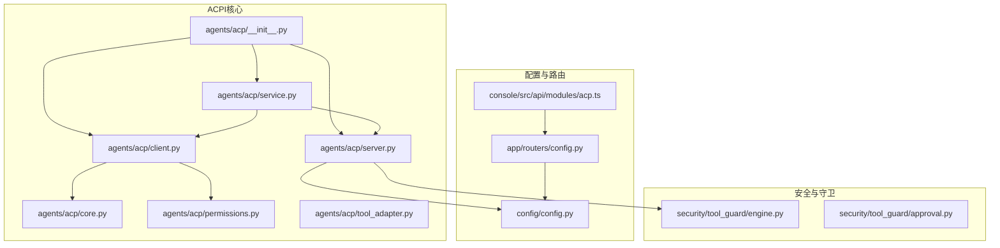
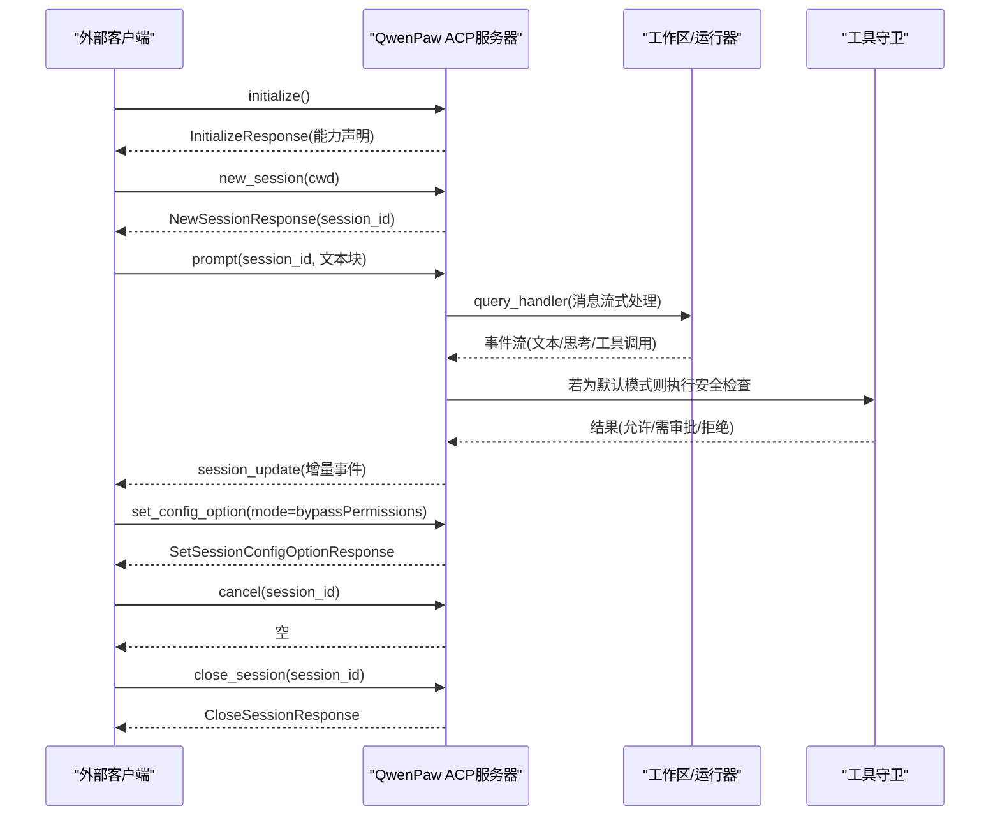
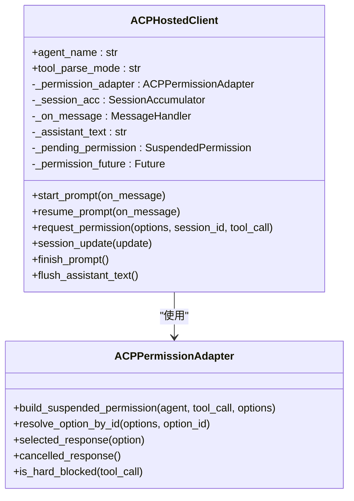
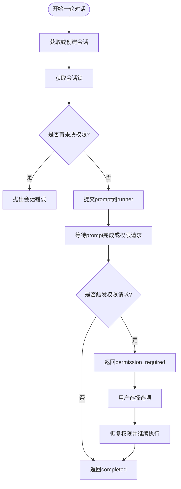
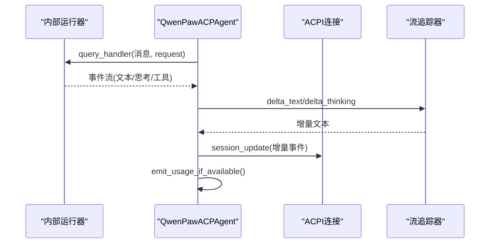
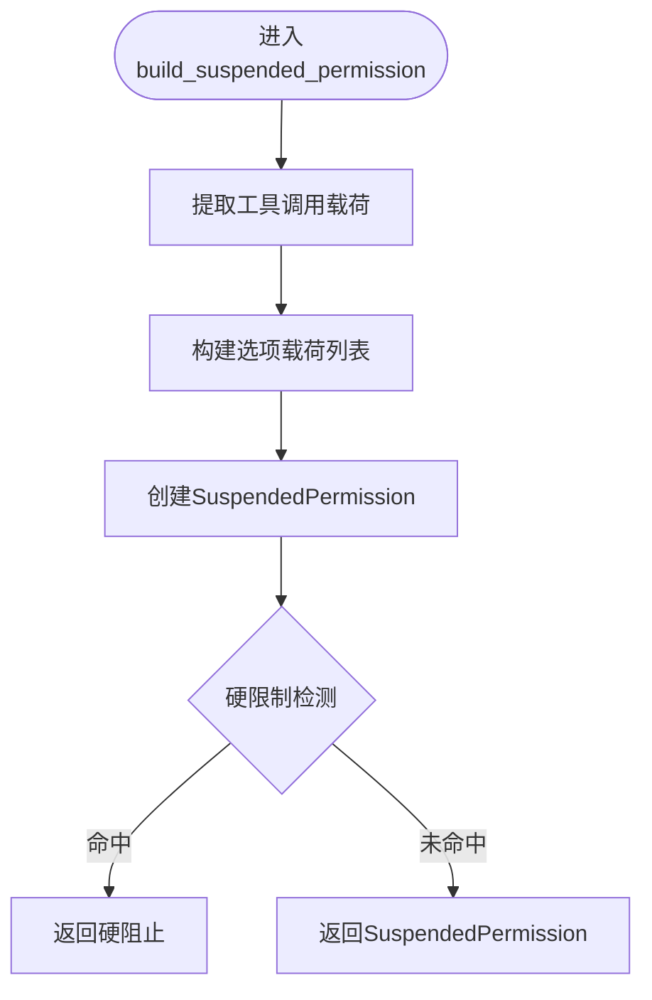
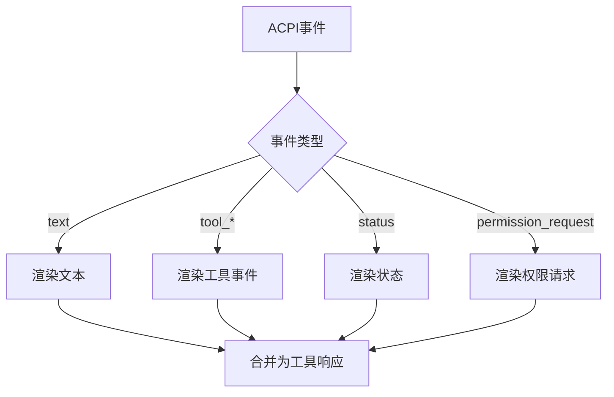
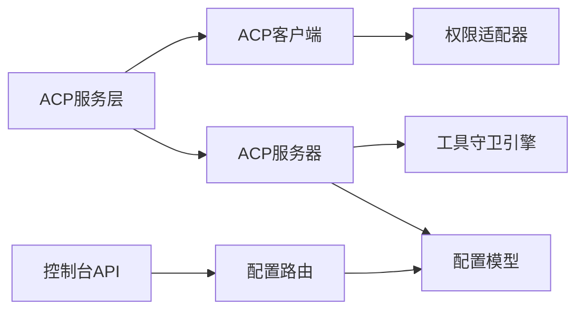

# ACPI权限架构

<cite>
**本文档引用的文件**
- [src/qwenpaw/agents/acp/__init__.py](file://src/qwenpaw/agents/acp/__init__.py)
- [src/qwenpaw/agents/acp/client.py](file://src/qwenpaw/agents/acp/client.py)
- [src/qwenpaw/agents/acp/core.py](file://src/qwenpaw/agents/acp/core.py)
- [src/qwenpaw/agents/acp/permissions.py](file://src/qwenpaw/agents/acp/permissions.py)
- [src/qwenpaw/agents/acp/server.py](file://src/qwenpaw/agents/acp/server.py)
- [src/qwenpaw/agents/acp/service.py](file://src/qwenpaw/agents/acp/service.py)
- [src/qwenpaw/agents/acp/tool_adapter.py](file://src/qwenpaw/agents/acp/tool_adapter.py)
- [src/qwenpaw/config/config.py](file://src/qwenpaw/config/config.py)
- [src/qwenpaw/security/tool_guard/engine.py](file://src/qwenpaw/security/tool_guard/engine.py)
- [src/qwenpaw/security/tool_guard/approval.py](file://src/qwenpaw/security/tool_guard/approval.py)
- [src/qwenpaw/app/routers/config.py](file://src/qwenpaw/app/routers/config.py)
- [console/src/api/modules/acp.ts](file://console/src/api/modules/acp.ts)
- [website/public/docs/acp-integration.zh.md](file://website/public/docs/acp-integration.zh.md)
</cite>

## 目录
1. [简介](#简介)
2. [项目结构](#项目结构)
3. [核心组件](#核心组件)
4. [架构总览](#架构总览)
5. [详细组件分析](#详细组件分析)
6. [依赖关系分析](#依赖关系分析)
7. [性能考虑](#性能考虑)
8. [故障排除指南](#故障排除指南)
9. [结论](#结论)
10. [附录](#附录)

## 简介
本文件系统性阐述QwenPaw的ACPI（Agent Control Protocol）权限架构，涵盖协议设计理念、权限控制机制、分布式权限管理、客户端-服务器通信协议、权限请求与响应流程、权限适配器工作机制、权限状态管理与生命周期控制、消息格式与安全传输、部署配置、性能优化与故障排除等。目标读者包括开发者、运维工程师与安全管理员。

## 项目结构
ACPI相关代码主要位于src/qwenpaw/agents/acp目录，配合配置模块、工具守卫模块与Web控制台API实现完整的权限控制闭环。

**图表来源**
- [src/qwenpaw/agents/acp/__init__.py:1-34](file://src/qwenpaw/agents/acp/__init__.py#L1-L34)
- [src/qwenpaw/agents/acp/client.py:1-467](file://src/qwenpaw/agents/acp/client.py#L1-L467)
- [src/qwenpaw/agents/acp/service.py:1-470](file://src/qwenpaw/agents/acp/service.py#L1-L470)
- [src/qwenpaw/agents/acp/server.py:1-903](file://src/qwenpaw/agents/acp/server.py#L1-L903)
- [src/qwenpaw/config/config.py:1-800](file://src/qwenpaw/config/config.py#L1-L800)
- [src/qwenpaw/app/routers/config.py:404-447](file://src/qwenpaw/app/routers/config.py#L404-L447)
- [console/src/api/modules/acp.ts:1-21](file://console/src/api/modules/acp.ts#L1-L21)

**章节来源**
- [src/qwenpaw/agents/acp/__init__.py:1-34](file://src/qwenpaw/agents/acp/__init__.py#L1-L34)
- [src/qwenpaw/agents/acp/client.py:1-467](file://src/qwenpaw/agents/acp/client.py#L1-L467)
- [src/qwenpaw/agents/acp/service.py:1-470](file://src/qwenpaw/agents/acp/service.py#L1-L470)
- [src/qwenpaw/agents/acp/server.py:1-903](file://src/qwenpaw/agents/acp/server.py#L1-L903)
- [src/qwenpaw/config/config.py:1-800](file://src/qwenpaw/config/config.py#L1-L800)
- [src/qwenpaw/app/routers/config.py:404-447](file://src/qwenpaw/app/routers/config.py#L404-L447)
- [console/src/api/modules/acp.ts:1-21](file://console/src/api/modules/acp.ts#L1-L21)

## 核心组件
- ACP共享定义与错误类型：统一异常体系与权限挂起数据结构
- ACP客户端适配器：封装与外部ACP runner的交互、权限请求与事件渲染
- ACP服务层：管理会话、并发控制、权限恢复与错误处理
- ACP服务器：作为标准ACP Agent通过stdio JSON-RPC对外提供能力
- 权限适配器：构建权限请求、硬限制检测、选项解析与响应生成
- 工具适配器：将ACPI事件转换为工具响应，便于委托工具使用
- 配置与路由：提供ACPI Agent配置的读取与更新接口
- 工具守卫：在会话模式为默认时对工具调用进行安全检查

**章节来源**
- [src/qwenpaw/agents/acp/core.py:1-57](file://src/qwenpaw/agents/acp/core.py#L1-L57)
- [src/qwenpaw/agents/acp/client.py:28-467](file://src/qwenpaw/agents/acp/client.py#L28-L467)
- [src/qwenpaw/agents/acp/service.py:39-470](file://src/qwenpaw/agents/acp/service.py#L39-L470)
- [src/qwenpaw/agents/acp/server.py:327-903](file://src/qwenpaw/agents/acp/server.py#L327-L903)
- [src/qwenpaw/agents/acp/permissions.py:20-221](file://src/qwenpaw/agents/acp/permissions.py#L20-L221)
- [src/qwenpaw/agents/acp/tool_adapter.py:1-242](file://src/qwenpaw/agents/acp/tool_adapter.py#L1-L242)
- [src/qwenpaw/config/config.py:55-118](file://src/qwenpaw/config/config.py#L55-L118)
- [src/qwenpaw/security/tool_guard/engine.py:54-200](file://src/qwenpaw/security/tool_guard/engine.py#L54-L200)

## 架构总览
ACPI采用“客户端-服务器”双模式：
- 作为服务器：QwenPaw通过stdio JSON-RPC暴露Agent能力，外部编辑器/客户端可直接连接
- 作为客户端：QwenPaw通过委托工具连接外部ACP Runner，形成多Agent协作

**图表来源**
- [src/qwenpaw/agents/acp/server.py:439-722](file://src/qwenpaw/agents/acp/server.py#L439-L722)
- [src/qwenpaw/agents/acp/service.py:45-190](file://src/qwenpaw/agents/acp/service.py#L45-L190)
- [src/qwenpaw/security/tool_guard/engine.py:200-269](file://src/qwenpaw/security/tool_guard/engine.py#L200-L269)

## 详细组件分析

### ACP客户端适配器（ACPHostedClient）
职责：
- 与外部ACP runner建立连接并接收事件流
- 将事件转换为统一的消息格式，支持权限请求暂停与恢复
- 构建工具事件（开始/更新/结束）、文本增量、思考内容等
- 管理会话状态与权限挂起

关键流程：
- 权限请求：当runner触发权限请求时，客户端构造权限请求事件并等待用户选择
- 权限恢复：用户选择后，客户端解析选项并返回响应，恢复执行
- 事件渲染：将工具调用、文本、思考等事件转换为统一payload

**图表来源**
- [src/qwenpaw/agents/acp/client.py:28-467](file://src/qwenpaw/agents/acp/client.py#L28-L467)
- [src/qwenpaw/agents/acp/permissions.py:20-221](file://src/qwenpaw/agents/acp/permissions.py#L20-L221)

**章节来源**
- [src/qwenpaw/agents/acp/client.py:28-467](file://src/qwenpaw/agents/acp/client.py#L28-L467)
- [src/qwenpaw/agents/acp/permissions.py:20-221](file://src/qwenpaw/agents/acp/permissions.py#L20-L221)

### ACP服务层（ACPService）
职责：
- 管理会话生命周期：创建、绑定、关闭
- 并发控制：turn_lock保证同一会话串行处理
- 权限恢复：等待权限请求并根据用户选择恢复执行
- 错误处理：统一异常类型与会话状态清理

关键点：
- 会话映射：(chat_id, agent) -> _Conversation
- 并发模型：每个会话独立锁，避免跨会话干扰
- 权限恢复：通过wait_for_permission_request与resolve_permission协调

**图表来源**
- [src/qwenpaw/agents/acp/service.py:45-190](file://src/qwenpaw/agents/acp/service.py#L45-L190)
- [src/qwenpaw/agents/acp/service.py:309-371](file://src/qwenpaw/agents/acp/service.py#L309-L371)

**章节来源**
- [src/qwenpaw/agents/acp/service.py:39-470](file://src/qwenpaw/agents/acp/service.py#L39-L470)

### ACP服务器（QwenPawACPAgent）
职责：
- 实现标准ACP方法：initialize/new_session/prompt/close/list/resume/set_session_model/set_config_option/cancel
- 事件转换：将内部消息转换为ACPI事件流（文本增量、思考、工具调用）
- 会话配置：支持切换模式（默认/绕过权限），影响工具守卫策略
- 工作区生命周期：启动/停止完整工作区，确保能力一致性

**图表来源**
- [src/qwenpaw/agents/acp/server.py:513-607](file://src/qwenpaw/agents/acp/server.py#L513-L607)
- [src/qwenpaw/agents/acp/server.py:100-138](file://src/qwenpaw/agents/acp/server.py#L100-L138)

**章节来源**
- [src/qwenpaw/agents/acp/server.py:327-903](file://src/qwenpaw/agents/acp/server.py#L327-L903)

### 权限适配器（ACPPermissionAdapter）
职责：
- 构建SuspendedPermission：从工具调用提取名称、类型、目标、命令、路径等
- 硬限制检测：基于命令模式与路径范围判断是否禁止
- 选项解析：根据option_id匹配用户选择
- 响应生成：允许/拒绝的ACPI响应对象

**图表来源**
- [src/qwenpaw/agents/acp/permissions.py:24-52](file://src/qwenpaw/agents/acp/permissions.py#L24-L52)
- [src/qwenpaw/agents/acp/permissions.py:90-221](file://src/qwenpaw/agents/acp/permissions.py#L90-L221)

**章节来源**
- [src/qwenpaw/agents/acp/permissions.py:20-221](file://src/qwenpaw/agents/acp/permissions.py#L20-L221)

### 工具适配器（ACPI事件到工具响应）
职责：
- 将ACPI事件渲染为文本片段
- 生成最终助手响应与权限挂起提示
- 生成会话关闭反馈

**图表来源**
- [src/qwenpaw/agents/acp/tool_adapter.py:112-124](file://src/qwenpaw/agents/acp/tool_adapter.py#L112-L124)
- [src/qwenpaw/agents/acp/tool_adapter.py:171-231](file://src/qwenpaw/agents/acp/tool_adapter.py#L171-L231)

**章节来源**
- [src/qwenpaw/agents/acp/tool_adapter.py:1-242](file://src/qwenpaw/agents/acp/tool_adapter.py#L1-L242)

### 配置与API
- 配置模型：ACPAgentConfig/ACPConfig，支持默认runner集合与覆盖
- Web路由：提供ACPI配置的GET/PUT接口
- 控制台API：前端通过REST接口读取/更新ACPI配置

**章节来源**
- [src/qwenpaw/config/config.py:55-118](file://src/qwenpaw/config/config.py#L55-L118)
- [src/qwenpaw/app/routers/config.py:404-447](file://src/qwenpaw/app/routers/config.py#L404-L447)
- [console/src/api/modules/acp.ts:1-21](file://console/src/api/modules/acp.ts#L1-L21)

## 依赖关系分析
- ACP客户端依赖权限适配器与会话累积器
- ACP服务层依赖客户端与服务器，负责并发与会话管理
- ACP服务器依赖工作区/运行器与工具守卫
- 配置模块为所有组件提供统一的ACPI配置来源

**图表来源**
- [src/qwenpaw/agents/acp/client.py:28-467](file://src/qwenpaw/agents/acp/client.py#L28-L467)
- [src/qwenpaw/agents/acp/service.py:39-470](file://src/qwenpaw/agents/acp/service.py#L39-L470)
- [src/qwenpaw/agents/acp/server.py:327-903](file://src/qwenpaw/agents/acp/server.py#L327-L903)
- [src/qwenpaw/config/config.py:55-118](file://src/qwenpaw/config/config.py#L55-L118)
- [src/qwenpaw/app/routers/config.py:404-447](file://src/qwenpaw/app/routers/config.py#L404-L447)
- [console/src/api/modules/acp.ts:1-21](file://console/src/api/modules/acp.ts#L1-L21)

**章节来源**
- [src/qwenpaw/agents/acp/client.py:1-467](file://src/qwenpaw/agents/acp/client.py#L1-L467)
- [src/qwenpaw/agents/acp/service.py:1-470](file://src/qwenpaw/agents/acp/service.py#L1-L470)
- [src/qwenpaw/agents/acp/server.py:1-903](file://src/qwenpaw/agents/acp/server.py#L1-L903)
- [src/qwenpaw/config/config.py:1-800](file://src/qwenpaw/config/config.py#L1-L800)
- [src/qwenpaw/app/routers/config.py:404-447](file://src/qwenpaw/app/routers/config.py#L404-L447)
- [console/src/api/modules/acp.ts:1-21](file://console/src/api/modules/acp.ts#L1-L21)

## 性能考虑
- 事件增量化：服务器端使用流追踪器将累计消息转换为增量文本/思考，降低带宽与内存压力
- 并发控制：会话级锁避免竞态，同时允许多会话并行
- 缓冲限制：stdo缓冲大小可配置，防止大输出导致内存膨胀
- 模型切换：会话级模型切换仅影响当前会话，避免全局状态污染
- 工具守卫：在默认模式下进行安全检查，绕过模式下提升吞吐但降低安全性

[本节为通用指导，无需特定文件引用]

## 故障排除指南
常见问题与定位建议：
- 会话阻塞：若出现“会话正在处理中”或“等待权限”的错误，检查是否有未完成的任务或未处理的权限请求
- 权限恢复：确认用户选择的option_id与权限请求中的选项完全一致
- 模型切换失败：检查provider_id:model_id格式与可用性
- 工作区启动失败：检查agent_id与工作区目录权限
- 工具守卫误判：在绕过模式下禁用工具守卫，或调整规则集

**章节来源**
- [src/qwenpaw/agents/acp/service.py:66-80](file://src/qwenpaw/agents/acp/service.py#L66-L80)
- [src/qwenpaw/agents/acp/server.py:704-722](file://src/qwenpaw/agents/acp/server.py#L704-L722)
- [src/qwenpaw/agents/acp/server.py:826-888](file://src/qwenpaw/agents/acp/server.py#L826-L888)

## 结论
QwenPaw的ACPI权限架构通过“服务器-客户端”双模式实现了灵活的多Agent协作与严格的安全控制。权限适配器与工具守卫共同构成分层安全策略，服务层提供可靠的会话管理与并发控制，配置与API使部署与运维更加便捷。在默认模式下，系统以“最小授权”原则保障安全；在绕过模式下，满足高性能需求。整体设计兼顾易用性、安全性与可扩展性。

[本节为总结性内容，无需特定文件引用]

## 附录

### ACPI消息格式与能力声明
- 初始化：返回协议版本与Agent能力
- 会话管理：new/load/resume/list/close
- 交互：prompt（流式返回文本/思考/工具调用）
- 配置：set_config_option（切换模式）
- 取消：cancel

**章节来源**
- [website/public/docs/acp-integration.zh.md:148-196](file://website/public/docs/acp-integration.zh.md#L148-L196)
- [src/qwenpaw/agents/acp/server.py:439-722](file://src/qwenpaw/agents/acp/server.py#L439-L722)

### 部署配置要点
- ACP Agent配置：command/args/env/trusted/tool_parse_mode/stdio_buffer_limit_bytes
- 会话模式：default（启用工具守卫）/bypassPermissions（绕过安全检查）
- 工作区目录：支持通过CLI参数或配置文件指定

**章节来源**
- [website/public/docs/acp-integration.zh.md:197-204](file://website/public/docs/acp-integration.zh.md#L197-L204)
- [src/qwenpaw/config/config.py:55-118](file://src/qwenpaw/config/config.py#L55-L118)
- [src/qwenpaw/agents/acp/server.py:801-824](file://src/qwenpaw/agents/acp/server.py#L801-L824)