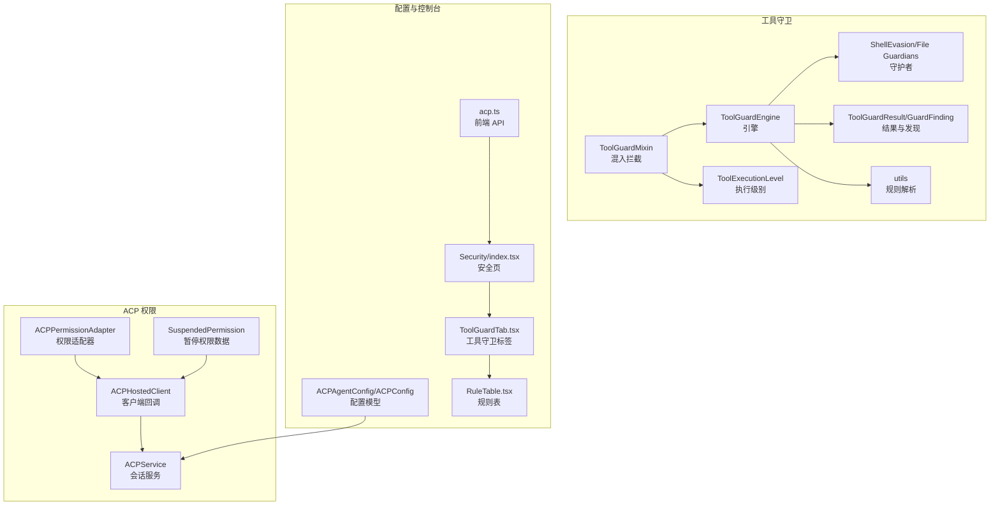
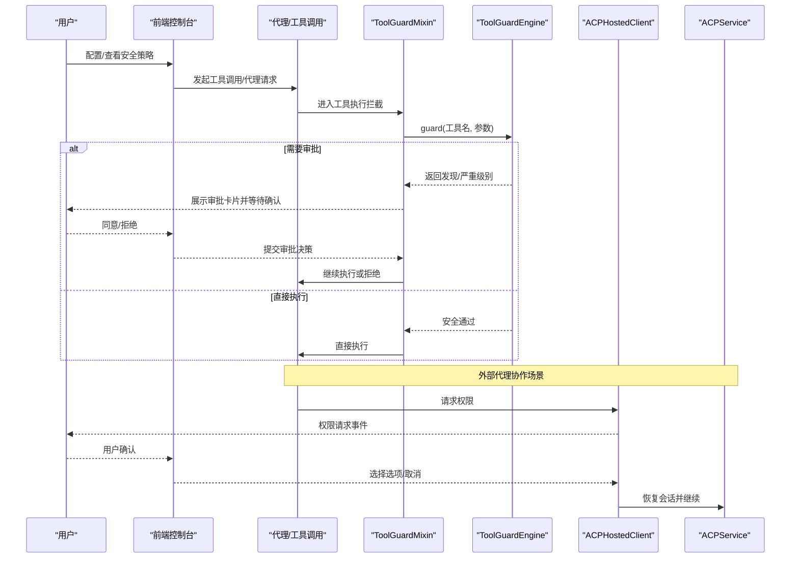
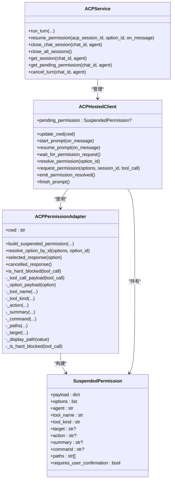
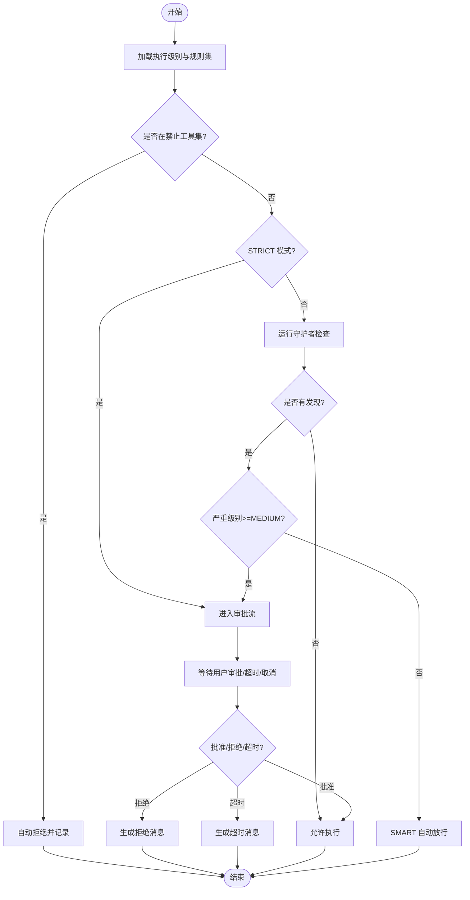
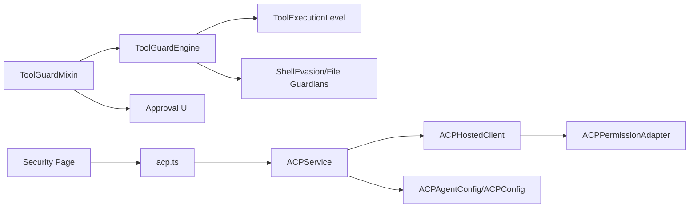

# 基于角色的权限

<cite>
**本文引用的文件**
- [src/qwenpaw/agents/acp/permissions.py](file://src/qwenpaw/agents/acp/permissions.py)
- [src/qwenpaw/agents/acp/core.py](file://src/qwenpaw/agents/acp/core.py)
- [src/qwenpaw/agents/acp/service.py](file://src/qwenpaw/agents/acp/service.py)
- [src/qwenpaw/agents/acp/client.py](file://src/qwenpaw/agents/acp/client.py)
- [src/qwenpaw/agents/tool_guard_mixin.py](file://src/qwenpaw/agents/tool_guard_mixin.py)
- [src/qwenpaw/security/tool_guard/engine.py](file://src/qwenpaw/security/tool_guard/engine.py)
- [src/qwenpaw/security/tool_guard/models.py](file://src/qwenpaw/security/tool_guard/models.py)
- [src/qwenpaw/security/tool_guard/execution_level.py](file://src/qwenpaw/security/tool_guard/execution_level.py)
- [src/qwenpaw/security/tool_guard/utils.py](file://src/qwenpaw/security/tool_guard/utils.py)
- [src/qwenpaw/security/tool_guard/guardians/shell_evasion_guardian.py](file://src/qwenpaw/security/tool_guard/guardians/shell_evasion_guardian.py)
- [src/qwenpaw/security/tool_guard/guardians/file_guardian.py](file://src/qwenpaw/security/tool_guard/guardians/file_guardian.py)
- [src/qwenpaw/config/config.py](file://src/qwenpaw/config/config.py)
- [console/src/api/modules/acp.ts](file://console/src/api/modules/acp.ts)
- [console/src/pages/Settings/Security/index.tsx](file://console/src/pages/Settings/Security/index.tsx)
- [console/src/pages/Settings/Security/components/ToolGuardTab.tsx](file://console/src/pages/Settings/Security/components/ToolGuardTab.tsx)
- [console/src/pages/Settings/Security/components/RuleTable.tsx](file://console/src/pages/Settings/Security/components/RuleTable.tsx)
- [website/public/docs/security.en.md](file://website/public/docs/security.en.md)
- [website/public/docs/acp-integration.en.md](file://website/public/docs/acp-integration.en.md)
</cite>

## 目录
1. [简介](#简介)
2. [项目结构](#项目结构)
3. [核心组件](#核心组件)
4. [架构总览](#架构总览)
5. [详细组件分析](#详细组件分析)
6. [依赖分析](#依赖分析)
7. [性能考虑](#性能考虑)
8. [故障排查指南](#故障排查指南)
9. [结论](#结论)
10. [附录](#附录)

## 简介
本技术文档系统性阐述 QwenPaw 的“基于角色的权限”体系，覆盖角色定义、权限映射、角色继承机制、用户角色分配、代理角色管理、工具执行角色控制、权限适配器实现原理、权限验证流程与权限缓存机制、硬限制规则、路径访问控制与命令过滤机制，并提供角色权限配置示例、权限测试方法与权限审计功能，以及权限冲突解决、优先级处理与动态权限调整策略。

## 项目结构
围绕权限与安全的关键目录与文件如下：
- ACP（代理通信协议）：用于外部代理协作时的权限暂停与用户确认
  - 权限适配器与会话服务：[src/qwenpaw/agents/acp/permissions.py](file://src/qwenpaw/agents/acp/permissions.py)，[src/qwenpaw/agents/acp/service.py](file://src/qwenpaw/agents/acp/service.py)，[src/qwenpaw/agents/acp/client.py](file://src/qwenpaw/agents/acp/client.py)，[src/qwenpaw/agents/acp/core.py](file://src/qwenpaw/agents/acp/core.py)
- 工具守卫（Tool Guard）：对工具调用进行预拦截、规则判定与审批流
  - 混入类与执行级别：[src/qwenpaw/agents/tool_guard_mixin.py](file://src/qwenpaw/agents/tool_guard_mixin.py)，[src/qwenpaw/security/tool_guard/execution_level.py](file://src/qwenpaw/security/tool_guard/execution_level.py)
  - 引擎与模型：[src/qwenpaw/security/tool_guard/engine.py](file://src/qwenpaw/security/tool_guard/engine.py)，[src/qwenpaw/security/tool_guard/models.py](file://src/qwenpaw/security/tool_guard/models.py)
  - 规则与守护者：[src/qwenpaw/security/tool_guard/utils.py](file://src/qwenpaw/security/tool_guard/utils.py)，[src/qwenpaw/security/tool_guard/guardians/shell_evasion_guardian.py](file://src/qwenpaw/security/tool_guard/guardians/shell_evasion_guardian.py)，[src/qwenpaw/security/tool_guard/guardians/file_guardian.py](file://src/qwenpaw/security/tool_guard/guardians/file_guardian.py)
- 配置与前端控制台
  - ACP 配置模型：[src/qwenpaw/config/config.py](file://src/qwenpaw/config/config.py)
  - 前端 API 与页面：[console/src/api/modules/acp.ts](file://console/src/api/modules/acp.ts)，[console/src/pages/Settings/Security/index.tsx](file://console/src/pages/Settings/Security/index.tsx)，[console/src/pages/Settings/Security/components/ToolGuardTab.tsx](file://console/src/pages/Settings/Security/components/ToolGuardTab.tsx)，[console/src/pages/Settings/Security/components/RuleTable.tsx](file://console/src/pages/Settings/Security/components/RuleTable.tsx)
- 文档参考
  - 安全与 ACP 集成文档：[website/public/docs/security.en.md](file://website/public/docs/security.en.md)，[website/public/docs/acp-integration.en.md](file://website/public/docs/acp-integration.en.md)

图表来源
- [src/qwenpaw/agents/acp/permissions.py:1-221](file://src/qwenpaw/agents/acp/permissions.py#L1-L221)
- [src/qwenpaw/agents/acp/client.py:1-467](file://src/qwenpaw/agents/acp/client.py#L1-L467)
- [src/qwenpaw/agents/acp/service.py:1-470](file://src/qwenpaw/agents/acp/service.py#L1-L470)
- [src/qwenpaw/agents/acp/core.py:1-57](file://src/qwenpaw/agents/acp/core.py#L1-L57)
- [src/qwenpaw/agents/tool_guard_mixin.py:1-809](file://src/qwenpaw/agents/tool_guard_mixin.py#L1-L809)
- [src/qwenpaw/security/tool_guard/engine.py:1-269](file://src/qwenpaw/security/tool_guard/engine.py#L1-L269)
- [src/qwenpaw/security/tool_guard/models.py:1-185](file://src/qwenpaw/security/tool_guard/models.py#L1-L185)
- [src/qwenpaw/security/tool_guard/execution_level.py:1-80](file://src/qwenpaw/security/tool_guard/execution_level.py#L1-L80)
- [src/qwenpaw/security/tool_guard/utils.py:1-194](file://src/qwenpaw/security/tool_guard/utils.py#L1-L194)
- [src/qwenpaw/security/tool_guard/guardians/shell_evasion_guardian.py:217-453](file://src/qwenpaw/security/tool_guard/guardians/shell_evasion_guardian.py#L217-L453)
- [src/qwenpaw/security/tool_guard/guardians/file_guardian.py:264-302](file://src/qwenpaw/security/tool_guard/guardians/file_guardian.py#L264-L302)
- [src/qwenpaw/config/config.py:55-118](file://src/qwenpaw/config/config.py#L55-L118)
- [console/src/api/modules/acp.ts:1-21](file://console/src/api/modules/acp.ts#L1-L21)
- [console/src/pages/Settings/Security/index.tsx:124-168](file://console/src/pages/Settings/Security/index.tsx#L124-L168)
- [console/src/pages/Settings/Security/components/ToolGuardTab.tsx:88-133](file://console/src/pages/Settings/Security/components/ToolGuardTab.tsx#L88-L133)
- [console/src/pages/Settings/Security/components/RuleTable.tsx:196-260](file://console/src/pages/Settings/Security/components/RuleTable.tsx#L196-L260)

章节来源
- [src/qwenpaw/agents/acp/permissions.py:1-221](file://src/qwenpaw/agents/acp/permissions.py#L1-L221)
- [src/qwenpaw/agents/acp/service.py:1-470](file://src/qwenpaw/agents/acp/service.py#L1-L470)
- [src/qwenpaw/agents/acp/client.py:1-467](file://src/qwenpaw/agents/acp/client.py#L1-L467)
- [src/qwenpaw/agents/acp/core.py:1-57](file://src/qwenpaw/agents/acp/core.py#L1-L57)
- [src/qwenpaw/agents/tool_guard_mixin.py:1-809](file://src/qwenpaw/agents/tool_guard_mixin.py#L1-L809)
- [src/qwenpaw/security/tool_guard/engine.py:1-269](file://src/qwenpaw/security/tool_guard/engine.py#L1-L269)
- [src/qwenpaw/security/tool_guard/models.py:1-185](file://src/qwenpaw/security/tool_guard/models.py#L1-L185)
- [src/qwenpaw/security/tool_guard/execution_level.py:1-80](file://src/qwenpaw/security/tool_guard/execution_level.py#L1-L80)
- [src/qwenpaw/security/tool_guard/utils.py:1-194](file://src/qwenpaw/security/tool_guard/utils.py#L1-L194)
- [src/qwenpaw/security/tool_guard/guardians/shell_evasion_guardian.py:217-453](file://src/qwenpaw/security/tool_guard/guardians/shell_evasion_guardian.py#L217-L453)
- [src/qwenpaw/security/tool_guard/guardians/file_guardian.py:264-302](file://src/qwenpaw/security/tool_guard/guardians/file_guardian.py#L264-L302)
- [src/qwenpaw/config/config.py:55-118](file://src/qwenpaw/config/config.py#L55-L118)
- [console/src/api/modules/acp.ts:1-21](file://console/src/api/modules/acp.ts#L1-L21)
- [console/src/pages/Settings/Security/index.tsx:124-168](file://console/src/pages/Settings/Security/index.tsx#L124-L168)
- [console/src/pages/Settings/Security/components/ToolGuardTab.tsx:88-133](file://console/src/pages/Settings/Security/components/ToolGuardTab.tsx#L88-L133)
- [console/src/pages/Settings/Security/components/RuleTable.tsx:196-260](file://console/src/pages/Settings/Security/components/RuleTable.tsx#L196-L260)

## 核心组件
- ACP 权限适配器与会话
  - ACPPermissionAdapter：从工具调用中提取目标、动作、摘要、命令与路径等元信息，构建 SuspendedPermission 并支持硬限制检查（命令模式黑名单与路径越界检测）
  - ACPHostedClient：在 ACP 会话中拦截权限请求，向前端发出“权限请求”事件，并等待用户选择后返回响应
  - ACPService：生命周期管理外部代理进程、会话创建与恢复、turn 执行与权限暂停恢复
  - SuspendedPermission：封装待决权限请求的完整上下文
- 工具守卫（Tool Guard）
  - ToolGuardMixin：在工具执行前进行拦截，依据执行级别（STRICT/SMART/AUTO/OFF）决定是否需要审批或自动放行
  - ToolGuardEngine：聚合各守护者（规则、路径、Shell 演变检测等），产出 ToolGuardResult
  - ToolExecutionLevel：定义审批策略枚举
  - GuardFinding/ToolGuardResult：统一的安全发现与结果模型
  - utils：解析受保护工具集、禁止工具集与自动拒绝规则集
  - 守护者：ShellEvasionGuardian、FilePathToolGuardian 等
- 配置与控制台
  - ACPAgentConfig/ACPConfig：定义外部代理运行参数、可信度、解析模式与缓冲区限制
  - 前端 API 与页面：提供 ACP 配置读取/更新、工具守卫规则编辑与规则表展示

章节来源
- [src/qwenpaw/agents/acp/permissions.py:20-221](file://src/qwenpaw/agents/acp/permissions.py#L20-L221)
- [src/qwenpaw/agents/acp/client.py:28-132](file://src/qwenpaw/agents/acp/client.py#L28-L132)
- [src/qwenpaw/agents/acp/service.py:39-470](file://src/qwenpaw/agents/acp/service.py#L39-L470)
- [src/qwenpaw/agents/acp/core.py:44-57](file://src/qwenpaw/agents/acp/core.py#L44-L57)
- [src/qwenpaw/agents/tool_guard_mixin.py:79-809](file://src/qwenpaw/agents/tool_guard_mixin.py#L79-L809)
- [src/qwenpaw/security/tool_guard/engine.py:54-269](file://src/qwenpaw/security/tool_guard/engine.py#L54-L269)
- [src/qwenpaw/security/tool_guard/models.py:60-185](file://src/qwenpaw/security/tool_guard/models.py#L60-L185)
- [src/qwenpaw/security/tool_guard/execution_level.py:15-80](file://src/qwenpaw/security/tool_guard/execution_level.py#L15-L80)
- [src/qwenpaw/security/tool_guard/utils.py:64-194](file://src/qwenpaw/security/tool_guard/utils.py#L64-L194)
- [src/qwenpaw/config/config.py:55-118](file://src/qwenpaw/config/config.py#L55-L118)
- [console/src/api/modules/acp.ts:1-21](file://console/src/api/modules/acp.ts#L1-L21)

## 架构总览
下图展示了“角色驱动的权限”在系统中的交互关系：用户通过前端发起操作，系统根据角色与配置决定是否进入工具守卫审批或 ACP 权限暂停流程；最终由用户确认后继续执行。

图表来源
- [src/qwenpaw/agents/tool_guard_mixin.py:138-305](file://src/qwenpaw/agents/tool_guard_mixin.py#L138-L305)
- [src/qwenpaw/security/tool_guard/engine.py:200-257](file://src/qwenpaw/security/tool_guard/engine.py#L200-L257)
- [src/qwenpaw/agents/acp/client.py:94-131](file://src/qwenpaw/agents/acp/client.py#L94-L131)
- [src/qwenpaw/agents/acp/service.py:96-123](file://src/qwenpaw/agents/acp/service.py#L96-L123)

## 详细组件分析

### ACP 权限适配器与会话
- 权限适配器职责
  - 解析工具调用载荷，抽取 tool_name、tool_kind、target、action、summary、command、paths 等字段
  - 构建 SuspendedPermission，标记需要用户确认
  - 硬限制检查：命令黑名单匹配与路径越界检测（相对路径解析到工作目录之外即拒绝）
- 客户端回调
  - 在收到权限请求时，向前端发送“permission_request”事件
  - 若命中硬限制，直接返回取消响应；否则等待用户选择后恢复
- 会话服务
  - 负责外部代理进程生命周期、会话创建/恢复、turn 执行与并发控制
  - 提供权限暂停恢复接口，确保会话状态一致性

图表来源
- [src/qwenpaw/agents/acp/permissions.py:20-221](file://src/qwenpaw/agents/acp/permissions.py#L20-L221)
- [src/qwenpaw/agents/acp/core.py:44-57](file://src/qwenpaw/agents/acp/core.py#L44-L57)
- [src/qwenpaw/agents/acp/client.py:28-132](file://src/qwenpaw/agents/acp/client.py#L28-L132)
- [src/qwenpaw/agents/acp/service.py:39-155](file://src/qwenpaw/agents/acp/service.py#L39-L155)

章节来源
- [src/qwenpaw/agents/acp/permissions.py:20-221](file://src/qwenpaw/agents/acp/permissions.py#L20-L221)
- [src/qwenpaw/agents/acp/client.py:28-132](file://src/qwenpaw/agents/acp/client.py#L28-L132)
- [src/qwenpaw/agents/acp/service.py:39-155](file://src/qwenpaw/agents/acp/service.py#L39-L155)
- [src/qwenpaw/agents/acp/core.py:44-57](file://src/qwenpaw/agents/acp/core.py#L44-L57)

### 工具守卫拦截与审批流
- 执行级别
  - STRICT：所有工具均需审批
  - SMART：低风险自动放行，中高风险需审批
  - AUTO：仅受保护工具集需要审批
  - OFF：完全关闭守卫
- 决策流程
  - 先检查“禁止工具集”，命中即直接拒绝
  - 再按级别执行守护者检查，若存在高风险发现则进入审批流
  - 审批超时或取消时自动拒绝并记录
- 审批 UI
  - 前端以 ApprovalCard 渲染，包含工具名、严重级别、发现摘要与参数
  - 支持 /approval approve、deny、list 等指令

图表来源
- [src/qwenpaw/agents/tool_guard_mixin.py:179-305](file://src/qwenpaw/agents/tool_guard_mixin.py#L179-L305)
- [src/qwenpaw/security/tool_guard/engine.py:200-257](file://src/qwenpaw/security/tool_guard/engine.py#L200-L257)
- [src/qwenpaw/security/tool_guard/execution_level.py:51-80](file://src/qwenpaw/security/tool_guard/execution_level.py#L51-L80)
- [console/src/pages/Settings/Security/components/ToolGuardTab.tsx:88-133](file://console/src/pages/Settings/Security/components/ToolGuardTab.tsx#L88-L133)

章节来源
- [src/qwenpaw/agents/tool_guard_mixin.py:138-305](file://src/qwenpaw/agents/tool_guard_mixin.py#L138-L305)
- [src/qwenpaw/security/tool_guard/engine.py:200-257](file://src/qwenpaw/security/tool_guard/engine.py#L200-L257)
- [src/qwenpaw/security/tool_guard/execution_level.py:51-80](file://src/qwenpaw/security/tool_guard/execution_level.py#L51-L80)
- [console/src/pages/Settings/Security/components/ToolGuardTab.tsx:88-133](file://console/src/pages/Settings/Security/components/ToolGuardTab.tsx#L88-L133)

### 规则与路径访问控制
- 规则解析
  - 受保护工具集、禁止工具集、自动拒绝规则集支持环境变量与配置文件多源解析
  - 默认高风险工具集包括 shell 执行、文件读写等
- 路径访问控制
  - FilePathToolGuardian：提取并去重候选路径，结合重定向运算符识别潜在敏感路径
  - ShellEvasionGuardian：检测反斜杠转义空白、反斜杠转义操作符、引号内换行隐藏注释等规避手法
- 硬限制规则
  - ACPPermissionAdapter 中的命令黑名单与路径越界检测作为“硬限制”，一旦命中直接拒绝

章节来源
- [src/qwenpaw/security/tool_guard/utils.py:64-194](file://src/qwenpaw/security/tool_guard/utils.py#L64-L194)
- [src/qwenpaw/security/tool_guard/guardians/file_guardian.py:264-302](file://src/qwenpaw/security/tool_guard/guardians/file_guardian.py#L264-L302)
- [src/qwenpaw/security/tool_guard/guardians/shell_evasion_guardian.py:217-453](file://src/qwenpaw/security/tool_guard/guardians/shell_evasion_guardian.py#L217-L453)
- [src/qwenpaw/agents/acp/permissions.py:205-221](file://src/qwenpaw/agents/acp/permissions.py#L205-L221)

### 角色定义、权限映射与继承机制
- 角色与代理
  - ACPAgentConfig/ACPConfig 定义了外部代理的启用、命令、参数、环境变量、可信度与解析模式
  - 不同代理可视为不同“角色”，具备不同的工具解析能力与信任边界
- 权限映射
  - 工具守卫通过“受保护工具集”与“执行级别”映射到审批策略
  - ACP 权限通过 SuspendedPermission 映射到前端 UI 选项与用户确认
- 继承与覆盖
  - 执行级别可在代理配置中覆盖全局默认值
  - 规则集可通过环境变量覆盖配置文件，形成“自上而下”的继承与覆盖

章节来源
- [src/qwenpaw/config/config.py:55-118](file://src/qwenpaw/config/config.py#L55-L118)
- [src/qwenpaw/security/tool_guard/execution_level.py:51-80](file://src/qwenpaw/security/tool_guard/execution_level.py#L51-L80)
- [src/qwenpaw/security/tool_guard/utils.py:64-194](file://src/qwenpaw/security/tool_guard/utils.py#L64-L194)

### 用户角色分配与代理角色管理
- 用户角色
  - 控制台提供“安全”页面，支持工具守卫规则编辑、规则分类与启用/禁用
- 代理角色管理
  - 前端 ACP API 支持获取/更新 ACP 与代理配置
  - ACPService 负责代理进程生命周期与会话管理

章节来源
- [console/src/pages/Settings/Security/index.tsx:124-168](file://console/src/pages/Settings/Security/index.tsx#L124-L168)
- [console/src/api/modules/acp.ts:1-21](file://console/src/api/modules/acp.ts#L1-L21)
- [src/qwenpaw/agents/acp/service.py:39-155](file://src/qwenpaw/agents/acp/service.py#L39-L155)

### 工具执行角色控制
- 执行级别控制
  - 通过 agent.json 或控制台设置 approval_level，影响工具守卫的审批策略
- 审批超时与心跳
  - ToolGuardMixin 提供超时与心跳保活逻辑，避免长时间阻塞

章节来源
- [website/public/docs/security.en.md:155-178](file://website/public/docs/security.en.md#L155-L178)
- [src/qwenpaw/agents/tool_guard_mixin.py:519-616](file://src/qwenpaw/agents/tool_guard_mixin.py#L519-L616)

### 权限验证流程与缓存机制
- 权限验证流程
  - 工具守卫：规则解析 → 守护者检查 → 结果聚合 → 审批/放行
  - ACP 权限：工具调用 → 适配器解析 → 硬限制检查 → 前端确认 → 恢复执行
- 缓存机制
  - ToolGuardEngine 聚合守护者结果，但未见显式缓存实现；建议在高频规则场景下引入轻量缓存以降低重复计算

章节来源
- [src/qwenpaw/security/tool_guard/engine.py:200-257](file://src/qwenpaw/security/tool_guard/engine.py#L200-L257)
- [src/qwenpaw/agents/acp/permissions.py:24-52](file://src/qwenpaw/agents/acp/permissions.py#L24-L52)

### 权限审计与测试
- 审计
  - ToolGuardResult 记录工具名、参数、发现数量、最高严重级别、守护者使用情况与时间戳
  - 日志输出包含每个发现的严重级别、规则 ID、匹配内容等
- 测试
  - 建议编写针对高风险工具（如 shell 执行、文件写入）与路径越界场景的单元测试
  - 使用控制台安全页编辑规则并验证审批流行为

章节来源
- [src/qwenpaw/security/tool_guard/models.py:103-185](file://src/qwenpaw/security/tool_guard/models.py#L103-L185)
- [src/qwenpaw/security/tool_guard/utils.py:159-194](file://src/qwenpaw/security/tool_guard/utils.py#L159-L194)

## 依赖分析
- 组件耦合
  - ToolGuardMixin 依赖 ToolGuardEngine 与执行级别，同时与前端审批服务交互
  - ACPHostedClient 依赖 ACPPermissionAdapter 与会话状态
  - ACPService 依赖 ACPAgentConfig 与外部代理进程
- 外部依赖
  - ACP 协议库与会话状态机
  - 前端控制台通过 acp.ts 与后端交互

图表来源
- [src/qwenpaw/agents/tool_guard_mixin.py:91-104](file://src/qwenpaw/agents/tool_guard_mixin.py#L91-L104)
- [src/qwenpaw/security/tool_guard/engine.py:54-138](file://src/qwenpaw/security/tool_guard/engine.py#L54-L138)
- [src/qwenpaw/agents/acp/client.py:28-58](file://src/qwenpaw/agents/acp/client.py#L28-L58)
- [src/qwenpaw/agents/acp/service.py:240-252](file://src/qwenpaw/agents/acp/service.py#L240-L252)
- [src/qwenpaw/config/config.py:55-118](file://src/qwenpaw/config/config.py#L55-L118)
- [console/src/api/modules/acp.ts:1-21](file://console/src/api/modules/acp.ts#L1-L21)

章节来源
- [src/qwenpaw/agents/tool_guard_mixin.py:91-104](file://src/qwenpaw/agents/tool_guard_mixin.py#L91-L104)
- [src/qwenpaw/security/tool_guard/engine.py:54-138](file://src/qwenpaw/security/tool_guard/engine.py#L54-L138)
- [src/qwenpaw/agents/acp/client.py:28-58](file://src/qwenpaw/agents/acp/client.py#L28-L58)
- [src/qwenpaw/agents/acp/service.py:240-252](file://src/qwenpaw/agents/acp/service.py#L240-L252)
- [src/qwenpaw/config/config.py:55-118](file://src/qwenpaw/config/config.py#L55-L118)
- [console/src/api/modules/acp.ts:1-21](file://console/src/api/modules/acp.ts#L1-L21)

## 性能考虑
- 守护者并行与串行
  - ToolGuardEngine 对守护者逐一执行，建议在规则较多时评估异步化与缓存
- 会话并发
  - ACPService 使用锁与任务管理 turn 并发，避免竞态
- 建议
  - 对高复杂度规则（如 ShellEvasionGuardian）增加轻量缓存
  - 将频繁使用的规则集与受保护工具集进行预编译集合以提升查找效率

## 故障排查指南
- ACP 权限被硬限制拒绝
  - 检查命令黑名单与路径越界检测逻辑，确认 cwd 设置与路径解析
- 工具守卫未触发审批
  - 确认执行级别与受保护工具集配置，检查规则是否被覆盖
- 审批超时
  - 检查 Approval 心跳与超时阈值，确认前端指令是否正确下发
- 前端规则编辑无效
  - 确认控制台安全页保存流程与后端 API 调用

章节来源
- [src/qwenpaw/agents/acp/permissions.py:205-221](file://src/qwenpaw/agents/acp/permissions.py#L205-L221)
- [src/qwenpaw/agents/tool_guard_mixin.py:519-616](file://src/qwenpaw/agents/tool_guard_mixin.py#L519-L616)
- [console/src/pages/Settings/Security/components/RuleTable.tsx:196-260](file://console/src/pages/Settings/Security/components/RuleTable.tsx#L196-L260)

## 结论
QwenPaw 的“基于角色的权限”体系通过 ACP 与工具守卫双轨机制实现：前者负责外部代理协作时的权限暂停与用户确认，后者负责工具调用前的规则判定与审批流。配合灵活的执行级别、规则集与硬限制策略，系统在安全性与可用性之间取得平衡。建议在高负载场景引入轻量缓存与规则集优化，持续完善权限审计与测试覆盖。

## 附录
- 角色权限配置示例
  - 在 agent.json 中设置 approval_level（STRICT/SMART/AUTO/OFF）
  - 在控制台“安全 → 工具守卫”中添加/编辑规则，设置受保护工具集与自动拒绝规则
- 权限测试方法
  - 针对高风险工具与路径越界场景编写测试用例，验证审批流与硬限制
- 权限审计
  - 关注 ToolGuardResult 的最高严重级别与守护者使用情况，结合日志定位问题

章节来源
- [website/public/docs/security.en.md:155-178](file://website/public/docs/security.en.md#L155-L178)
- [console/src/pages/Settings/Security/components/ToolGuardTab.tsx:88-133](file://console/src/pages/Settings/Security/components/ToolGuardTab.tsx#L88-L133)
- [src/qwenpaw/security/tool_guard/models.py:103-185](file://src/qwenpaw/security/tool_guard/models.py#L103-L185)