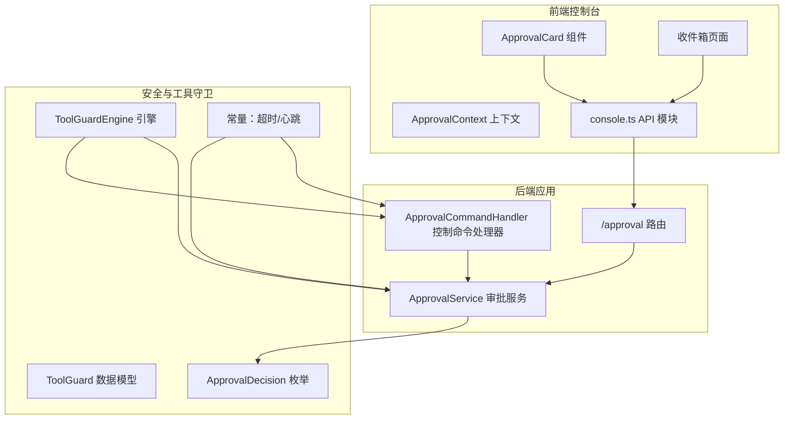
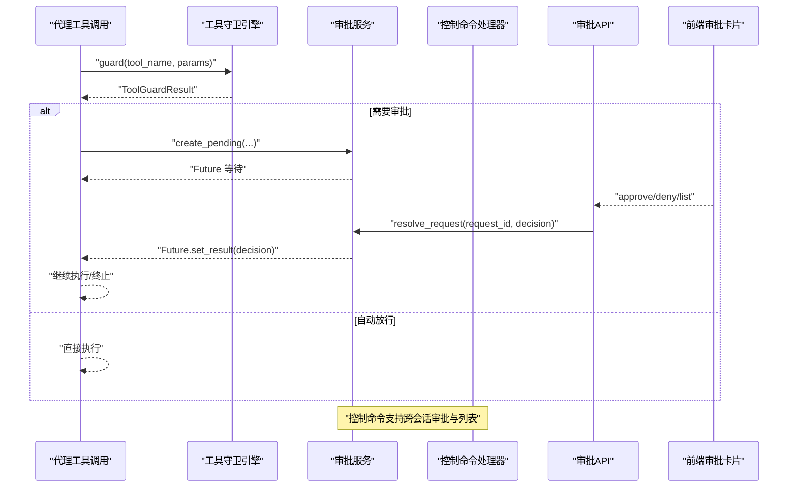
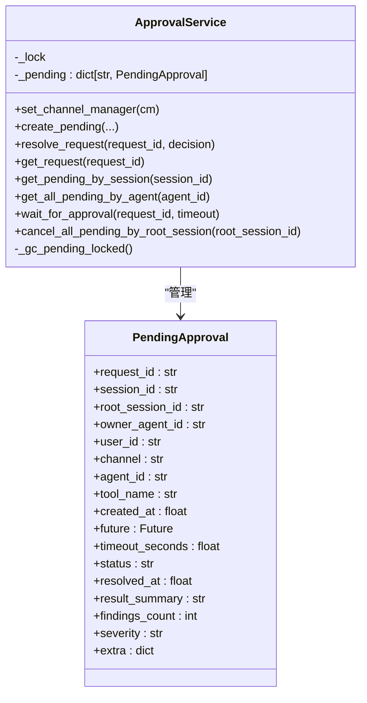
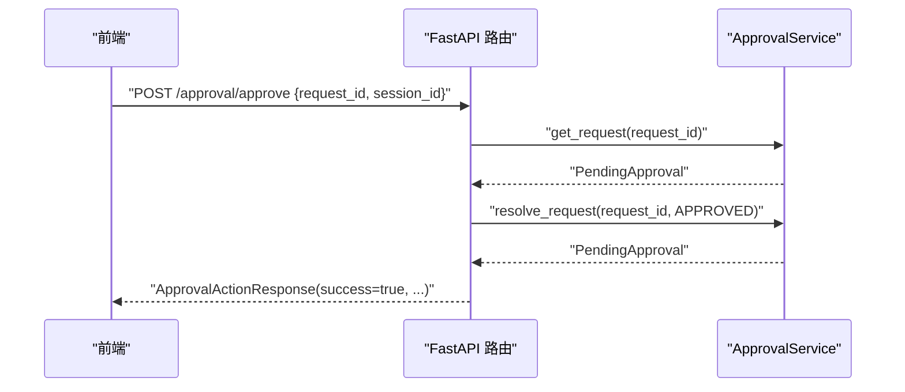
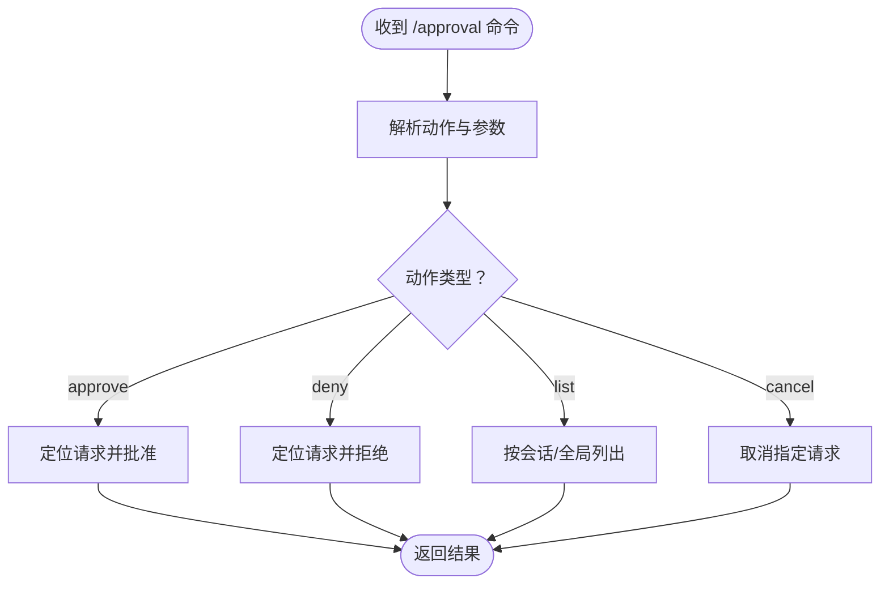
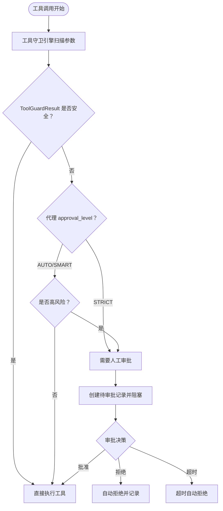
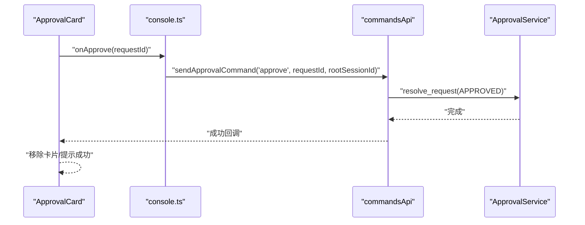
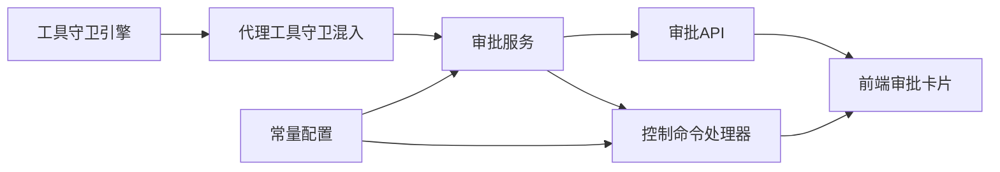

# 审批流程控制

<cite>
**本文引用的文件**
- [service.py](file://src/qwenpaw/app/approvals/service.py)
- [approval.py（后端）](file://src/qwenpaw/app/routers/approval.py)
- [approval.py（工具守卫）](file://src/qwenpaw/security/tool_guard/approval.py)
- [models.py（工具守卫）](file://src/qwenpaw/security/tool_guard/models.py)
- [engine.py（工具守卫引擎）](file://src/qwenpaw/security/tool_guard/engine.py)
- [approval_handler.py（控制命令）](file://src/qwenpaw/app/runner/control_commands/approval_handler.py)
- [constant.py](file://src/qwenpaw/constant.py)
- [ApprovalCard.tsx（前端组件）](file://console/src/components/ApprovalCard/ApprovalCard.tsx)
- [index.tsx（收件箱页面）](file://console/src/pages/Inbox/index.tsx)
- [ApprovalContext.tsx](file://console/src/contexts/ApprovalContext.tsx)
- [console.ts（前端API模块）](file://console/src/api/modules/console.ts)
- [tool_guard_mixin.py](file://src/qwenpaw/agents/tool_guard_mixin.py)
- [security.en.md（文档）](file://website/public/docs/security.en.md)
</cite>

## 目录
1. [简介](#简介)
2. [项目结构](#项目结构)
3. [核心组件](#核心组件)
4. [架构总览](#架构总览)
5. [详细组件分析](#详细组件分析)
6. [依赖分析](#依赖分析)
7. [性能考量](#性能考量)
8. [故障排查指南](#故障排查指南)
9. [结论](#结论)
10. [附录](#附录)

## 简介
本技术文档系统性阐述 QwenPaw 的审批流程控制系统，覆盖从“审批请求生成”、“审批流程执行”到“审批结果处理”的完整闭环；解释审批人分配策略、多级审批与自动审批条件；文档化审批存储机制、审批历史与状态追踪；并提供审批超时处理、通知机制与审计能力的实现要点。同时给出审批流程配置示例、策略定制方法与性能优化建议，并涵盖冲突解决、回退机制与统计分析思路。

## 项目结构
审批系统由“后端服务层 + 控制命令层 + 工具守卫引擎 + 前端展示层”构成，前后端通过 API 协议交互，工具守卫在代理执行前进行参数安全检查并触发审批流程。

图表来源
- [approval.py（后端）:1-240](file://src/qwenpaw/app/routers/approval.py#L1-L240)
- [service.py:64-438](file://src/qwenpaw/app/approvals/service.py#L64-L438)
- [approval_handler.py（控制命令）:20-367](file://src/qwenpaw/app/runner/control_commands/approval_handler.py#L20-L367)
- [engine.py（工具守卫引擎）:54-269](file://src/qwenpaw/security/tool_guard/engine.py#L54-L269)
- [models.py（工具守卫）:103-185](file://src/qwenpaw/security/tool_guard/models.py#L103-L185)
- [approval.py（工具守卫）:12-42](file://src/qwenpaw/security/tool_guard/approval.py#L12-L42)
- [constant.py:326-348](file://src/qwenpaw/constant.py#L326-L348)
- [ApprovalCard.tsx（前端组件）:1-321](file://console/src/components/ApprovalCard/ApprovalCard.tsx#L1-L321)
- [index.tsx（收件箱页面）:1-200](file://console/src/pages/Inbox/index.tsx#L1-L200)
- [console.ts（前端API模块）:36-99](file://console/src/api/modules/console.ts#L36-L99)

章节来源
- [approval.py（后端）:1-240](file://src/qwenpaw/app/routers/approval.py#L1-L240)
- [service.py:64-438](file://src/qwenpaw/app/approvals/service.py#L64-L438)
- [approval_handler.py（控制命令）:20-367](file://src/qwenpaw/app/runner/control_commands/approval_handler.py#L20-L367)
- [engine.py（工具守卫引擎）:54-269](file://src/qwenpaw/security/tool_guard/engine.py#L54-L269)
- [models.py（工具守卫）:103-185](file://src/qwenpaw/security/tool_guard/models.py#L103-L185)
- [approval.py（工具守卫）:12-42](file://src/qwenpaw/security/tool_guard/approval.py#L12-L42)
- [constant.py:326-348](file://src/qwenpaw/constant.py#L326-L348)
- [ApprovalCard.tsx（前端组件）:1-321](file://console/src/components/ApprovalCard/ApprovalCard.tsx#L1-L321)
- [index.tsx（收件箱页面）:1-200](file://console/src/pages/Inbox/index.tsx#L1-L200)
- [console.ts（前端API模块）:36-99](file://console/src/api/modules/console.ts#L36-L99)

## 核心组件
- 审批服务（ApprovalService）
  - 单例全局审批中心，负责创建、解析、查询、超时与回收待审批项。
  - 支持按会话、根会话、代理维度检索，保证跨会话审批路由正确。
- 审批 API 路由
  - 提供批准/拒绝/列表接口，校验根会话一致性，返回标准化响应。
- 控制命令处理器
  - 提供 /approval、/approve、/deny 等命令，支持跨会话审批与列表展示。
- 工具守卫引擎
  - 在工具调用前对参数进行多守护者扫描，生成 ToolGuardResult，决定是否需要审批。
- 前端审批卡片
  - 展示风险摘要、参数详情、倒计时与操作按钮，支持复制、超时自动拒绝等。
- 常量与超时配置
  - 审批超时秒数、心跳间隔等可配置，保障长时间等待的连接稳定性。

章节来源
- [service.py:64-438](file://src/qwenpaw/app/approvals/service.py#L64-L438)
- [approval.py（后端）:19-240](file://src/qwenpaw/app/routers/approval.py#L19-L240)
- [approval_handler.py（控制命令）:20-367](file://src/qwenpaw/app/runner/control_commands/approval_handler.py#L20-L367)
- [engine.py（工具守卫引擎）:54-269](file://src/qwenpaw/security/tool_guard/engine.py#L54-L269)
- [ApprovalCard.tsx（前端组件）:1-321](file://console/src/components/ApprovalCard/ApprovalCard.tsx#L1-L321)
- [constant.py:326-348](file://src/qwenpaw/constant.py#L326-L348)

## 架构总览
审批系统采用“前置安全检查 + 异步等待 + 后端解析 + 前端交互”的分层设计。工具守卫在代理执行前完成参数扫描，若命中高风险或需人工确认，则创建待审批记录并阻塞执行；审批人通过控制命令或前端界面进行批准/拒绝；服务层解析决策并恢复执行；超时自动拒绝并清理资源。

图表来源
- [engine.py（工具守卫引擎）:200-257](file://src/qwenpaw/security/tool_guard/engine.py#L200-L257)
- [service.py:84-137](file://src/qwenpaw/app/approvals/service.py#L84-L137)
- [approval.py（后端）:50-184](file://src/qwenpaw/app/routers/approval.py#L50-L184)
- [approval_handler.py（控制命令）:37-287](file://src/qwenpaw/app/runner/control_commands/approval_handler.py#L37-L287)
- [ApprovalCard.tsx（前端组件）:108-138](file://console/src/components/ApprovalCard/ApprovalCard.tsx#L108-L138)

## 详细组件分析

### 审批服务（ApprovalService）
- 角色定位
  - 全局单例，维护内存中的待审批字典，提供创建、解析、查询、超时与垃圾回收。
- 关键能力
  - 创建待审批：生成 UUID、Future、汇总风险摘要、设置超时。
  - 解析请求：按 request_id 设置 Future 结果，更新状态与时间戳。
  - 查询接口：按会话、根会话、代理维度检索，支持 FIFO 排序。
  - 超时处理：等待超时自动设为 TIMEOUT 并解析，确保资源释放。
  - 回收策略：按最大年龄与数量限制清理过期记录，避免内存膨胀。
- 性能与并发
  - 使用 asyncio.Lock 保护共享状态；Future 在锁外设置，降低阻塞时间。
  - 周期性 GC 清理，防止孤儿 Future 与堆积。

图表来源
- [service.py:36-137](file://src/qwenpaw/app/approvals/service.py#L36-L137)
- [service.py:139-423](file://src/qwenpaw/app/approvals/service.py#L139-L423)

章节来源
- [service.py:64-438](file://src/qwenpaw/app/approvals/service.py#L64-L438)

### 审批 API 路由
- 功能
  - /approval/approve：批准待审批请求，校验根会话一致性，返回成功信息。
  - /approval/deny：拒绝待审批请求，支持附加拒绝原因。
  - /approval/list：列出待审批请求，支持按根会话过滤。
- 安全与一致性
  - 根会话校验：禁止跨树审批，确保审批权限边界。
  - 错误处理：未找到请求返回 404，会话不匹配返回 403。

图表来源
- [approval.py（后端）:50-184](file://src/qwenpaw/app/routers/approval.py#L50-L184)
- [service.py:139-168](file://src/qwenpaw/app/approvals/service.py#L139-L168)

章节来源
- [approval.py（后端）:1-240](file://src/qwenpaw/app/routers/approval.py#L1-L240)

### 控制命令处理器（/approval）
- 功能
  - approve/deny：支持跨会话审批，自动定位队首或指定 request_id。
  - list：支持当前会话与全局（按代理）两种视图。
  - cancel：取消指定审批请求。
- 权限与提示
  - 仅允许审批自身代理的请求；跨会话操作提供上下文提示。
  - 提供统一的使用说明与操作提示。

图表来源
- [approval_handler.py（控制命令）:37-287](file://src/qwenpaw/app/runner/control_commands/approval_handler.py#L37-L287)

章节来源
- [approval_handler.py（控制命令）:20-367](file://src/qwenpaw/app/runner/control_commands/approval_handler.py#L20-L367)

### 工具守卫引擎与自动审批
- 触发条件
  - 工具守卫引擎扫描参数，生成 ToolGuardResult；根据代理的 approval_level 决定是否需要人工审批。
- 执行路径
  - 低风险：直接放行。
  - 中高风险：创建待审批记录，阻塞执行，等待审批。
  - 自动拒绝规则：命中特定规则直接拒绝，不进入审批。
- 配置入口
  - 代理配置中设置 approval_level（STRICT/AUTO/SMART/OFF），Console 中也可调整。

图表来源
- [engine.py（工具守卫引擎）:200-257](file://src/qwenpaw/security/tool_guard/engine.py#L200-L257)
- [tool_guard_mixin.py:296-775](file://src/qwenpaw/agents/tool_guard_mixin.py#L296-L775)
- [security.en.md（文档）:155-178](file://website/public/docs/security.en.md#L155-L178)

章节来源
- [engine.py（工具守卫引擎）:54-269](file://src/qwenpaw/security/tool_guard/engine.py#L54-L269)
- [tool_guard_mixin.py:296-775](file://src/qwenpaw/agents/tool_guard_mixin.py#L296-L775)
- [security.en.md（文档）:155-178](file://website/public/docs/security.en.md#L155-L178)

### 前端审批卡片与交互
- 展示内容
  - 工具名、严重级别、风险摘要、参数详情、倒计时。
  - 跨会话场景显示所有者代理与执行代理。
- 交互行为
  - 批准/拒绝按钮提交至后端或控制命令；超时自动拒绝并提供“已知悉”按钮。
  - 复制摘要与参数，便于审计与复核。
- 状态同步
  - 通过 ApprovalContext 与收件箱页面联动，实时刷新待审批列表。

图表来源
- [ApprovalCard.tsx（前端组件）:108-138](file://console/src/components/ApprovalCard/ApprovalCard.tsx#L108-L138)
- [index.tsx（收件箱页面）:150-170](file://console/src/pages/Inbox/index.tsx#L150-L170)
- [console.ts（前端API模块）:51-99](file://console/src/api/modules/console.ts#L51-L99)

章节来源
- [ApprovalCard.tsx（前端组件）:1-321](file://console/src/components/ApprovalCard/ApprovalCard.tsx#L1-L321)
- [index.tsx（收件箱页面）:1-200](file://console/src/pages/Inbox/index.tsx#L1-L200)
- [console.ts（前端API模块）:36-99](file://console/src/api/modules/console.ts#L36-L99)
- [ApprovalContext.tsx:1-29](file://console/src/contexts/ApprovalContext.tsx#L1-L29)

### 审批数据模型与决策
- PendingApproval
  - 记录请求标识、会话链路、代理与用户信息、风险摘要、超时与状态。
- ApprovalDecision
  - approved/denied/timeout 三种结果，用于 Future 设置与后续处理。
- ToolGuardResult
  - 聚合各守护者的发现，提供最高风险等级、计数与分类统计。

章节来源
- [service.py:36-137](file://src/qwenpaw/app/approvals/service.py#L36-L137)
- [approval.py（工具守卫）:12-42](file://src/qwenpaw/security/tool_guard/approval.py#L12-L42)
- [models.py（工具守卫）:103-185](file://src/qwenpaw/security/tool_guard/models.py#L103-L185)

## 依赖分析
- 组件耦合
  - 工具守卫引擎与代理执行强耦合，决定是否进入审批流程。
  - 审批服务与控制命令/HTTP API 双向交互，形成闭环。
  - 前端审批卡片依赖控制命令与 API，实现用户交互与状态同步。
- 外部依赖
  - 常量模块提供超时与心跳配置，影响前端倒计时与后端等待行为。
  - 代理 mixin 将审批等待与任务取消结合，支持 /stop 等中断场景。

图表来源
- [engine.py（工具守卫引擎）:54-269](file://src/qwenpaw/security/tool_guard/engine.py#L54-L269)
- [tool_guard_mixin.py:528-616](file://src/qwenpaw/agents/tool_guard_mixin.py#L528-L616)
- [service.py:270-302](file://src/qwenpaw/app/approvals/service.py#L270-L302)
- [approval.py（后端）:1-240](file://src/qwenpaw/app/routers/approval.py#L1-L240)
- [approval_handler.py（控制命令）:37-287](file://src/qwenpaw/app/runner/control_commands/approval_handler.py#L37-L287)
- [constant.py:326-348](file://src/qwenpaw/constant.py#L326-L348)

章节来源
- [engine.py（工具守卫引擎）:54-269](file://src/qwenpaw/security/tool_guard/engine.py#L54-L269)
- [tool_guard_mixin.py:528-616](file://src/qwenpaw/agents/tool_guard_mixin.py#L528-L616)
- [service.py:270-302](file://src/qwenpaw/app/approvals/service.py#L270-L302)
- [approval.py（后端）:1-240](file://src/qwenpaw/app/routers/approval.py#L1-L240)
- [approval_handler.py（控制命令）:37-287](file://src/qwenpaw/app/runner/control_commands/approval_handler.py#L37-L287)
- [constant.py:326-348](file://src/qwenpaw/constant.py#L326-L348)

## 性能考量
- 并发与锁粒度
  - 使用 asyncio.Lock 保护共享状态；Future 设置在锁外进行，减少阻塞。
- 超时与心跳
  - 后端等待超时自动拒绝，避免长时间挂起；前端倒计时与心跳消息保持连接活跃。
- 垃圾回收
  - 基于年龄与数量上限的 GC，定期清理过期与溢出记录，防止内存泄漏。
- 查询与排序
  - 按创建时间排序的 FIFO 查询，保证公平性与可追溯性。

章节来源
- [service.py:392-423](file://src/qwenpaw/app/approvals/service.py#L392-L423)
- [constant.py:326-348](file://src/qwenpaw/constant.py#L326-L348)
- [tool_guard_mixin.py:528-616](file://src/qwenpaw/agents/tool_guard_mixin.py#L528-L616)

## 故障排查指南
- 常见问题
  - 审批请求不存在：检查 request_id 是否正确或已超时。
  - 会话不匹配：确认 root_session_id 与当前会话一致。
  - 超时自动拒绝：检查前端倒计时与后端超时配置。
  - 无法审批他人代理请求：确认当前代理身份与请求归属。
- 审计与诊断
  - 使用 /approval list 查看待审批队列，定位具体请求。
  - 通过 API 获取列表并导出，配合日志分析。
  - 检查工具守卫规则与代理 approval_level 配置，确认是否误判。

章节来源
- [approval.py（后端）:72-100](file://src/qwenpaw/app/routers/approval.py#L72-L100)
- [approval_handler.py（控制命令）:72-114](file://src/qwenpaw/app/runner/control_commands/approval_handler.py#L72-L114)
- [tool_guard_mixin.py:731-775](file://src/qwenpaw/agents/tool_guard_mixin.py#L731-L775)

## 结论
QwenPaw 的审批流程控制系统以工具守卫为入口、以审批服务为核心、以前端卡片为触点，实现了从“自动/半自动审批”到“人工干预”的灵活控制。通过严格的会话边界、超时与心跳机制、以及完善的查询与回收策略，系统在安全性与可用性之间取得平衡。建议在生产环境中结合业务风险合理配置 approval_level 与超时参数，并建立定期审计与统计分析机制，持续优化审批效率与用户体验。

## 附录

### 审批流程配置示例
- 代理级审批级别
  - 在代理配置中设置 approval_level，支持 STRICT/AUTO/SMART/OFF。
  - 参考文档：[security.en.md:155-178](file://website/public/docs/security.en.md#L155-L178)

章节来源
- [security.en.md（文档）:155-178](file://website/public/docs/security.en.md#L155-L178)

### 审批策略定制
- 工具守卫规则
  - 通过工具守卫引擎注册/卸载守护者，或重载规则集，影响审批触发概率。
  - 参考：[engine.py（工具守卫引擎）:116-172](file://src/qwenpaw/security/tool_guard/engine.py#L116-L172)
- 审批超时与心跳
  - 通过环境变量调整超时秒数与心跳间隔，影响前端倒计时与后端等待行为。
  - 参考：[constant.py:326-348](file://src/qwenpaw/constant.py#L326-L348)

章节来源
- [engine.py（工具守卫引擎）:116-172](file://src/qwenpaw/security/tool_guard/engine.py#L116-L172)
- [constant.py:326-348](file://src/qwenpaw/constant.py#L326-L348)

### 审批统计分析
- 建议指标
  - 待审批请求数、平均等待时长、审批通过率、拒绝原因分布、超时占比。
- 实现路径
  - 通过 /approval/list 导出数据，结合日志与告警系统进行周期性统计与可视化。

章节来源
- [approval.py（后端）:187-240](file://src/qwenpaw/app/routers/approval.py#L187-L240)