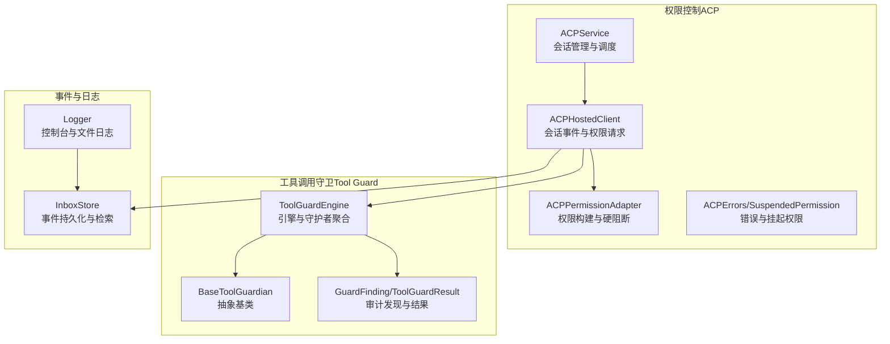
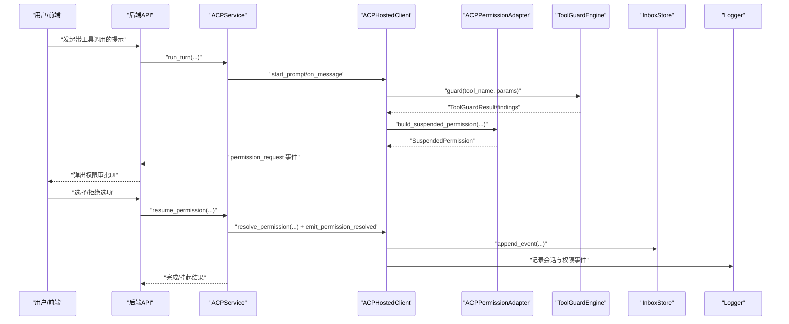
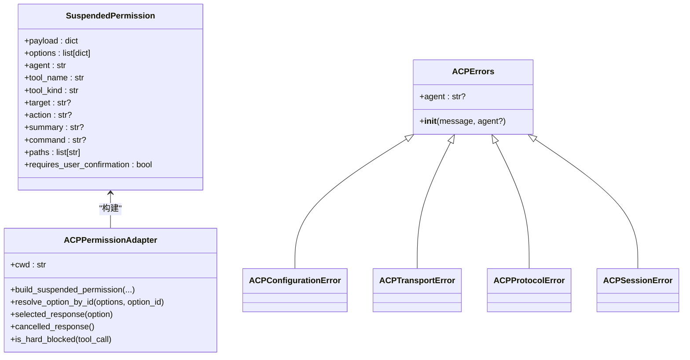
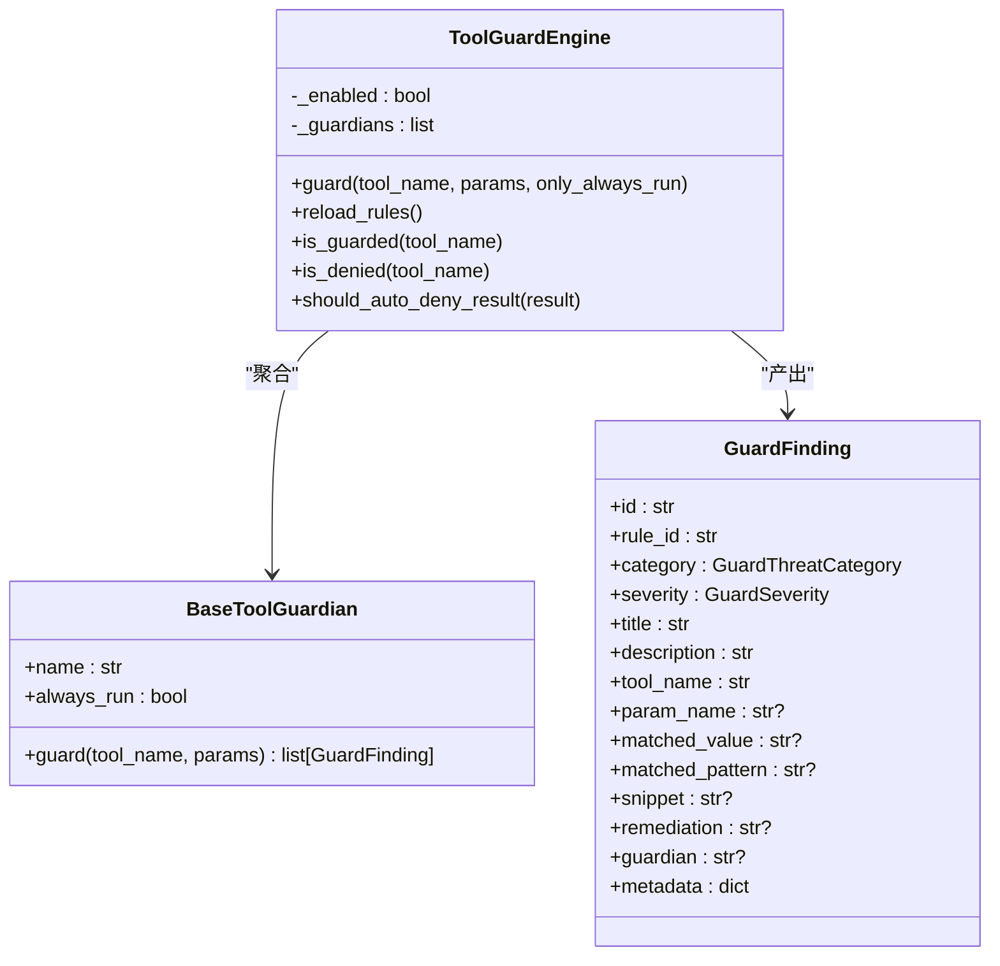
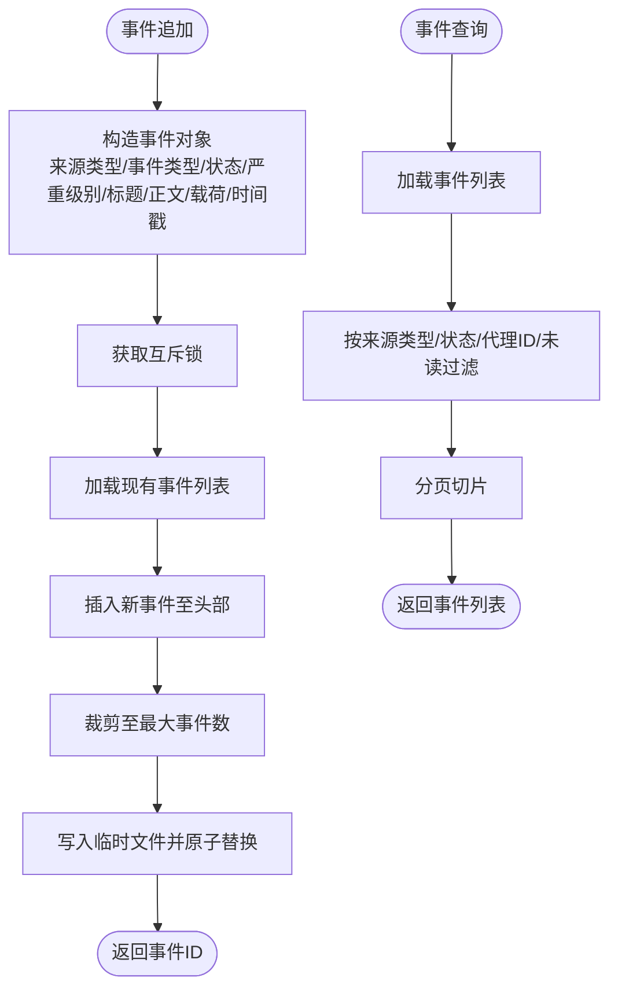
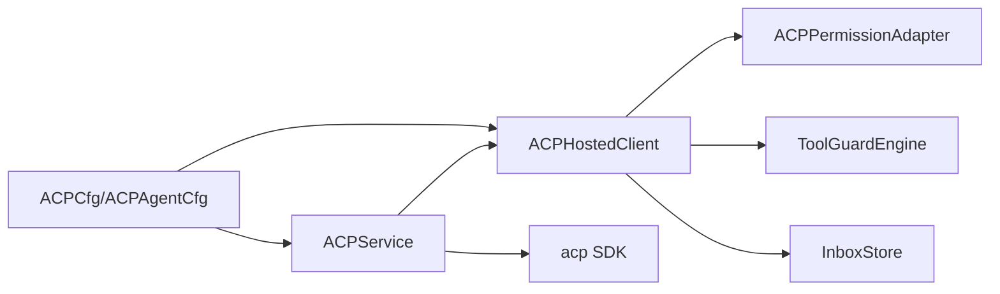

# 权限审计追踪

<cite>
**本文引用的文件**
- [src/qwenpaw/agents/acp/__init__.py](file://src/qwenpaw/agents/acp/__init__.py)
- [src/qwenpaw/agents/acp/core.py](file://src/qwenpaw/agents/acp/core.py)
- [src/qwenpaw/agents/acp/permissions.py](file://src/qwenpaw/agents/acp/permissions.py)
- [src/qwenpaw/agents/acp/service.py](file://src/qwenpaw/agents/acp/service.py)
- [src/qwenpaw/agents/acp/client.py](file://src/qwenpaw/agents/acp/client.py)
- [src/qwenpaw/security/tool_guard/engine.py](file://src/qwenpaw/security/tool_guard/engine.py)
- [src/qwenpaw/security/tool_guard/guardians/__init__.py](file://src/qwenpaw/security/tool_guard/guardians/__init__.py)
- [src/qwenpaw/security/tool_guard/models.py](file://src/qwenpaw/security/tool_guard/models.py)
- [src/qwenpaw/security/skill_scanner/scan_policy.py](file://src/qwenpaw/security/skill_scanner/scan_policy.py)
- [src/qwenpaw/app/inbox_store.py](file://src/qwenpaw/app/inbox_store.py)
- [src/qwenpaw/app/routers/console.py](file://src/qwenpaw/app/routers/console.py)
- [src/qwenpaw/utils/logging.py](file://src/qwenpaw/utils/logging.py)
- [src/qwenpaw/config/config.py](file://src/qwenpaw/config/config.py)
- [console/src/api/modules/acp.ts](file://console/src/api/modules/acp.ts)
</cite>

## 目录
1. [简介](#简介)
2. [项目结构](#项目结构)
3. [核心组件](#核心组件)
4. [架构总览](#架构总览)
5. [详细组件分析](#详细组件分析)
6. [依赖分析](#依赖分析)
7. [性能考量](#性能考量)
8. [故障排查指南](#故障排查指南)
9. [结论](#结论)
10. [附录](#附录)

## 简介
本技术文档围绕 QwenPaw 的“权限审计追踪”能力进行系统化梳理，重点覆盖以下方面：
- 权限访问日志的记录机制与审计数据存储结构
- 审计信息的查询与检索方式
- 权限变更追踪、权限使用统计与异常权限行为检测
- 审计数据格式标准、存储策略与数据保留周期
- 审计报告生成、合规性检查与安全事件告警
- 审计配置选项、性能优化与审计数据导出
- 审计隐私保护、数据加密与完整性校验

本系统以 ACP（Agent Communication Protocol）为核心权限控制协议，结合工具调用前置守卫（Tool Guard）与会话事件存储（Inbox Store），形成从“请求—审批—执行—回溯”的闭环审计链路。

## 项目结构
与权限审计直接相关的关键模块分布如下：
- ACP 权限控制：服务端会话管理、客户端适配器、权限适配器与错误类型定义
- 工具调用守卫：引擎聚合多守护者规则，输出带严重级别与分类的审计发现
- 事件存储：统一的 Inbox 事件存储，支持按来源类型、状态、代理等维度检索
- 日志系统：应用级日志与可选文件落盘，支持轮转与过滤
- 配置模型：ACP 代理配置、工具调用模式、缓冲区限制等影响审计与安全的关键参数

**图表来源**
- [src/qwenpaw/agents/acp/service.py:39-470](file://src/qwenpaw/agents/acp/service.py#L39-L470)
- [src/qwenpaw/agents/acp/client.py:28-467](file://src/qwenpaw/agents/acp/client.py#L28-L467)
- [src/qwenpaw/agents/acp/permissions.py:20-221](file://src/qwenpaw/agents/acp/permissions.py#L20-L221)
- [src/qwenpaw/security/tool_guard/engine.py:54-269](file://src/qwenpaw/security/tool_guard/engine.py#L54-L269)
- [src/qwenpaw/security/tool_guard/guardians/__init__.py:17-62](file://src/qwenpaw/security/tool_guard/guardians/__init__.py#L17-L62)
- [src/qwenpaw/security/tool_guard/models.py:60-184](file://src/qwenpaw/security/tool_guard/models.py#L60-L184)
- [src/qwenpaw/app/inbox_store.py:1-122](file://src/qwenpaw/app/inbox_store.py#L1-L122)
- [src/qwenpaw/utils/logging.py:154-226](file://src/qwenpaw/utils/logging.py#L154-L226)

**章节来源**
- [src/qwenpaw/agents/acp/__init__.py:1-34](file://src/qwenpaw/agents/acp/__init__.py#L1-L34)
- [src/qwenpaw/agents/acp/core.py:22-57](file://src/qwenpaw/agents/acp/core.py#L22-L57)
- [src/qwenpaw/agents/acp/permissions.py:20-221](file://src/qwenpaw/agents/acp/permissions.py#L20-L221)
- [src/qwenpaw/agents/acp/service.py:39-470](file://src/qwenpaw/agents/acp/service.py#L39-L470)
- [src/qwenpaw/agents/acp/client.py:28-467](file://src/qwenpaw/agents/acp/client.py#L28-L467)
- [src/qwenpaw/security/tool_guard/engine.py:54-269](file://src/qwenpaw/security/tool_guard/engine.py#L54-L269)
- [src/qwenpaw/security/tool_guard/guardians/__init__.py:17-62](file://src/qwenpaw/security/tool_guard/guardians/__init__.py#L17-L62)
- [src/qwenpaw/security/tool_guard/models.py:60-184](file://src/qwenpaw/security/tool_guard/models.py#L60-L184)
- [src/qwenpaw/app/inbox_store.py:1-122](file://src/qwenpaw/app/inbox_store.py#L1-L122)
- [src/qwenpaw/utils/logging.py:154-226](file://src/qwenpaw/utils/logging.py#L154-L226)

## 核心组件
- ACP 服务与会话
  - ACPService 负责会话生命周期管理、并发锁、权限等待与结果返回；支持重启、取消、关闭等操作。
  - ACPHostedClient 负责会话更新、权限请求、工具调用事件生成与权限解析。
  - ACPPermissionAdapter 负责从工具调用载荷中提取关键字段（名称、种类、命令、路径等），并判定硬阻断（如越权路径或危险命令）。
  - ACPErrors 与 SuspendedPermission 提供统一的错误类型与挂起权限数据结构，便于审计与恢复。

- 工具调用守卫
  - ToolGuardEngine 聚合多个守护者（规则、路径、规避检测等），对工具参数进行前置安全检查，输出 GuardFinding 列表与 ToolGuardResult。
  - GuardFinding 包含规则ID、威胁类别、严重级别、标题、描述、工具名、匹配值/模式、修复建议、元数据等字段，满足审计与报告需求。

- 事件与日志
  - InboxStore 提供事件追加、列表查询、标记已读/全部已读等能力，支持按来源类型、状态、代理ID、未读等条件筛选。
  - Logger 支持控制台彩色输出与可选文件落盘（轮转、备份），并提供访问日志过滤器。

- 配置
  - ACPConfig/ACPAgentConfig 定义代理启用、命令、参数、环境变量、可信度、工具解析模式、IO缓冲上限等，直接影响权限控制与审计可观测性。

**章节来源**
- [src/qwenpaw/agents/acp/service.py:39-470](file://src/qwenpaw/agents/acp/service.py#L39-L470)
- [src/qwenpaw/agents/acp/client.py:28-467](file://src/qwenpaw/agents/acp/client.py#L28-L467)
- [src/qwenpaw/agents/acp/permissions.py:20-221](file://src/qwenpaw/agents/acp/permissions.py#L20-L221)
- [src/qwenpaw/agents/acp/core.py:22-57](file://src/qwenpaw/agents/acp/core.py#L22-L57)
- [src/qwenpaw/security/tool_guard/engine.py:54-269](file://src/qwenpaw/security/tool_guard/engine.py#L54-L269)
- [src/qwenpaw/security/tool_guard/models.py:60-184](file://src/qwenpaw/security/tool_guard/models.py#L60-L184)
- [src/qwenpaw/app/inbox_store.py:1-122](file://src/qwenpaw/app/inbox_store.py#L1-L122)
- [src/qwenpaw/utils/logging.py:154-226](file://src/qwenpaw/utils/logging.py#L154-L226)
- [src/qwenpaw/config/config.py:55-118](file://src/qwenpaw/config/config.py#L55-L118)

## 架构总览
下图展示从用户触发到权限决策、工具执行与审计记录的完整流程：

**图表来源**
- [src/qwenpaw/agents/acp/service.py:45-123](file://src/qwenpaw/agents/acp/service.py#L45-L123)
- [src/qwenpaw/agents/acp/client.py:94-132](file://src/qwenpaw/agents/acp/client.py#L94-L132)
- [src/qwenpaw/agents/acp/permissions.py:24-52](file://src/qwenpaw/agents/acp/permissions.py#L24-L52)
- [src/qwenpaw/security/tool_guard/engine.py:200-257](file://src/qwenpaw/security/tool_guard/engine.py#L200-L257)
- [src/qwenpaw/app/inbox_store.py:36-67](file://src/qwenpaw/app/inbox_store.py#L36-L67)
- [src/qwenpaw/utils/logging.py:154-226](file://src/qwenpaw/utils/logging.py#L154-L226)

## 详细组件分析

### ACP 权限控制与审计数据结构
- SuspendedPermission 字段用于记录被挂起的权限请求，包括工具名、种类、目标、摘要、命令、路径集合以及是否需要用户确认等，构成审计追踪的核心载体。
- ACPErrors 及其子类（配置、传输、协议、会话）提供统一的错误语义，便于在审计日志中区分不同类型的失败场景。
- ACPPermissionAdapter 的硬阻断逻辑（危险命令模式匹配、路径越界判断）直接决定是否进入审批流程，是异常行为检测的第一道防线。

**图表来源**
- [src/qwenpaw/agents/acp/core.py:22-57](file://src/qwenpaw/agents/acp/core.py#L22-L57)
- [src/qwenpaw/agents/acp/permissions.py:20-221](file://src/qwenpaw/agents/acp/permissions.py#L20-L221)

**章节来源**
- [src/qwenpaw/agents/acp/core.py:22-57](file://src/qwenpaw/agents/acp/core.py#L22-L57)
- [src/qwenpaw/agents/acp/permissions.py:20-221](file://src/qwenpaw/agents/acp/permissions.py#L20-L221)

### 工具调用守卫与审计发现
- ToolGuardEngine 聚合多个守护者，按配置决定是否自动拒绝、受保护工具集与规则集，并输出 ToolGuardResult，其中包含 findings 列表与各守护者使用情况。
- GuardFinding 字段覆盖威胁类别（如命令注入、路径穿越、特权提升等）、严重级别、匹配值/模式、修复建议与元数据，满足审计报告与合规检查需求。

**图表来源**
- [src/qwenpaw/security/tool_guard/engine.py:54-269](file://src/qwenpaw/security/tool_guard/engine.py#L54-L269)
- [src/qwenpaw/security/tool_guard/guardians/__init__.py:17-62](file://src/qwenpaw/security/tool_guard/guardians/__init__.py#L17-L62)
- [src/qwenpaw/security/tool_guard/models.py:60-184](file://src/qwenpaw/security/tool_guard/models.py#L60-L184)

**章节来源**
- [src/qwenpaw/security/tool_guard/engine.py:54-269](file://src/qwenpaw/security/tool_guard/engine.py#L54-L269)
- [src/qwenpaw/security/tool_guard/guardians/__init__.py:17-62](file://src/qwenpaw/security/tool_guard/guardians/__init__.py#L17-L62)
- [src/qwenpaw/security/tool_guard/models.py:60-184](file://src/qwenpaw/security/tool_guard/models.py#L60-L184)

### 事件存储与审计查询
- InboxStore 提供事件追加（包含来源类型、事件类型、状态、严重级别、标题、正文、载荷、时间戳等）与查询接口，支持分页、过滤与标记已读。
- 控制台路由提供删除事件、获取事件轨迹等接口，便于审计证据的关联与清理。

**图表来源**
- [src/qwenpaw/app/inbox_store.py:36-95](file://src/qwenpaw/app/inbox_store.py#L36-L95)
- [src/qwenpaw/app/routers/console.py:422-458](file://src/qwenpaw/app/routers/console.py#L422-L458)

**章节来源**
- [src/qwenpaw/app/inbox_store.py:1-122](file://src/qwenpaw/app/inbox_store.py#L1-L122)
- [src/qwenpaw/app/routers/console.py:422-458](file://src/qwenpaw/app/routers/console.py#L422-L458)

### 日志系统与审计数据落盘
- Logger 提供控制台彩色输出与可选文件落盘（轮转、备份），并支持访问日志过滤器，避免噪声干扰。
- 文件处理器采用安全轮转（Windows 下容忍文件锁定导致的旋转失败），确保审计日志连续性。

**章节来源**
- [src/qwenpaw/utils/logging.py:154-226](file://src/qwenpaw/utils/logging.py#L154-L226)

### 前端与配置交互
- 前端通过 acp.ts 模块与后端 ACP 配置进行交互，支持获取与更新 ACP 全局配置及代理配置。
- 后端配置模型 ACPConfig/ACPAgentConfig 定义了代理启用、命令、参数、可信度、工具解析模式、IO 缓冲上限等，直接影响权限控制与审计可观测性。

**章节来源**
- [console/src/api/modules/acp.ts:1-21](file://console/src/api/modules/acp.ts#L1-L21)
- [src/qwenpaw/config/config.py:55-118](file://src/qwenpaw/config/config.py#L55-L118)

## 依赖分析
- 组件耦合
  - ACPService 与 ACPHostedClient 强耦合，前者负责会话生命周期，后者负责事件与权限处理。
  - ACPHostedClient 依赖 ACPPermissionAdapter 进行权限构建与硬阻断判断。
  - ACPHostedClient 与 ToolGuardEngine 协作，在工具调用前进行前置安全检查。
  - 审计事件通过 InboxStore 持久化，同时由 Logger 记录运行时日志。
- 外部依赖
  - acp SDK 用于协议初始化、会话建立与通知处理。
  - pydantic 配置模型用于强类型配置校验与默认值合并。

**图表来源**
- [src/qwenpaw/agents/acp/service.py:254-304](file://src/qwenpaw/agents/acp/service.py#L254-L304)
- [src/qwenpaw/agents/acp/client.py:31-51](file://src/qwenpaw/agents/acp/client.py#L31-L51)
- [src/qwenpaw/agents/acp/permissions.py:20-52](file://src/qwenpaw/agents/acp/permissions.py#L20-L52)
- [src/qwenpaw/security/tool_guard/engine.py:66-78](file://src/qwenpaw/security/tool_guard/engine.py#L66-L78)
- [src/qwenpaw/config/config.py:104-118](file://src/qwenpaw/config/config.py#L104-L118)

**章节来源**
- [src/qwenpaw/agents/acp/service.py:254-304](file://src/qwenpaw/agents/acp/service.py#L254-L304)
- [src/qwenpaw/agents/acp/client.py:31-51](file://src/qwenpaw/agents/acp/client.py#L31-L51)
- [src/qwenpaw/agents/acp/permissions.py:20-52](file://src/qwenpaw/agents/acp/permissions.py#L20-L52)
- [src/qwenpaw/security/tool_guard/engine.py:66-78](file://src/qwenpaw/security/tool_guard/engine.py#L66-L78)
- [src/qwenpaw/config/config.py:104-118](file://src/qwenpaw/config/config.py#L104-L118)

## 性能考量
- 并发与锁
  - ACPService 使用 asyncio.Lock 与 turn_lock 串行化同一会话的回合，避免竞态；同时通过任务取消与超时控制保障取消路径的健壮性。
- IO 与缓冲
  - ACPAgentConfig 提供 stdio_buffer_limit_bytes，限制进程 IO 缓冲大小，防止内存膨胀与审计数据过大带来的性能问题。
- 事件存储
  - InboxStore 采用固定上限裁剪与原子替换，避免磁盘写放大；查询时支持分页与条件过滤，降低内存占用。
- 日志轮转
  - 文件处理器采用安全轮转，Windows 下容忍文件锁定导致的旋转失败，保证日志持续写入。

**章节来源**
- [src/qwenpaw/agents/acp/service.py:42-94](file://src/qwenpaw/agents/acp/service.py#L42-L94)
- [src/qwenpaw/config/config.py:64-67](file://src/qwenpaw/config/config.py#L64-L67)
- [src/qwenpaw/app/inbox_store.py:14-34](file://src/qwenpaw/app/inbox_store.py#L14-L34)
- [src/qwenpaw/utils/logging.py:88-106](file://src/qwenpaw/utils/logging.py#L88-L106)

## 故障排查指南
- 权限会话异常
  - 若出现“会话等待权限”或“会话已在处理回合”，需检查会话锁与权限请求状态，必要时调用取消或重启会话。
- 权限硬阻断
  - 当命令包含危险模式或路径越界时，系统将直接拒绝，无需人工审批；可通过查看 SuspendedPermission 的命令与路径定位风险来源。
- 审计事件缺失
  - 检查 InboxStore 是否正常写入（互斥锁、裁剪、原子替换），并确认查询条件（来源类型、状态、代理ID、未读）是否正确。
- 日志不落盘
  - 确认已添加文件处理器，检查路径权限与轮转策略；Windows 下容忍旋转失败但会重新打开流以保证日志连续。

**章节来源**
- [src/qwenpaw/agents/acp/service.py:65-80](file://src/qwenpaw/agents/acp/service.py#L65-L80)
- [src/qwenpaw/agents/acp/permissions.py:205-221](file://src/qwenpaw/agents/acp/permissions.py#L205-L221)
- [src/qwenpaw/app/inbox_store.py:17-34](file://src/qwenpaw/app/inbox_store.py#L17-L34)
- [src/qwenpaw/utils/logging.py:191-226](file://src/qwenpaw/utils/logging.py#L191-L226)

## 结论
QwenPaw 的权限审计追踪以 ACP 为核心，结合工具调用前置守卫与统一事件存储，实现了从“请求—审批—执行—回溯”的全链路可观测性。通过 SuspendedPermission、GuardFinding 与 InboxStore 的结构化数据，系统能够支撑权限变更追踪、使用统计、异常行为检测与合规报告生成。配合日志轮转与配置项优化，可在保证安全性的同时兼顾性能与可维护性。

## 附录

### 审计数据格式标准
- SuspendedPermission
  - 关键字段：agent、tool_name、tool_kind、target、action、summary、command、paths、requires_user_confirmation、payload、options。
- GuardFinding
  - 关键字段：id、rule_id、category、severity、title、description、tool_name、param_name、matched_value、matched_pattern、snippet、remediation、guardian、metadata。
- ToolGuardResult
  - 关键字段：tool_name、params、is_safe、max_severity、findings_count、findings、guard_duration_seconds、guardians_used、timestamp、guardians_failed（可选）。
- InboxStore 事件
  - 关键字段：id、agent_id、source_type、source_id、event_type、status、severity、title、body、payload、read、created_at。

**章节来源**
- [src/qwenpaw/agents/acp/permissions.py:24-52](file://src/qwenpaw/agents/acp/permissions.py#L24-L52)
- [src/qwenpaw/security/tool_guard/models.py:60-184](file://src/qwenpaw/security/tool_guard/models.py#L60-L184)
- [src/qwenpaw/app/inbox_store.py:36-67](file://src/qwenpaw/app/inbox_store.py#L36-L67)

### 存储策略与数据保留周期
- 事件存储
  - 最大事件数固定裁剪，避免无限增长；采用原子替换写入，保证一致性。
- 日志存储
  - 文件轮转（单文件最大 5 MiB，保留 3 个备份），Windows 下容忍旋转失败并自动重开流。
- 配置项
  - ACPAgentConfig.stdio_buffer_limit_bytes 控制 IO 缓冲上限，间接影响审计数据体积与性能。

**章节来源**
- [src/qwenpaw/app/inbox_store.py:14-34](file://src/qwenpaw/app/inbox_store.py#L14-L34)
- [src/qwenpaw/utils/logging.py:14-15](file://src/qwenpaw/utils/logging.py#L14-L15)
- [src/qwenpaw/config/config.py:64-67](file://src/qwenpaw/config/config.py#L64-L67)

### 查询与检索
- 事件查询
  - 支持按来源类型、状态、代理ID、未读等条件过滤与分页。
- 报告生成
  - 可基于 GuardFinding 与 SuspendedPermission 统计威胁类别、严重级别与工具使用频次，生成合规报告。
- 告警
  - 可根据 ToolGuardResult 的 max_severity 或自动拒绝规则触发告警；InboxStore 的严重级别字段可用于可视化告警面板。

**章节来源**
- [src/qwenpaw/app/inbox_store.py:70-95](file://src/qwenpaw/app/inbox_store.py#L70-L95)
- [src/qwenpaw/security/tool_guard/engine.py:177-189](file://src/qwenpaw/security/tool_guard/engine.py#L177-L189)

### 配置选项
- ACPConfig/ACPAgentConfig
  - enabled、command、args、env、trusted、tool_parse_mode、stdio_buffer_limit_bytes。
- Tool Guard
  - 通过环境变量与配置项控制开关、受保护工具集、自动拒绝规则集与守护者集合。

**章节来源**
- [src/qwenpaw/config/config.py:55-118](file://src/qwenpaw/config/config.py#L55-L118)
- [src/qwenpaw/security/tool_guard/engine.py:36-52](file://src/qwenpaw/security/tool_guard/engine.py#L36-L52)

### 性能优化
- 会话并发控制与任务取消
- IO 缓冲上限设置
- 事件裁剪与原子写入
- 日志轮转与访问日志过滤

**章节来源**
- [src/qwenpaw/agents/acp/service.py:42-94](file://src/qwenpaw/agents/acp/service.py#L42-L94)
- [src/qwenpaw/config/config.py:64-67](file://src/qwenpaw/config/config.py#L64-L67)
- [src/qwenpaw/app/inbox_store.py:14-34](file://src/qwenpaw/app/inbox_store.py#L14-L34)
- [src/qwenpaw/utils/logging.py:132-152](file://src/qwenpaw/utils/logging.py#L132-L152)

### 数据导出
- 事件导出
  - 通过查询接口获取事件列表，结合前端或后端脚本进行批量导出。
- 配置导出
  - ACP 配置可通过 acp.ts 接口获取与更新，便于集中管理与审计。

**章节来源**
- [src/qwenpaw/app/inbox_store.py:70-95](file://src/qwenpaw/app/inbox_store.py#L70-L95)
- [console/src/api/modules/acp.ts:1-21](file://console/src/api/modules/acp.ts#L1-L21)

### 隐私保护、加密与完整性
- 隐私保护
  - 对敏感参数（如命令、路径）进行最小化暴露，仅在 SuspendedPermission 与 GuardFinding 中记录必要片段。
- 加密
  - 日志文件采用本地落盘，未见内置加密实现；建议在部署层面对日志目录进行访问控制与磁盘加密。
- 完整性
  - 事件写入采用原子替换，日志轮转具备容错处理；建议结合外部完整性校验工具或审计框架进行长期完整性验证。

**章节来源**
- [src/qwenpaw/security/tool_guard/models.py:179-184](file://src/qwenpaw/security/tool_guard/models.py#L179-L184)
- [src/qwenpaw/app/inbox_store.py:26-34](file://src/qwenpaw/app/inbox_store.py#L26-L34)
- [src/qwenpaw/utils/logging.py:88-106](file://src/qwenpaw/utils/logging.py#L88-L106)