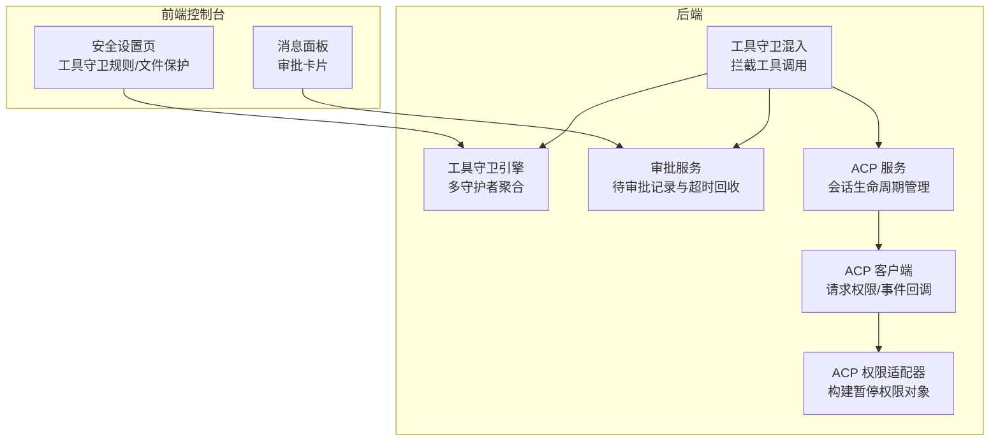
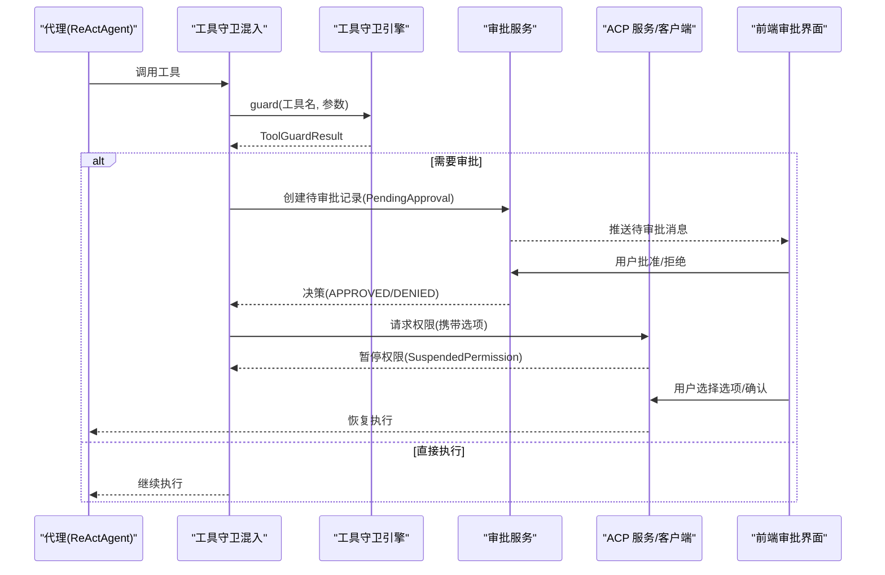
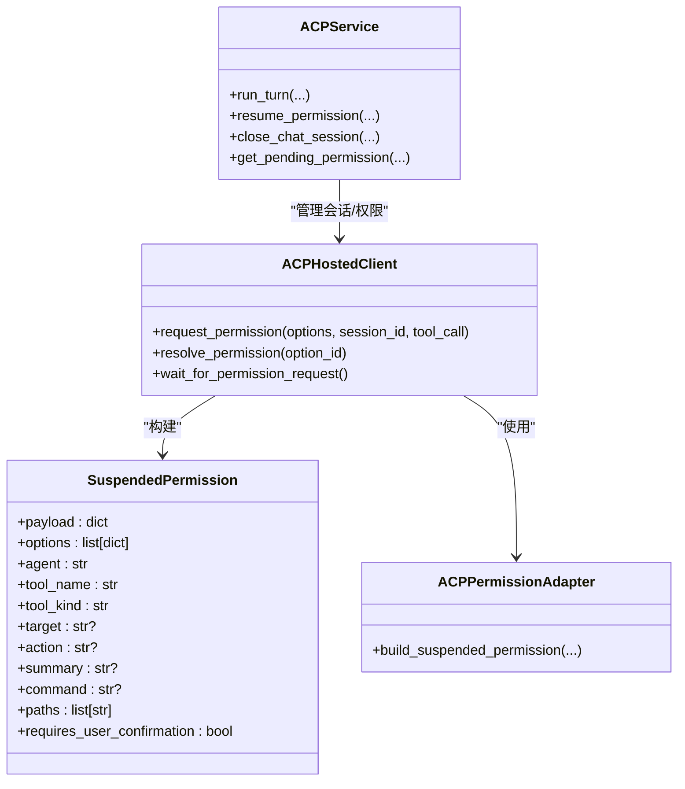
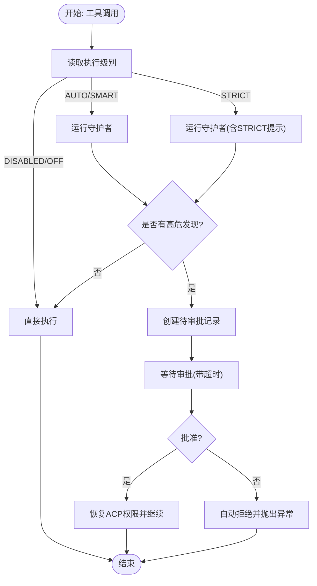
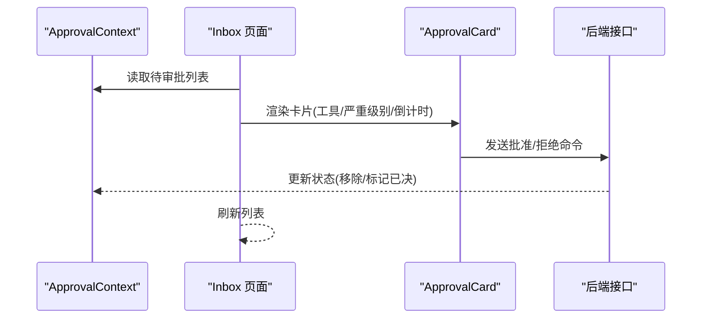
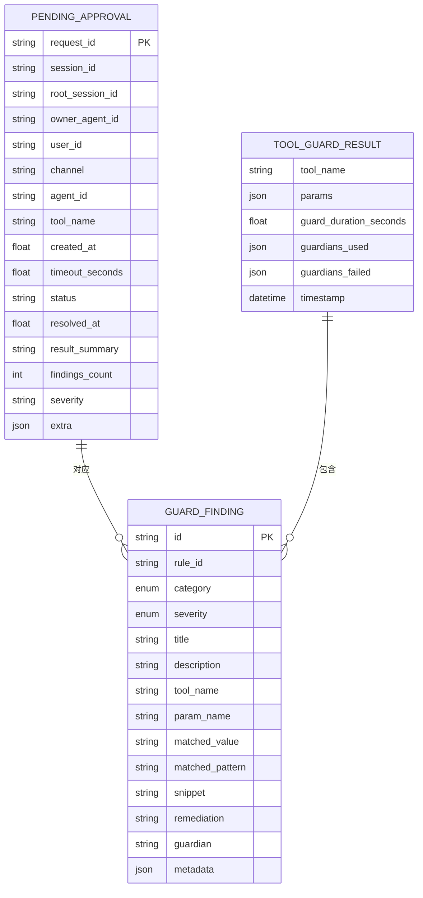
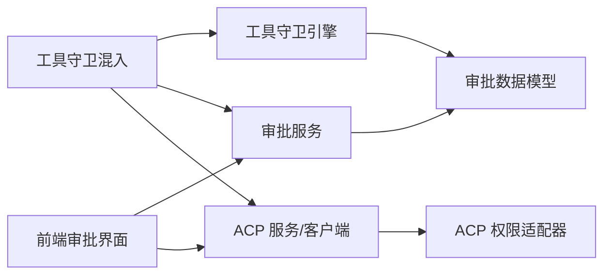

# 权限管理

<cite>
**本文引用的文件**
- [src/qwenpaw/agents/acp/__init__.py](file://src/qwenpaw/agents/acp/__init__.py)
- [src/qwenpaw/agents/acp/core.py](file://src/qwenpaw/agents/acp/core.py)
- [src/qwenpaw/agents/acp/service.py](file://src/qwenpaw/agents/acp/service.py)
- [src/qwenpaw/agents/acp/client.py](file://src/qwenpaw/agents/acp/client.py)
- [src/qwenpaw/agents/acp/permissions.py](file://src/qwenpaw/agents/acp/permissions.py)
- [src/qwenpaw/agents/acp/tool_adapter.py](file://src/qwenpaw/agents/acp/tool_adapter.py)
- [src/qwenpaw/agents/tool_guard_mixin.py](file://src/qwenpaw/agents/tool_guard_mixin.py)
- [src/qwenpaw/security/tool_guard/engine.py](file://src/qwenpaw/security/tool_guard/engine.py)
- [src/qwenpaw/security/tool_guard/models.py](file://src/qwenpaw/security/tool_guard/models.py)
- [src/qwenpaw/security/tool_guard/utils.py](file://src/qwenpaw/security/tool_guard/utils.py)
- [src/qwenpaw/app/approvals/service.py](file://src/qwenpaw/app/approvals/service.py)
- [console/src/contexts/ApprovalContext.tsx](file://console/src/contexts/ApprovalContext.tsx)
- [console/src/pages/Inbox/components/ApprovalCard.tsx](file://console/src/pages/Inbox/components/ApprovalCard.tsx)
- [console/src/pages/Inbox/index.tsx](file://console/src/pages/Inbox/index.tsx)
- [console/src/components/ApprovalCard/ApprovalCard.tsx](file://console/src/components/ApprovalCard/ApprovalCard.tsx)
- [console/src/api/modules/security.ts](file://console/src/api/modules/security.ts)
- [src/qwenpaw/config/config.py](file://src/qwenpaw/config/config.py)
- [website/public/docs/security.en.md](file://website/public/docs/security.en.md)
</cite>

## 目录
1. [简介](#简介)
2. [项目结构](#项目结构)
3. [核心组件](#核心组件)
4. [架构总览](#架构总览)
5. [详细组件分析](#详细组件分析)
6. [依赖关系分析](#依赖关系分析)
7. [性能考量](#性能考量)
8. [故障排查指南](#故障排查指南)
9. [结论](#结论)
10. [附录](#附录)

## 简介
本文件系统性阐述 QwenPaw 的权限管理体系，围绕基于 Agent Communication Protocol（ACP）的权限控制架构、角色与访问策略、用户与代理权限分配、代理权限管理、工具执行权限控制、审批流程、权限继承与动态调整、配置示例、测试方法与审计能力进行深入解析，并给出安全最佳实践、滥用防护与恢复机制建议。

## 项目结构
QwenPaw 的权限管理由“前端审批界面 + 后端工具守卫引擎 + ACP 会话与权限适配器 + 审批服务”协同实现，形成从参数级风险检测到会话级权限暂停与恢复的闭环。

图表来源
- [src/qwenpaw/agents/tool_guard_mixin.py:138-177](file://src/qwenpaw/agents/tool_guard_mixin.py#L138-L177)
- [src/qwenpaw/security/tool_guard/engine.py:200-257](file://src/qwenpaw/security/tool_guard/engine.py#L200-L257)
- [src/qwenpaw/app/approvals/service.py:84-137](file://src/qwenpaw/app/approvals/service.py#L84-L137)
- [src/qwenpaw/agents/acp/service.py:39-95](file://src/qwenpaw/agents/acp/service.py#L39-L95)
- [src/qwenpaw/agents/acp/client.py:94-132](file://src/qwenpaw/agents/acp/client.py#L94-L132)
- [src/qwenpaw/agents/acp/permissions.py:20-52](file://src/qwenpaw/agents/acp/permissions.py#L20-L52)

章节来源
- [src/qwenpaw/agents/acp/__init__.py:1-34](file://src/qwenpaw/agents/acp/__init__.py#L1-L34)
- [src/qwenpaw/agents/acp/service.py:39-95](file://src/qwenpaw/agents/acp/service.py#L39-L95)
- [src/qwenpaw/agents/acp/client.py:28-74](file://src/qwenpaw/agents/acp/client.py#L28-L74)
- [src/qwenpaw/agents/acp/permissions.py:20-52](file://src/qwenpaw/agents/acp/permissions.py#L20-L52)
- [src/qwenpaw/agents/tool_guard_mixin.py:138-200](file://src/qwenpaw/agents/tool_guard_mixin.py#L138-L200)
- [src/qwenpaw/security/tool_guard/engine.py:54-134](file://src/qwenpaw/security/tool_guard/engine.py#L54-L134)
- [src/qwenpaw/app/approvals/service.py:64-137](file://src/qwenpaw/app/approvals/service.py#L64-L137)

## 核心组件
- ACP 会话与权限控制：通过 ACP 服务管理会话生命周期，客户端在需要权限时暂停并上报 SuspendedPermission，等待前端审批或自动拒绝。
- 工具守卫引擎：对工具调用参数进行多守护者扫描，生成 ToolGuardResult，决定是否进入审批流程或直接拒绝。
- 审批服务：集中管理待审批记录，支持超时回收、取消与批量查询，保障会话内审批有序进行。
- 前端审批界面：提供 ApprovalCard 展示审批项、倒计时、严重级别与操作按钮，支持批准/拒绝/取消/确认。

章节来源
- [src/qwenpaw/agents/acp/core.py:44-57](file://src/qwenpaw/agents/acp/core.py#L44-L57)
- [src/qwenpaw/agents/acp/service.py:39-95](file://src/qwenpaw/agents/acp/service.py#L39-L95)
- [src/qwenpaw/agents/acp/client.py:94-132](file://src/qwenpaw/agents/acp/client.py#L94-L132)
- [src/qwenpaw/security/tool_guard/engine.py:200-257](file://src/qwenpaw/security/tool_guard/engine.py#L200-L257)
- [src/qwenpaw/app/approvals/service.py:64-137](file://src/qwenpaw/app/approvals/service.py#L64-L137)
- [console/src/pages/Inbox/components/ApprovalCard.tsx:1-39](file://console/src/pages/Inbox/components/ApprovalCard.tsx#L1-L39)

## 架构总览
下图展示从工具调用到权限暂停、前端审批与恢复执行的关键交互路径。

图表来源
- [src/qwenpaw/agents/tool_guard_mixin.py:138-177](file://src/qwenpaw/agents/tool_guard_mixin.py#L138-L177)
- [src/qwenpaw/security/tool_guard/engine.py:200-257](file://src/qwenpaw/security/tool_guard/engine.py#L200-L257)
- [src/qwenpaw/app/approvals/service.py:84-137](file://src/qwenpaw/app/approvals/service.py#L84-L137)
- [src/qwenpaw/agents/acp/client.py:94-132](file://src/qwenpaw/agents/acp/client.py#L94-L132)

## 详细组件分析

### ACP 权限控制架构
- 会话管理：ACPService 负责启动/关闭会话、并发锁、轮询等待权限请求、恢复权限并继续对话。
- 权限暂停：ACP 客户端在收到权限请求时，构建 SuspendedPermission 并通过消息通道通知前端；同时阻塞后续输出直到权限被解析。
- 选项解析：ACPPermissionAdapter 将工具调用与选项映射为 SuspendedPermission，包含工具名、类型、目标、命令、路径等字段，便于前端展示与决策。

图表来源
- [src/qwenpaw/agents/acp/core.py:44-57](file://src/qwenpaw/agents/acp/core.py#L44-L57)
- [src/qwenpaw/agents/acp/service.py:39-95](file://src/qwenpaw/agents/acp/service.py#L39-L95)
- [src/qwenpaw/agents/acp/client.py:28-74](file://src/qwenpaw/agents/acp/client.py#L28-L74)
- [src/qwenpaw/agents/acp/permissions.py:20-52](file://src/qwenpaw/agents/acp/permissions.py#L20-L52)

章节来源
- [src/qwenpaw/agents/acp/service.py:39-190](file://src/qwenpaw/agents/acp/service.py#L39-L190)
- [src/qwenpaw/agents/acp/client.py:94-132](file://src/qwenpaw/agents/acp/client.py#L94-L132)
- [src/qwenpaw/agents/acp/permissions.py:20-52](file://src/qwenpaw/agents/acp/permissions.py#L20-L52)

### 工具守卫与审批流程
- 执行级别：支持 DISABLED/OFF/AUTO/SMART/STRICT 等级别，不同级别决定是否需要审批、自动拒绝规则与严格模式提示。
- 守护者集合：默认包含路径检查、规则匹配、Shell 逃逸检测等守护者，可按需注册/注销。
- 审批记录：ApprovalService 统一创建、查询、超时与回收待审批记录，支持跨会话路由与取消。

图表来源
- [src/qwenpaw/agents/tool_guard_mixin.py:179-305](file://src/qwenpaw/agents/tool_guard_mixin.py#L179-L305)
- [src/qwenpaw/security/tool_guard/engine.py:200-257](file://src/qwenpaw/security/tool_guard/engine.py#L200-L257)
- [src/qwenpaw/app/approvals/service.py:84-137](file://src/qwenpaw/app/approvals/service.py#L84-L137)

章节来源
- [src/qwenpaw/agents/tool_guard_mixin.py:179-305](file://src/qwenpaw/agents/tool_guard_mixin.py#L179-L305)
- [src/qwenpaw/security/tool_guard/engine.py:54-134](file://src/qwenpaw/security/tool_guard/engine.py#L54-L134)
- [src/qwenpaw/app/approvals/service.py:64-137](file://src/qwenpaw/app/approvals/service.py#L64-L137)

### 前端审批界面与交互
- 上下文提供：ApprovalContext 提供全局待审批列表状态，页面组件通过 Provider 注入。
- 审批卡片：ApprovalCard 展示工具名、严重级别、时间倒计时与操作按钮；支持批准/拒绝/确认。
- 列表渲染：Inbox 页面根据会话与根会话筛选待审批项，支持取消任务触发的批量取消。

图表来源
- [console/src/contexts/ApprovalContext.tsx:1-29](file://console/src/contexts/ApprovalContext.tsx#L1-L29)
- [console/src/pages/Inbox/index.tsx:413-459](file://console/src/pages/Inbox/index.tsx#L413-L459)
- [console/src/pages/Inbox/components/ApprovalCard.tsx:1-39](file://console/src/pages/Inbox/components/ApprovalCard.tsx#L1-L39)
- [console/src/components/ApprovalCard/ApprovalCard.tsx:105-138](file://console/src/components/ApprovalCard/ApprovalCard.tsx#L105-L138)

章节来源
- [console/src/contexts/ApprovalContext.tsx:1-29](file://console/src/contexts/ApprovalContext.tsx#L1-L29)
- [console/src/pages/Inbox/index.tsx:413-459](file://console/src/pages/Inbox/index.tsx#L413-L459)
- [console/src/pages/Inbox/components/ApprovalCard.tsx:1-39](file://console/src/pages/Inbox/components/ApprovalCard.tsx#L1-L39)
- [console/src/components/ApprovalCard/ApprovalCard.tsx:105-138](file://console/src/components/ApprovalCard/ApprovalCard.tsx#L105-L138)

### 数据模型与规则
- 审批记录模型：PendingApproval 包含会话标识、根会话、代理、工具名、严重级别、超时秒数、额外信息等。
- 守护结果模型：ToolGuardResult 聚合多个 GuardFinding，包含最高严重级别、守护者使用情况与失败列表。
- 规则解析：支持从环境变量、配置文件与内置默认集解析受保护工具、禁止工具与自动拒绝规则。

图表来源
- [src/qwenpaw/app/approvals/service.py:36-57](file://src/qwenpaw/app/approvals/service.py#L36-L57)
- [src/qwenpaw/security/tool_guard/models.py:60-96](file://src/qwenpaw/security/tool_guard/models.py#L60-L96)
- [src/qwenpaw/security/tool_guard/models.py:103-176](file://src/qwenpaw/security/tool_guard/models.py#L103-L176)

章节来源
- [src/qwenpaw/app/approvals/service.py:36-137](file://src/qwenpaw/app/approvals/service.py#L36-L137)
- [src/qwenpaw/security/tool_guard/models.py:25-176](file://src/qwenpaw/security/tool_guard/models.py#L25-L176)
- [src/qwenpaw/security/tool_guard/utils.py:64-156](file://src/qwenpaw/security/tool_guard/utils.py#L64-L156)

## 依赖关系分析
- 组件耦合
  - 工具守卫混入依赖工具守卫引擎与审批服务，二者通过 ToolGuardResult 与 PendingApproval 解耦。
  - ACP 服务与客户端通过 SuspendedPermission 传递权限暂停信息，前端通过选项 ID 回传解析结果。
- 外部依赖
  - ACP 协议版本与能力协商由 acp SDK 提供，确保协议一致性。
  - 前端通过 API 模块与后端配置接口交互，支持工具守卫规则与文件保护策略的在线编辑。

图表来源
- [src/qwenpaw/agents/tool_guard_mixin.py:91-104](file://src/qwenpaw/agents/tool_guard_mixin.py#L91-L104)
- [src/qwenpaw/agents/acp/service.py:39-95](file://src/qwenpaw/agents/acp/service.py#L39-L95)
- [src/qwenpaw/agents/acp/client.py:28-74](file://src/qwenpaw/agents/acp/client.py#L28-L74)
- [src/qwenpaw/agents/acp/permissions.py:20-52](file://src/qwenpaw/agents/acp/permissions.py#L20-L52)
- [src/qwenpaw/app/approvals/service.py:64-137](file://src/qwenpaw/app/approvals/service.py#L64-L137)

章节来源
- [src/qwenpaw/agents/tool_guard_mixin.py:91-104](file://src/qwenpaw/agents/tool_guard_mixin.py#L91-L104)
- [src/qwenpaw/agents/acp/service.py:39-95](file://src/qwenpaw/agents/acp/service.py#L39-L95)
- [src/qwenpaw/agents/acp/client.py:28-74](file://src/qwenpaw/agents/acp/client.py#L28-L74)
- [src/qwenpaw/agents/acp/permissions.py:20-52](file://src/qwenpaw/agents/acp/permissions.py#L20-L52)
- [src/qwenpaw/app/approvals/service.py:64-137](file://src/qwenpaw/app/approvals/service.py#L64-L137)

## 性能考量
- 异步并发：ACP 服务使用 asyncio.Lock 保证会话内并发安全，权限等待与提示输出采用事件与 Future 机制避免阻塞。
- 轻量暂停：ACP 客户端在权限请求期间仅累积文本内容，减少不必要的流式传输开销。
- 守护者聚合：工具守卫引擎按级别与范围选择性运行守护者，避免全量扫描带来的延迟。
- 记忆与结果裁剪：上下文压缩与工具结果裁剪降低长对话与大结果带来的内存压力。

## 故障排查指南
- 会话冲突
  - 现象：重复调用 run_turn 抛出会话忙异常。
  - 处理：确保同一会话在 turn 结束前不重复启动，或显式重启会话。
- 权限未恢复
  - 现象：权限请求已下发但未恢复。
  - 处理：检查前端是否正确选择选项并回传；确认 ACP 客户端 resolve_permission 是否被调用。
- 审批超时
  - 现象：待审批记录被回收或超时。
  - 处理：缩短超时时间或提升审批响应速度；必要时取消旧请求再重试。
- 守护者异常
  - 现象：某个守护者失败导致整体结果异常。
  - 处理：查看 ToolGuardResult 中的 failed_guardians 列表，修复规则或禁用问题守护者。

章节来源
- [src/qwenpaw/agents/acp/service.py:59-95](file://src/qwenpaw/agents/acp/service.py#L59-L95)
- [src/qwenpaw/agents/acp/client.py:75-132](file://src/qwenpaw/agents/acp/client.py#L75-L132)
- [src/qwenpaw/app/approvals/service.py:270-303](file://src/qwenpaw/app/approvals/service.py#L270-L303)
- [src/qwenpaw/security/tool_guard/engine.py:240-257](file://src/qwenpaw/security/tool_guard/engine.py#L240-L257)

## 结论
QwenPaw 的权限管理以 ACP 会话为载体，结合工具守卫引擎与审批服务，实现了从参数级风险识别到会话级权限暂停与恢复的完整闭环。通过可配置的执行级别、规则解析与前端可视化审批，系统在保障安全的同时兼顾易用性与可观测性。

## 附录

### 权限配置示例
- ACP 代理配置
  - 在 ACPConfig 中启用/禁用代理、设置命令与参数、工具解析模式与 IO 缓冲限制。
- 工具守卫配置
  - 受保护工具集合、禁止工具集合、自动拒绝规则集合、Shell 逃逸检查开关。
- 文件保护
  - 通过安全设置页开启/关闭文件保护与指定允许路径。

章节来源
- [src/qwenpaw/config/config.py:104-118](file://src/qwenpaw/config/config.py#L104-L118)
- [src/qwenpaw/config/config.py:55-68](file://src/qwenpaw/config/config.py#L55-L68)
- [src/qwenpaw/security/tool_guard/utils.py:64-156](file://src/qwenpaw/security/tool_guard/utils.py#L64-L156)
- [console/src/api/modules/security.ts:15-23](file://console/src/api/modules/security.ts#L15-L23)

### 权限测试方法
- 单元测试
  - 使用工具守卫引擎对高危命令进行匹配测试，验证自动拒绝与审批流程。
- 集成测试
  - 模拟 ACP 会话与前端审批交互，验证 SuspendedPermission 构建与恢复路径。
- 场景回归
  - 验证跨会话审批路由、取消与超时回收逻辑。

### 权限审计功能
- 守护结果日志：Structured logging 输出每条发现与汇总信息，便于审计与告警。
- 审批历史：ApprovalService 记录创建时间、决策与摘要，支持查询与清理。

章节来源
- [src/qwenpaw/security/tool_guard/utils.py:159-194](file://src/qwenpaw/security/tool_guard/utils.py#L159-L194)
- [src/qwenpaw/app/approvals/service.py:84-137](file://src/qwenpaw/app/approvals/service.py#L84-L137)

### 权限安全最佳实践
- 最小权限原则：默认 AUTO/SMART 级别，仅对高危工具启用审批。
- 严格模式：对关键代理启用 STRICT 模式，强制所有工具审批。
- 规则治理：定期审查自动拒绝规则与自定义规则，避免误报与漏报。
- 环境隔离：限制工作目录与文件访问路径，结合文件保护策略。

### 权限滥用防护
- 自动拒绝：命中自动拒绝规则的工具调用直接拒绝，无需人工干预。
- 超时回收：待审批记录超时自动回收，防止僵尸请求占用资源。
- 取消与重放：支持取消旧请求与重放工具调用，避免重复审批堆积。

### 权限恢复机制
- 选项解析：前端选择具体权限选项后，ACP 客户端解析并恢复会话。
- 会话重启：必要时通过 restart 参数关闭旧会话并重新初始化。
- 任务取消：用户停止任务时自动拒绝当前会话内所有待审批请求。

章节来源
- [src/qwenpaw/agents/acp/client.py:75-132](file://src/qwenpaw/agents/acp/client.py#L75-L132)
- [src/qwenpaw/agents/acp/service.py:124-190](file://src/qwenpaw/agents/acp/service.py#L124-L190)
- [src/qwenpaw/app/approvals/service.py:346-386](file://src/qwenpaw/app/approvals/service.py#L346-L386)