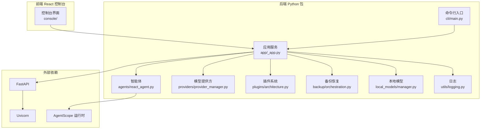
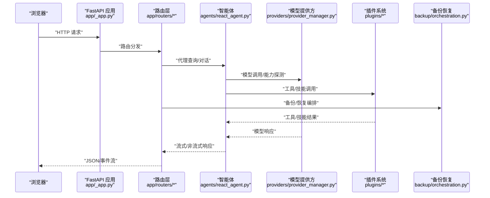
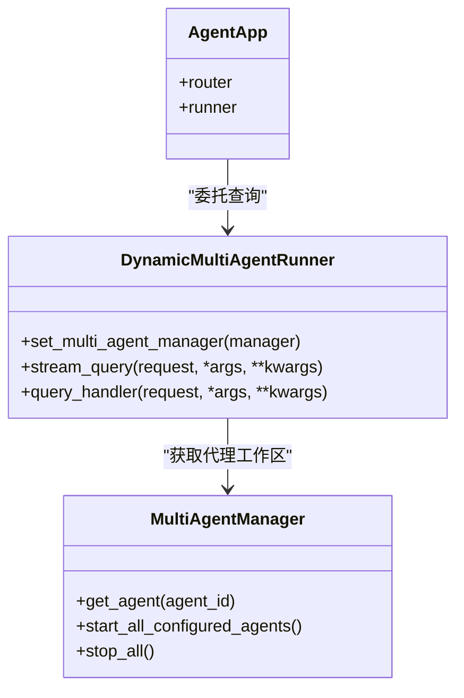
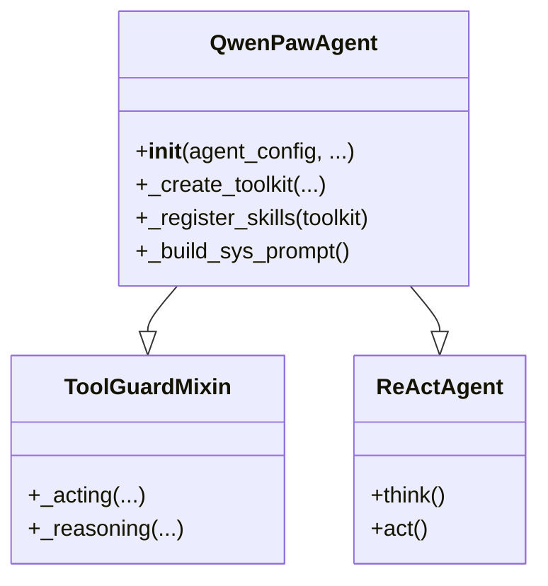
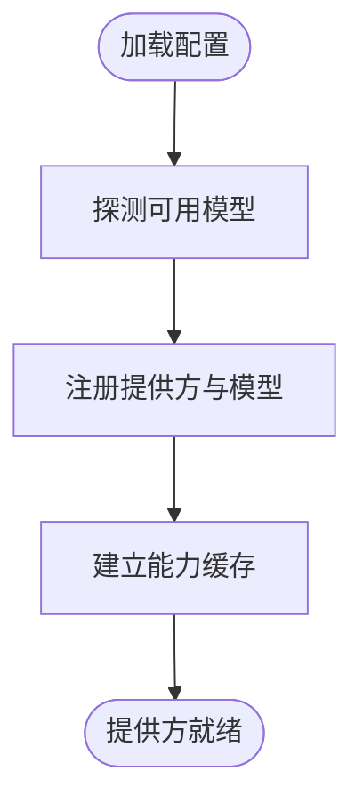
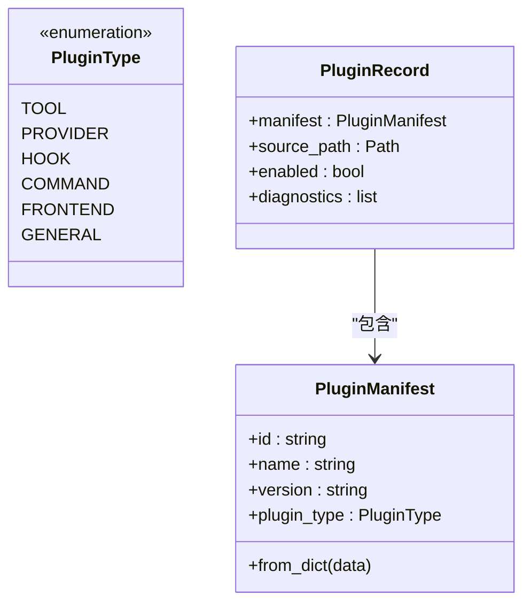
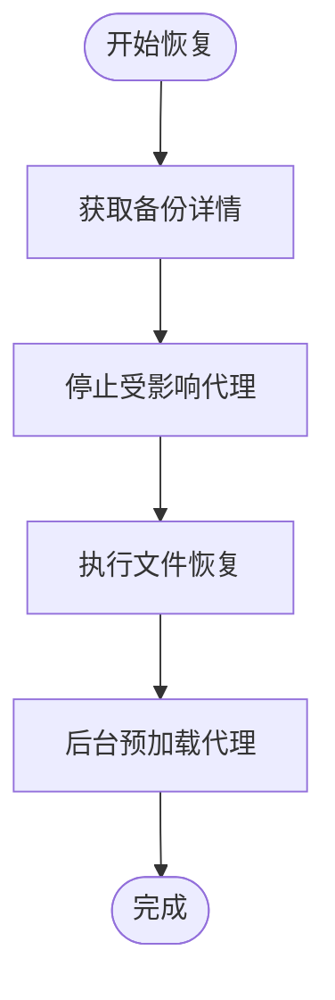
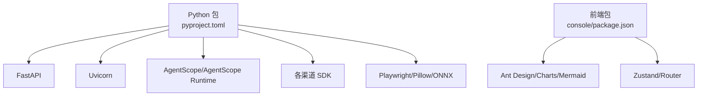

# 代码结构概览

<cite>
**本文档引用的文件**
- [README.md](file://README.md)
- [pyproject.toml](file://pyproject.toml)
- [console/package.json](file://console/package.json)
- [src/qwenpaw/__init__.py](file://src/qwenpaw/__init__.py)
- [src/qwenpaw/__main__.py](file://src/qwenpaw/__main__.py)
- [src/qwenpaw/app/_app.py](file://src/qwenpaw/app/_app.py)
- [src/qwenpaw/cli/main.py](file://src/qwenpaw/cli/main.py)
- [src/qwenpaw/providers/provider_manager.py](file://src/qwenpaw/providers/provider_manager.py)
- [src/qwenpaw/plugins/architecture.py](file://src/qwenpaw/plugins/architecture.py)
- [src/qwenpaw/agents/react_agent.py](file://src/qwenpaw/agents/react_agent.py)
- [src/qwenpaw/local_models/manager.py](file://src/qwenpaw/local_models/manager.py)
- [src/qwenpaw/backup/orchestration.py](file://src/qwenpaw/backup/orchestration.py)
- [src/qwenpaw/utils/logging.py](file://src/qwenpaw/utils/logging.py)
</cite>

## 目录
1. [简介](#简介)
2. [项目结构](#项目结构)
3. [核心组件](#核心组件)
4. [架构总览](#架构总览)
5. [详细组件分析](#详细组件分析)
6. [依赖分析](#依赖分析)
7. [性能考虑](#性能考虑)
8. [故障排除指南](#故障排除指南)
9. [结论](#结论)

## 简介
本文件为 QwenPaw 项目的代码结构概览文档，面向开发者与贡献者，帮助快速理解后端 Python 代码、前端 React 应用、插件系统与测试框架的整体架构与模块划分。文档重点覆盖以下方面：
- 整体架构设计：后端基于 FastAPI 的 Web 服务，前端基于 React/Vite 的控制台，二者通过 REST API 交互；插件系统贯穿前后端，支持工具、模型提供方、钩子、命令与前端资源扩展。
- 模块划分与职责：agents（智能体）、app（应用服务）、backup（备份恢复）、cli（命令行）、providers（模型提供方）、plugins（插件）、local_models（本地模型）、security（安全）、token_usage（用量统计）等。
- 代码导航指南：提供查找特定功能的路径建议，帮助快速定位实现位置。
- 依赖关系与交互模式：展示模块间耦合、协作与数据流，辅助理解启动流程、代理管理、插件加载与模型路由。

## 项目结构
QwenPaw 采用“后端 Python 包 + 前端 React 控制台 + 插件系统 + 测试框架”的分层架构：
- 后端 Python 包（src/qwenpaw）：包含应用服务、代理、通道、定时任务、MCP、路由器、工作区、备份、CLI、模型提供方、本地模型、安全与日志等模块。
- 前端 React 控制台（console）：使用 Vite 构建，提供聊天、代理配置、技能管理、插件管理等界面。
- 插件系统：支持工具、模型提供方、钩子、控制命令与前端资源的动态加载与注册。
- 测试框架：pytest，按单元、集成、契约与端到端分类组织。

图表来源
- [src/qwenpaw/app/_app.py:547-719](file://src/qwenpaw/app/_app.py#L547-L719)
- [src/qwenpaw/agents/react_agent.py:1-200](file://src/qwenpaw/agents/react_agent.py#L1-L200)
- [src/qwenpaw/providers/provider_manager.py:1-200](file://src/qwenpaw/providers/provider_manager.py#L1-L200)
- [src/qwenpaw/plugins/architecture.py:1-142](file://src/qwenpaw/plugins/architecture.py#L1-L142)
- [src/qwenpaw/backup/orchestration.py:1-147](file://src/qwenpaw/backup/orchestration.py#L1-L147)
- [src/qwenpaw/local_models/manager.py:1-200](file://src/qwenpaw/local_models/manager.py#L1-L200)
- [src/qwenpaw/cli/main.py:1-173](file://src/qwenpaw/cli/main.py#L1-L173)
- [src/qwenpaw/utils/logging.py:1-200](file://src/qwenpaw/utils/logging.py#L1-L200)

章节来源
- [README.md:444-466](file://README.md#L444-L466)
- [pyproject.toml:1-152](file://pyproject.toml#L1-L152)
- [console/package.json:1-79](file://console/package.json#L1-L79)

## 核心组件
本节对关键模块进行职责与接口说明，并给出代码路径参考。

- 应用服务（app/_app.py）
  - 职责：FastAPI 应用初始化、中间件注册、路由挂载、多代理运行器、插件系统、后台启动与关闭钩子、静态资源与 SPA 回退。
  - 关键点：动态多代理运行器、AgentApp 集成、生命周期管理、CORS/认证中间件、语音通道路由、自定义通道优先级。
  - 参考路径：[应用生命周期与路由:220-545](file://src/qwenpaw/app/_app.py#L220-L545)，[静态资源与 SPA 回退:668-719](file://src/qwenpaw/app/_app.py#L668-L719)

- 智能体（agents/react_agent.py）
  - 职责：基于 ReActAgent 的主智能体实现，集成工具、技能、内存与上下文管理，支持系统提示构建、工具守卫与计划笔记本。
  - 关键点：工具注册策略、技能解析与环境覆盖、内存工具注入、请求上下文与任务跟踪。
  - 参考路径：[类定义与初始化:80-200](file://src/qwenpaw/agents/react_agent.py#L80-L200)

- 模型提供方（providers/provider_manager.py）
  - 职责：统一管理内置与自定义模型提供方，提供模型列表、连接检查、密钥加密存储与能力缓存。
  - 关键点：内置提供方常量、OpenAI 兼容适配、模型能力探测、安全字段加解密。
  - 参考路径：[内置提供方与模型列表:46-800](file://src/qwenpaw/providers/provider_manager.py#L46-L800)

- 插件系统（plugins/architecture.py）
  - 职责：定义插件类型、清单与记录，支持工具、提供方、钩子、命令与前端资源的分类与加载。
  - 关键点：插件类型枚举、清单反序列化、类型推断兼容旧版清单。
  - 参考路径：[插件类型与清单:10-142](file://src/qwenpaw/plugins/architecture.py#L10-L142)

- 备份恢复（backup/orchestration.py）
  - 职责：编排备份恢复流程，确保在停止代理、原子替换文件与重启代理之间保持一致性。
  - 关键点：受影响代理集合、停止/预加载策略、异常后的恢复重启。
  - 参考路径：[恢复编排:44-147](file://src/qwenpaw/backup/orchestration.py#L44-L147)

- 本地模型（local_models/manager.py）
  - 职责：封装 llama.cpp 下载、服务器启停与模型下载，提供配置持久化与状态查询。
  - 关键点：配置模型、锁保护的生命周期操作、推荐模型查询。
  - 参考路径：[管理器与配置:23-200](file://src/qwenpaw/local_models/manager.py#L23-L200)

- 命令行（cli/main.py）
  - 职责：Click 分组命令入口，延迟加载子命令，记录初始化耗时，提供主机与端口参数。
  - 关键点：LazyGroup 实现、命令懒加载、版本选项、默认参数解析。
  - 参考路径：[命令分组与懒加载:58-173](file://src/qwenpaw/cli/main.py#L58-L173)

- 日志（utils/logging.py）
  - 职责：设置项目命名空间日志、彩色终端输出、安全滚动文件处理器、访问日志过滤。
  - 关键点：颜色格式化器、Windows ANSI 支持、滚动文件处理器容错。
  - 参考路径：[日志配置与处理器:154-226](file://src/qwenpaw/utils/logging.py#L154-L226)

章节来源
- [src/qwenpaw/app/_app.py:220-719](file://src/qwenpaw/app/_app.py#L220-L719)
- [src/qwenpaw/agents/react_agent.py:80-200](file://src/qwenpaw/agents/react_agent.py#L80-L200)
- [src/qwenpaw/providers/provider_manager.py:1-200](file://src/qwenpaw/providers/provider_manager.py#L1-L200)
- [src/qwenpaw/plugins/architecture.py:1-142](file://src/qwenpaw/plugins/architecture.py#L1-L142)
- [src/qwenpaw/backup/orchestration.py:1-147](file://src/qwenpaw/backup/orchestration.py#L1-L147)
- [src/qwenpaw/local_models/manager.py:1-200](file://src/qwenpaw/local_models/manager.py#L1-L200)
- [src/qwenpaw/cli/main.py:1-173](file://src/qwenpaw/cli/main.py#L1-L173)
- [src/qwenpaw/utils/logging.py:1-200](file://src/qwenpaw/utils/logging.py#L1-L200)

## 架构总览
下图展示了从浏览器到后端服务、再到智能体执行与插件系统的端到端交互流程：

图表来源
- [src/qwenpaw/app/_app.py:547-719](file://src/qwenpaw/app/_app.py#L547-L719)
- [src/qwenpaw/agents/react_agent.py:1-200](file://src/qwenpaw/agents/react_agent.py#L1-L200)
- [src/qwenpaw/providers/provider_manager.py:1-200](file://src/qwenpaw/providers/provider_manager.py#L1-L200)
- [src/qwenpaw/plugins/architecture.py:1-142](file://src/qwenpaw/plugins/architecture.py#L1-L142)
- [src/qwenpaw/backup/orchestration.py:1-147](file://src/qwenpaw/backup/orchestration.py#L1-L147)

## 详细组件分析

### 组件 A：应用生命周期与多代理运行器
- 功能要点
  - 动态多代理运行器根据请求头选择代理实例，统一处理流式与非流式查询。
  - 后台任务注册与注销，保证优雅停机期间可检测在途任务。
  - 生命周期钩子：启动阶段加载插件、注册控制命令、执行启动钩子；关闭阶段执行关闭钩子并清理资源。
- 交互模式
  - AgentApp 通过 Runner 接口与多代理管理器协作，实现按代理隔离的运行时。
  - 中间件负责认证、代理上下文与 CORS，确保路由优先级与安全。
- 代码路径
  - [动态运行器与生命周期:72-205](file://src/qwenpaw/app/_app.py#L72-L205)
  - [后台启动与插件加载:315-432](file://src/qwenpaw/app/_app.py#L315-L432)
  - [关闭钩子与资源清理:476-544](file://src/qwenpaw/app/_app.py#L476-L544)

图表来源
- [src/qwenpaw/app/_app.py:72-205](file://src/qwenpaw/app/_app.py#L72-L205)

章节来源
- [src/qwenpaw/app/_app.py:220-544](file://src/qwenpaw/app/_app.py#L220-L544)

### 组件 B：智能体与工具系统
- 功能要点
  - 基于 ReActAgent 的推理与行动循环，集成工具守卫拦截危险操作。
  - 技能系统按工作区目录动态加载，支持环境变量覆盖与有效技能解析。
  - 内存管理器与上下文管理器注入工具函数，增强记忆检索与上下文压缩。
- 代码路径
  - [智能体初始化与工具注册:100-185](file://src/qwenpaw/agents/react_agent.py#L100-L185)
  - [技能加载与环境覆盖:149-151](file://src/qwenpaw/agents/react_agent.py#L149-L151)

图表来源
- [src/qwenpaw/agents/react_agent.py:80-200](file://src/qwenpaw/agents/react_agent.py#L80-L200)

章节来源
- [src/qwenpaw/agents/react_agent.py:80-200](file://src/qwenpaw/agents/react_agent.py#L80-L200)

### 组件 C：模型提供方与能力缓存
- 功能要点
  - 统一内置提供方（DashScope、OpenAI、Gemini、Anthropic 等）与自定义提供方注册。
  - 提供模型能力探测、连接性检查与密钥安全存储。
- 代码路径
  - [内置提供方与模型列表:46-800](file://src/qwenpaw/providers/provider_manager.py#L46-L800)

图表来源
- [src/qwenpaw/providers/provider_manager.py:1-200](file://src/qwenpaw/providers/provider_manager.py#L1-L200)

章节来源
- [src/qwenpaw/providers/provider_manager.py:1-200](file://src/qwenpaw/providers/provider_manager.py#L1-L200)

### 组件 D：插件系统与清单
- 功能要点
  - 定义插件类型（工具、提供方、钩子、命令、前端、通用），支持从清单反序列化与类型推断。
  - 插件记录包含清单、源路径、启用状态与诊断信息。
- 代码路径
  - [插件类型与清单:10-142](file://src/qwenpaw/plugins/architecture.py#L10-L142)

图表来源
- [src/qwenpaw/plugins/architecture.py:10-142](file://src/qwenpaw/plugins/architecture.py#L10-L142)

章节来源
- [src/qwenpaw/plugins/architecture.py:1-142](file://src/qwenpaw/plugins/architecture.py#L1-L142)

### 组件 E：备份恢复编排
- 功能要点
  - 在恢复前停止可能持有文件句柄的代理，避免 Windows 上目录重命名失败。
  - 恢复完成后异步预加载受影响代理，保证服务尽快可用。
- 代码路径
  - [恢复编排与预加载:44-147](file://src/qwenpaw/backup/orchestration.py#L44-L147)

图表来源
- [src/qwenpaw/backup/orchestration.py:44-147](file://src/qwenpaw/backup/orchestration.py#L44-L147)

章节来源
- [src/qwenpaw/backup/orchestration.py:1-147](file://src/qwenpaw/backup/orchestration.py#L1-L147)

### 组件 F：本地模型管理
- 功能要点
  - 封装 llama.cpp 下载、服务器启停与模型下载，提供配置持久化与状态查询。
- 代码路径
  - [管理器与配置:23-200](file://src/qwenpaw/local_models/manager.py#L23-L200)

章节来源
- [src/qwenpaw/local_models/manager.py:1-200](file://src/qwenpaw/local_models/manager.py#L1-L200)

### 组件 G：命令行入口
- 功能要点
  - Click 分组命令，延迟加载子命令以优化启动时间；记录初始化耗时；支持主机与端口参数。
- 代码路径
  - [命令分组与懒加载:58-173](file://src/qwenpaw/cli/main.py#L58-L173)

章节来源
- [src/qwenpaw/cli/main.py:1-173](file://src/qwenpaw/cli/main.py#L1-L173)

### 组件 H：日志系统
- 功能要点
  - 设置项目命名空间日志、彩色终端输出、安全滚动文件处理器、访问日志过滤。
- 代码路径
  - [日志配置与处理器:154-226](file://src/qwenpaw/utils/logging.py#L154-L226)

章节来源
- [src/qwenpaw/utils/logging.py:1-200](file://src/qwenpaw/utils/logging.py#L1-L200)

## 依赖分析
- 包管理与打包
  - 使用 setuptools 打包，动态版本与包发现，包含前端构建产物与资源文件。
  - 可选依赖：dev（测试与覆盖率）、local（HuggingFace Hub）、adbpg（PostgreSQL）、whisper（音频转录）、sip/livekit（语音）等。
- 外部依赖
  - FastAPI/Uvicorn：Web 服务与 ASGI 服务器。
  - AgentScope/AgentScope Runtime：智能体框架与运行时引擎。
  - 各渠道 SDK（钉钉、飞书、Telegram 等）：多通道接入。
  - Playwright、Pillow、ONNXRuntime：浏览器自动化与多媒体处理。
- 前端依赖
  - Ant Design、Antd Design Charts、Mermaid、React Router、Zustand 等：UI 组件与状态管理。

图表来源
- [pyproject.toml:1-152](file://pyproject.toml#L1-L152)
- [console/package.json:1-79](file://console/package.json#L1-L79)

章节来源
- [pyproject.toml:1-152](file://pyproject.toml#L1-L152)
- [console/package.json:1-79](file://console/package.json#L1-L79)

## 性能考虑
- 启动性能
  - 应用服务采用“快速同步阶段 + 后台重初始化”策略，确保 API 可用与代理懒加载。
  - CLI 使用延迟加载减少启动时间。
- 并发与资源
  - 多代理运行器使用任务跟踪与外部任务注册，保障优雅停机。
  - 本地模型管理器使用锁保护生命周期操作，避免竞态。
- I/O 与磁盘
  - 备份恢复前停止代理释放文件句柄，避免 Windows 上目录重命名失败。
- 日志与可观测性
  - 彩色终端输出与滚动文件处理器，便于开发调试与生产问题排查。

## 故障排除指南
- 启动失败
  - 检查环境变量加载与日志级别设置；查看应用生命周期日志与后台启动错误。
  - 参考：[生命周期与错误处理:220-544](file://src/qwenpaw/app/_app.py#L220-L544)
- 插件加载失败
  - 查看插件清单解析与类型推断日志；确认插件目录与依赖安装。
  - 参考：[插件清单与类型推断:92-130](file://src/qwenpaw/plugins/architecture.py#L92-L130)
- 代理不可用或响应慢
  - 检查代理工作区是否已预加载；查看任务跟踪与外部任务注册情况。
  - 参考：[动态运行器与任务跟踪:128-194](file://src/qwenpaw/app/_app.py#L128-L194)
- 本地模型无法启动
  - 检查下载进度与服务器状态；确认端口占用与上下文长度配置。
  - 参考：[本地模型管理:133-200](file://src/qwenpaw/local_models/manager.py#L133-L200)
- 日志输出异常
  - 确认终端 ANSI 支持与日志处理器配置；检查滚动文件权限。
  - 参考：[日志配置:154-226](file://src/qwenpaw/utils/logging.py#L154-L226)

章节来源
- [src/qwenpaw/app/_app.py:220-544](file://src/qwenpaw/app/_app.py#L220-L544)
- [src/qwenpaw/plugins/architecture.py:92-130](file://src/qwenpaw/plugins/architecture.py#L92-L130)
- [src/qwenpaw/local_models/manager.py:133-200](file://src/qwenpaw/local_models/manager.py#L133-L200)
- [src/qwenpaw/utils/logging.py:154-226](file://src/qwenpaw/utils/logging.py#L154-L226)

## 结论
QwenPaw 通过清晰的模块划分与插件化架构，实现了从后端服务到前端控制台的完整链路。应用服务负责生命周期与路由，智能体承载推理与工具调用，模型提供方与本地模型管理提供灵活的推理能力，插件系统贯穿前后端扩展能力，备份恢复保障数据安全与可迁移性。该结构既满足了易用性与可扩展性，也为后续多代理协作、多模态与安全增强提供了坚实基础。