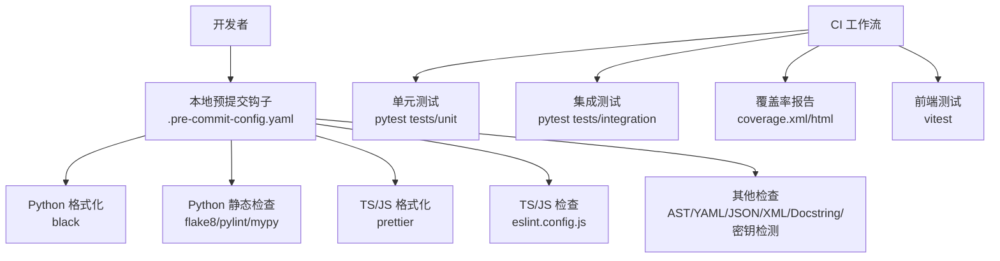
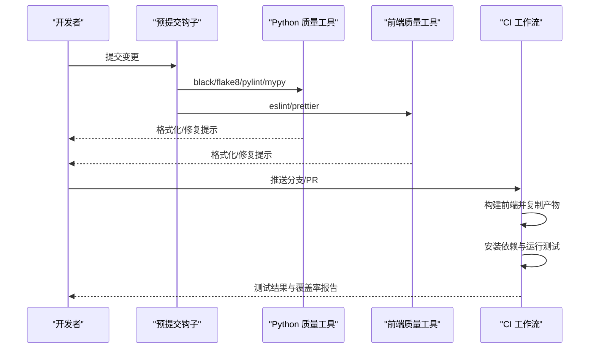
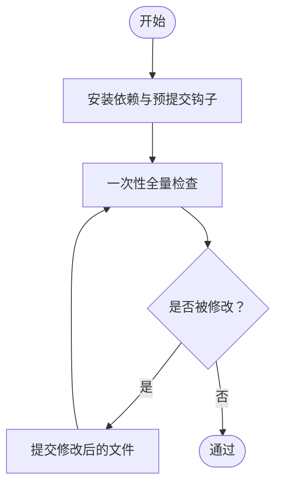
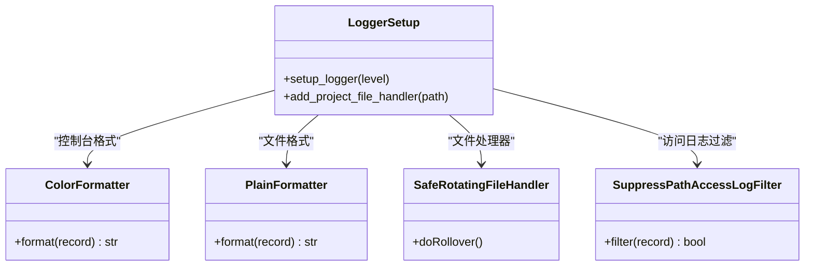
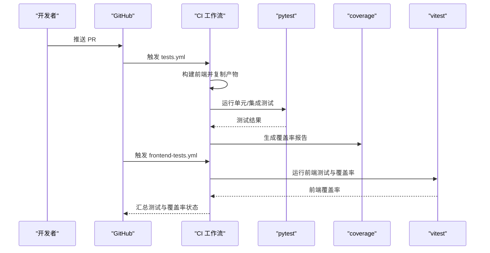
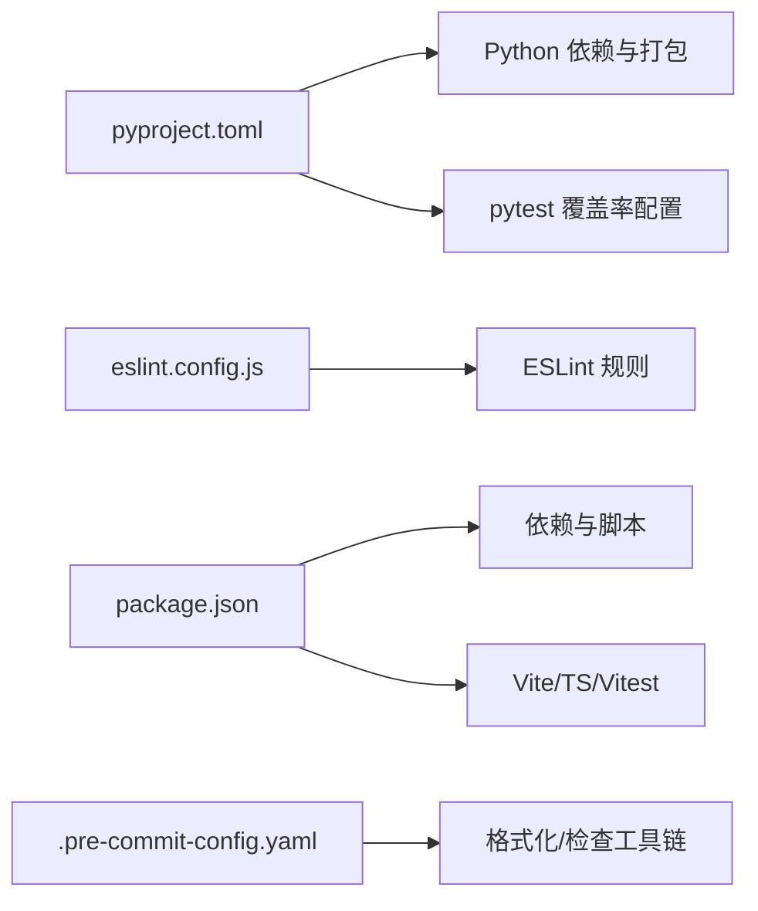

# 代码规范

<cite>
**本文引用的文件**   
- [.pre-commit-config.yaml](file://.pre-commit-config.yaml)
- [pyproject.toml](file://pyproject.toml)
- [.flake8](file://.flake8)
- [console/eslint.config.js](file://console/eslint.config.js)
- [console/package.json](file://console/package.json)
- [.github/workflows/tests.yml](file://.github/workflows/tests.yml)
- [.github/workflows/frontend-tests.yml](file://.github/workflows/frontend-tests.yml)
- [CONTRIBUTING.md](file://CONTRIBUTING.md)
- [src/qwenpaw/utils/logging.py](file://src/qwenpaw/utils/logging.py)
- [src/qwenpaw/exceptions.py](file://src/qwenpaw/exceptions.py)
- [src/qwenpaw/constant.py](file://src/qwenpaw/constant.py)
- [src/qwenpaw/__init__.py](file://src/qwenpaw/__init__.py)
</cite>

## 目录
1. [简介](#简介)
2. [项目结构与质量门禁概览](#项目结构与质量门禁概览)
3. [核心组件与质量工具链](#核心组件与质量工具链)
4. [架构总览](#架构总览)
5. [详细规范与最佳实践](#详细规范与最佳实践)
   1. [Python 后端代码规范](#python-后端代码规范)
   2. [TypeScript/JavaScript 前端代码规范](#typescriptjavascript-前端代码规范)
   3. [预提交钩子与自动化质量门](#预提交钩子与自动化质量门)
   4. [文档注释与错误处理模式](#文档注释与错误处理模式)
   5. [日志记录标准](#日志记录标准)
   6. [一致性检查与 CI 流程](#一致性检查与-ci-流程)
6. [依赖关系分析](#依赖关系分析)
7. [性能与可维护性建议](#性能与可维护性建议)
8. [故障排查指南](#故障排查指南)
9. [结论](#结论)

## 简介
本文件为 QwenPaw 的统一代码规范文档，覆盖后端 Python 与前端 TypeScript/JavaScript 的风格、命名、注释、错误处理与日志记录等规范，并系统阐述预提交钩子、自动格式化、静态检查与 CI 质量门策略。目标是确保跨语言、跨模块的一致性与可维护性，降低回归风险，提升协作效率。

## 项目结构与质量门禁概览
- 后端 Python：使用 flake8、black、mypy、pylint 进行静态检查与格式化；pytest 覆盖单元与集成测试；覆盖率报告生成与上传。
- 前端 TypeScript/JS：ESLint + Prettier 格式化与检查；Vitest 单测与覆盖率；Vite 构建。
- 预提交钩子：集中管理各类检查与格式化任务，避免问题进入仓库。
- CI：在多平台与多 Python 版本上运行测试与覆盖率，必要时要求维护者审批。

**图表来源**
- [.pre-commit-config.yaml:1-121](file://.pre-commit-config.yaml#L1-L121)
- [console/eslint.config.js:1-29](file://console/eslint.config.js#L1-L29)
- [console/package.json:1-79](file://console/package.json#L1-L79)
- [.github/workflows/tests.yml:1-252](file://.github/workflows/tests.yml#L1-L252)
- [.github/workflows/frontend-tests.yml:1-50](file://.github/workflows/frontend-tests.yml#L1-L50)

**章节来源**
- [.pre-commit-config.yaml:1-121](file://.pre-commit-config.yaml#L1-L121)
- [pyproject.toml:116-152](file://pyproject.toml#L116-L152)
- [console/eslint.config.js:1-29](file://console/eslint.config.js#L1-L29)
- [console/package.json:1-79](file://console/package.json#L1-L79)
- [.github/workflows/tests.yml:1-252](file://.github/workflows/tests.yml#L1-L252)
- [.github/workflows/frontend-tests.yml:1-50](file://.github/workflows/frontend-tests.yml#L1-L50)

## 核心组件与质量工具链
- Python
  - 格式化：black（行宽 79）
  - 静态检查：flake8（行宽 79、忽略特定规则）、pylint（禁用若干规则以适配项目现状）、mypy（跳过部分文件类型）
- 前端
  - ESLint：基于 typescript-eslint 推荐规则集，启用 react-hooks 规则，限制刷新策略
  - Prettier：统一格式化
  - Vitest：单测与覆盖率
  - Vite：构建与预览
- 预提交
  - 统一入口，按需排除特定目录（如 skills/、scripts/pack/），避免对生成物与第三方内容重复检查
- CI
  - 多平台矩阵：Ubuntu/MacOS/Windows，Python 3.10/3.13
  - 前端构建与复制到包内，再执行 Python 测试与覆盖率
  - 前端单独工作流运行 Vitest 并生成覆盖率工件

**章节来源**
- [.pre-commit-config.yaml:54-121](file://.pre-commit-config.yaml#L54-L121)
- [.flake8:1-12](file://.flake8#L1-L12)
- [console/eslint.config.js:1-29](file://console/eslint.config.js#L1-L29)
- [console/package.json:6-20](file://console/package.json#L6-L20)
- [.github/workflows/tests.yml:31-252](file://.github/workflows/tests.yml#L31-L252)
- [.github/workflows/frontend-tests.yml:1-50](file://.github/workflows/frontend-tests.yml#L1-L50)

## 架构总览
下图展示从“开发者提交”到“CI 质量门”的关键流程，以及前后端质量工具的协同关系。

**图表来源**
- [.pre-commit-config.yaml:1-121](file://.pre-commit-config.yaml#L1-L121)
- [console/eslint.config.js:1-29](file://console/eslint.config.js#L1-L29)
- [console/package.json:6-20](file://console/package.json#L6-L20)
- [.github/workflows/tests.yml:59-88](file://.github/workflows/tests.yml#L59-L88)

**章节来源**
- [.pre-commit-config.yaml:1-121](file://.pre-commit-config.yaml#L1-L121)
- [console/eslint.config.js:1-29](file://console/eslint.config.js#L1-L29)
- [console/package.json:6-20](file://console/package.json#L6-L20)
- [.github/workflows/tests.yml:59-88](file://.github/workflows/tests.yml#L59-L88)

## 详细规范与最佳实践

### Python 后端代码规范
- 代码风格与格式
  - 使用 black 进行格式化，行宽 79；禁止在 skills/ 与 scripts/pack/ 目录下运行 AST/YAML/JSON/XML/Docstring 等检查，避免对生成物与第三方内容重复检查。
  - flake8 行宽 79，忽略部分规则（如 F401/F403/W503/E731）以适配现有代码。
  - mypy 作为类型检查器，跳过 pb2.py/grpc.py、docs、HTML、skills 等路径，参数包含忽略缺失导入、多种错误类型与 follow-imports=skip。
- 命名约定
  - 变量与函数：采用 snake_case
  - 类：采用 PascalCase
  - 常量：采用 UPPER_CASE
  - 包与模块：采用 lower_with_underscores
- 注释与文档字符串
  - 遵循“先文档字符串，后代码”的顺序（check-docstring-first）
  - 保持简洁明确，避免无意义注释
- 错误处理与异常
  - 使用专用异常类区分业务场景（如 ProviderError、ChannelError、AgentStateError、SkillsError）
  - 对模型相关异常进行转换，保留原始错误类型与消息，映射常见状态码与关键词
- 日志
  - 使用项目内置日志模块，支持彩色终端输出、文件轮转、访问日志过滤
- 文件组织
  - 严格遵循 src 目录结构，包数据包含 console 构建产物与技能资源
- 测试与覆盖率
  - 使用 pytest，标记分类（unit/contract/integration/slow），覆盖率阈值与 HTML 报告目录已配置

**章节来源**
- [.pre-commit-config.yaml:54-121](file://.pre-commit-config.yaml#L54-L121)
- [.flake8:1-12](file://.flake8#L1-L12)
- [pyproject.toml:116-152](file://pyproject.toml#L116-L152)
- [src/qwenpaw/exceptions.py:1-254](file://src/qwenpaw/exceptions.py#L1-L254)
- [src/qwenpaw/utils/logging.py:1-226](file://src/qwenpaw/utils/logging.py#L1-L226)

### TypeScript/JavaScript 前端代码规范
- 语言与工具链
  - 使用 TypeScript 与 React 生态，ESLint 基于 typescript-eslint 推荐规则，启用 react-hooks 规则
  - 通过 eslint-plugin-react-refresh 限制刷新策略，仅允许常量导出
  - Prettier 用于统一格式化
- 目录与脚本
  - 构建与预览脚本：dev/build/preview/test/coverage
  - 依赖与开发依赖版本固定，便于一致性
- 样式与组件
  - 使用 Ant Design 与 antd-style，Less 支持
  - 组件命名采用 PascalCase，样式文件以 .module.less 命名
- 测试
  - Vitest 单测与覆盖率，提供独立工作流

**章节来源**
- [console/eslint.config.js:1-29](file://console/eslint.config.js#L1-L29)
- [console/package.json:1-79](file://console/package.json#L1-L79)
- [.github/workflows/frontend-tests.yml:1-50](file://.github/workflows/frontend-tests.yml#L1-L50)

### 预提交钩子与自动化质量门
- 钩子配置要点
  - 统一仓库级配置，按需排除 skills/ 与 scripts/pack/ 等目录
  - 优先修复型钩子（add-trailing-comma、fix-encoding-pragma、trailing-whitespace）
  - 静态检查与格式化并行执行，减少等待时间
- 本地执行步骤
  - 安装依赖与预提交钩子，一次性全量检查
  - 若被修改，提交后再跑一次直至通过
- 前端格式化
  - 如涉及 console/website 目录，提交前分别运行格式化脚本

**图表来源**
- [.pre-commit-config.yaml:1-121](file://.pre-commit-config.yaml#L1-L121)
- [CONTRIBUTING.md:70-86](file://CONTRIBUTING.md#L70-L86)

**章节来源**
- [.pre-commit-config.yaml:1-121](file://.pre-commit-config.yaml#L1-L121)
- [CONTRIBUTING.md:70-86](file://CONTRIBUTING.md#L70-L86)

### 文档注释与错误处理模式
- 文档注释
  - 优先使用“先文档字符串，后代码”的顺序，确保 API 与模块边界清晰
- 错误处理
  - 业务异常：ProviderError、ChannelError、AgentStateError、SkillsError
  - 模型异常转换：convert_model_exception 将常见状态码与关键词映射为统一异常类型，保留原始错误详情
- 最佳实践
  - 在异常构造时补充上下文（如 channel 名称、会话 ID、模型名称），便于定位问题
  - 对外部服务异常进行归一化，避免泄露底层细节

**章节来源**
- [src/qwenpaw/exceptions.py:1-254](file://src/qwenpaw/exceptions.py#L1-L254)

### 日志记录标准
- 初始化与命名空间
  - 包初始化时设置日志级别与格式，限定日志命名空间为项目小写名
- 终端与文件
  - 彩色终端输出（非终端环境自动降级），文件轮转（最大 5MiB，3 个备份），Windows 下容忍锁导致的旋转失败
- 访问日志过滤
  - 提供过滤器以抑制特定路径的 uvicorn 访问日志
- 使用建议
  - 仅向项目命名空间输出日志，避免污染第三方库
  - 在守护进程场景添加文件处理器，确保持久化日志

**图表来源**
- [src/qwenpaw/utils/logging.py:154-226](file://src/qwenpaw/utils/logging.py#L154-L226)

**章节来源**
- [src/qwenpaw/utils/logging.py:1-226](file://src/qwenpaw/utils/logging.py#L1-L226)
- [src/qwenpaw/__init__.py:1-33](file://src/qwenpaw/__init__.py#L1-L33)

### 一致性检查与 CI 流程
- CI 策略
  - 多平台矩阵：Ubuntu/MacOS/Windows，Python 3.10/3.13
  - 先构建前端并复制到包内，再安装依赖运行测试与覆盖率
  - 前端单独工作流运行 Vitest，生成覆盖率工件
- 质量门
  - 预提交失败即不可合并
  - CI 中测试失败或覆盖率不足将阻断合并

**图表来源**
- [.github/workflows/tests.yml:59-216](file://.github/workflows/tests.yml#L59-L216)
- [.github/workflows/frontend-tests.yml:16-49](file://.github/workflows/frontend-tests.yml#L16-L49)

**章节来源**
- [.github/workflows/tests.yml:1-252](file://.github/workflows/tests.yml#L1-L252)
- [.github/workflows/frontend-tests.yml:1-50](file://.github/workflows/frontend-tests.yml#L1-L50)

## 依赖关系分析
- Python
  - 依赖管理与打包：setuptools 动态版本与包发现，包含 console 构建产物与技能资源
  - 测试与覆盖率：pytest 标记与覆盖率配置
- 前端
  - 依赖与开发依赖版本固定，ESLint/Prettier/Vitest/Vite 配置集中
- 预提交
  - 统一入口，按文件类型与路径排除，避免对生成物与第三方内容重复检查

**图表来源**
- [pyproject.toml:1-152](file://pyproject.toml#L1-L152)
- [console/eslint.config.js:1-29](file://console/eslint.config.js#L1-L29)
- [console/package.json:1-79](file://console/package.json#L1-L79)
- [.pre-commit-config.yaml:1-121](file://.pre-commit-config.yaml#L1-L121)

**章节来源**
- [pyproject.toml:1-152](file://pyproject.toml#L1-L152)
- [console/package.json:1-79](file://console/package.json#L1-L79)
- [.pre-commit-config.yaml:1-121](file://.pre-commit-config.yaml#L1-L121)

## 性能与可维护性建议
- 代码体积与复杂度
  - 控制函数与类的复杂度，避免长函数与深层嵌套
- 日志与 I/O
  - 使用文件轮转与访问日志过滤，避免日志风暴
- 测试与覆盖率
  - 保持高覆盖率，关注缺失路径与条件分支
- 前端构建
  - 合理拆分与懒加载，减少首屏体积

[本节为通用建议，无需具体文件引用]

## 故障排查指南
- 预提交失败
  - 按提示修复格式或静态检查问题；若被修改，提交后再跑一次直至通过
- Python 异常定位
  - 使用 convert_model_exception 的映射结果与 details 字段快速判断来源与原因
- 日志问题
  - 检查命名空间与文件处理器是否正确添加；确认终端颜色支持与 Windows 兼容性
- CI 失败
  - 查看测试与覆盖率报告，确认矩阵中的平台与 Python 版本是否满足预期

**章节来源**
- [CONTRIBUTING.md:70-86](file://CONTRIBUTING.md#L70-L86)
- [src/qwenpaw/exceptions.py:165-254](file://src/qwenpaw/exceptions.py#L165-L254)
- [src/qwenpaw/utils/logging.py:154-226](file://src/qwenpaw/utils/logging.py#L154-L226)
- [.github/workflows/tests.yml:227-252](file://.github/workflows/tests.yml#L227-L252)

## 结论
本规范以“统一工具链 + 明确约定 + CI 质量门”为核心，覆盖 Python 与前端的关键质量维度。建议团队在日常开发中：
- 严格遵守预提交与 CI 要求
- 使用统一的格式化与静态检查工具
- 在异常与日志中保留足够上下文
- 持续优化测试与覆盖率，保障稳定性与可维护性