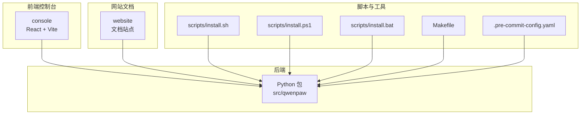
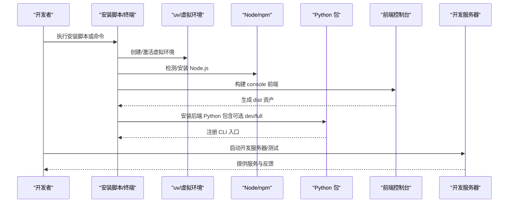
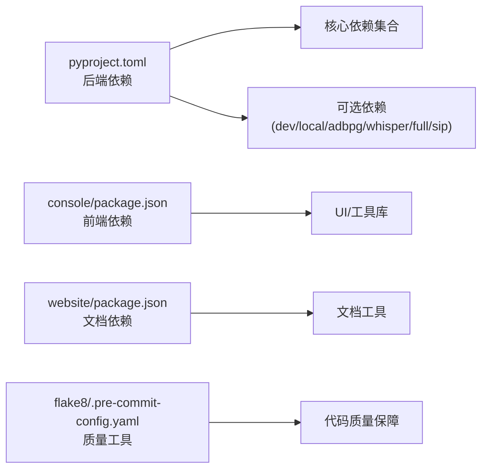

# 开发环境搭建

<cite>
**本文引用的文件**
- [pyproject.toml](file://pyproject.toml)
- [setup.py](file://setup.py)
- [README.md](file://README.md)
- [console/package.json](file://console/package.json)
- [website/package.json](file://website/package.json)
- [.pre-commit-config.yaml](file://.pre-commit-config.yaml)
- [scripts/install.sh](file://scripts/install.sh)
- [scripts/install.ps1](file://scripts/install.ps1)
- [scripts/install.bat](file://scripts/install.bat)
- [Makefile](file://Makefile)
- [console/eslint.config.js](file://console/eslint.config.js)
- [console/tsconfig.json](file://console/tsconfig.json)
- [console/vite.config.ts](file://console/vite.config.ts)
- [.flake8](file://.flake8)
- [scripts/run_tests.py](file://scripts/run_tests.py)
</cite>

## 目录
1. [简介](#简介)
2. [项目结构](#项目结构)
3. [核心组件](#核心组件)
4. [架构总览](#架构总览)
5. [详细组件分析](#详细组件分析)
6. [依赖分析](#依赖分析)
7. [性能考虑](#性能考虑)
8. [故障排除指南](#故障排除指南)
9. [结论](#结论)
10. [附录](#附录)

## 简介
本指南面向希望在本地进行 QwenPaw 开发的工程师，覆盖 Python 环境配置、依赖安装、前端构建、开发工具链、跨平台安装脚本、预提交钩子、测试与覆盖率、以及开发服务器启动的完整流程。文档同时提供 Windows、Linux、macOS 的分步操作与常见问题解决方案，帮助你快速搭建一致且可复现的开发环境。

## 项目结构
QwenPaw 采用“后端 Python 包 + 前端控制台 + 插件与技能资源”的多模块组织方式：
- 后端核心：src/qwenpaw（Python 包，包含应用、通道、运行器、工作区等）
- 控制台前端：console（React + TypeScript，Vite 构建）
- 网站文档：website（文档站点）
- 脚本与打包：scripts（安装、测试、打包脚本）
- 测试：tests（单元、集成、契约测试）

图表来源
- [pyproject.toml](file://pyproject.toml)
- [console/vite.config.ts](file://console/vite.config.ts)
- [scripts/install.sh](file://scripts/install.sh)
- [scripts/install.ps1](file://scripts/install.ps1)
- [scripts/install.bat](file://scripts/install.bat)
- [Makefile](file://Makefile)
- [.pre-commit-config.yaml](file://.pre-commit-config.yaml)

章节来源
- [pyproject.toml](file://pyproject.toml)
- [console/vite.config.ts](file://console/vite.config.ts)
- [scripts/install.sh](file://scripts/install.sh)
- [scripts/install.ps1](file://scripts/install.ps1)
- [scripts/install.bat](file://scripts/install.bat)
- [Makefile](file://Makefile)
- [.pre-commit-config.yaml](file://.pre-commit-config.yaml)

## 核心组件
- Python 包与依赖管理：通过 pyproject.toml 声明核心依赖、可选依赖与脚本入口；setup.py 作为 setuptools 入口。
- 前端控制台：console 使用 Vite + React + TypeScript，提供开发服务器、构建与测试能力。
- 安装与跨平台脚本：提供 macOS/Linux 一键安装脚本与 Windows PowerShell/Batch 安装脚本，自动处理 uv、虚拟环境与前端资源。
- 测试与覆盖率：Makefile 提供统一测试目标；scripts/run_tests.py 提供 Python 测试运行器。
- 预提交钩子：.pre-commit-config.yaml 统一代码风格与静态检查。

章节来源
- [pyproject.toml](file://pyproject.toml)
- [setup.py](file://setup.py)
- [console/package.json](file://console/package.json)
- [console/vite.config.ts](file://console/vite.config.ts)
- [scripts/install.sh](file://scripts/install.sh)
- [scripts/install.ps1](file://scripts/install.ps1)
- [scripts/install.bat](file://scripts/install.bat)
- [Makefile](file://Makefile)
- [scripts/run_tests.py](file://scripts/run_tests.py)
- [.pre-commit-config.yaml](file://.pre-commit-config.yaml)

## 架构总览
下图展示开发环境的关键交互：开发者通过安装脚本或手动方式准备 Python/Node 环境，构建前端控制台，安装后端 Python 包，然后启动开发服务器与测试工具。

图表来源
- [scripts/install.sh](file://scripts/install.sh)
- [scripts/install.ps1](file://scripts/install.ps1)
- [scripts/install.bat](file://scripts/install.bat)
- [console/vite.config.ts](file://console/vite.config.ts)
- [pyproject.toml](file://pyproject.toml)

## 详细组件分析

### Python 环境与依赖管理
- Python 版本要求：支持 3.10 ~ <3.14。
- 核心依赖：HTTP 客户端、调度器、浏览器自动化、消息通道 SDK、加密与配置管理、模型与推理库等。
- 可选依赖：
  - dev：测试与覆盖率相关工具
  - local：本地模型访问
  - adbpg：PostgreSQL 支持
  - whisper：语音识别
  - full：组合 local 与 whisper
  - sip/livekit：语音 SIP 能力
- CLI 入口：qwenpaw/copaw 命令指向主 CLI 入口。

建议步骤
- 使用 uv 创建隔离虚拟环境（推荐），或系统自带 Python venv。
- 安装开发依赖：pip install -e ".[dev,full]"。
- 如需特定功能，可按需启用 extras（如 whisper、adbpg）。

章节来源
- [pyproject.toml](file://pyproject.toml)
- [setup.py](file://setup.py)

### 前端控制台（console）开发环境
- 技术栈：React、TypeScript、Vite、Ant Design、Mermaid 等。
- 关键脚本：
  - dev：启动开发服务器（端口 5173，允许外网访问）
  - build：生产构建
  - test：运行单元测试（Vitest + jsdom）
  - lint/format：ESLint 与 Prettier
- 构建产物输出到后端包内目录，便于打包与发布。

建议步骤
- 在 console 目录执行 npm ci 安装依赖。
- 启动开发服务器：npm run dev。
- 若需测试，使用 npm run test 或 npm run test:run。

章节来源
- [console/package.json](file://console/package.json)
- [console/vite.config.ts](file://console/vite.config.ts)
- [console/eslint.config.js](file://console/eslint.config.js)
- [console/tsconfig.json](file://console/tsconfig.json)

### 跨平台安装脚本（Windows/Linux/macOS）
- macOS/Linux：scripts/install.sh 自动检测 uv、创建 Python 3.12 虚拟环境、安装后端包、复制 console 前端资产、创建包装脚本并更新 PATH。
- Windows：提供 PowerShell（install.ps1）与 Batch（install.bat）两种安装方式，逻辑类似，支持从源码或 PyPI 安装，并处理 PATH 注册与 Constrained Language Mode 场景。
- 可选参数：
  - --version 指定版本
  - --from-source 从本地或 GitHub 源码安装
  - --extras 指定 extras（如 dev,whisper）

章节来源
- [scripts/install.sh](file://scripts/install.sh)
- [scripts/install.ps1](file://scripts/install.ps1)
- [scripts/install.bat](file://scripts/install.bat)

### 预提交钩子（pre-commit）
- 钩子类型：语法检查、YAML/JSON/XML 校验、编码与换行处理、类型检查（mypy）、代码风格（black、flake8、pylint）、格式化（prettier）。
- 排除规则：技能目录与打包脚本等路径不参与部分检查，以减少噪音。
- 安装：pip install -e ".[dev]" 后执行 pre-commit install。

章节来源
- [.pre-commit-config.yaml](file://.pre-commit-config.yaml)
- [pyproject.toml](file://pyproject.toml)

### 测试与覆盖率
- Makefile 提供统一测试目标：test、test-unit、test-contract、test-integration、coverage-full、quick、channel 相关测试。
- scripts/run_tests.py 提供 Python 测试运行器，支持并行执行（需 pytest-xdist）与覆盖率报告。
- 建议流程：
  - 安装开发依赖：pip install -e ".[dev,full]"
  - 执行 Makefile 目标或 run_tests.py
  - 查看 htmlcov 报告

章节来源
- [Makefile](file://Makefile)
- [scripts/run_tests.py](file://scripts/run_tests.py)
- [pyproject.toml](file://pyproject.toml)

### 开发服务器与本地启动
- 后端启动：qwenpaw app（首次运行需先 qwenpaw init --defaults 或交互式初始化）。
- 前端开发：console 目录 npm run dev，默认监听 0.0.0.0:5173。
- 端口冲突：如需调整前端端口，可在 vite.config.ts 中修改 server.port。

章节来源
- [README.md](file://README.md)
- [console/vite.config.ts](file://console/vite.config.ts)

## 依赖分析
- 后端依赖：集中于 pyproject.toml 的 dependencies 与 optional-dependencies，涵盖 HTTP、调度、浏览器自动化、消息通道、加密、模型与推理等。
- 前端依赖：console/package.json 与 website/package.json 分别声明各自依赖，Vite 配置中包含别名与测试别名映射，减少测试时的内存占用。
- 工具链依赖：flake8、pre-commit、pytest、coverage 等。

图表来源
- [pyproject.toml](file://pyproject.toml)
- [console/package.json](file://console/package.json)
- [website/package.json](file://website/package.json)
- [.flake8](file://.flake8)
- [.pre-commit-config.yaml](file://.pre-commit-config.yaml)

章节来源
- [pyproject.toml](file://pyproject.toml)
- [console/package.json](file://console/package.json)
- [website/package.json](file://website/package.json)
- [.flake8](file://.flake8)
- [.pre-commit-config.yaml](file://.pre-commit-config.yaml)

## 性能考虑
- 前端构建：Vite 默认启用按需分包（manualChunks），将 React、Ant Design、Markdown、拖拽、工具库等拆分为独立 vendor chunk，降低首屏加载压力。
- 测试优化：Vitest 配置对大型第三方包进行别名替换与内联策略调整，避免测试时 OOM。
- 依赖安装：优先使用 uv（安装脚本已内置），其安装速度与确定性优于传统 pip。

章节来源
- [console/vite.config.ts](file://console/vite.config.ts)
- [scripts/install.sh](file://scripts/install.sh)
- [scripts/install.ps1](file://scripts/install.ps1)
- [scripts/install.bat](file://scripts/install.bat)

## 故障排除指南
- Windows 执行策略限制（Constrained Language Mode）
  - 现象：PowerShell 安装脚本中断或无法写入环境变量。
  - 处理：参考安装脚本中的“特殊说明”，手动设置 uv 与 QwenPaw 路径到系统 PATH。
- Windows 企业版 LTSC
  - 现象：CMD 脚本执行成功但无法写入 PATH；PowerShell 无法自动下载 uv。
  - 处理：手动安装 uv 并添加到 PATH，再重新运行安装脚本。
- Node/npm 缺失导致前端构建失败
  - 现象：安装脚本提示未找到 npm，跳过前端构建。
  - 处理：安装 Node.js 后重新运行安装脚本或手动在 console 目录执行 npm ci && npm run build。
- uv 未找到或版本过低
  - 处理：安装脚本会自动尝试多种方式获取 uv，若失败请手动安装最新版 uv 并确保在 PATH 中。
- 端口冲突
  - 处理：修改 vite.config.ts 中的 server.port 或后端监听端口，避免冲突。
- 权限问题（Linux/macOS）
  - 处理：确保安装目录具有写权限；必要时使用 sudo 或调整目录所有权。

章节来源
- [scripts/install.sh](file://scripts/install.sh)
- [scripts/install.ps1](file://scripts/install.ps1)
- [scripts/install.bat](file://scripts/install.bat)
- [console/vite.config.ts](file://console/vite.config.ts)

## 结论
通过本指南，你可以基于 uv 与安装脚本在 Windows、Linux、macOS 上快速搭建 QwenPaw 开发环境，完成前端构建、后端依赖安装、预提交钩子配置、测试与覆盖率生成，并启动开发服务器。建议在团队内统一使用相同的安装脚本与工具链版本，以保证环境一致性与可复现性。

## 附录

### 快速开始（从源码）
- 克隆仓库并进入根目录
- 在 console 目录执行 npm ci && npm run build
- 将构建产物复制到后端包目录（安装脚本会自动处理）
- 在项目根目录执行 pip install -e ".[dev,full]"
- 初始化并启动：qwenpaw init --defaults && qwenpaw app
- 前端开发：在 console 目录执行 npm run dev

章节来源
- [README.md](file://README.md)
- [scripts/install.sh](file://scripts/install.sh)
- [pyproject.toml](file://pyproject.toml)