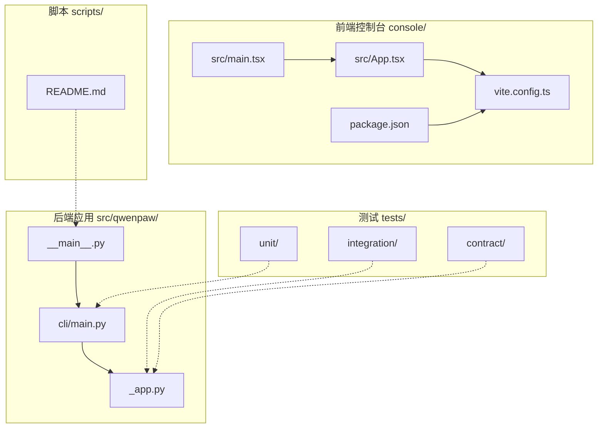
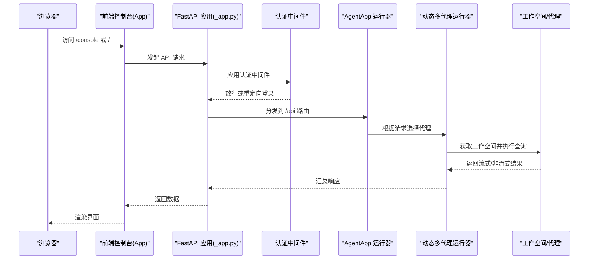
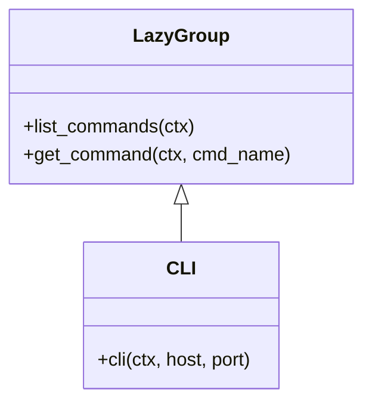
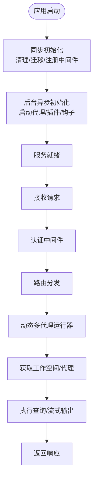
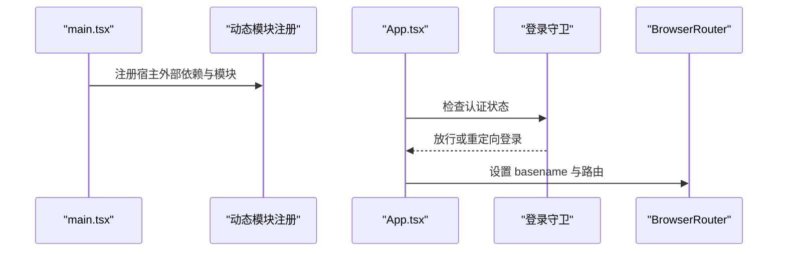
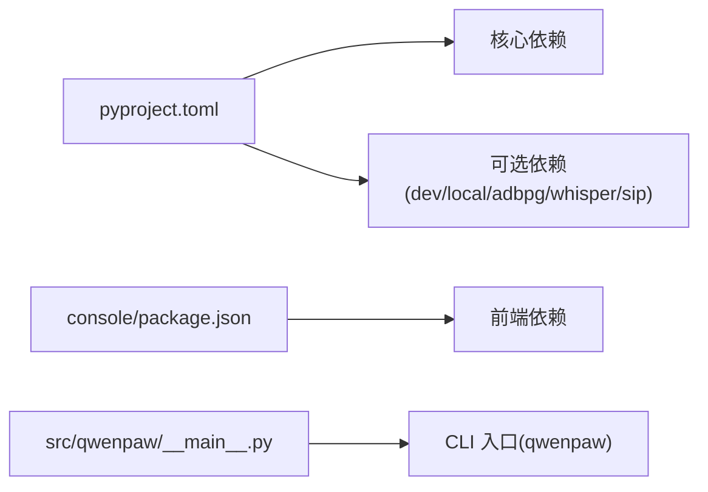

# 开发者指南

<cite>
**本文引用的文件**
- [README.md](file://README.md)
- [CONTRIBUTING.md](file://CONTRIBUTING.md)
- [pyproject.toml](file://pyproject.toml)
- [setup.py](file://setup.py)
- [Makefile](file://Makefile)
- [scripts/README.md](file://scripts/README.md)
- [console/package.json](file://console/package.json)
- [console/vite.config.ts](file://console/vite.config.ts)
- [console/eslint.config.js](file://console/eslint.config.js)
- [console/src/main.tsx](file://console/src/main.tsx)
- [console/src/App.tsx](file://console/src/App.tsx)
- [src/qwenpaw/__main__.py](file://src/qwenpaw/__main__.py)
- [src/qwenpaw/cli/main.py](file://src/qwenpaw/cli/main.py)
- [src/qwenpaw/app/_app.py](file://src/qwenpaw/app/_app.py)
</cite>

## 目录
1. [简介](#简介)
2. [项目结构](#项目结构)
3. [核心组件](#核心组件)
4. [架构总览](#架构总览)
5. [详细组件分析](#详细组件分析)
6. [依赖分析](#依赖分析)
7. [性能考虑](#性能考虑)
8. [故障排查指南](#故障排查指南)
9. [结论](#结论)
10. [附录](#附录)

## 简介
本指南面向希望参与 QwenPaw 开发的贡献者，覆盖从开发环境搭建、代码结构说明到贡献流程与质量标准的全流程。内容包括：
- 快速安装与本地开发环境准备（Python 与前端）
- 核心模块职责与交互关系（CLI、应用服务、通道、技能、插件等）
- 代码规范、测试策略与覆盖率要求
- 发布与打包流程（轮子构建、网站构建、Docker 镜像）
- 新功能开发、Bug 修复与性能优化的开发流程
- 代码审查、持续集成与自动化测试实践
- 调试技巧与性能分析建议
- 社区贡献、问题反馈与功能请求处理流程

## 项目结构
仓库采用“多语言混合”的分层组织方式：
- Python 后端与业务逻辑位于 src/qwenpaw/，包含 CLI、应用服务、通道、技能、插件、模型、安全、备份等子系统
- 前端控制台位于 console/，基于 React/Vite 构建，产物复制到 Python 包中供服务端静态托管
- 测试位于 tests/，按单元、集成、契约与端到端维度组织
- 插件示例位于 plugins/，包含工具型插件样例
- 自动化脚本位于 scripts/，涵盖轮子构建、网站构建、Docker 构建、测试运行等
- 文档与网站资源位于 website/

**图表来源**
- [console/src/main.tsx:1-41](file://console/src/main.tsx#L1-L41)
- [console/src/App.tsx:1-227](file://console/src/App.tsx#L1-L227)
- [console/vite.config.ts:1-167](file://console/vite.config.ts#L1-L167)
- [console/package.json:1-79](file://console/package.json#L1-L79)
- [src/qwenpaw/__main__.py:1-7](file://src/qwenpaw/__main__.py#L1-L7)
- [src/qwenpaw/cli/main.py:1-173](file://src/qwenpaw/cli/main.py#L1-L173)
- [src/qwenpaw/app/_app.py:1-719](file://src/qwenpaw/app/_app.py#L1-L719)
- [scripts/README.md:1-53](file://scripts/README.md#L1-L53)

**章节来源**
- [README.md: 安装与开发入口:444-466](file://README.md#L444-L466)
- [pyproject.toml: 包与依赖配置:1-152](file://pyproject.toml#L1-L152)
- [console/package.json: 前端依赖与脚本:1-79](file://console/package.json#L1-L79)
- [console/vite.config.ts: 构建与测试配置:1-167](file://console/vite.config.ts#L1-L167)
- [Makefile: 测试与覆盖率任务:1-57](file://Makefile#L1-L57)
- [scripts/README.md: 构建与测试脚本说明:1-53](file://scripts/README.md#L1-L53)

## 核心组件
- CLI 入口与命令分发
  - 通过 Click Group 实现延迟加载子命令，提升启动速度；支持版本选项与主机/端口参数传递
  - 关键路径参考：[src/qwenpaw/cli/main.py:58-173](file://src/qwenpaw/cli/main.py#L58-L173)
- 应用服务（FastAPI + AgentApp）
  - 生命周期管理：启动阶段快速完成同步初始化，后台异步加载代理、插件、令牌用量统计等
  - 动态多代理路由：根据请求头选择工作空间，统一流式查询与任务跟踪
  - 控制台静态资源托管与 SPA 回退
  - 关键路径参考：[src/qwenpaw/app/_app.py:220-719](file://src/qwenpaw/app/_app.py#L220-L719)
- 前端控制台
  - React + Ant Design + 多语言 i18n；动态模块注册与宿主外部依赖注入；路由守卫与主题上下文
  - 关键路径参考：[console/src/main.tsx:1-41](file://console/src/main.tsx#L1-L41)、[console/src/App.tsx:1-227](file://console/src/App.tsx#L1-L227)
- 包与脚手架
  - Python 包通过 setuptools 构建，动态版本与包数据；前端构建产物复制至包内
  - 关键路径参考：[setup.py:1-5](file://setup.py#L1-L5)、[pyproject.toml:51-78](file://pyproject.toml#L51-L78)

**章节来源**
- [src/qwenpaw/cli/main.py: 延迟加载与命令注册:58-173](file://src/qwenpaw/cli/main.py#L58-L173)
- [src/qwenpaw/app/_app.py: 生命周期与动态路由:220-719](file://src/qwenpaw/app/_app.py#L220-L719)
- [console/src/main.tsx: 宿主外部依赖与模块注册:1-41](file://console/src/main.tsx#L1-L41)
- [console/src/App.tsx: 路由守卫与国际化:62-117](file://console/src/App.tsx#L62-L117)
- [setup.py: 包入口:1-5](file://setup.py#L1-L5)
- [pyproject.toml: 版本与包数据:51-78](file://pyproject.toml#L51-L78)

## 架构总览
下图展示从浏览器到后端服务、再到代理执行器的整体调用链路与关键中间件。

**图表来源**
- [src/qwenpaw/app/_app.py: 路由与中间件注册:547-663](file://src/qwenpaw/app/_app.py#L547-L663)
- [src/qwenpaw/app/_app.py: 动态多代理运行器:72-204](file://src/qwenpaw/app/_app.py#L72-L204)
- [console/src/App.tsx: 登录守卫与路由:62-117](file://console/src/App.tsx#L62-L117)

## 详细组件分析

### CLI 组件分析
- 延迟加载机制
  - 使用自定义 LazyGroup，在首次访问时才导入对应模块，降低冷启动时间
  - 关键实现参考：[src/qwenpaw/cli/main.py:58-93](file://src/qwenpaw/cli/main.py#L58-L93)
- 子命令注册
  - 涵盖 app、channels、daemon、cron、env、init、models、skills、uninstall、desktop、update、shutdown、auth、agents、plugin、task、doctor 等
  - 关键实现参考：[src/qwenpaw/cli/main.py:95-146](file://src/qwenpaw/cli/main.py#L95-L146)
- 主机与端口参数
  - 支持通过命令行或上次运行记录设置默认 API 地址
  - 关键实现参考：[src/qwenpaw/cli/main.py:149-173](file://src/qwenpaw/cli/main.py#L149-L173)

**图表来源**
- [src/qwenpaw/cli/main.py: LazyGroup 与 CLI:58-173](file://src/qwenpaw/cli/main.py#L58-L173)

**章节来源**
- [src/qwenpaw/cli/main.py: 延迟加载与命令注册:58-173](file://src/qwenpaw/cli/main.py#L58-L173)

### 应用服务组件分析
- 生命周期管理
  - 启动阶段：清理恢复残留、自动注册凭据、遥测收集、迁移旧配置、初始化多代理管理器与本地模型管理器
  - 后台阶段：并行启动已配置代理、加载插件、注册控制命令与启动钩子、打印就绪横幅
  - 关键实现参考：[src/qwenpaw/app/_app.py:220-465](file://src/qwenpaw/app/_app.py#L220-L465)
- 动态多代理运行器
  - 通过请求头解析当前代理 ID，动态路由到对应工作空间，并进行任务跟踪与错误回传
  - 关键实现参考：[src/qwenpaw/app/_app.py:72-204](file://src/qwenpaw/app/_app.py#L72-L204)
- 中间件与路由
  - 认证中间件、CORS 中间件、代理作用域中间件、审批路由、语音通道路由、自定义通道路由优先级
  - 控制台静态资源挂载与 SPA 回退
  - 关键实现参考：[src/qwenpaw/app/_app.py:547-719](file://src/qwenpaw/app/_app.py#L547-L719)

**图表来源**
- [src/qwenpaw/app/_app.py: 生命周期与路由:220-719](file://src/qwenpaw/app/_app.py#L220-L719)

**章节来源**
- [src/qwenpaw/app/_app.py: 生命周期与动态路由:220-719](file://src/qwenpaw/app/_app.py#L220-L719)

### 前端控制台组件分析
- 宿主外部依赖注入与动态模块注册
  - 将 React、Ant Design 等宿主依赖暴露给插件模块，避免重复打包
  - 关键实现参考：[console/src/main.tsx:1-14](file://console/src/main.tsx#L1-L14)
- 路由守卫与国际化
  - 登录状态检查与跳转、语言偏好读取与切换、相对时间本地化
  - 关键实现参考：[console/src/App.tsx:62-164](file://console/src/App.tsx#L62-L164)
- 构建与测试配置
  - Vite 构建拆分 vendor chunk、CSS 模块、测试别名与覆盖率
  - 关键实现参考：[console/vite.config.ts:99-163](file://console/vite.config.ts#L99-L163)

**图表来源**
- [console/src/main.tsx: 宿主注入与模块注册:1-14](file://console/src/main.tsx#L1-L14)
- [console/src/App.tsx: 登录守卫与路由:62-117](file://console/src/App.tsx#L62-L117)
- [console/vite.config.ts: 构建与测试配置:99-163](file://console/vite.config.ts#L99-L163)

**章节来源**
- [console/src/main.tsx: 宿主注入与模块注册:1-14](file://console/src/main.tsx#L1-L14)
- [console/src/App.tsx: 登录守卫与路由:62-164](file://console/src/App.tsx#L62-L164)
- [console/vite.config.ts: 构建与测试配置:99-163](file://console/vite.config.ts#L99-L163)

## 依赖分析
- Python 依赖与可选依赖
  - 核心依赖：agentscope、uvicorn、apscheduler、playwright、pyyaml、cryptography、keyring、openai 等
  - 可选依赖：dev（测试与格式化）、local（HuggingFace Hub）、adbpg（PostgreSQL）、whisper（音频转录）、sip/sip-livekit（语音相关）
  - 关键路径参考：[pyproject.toml:7-114](file://pyproject.toml#L7-L114)
- 前端依赖
  - React 生态、Ant Design、Mermaid、i18n、Testing Library、Vitest 等
  - 关键路径参考：[console/package.json:21-76](file://console/package.json#L21-L76)
- 包数据与脚本入口
  - 动态版本、包数据包含 console、skills、tokenizer、安全规则等；CLI 入口为 qwenpaw
  - 关键路径参考：[pyproject.toml:51-78](file://pyproject.toml#L51-L78)

**图表来源**
- [pyproject.toml: 依赖与脚本入口:7-114](file://pyproject.toml#L7-L114)
- [console/package.json: 前端依赖:21-76](file://console/package.json#L21-L76)
- [src/qwenpaw/__main__.py: CLI 入口:1-7](file://src/qwenpaw/__main__.py#L1-L7)

**章节来源**
- [pyproject.toml: 依赖与脚本入口:7-114](file://pyproject.toml#L7-L114)
- [console/package.json: 前端依赖:21-76](file://console/package.json#L21-L76)
- [src/qwenpaw/__main__.py: CLI 入口:1-7](file://src/qwenpaw/__main__.py#L1-L7)

## 性能考虑
- 启动性能
  - CLI 使用延迟加载减少冷启动时间；应用服务在启动阶段仅做轻量同步初始化，后台异步加载重任务
  - 参考：[src/qwenpaw/cli/main.py:58-93](file://src/qwenpaw/cli/main.py#L58-L93)、[src/qwenpaw/app/_app.py:220-313](file://src/qwenpaw/app/_app.py#L220-L313)
- 构建体积与加载
  - 前端 Vite 手动拆分 vendor chunk，分离 React、UI、Markdown、拖拽、工具库等，降低首屏阻塞
  - 参考：[console/vite.config.ts:109-161](file://console/vite.config.ts#L109-L161)
- 并发与后台任务
  - 多代理并行启动、令牌用量后台刷新、浏览器实例统一停止，避免资源泄漏
  - 参考：[src/qwenpaw/app/_app.py:315-465](file://src/qwenpaw/app/_app.py#L315-L465)
- 测试与覆盖率
  - Makefile 提供快速反馈与全量覆盖率报告；pytest 配置标记慢/单元/契约/集成测试
  - 参考：[Makefile:10-30](file://Makefile#L10-L30)、[pyproject.toml:116-127](file://pyproject.toml#L116-L127)

**章节来源**
- [src/qwenpaw/cli/main.py: 延迟加载:58-93](file://src/qwenpaw/cli/main.py#L58-L93)
- [src/qwenpaw/app/_app.py: 启动与后台任务:220-465](file://src/qwenpaw/app/_app.py#L220-L465)
- [console/vite.config.ts: 构建拆分:109-161](file://console/vite.config.ts#L109-L161)
- [Makefile: 测试与覆盖率:10-30](file://Makefile#L10-L30)
- [pyproject.toml: 测试标记:116-127](file://pyproject.toml#L116-L127)

## 故障排查指南
- 启动失败与恢复
  - 启动前清理恢复残留；若失败，检查日志定位具体异常；必要时手动恢复或清理
  - 参考：[src/qwenpaw/app/_app.py:232-242](file://src/qwenpaw/app/_app.py#L232-L242)
- 插件与钩子
  - 插件加载失败或钩子执行异常会记录错误日志；可在关闭流程中观察关闭钩子执行情况
  - 参考：[src/qwenpaw/app/_app.py:323-431](file://src/qwenpaw/app/_app.py#L323-L431)
- 本地模型服务
  - 关闭时尝试优雅关闭本地模型服务器，失败则回退到同步关闭
  - 参考：[src/qwenpaw/app/_app.py:507-520](file://src/qwenpaw/app/_app.py#L507-L520)
- 浏览器实例
  - 关闭时统一停止所有浏览器实例，避免进程残留
  - 参考：[src/qwenpaw/app/_app.py:536-542](file://src/qwenpaw/app/_app.py#L536-L542)
- 前端控制台
  - SPA 回退与静态资源挂载顺序需在 API 路由之后，避免冲突
  - 参考：[src/qwenpaw/app/_app.py:668-719](file://src/qwenpaw/app/_app.py#L668-L719)

**章节来源**
- [src/qwenpaw/app/_app.py: 启动与关闭流程:232-542](file://src/qwenpaw/app/_app.py#L232-L542)
- [src/qwenpaw/app/_app.py: 静态资源与 SPA 回退:668-719](file://src/qwenpaw/app/_app.py#L668-L719)

## 结论
本指南从环境搭建、代码结构、核心组件、依赖关系、性能与故障排查等方面，为贡献者提供了系统化的开发指引。遵循本文的流程与规范，可高效地完成新功能开发、Bug 修复与性能优化，并确保代码质量与交付稳定性。

## 附录

### 开发环境搭建
- 安装与构建
  - 前端：进入 console/，执行依赖安装与构建，产物复制到 Python 包目录
  - Python：在仓库根目录安装可编辑模式，包含 dev 与 full 可选依赖
  - 参考：[README.md 安装从源码:444-466](file://README.md#L444-L466)、[scripts/README.md 构建说明:1-53](file://scripts/README.md#L1-L53)
- 初始化与运行
  - 使用 qwenpaw init 初始化配置，再运行 qwenpaw app 启动服务
  - 参考：[README.md 快速开始:118-130](file://README.md#L118-L130)

**章节来源**
- [README.md: 安装与初始化:118-130](file://README.md#L118-L130)
- [scripts/README.md: 构建脚本:1-53](file://scripts/README.md#L1-L53)

### 贡献流程与规范
- 提交信息与 PR 格式
  - 遵循 Conventional Commits；PR 标题与类型保持一致
  - 参考：[CONTRIBUTING.md 提交信息格式:23-67](file://CONTRIBUTING.md#L23-L67)
- 本地门禁与质量
  - 安装 dev 与 full 依赖，安装并运行 pre-commit，执行 pytest
  - 参考：[CONTRIBUTING.md 本地门禁:70-85](file://CONTRIBUTING.md#L70-L85)
- 前端格式化
  - 修改 console/ 或 website/ 时，先运行格式化脚本
  - 参考：[CONTRIBUTING.md 前端格式化:80-84](file://CONTRIBUTING.md#L80-L84)
- 文档更新
  - 用户可见行为变更需同步更新文档
  - 参考：[CONTRIBUTING.md 文档更新](file://CONTRIBUTING.md#L85)

**章节来源**
- [CONTRIBUTING.md: 提交与质量:23-85](file://CONTRIBUTING.md#L23-L85)

### 测试策略与覆盖率
- 测试分类与标记
  - 单元/集成/契约测试；支持慢测试标记与选择性运行
  - 参考：[pyproject.toml 测试标记:119-124](file://pyproject.toml#L119-L124)
- Makefile 快速反馈
  - 提供快速测试、全量覆盖率、清理等常用目标
  - 参考：[Makefile 测试目标:10-30](file://Makefile#L10-L30)
- 前端测试
  - Vitest 配置包含别名、覆盖率与排除规则
  - 参考：[console/vite.config.ts 测试配置:50-95](file://console/vite.config.ts#L50-L95)

**章节来源**
- [pyproject.toml: 测试标记:119-124](file://pyproject.toml#L119-L124)
- [Makefile: 测试目标:10-30](file://Makefile#L10-L30)
- [console/vite.config.ts: 前端测试配置:50-95](file://console/vite.config.ts#L50-L95)

### 发布与打包流程
- 轮子构建
  - 构建前端 → 复制到 Python 包 → 打包 wheel
  - 参考：[scripts/README.md 轮子构建:5-11](file://scripts/README.md#L5-L11)
- 网站构建
  - 安装依赖并构建网站产物
  - 参考：[scripts/README.md 网站构建:13-19](file://scripts/README.md#L13-L19)
- Docker 镜像
  - 多阶段构建：先构建前端，再构建 Python 应用
  - 参考：[scripts/README.md Docker 构建:21-29](file://scripts/README.md#L21-L29)

**章节来源**
- [scripts/README.md: 构建与打包:5-29](file://scripts/README.md#L5-L29)

### 新功能开发、Bug 修复与性能优化流程
- 新功能开发
  - 在 CLI、应用服务、通道、技能、插件等模块中扩展；编写单元/集成/契约测试；更新文档
  - 参考：[CONTRIBUTING.md 贡献类型:89-206](file://CONTRIBUTING.md#L89-L206)
- Bug 修复
  - 明确问题范围与影响面；补充最小可复现测试；提交修复与回归测试
  - 参考：[CONTRIBUTING.md Do's and Don'ts:208-226](file://CONTRIBUTING.md#L208-L226)
- 性能优化
  - 启动阶段减少 I/O、后台异步化；前端 chunk 拆分与懒加载；测试覆盖率与性能指标监控
  - 参考：[src/qwenpaw/app/_app.py 启动与后台任务:220-465](file://src/qwenpaw/app/_app.py#L220-L465)、[console/vite.config.ts 构建拆分:109-161](file://console/vite.config.ts#L109-L161)

**章节来源**
- [CONTRIBUTING.md: 贡献类型与规范:89-226](file://CONTRIBUTING.md#L89-L226)
- [src/qwenpaw/app/_app.py: 启动与后台任务:220-465](file://src/qwenpaw/app/_app.py#L220-L465)
- [console/vite.config.ts: 构建拆分:109-161](file://console/vite.config.ts#L109-L161)

### 代码审查、持续集成与自动化测试实践
- 代码审查
  - 严格遵循提交信息与 PR 格式；避免大而杂的 PR；尊重审查意见并及时更新
  - 参考：[CONTRIBUTING.md Do's and Don'ts:208-226](file://CONTRIBUTING.md#L208-L226)
- 持续集成
  - PR 需通过本地门禁（pre-commit、pytest）方可合并
  - 参考：[CONTRIBUTING.md 本地门禁:70-85](file://CONTRIBUTING.md#L70-L85)
- 自动化测试
  - 使用 Makefile 与脚本统一运行测试；前端使用 Vitest；后端使用 pytest
  - 参考：[Makefile 测试:10-30](file://Makefile#L10-L30)、[scripts/README.md 测试运行:30-52](file://scripts/README.md#L30-L52)

**章节来源**
- [CONTRIBUTING.md: 本地门禁与规范:70-85](file://CONTRIBUTING.md#L70-L85)
- [Makefile: 测试目标:10-30](file://Makefile#L10-L30)
- [scripts/README.md: 测试运行:30-52](file://scripts/README.md#L30-L52)

### 开发工具使用、调试技巧与性能分析
- 前端开发
  - 使用 Vite 开发服务器与热更新；ESLint 规则与 Prettier 格式化；Vitest 覆盖率
  - 参考：[console/vite.config.ts:46-95](file://console/vite.config.ts#L46-L95)、[console/eslint.config.js:1-29](file://console/eslint.config.js#L1-L29)
- 后端开发
  - 使用 Click 延迟加载与日志；FastAPI 路由与中间件；pytest 异步模式
  - 参考：[src/qwenpaw/cli/main.py:58-93](file://src/qwenpaw/cli/main.py#L58-L93)、[pyproject.toml:116-118](file://pyproject.toml#L116-L118)
- 调试技巧
  - CLI 启动计时日志；应用启动横幅；日志文件落盘；关闭钩子验证
  - 参考：[src/qwenpaw/cli/main.py:24-56](file://src/qwenpaw/cli/main.py#L24-L56)、[src/qwenpaw/app/_app.py:454-458](file://src/qwenpaw/app/_app.py#L454-L458)

**章节来源**
- [console/vite.config.ts: 开发与测试配置:46-95](file://console/vite.config.ts#L46-L95)
- [console/eslint.config.js: ESLint 规则:1-29](file://console/eslint.config.js#L1-L29)
- [src/qwenpaw/cli/main.py: 启动计时与日志:24-56](file://src/qwenpaw/cli/main.py#L24-L56)
- [src/qwenpaw/app/_app.py: 启动横幅与日志:454-458](file://src/qwenpaw/app/_app.py#L454-L458)

### 社区贡献方式、问题反馈与功能请求
- 讨论与协作
  - 使用 GitHub Discussions 讨论想法与任务；关注 Issues 与路线图
  - 参考：[CONTRIBUTING.md 获取帮助:229-235](file://CONTRIBUTING.md#L229-L235)
- 问题与功能请求
  - 在 Issues 中描述现状、期望与复现步骤；必要时附带截图或日志
  - 参考：[CONTRIBUTING.md 贡献类型:89-206](file://CONTRIBUTING.md#L89-L206)

**章节来源**
- [CONTRIBUTING.md: 获取帮助与贡献类型:229-235](file://CONTRIBUTING.md#L229-L235)